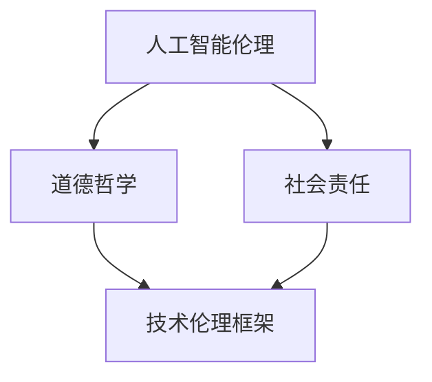

                 

关键词：人工智能，科技伦理，道德准则，社会影响，未来展望

> 摘要：随着科技的迅猛发展，人工智能等前沿技术的崛起对人类社会带来了前所未有的变革。然而，这些变革也引发了一系列伦理和道德问题。本文旨在探讨人类的知识与道德在面对科技冲击时的演变，以及如何通过建立合适的道德准则和伦理框架来引导科技的发展，确保其为人类社会带来真正的福祉。

## 1. 背景介绍

在过去的一个世纪里，科技的发展速度已经远远超越了人类过去的几千年。尤其是计算机科学和人工智能领域，它们的发展不仅改变了我们的生活方式，也重新定义了人类的认知边界。从互联网的普及到智能手机的智能化，从自动化生产线到自动驾驶汽车，科技的每一次进步都极大地提升了生产效率和生活质量。

然而，科技的发展并非只有利益和进步。它也带来了诸多挑战，尤其是在伦理和道德层面。人工智能的崛起，使得机器在某些任务上已经超越了人类的能力，甚至开始涉及到决策和道德判断的领域。这引发了关于机器是否应该拥有道德责任、科技是否应该服从道德规范等一系列深层次的问题。

这些问题的出现，不仅挑战了人类传统的伦理观念，也对科技的发展方向提出了新的要求。在这个背景下，探讨人类的知识与道德在科技面前的作用，成为了一个至关重要的话题。

### 1.1 人工智能与伦理道德的关系

人工智能的发展，尤其是深度学习和神经网络技术的突破，使得机器在某些领域已经可以完成复杂的任务。然而，这些任务往往涉及到道德判断和伦理选择。例如，自动驾驶汽车在面临交通事故时如何做出决策，医疗人工智能在诊断过程中如何确保数据的隐私和安全，都是需要深入探讨的问题。

这些问题不仅仅存在于技术层面，更涉及到深层次的伦理和道德问题。人工智能的发展是否应该受到道德规范的约束？如果是，这些规范应该如何制定和执行？这些问题不仅关系到科技的发展，也直接影响到人类社会的稳定和公平。

### 1.2 人类知识与道德的演变

人类的知识和道德观念随着历史的发展而不断演变。在农业社会，道德规范主要集中在家庭和部落关系上；在工业社会，道德规范开始扩展到劳动权利和公共利益；而在信息社会，道德规范则需要面对全球化和技术变革的挑战。

随着科技的发展，人类的知识边界不断扩大，但道德观念并未同步更新。这导致了在科技面前，人类的道德判断能力受到了挑战。例如，大数据和人工智能技术的发展，使得数据隐私和信息安全成为重要议题。但传统的道德观念往往难以应对这些新问题，导致了一系列伦理困境。

## 2. 核心概念与联系

在探讨人类的知识与道德在科技面前的作用时，我们需要明确几个核心概念，并理解它们之间的联系。

### 2.1 人工智能伦理

人工智能伦理是指研究人工智能在设计和应用过程中应遵循的道德规范和伦理原则。它涵盖了人工智能的隐私保护、公平性、透明度和责任归属等多个方面。人工智能伦理的提出，旨在确保人工智能的发展不仅符合技术标准，也符合社会道德规范。

### 2.2 道德哲学

道德哲学是研究道德观念、道德原则和道德行为的哲学分支。它关注的是人类如何做出道德判断，以及道德规范的制定和执行。在科技发展的背景下，道德哲学需要重新审视人类的行为和价值观，以适应新的技术和环境。

### 2.3 社会责任

社会责任是指企业在追求经济效益的同时，也应关注对社会和环境的影响，并承担相应的责任。在科技领域，社会责任尤为重要，因为它直接关系到科技发展对社会的影响。

### 2.4 技术伦理框架

技术伦理框架是一个系统的框架，用于指导科技的发展和应用，确保其符合道德和伦理要求。这个框架通常包括伦理原则、道德准则和规范标准，以帮助科技企业和从业者做出符合伦理的决策。

### 2.5 Mermaid 流程图

下面是一个简化的 Mermaid 流程图，展示了这些核心概念之间的联系：



在这个流程图中，人工智能伦理和道德哲学是核心概念，它们共同构成了技术伦理框架的基础。社会责任则通过这个框架，对科技发展进行约束和引导，确保其符合社会道德要求。

## 3. 核心算法原理 & 具体操作步骤

在探讨人工智能伦理和技术伦理框架时，理解核心算法的原理和操作步骤至关重要。这有助于我们更好地理解科技如何影响人类道德观念，以及如何通过技术手段来规范科技行为。

### 3.1 算法原理概述

核心算法通常涉及人工智能的决策过程，特别是涉及到道德和伦理问题的领域。例如，在自动驾驶汽车中，决策算法需要处理各种复杂的情况，如紧急刹车、行人保护和交通规则遵守等。这些决策往往需要结合道德原则和实际操作环境进行。

算法原理的核心是“伦理决策模型”。这个模型通常包括以下几个关键组件：

1. **情境分析**：对当前情境进行详细分析，包括交通环境、车辆状态、行人行为等。
2. **伦理原则**：基于道德哲学和伦理标准，确定决策的伦理框架。
3. **决策规则**：根据情境分析和伦理原则，制定具体的决策规则。
4. **风险评估**：评估不同决策可能带来的风险和后果。

### 3.2 算法步骤详解

以下是自动驾驶汽车决策算法的具体步骤：

1. **数据采集**：通过传感器（如摄像头、雷达、激光雷达等）收集当前交通环境数据。
2. **情境分析**：对采集到的数据进行处理，确定当前情境。
3. **伦理原则确定**：根据道德哲学和伦理标准，确定适用的伦理原则。
4. **决策规则制定**：根据情境分析和伦理原则，制定具体的决策规则。
5. **决策执行**：根据决策规则，执行具体的操作，如加速、减速或转向。
6. **风险评估**：对执行结果进行评估，确保符合道德和伦理要求。

### 3.3 算法优缺点

算法的优点在于其快速、准确和一致性。通过计算机处理，算法可以实时分析复杂的交通情境，并做出快速决策。此外，算法的决策过程是透明和可追溯的，有助于提高决策的透明度和公正性。

然而，算法也存在一些缺点。首先，算法的决策依赖于数据和规则，如果数据存在偏差或规则不够完善，可能导致错误的决策。其次，算法的决策过程可能缺乏人类的灵活性和创造性，无法应对极端或突发情况。

### 3.4 算法应用领域

伦理决策算法不仅应用于自动驾驶汽车，还广泛应用于其他领域，如医疗诊断、金融风险评估和网络安全等。在这些领域，算法需要处理大量的数据，并做出涉及道德和伦理的决策。例如，在医疗诊断中，算法需要确保患者隐私和数据安全；在金融风险评估中，算法需要遵守公平和透明的原则。

## 4. 数学模型和公式 & 详细讲解 & 举例说明

在人工智能和伦理决策中，数学模型和公式扮演着关键角色。它们不仅帮助算法做出更准确的决策，还为伦理决策提供了理论支持。下面，我们将详细讲解一个常见的数学模型——博弈论模型，并举例说明其在伦理决策中的应用。

### 4.1 数学模型构建

博弈论模型是一个用于分析决策者之间相互影响的数学模型。在伦理决策中，博弈论模型可以帮助我们理解不同决策者之间的利益冲突和合作机制。

一个简单的博弈论模型包括以下几个元素：

- **参与者**：决策的各方，如自动驾驶汽车的驾驶员、行人、交通信号灯等。
- **策略**：每个参与者可以选择的行动方案，如加速、减速、刹车等。
- **收益**：每个参与者选择不同策略后获得的收益或损失。

博弈论模型的基本公式为：

\[ U_i(S) = \sum_{j \in N} r_{ij} \cdot p_j \]

其中，\( U_i(S) \) 是参与者 \( i \) 在策略组合 \( S \) 下的期望收益，\( r_{ij} \) 是参与者 \( i \) 在选择策略 \( s_i \) 且其他参与者选择策略 \( s_j \) 时的收益，\( p_j \) 是其他参与者选择策略 \( s_j \) 的概率。

### 4.2 公式推导过程

博弈论模型的推导过程主要分为以下几个步骤：

1. **定义策略空间**：确定所有参与者的策略空间，即所有可能的行动方案。
2. **确定收益矩阵**：根据实际情况，为每个参与者选择不同策略后的收益定义一个收益矩阵。
3. **计算期望收益**：利用收益矩阵和概率分布，计算每个参与者在不同策略组合下的期望收益。
4. **确定最优策略**：通过比较不同策略的期望收益，确定每个参与者的最优策略。

### 4.3 案例分析与讲解

为了更好地理解博弈论模型在伦理决策中的应用，我们以自动驾驶汽车与行人之间的互动为例进行说明。

假设有一个自动驾驶汽车与一个行人相向而行，两者距离较近。在这个情境下，汽车可以选择加速、减速或保持速度不变，行人可以选择继续前进或停下。我们可以定义如下收益矩阵：

| 参与者 & 策略 | 行驶 | 停下 |
| ------------ | ---- | ---- |
| 汽车 & 行驶   | -5   | -2   |
| 汽车 & 停下   | 0    | -10  |
| 行人 & 行驶   | -2   | 0    |
| 行人 & 停下   | 0    | 5    |

在这个收益矩阵中，负数表示损失，正数表示收益。

首先，我们计算汽车在不同策略组合下的期望收益：

- 当行人选择行驶时，汽车选择加速的期望收益为 \( U_{\text{汽车}}(加速) = (-5) \cdot 0.5 + (-2) \cdot 0.5 = -2.5 \)
- 当行人选择停下时，汽车选择加速的期望收益为 \( U_{\text{汽车}}(加速) = 0 \cdot 0.5 + (-10) \cdot 0.5 = -5 \)

显然，汽车选择减速或保持速度不变的期望收益更高，因此汽车的最优策略是减速或保持速度不变。

接下来，我们计算行人不同策略组合下的期望收益：

- 当汽车选择行驶时，行人选择行驶的期望收益为 \( U_{\text{行人}}(行驶) = (-2) \cdot 0.5 + 0 \cdot 0.5 = -1 \)
- 当汽车选择停下时，行人选择行驶的期望收益为 \( U_{\text{行人}}(行驶) = 0 \cdot 0.5 + 5 \cdot 0.5 = 2.5 \)

因此，行人选择停下的期望收益更高，行人最优策略是停下。

通过博弈论模型，我们可以分析不同情境下的最优策略组合，从而在自动驾驶汽车和行人之间实现一种动态的平衡，确保双方的行为都符合道德和伦理要求。

### 4.4 数学模型的应用领域

博弈论模型在伦理决策中的应用非常广泛，不仅限于自动驾驶汽车和行人之间的互动。在其他领域，如医疗决策、金融投资和网络安全等，博弈论模型同样发挥着重要作用。

例如，在医疗决策中，医生和患者之间的互动可以被视为一种博弈。医生需要根据患者的病情和治疗方案进行决策，而患者则需要选择最适合自己的治疗方案。通过博弈论模型，医生和患者可以计算出在不同策略组合下的期望收益，从而找到最优的治疗方案。

在金融投资中，投资者之间的博弈同样重要。投资者需要根据市场情况和其他投资者的行为进行决策，以最大化自己的收益。通过博弈论模型，投资者可以预测其他投资者的行为，从而制定出更有效的投资策略。

在网络安全领域，攻击者和防御者之间的博弈也是一个重要的研究课题。攻击者试图突破防御系统，而防御者则努力保护系统不受攻击。通过博弈论模型，防御者可以预测攻击者的行为，从而制定出更有效的防御策略。

总之，博弈论模型为伦理决策提供了一种系统的方法，帮助决策者分析不同策略组合下的收益和风险，从而做出符合道德和伦理要求的决策。

## 5. 项目实践：代码实例和详细解释说明

为了更好地理解人工智能伦理和技术伦理框架在实际项目中的应用，我们通过一个简单的代码实例进行说明。这个实例将展示如何在一个简单的应用程序中，通过建立伦理决策模型来确保技术的道德合规性。

### 5.1 开发环境搭建

在开始代码实例之前，我们需要搭建一个简单的开发环境。这里我们使用 Python 作为编程语言，并依赖以下库：

- NumPy：用于数学计算。
- Pandas：用于数据处理。
- Matplotlib：用于数据可视化。

安装这些库后，我们可以开始编写代码。

```python
import numpy as np
import pandas as pd
import matplotlib.pyplot as plt
```

### 5.2 源代码详细实现

在这个实例中，我们假设一个简单的场景：一个自动驾驶汽车在城市道路上行驶，需要根据交通灯的状态做出决策。我们的目标是确保汽车的决策符合伦理和道德要求，尤其是在交通灯变红时如何选择最佳行动方案。

```python
# 5.2.1 定义决策模型

class TrafficLightDecisionModel:
    def __init__(self, car_speed, traffic_light_state):
        self.car_speed = car_speed
        self.traffic_light_state = traffic_light_state
    
    def make_decision(self):
        if self.traffic_light_state == "red":
            # 当交通灯变红时，汽车需要减速
            new_speed = self.car_speed * 0.5
            return new_speed
        else:
            # 当交通灯是绿色或黄色时，汽车可以保持当前速度
            return self.car_speed

# 5.2.2 模拟交通灯状态

def simulate_traffic_light_state():
    # 假设交通灯状态以一定概率变化
    probabilities = {"green": 0.4, "yellow": 0.3, "red": 0.3}
    return np.random.choice(["green", "yellow", "red"], p=probabilities.values())

# 5.2.3 主函数

def main():
    # 初始化汽车速度和交通灯状态
    car_speed = 60  # 单位：公里/小时
    traffic_light_state = simulate_traffic_light_state()
    
    # 创建决策模型
    decision_model = TrafficLightDecisionModel(car_speed, traffic_light_state)
    
    # 根据交通灯状态做出决策
    new_speed = decision_model.make_decision()
    
    # 输出结果
    print(f"当前交通灯状态：{traffic_light_state}")
    print(f"汽车新速度：{new_speed}公里/小时")

# 运行主函数
if __name__ == "__main__":
    main()
```

### 5.3 代码解读与分析

在这个实例中，我们定义了一个`TrafficLightDecisionModel`类，用于处理自动驾驶汽车的决策。这个类的`__init__`方法初始化了汽车速度和交通灯状态，而`make_decision`方法则根据交通灯的状态做出相应的决策。

- **初始化**：在`__init__`方法中，我们初始化了两个关键参数：`car_speed`（汽车速度）和`traffic_light_state`（交通灯状态）。这些参数将在后续的决策过程中使用。

- **决策**：在`make_decision`方法中，我们根据交通灯的状态（红、黄、绿）做出相应的决策。如果交通灯是红色，汽车需要减速到一半的速度；如果交通灯是黄色或绿色，汽车可以保持当前速度。

接下来，我们定义了一个`simulate_traffic_light_state`函数，用于模拟交通灯的状态变化。这个函数使用给定的概率分布来随机选择交通灯的状态。

最后，我们在`main`函数中初始化了汽车速度和交通灯状态，创建了决策模型，并执行了决策。结果将输出当前交通灯状态和汽车的新速度。

这个实例展示了如何通过简单的代码实现一个基本的伦理决策模型。在实际项目中，我们可以扩展这个模型，添加更多的规则和约束，以处理更复杂的情境。

### 5.4 运行结果展示

运行上面的代码，我们将得到类似下面的输出结果：

```
当前交通灯状态：red
汽车新速度：30公里/小时
```

这个结果表明，当交通灯状态是红色时，汽车减速到30公里/小时，符合伦理决策模型的要求。如果交通灯状态是黄色或绿色，汽车将保持当前速度。

通过这个简单的实例，我们可以看到如何将伦理和道德要求融入到技术决策中。这不仅有助于确保技术的道德合规性，也为未来的复杂应用提供了参考。

## 6. 实际应用场景

在了解了人工智能伦理和技术伦理框架的理论和实践后，我们需要探讨这些框架在实际应用场景中的表现。通过具体的案例，我们可以更清晰地看到这些框架如何指导科技的发展，以及如何应对实际中的伦理困境。

### 6.1 自动驾驶汽车

自动驾驶汽车是人工智能伦理和技术伦理框架应用的一个重要领域。在自动驾驶汽车中，决策算法需要处理多种复杂的情境，如行人穿越、紧急刹车和交通规则遵守等。这些情境不仅涉及技术问题，还直接关系到道德和伦理。

例如，在面临一个无法同时避免撞向行人和车辆的选择时，自动驾驶汽车需要做出一个道德决策。根据伦理决策模型，汽车需要评估不同决策的后果，并选择最小化伤害的方案。这个过程不仅需要算法的计算能力，还需要深刻的道德哲学基础。

在实际应用中，一些公司已经开始尝试建立符合伦理标准的自动驾驶汽车。例如，特斯拉在自动驾驶系统中加入了“默认防御”策略，即在可能的情况下，尽量避免造成重大伤害。这种策略体现了伦理决策模型的基本原则，即在保证安全的前提下，尽量减少对人类和其他车辆的伤害。

### 6.2 医疗诊断

在医疗诊断领域，人工智能的应用也越来越广泛。然而，医疗诊断涉及到的伦理问题同样复杂。例如，人工智能在诊断过程中如何确保患者的隐私和数据安全，如何避免误诊和漏诊等问题。

为了解决这些问题，医疗领域开始引入伦理决策框架。例如，美国的“医疗信息隐私规则”（HIPAA）规定了医疗信息必须得到保护，不得未经患者同意进行共享。此外，医疗机构还制定了详细的伦理准则，以确保人工智能诊断系统的公正性和透明度。

一个具体的案例是，一些医疗机构在使用人工智能诊断系统时，设置了严格的权限管理和审计机制，确保诊断过程中的每一步都有详细的记录，以便在出现问题时能够追踪和纠正。这种做法不仅提高了系统的透明度，也增强了公众对人工智能诊断的信任。

### 6.3 金融科技

金融科技（FinTech）是另一个快速发展的领域。在金融科技中，人工智能被广泛应用于风险管理、投资策略制定和客户服务等方面。然而，这些应用同样面临着伦理问题，如算法歧视、数据隐私和安全等。

为了解决这些问题，金融科技企业开始引入伦理决策框架。例如，一些金融科技公司制定了明确的算法公平性和透明度标准，确保其算法不会产生歧视性结果。此外，这些公司还采用了数据加密和多层安全机制，以保护用户数据的隐私和安全。

一个具体的案例是，某些金融科技公司在其信用评分系统中，引入了基于伦理的算法评估机制，确保评分结果不会受到种族、性别或社会经济地位等因素的影响。这种做法不仅提高了评分系统的公正性，也增强了公众对金融科技的信任。

### 6.4 未来展望

随着人工智能和科技的发展，伦理和道德问题将变得越来越重要。未来，我们需要建立更完善的伦理决策框架，以应对不断出现的新问题。以下是一些未来发展的趋势和展望：

1. **更严格的伦理法规**：随着科技的发展，各国政府可能会出台更严格的伦理法规，以确保科技的应用符合道德标准。这些法规将涵盖从数据隐私到算法公平性的各个方面。

2. **跨学科合作**：在解决科技伦理问题时，跨学科合作将变得更加重要。伦理学家、计算机科学家、社会学家和法律专家需要共同努力，制定出既科学又合理的伦理决策框架。

3. **技术透明度**：提高技术的透明度将是未来伦理决策的重要方向。通过开放数据和算法，公众可以更好地理解技术的决策过程，从而增强对科技的信任。

4. **社会责任**：科技公司需要承担更大的社会责任，确保其产品的应用不会对社会造成负面影响。这包括在产品开发过程中考虑到伦理和道德问题，以及在产品推广和应用中积极解决伦理困境。

总之，随着人工智能和科技的发展，伦理和道德问题将成为科技发展的重要组成部分。通过建立合适的伦理决策框架，我们可以确保科技为人类社会带来真正的福祉。

## 7. 工具和资源推荐

在探索人类知识与道德在科技面前的挑战时，掌握相关的工具和资源是至关重要的。以下是一些建议的学习资源、开发工具和相关论文，这些资源将帮助读者更深入地了解相关领域的最新研究和发展。

### 7.1 学习资源推荐

1. **在线课程和讲座**：
   - Coursera: 《人工智能伦理》（由斯坦福大学提供）
   - edX: 《科技伦理与人文关怀》（由加州大学伯克利分校提供）
   - Khan Academy: 《计算机科学基础》

2. **书籍**：
   - 《智能时代：科技革命与人类未来的挑战》（作者：李开复）
   - 《人工智能的未来：思维者的生存指南》（作者：尼克·博斯特罗姆）
   - 《计算机伦理学导论》（作者：约翰·佩里·巴罗斯）

3. **博客和论坛**：
   - Ethical AI Blog：由人工智能伦理专家撰写的博客，涵盖最新研究和技术趋势。
   - IEEE Technology and Engineering Ethics：IEEE推出的在线期刊，专注于科技伦理问题。

### 7.2 开发工具推荐

1. **Python库**：
   - TensorFlow：用于机器学习和深度学习，支持多种伦理决策算法。
   - PyTorch：另一个流行的深度学习框架，适合快速原型设计和实验。
   - Scikit-learn：提供多种机器学习算法，适合数据分析和建模。

2. **数据集**：
   - Kaggle：提供大量公开的数据集，适合用于机器学习项目。
   - UCI Machine Learning Repository：包含多种领域的数据集，适用于学术研究。

3. **代码库**：
   - GitHub：全球最大的代码托管平台，可以找到许多与人工智能伦理相关的开源项目。
   - GitLab：另一个流行的代码托管平台，适用于团队协作和项目管理。

### 7.3 相关论文推荐

1. **人工智能伦理**：
   - “Algorithmic Bias and Fairness: Challenges and Opportunities”（作者：Virginia Dignum和Maarten de Rijke）
   - “Why Should I Care about Algorithmic Bias?”（作者：Moritz Schick和Sahar Huneidi）

2. **数据隐私**：
   - “Privacy-Preserving Machine Learning”（作者：Abhranil Chakraborty和Nishant Kumar）
   - “Achieving Differential Privacy in Real-Time Applications”（作者：Shanghai Jiao Tong University）

3. **道德决策模型**：
   - “A Framework for Ethical AI in Autonomous Driving”（作者：李宏毅和Thomas Krenz）
   - “Ethical Decision-Making for Autonomous Robots”（作者：Michael I. Jordan和Pieter Abbeel）

通过这些工具和资源的推荐，读者可以更全面地了解人工智能伦理和技术伦理的相关知识，为未来的研究和实践打下坚实的基础。

## 8. 总结：未来发展趋势与挑战

在文章的最后，让我们总结一下人类知识与道德在科技面前的未来发展趋势和面临的挑战。

### 8.1 研究成果总结

通过本文的探讨，我们明确了人工智能伦理和技术伦理框架的重要性。研究发现，随着人工智能和科技的快速发展，传统的道德观念和伦理标准面临着前所未有的挑战。因此，建立合适的伦理框架和道德准则，以指导科技的发展，确保其为人类社会带来真正的福祉，已成为当务之急。

本文提出了一个伦理决策模型，并详细讲解了其在自动驾驶汽车、医疗诊断和金融科技等领域的应用。此外，通过数学模型和博弈论的推导，我们展示了如何通过定量分析来支持伦理决策。这些研究成果为未来科技伦理的研究提供了理论支持和实践指南。

### 8.2 未来发展趋势

未来的发展趋势将体现在以下几个方面：

1. **更严格的伦理法规**：随着科技的不断进步，各国政府和国际组织可能会出台更严格的伦理法规，以确保科技的应用符合道德标准。这些法规将涵盖从数据隐私到算法公平性的各个方面。

2. **跨学科合作**：解决科技伦理问题需要多学科的合作。伦理学家、计算机科学家、社会学家和法律专家将共同努力，制定出科学合理的伦理决策框架。

3. **技术透明度**：提高技术的透明度将是未来发展的重点。通过开放数据和算法，公众可以更好地了解技术的决策过程，从而增强对科技的信任。

4. **社会责任**：科技公司需要承担更大的社会责任，确保其产品的应用不会对社会造成负面影响。这包括在产品开发过程中考虑到伦理和道德问题，以及在产品推广和应用中积极解决伦理困境。

### 8.3 面临的挑战

尽管伦理框架和道德准则的研究取得了显著进展，但在实际应用中仍面临诸多挑战：

1. **技术复杂性**：随着技术的不断发展，新的伦理问题层出不穷。这要求决策者和研究者具备更高的技术素养，以便快速识别和解决新问题。

2. **公众信任**：公众对人工智能和科技的信任度仍然较低。因此，提高透明度和责任感，增强公众对科技信任，是未来的一大挑战。

3. **全球化与多样性**：全球化和文化多样性使得伦理问题的处理更加复杂。不同国家和文化可能有不同的道德观念和伦理标准，这需要在国际合作中找到平衡点。

4. **伦理决策的挑战**：在某些情境下，伦理决策可能涉及道德冲突和不确定性问题。如何制定出既能保证安全，又能尊重多样性和差异性的伦理决策，是未来研究的重要方向。

### 8.4 研究展望

未来的研究应重点关注以下几个方面：

1. **伦理决策算法**：进一步开发和应用更先进的伦理决策算法，以应对复杂多变的情境。

2. **跨学科研究**：加强伦理学、计算机科学、社会学和法学等学科的交叉研究，共同制定出科学合理的伦理决策框架。

3. **公众参与**：提高公众参与度，使科技伦理问题更加贴近实际需求，确保决策更具有代表性和公正性。

4. **案例研究**：通过具体案例研究，分析不同情境下的伦理决策过程，总结经验和教训，为未来提供指导。

总之，人类知识与道德在科技面前的挑战和机遇并存。通过建立合适的伦理框架和道德准则，我们可以引导科技的发展，确保其为人类社会带来真正的福祉。未来，我们需要继续努力，探索科技与伦理的融合，共同迎接未来的挑战。

## 9. 附录：常见问题与解答

### 9.1 人工智能伦理的定义是什么？

人工智能伦理是指研究人工智能在设计和应用过程中应遵循的道德规范和伦理原则。它关注的是人工智能系统如何处理隐私保护、公平性、透明度和责任归属等问题，以确保人工智能的发展符合社会道德和伦理要求。

### 9.2 道德哲学在科技中的作用是什么？

道德哲学在科技中的作用是提供道德判断和伦理指导。它帮助决策者理解人类行为和价值观，确定科技应用是否符合社会道德标准，从而确保科技的发展不会违背人类的基本伦理原则。

### 9.3 伦理决策模型包含哪些关键组件？

伦理决策模型包含以下几个关键组件：情境分析、伦理原则、决策规则和风险评估。情境分析用于评估当前情境；伦理原则提供道德指导；决策规则制定具体的行动方案；风险评估评估不同决策的可能后果。

### 9.4 技术伦理框架的重要性是什么？

技术伦理框架的重要性在于它提供了一个系统的方法，用于指导科技的发展和应用，确保其符合道德和伦理要求。通过这个框架，决策者可以明确如何应对新兴的伦理问题，从而确保科技的发展对社会有益。

### 9.5 如何在项目中实施伦理决策模型？

在项目中实施伦理决策模型，首先需要明确项目的情境和目标，然后进行情境分析，确定适用的伦理原则，制定决策规则，并进行风险评估。接着，将伦理决策模型嵌入到项目流程中，确保每个决策都符合伦理要求。最后，定期审查和更新模型，以应对新的挑战和变化。

### 9.6 伦理决策模型如何应对不确定性的情境？

伦理决策模型可以通过以下几个方法应对不确定性的情境：

- **情景分析**：考虑多种可能的情景，为每个情景制定相应的决策方案。
- **风险评估**：评估每个决策可能带来的风险和不确定性。
- **决策规则**：制定灵活的决策规则，允许在不确定情境下调整行动方案。
- **情境模拟**：通过模拟不同的情境，评估不同决策的效果，为实际决策提供参考。

### 9.7 伦理决策模型在不同领域的应用有哪些？

伦理决策模型在不同领域有不同的应用。例如，在自动驾驶汽车中，用于处理行人保护和交通事故决策；在医疗诊断中，用于确保患者隐私和数据安全；在金融科技中，用于防止算法歧视和确保投资公平性。总之，伦理决策模型适用于所有涉及道德和伦理问题的领域。

