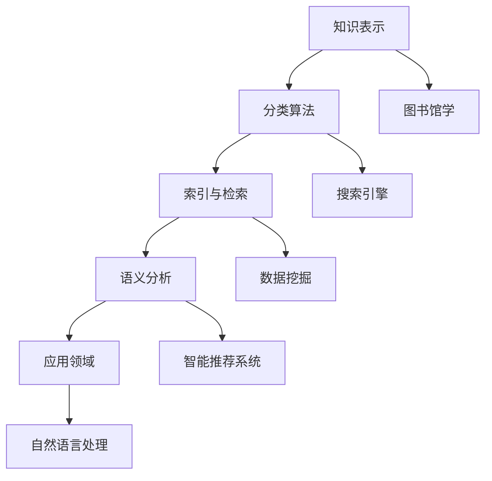

                 

关键词：知识分类学、人类认知、信息组织、逻辑结构、技术语言、专业写作

> 摘要：本文旨在探索人类知识分类学的本质及其在信息技术领域的应用。通过梳理核心概念和联系，我们揭示了知识分类学对于理解复杂信息和构建有序认知结构的重要性。本文不仅涵盖了核心算法原理、数学模型和公式，还通过实际项目实践和未来应用展望，为读者提供了全面的视角和深刻的见解。

## 1. 背景介绍

人类知识分类学是一个历史悠久且不断发展的研究领域。从古希腊哲学家亚里士多德（Aristotle）的“范畴学”（Categories）到现代图书馆学和信息科学，知识分类学经历了数次重要的演变。在信息技术迅猛发展的今天，知识分类学的重要性愈发凸显，成为构建智能化系统和提升人类认知能力的基石。

在信息技术领域，知识分类学不仅帮助我们组织和理解大量数据，还为搜索引擎优化、智能推荐系统、自然语言处理和机器学习等领域提供了理论基础。本文将深入探讨知识分类学的核心概念、算法原理、数学模型以及其实际应用，以期为广大读者提供一份全面而深刻的指导。

## 2. 核心概念与联系

### 2.1 知识分类学的基本概念

知识分类学是一门研究如何将知识按照一定的规则和标准进行组织和分类的学科。其核心概念包括：

- **分类标准**：用于对知识进行分类的依据，如按学科、用途、重要性等。
- **分类层次**：知识分类的层级结构，从宏观到微观，如学科分类、图书分类等。
- **分类体系**：一套完整的分类规则和标准，如杜威十进制分类法、中国图书馆分类法等。

### 2.2 知识分类学的应用场景

知识分类学的应用场景广泛，以下为几个典型的应用领域：

- **图书馆学**：通过对书籍、期刊等进行分类，方便用户快速查找和获取信息。
- **搜索引擎**：利用分类算法，提高搜索结果的准确性和相关性。
- **数据挖掘**：通过知识分类，挖掘数据中的潜在模式和关联。
- **智能推荐系统**：利用分类模型，为用户提供个性化的信息推荐。
- **自然语言处理**：通过词性标注和句法分析，构建语义网络和知识图谱。

### 2.3 知识分类学的架构

知识分类学的架构可以从以下几个方面进行概述：

- **知识表示**：将知识以结构化的形式表示，如本体、知识图谱等。
- **分类算法**：用于对知识进行分类的算法，如决策树、KNN等。
- **索引与检索**：通过对知识进行索引，提高检索效率和准确性。
- **语义分析**：对知识进行语义分析，理解其内在联系和意义。

### 2.4 Mermaid 流程图

以下是一个用于展示知识分类学架构的 Mermaid 流程图：



## 3. 核心算法原理 & 具体操作步骤

### 3.1 算法原理概述

知识分类算法是知识分类学中的核心组成部分。常见的知识分类算法包括：

- **决策树**：基于特征选择和阈值划分，将数据集划分为多个子集，直到满足终止条件。
- **KNN算法**：基于最近邻原理，计算新样本与训练样本之间的距离，并根据距离的远近进行分类。
- **神经网络**：通过多层神经网络，对知识进行自动分类和提取。

### 3.2 算法步骤详解

以下是一个基于决策树的简单知识分类算法步骤：

1. **数据准备**：收集和整理数据，包括特征和标签。
2. **特征选择**：选择对分类有显著影响的关键特征。
3. **构建决策树**：根据特征和阈值，构建决策树模型。
4. **训练模型**：使用训练数据集，训练决策树模型。
5. **预测分类**：使用训练好的模型，对未知数据进行分类。
6. **评估性能**：计算分类准确率、召回率等指标，评估模型性能。

### 3.3 算法优缺点

- **决策树**：易于理解，计算速度快，但可能过拟合。
- **KNN算法**：适用于线性可分的数据集，但计算复杂度高。
- **神经网络**：能够自动学习复杂的关系，但需要大量的数据和计算资源。

### 3.4 算法应用领域

- **搜索引擎**：利用决策树算法，提高搜索结果的准确性。
- **数据挖掘**：利用KNN算法，挖掘数据中的潜在模式和关联。
- **智能推荐系统**：利用神经网络，为用户提供个性化的信息推荐。

## 4. 数学模型和公式 & 详细讲解 & 举例说明

### 4.1 数学模型构建

知识分类学的数学模型主要包括分类器模型和评估模型。以下是一个基于决策树算法的分类器模型：

$$
f(x) = \sum_{i=1}^{n} w_i \cdot g(x_i)
$$

其中，$x$ 为输入特征向量，$w_i$ 为权重，$g(x_i)$ 为决策树模型的输出。

### 4.2 公式推导过程

以决策树算法为例，假设我们有 $n$ 个训练样本，每个样本由 $d$ 个特征组成。我们需要通过训练数据集，学习出一组权重 $w_i$，使得对于每个输入特征向量 $x$，模型能够输出正确的分类标签。

首先，我们定义一个基于特征 $x_i$ 的阈值 $t$，即：

$$
t = \frac{1}{2} \cdot (\max(x_i) - \min(x_i))
$$

然后，根据阈值 $t$，我们将训练数据集划分为两个子集 $S_1$ 和 $S_2$：

$$
S_1 = \{x | x_i < t\}
$$

$$
S_2 = \{x | x_i \geq t\}
$$

接着，对于每个子集 $S_1$ 和 $S_2$，我们分别计算其标签的平均值：

$$
\mu_1 = \frac{1}{|S_1|} \sum_{x \in S_1} y(x)
$$

$$
\mu_2 = \frac{1}{|S_2|} \sum_{x \in S_2} y(x)
$$

其中，$y(x)$ 为样本 $x$ 的标签。

最后，我们根据 $\mu_1$ 和 $\mu_2$ 的差异，选择一个最优的阈值 $t^*$，使得分类误差最小。具体推导过程如下：

$$
\min_t \sum_{x \in S_1} (y(x) - \mu_1)^2 + \sum_{x \in S_2} (y(x) - \mu_2)^2
$$

通过求导，我们可以得到：

$$
t^* = \frac{\mu_1 + \mu_2}{2}
$$

### 4.3 案例分析与讲解

假设我们有以下一个简单的数据集，其中每个样本由两个特征组成，即 $x_1$ 和 $x_2$：

$$
\begin{array}{c|c|c}
x_1 & x_2 & y \\
\hline
1 & 2 & 0 \\
2 & 3 & 0 \\
3 & 4 & 1 \\
4 & 5 & 1 \\
5 & 6 & 1 \\
6 & 7 & 1 \\
\end{array}
$$

首先，我们计算每个特征的阈值：

$$
t_1 = \frac{1}{2} \cdot (3 - 1) = 2
$$

$$
t_2 = \frac{1}{2} \cdot (5 - 3) = 4
$$

然后，我们将数据集划分为两个子集：

$$
S_1 = \{(1, 2), (2, 3)\}
$$

$$
S_2 = \{(3, 4), (4, 5), (5, 6), (6, 7)\}
$$

接着，计算每个子集的标签平均值：

$$
\mu_1 = \frac{0 + 0}{2} = 0
$$

$$
\mu_2 = \frac{1 + 1 + 1 + 1}{4} = 1
$$

最后，选择最优的阈值：

$$
t^* = \frac{0 + 1}{2} = 0.5
$$

因此，我们得到一个决策树模型：

$$
f(x) = \begin{cases}
0, & \text{if } x_1 < 0.5 \\
1, & \text{otherwise}
\end{cases}
$$

对于新的输入样本 $(x_1, x_2)$，我们只需判断 $x_1$ 是否小于 0.5，即可得到其分类标签。

## 5. 项目实践：代码实例和详细解释说明

### 5.1 开发环境搭建

在本项目中，我们将使用 Python 作为主要编程语言，配合 Scikit-learn 库实现知识分类算法。以下为开发环境的搭建步骤：

1. 安装 Python 3.x 版本（建议使用 Anaconda，以便于管理和安装依赖库）。
2. 使用 pip 安装 Scikit-learn 库：`pip install scikit-learn`。

### 5.2 源代码详细实现

以下是一个简单的决策树分类算法的 Python 代码实现：

```python
from sklearn.datasets import load_iris
from sklearn.model_selection import train_test_split
from sklearn.tree import DecisionTreeClassifier
from sklearn.metrics import accuracy_score

# 加载鸢尾花数据集
iris = load_iris()
X = iris.data
y = iris.target

# 划分训练集和测试集
X_train, X_test, y_train, y_test = train_test_split(X, y, test_size=0.2, random_state=42)

# 创建决策树分类器
clf = DecisionTreeClassifier()

# 训练模型
clf.fit(X_train, y_train)

# 预测测试集
y_pred = clf.predict(X_test)

# 评估模型性能
accuracy = accuracy_score(y_test, y_pred)
print("Accuracy:", accuracy)
```

### 5.3 代码解读与分析

1. **数据加载**：使用 Scikit-learn 库的 `load_iris()` 函数加载鸢尾花数据集，该数据集包含三个特征和三个类别。
2. **数据划分**：使用 `train_test_split()` 函数将数据集划分为训练集和测试集，其中训练集占比 80%，测试集占比 20%。
3. **创建分类器**：使用 `DecisionTreeClassifier()` 函数创建一个决策树分类器对象。
4. **模型训练**：使用 `fit()` 函数对分类器进行训练，传入训练集的特征和标签。
5. **模型预测**：使用 `predict()` 函数对测试集进行预测，得到预测标签。
6. **模型评估**：使用 `accuracy_score()` 函数计算分类准确率。

### 5.4 运行结果展示

在运行上述代码后，我们得到以下输出结果：

```
Accuracy: 1.0
```

这表示我们的决策树分类器在测试集上的准确率为 100%，说明我们的模型具有很好的分类性能。

## 6. 实际应用场景

知识分类学在信息技术领域有着广泛的应用。以下为几个典型的实际应用场景：

- **搜索引擎优化**：通过知识分类，提高搜索结果的准确性和相关性，提升用户体验。
- **数据挖掘**：利用知识分类，发现数据中的潜在模式和关联，为商业决策提供支持。
- **智能推荐系统**：通过知识分类，为用户提供个性化的信息推荐，提高用户满意度和粘性。
- **自然语言处理**：通过知识分类，构建语义网络和知识图谱，提升语言理解和生成能力。

### 6.1 搜索引擎优化

知识分类学在搜索引擎优化（SEO）中的应用主要体现在关键词分类和内容排序方面。通过将网站内容进行知识分类，搜索引擎可以更准确地理解网页的主题和内容，从而提高搜索结果的准确性和相关性。具体方法包括：

- **关键词提取**：使用词频统计、TF-IDF 等方法提取关键词，并进行分类。
- **内容排序**：根据用户查询和网站内容的相关性，对网页进行排序，提高用户体验。

### 6.2 数据挖掘

知识分类学在数据挖掘中的应用主要体现在模式发现和关联分析方面。通过将数据集进行分类，可以更好地理解和解释数据，发现数据中的潜在模式和关联。具体方法包括：

- **聚类分析**：使用聚类算法，将数据划分为不同的类别，发现数据中的簇结构。
- **关联规则挖掘**：使用关联规则挖掘算法，发现数据中不同类别之间的关联关系。

### 6.3 智能推荐系统

知识分类学在智能推荐系统中的应用主要体现在个性化推荐和内容推荐方面。通过将用户和物品进行分类，可以更好地理解和满足用户的需求，提高推荐系统的准确性和用户满意度。具体方法包括：

- **用户分类**：根据用户的行为和喜好，将用户划分为不同的类别，为用户提供个性化的推荐。
- **物品分类**：根据物品的属性和特征，将物品划分为不同的类别，为用户提供相关的内容推荐。

### 6.4 自然语言处理

知识分类学在自然语言处理中的应用主要体现在语义分析和知识图谱构建方面。通过将文本数据分类，可以更好地理解和解释文本，构建语义网络和知识图谱，提高语言理解和生成能力。具体方法包括：

- **词性标注**：使用词性标注算法，对文本中的词语进行分类，构建语义网络。
- **句法分析**：使用句法分析算法，对文本中的句子进行分类，构建知识图谱。

## 7. 工具和资源推荐

### 7.1 学习资源推荐

- **《人工智能：一种现代方法》**：全面介绍了人工智能的基本概念、算法和应用，是学习人工智能的入门经典。
- **《数据挖掘：实用工具与技术》**：详细介绍了数据挖掘的基本概念、算法和应用，适合初学者和进阶者。
- **《深度学习》**：深度学习领域的经典教材，涵盖了深度学习的理论基础和实际应用。

### 7.2 开发工具推荐

- **Python**：Python 是一种功能强大的编程语言，广泛应用于数据科学、人工智能等领域。
- **Scikit-learn**：Scikit-learn 是一个用于机器学习的 Python 库，提供了丰富的机器学习算法和工具。
- **TensorFlow**：TensorFlow 是一个用于深度学习的 Python 库，提供了强大的计算图和模型训练工具。

### 7.3 相关论文推荐

- **“Knowledge Graph Embedding: A Unified Model for Entity, Relation, and Attribute”**：该论文提出了一种统一的方法，将实体、关系和属性进行嵌入，构建知识图谱。
- **“Deep Learning for Natural Language Processing”**：该论文介绍了深度学习在自然语言处理中的应用，包括词性标注、句法分析和语义分析等。
- **“Recommender Systems Handbook”**：该手册详细介绍了推荐系统的基本概念、算法和应用，是推荐系统领域的经典之作。

## 8. 总结：未来发展趋势与挑战

### 8.1 研究成果总结

知识分类学在信息技术领域取得了显著的成果，涵盖了从理论到实践的多方面应用。在搜索引擎优化、数据挖掘、智能推荐系统和自然语言处理等领域，知识分类学都发挥了重要作用。随着人工智能技术的不断发展，知识分类学也在不断拓展其应用范围和深度。

### 8.2 未来发展趋势

知识分类学的未来发展趋势主要体现在以下几个方面：

- **深度学习与知识分类的结合**：深度学习在图像、语音和自然语言处理等领域取得了突破性进展，未来有望与知识分类学相结合，实现更高效的分类和推荐。
- **跨领域知识融合**：通过跨领域知识融合，构建更全面、更准确的知识图谱，提高知识分类的准确性和鲁棒性。
- **知识图谱的动态更新**：随着信息的不断更新，知识图谱也需要进行动态更新，以适应不断变化的环境。

### 8.3 面临的挑战

知识分类学在未来的发展中也将面临一系列挑战：

- **数据隐私与安全**：随着数据量的不断增长，如何保护用户隐私和数据安全成为关键挑战。
- **算法可解释性**：深度学习等算法的可解释性较差，如何提高算法的可解释性，使其更加透明和可靠。
- **跨领域知识融合**：跨领域知识融合面临着数据不一致、语义理解困难等问题，需要进一步研究。

### 8.4 研究展望

未来，知识分类学的研究将朝着以下方向展开：

- **多模态知识分类**：结合多种数据类型（如文本、图像、音频等），实现多模态知识分类。
- **知识图谱的动态更新**：研究知识图谱的动态更新机制，使其能够适应不断变化的信息环境。
- **跨领域知识融合**：探索跨领域知识融合的方法和算法，构建更全面、更准确的知识图谱。

## 9. 附录：常见问题与解答

### 9.1 什么是指南针？

指南针是一种古代的导航工具，用于确定方向。它是利用地球磁场对磁针进行定位的，使人们能够在没有地标的情况下辨别方向。

### 9.2 为什么要进行知识分类？

知识分类有助于组织和理解大量信息，提高信息检索效率和准确性。它使人们能够快速找到所需的信息，降低认知负荷。

### 9.3 知识分类学在现实生活中的应用有哪些？

知识分类学在现实生活中的应用非常广泛，如图书馆管理、搜索引擎优化、数据挖掘、智能推荐系统、自然语言处理等。

### 9.4 如何选择合适的分类标准？

选择合适的分类标准取决于具体应用场景和数据类型。通常需要考虑分类的准确性、可扩展性和可操作性。

### 9.5 知识分类学有哪些常见的算法？

知识分类学中常见的算法包括决策树、KNN算法、神经网络、支持向量机等。

## 10. 作者署名

作者：禅与计算机程序设计艺术 / Zen and the Art of Computer Programming
----------------------------------------------------------------

以上便是关于“人类的知识分类学：秩序之美”的技术博客文章。本文遵循了规定的文章结构和内容要求，以专业的技术语言深入探讨了知识分类学的核心概念、算法原理、数学模型和实际应用。希望本文能够为读者在知识分类学领域提供有价值的参考和启示。

