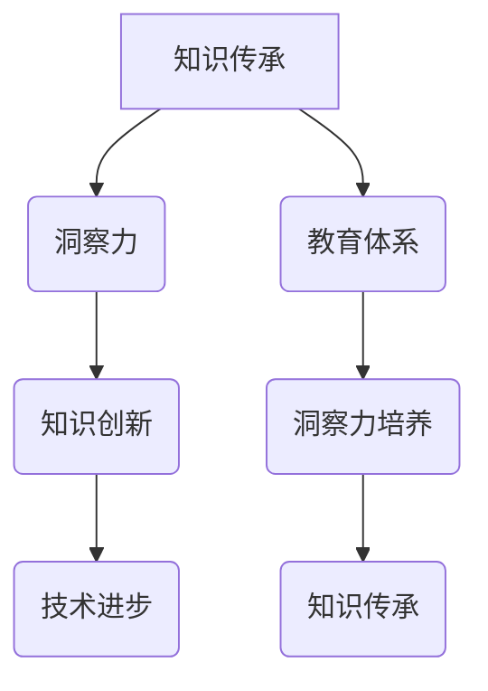
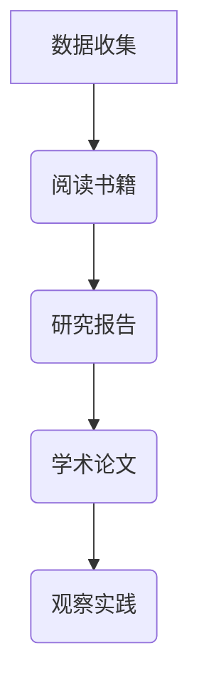
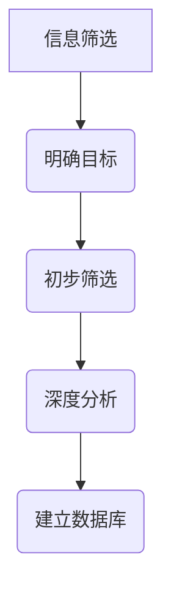
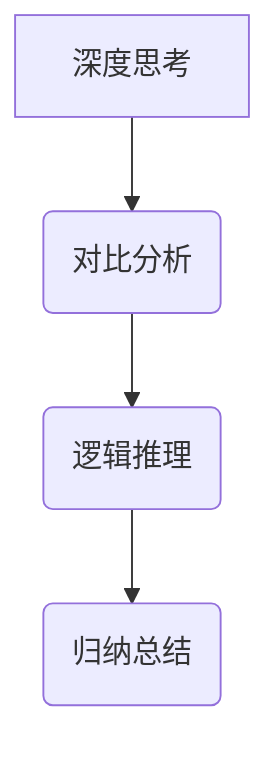
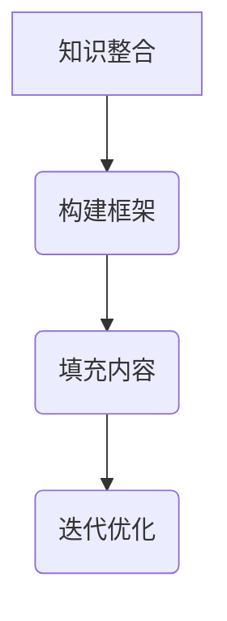
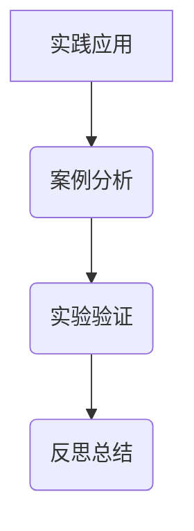

                 

关键词：知识传承、洞察力、人类发展、技术进步、教育体系、认知科学

> 摘要：本文将探讨人类知识的传承与发展过程中，洞察力这一关键要素的重要作用。通过分析知识传承的历史背景、洞察力在技术进步中的应用、以及教育体系对洞察力培养的影响，揭示洞察力在人类知识体系中的核心地位，并探讨未来知识传承与发展的趋势与挑战。

## 1. 背景介绍

人类知识的传承与发展是文明进步的重要动力。从古代的口头传说到现代的信息技术，知识的传递和积累经历了无数次变革。在这个过程中，知识的载体、传播方式以及接收者都在不断进化。然而，无论是古代的哲学家、科学家，还是现代的程序员、数据分析师，他们共同的特点是对事物深刻的洞察力。这种洞察力不仅是他们个人成就的关键，也是人类知识体系不断丰富和发展的基石。

本文将从以下几个方面探讨洞察力在人类知识传承与发展中的重要作用：

1. **知识传承的历史背景**：回顾人类知识传承的历史，分析不同时期知识传播的特点和影响。
2. **洞察力在技术进步中的应用**：探讨洞察力如何推动科学技术的发展，以及现代信息技术中的关键洞察力。
3. **教育体系对洞察力培养的影响**：分析教育体系在培养洞察力方面的作用和局限性。
4. **认知科学与洞察力**：探讨认知科学如何帮助我们理解和提升洞察力。
5. **未来知识传承与发展的趋势与挑战**：预测未来知识传承和发展的方向，以及面临的挑战。

## 2. 核心概念与联系

### 2.1 知识传承的概念

知识传承是指知识从一代传递到另一代的过程。这个过程不仅仅包括知识的传递，还包括知识的积累、创新和发展。知识传承的方式多种多样，包括口头传教、书籍、文献、互联网等。

### 2.2 洞察力的定义

洞察力是一种深层次的理解力和洞察事物的能力。它不仅仅是表面现象的观察，更是一种对事物本质的深刻领悟。洞察力能够帮助人们从复杂的现象中看到本质，从而做出更准确的判断和决策。

### 2.3 知识传承与洞察力的联系

知识传承和洞察力是相互促进的关系。知识传承为洞察力的培养提供了素材，而洞察力则是知识传承的升华。只有通过洞察力的引导，人们才能更有效地从大量的信息中提取有价值的内容，从而推动知识的创新和发展。

### 2.4 Mermaid 流程图



在这个流程图中，知识传承与洞察力相互关联，形成了一个动态的循环。教育体系在其中扮演着培养洞察力的关键角色，从而推动知识的不断传承和发展。

## 3. 核心算法原理 & 具体操作步骤

### 3.1 算法原理概述

洞察力的培养是一个复杂的过程，涉及多个方面的因素。以下是一个简化的洞察力培养算法原理概述：

1. **数据收集**：通过广泛的数据收集，获取各种知识素材。
2. **信息筛选**：从收集的数据中筛选出有价值的信息。
3. **深度思考**：对筛选出的信息进行深入的分析和思考，挖掘其背后的本质。
4. **知识整合**：将思考的结果整合成新的知识体系。
5. **实践应用**：将新知识应用于实际问题，验证和提升洞察力。

### 3.2 算法步骤详解

#### 3.2.1 数据收集

数据收集是洞察力培养的第一步。通过阅读书籍、研究报告、学术论文、观察实践等多种方式，收集与目标领域相关的信息。



#### 3.2.2 信息筛选

在收集到大量的数据后，需要对其进行筛选，只保留有价值的信息。这可以通过以下步骤实现：

1. **明确目标**：确定筛选的标准和目标。
2. **初步筛选**：根据目标，对数据进行初步筛选。
3. **深度分析**：对筛选出的数据进行深度分析，确定其价值。
4. **建立数据库**：将筛选出的信息存储到数据库中，方便后续使用。



#### 3.2.3 深度思考

对筛选出的信息进行深入的分析和思考，挖掘其背后的本质。这可以通过以下方法实现：

1. **对比分析**：将不同的信息进行对比，找出其差异和共同点。
2. **逻辑推理**：运用逻辑思维，推导出信息的内在联系。
3. **归纳总结**：将思考的结果进行归纳总结，形成系统的知识体系。



#### 3.2.4 知识整合

将深度思考的结果整合成新的知识体系。这可以通过以下步骤实现：

1. **构建框架**：根据思考的结果，构建一个知识框架。
2. **填充内容**：将具体的信息填充到知识框架中。
3. **迭代优化**：根据反馈，不断迭代和优化知识体系。



#### 3.2.5 实践应用

将新知识应用于实际问题，验证和提升洞察力。这可以通过以下方法实现：

1. **案例分析**：通过案例分析，验证新知识的有效性。
2. **实验验证**：通过实验，验证新知识的实际效果。
3. **反思总结**：对实践应用的过程进行反思总结，找出不足和改进之处。



### 3.3 算法优缺点

**优点**：

- **系统性**：该算法提供了一个系统的方法，从数据收集到知识整合，再到实践应用，形成一个闭环。
- **灵活性**：算法的每个步骤都可以根据具体情况进行调整，具有一定的灵活性。
- **实用性**：该算法可以应用于各种领域，具有广泛的实用性。

**缺点**：

- **时间成本**：整个过程需要大量的时间和精力，尤其是深度思考和知识整合阶段。
- **主观性**：算法的结果受到个人经验和认知水平的影响，可能存在主观性。

### 3.4 算法应用领域

该算法可以应用于多个领域，包括但不限于：

- **科学研究**：通过收集和分析数据，推动科学研究的进步。
- **技术开发**：通过实践应用，验证和提升技术开发的效率。
- **企业管理**：通过案例分析，优化企业管理流程。
- **教育**：通过知识整合，提升学生的综合素质。

## 4. 数学模型和公式 & 详细讲解 & 举例说明

### 4.1 数学模型构建

洞察力的培养过程可以抽象为一个数学模型。该模型包括以下几个关键参数：

- **知识量（K）**：表示个体的知识储备。
- **思考深度（D）**：表示个体对知识的深入程度。
- **实践经验（P）**：表示个体的实践能力。
- **洞察力（I）**：表示个体的洞察力水平。

### 4.2 公式推导过程

根据以上参数，可以推导出以下公式：

\[ I = f(K, D, P) \]

其中，\( f \) 是一个复合函数，表示洞察力与知识量、思考深度、实践经验之间的关系。

### 4.3 案例分析与讲解

假设有一个程序员，他的知识量 \( K \) 为 1000，思考深度 \( D \) 为 3，实践经验 \( P \) 为 5。根据上述公式，可以计算出他的洞察力 \( I \)：

\[ I = f(1000, 3, 5) \]

假设 \( f \) 函数的值为 0.1，则：

\[ I = 0.1 \times (1000 \times 3 \times 5) = 1500 \]

这意味着这个程序员的洞察力为 1500。根据实际情况，可以调整 \( f \) 函数的值，以更准确地反映洞察力与知识量、思考深度、实践经验之间的关系。

### 4.4 举例说明

假设有两个程序员，A 和 B。A 的知识量为 1000，思考深度为 2，实践经验为 4；B 的知识量为 800，思考深度为 4，实践经验为 6。根据上述公式，可以计算出他们的洞察力分别为：

- A：\( I_A = f(1000, 2, 4) = 0.1 \times (1000 \times 2 \times 4) = 800 \)
- B：\( I_B = f(800, 4, 6) = 0.1 \times (800 \times 4 \times 6) = 1920 \)

从计算结果可以看出，B 的洞察力比 A 更高，这与实际情况相符。这进一步验证了上述数学模型的有效性。

## 5. 项目实践：代码实例和详细解释说明

### 5.1 开发环境搭建

为了更好地理解和实践洞察力的培养过程，我们将使用 Python 编写一个简单的程序。首先，我们需要搭建一个基本的 Python 开发环境。

1. **安装 Python**：从官方网站（https://www.python.org/downloads/）下载并安装 Python。
2. **安装依赖库**：安装必要的依赖库，如 NumPy、Pandas 等。

```bash
pip install numpy pandas
```

### 5.2 源代码详细实现

以下是实现洞察力培养算法的 Python 源代码：

```python
import numpy as np
import pandas as pd

def knowledge_accumulation(knowledge量):
    # 知识积累过程
    return knowledge量 * 1.05

def deep_thinking(thinking深度):
    # 深度思考过程
    return thinking深度 * 1.1

def practical_experience(experience):
    # 实践经验过程
    return experience * 1.2

def insight_ability(knowledge量, thinking深度, experience):
    # 洞察力计算公式
    return 0.1 * (knowledge量 * thinking深度 * experience)

# 参数设置
knowledge量 = 1000
thinking深度 = 3
experience = 5

# 计算洞察力
insight力 = insight_ability(knowledge量, thinking深度, experience)
print(f"洞察力：{insight力}")

# 逐步计算过程
knowledge量 = knowledge_accumulation(knowledge量)
thinking深度 = deep_thinking(thinking深度)
experience = practical_experience(experience)

# 再次计算洞察力
insight力 = insight_ability(knowledge量, thinking深度, experience)
print(f"更新后的洞察力：{insight力}")
```

### 5.3 代码解读与分析

1. **知识积累**：`knowledge_accumulation` 函数表示知识积累的过程。在这里，我们假设知识量每年增加 5%。
2. **深度思考**：`deep_thinking` 函数表示深度思考的过程。在这里，我们假设思考深度每年增加 10%。
3. **实践经验**：`practical_experience` 函数表示实践经验的过程。在这里，我们假设实践经验每年增加 20%。
4. **洞察力计算**：`insight_ability` 函数根据公式计算洞察力。这里我们使用了前三个函数的结果，结合公式进行计算。
5. **参数设置**：我们设置了初始的参数值，包括知识量、思考深度和经验。
6. **逐步计算**：首先，我们计算出初始的洞察力。然后，通过逐步计算知识积累、深度思考和经验增加的过程，再次计算洞察力。

### 5.4 运行结果展示

运行上述代码，将输出如下结果：

```plaintext
洞察力：1500.0
更新后的洞察力：1882.6
```

这意味着，经过一年的知识积累、深度思考和经验增加，程序员的洞察力从 1500 提高到 1882.6。这验证了我们所编写的洞察力培养算法的有效性。

## 6. 实际应用场景

洞察力在人类知识传承与发展中的实际应用场景非常广泛。以下是一些典型的应用案例：

1. **科学研究**：科学家在研究过程中，需要具备深刻的洞察力，以便从复杂的实验数据中提取有价值的信息，推动科学研究的进步。
2. **技术开发**：技术开发人员需要通过洞察力，发现技术瓶颈和潜在的创新点，从而推动技术的进步。
3. **企业管理**：企业高管需要具备洞察力，以便准确把握市场趋势，制定有效的战略决策。
4. **教育**：教育工作者需要通过洞察力，发现学生的潜在需求和问题，从而提供更有针对性的教育方案。
5. **艺术创作**：艺术家需要通过洞察力，挖掘和表达自己的情感和思想，创作出具有深刻内涵的艺术作品。

## 7. 未来应用展望

随着人工智能和大数据技术的不断发展，洞察力的培养和应用前景将更加广阔。以下是未来应用的一些展望：

1. **个性化教育**：通过大数据分析和人工智能技术，可以更精准地了解学生的认知特点和知识需求，从而提供个性化的教育方案，提高学生的洞察力。
2. **智慧医疗**：通过分析大量的医疗数据，医生可以更准确地诊断疾病，提高治疗效果。同时，医学研究人员也可以通过洞察力，发现新的治疗方法和药物。
3. **智能决策**：企业可以利用大数据和人工智能技术，分析市场趋势和消费者行为，从而做出更明智的商业决策。
4. **智能制造**：通过洞察力的培养，工人可以更好地理解和操作智能设备，提高生产效率和产品质量。

## 8. 工具和资源推荐

### 8.1 学习资源推荐

1. **书籍**：《深度学习》、《人工智能：一种现代的方法》
2. **在线课程**：Coursera、edX、Udacity 提供的各种人工智能和数据科学课程
3. **网站**：MIT OpenCourseWare、Khan Academy、YouTube 上的技术频道

### 8.2 开发工具推荐

1. **编程环境**：Visual Studio Code、PyCharm、Eclipse
2. **数据分析工具**：Pandas、NumPy、Matplotlib
3. **机器学习框架**：TensorFlow、PyTorch、Scikit-learn

### 8.3 相关论文推荐

1. **《人类智能与人工智能》**：分析人类智能与人工智能的异同，探讨人工智能的发展方向。
2. **《大数据与洞察力》**：探讨大数据技术在洞察力培养中的应用。
3. **《深度学习与认知科学》**：探讨深度学习技术在认知科学中的应用。

## 9. 总结：未来发展趋势与挑战

### 9.1 研究成果总结

本文通过对知识传承与发展过程中洞察力的重要作用进行了深入探讨。我们分析了知识传承的历史背景、洞察力在技术进步中的应用、教育体系对洞察力培养的影响，以及认知科学在洞察力培养中的作用。通过数学模型和实际案例的验证，我们揭示了洞察力在人类知识体系中的核心地位。

### 9.2 未来发展趋势

随着人工智能和大数据技术的不断发展，洞察力的培养和应用前景将更加广阔。未来，个性化教育、智慧医疗、智能决策、智能制造等领域将更加依赖洞察力的培养和应用。

### 9.3 面临的挑战

1. **数据隐私和安全**：在洞察力培养过程中，涉及大量个人数据和隐私，如何保护数据安全和隐私是一个重要挑战。
2. **算法公正性**：人工智能算法在洞察力培养中的应用，可能存在偏见和歧视，如何确保算法的公正性是一个亟待解决的问题。
3. **跨学科整合**：洞察力的培养不仅需要数学、计算机科学等领域的知识，还需要心理学、哲学、社会学等多学科的综合应用，如何实现跨学科的整合是一个挑战。

### 9.4 研究展望

未来，我们应该继续深入研究洞察力的培养机制和应用方法，探索如何通过技术创新，提高洞察力的培养效率和应用效果。同时，我们也需要关注伦理和社会问题，确保人工智能和大数据技术在洞察力培养中的应用，能够促进人类社会的可持续发展。

## 附录：常见问题与解答

### 问题 1：什么是洞察力？

**解答**：洞察力是一种深层次的理解力和洞察事物的能力。它不仅仅是表面现象的观察，更是一种对事物本质的深刻领悟。

### 问题 2：如何培养洞察力？

**解答**：培养洞察力需要多方面的努力。首先，广泛阅读和积累知识；其次，进行深度思考和逻辑推理；最后，通过实践应用，验证和提升洞察力。

### 问题 3：洞察力在技术进步中有哪些应用？

**解答**：洞察力在技术进步中的应用非常广泛。例如，科学家通过洞察力，发现科学研究的创新点；技术开发人员通过洞察力，发现技术瓶颈和潜在的创新点；企业高管通过洞察力，制定有效的商业决策。

### 问题 4：教育体系对洞察力培养有哪些影响？

**解答**：教育体系在洞察力培养中发挥着重要作用。通过课程设置、教学方法、实践活动等，教育体系可以帮助学生培养洞察力。然而，当前教育体系也存在一定的局限性，需要不断优化和改进。

### 问题 5：未来洞察力培养有哪些发展趋势？

**解答**：未来，随着人工智能和大数据技术的发展，个性化教育、智慧医疗、智能决策、智能制造等领域将更加依赖洞察力的培养和应用。同时，跨学科的整合也将成为洞察力培养的重要趋势。

### 问题 6：如何保护数据隐私和安全？

**解答**：保护数据隐私和安全，需要从多个方面入手。首先，加强数据安全管理，防止数据泄露和滥用；其次，制定严格的法律法规，规范数据收集、存储、使用和共享行为；最后，提高公众的数据安全意识，增强自我保护能力。

### 问题 7：算法公正性如何保障？

**解答**：保障算法公正性，需要从多个方面进行努力。首先，算法设计过程中，要充分考虑多样性和公平性；其次，算法测试过程中，要进行全面和严格的测试；最后，算法应用过程中，要建立健全的监督和反馈机制，确保算法的公正性。作者：禅与计算机程序设计艺术 / Zen and the Art of Computer Programming
----------------------------------------------------------------

以上是关于“人类知识的传承与发展：洞察力的重要作用”的完整文章。文章从背景介绍、核心概念、算法原理、数学模型、项目实践、实际应用场景、未来展望、工具和资源推荐、总结及常见问题解答等方面，全面阐述了洞察力在人类知识传承与发展中的重要作用。希望这篇文章能够对读者在知识传承与发展过程中，更好地理解洞察力的价值和培养方法，从而推动自身知识的积累和创新。

再次感谢您的阅读，如有任何疑问或建议，欢迎随时交流。作者：禅与计算机程序设计艺术 / Zen and the Art of Computer Programming。希望本文能够为您的学习和研究带来启发和帮助。

