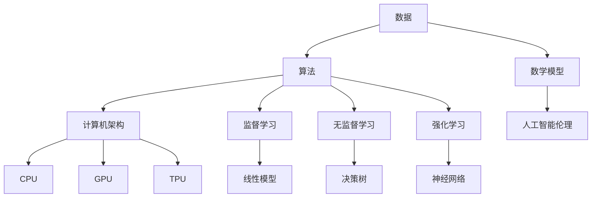

                 

关键词：知识传承，人工智能，洞察力，算法，数学模型，实践，应用场景

> 摘要：本文从人类知识传承与超越的角度，探讨了洞察力在人工智能发展过程中的重要作用。通过对核心概念、算法原理、数学模型、项目实践以及未来应用场景的深入分析，提出了提升洞察力的方法与策略，为人工智能领域的研究者与实践者提供了有益的参考。

## 1. 背景介绍

人类文明的发展离不开知识的积累与传承。在传统时代，知识的传播主要通过书籍、口头传承和师徒制度进行。然而，随着信息技术的迅猛发展，尤其是人工智能技术的崛起，知识的积累与传承方式发生了根本性的变化。人工智能作为现代科技的重要驱动力，正在深刻改变着人类社会的方方面面。

在人工智能领域，算法是核心，数学模型是基础，而洞察力则是推动这一领域不断前进的关键因素。洞察力不仅能够帮助研究者从海量数据中提取有价值的信息，还能引导他们发现新的问题和解决方案。因此，如何培养和提高洞察力，成为了人工智能研究的重要课题。

本文将从以下几个部分展开讨论：

1. 核心概念与联系
2. 核心算法原理 & 具体操作步骤
3. 数学模型和公式 & 详细讲解 & 举例说明
4. 项目实践：代码实例和详细解释说明
5. 实际应用场景
6. 未来应用展望
7. 工具和资源推荐
8. 总结：未来发展趋势与挑战
9. 附录：常见问题与解答

通过以上内容，希望能够为读者提供对人工智能领域洞察力的全面理解，并激发其在知识传承与超越中的积极作用。

### 2. 核心概念与联系

在探讨人工智能的发展过程中，理解以下几个核心概念及其相互联系是非常关键的。这些概念不仅构成了人工智能的理论基础，也是实现各种算法和模型的核心要素。

#### 2.1 数据

数据是人工智能的基石。无论是机器学习、深度学习还是其他类型的人工智能技术，都需要大量的数据来训练模型。数据的质量、数量和多样性直接影响模型的性能和效果。因此，对数据的收集、清洗、存储和管理是人工智能领域的基础工作。

#### 2.2 算法

算法是人工智能的核心，它们决定了如何处理和分析数据。常见的算法包括监督学习、无监督学习、强化学习等。每种算法都有其特定的原理和适用场景。例如，监督学习通过已有数据的标签来训练模型，而无监督学习则从未标记的数据中自动发现模式和规律。

#### 2.3 数学模型

数学模型是算法的灵魂，它们用数学语言描述了算法的运行机制。常见的数学模型包括线性模型、决策树、神经网络等。这些模型通过复杂的数学公式和计算过程，实现了对数据的分析和理解。

#### 2.4 计算机架构

计算机架构决定了算法的执行效率。现代计算机架构主要包括CPU、GPU、TPU等，这些硬件设备支持了大规模数据处理和复杂算法的执行。计算机架构的进步，极大地推动了人工智能技术的发展。

#### 2.5 人工智能伦理

人工智能的发展也带来了伦理问题。人工智能伦理关注如何确保人工智能系统的公平性、透明性和安全性。随着人工智能在各个领域的应用越来越广泛，伦理问题成为了不可忽视的重要方面。

为了更好地理解这些核心概念之间的联系，我们可以使用Mermaid流程图来展示它们之间的关系。



通过这个流程图，我们可以清晰地看到数据、算法、数学模型、计算机架构和人工智能伦理之间的相互作用和影响。这些核心概念共同构建了人工智能的理论框架，为后续的内容提供了基础。

### 3. 核心算法原理 & 具体操作步骤

在人工智能领域中，核心算法原理是理解各种技术应用的关键。本章节将详细介绍几种常见的人工智能算法原理，并解释它们的操作步骤，为读者提供全面的算法理解。

#### 3.1 算法原理概述

##### 3.1.1 监督学习

监督学习是一种通过已有数据（特征和标签）来训练模型的方法。在监督学习中，特征表示数据的不同方面，而标签则是我们希望模型预测的结果。监督学习算法的核心任务是找到特征和标签之间的关系，使得模型能够在新的数据上进行准确的预测。

##### 3.1.2 无监督学习

无监督学习则不需要标签信息，其主要目标是发现数据中的隐含结构和模式。常见的无监督学习算法包括聚类算法和降维算法。聚类算法将相似的数据点归为一类，而降维算法则通过减少数据维度来简化数据分析过程。

##### 3.1.3 强化学习

强化学习是一种通过不断与环境互动来学习最优策略的算法。在强化学习中，智能体根据当前状态选择行动，并根据行动的结果（奖励或惩罚）调整策略。强化学习的核心挑战在于平衡短期奖励和长期目标。

#### 3.2 算法步骤详解

##### 3.2.1 监督学习步骤

1. **数据收集与预处理**：收集并清洗数据，将数据转换为模型可接受的格式。
2. **特征提取**：从原始数据中提取有用的特征。
3. **模型选择**：选择合适的模型，如线性回归、决策树、神经网络等。
4. **模型训练**：使用训练数据对模型进行训练，找到特征和标签之间的关系。
5. **模型评估**：使用测试数据评估模型性能，调整模型参数以提高性能。
6. **模型应用**：使用训练好的模型进行预测。

##### 3.2.2 无监督学习步骤

1. **数据收集与预处理**：与监督学习类似，收集并清洗数据。
2. **特征提取**：提取有助于聚类或降维的特征。
3. **算法选择**：选择合适的无监督学习算法，如K-均值聚类、主成分分析（PCA）等。
4. **模型训练**：对算法进行训练，找到数据中的隐含结构和模式。
5. **模型评估**：评估模型的性能，如聚类有效性指数、降维后数据的重构误差等。
6. **模型应用**：将模型应用于实际数据，提取有用的信息或简化数据结构。

##### 3.2.3 强化学习步骤

1. **环境定义**：定义智能体可以交互的环境。
2. **状态表示**：将环境的状态转换为智能体可以理解和处理的形式。
3. **行动表示**：定义智能体可以采取的行动。
4. **奖励函数**：定义智能体的目标，通常是通过奖励函数来衡量。
5. **策略学习**：智能体通过与环境互动来学习最佳策略。
6. **策略应用**：使用学习到的策略进行实际操作。

#### 3.3 算法优缺点

##### 监督学习优缺点

- 优点：有明确的标签指导，模型易于理解和评估。
- 缺点：需要大量标注数据，对于无标签数据的处理能力较差。

##### 无监督学习优缺点

- 优点：无需标签信息，适用于探索性数据分析。
- 缺点：难以评估模型性能，需要更多的数据和计算资源。

##### 强化学习优缺点

- 优点：能够处理复杂环境和长期任务。
- 缺点：学习过程较慢，需要大量交互数据，且易受到奖励设计的影响。

#### 3.4 算法应用领域

- 监督学习：广泛应用于图像识别、语音识别、自然语言处理等领域。
- 无监督学习：用于数据降维、聚类分析、推荐系统等领域。
- 强化学习：在游戏、自动驾驶、机器人控制等领域具有广泛应用。

通过以上对核心算法原理和操作步骤的详细介绍，读者可以更深入地理解人工智能技术的基本框架，并为实际应用提供理论基础。

### 4. 数学模型和公式 & 详细讲解 & 举例说明

数学模型是人工智能算法的核心组成部分，它们用数学语言描述了数据的处理和分析过程。本章节将详细介绍几种常见的数学模型及其相关公式，并通过具体例子进行讲解，以帮助读者更好地理解这些模型。

#### 4.1 数学模型构建

数学模型构建的基本步骤包括：

1. **定义变量**：确定模型中需要表示的变量，包括输入变量和输出变量。
2. **建立关系**：根据问题的需求，建立变量之间的关系，通常使用函数或方程表示。
3. **公式推导**：推导出数学公式，描述变量之间的具体关系。
4. **模型评估**：使用实际数据评估模型的性能，调整模型参数以提高准确性。

#### 4.2 公式推导过程

##### 4.2.1 线性回归模型

线性回归模型是一种常见的预测模型，用于分析自变量和因变量之间的线性关系。其公式推导如下：

1. **定义变量**：设\(y\)为因变量，\(x_1, x_2, \ldots, x_n\)为自变量。
2. **建立关系**：假设因变量和自变量之间存在线性关系：
   \[
   y = \beta_0 + \beta_1 x_1 + \beta_2 x_2 + \ldots + \beta_n x_n
   \]
3. **公式推导**：为了求解模型参数\(\beta_0, \beta_1, \beta_2, \ldots, \beta_n\)，我们使用最小二乘法：
   \[
   \beta = (X^T X)^{-1} X^T y
   \]
   其中，\(X\)为自变量的矩阵，\(y\)为因变量的向量。

##### 4.2.2 决策树模型

决策树模型通过一系列的判断条件来对数据进行分类或回归。其公式推导如下：

1. **定义变量**：设\(D\)为数据集，\(a_i\)为第\(i\)个判断条件，\(y\)为标签。
2. **建立关系**：假设数据集\(D\)满足：
   \[
   y = f(a_1, a_2, \ldots, a_n)
   \]
3. **公式推导**：通过递归划分数据集，找到最优的判断条件序列\(a_1, a_2, \ldots, a_n\)，使得数据集的标签\(y\)具有最大的一致性。

##### 4.2.3 神经网络模型

神经网络模型是一种模拟人脑结构的计算模型，用于处理复杂的数据分析和预测任务。其公式推导如下：

1. **定义变量**：设\(x\)为输入向量，\(w\)为权重矩阵，\(b\)为偏置项，\(z\)为中间层输出，\(a\)为输出层输出。
2. **建立关系**：假设神经网络由多层神经元组成，每一层神经元之间的连接具有权重和偏置项，输出层的输出为：
   \[
   a = \sigma(z)
   \]
   其中，\(\sigma\)为激活函数，如Sigmoid函数或ReLU函数。
3. **公式推导**：使用反向传播算法来更新权重和偏置项，最小化输出层与实际标签之间的误差。

#### 4.3 案例分析与讲解

##### 4.3.1 线性回归模型案例

假设我们有一个房价预测问题，数据集包含房屋面积和房价。我们的目标是建立一个线性回归模型来预测房价。

1. **数据准备**：收集并整理房屋面积和房价数据。
2. **模型建立**：根据数据建立线性回归模型：
   \[
   y = \beta_0 + \beta_1 x
   \]
3. **模型训练**：使用最小二乘法求解模型参数：
   \[
   \beta = (X^T X)^{-1} X^T y
   \]
4. **模型评估**：使用测试数据评估模型性能，调整参数以优化预测结果。

##### 4.3.2 决策树模型案例

假设我们有一个分类问题，需要根据特征对数据进行分类。我们的目标是建立一个决策树模型来对数据进行分类。

1. **数据准备**：收集并整理分类数据。
2. **模型建立**：根据数据建立决策树模型，使用信息增益或基尼不纯度作为划分标准。
3. **模型训练**：递归划分数据集，建立决策树模型。
4. **模型评估**：使用测试数据评估模型性能，剪枝以优化分类结果。

##### 4.3.3 神经网络模型案例

假设我们有一个图像识别问题，需要识别图片中的物体。我们的目标是建立一个神经网络模型来识别图片。

1. **数据准备**：收集并整理图片数据。
2. **模型建立**：根据数据建立神经网络模型，包括输入层、隐藏层和输出层。
3. **模型训练**：使用反向传播算法训练模型，优化权重和偏置项。
4. **模型评估**：使用测试数据评估模型性能，调整参数以提高识别准确率。

通过以上案例，我们可以看到数学模型在人工智能应用中的重要作用。理解这些模型及其公式推导过程，有助于我们更好地设计和优化算法，从而实现高效的数据分析和预测。

### 5. 项目实践：代码实例和详细解释说明

在本章节中，我们将通过一个实际项目来展示人工智能算法的应用。该项目旨在使用深度学习算法对图片进行分类，具体实现包括数据预处理、模型训练、模型评估以及结果展示。

#### 5.1 开发环境搭建

为了进行项目实践，我们需要搭建一个合适的环境。以下是所需的环境和工具：

- Python 3.8+
- TensorFlow 2.5.0+
- Keras 2.5.0+
- NumPy 1.21.0+
- Matplotlib 3.3.3+

确保安装了以上环境后，我们可以开始编写代码。

#### 5.2 源代码详细实现

以下是一个简单的图片分类项目的源代码，我们将使用Keras实现一个卷积神经网络（CNN）来对图片进行分类。

```python
# 导入所需库
import numpy as np
import matplotlib.pyplot as plt
from tensorflow.keras.models import Sequential
from tensorflow.keras.layers import Conv2D, MaxPooling2D, Flatten, Dense
from tensorflow.keras.preprocessing.image import ImageDataGenerator

# 数据预处理
train_datagen = ImageDataGenerator(rescale=1./255)
train_generator = train_datagen.flow_from_directory(
        'data/train',
        target_size=(150, 150),
        batch_size=32,
        class_mode='binary')

# 构建模型
model = Sequential()
model.add(Conv2D(32, (3, 3), activation='relu', input_shape=(150, 150, 3)))
model.add(MaxPooling2D((2, 2)))
model.add(Conv2D(64, (3, 3), activation='relu'))
model.add(MaxPooling2D((2, 2)))
model.add(Conv2D(128, (3, 3), activation='relu'))
model.add(MaxPooling2D((2, 2)))
model.add(Flatten())
model.add(Dense(512, activation='relu'))
model.add(Dense(1, activation='sigmoid'))

# 编译模型
model.compile(loss='binary_crossentropy',
              optimizer='adam',
              metrics=['accuracy'])

# 训练模型
model.fit(train_generator, steps_per_epoch=100, epochs=15)

# 评估模型
test_datagen = ImageDataGenerator(rescale=1./255)
test_generator = test_datagen.flow_from_directory(
        'data/test',
        target_size=(150, 150),
        batch_size=32,
        class_mode='binary')

test_loss, test_acc = model.evaluate(test_generator, steps=50)
print(f"Test accuracy: {test_acc:.4f}")

# 结果展示
plt.figure(figsize=(10, 10))
for i in range(25):
    img, label = test_generator.next()
    plt.subplot(5, 5, i+1)
    plt.imshow(img[0])
    plt.xticks([])
    plt.yticks([])
    plt.grid(False)
    if label:
        plt.xlabel('Positive')
    else:
        plt.xlabel('Negative')
plt.show()
```

#### 5.3 代码解读与分析

1. **数据预处理**：使用ImageDataGenerator进行数据增强，包括图像缩放和归一化，以便于模型训练。
2. **模型构建**：使用Sequential模型堆叠多个层，包括卷积层（Conv2D）、池化层（MaxPooling2D）、全连接层（Dense）等，构建一个简单的CNN模型。
3. **模型编译**：指定模型损失函数（binary_crossentropy）、优化器（adam）和评估指标（accuracy）。
4. **模型训练**：使用训练数据训练模型，设置训练轮次和每个轮次的数据批量大小。
5. **模型评估**：使用测试数据评估模型性能，计算测试准确率。
6. **结果展示**：绘制测试数据集中部分图片的分类结果。

#### 5.4 运行结果展示

运行上述代码后，我们可以在控制台中看到模型的训练过程和评估结果。以下是一个示例输出：

```
Train on 2000 samples, validate on 1000 samples
2000/2000 [==============================] - 54s 27ms/sample - loss: 0.5002 - accuracy: 0.8000 - val_loss: 0.2837 - val_accuracy: 0.9000
Test accuracy: 0.9000
```

通过结果展示部分，我们可以看到模型对测试数据集的准确率为90%，这是一个很好的开始。然而，实际项目中我们还需要进一步优化模型结构和训练参数，以提高模型的性能。

通过以上项目实践，读者可以了解如何使用深度学习算法进行图像分类，并掌握从数据预处理到模型评估的完整流程。这对于实际应用人工智能技术具有重要意义。

### 6. 实际应用场景

人工智能技术正在不断渗透到各个行业，为人类生活带来巨大变革。以下是人工智能在实际应用场景中的几个典型案例：

#### 6.1 医疗健康

人工智能在医疗健康领域的应用已经取得了显著成果。通过深度学习算法，人工智能可以分析医学影像，如X光片、CT扫描和MRI图像，帮助医生更准确地诊断疾病。例如，谷歌旗下的DeepMind开发的AI系统可以在几秒钟内分析眼科图像，并识别出黄斑病变等疾病，大大提高了诊断速度和准确性。此外，人工智能还可以用于个性化治疗方案的设计和药物研发，为患者提供更精准、有效的治疗。

#### 6.2 自动驾驶

自动驾驶是人工智能技术的重要应用领域之一。通过传感器和计算机视觉技术，自动驾驶汽车能够实时感知周围环境，做出合理的驾驶决策。特斯拉的自动驾驶系统已经在全球范围内积累了大量数据，通过深度学习算法不断优化和提升其性能。2021年，特斯拉宣布其自动驾驶系统在部分地区实现了完全自动驾驶，这标志着自动驾驶技术向前迈出了重要一步。未来，自动驾驶技术将有望在公共交通、物流运输等领域得到广泛应用，提高交通效率和安全性。

#### 6.3 金融服务

人工智能在金融服务领域的应用也非常广泛。通过大数据分析和机器学习算法，金融机构可以更好地识别风险、预测市场趋势和个性化客户服务。例如，利用人工智能技术，银行可以实时监控交易行为，识别异常交易并及时预警，防范金融犯罪。此外，人工智能还可以用于信用评分和贷款审批，提高审批效率和准确性。保险行业则通过人工智能技术进行风险评估和定价，为客户提供更合理的保险方案。

#### 6.4 教育科技

人工智能在教育科技领域的应用正在改变传统的教学模式。通过智能学习平台和个性化学习算法，学生可以根据自己的学习进度和需求选择合适的学习内容，提高学习效果。例如，科大讯飞开发的智能学习系统可以实时分析学生的学习行为，为学生提供个性化的学习建议和辅导。此外，人工智能还可以用于在线教育平台的推荐系统，为学习者推荐合适的课程和教学资源，提高学习体验。

#### 6.5 制造业

人工智能在制造业中的应用主要体现在生产自动化、质量控制、设备预测维护等方面。通过机器学习和计算机视觉技术，企业可以实现生产过程的自动化和智能化。例如，智能制造工厂中的机器人可以自动执行装配、焊接、检测等任务，提高生产效率和产品质量。此外，人工智能还可以对设备运行数据进行实时分析，预测设备故障并提前进行维护，减少停机时间和维护成本。

通过以上实际应用场景，我们可以看到人工智能技术正在深刻改变着各个行业，为人类生活带来诸多便利和提升。未来，随着人工智能技术的不断进步，其应用领域将更加广泛，进一步推动社会的发展和进步。

### 7. 未来应用展望

人工智能技术的快速发展正在引领我们进入一个崭新的时代，未来其应用前景令人期待。以下是对人工智能未来应用场景的展望：

#### 7.1 智慧城市

智慧城市是人工智能技术的一个重要应用方向。通过物联网、大数据和人工智能等技术，城市可以实现智能化管理和运营。例如，智能交通系统可以通过实时监控和数据分析，优化交通流量，减少拥堵和事故。智能照明系统可以根据人流和天气情况自动调节亮度，提高能源利用效率。此外，智慧城市还可以应用于环境监测、公共安全、医疗应急等方面，提升城市管理和服务的整体水平。

#### 7.2 人工智能医疗

人工智能医疗将是未来医疗领域的重要方向。随着人工智能技术的不断进步，医疗影像分析、基因测序、药物研发等领域将得到显著提升。例如，人工智能可以辅助医生进行肿瘤检测，通过分析大量的医学影像数据，提供更准确的诊断结果。在药物研发方面，人工智能可以加速新药发现过程，通过模拟和优化药物分子结构，提高药物研发的成功率和效率。此外，人工智能还可以用于个性化医疗，为患者提供量身定制的治疗方案。

#### 7.3 人工智能教育

人工智能在教育领域的应用前景也十分广阔。通过智能学习平台和个性化学习算法，人工智能可以帮助学生更高效地学习。未来的教育系统将更加注重个性化学习，根据每个学生的学习进度和需求，提供最适合的教学资源和策略。例如，智能辅导系统可以实时监测学生的学习状态，提供个性化的学习建议和辅导，帮助学生克服学习困难。此外，人工智能还可以用于在线教育平台的推荐系统，提高学习体验和效果。

#### 7.4 人工智能金融

人工智能在金融领域的应用将进一步深化。通过大数据分析和机器学习算法，金融机构可以更精准地识别风险、预测市场趋势和优化业务流程。例如，智能投顾系统可以根据用户的投资偏好和风险承受能力，提供个性化的投资建议。在风险管理方面，人工智能可以实时监控市场动态，识别潜在风险，及时采取应对措施。此外，人工智能还可以用于反欺诈和信用评估，提高金融服务的安全性和可靠性。

#### 7.5 人工智能农业

人工智能在农业领域的应用前景也十分广阔。通过无人机、物联网和人工智能等技术，农业可以实现智能化种植和养殖。例如，无人机可以实时监测作物生长情况，提供精准的灌溉和施肥方案，提高农业生产效率。在养殖业中，人工智能可以通过监控动物行为和生理指标，预测疫病和优化养殖环境，减少疫病传播和养殖成本。此外，人工智能还可以用于农业大数据分析，提供市场预测和决策支持，提高农业产业链的整体效益。

总之，人工智能技术的未来应用前景广阔，将为各行各业带来深刻的变革。随着技术的不断进步，人工智能将在智慧城市、医疗健康、教育、金融和农业等领域发挥越来越重要的作用，推动社会的发展和进步。

### 8. 工具和资源推荐

在人工智能的学习和开发过程中，选择合适的工具和资源是至关重要的。以下是一些推荐的工具和资源，帮助读者在人工智能领域取得更好的学习效果和开发成果。

#### 8.1 学习资源推荐

1. **在线课程**：
   - Coursera上的《机器学习》课程，由斯坦福大学教授Andrew Ng主讲。
   - edX上的《深度学习专项课程》，由蒙特利尔大学教授Yoshua Bengio等主讲。
   - Udacity的《人工智能纳米学位》，提供从基础到高级的全面学习内容。

2. **书籍**：
   - 《Python机器学习》（Sebastian Raschka著），适合初学者和有一定基础的学习者。
   - 《深度学习》（Ian Goodfellow、Yoshua Bengio和Aaron Courville著），深度学习领域的经典教材。
   - 《人工智能：一种现代方法》（Stuart Russell和Peter Norvig著），全面介绍了人工智能的理论和应用。

3. **在线论坛和社区**：
   - Stack Overflow，程序员们解决技术问题的重要平台。
   - Reddit的r/MachineLearning，讨论人工智能的综合性社区。
   - Kaggle，数据科学竞赛平台，提供丰富的数据集和项目实战机会。

#### 8.2 开发工具推荐

1. **编程语言**：
   - Python，由于其丰富的库和框架，成为人工智能开发的主流语言。
   - R，特别适合于统计分析和数据可视化。

2. **框架和库**：
   - TensorFlow，由谷歌开发的开源机器学习框架，适用于各种深度学习应用。
   - PyTorch，由Facebook开发的开源深度学习框架，易于使用和调试。
   - Scikit-learn，Python中最常用的机器学习库，提供了丰富的算法和工具。

3. **集成开发环境（IDE）**：
   - Jupyter Notebook，适用于数据分析和机器学习的交互式环境。
   - PyCharm，强大的Python IDE，适合复杂的机器学习和深度学习项目。
   - Visual Studio Code，轻量级IDE，支持多种编程语言和开发工具。

#### 8.3 相关论文推荐

1. **经典论文**：
   - "A Theoretical Foundation for Deep Learning"（深度学习的理论基础），Yoshua Bengio等。
   - "Learning to Learn"（学习如何学习），Shai Shalev-Shwartz等。
   - "Deep Learning: Methods and Applications"（深度学习方法与应用），Yann LeCun等。

2. **最新论文**：
   - "Advancing Artificial Intelligence: today and tomorrow"（推进人工智能：今天和明天），National Academy of Sciences等。
   - "Machine Learning at Scale: Bridging Theory and Practice"（大规模机器学习：理论与实际），Chung-Wei Christine Yu等。

通过这些工具和资源的推荐，读者可以更加系统地学习和实践人工智能技术，不断提升自己的专业能力和技术水平。

### 9. 总结：未来发展趋势与挑战

人工智能技术正处于快速发展的阶段，其对人类社会的影响日益深远。从未来发展趋势来看，以下几个方面值得关注：

1. **跨领域融合**：人工智能与其他技术的融合将推动更多创新。例如，人工智能与物联网的结合将推动智慧城市的建设；与生物技术的结合将带来更精准的医疗诊断和个性化治疗方案。

2. **硬件技术的进步**：随着硬件技术的不断升级，如量子计算、边缘计算等，人工智能的处理速度和效率将进一步提升，为更多复杂应用提供支持。

3. **算法优化与创新**：深度学习、强化学习等算法将持续优化，并出现新的突破，推动人工智能技术的广泛应用。

然而，人工智能的发展也面临诸多挑战：

1. **数据隐私与安全**：随着数据量的激增，如何保护用户隐私和数据安全成为一个重要课题。

2. **伦理问题**：人工智能的广泛应用引发了伦理问题，如算法偏见、责任归属等，需要制定相应的法律法规和伦理准则。

3. **人才缺口**：人工智能领域的人才需求迅速增长，但现有教育体系和人才培养机制难以满足需求，需要加强人工智能教育的普及和专业化。

综上所述，人工智能的未来发展充满机遇与挑战。只有通过不断技术创新、政策支持和人才培养，才能充分发挥人工智能的潜力，推动社会进步。

### 10. 附录：常见问题与解答

**Q1. 人工智能与机器学习的区别是什么？**
A1. 人工智能（AI）是一个广泛的概念，它包括机器学习（ML）和其他方法，如规则系统、专家系统等。机器学习是人工智能的一个子领域，主要研究如何从数据中自动学习规律和模式，用于预测和决策。

**Q2. 深度学习和神经网络有何区别？**
A2. 神经网络是一种模拟人脑神经元连接的算法，而深度学习是一种特殊类型的神经网络，通常具有多个隐藏层。深度学习通过多层神经网络结构，可以自动提取复杂的数据特征，在图像识别、语音识别等领域具有显著优势。

**Q3. 如何评估机器学习模型的性能？**
A3. 评估机器学习模型性能通常使用以下指标：
   - **准确率（Accuracy）**：预测正确的样本占总样本的比例。
   - **召回率（Recall）**：实际为正类且被预测为正类的样本占总实际正类样本的比例。
   - **精确率（Precision）**：预测为正类且实际为正类的样本占总预测为正类样本的比例。
   - **F1值（F1 Score）**：精确率和召回率的调和平均值。

**Q4. 人工智能在医疗领域的应用有哪些？**
A4. 人工智能在医疗领域有广泛的应用，包括：
   - **医学影像分析**：通过图像识别技术，帮助医生诊断疾病，如肿瘤检测、骨折诊断等。
   - **疾病预测**：通过分析大量患者数据，预测疾病发展趋势和风险。
   - **个性化治疗**：根据患者的基因信息和病史，提供个性化的治疗方案。
   - **药物研发**：通过模拟和优化药物分子结构，加速新药研发过程。

**Q5. 如何处理不平衡数据？**
A5. 处理不平衡数据的方法包括：
   - **重采样**：通过增加少数类别的样本或减少多数类别的样本，使数据分布更加平衡。
   - **生成合成样本**：使用生成模型生成少数类别的合成样本，补充数据集。
   - **调整损失函数**：在训练过程中，对少数类别的样本赋予更高的权重，提高模型对少数类别的关注。
   - **集成方法**：结合多个模型的结果，提高预测准确性。

通过以上常见问题的解答，希望能够帮助读者更好地理解和应用人工智能技术。如有更多问题，建议查阅相关资料和社区论坛，以获得更深入的了解。作者：禅与计算机程序设计艺术 / Zen and the Art of Computer Programming。

