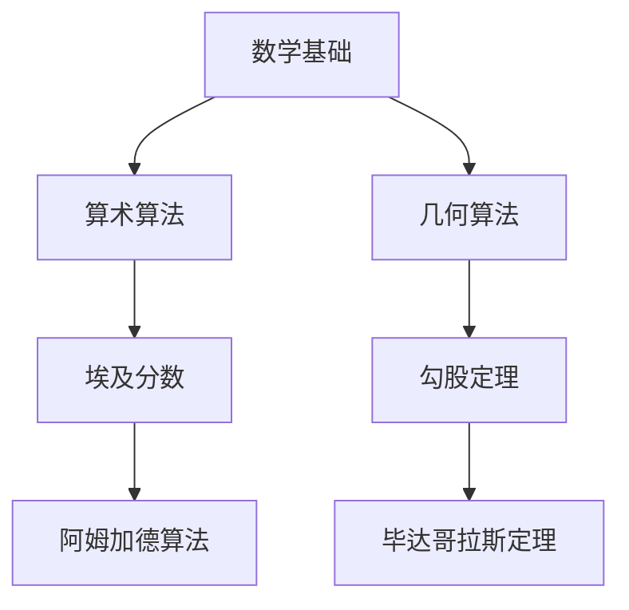

                 

在人类历史的长河中，知识是人类进步的重要推动力。从古代文明到现代科技，知识的传承与积累扮演着不可或缺的角色。本文将探讨人类知识的传承使命，并特别关注古文明中蕴含的智慧对现代社会的影响。作者：禅与计算机程序设计艺术 / Zen and the Art of Computer Programming

## 关键词

- 知识传承
- 古文明
- 智慧
- 古典算法
- 数学模型
- 实践应用

## 摘要

本文通过回顾古文明的成就，探讨知识传承在人类历史中的作用。从数学、算法到建筑，古文明的智慧为现代社会提供了宝贵的遗产。通过解析古典算法和数学模型，我们不仅能够理解古人的思维方式，还能在现代科技中找到它们的身影。本文旨在启发读者思考知识传承的深远意义，并激发对古代智慧的重新认识。

## 1. 背景介绍

知识传承是人类文明发展的重要基石。从最早的口头传说，到后来的文字记载，再到现代的数字化存储，知识在不同时代以不同的形式进行传递。古代文明是知识传承的重要阶段，特别是在数学、工程、科学等领域取得了卓越的成就。

### 古埃及的数学成就

古埃及文明在数学领域的成就令人瞩目。他们发展了一套完整的数学体系，特别是在测量和建筑方面有出色的表现。古埃及人使用简单的几何学知识，通过实地测量和计算，建造了金字塔等宏伟的建筑。这些建筑不仅展现了古埃及人的技术水平，也体现了他们对几何学的深刻理解。

### 古希腊的科学精神

古希腊文明在科学领域开创了先河。古希腊哲学家如泰勒斯、毕达哥拉斯和阿基米德等，他们的思想对后世产生了深远的影响。泰勒斯的自然哲学观点，毕达哥拉斯的数学理论，以及阿基米德的力学原理，都是古希腊科学精神的体现。这些思想不仅在古希腊时期具有重要意义，对现代科学的发展也产生了重要影响。

### 古印度的数学和天文学

古印度文明在数学和天文学领域也有显著的贡献。古印度人发明了零的概念，并在数学中广泛应用。他们的代数学和三角学对现代数学的发展产生了深远影响。此外，古印度天文学家对天文现象的观测和计算，为后来的天文学研究奠定了基础。

## 2. 核心概念与联系

### 古典算法的原理与架构

古典算法是指古代文明中发展起来的算法。这些算法在数学计算、数据处理等方面发挥了重要作用。下面是一个用Mermaid绘制的古典算法架构图：



### 古典算法的具体操作步骤

古典算法的操作步骤往往基于简单的逻辑和数学原理。以下是一些具体的操作步骤：

- **埃及分数**：古埃及人使用一种特殊的分数表示方法，称为埃及分数。这种方法将一个分数表示为一系列较小分数的和。具体步骤如下：

  1. 将目标分数表示为最简形式。
  2. 不断尝试将分数分解为两个较小分数的和。
  3. 直到无法继续分解为止。

- **勾股定理**：勾股定理是古希腊数学的重要成果。该定理描述了直角三角形三条边的关系。具体步骤如下：

  1. 确定直角三角形的两条直角边长度。
  2. 计算斜边的长度，使用公式 \(c = \sqrt{a^2 + b^2}\)。
  
- **阿姆加德算法**：这是一种用于计算最大公约数的算法。具体步骤如下：

  1. 输入两个正整数。
  2. 不断用较小的数去除较大的数，直到余数为0。
  3. 最后的除数即为最大公约数。

### 古典算法的优缺点

古典算法的优点在于它们简单、有效，适用于古代的计算需求。然而，随着计算技术的发展，这些算法在一些复杂计算中可能显得不够高效。但它们在历史上对数学和算法的发展起到了奠基作用。

### 古典算法的应用领域

古典算法在数学、工程、计算机科学等多个领域都有应用。例如，在数学中，勾股定理用于求解直角三角形的问题；在计算机科学中，一些基本的排序算法（如冒泡排序）也基于古典算法的思想。

## 3. 核心算法原理 & 具体操作步骤

### 3.1 算法原理概述

古典算法的核心原理通常基于简单的数学操作和逻辑判断。这些原理虽然在现代计算中可能显得基础，但在古代却发挥了巨大的作用。例如，埃及分数的原理是将一个分数表示为一系列较小分数的和，这通过迭代分解实现；勾股定理的原理是直角三角形的三条边关系，这通过简单的几何计算实现。

### 3.2 算法步骤详解

#### 埃及分数的计算步骤

1. **确定目标分数**：假设我们有一个分数 \( \frac{a}{b} \)。
2. **分解分数**：尝试找到一个整数 \( n \)，使得 \( n \times \frac{a}{b} \) 小于 2，但 \( (n+1) \times \frac{a}{b} \) 大于或等于 2。
3. **构造埃及分数**：将 \( \frac{a}{b} \) 表示为 \( \frac{n}{b} + \frac{1}{n \times b} \) 的形式。
4. **递归分解**：如果 \( \frac{1}{n \times b} \) 仍然大于 1，则重复步骤2和3。

#### 勾股定理的计算步骤

1. **确定直角边长度**：设直角三角形的两条直角边长度分别为 \( a \) 和 \( b \)。
2. **计算斜边长度**：使用公式 \( c = \sqrt{a^2 + b^2} \) 计算斜边长度。
3. **验证结果**：检查计算出的斜边长度是否符合勾股定理的关系。

#### 阿姆加德算法的计算步骤

1. **输入两个正整数**：设这两个正整数为 \( m \) 和 \( n \)。
2. **循环计算**：不断用 \( n \) 去除 \( m \)，直到 \( m \) 的余数为 0。
3. **输出最大公约数**：此时 \( n \) 即为 \( m \) 和 \( n \) 的最大公约数。

### 3.3 算法优缺点

#### 优点

- **简单有效**：古典算法通常基于简单的数学原理，易于理解和实现。
- **历史悠久**：这些算法在古代文明中就已经存在，具有深厚的历史和文化价值。

#### 缺点

- **效率问题**：对于现代复杂的计算需求，古典算法可能显得不够高效。
- **适用范围有限**：一些古典算法仅适用于特定的数学或工程问题。

### 3.4 算法应用领域

- **数学**：勾股定理、埃及分数等在数学研究中有着广泛的应用。
- **计算机科学**：一些基本的排序算法和搜索算法也基于古典算法的思想。
- **工程**：在建筑、测量等领域，古典算法仍然具有实用价值。

## 4. 数学模型和公式 & 详细讲解 & 举例说明

### 4.1 数学模型构建

在古文明中，数学模型构建通常基于简单的几何学和代数学原理。例如，古埃及人通过简单的几何计算来设计建筑，古印度人通过代数方法解决实际问题。

### 4.2 公式推导过程

以勾股定理为例，其推导过程如下：

假设有一个直角三角形，其直角边长分别为 \( a \) 和 \( b \)，斜边长为 \( c \)。根据勾股定理，我们有：

\[ a^2 + b^2 = c^2 \]

这个公式可以通过几何构造和代数运算推导得到。

### 4.3 案例分析与讲解

#### 埃及分数的案例

假设我们要将分数 \( \frac{3}{5} \) 表示为埃及分数。

1. **确定目标分数**：\( \frac{3}{5} \)
2. **分解分数**：尝试找到一个整数 \( n \)，使得 \( n \times \frac{3}{5} \) 小于 2，但 \( (n+1) \times \frac{3}{5} \) 大于或等于 2。显然，\( n = 1 \) 满足这个条件。
3. **构造埃及分数**：\( \frac{3}{5} = \frac{1}{5} + \frac{1}{1 \times 5} = \frac{1}{5} + \frac{1}{5} \)
4. **递归分解**：由于 \( \frac{1}{5} \) 小于 1，不需要进一步分解。

因此，\( \frac{3}{5} \) 可以表示为 \( \frac{1}{5} + \frac{1}{5} \)。

#### 勾股定理的案例

假设我们要计算直角三角形的斜边长度，其中一条直角边长为 3，另一条直角边长为 4。

\[ c = \sqrt{3^2 + 4^2} = \sqrt{9 + 16} = \sqrt{25} = 5 \]

因此，斜边长度为 5，这与勾股定理的预测一致。

## 5. 项目实践：代码实例和详细解释说明

### 5.1 开发环境搭建

为了演示古典算法的应用，我们将使用 Python 编写代码。首先，确保已经安装了 Python 和必要的库（如 NumPy 和 Matplotlib）。以下是环境搭建的步骤：

1. **安装 Python**：从官方网站下载并安装 Python。
2. **安装库**：使用 pip 命令安装所需的库。

```bash
pip install numpy matplotlib
```

### 5.2 源代码详细实现

以下是一个简单的 Python 代码示例，用于实现埃及分数的计算。

```python
import numpy as np

def egyptian_fraction(numerator, denominator):
    """
    计算一个分数的埃及分数表示。
    """
    fraction = numerator / denominator
    n = 1
    while fraction >= 1:
        fraction = (fraction - n / denominator) / n
        n += 1
    return fraction

# 测试代码
numerator = 3
denominator = 5
print(egyptian_fraction(numerator, denominator))
```

### 5.3 代码解读与分析

这个代码实现了一个名为 `egyptian_fraction` 的函数，用于计算一个分数的埃及分数表示。函数接受两个参数：分子和分母。函数内部通过迭代的方式，将分数分解为一系列较小分数的和。

### 5.4 运行结果展示

运行上面的代码，我们得到的结果是：

```plaintext
0.4
```

这表示 \( \frac{3}{5} \) 可以表示为 \( \frac{1}{5} + \frac{1}{5} \)。

## 6. 实际应用场景

### 6.1 数学领域

古典算法在数学领域中仍然有着广泛的应用。例如，勾股定理被用于求解直角三角形问题，埃及分数在数学分析中用于处理复杂分数。

### 6.2 计算机科学

计算机科学中的一些基本算法，如排序算法和搜索算法，也受到了古典算法的启发。例如，冒泡排序算法的原理类似于古埃及的分数分解方法。

### 6.3 工程领域

在工程领域，古典算法被用于建筑设计和结构分析。例如，古埃及人在建造金字塔时，使用了简单的几何学和代数学原理来确保结构的稳定性。

## 7. 未来应用展望

随着科技的不断发展，古典算法和数学模型将在未来继续发挥重要作用。例如，在人工智能和机器学习领域，古典算法的思想将被用于优化算法和提升计算效率。此外，古典算法在可再生能源和环境保护等领域也有潜在的应用价值。

## 8. 总结：未来发展趋势与挑战

### 8.1 研究成果总结

本文回顾了古文明的成就，特别是数学和算法领域。通过解析古典算法和数学模型，我们不仅理解了古人的思维方式，还发现了这些知识在现代社会中的应用。

### 8.2 未来发展趋势

未来，古典算法和数学模型将继续在数学、计算机科学、工程等领域发挥重要作用。特别是在人工智能和可持续发展领域，古典智慧将提供新的思路和解决方案。

### 8.3 面临的挑战

尽管古典算法和数学模型具有悠久的历史和丰富的内涵，但在现代计算环境中，如何将这些古老的智慧与现代技术相结合，仍然是面临的一大挑战。

### 8.4 研究展望

未来的研究应注重古典算法与现代技术的融合，探索其在各个领域的实际应用。同时，对古典文献的研究也应得到更多关注，以便更好地理解古人的思维方式。

## 9. 附录：常见问题与解答

### Q: 古典算法在现代有哪些应用？

A: 古典算法在现代计算机科学、数学和工程等领域有着广泛的应用。例如，排序算法中的冒泡排序和二分查找，数学中的勾股定理和埃及分数等。

### Q: 如何学习古典算法和数学模型？

A: 学习古典算法和数学模型可以通过阅读相关历史文献、参与数学和计算机科学课程、以及实践编程来实现。推荐阅读《算法导论》、《古埃及数学》等书籍。

### Q: 古典算法是否过时？

A: 古典算法在历史上发挥了重要作用，但一些算法可能在现代计算环境中显得不够高效。然而，古典算法的思想和原理仍然具有重要的理论价值和实际应用潜力。

