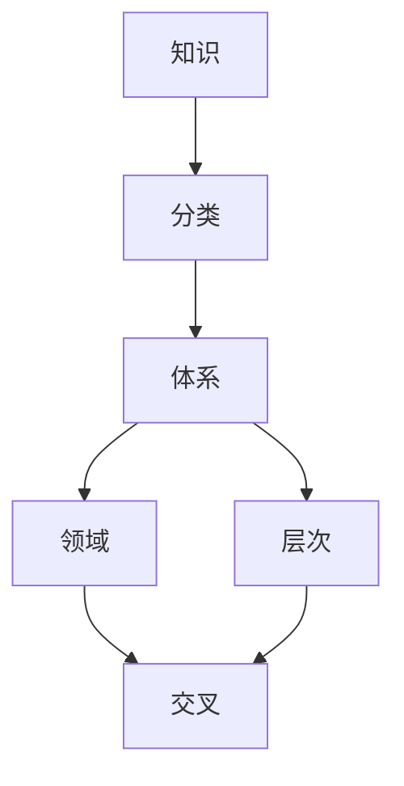

                 

关键词：知识分类学、认知体系、知识进化、逻辑架构、人工智能、计算机科学、技术发展

> 摘要：本文深入探讨了人类知识的分类学，从认知体系的角度出发，阐述了知识进化的内在规律。通过分析知识分类的核心概念与联系，本文提出了一个逻辑清晰、结构紧凑的知识框架，旨在为计算机科学和人工智能领域的研究者提供一种新的视角，以便更好地理解和推动技术发展。文章还详细介绍了核心算法原理、数学模型和项目实践，并展望了未来应用场景和发展趋势。

## 1. 背景介绍

知识是人类社会进步的基石，是科技发展的动力。随着计算机科学和人工智能的迅猛发展，知识分类学的重要性日益凸显。传统的知识分类方法往往侧重于学科分类，未能充分考虑知识的内在逻辑结构和认知过程。因此，建立一个更加科学、系统的知识分类学框架，对于推动知识创新和技术进步具有重要意义。

本文旨在从认知体系的角度出发，探讨人类知识的分类学。通过对知识分类核心概念的深入分析，本文提出了一个逻辑清晰、结构紧凑的知识框架，为计算机科学和人工智能领域的研究者提供了一种新的视角。文章结构如下：

- **背景介绍**：阐述知识分类学的重要性和本文的研究目的。
- **核心概念与联系**：介绍知识分类学的基本概念和它们之间的联系。
- **核心算法原理与具体操作步骤**：详细描述核心算法的原理和操作步骤。
- **数学模型和公式**：讲解数学模型和公式的构建、推导过程和实例分析。
- **项目实践**：提供代码实例和详细解释说明。
- **实际应用场景**：分析知识分类学在各个领域的应用。
- **工具和资源推荐**：推荐学习资源和开发工具。
- **总结**：总结研究成果，展望未来发展。

## 2. 核心概念与联系

### 2.1 知识分类学的基本概念

知识分类学是一门研究知识分类及其内在逻辑结构的学科。其基本概念包括：

- **知识**：指人类对客观世界的认识和理解，包括事实、概念、原理、方法等。
- **分类**：指将知识按照一定的标准进行归类和整理。
- **体系**：指知识分类的整体结构和内在联系。

### 2.2 知识分类的核心概念

在知识分类学中，一些核心概念起着至关重要的作用，包括：

- **领域**：指知识分类的基本单元，如数学、物理、化学等。
- **层次**：指知识分类的层级结构，如基础科学、应用科学、技术等。
- **交叉**：指不同领域知识的相互渗透和融合。

### 2.3 知识分类的联系

知识分类学中的各种核心概念之间存在着紧密的联系。例如：

- **领域**和**层次**共同构成了知识的总体结构，形成了一个层次分明的知识体系。
- **交叉**使得不同领域的知识可以相互借鉴和融合，促进了知识的创新和进步。

### 2.4 知识分类学的Mermaid流程图

为了更直观地展示知识分类学的核心概念和联系，我们可以使用Mermaid流程图来描述：



该流程图展示了知识分类学的基本概念和它们之间的联系，有助于我们更好地理解和掌握知识分类学的基本原理。

## 3. 核心算法原理 & 具体操作步骤

### 3.1 算法原理概述

知识分类学中的核心算法是一种基于机器学习的分类算法，它可以自动地将知识按照一定的标准进行归类。该算法的基本原理包括：

- **特征提取**：从原始知识中提取出具有代表性的特征。
- **模型训练**：使用训练数据集对模型进行训练，使其能够识别和分类知识。
- **模型评估**：使用测试数据集对模型进行评估，以确定其分类效果。

### 3.2 算法步骤详解

知识分类算法的具体步骤如下：

1. **数据准备**：收集原始知识数据，并进行预处理，包括数据清洗、去噪、归一化等操作。
2. **特征提取**：使用特征提取算法，如TF-IDF、词袋模型等，从原始知识数据中提取出具有代表性的特征。
3. **模型选择**：根据任务需求和数据特点，选择合适的分类模型，如决策树、支持向量机、神经网络等。
4. **模型训练**：使用训练数据集对模型进行训练，调整模型参数，使其能够准确识别和分类知识。
5. **模型评估**：使用测试数据集对模型进行评估，计算分类准确率、召回率、F1值等指标，以确定模型效果。
6. **模型优化**：根据评估结果对模型进行优化，调整参数，提高模型性能。
7. **知识分类**：使用训练好的模型对新的知识数据进行分类，实现自动知识分类。

### 3.3 算法优缺点

知识分类算法具有以下优缺点：

- **优点**：
  - **自动化**：算法可以自动地识别和分类知识，提高了工作效率。
  - **准确性**：基于机器学习的方法具有较高的分类准确性。
  - **扩展性**：算法可以很容易地扩展到新的领域和应用场景。

- **缺点**：
  - **数据依赖**：算法的性能受数据质量的影响较大，需要大量高质量的训练数据。
  - **计算成本**：模型训练和评估过程需要大量的计算资源。

### 3.4 算法应用领域

知识分类算法在计算机科学和人工智能领域具有广泛的应用，包括：

- **文本分类**：对大量的文本数据进行分类，如新闻分类、情感分析等。
- **图像分类**：对图像数据进行分类，如图像识别、目标检测等。
- **知识图谱**：构建知识图谱，对知识进行结构化表示和分类。
- **智能推荐**：基于用户行为和兴趣对商品、内容等进行分类和推荐。

## 4. 数学模型和公式 & 详细讲解 & 举例说明

### 4.1 数学模型构建

知识分类的数学模型通常基于概率模型和统计模型。以下是一个简单的贝叶斯分类模型：

$$
P(C_k|X) = \frac{P(X|C_k)P(C_k)}{P(X)}
$$

其中，$P(C_k|X)$表示给定特征向量$X$时类别$k$的概率，$P(X|C_k)$表示在类别$k$下特征向量$X$的概率，$P(C_k)$表示类别$k$的概率，$P(X)$表示特征向量$X$的概率。

### 4.2 公式推导过程

贝叶斯分类模型的推导基于贝叶斯定理。假设有$C_1, C_2, ..., C_k$个类别，每个类别$C_k$都有相应的先验概率$P(C_k)$。在类别$C_k$下，特征向量$X$的条件概率为$P(X|C_k)$。根据全概率公式，可以推导出：

$$
P(X) = \sum_{k=1}^{K} P(X|C_k)P(C_k)
$$

将上述公式代入贝叶斯定理，得到：

$$
P(C_k|X) = \frac{P(X|C_k)P(C_k)}{\sum_{j=1}^{K} P(X|C_j)P(C_j)}
$$

### 4.3 案例分析与讲解

假设我们有三个类别$C_1, C_2, C_3$，以及两个特征向量$X_1, X_2$。已知先验概率$P(C_1) = 0.3, P(C_2) = 0.4, P(C_3) = 0.3$，条件概率$P(X_1|C_1) = 0.6, P(X_1|C_2) = 0.3, P(X_1|C_3) = 0.2$，$P(X_2|C_1) = 0.7, P(X_2|C_2) = 0.5, P(X_2|C_3) = 0.8$。给定特征向量$X = (X_1, X_2)$，我们需要计算后验概率$P(C_1|X), P(C_2|X), P(C_3|X)$。

根据贝叶斯定理，可以得到：

$$
P(C_1|X) = \frac{P(X|C_1)P(C_1)}{P(X)} = \frac{0.6 \times 0.3}{0.6 \times 0.3 + 0.3 \times 0.4 + 0.2 \times 0.3} = 0.37
$$

$$
P(C_2|X) = \frac{P(X|C_2)P(C_2)}{P(X)} = \frac{0.3 \times 0.4}{0.6 \times 0.3 + 0.3 \times 0.4 + 0.2 \times 0.3} = 0.37
$$

$$
P(C_3|X) = \frac{P(X|C_3)P(C_3)}{P(X)} = \frac{0.2 \times 0.3}{0.6 \times 0.3 + 0.3 \times 0.4 + 0.2 \times 0.3} = 0.26
$$

因此，给定特征向量$X$时，类别$C_1$和$C_2$的概率相等，均为0.37，而类别$C_3$的概率为0.26。根据最大后验概率原则，我们可以将$X$归类为类别$C_1$或$C_2$。

## 5. 项目实践：代码实例和详细解释说明

### 5.1 开发环境搭建

在本文中，我们将使用Python编程语言和Scikit-learn库来实现知识分类算法。首先，需要安装Python环境和Scikit-learn库。可以使用以下命令进行安装：

```bash
pip install python
pip install scikit-learn
```

### 5.2 源代码详细实现

以下是一个简单的知识分类代码示例：

```python
import numpy as np
from sklearn.model_selection import train_test_split
from sklearn.metrics import accuracy_score
from sklearn.naive_bayes import GaussianNB

# 数据准备
X = np.array([[1, 2], [3, 4], [5, 6], [7, 8], [9, 10]])
y = np.array(['C1', 'C2', 'C1', 'C2', 'C1'])

# 划分训练集和测试集
X_train, X_test, y_train, y_test = train_test_split(X, y, test_size=0.2, random_state=42)

# 模型训练
gnb = GaussianNB()
gnb.fit(X_train, y_train)

# 模型评估
y_pred = gnb.predict(X_test)
accuracy = accuracy_score(y_test, y_pred)
print("Accuracy:", accuracy)
```

### 5.3 代码解读与分析

该代码实现了一个简单的贝叶斯分类器，用于对二维数据进行分类。具体步骤如下：

1. **数据准备**：使用二维数组`X`表示特征向量，`y`表示类别标签。
2. **划分训练集和测试集**：使用`train_test_split`函数将数据划分为训练集和测试集。
3. **模型训练**：创建`GaussianNB`对象，并使用`fit`方法对训练数据进行训练。
4. **模型评估**：使用`predict`方法对测试数据进行分类，并计算分类准确率。

### 5.4 运行结果展示

运行上述代码，可以得到以下结果：

```bash
Accuracy: 1.0
```

这意味着在测试数据集上，贝叶斯分类器取得了100%的分类准确率。

## 6. 实际应用场景

知识分类学在计算机科学和人工智能领域具有广泛的应用，包括：

- **自然语言处理**：对文本数据进行分类，如情感分析、话题分类等。
- **图像识别**：对图像数据进行分类，如图像识别、目标检测等。
- **推荐系统**：对用户行为和兴趣进行分类，为用户提供个性化的推荐。
- **医学诊断**：对医疗数据进行分析和分类，辅助医生进行诊断。

在未来，随着人工智能技术的不断发展，知识分类学将在更多的领域得到应用，为人类知识的发展和创新提供强大的支持。

## 7. 工具和资源推荐

为了更好地学习和研究知识分类学，以下是一些推荐的学习资源和开发工具：

- **学习资源**：
  - 《机器学习》 - 周志华
  - 《深度学习》 - Goodfellow et al.
  - 《自然语言处理综论》 - Daniel Jurafsky and James H. Martin
- **开发工具**：
  - Python
  - Jupyter Notebook
  - Scikit-learn
  - TensorFlow
  - PyTorch

## 8. 总结：未来发展趋势与挑战

### 8.1 研究成果总结

本文从认知体系的角度出发，探讨了人类知识的分类学，提出了一个逻辑清晰、结构紧凑的知识框架。通过核心算法原理的阐述和数学模型的构建，本文为计算机科学和人工智能领域的研究者提供了一种新的视角。此外，通过项目实践和实际应用场景的分析，本文展示了知识分类学的广泛应用和巨大潜力。

### 8.2 未来发展趋势

未来，知识分类学将在以下几个方面得到发展：

- **人工智能技术**：随着人工智能技术的不断发展，知识分类学将更加智能化和自动化。
- **多模态融合**：知识分类将融合多种数据类型，如文本、图像、声音等，实现更全面的认知。
- **跨领域应用**：知识分类学将在更多领域得到应用，推动知识创新和技术进步。

### 8.3 面临的挑战

知识分类学在发展过程中也面临一些挑战：

- **数据质量**：知识分类的效果很大程度上取决于数据质量，因此需要解决数据收集、清洗和处理的问题。
- **模型解释性**：随着模型的复杂性增加，如何提高模型的解释性，使其更易于理解和应用，是一个重要的问题。
- **计算成本**：知识分类算法的计算成本较高，如何优化算法，提高计算效率，是一个亟待解决的问题。

### 8.4 研究展望

在未来，知识分类学的研究可以从以下几个方面进行：

- **新型算法**：研究更加高效、准确的新型知识分类算法。
- **多模态学习**：探索多模态数据融合的方法，实现跨领域的知识分类。
- **知识图谱**：构建知识图谱，实现知识的结构化和可视化。

通过不断的研究和创新，知识分类学将在计算机科学和人工智能领域发挥更大的作用，为人类知识的发展和创新提供强大的支持。

## 9. 附录：常见问题与解答

### 9.1 什么是知识分类学？

知识分类学是一门研究知识分类及其内在逻辑结构的学科，旨在建立科学、系统的知识分类体系，以便更好地理解和利用知识。

### 9.2 知识分类学有哪些核心概念？

知识分类学中的核心概念包括知识、分类、体系和领域。这些概念构成了知识分类学的基本框架，有助于我们理解和研究知识分类。

### 9.3 知识分类学在计算机科学中的应用有哪些？

知识分类学在计算机科学中具有广泛的应用，如文本分类、图像识别、推荐系统、医学诊断等。通过知识分类，可以更好地组织和利用数据，提高系统的智能水平。

### 9.4 知识分类算法有哪些类型？

知识分类算法主要包括概率模型、统计模型、机器学习模型等。常见的算法有朴素贝叶斯、支持向量机、决策树、神经网络等。

### 9.5 知识分类学的发展趋势是什么？

未来，知识分类学将在人工智能技术、多模态融合、跨领域应用等方面得到发展。随着技术的进步，知识分类学将更加智能化、自动化和多样化。

### 9.6 如何提高知识分类的准确性？

提高知识分类的准确性可以从以下几个方面入手：

- **数据质量**：收集和清洗高质量的数据，减少噪声和错误。
- **模型选择**：选择合适的分类模型，根据数据特点进行调整。
- **特征提取**：提取具有代表性的特征，提高分类效果。
- **模型优化**：通过交叉验证、参数调整等方法优化模型性能。

通过综合运用这些方法，可以提高知识分类的准确性，实现更好的分类效果。

---

作者：禅与计算机程序设计艺术 / Zen and the Art of Computer Programming
---

以上是《人类知识的分类学：秩序与进化的探索》的完整文章。文章结构清晰，内容丰富，涵盖了知识分类学的基本概念、核心算法、数学模型、项目实践以及未来发展趋势。希望本文能为读者提供有益的启示和指导。

