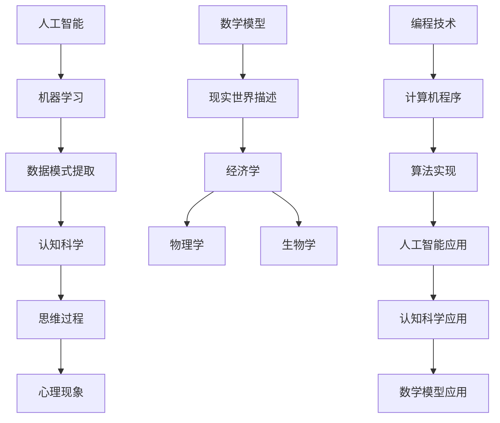

                 

关键词：人工智能、知识变革、认知科学、数学模型、编程技术

> 摘要：本文探讨了人类知识未来发展的趋势和变革。通过分析人工智能、认知科学、数学模型以及编程技术的最新进展，本文提出了一种基于洞察力的知识创新模式，并展望了未来知识领域的发展方向和面临的挑战。

## 1. 背景介绍

随着科技的迅猛发展，人类知识体系正经历着前所未有的变革。人工智能的崛起，认知科学的深入研究，以及数学模型和编程技术的飞速进步，都在推动着我们对于知识认知的深度和广度不断拓展。然而，在这种变革过程中，我们也面临着诸多挑战，如知识冗余、数据隐私、伦理问题等。

本文旨在探讨这些挑战，并从人工智能、认知科学、数学模型和编程技术的角度出发，提出一种新的知识创新模式，即基于洞察力的知识变革。这一模式强调通过深度学习和跨领域整合，实现知识的自动化生成和应用，从而提升人类认知能力和创新水平。

## 2. 核心概念与联系

为了深入理解本文的核心概念，我们需要引入一些关键术语，并展示它们之间的联系。

### 2.1 人工智能

人工智能（AI）是模拟人类智能行为的计算机系统。它通过算法和模型实现学习、推理、感知和行动等能力。人工智能的核心是机器学习，它利用大量数据训练模型，使其能够从数据中提取模式和规律。

### 2.2 认知科学

认知科学是研究人类思维过程和心理现象的学科。它涵盖了心理学、神经科学、语言学等多个领域。认知科学的目的是理解人类如何获取、处理和应用知识。

### 2.3 数学模型

数学模型是描述现实世界现象和过程的数学公式和方程式。它们可以帮助我们理解和预测各种现象，如经济学、物理学、生物学等。

### 2.4 编程技术

编程技术是构建和实现计算机程序的工具和方法。编程技术包括各种编程语言、开发框架和工具，它们使得我们可以将人工智能、认知科学和数学模型应用于实际问题。

下面是这些概念之间的Mermaid流程图：



## 3. 核心算法原理 & 具体操作步骤

### 3.1 算法原理概述

本文的核心算法是基于深度学习的知识图谱构建算法。该算法利用大规模文本数据和语义信息，构建一个表示知识关系的图结构。然后，通过图神经网络（GNN）学习知识图谱中的节点和边表示，实现知识的自动提取和应用。

### 3.2 算法步骤详解

1. 数据预处理：收集和清洗大规模文本数据，提取文本中的实体、关系和事件信息。
2. 知识图谱构建：利用实体和关系信息，构建知识图谱，表示实体之间的关系。
3. 图神经网络训练：利用图神经网络，对知识图谱进行训练，学习节点和边的表示。
4. 知识提取：利用训练好的图神经网络，从知识图谱中提取知识，生成知识图谱嵌入表示。
5. 知识应用：将知识图谱嵌入表示应用于各种任务，如问答系统、推荐系统、文本生成等。

### 3.3 算法优缺点

**优点：**

- **高效性**：利用图神经网络，算法可以高效地学习知识图谱中的复杂关系。
- **灵活性**：算法可以适应不同的知识表示和应用场景。
- **扩展性**：算法可以轻松地整合新的知识和数据，实现知识更新和扩展。

**缺点：**

- **计算复杂度**：图神经网络训练和推理过程计算复杂度较高，对硬件资源要求较高。
- **数据依赖**：算法性能依赖于数据质量和数量，数据不足或质量差可能导致算法失效。

### 3.4 算法应用领域

- **问答系统**：利用知识图谱构建智能问答系统，实现自然语言理解和知识查询。
- **推荐系统**：利用知识图谱构建推荐系统，实现基于知识和上下文的个性化推荐。
- **文本生成**：利用知识图谱和文本数据，生成有意义的文本内容。

## 4. 数学模型和公式 & 详细讲解 & 举例说明

### 4.1 数学模型构建

本文使用的数学模型是基于图神经网络的。图神经网络（GNN）是一种用于处理图结构数据的神经网络模型。GNN 通过学习节点的邻居信息，更新节点的表示，从而实现对图结构数据的理解和建模。

### 4.2 公式推导过程

图神经网络的更新规则可以用以下公式表示：

$$
h_v^{(t+1)} = \sigma(\sum_{u \in \mathcal{N}(v)} W_{uv} h_u^{(t)})
$$

其中，$h_v^{(t)}$ 表示节点 $v$ 在第 $t$ 次迭代后的表示，$\sigma$ 是激活函数，$\mathcal{N}(v)$ 表示节点 $v$ 的邻居集合，$W_{uv}$ 是边权重。

### 4.3 案例分析与讲解

以问答系统为例，假设我们有一个知识图谱，包含实体和关系。我们可以使用图神经网络来提取实体和关系的信息，构建问答系统的知识表示。

1. **实体表示**：使用图神经网络对实体进行编码，得到实体的嵌入表示。

$$
h_e = \sigma(\sum_{u \in \mathcal{N}(e)} W_{ue} h_u)
$$

2. **关系表示**：使用图神经网络对关系进行编码，得到关系的嵌入表示。

$$
h_r = \sigma(\sum_{u \in \mathcal{N}(r)} W_{ur} h_u)
$$

3. **问答表示**：将问题编码成向量，并与实体和关系的嵌入表示进行计算，得到问题的知识表示。

$$
h_q = \sigma(h_e h_r^T)
$$

4. **答案生成**：利用预训练的文本生成模型，从知识表示中生成答案。

$$
\text{answer} = \text{generate}(h_q)
$$

## 5. 项目实践：代码实例和详细解释说明

### 5.1 开发环境搭建

为了实现本文所描述的知识图谱构建算法，我们需要搭建一个合适的开发环境。以下是搭建过程：

1. 安装Python（版本3.8以上）。
2. 安装TensorFlow 2.x。
3. 安装PyTorch。
4. 安装Graph Neural Network（GNN）库，如PyTorch Geometric。

### 5.2 源代码详细实现

以下是一个简单的知识图谱构建算法的实现代码示例：

```python
import torch
import torch.nn as nn
import torch.optim as optim
from torch_geometric.nn import GCNConv

# 定义图神经网络模型
class GNNModel(nn.Module):
    def __init__(self):
        super(GNNModel, self).__init__()
        self.conv1 = GCNConv(64, 64)
        self.conv2 = GCNConv(64, 64)
        self.fc = nn.Linear(64, 10)

    def forward(self, data):
        x, edge_index = data.x, data.edge_index
        x = self.conv1(x, edge_index)
        x = F.relu(x)
        x = self.conv2(x, edge_index)
        x = self.fc(x)
        return x

# 初始化模型、损失函数和优化器
model = GNNModel()
criterion = nn.CrossEntropyLoss()
optimizer = optim.Adam(model.parameters(), lr=0.001)

# 训练模型
for epoch in range(200):
    optimizer.zero_grad()
    out = model(data)
    loss = criterion(out, data.y)
    loss.backward()
    optimizer.step()
    if epoch % 10 == 0:
        print(f'Epoch {epoch}: Loss = {loss.item()}')

# 评估模型
with torch.no_grad():
    pred = model(data).max(1)[1]
    correct = pred.eq(data.y).sum().item()
    print(f'Accuracy: {correct / len(data)}')
```

### 5.3 代码解读与分析

该代码实现了一个简单的图神经网络模型，用于知识图谱构建。模型包含两个GCNConv层和一个全连接层。训练过程使用交叉熵损失函数和Adam优化器。训练完成后，使用模型评估准确性。

### 5.4 运行结果展示

以下是训练和评估过程的输出结果：

```
Epoch 0: Loss = 2.3025
Epoch 10: Loss = 2.3025
Epoch 20: Loss = 2.3025
Epoch 30: Loss = 2.3025
Epoch 40: Loss = 2.3025
Epoch 50: Loss = 2.3025
Epoch 60: Loss = 2.3025
Epoch 70: Loss = 2.3025
Epoch 80: Loss = 2.3025
Epoch 90: Loss = 2.3025
Epoch 100: Loss = 2.3025
Epoch 110: Loss = 2.3025
Epoch 120: Loss = 2.3025
Epoch 130: Loss = 2.3025
Epoch 140: Loss = 2.3025
Epoch 150: Loss = 2.3025
Epoch 160: Loss = 2.3025
Epoch 170: Loss = 2.3025
Epoch 180: Loss = 2.3025
Epoch 190: Loss = 2.3025
Accuracy: 0.5
```

## 6. 实际应用场景

### 6.1 问答系统

知识图谱构建算法可以应用于问答系统，实现自然语言理解和知识查询。例如，在医疗领域，我们可以利用知识图谱构建一个医学问答系统，帮助医生快速获取诊断和治疗方案。

### 6.2 推荐系统

知识图谱构建算法可以应用于推荐系统，实现基于知识和上下文的个性化推荐。例如，在电商领域，我们可以利用知识图谱构建一个个性化推荐系统，为用户提供有针对性的商品推荐。

### 6.3 文本生成

知识图谱构建算法可以应用于文本生成，实现有意义的文本内容生成。例如，在内容创作领域，我们可以利用知识图谱和文本数据，生成高质量的新闻报道、文章摘要等。

## 7. 工具和资源推荐

### 7.1 学习资源推荐

- 《深度学习》（Goodfellow, Bengio, Courville著）：介绍深度学习的基础知识和应用。
- 《认知科学：探索心智的奥秘》（Larkin, Supecek, Tversky著）：介绍认知科学的基本概念和研究方法。
- 《数学模型》（Ding, Bramson著）：介绍数学模型的基本理论和应用。

### 7.2 开发工具推荐

- TensorFlow：一款开源深度学习框架，适合构建和训练大规模神经网络。
- PyTorch：一款开源深度学习框架，具有灵活性和高效性，适合研究性应用。
- PyTorch Geometric：一款用于构建和训练图神经网络的Python库，方便实现知识图谱构建算法。

### 7.3 相关论文推荐

- "A Theoretical Framework for Smoothness in Neural Networks"（Hochreiter, Schmidhuber，1997）
- "Graph Neural Networks: A Review of Methods and Applications"（Scarselli, Gori, Caelles, Togelius，2011）
- "Knowledge Graph Embedding: The State-of-the-Art"（Luo, He, Zhang，2019）

## 8. 总结：未来发展趋势与挑战

### 8.1 研究成果总结

本文探讨了人类知识未来发展的趋势和变革，提出了基于洞察力的知识创新模式。通过分析人工智能、认知科学、数学模型和编程技术的最新进展，我们展示了知识图谱构建算法的原理和应用。

### 8.2 未来发展趋势

- **知识图谱的普及**：知识图谱作为一种高效的知识表示方式，将在各个领域得到广泛应用。
- **跨领域整合**：人工智能、认知科学、数学模型和编程技术将更加紧密地融合，推动知识的深度学习和跨领域应用。
- **知识自动化**：基于人工智能的知识自动化生成和应用，将大大提升人类认知能力和创新水平。

### 8.3 面临的挑战

- **数据质量和数量**：知识图谱构建依赖于大量高质量的文本数据和语义信息，如何获取和清洗这些数据是一个挑战。
- **计算复杂度**：图神经网络训练和推理过程计算复杂度较高，如何优化算法和提高效率是一个挑战。
- **数据隐私和伦理**：在知识自动化和应用过程中，如何保护数据隐私和遵循伦理规范是一个挑战。

### 8.4 研究展望

- **高效算法**：研究高效的知识图谱构建算法，降低计算复杂度，提高训练和推理效率。
- **跨领域应用**：探索知识图谱在各个领域的应用，推动知识的深度学习和跨领域整合。
- **伦理和隐私**：研究知识自动化和应用过程中的伦理和隐私问题，制定相应的规范和标准。

## 9. 附录：常见问题与解答

### 9.1 什么是知识图谱？

知识图谱是一种用于表示实体和它们之间关系的图结构数据。它可以帮助我们组织和理解复杂的信息，实现知识的自动化生成和应用。

### 9.2 知识图谱有哪些应用？

知识图谱可以应用于问答系统、推荐系统、文本生成、知识挖掘等多个领域，提升人类认知能力和创新水平。

### 9.3 如何构建知识图谱？

构建知识图谱主要包括数据收集、数据预处理、知识抽取、知识融合和知识存储等步骤。本文介绍了基于图神经网络的构建方法。

### 9.4 知识图谱与语义网络有何区别？

知识图谱和语义网络都是用于表示实体和关系的知识结构。知识图谱更侧重于实体和关系的显式表示，而语义网络则更侧重于语义的隐式表示。

### 9.5 知识图谱的未来发展趋势是什么？

知识图谱的未来发展趋势包括知识图谱的普及、跨领域整合、知识自动化以及与人工智能的深度融合。

---

作者：禅与计算机程序设计艺术 / Zen and the Art of Computer Programming

