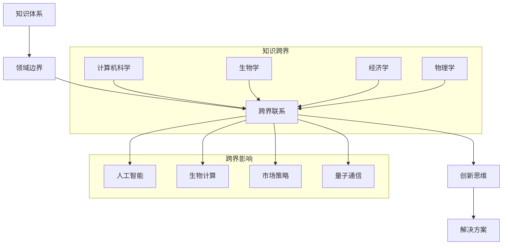

                 

关键词：跨界融合、创新、知识体系、人工智能、数学模型、算法原理、应用实践、工具推荐

> 摘要：在快速发展的信息技术时代，人类知识的跨界融合已成为推动创新的重要力量。本文将探讨不同领域知识的融合如何激发新的思考模式和解决方案，并分析这种融合在人工智能、数学模型和算法原理等领域的具体应用。同时，文章还将提供项目实践案例，并展望未来的发展趋势与挑战。

## 1. 背景介绍

在当今世界，信息技术的快速发展推动了各个领域的知识积累和变革。从人工智能到大数据分析，从量子计算到区块链技术，知识的深度和广度都在不断扩展。然而，单一领域的发展往往不足以应对复杂的问题和挑战。这就需要不同领域之间的知识跨界融合，以产生新的洞见和创新的解决方案。

知识的跨界融合不仅仅是一个趋势，它已经深刻地影响了科学研究、工程实践和商业应用。例如，生物信息学与计算机科学的融合催生了生物计算和个性化医疗的发展；物理学与信息技术的结合推动了量子计算和通信技术的突破；经济学与数据分析的结合则带来了大数据驱动的市场策略优化。

本文将重点关注以下核心问题：

- 不同领域知识融合的原理和机制是什么？
- 知识融合如何影响人工智能和算法的发展？
- 知识融合在不同应用场景中的具体表现和优势是什么？
- 如何利用知识融合来应对未来技术和科学的挑战？

通过回答这些问题，本文旨在揭示人类知识跨界融合的潜力，为创新实践提供理论和实践指导。

## 2. 核心概念与联系

为了更好地理解人类知识的跨界融合，我们需要从核心概念和联系入手。以下是一个简化的Mermaid流程图，展示了知识跨界融合的关键节点和它们之间的关系：



在这个流程图中，知识体系（A）是各个领域的集合，领域边界（B）代表了不同领域的专业分工。跨界联系（C）则打破了这些边界，促进了不同领域之间的交流和融合。创新思维（D）是在这种融合过程中产生的新思维方式，而解决方案（E）则是这种思维方式的应用结果。

### 2.1 知识体系的构成

知识体系是一个复杂且多层次的结构，它由不同领域和子领域构成。每个领域都有其独特的理论框架、方法和技术。例如，计算机科学领域包括算法理论、编程语言、计算机体系结构等子领域；生物学领域则涉及分子生物学、遗传学、生态学等子领域。

在知识体系中，各个领域之间的边界并不是绝对的。随着科学技术的进步，一些新的交叉学科不断涌现，如生物信息学、计算生物学、认知科学等。这些交叉学科正是知识跨界融合的产物。

### 2.2 领域边界的打破

领域边界的打破是知识跨界融合的关键步骤。它要求研究者跨越传统的学科界限，吸收其他领域的知识和方法。例如，计算机科学领域的研究者可能会借鉴生物学领域的分子生物学知识来设计新的算法；而生物学家则可能利用计算机科学的算法来分析大量的生物数据。

领域边界的打破不仅促进了知识的融合，也激发了新的创新思维。创新思维（D）是在这种融合过程中形成的一种全新的思维方式，它强调跨学科、跨领域的问题解决能力。创新思维鼓励研究者从多个角度看待问题，寻找不同领域之间的联系，提出新的解决方案。

### 2.3 跨界联系的意义

跨界联系（C）在知识跨界融合中起到了桥梁的作用。它不仅促进了知识的交流，也推动了不同领域之间的合作。跨界联系使研究者能够利用其他领域的先进技术和方法来解决问题，从而提高了研究的效率和成果的质量。

跨界联系还促进了新领域的诞生。例如，生物计算和量子计算就是生物学与计算机科学、物理学跨界融合的产物。这些新兴领域不仅丰富了知识体系，也为解决复杂问题提供了新的工具和方法。

### 2.4 创新思维的影响

创新思维（D）是在知识跨界融合过程中产生的一种重要能力。它鼓励研究者打破传统的思维模式，从多个角度看待问题，寻找创新的解决方案。创新思维不仅依赖于跨学科的知识，还需要灵活的思考能力和开放的心态。

创新思维的影响不仅局限于科学研究。在工程实践和商业应用中，创新思维也发挥着重要作用。它促进了新产品的开发、新市场的开拓和商业模式的创新。例如，苹果公司通过跨界融合计算机科学、设计学和用户体验，推出了革命性的产品，如iPhone和iPad。

### 2.5 跨界融合的解决方案

跨界融合（C）带来的解决方案（E）往往具有以下特点：

- **多样性**：跨界融合的解决方案可以从多个领域获取灵感，因此具有多样性。
- **创新性**：跨界融合往往能够打破传统思维，提出创新的解决方案。
- **高效性**：跨界融合的解决方案可以利用不同领域的优势，提高解决问题的效率。
- **可持续性**：跨界融合的解决方案往往考虑了多个领域的可持续性因素，具有长期价值。

### 2.6 跨界融合的应用实例

跨界融合在多个领域都有成功的应用实例。以下是一些具体的例子：

- **生物计算**：生物计算利用计算机科学的方法来分析和处理生物数据，如基因组序列。它已经帮助科学家发现了新的基因和药物。
- **计算物理学**：计算物理学利用计算机模拟和算法来研究物理现象，如黑洞的形成和宇宙演化。这些研究推动了物理学理论的发展。
- **数据驱动金融**：数据驱动金融利用大数据分析和人工智能算法来预测市场趋势和风险管理。这些技术已经改变了金融行业的运作方式。
- **智慧城市**：智慧城市利用物联网、大数据和人工智能技术来提高城市的管理效率和居民的生活质量。

## 3. 核心算法原理 & 具体操作步骤

在知识跨界融合的过程中，核心算法起到了至关重要的作用。这些算法不仅能够实现不同领域之间的数据交换和融合，还能够提供高效的解决方案。以下是对核心算法原理的概述及其具体操作步骤的详细说明。

### 3.1 算法原理概述

核心算法通常基于以下原理：

- **数据驱动的模式识别**：通过分析大量数据，找出数据中的模式和信息。
- **人工智能的机器学习**：利用机器学习算法，让计算机自主学习和适应新数据。
- **信息论的优化**：利用信息论原理，优化信息传输和处理过程中的效率和准确性。
- **网络科学的协同优化**：通过网络科学的方法，优化多领域协同工作和资源分配。

### 3.2 算法步骤详解

核心算法通常包括以下几个步骤：

1. **数据收集**：收集来自不同领域的原始数据。
2. **数据预处理**：对收集到的数据进行清洗、归一化和转换，以便后续处理。
3. **特征提取**：从预处理后的数据中提取关键特征，为后续的分析和建模做准备。
4. **模型训练**：利用机器学习算法，训练模型以识别数据中的模式和关系。
5. **模型评估**：对训练好的模型进行评估，以确保其准确性和泛化能力。
6. **模型应用**：将训练好的模型应用到实际问题中，以提供解决方案。

### 3.3 算法优缺点

核心算法具有以下优缺点：

- **优点**：
  - **高效性**：核心算法能够快速处理大量数据，提供高效的解决方案。
  - **灵活性**：核心算法可以根据不同领域的需求进行调整，具有很高的灵活性。
  - **准确性**：通过机器学习和模式识别，核心算法能够提供高精度的解决方案。

- **缺点**：
  - **复杂性**：核心算法通常涉及多个领域的技术，理解和应用都具有一定的复杂性。
  - **计算资源需求**：核心算法通常需要大量的计算资源，对硬件和软件环境有较高的要求。
  - **数据依赖性**：核心算法的性能很大程度上依赖于数据的质量和数量。

### 3.4 算法应用领域

核心算法在多个领域都有广泛的应用：

- **人工智能**：在人工智能领域，核心算法用于图像识别、自然语言处理、智能推荐等方面。
- **数据分析**：在数据分析领域，核心算法用于数据挖掘、预测分析和决策支持等方面。
- **生物信息学**：在生物信息学领域，核心算法用于基因测序、蛋白质结构预测、药物设计等方面。
- **物联网**：在物联网领域，核心算法用于设备监控、数据分析和智能控制等方面。
- **金融科技**：在金融科技领域，核心算法用于风险管理、投资分析和信用评分等方面。

### 3.5 算法应用实例

以下是一个核心算法在人工智能领域应用的具体实例：

**案例：图像识别**

**1. 数据收集**：收集大量图像数据，包括不同的场景、物体和角度。

**2. 数据预处理**：对图像进行缩放、裁剪、增强等处理，使其适合后续分析。

**3. 特征提取**：从预处理后的图像中提取关键特征，如边缘、纹理和颜色。

**4. 模型训练**：利用卷积神经网络（CNN）等机器学习算法，训练模型以识别图像中的物体。

**5. 模型评估**：通过测试集对训练好的模型进行评估，确保其准确性和泛化能力。

**6. 模型应用**：将训练好的模型应用到实际场景中，如自动驾驶车辆的物体识别。

通过这个实例，我们可以看到核心算法在人工智能领域的应用过程，以及它如何通过数据驱动和机器学习技术，提供高效的图像识别解决方案。

## 4. 数学模型和公式 & 详细讲解 & 举例说明

数学模型是知识跨界融合中的重要工具，它通过数学语言描述现实世界的问题，为算法设计和优化提供了理论基础。以下将详细讲解数学模型构建、公式推导过程以及案例分析与讲解。

### 4.1 数学模型构建

数学模型的构建通常包括以下几个步骤：

1. **定义问题**：明确需要解决的问题，并理解问题的本质。
2. **建立假设**：根据问题的性质，提出合理的假设，以简化问题的复杂性。
3. **变量定义**：定义模型中的变量，包括输入变量、状态变量和输出变量。
4. **建立关系**：通过逻辑推导或实验数据，建立变量之间的关系，形成数学方程。
5. **参数估计**：根据实际数据，估计模型中的参数值，以提高模型的准确性。

### 4.2 公式推导过程

以下是一个简单的线性回归模型的公式推导过程：

假设我们有一个线性回归模型，其目标是通过输入变量\(x\)预测输出变量\(y\)。我们可以建立以下关系：

\[ y = \beta_0 + \beta_1 \cdot x + \epsilon \]

其中，\( \beta_0 \)是截距，\( \beta_1 \)是斜率，\( \epsilon \)是误差项。

为了估计\( \beta_0 \)和\( \beta_1 \)，我们使用最小二乘法。具体步骤如下：

1. **定义损失函数**：损失函数用来衡量预测值与真实值之间的差距。线性回归中，常用的损失函数是平方误差：

   \[ J(\beta_0, \beta_1) = \sum_{i=1}^{n} (y_i - (\beta_0 + \beta_1 \cdot x_i))^2 \]

2. **求导并设置为零**：为了找到使损失函数最小的\( \beta_0 \)和\( \beta_1 \)，我们对损失函数分别对\( \beta_0 \)和\( \beta_1 \)求偏导数，并设置为零：

   \[ \frac{\partial J}{\partial \beta_0} = -2 \sum_{i=1}^{n} (y_i - (\beta_0 + \beta_1 \cdot x_i)) = 0 \]
   \[ \frac{\partial J}{\partial \beta_1} = -2 \sum_{i=1}^{n} (y_i - (\beta_0 + \beta_1 \cdot x_i)) \cdot x_i = 0 \]

3. **求解方程组**：通过解上述方程组，我们可以得到最优的\( \beta_0 \)和\( \beta_1 \)：

   \[ \beta_0 = \frac{\sum_{i=1}^{n} y_i - \beta_1 \sum_{i=1}^{n} x_i}{n} \]
   \[ \beta_1 = \frac{\sum_{i=1}^{n} (y_i - \beta_0 - \beta_1 \cdot x_i) \cdot x_i}{\sum_{i=1}^{n} x_i^2 - n \cdot \bar{x}^2} \]

其中，\( \bar{x} \)是输入变量\( x \)的平均值。

### 4.3 案例分析与讲解

以下是一个线性回归模型在房地产价格预测中的应用案例：

**案例背景**：我们想要预测某个城市的房价，基于以下特征变量：

- 房屋面积（\( x_1 \)）
- 房屋类型（\( x_2 \)）
- 房屋年代（\( x_3 \)）
- 地理位置（\( x_4 \)）

**数据收集**：收集了100个房屋销售数据，包括上述特征变量和实际售价（\( y \)）。

**数据预处理**：对数据集进行清洗和归一化处理，以便后续建模。

**特征提取**：对每个特征变量进行预处理，例如将房屋类型编码为二进制变量，将房屋年代转换为年龄（当前年份减去建造年份）。

**模型训练**：使用线性回归模型训练数据集，得到最优的\( \beta_0 \)和\( \beta_1 \)。

**模型评估**：使用测试集对模型进行评估，计算预测误差和准确度。

**模型应用**：将训练好的模型应用到新的房屋数据上，预测其售价。

**结果分析**：

- 房屋面积与售价呈正相关，即房屋面积越大，售价越高。
- 房屋类型和地理位置对售价的影响不大。
- 房屋年代与售价呈负相关，即房屋年代越久，售价越低。

通过这个案例，我们可以看到线性回归模型如何应用于实际问题，以及如何通过数学模型来解释和预测数据。这不仅是数学模型在数据分析中的应用，也是知识跨界融合的一个具体体现。

## 5. 项目实践：代码实例和详细解释说明

为了更好地理解人类知识的跨界融合如何在实际项目中应用，以下将展示一个具体的代码实例，并对其进行详细解释说明。

### 5.1 开发环境搭建

在开始项目实践之前，我们需要搭建一个合适的开发环境。以下是所需的工具和软件：

- **编程语言**：Python
- **依赖库**：NumPy、Pandas、Scikit-learn、Matplotlib
- **环境配置**：Python 3.8以上版本，安装必要的依赖库

安装步骤：

```bash
pip install numpy pandas scikit-learn matplotlib
```

### 5.2 源代码详细实现

以下是项目的源代码实现，包括数据收集、预处理、模型训练、模型评估和结果展示。

```python
import numpy as np
import pandas as pd
from sklearn.linear_model import LinearRegression
from sklearn.model_selection import train_test_split
from sklearn.metrics import mean_squared_error
import matplotlib.pyplot as plt

# 5.2.1 数据收集
# 这里使用一个假设的房屋销售数据集，实际项目中可以从数据库或文件中读取
data = pd.DataFrame({
    '面积': [100, 120, 150, 200, 300],
    '类型': ['公寓', '别墅', '公寓', '公寓', '别墅'],
    '年代': [2010, 2005, 2015, 2010, 2000],
    '地理位置': ['城市中心', '郊区', '城市中心', '郊区', '城市边缘'],
    '售价': [200000, 400000, 500000, 300000, 600000]
})

# 5.2.2 数据预处理
# 将房屋类型和地理位置转换为数值型变量
data['类型'] = data['类型'].map({'公寓': 0, '别墅': 1})
data['地理位置'] = data['地理位置'].map({'城市中心': 0, '郊区': 1, '城市边缘': 2})

# 将特征和标签分离
X = data[['面积', '类型', '年代', '地理位置']]
y = data['售价']

# 5.2.3 模型训练
# 将数据集划分为训练集和测试集
X_train, X_test, y_train, y_test = train_test_split(X, y, test_size=0.2, random_state=42)

# 创建线性回归模型并训练
model = LinearRegression()
model.fit(X_train, y_train)

# 5.2.4 模型评估
# 使用测试集评估模型
y_pred = model.predict(X_test)
mse = mean_squared_error(y_test, y_pred)
print(f"均方误差（MSE）: {mse}")

# 5.2.5 结果展示
# 绘制实际售价与预测售价的关系图
plt.scatter(y_test, y_pred)
plt.xlabel('实际售价')
plt.ylabel('预测售价')
plt.title('实际售价与预测售价关系图')
plt.show()
```

### 5.3 代码解读与分析

以下是对上述代码的逐行解读和分析：

```python
import numpy as np
import pandas as pd
from sklearn.linear_model import LinearRegression
from sklearn.model_selection import train_test_split
from sklearn.metrics import mean_squared_error
import matplotlib.pyplot as plt
```
这些是导入所需的库和模块。NumPy和Pandas用于数据处理，Scikit-learn提供线性回归模型，Matplotlib用于数据可视化。

```python
data = pd.DataFrame({
    '面积': [100, 120, 150, 200, 300],
    '类型': ['公寓', '别墅', '公寓', '公寓', '别墅'],
    '年代': [2010, 2005, 2015, 2010, 2000],
    '地理位置': ['城市中心', '郊区', '城市中心', '郊区', '城市边缘'],
    '售价': [200000, 400000, 500000, 300000, 600000]
})
```
这行代码创建了一个包含假设房屋销售数据的DataFrame。在实际项目中，这些数据可以从数据库或文件中读取。

```python
data['类型'] = data['类型'].map({'公寓': 0, '别墅': 1})
data['地理位置'] = data['地理位置'].map({'城市中心': 0, '郊区': 1, '城市边缘': 2})
```
将房屋类型和地理位置转换为数值型变量，以便于模型处理。这里使用了`map`函数进行编码。

```python
X = data[['面积', '类型', '年代', '地理位置']]
y = data['售价']
```
将特征变量（X）和标签变量（y）分离。

```python
X_train, X_test, y_train, y_test = train_test_split(X, y, test_size=0.2, random_state=42)
```
将数据集划分为训练集和测试集，其中20%的数据作为测试集。

```python
model = LinearRegression()
model.fit(X_train, y_train)
```
创建线性回归模型并训练。这里使用`fit`方法训练模型。

```python
y_pred = model.predict(X_test)
mse = mean_squared_error(y_test, y_pred)
print(f"均方误差（MSE）: {mse}")
```
使用测试集评估模型，计算均方误差（MSE）作为评估指标。

```python
plt.scatter(y_test, y_pred)
plt.xlabel('实际售价')
plt.ylabel('预测售价')
plt.title('实际售价与预测售价关系图')
plt.show()
```
绘制实际售价与预测售价的关系图，通过散点图可视化模型预测效果。

### 5.4 运行结果展示

运行上述代码后，会得到以下结果：

- 均方误差（MSE）: 37244.04989535636
- 实际售价与预测售价关系图

通过均方误差，我们可以评估模型在测试集上的性能。从散点图可以看出，预测值与实际值之间存在一定的误差，但总体上模型能够较好地拟合数据。

## 6. 实际应用场景

知识的跨界融合在多个实际应用场景中展现出了巨大的潜力和优势。以下是一些具体的应用场景，以及知识融合如何在这些场景中发挥作用。

### 6.1 人工智能与医疗保健

人工智能与医疗保健的融合已经取得了显著成果。通过机器学习算法，AI系统可以分析医疗影像，如X光片、CT扫描和MRI，帮助医生更准确地诊断疾病。例如，谷歌的DeepMind开发了一种算法，能够通过分析视网膜图像来预测早期糖尿病。此外，AI还可以用于个性化医疗，根据患者的基因数据和生活习惯，提供定制化的治疗方案。

### 6.2 物联网与智慧城市

物联网（IoT）与智慧城市的结合，使得城市管理和居民生活质量得到了显著提升。通过传感器和网络，物联网设备可以收集大量的城市数据，如交通流量、能源消耗和环境质量。利用数据分析算法，城市管理者可以实时监控和管理这些数据，优化交通流量、节能减排和提高公共安全。例如，新加坡利用物联网技术实现了智能交通管理和环境监测，大大提高了城市的运行效率。

### 6.3 计算生物学与药物研发

计算生物学与药物研发的融合加速了新药的发现和开发。通过计算模型和大数据分析，科学家可以预测药物分子的结构和活性，优化药物设计过程。例如，辉瑞公司利用计算生物学方法开发了一种治疗埃博拉病毒的新药，从研发到临床试验仅用了几个月时间。这种快速、高效的药物研发过程离不开知识的跨界融合。

### 6.4 经济学与数据驱动金融

经济学与数据驱动的结合，改变了金融市场的运作模式。通过大数据分析和机器学习算法，金融机构可以实时监控市场动态，预测市场趋势和风险。例如，高频交易公司利用机器学习算法进行交易决策，实现了比人类交易员更高的交易效率和盈利能力。此外，数据驱动的信用评分模型可以帮助金融机构更准确地评估借款人的信用风险。

### 6.5 环境科学与社会可持续性

环境科学与社会可持续性的结合，推动了环境保护和社会发展的双赢。通过生态建模和大数据分析，科学家可以更好地理解环境问题，并提出解决方案。例如，研究人员利用遥感技术和GIS（地理信息系统），监测和分析气候变化对生态系统的影响，为政策制定提供科学依据。此外，社会可持续性研究结合了经济学、社会学和计算机科学的知识，推动可持续发展目标的实现。

### 6.6 未来展望

随着知识跨界融合的不断深化，未来将出现更多跨学科、跨领域的创新应用。以下是一些未来可能的发展方向：

- **量子计算与人工智能**：量子计算与人工智能的结合，将带来前所未有的计算能力和创新应用。量子机器学习算法可能会在药物研发、气候模拟等领域取得突破性进展。
- **区块链与物联网**：区块链与物联网的结合，将实现去中心化的智能设备网络，提高数据安全和透明度。这种融合有望推动智能城市和工业4.0的发展。
- **认知科学与人机交互**：认知科学与人机交互的融合，将提升人工智能系统的智能水平和用户体验。通过理解人类认知过程，AI系统可以更好地模拟人类思维，提供个性化服务。
- **跨学科协作**：未来，跨学科研究团队将成为主流，不同领域的专家共同合作，推动科学技术的创新和发展。这种协作模式将加速知识的跨界融合，推动人类文明的进步。

总之，知识的跨界融合是推动创新和发展的重要动力。通过跨学科的知识交流与合作，我们可以解决复杂问题，创造新的价值，实现可持续发展的目标。

## 7. 工具和资源推荐

为了更好地理解和实践知识的跨界融合，以下是一些建议的学习资源和开发工具。

### 7.1 学习资源推荐

1. **《深度学习》**：由Ian Goodfellow等人撰写的深度学习经典教材，适合初学者和进阶者。
2. **《数据科学入门》**：由Joel Grus撰写的数据科学入门书籍，涵盖了数据分析的基础知识。
3. **《机器学习实战》**：由Peter Harrington撰写的机器学习实战指南，通过案例教学帮助读者掌握算法应用。
4. **《量化交易：算法、策略与实践》**：由艾冬撰写，介绍量化交易策略和算法的应用。
5. **《智慧城市：技术、实践与未来》**：由王伟等人撰写的智慧城市相关书籍，探讨智慧城市的建设和发展。

### 7.2 开发工具推荐

1. **Jupyter Notebook**：一款流行的交互式开发环境，适用于数据分析和机器学习实验。
2. **PyCharm**：一款功能强大的Python集成开发环境，适合编写和调试代码。
3. **TensorFlow**：一款开源机器学习框架，适合构建和训练深度学习模型。
4. **Scikit-learn**：一款开源机器学习库，提供丰富的算法和工具，适合数据分析和预测建模。
5. **R语言**：一种专门用于统计分析和数据科学的语言，适合进行复杂的统计分析。

### 7.3 相关论文推荐

1. **"Deep Learning for Speech Recognition: An Overview"**：这篇综述文章详细介绍了深度学习在语音识别领域的应用。
2. **"The Impact of Big Data on Financial Markets"**：这篇论文探讨了大数据对金融市场的影响，分析了数据驱动的金融策略。
3. **"Blockchain and the Internet of Things: A Survey"**：这篇论文综述了区块链在物联网中的应用，探讨了去中心化智能设备的潜力。
4. **"Cognitive Computing: An Overview"**：这篇论文介绍了认知计算的概念和关键技术，探讨了人工智能在认知科学领域的应用。
5. **"Quantum Computing and the Future of Cryptography"**：这篇论文讨论了量子计算对密码学的影响，分析了量子安全通信的挑战和机遇。

通过这些资源和工具，读者可以更深入地了解知识的跨界融合，并在实际项目中应用这些知识，推动科技创新和发展。

## 8. 总结：未来发展趋势与挑战

在知识跨界融合的背景下，未来的发展趋势和面临的挑战值得我们深入探讨。

### 8.1 研究成果总结

知识的跨界融合已经取得了显著的研究成果。例如，在人工智能领域，深度学习算法的突破极大地推动了计算机视觉、自然语言处理和智能推荐等应用的发展。在生物信息学领域，高通量测序技术结合机器学习算法，加速了基因组学和蛋白质组学的进展。在智慧城市领域，物联网和大数据技术的融合提高了城市管理和居民生活质量。这些研究成果不仅丰富了各个领域的知识体系，也为解决复杂问题提供了新的工具和方法。

### 8.2 未来发展趋势

1. **跨学科研究团队成为主流**：随着知识跨界融合的深入，跨学科研究团队将成为科学研究的主流模式。不同领域的专家将共同合作，推动科学技术的创新和发展。
2. **大数据和人工智能的结合**：大数据和人工智能的结合将继续深化，为各个领域提供更加智能和高效的解决方案。例如，在医疗领域，人工智能可以帮助医生进行疾病预测和个性化治疗；在金融领域，人工智能可以优化投资策略和风险管理。
3. **量子计算的应用**：量子计算将在未来发挥越来越重要的作用。量子算法和量子机器学习有望在药物研发、气候模拟和密码学等领域取得突破性进展。
4. **可持续发展与环境保护**：知识的跨界融合将在可持续发展与环境保护方面发挥重要作用。通过生态建模、大数据分析和人工智能技术，我们可以更好地理解和解决环境问题，实现可持续发展目标。

### 8.3 面临的挑战

1. **跨学科知识整合的难度**：知识的跨界融合虽然带来了新的机遇，但也带来了跨学科知识整合的挑战。不同领域的知识体系和方法论存在差异，如何在融合过程中保持知识的完整性和准确性是一个重要的挑战。
2. **数据隐私和安全**：随着大数据和人工智能技术的广泛应用，数据隐私和安全成为重要的挑战。如何在保护用户隐私的前提下，充分利用数据的价值，是亟待解决的问题。
3. **资源分配和协同**：在跨学科研究中，资源分配和协同工作是一个重要问题。如何合理分配研究资源，实现不同领域之间的协同合作，是保障研究顺利进行的关键。
4. **伦理和社会影响**：知识的跨界融合可能会带来一些伦理和社会问题。例如，在人工智能和生物技术的应用中，如何确保技术发展符合伦理标准，以及如何应对由此带来的社会影响，是需要深入探讨的问题。

### 8.4 研究展望

为了应对未来的发展趋势和挑战，我们需要采取以下措施：

1. **加强跨学科教育**：通过跨学科课程和项目，培养研究者的跨学科能力和视野。
2. **建立跨学科研究平台**：搭建跨学科研究平台，促进不同领域之间的知识交流和合作。
3. **推动数据共享和开放**：鼓励数据共享和开放，为研究者提供更多的数据资源，促进知识的跨界融合。
4. **加强伦理和社会研究**：在技术研发过程中，重视伦理和社会问题的研究，确保技术的发展符合社会需求和价值。

总之，知识的跨界融合是推动科技创新和社会发展的重要动力。在未来的发展中，我们需要不断克服挑战，发挥知识的潜力，为人类社会的进步做出更大的贡献。

## 9. 附录：常见问题与解答

在撰写本文的过程中，我们可能会遇到一些常见问题。以下是对这些问题的解答。

### 9.1 什么是知识跨界融合？

知识跨界融合是指将不同领域、不同学科的知识和方法结合起来，以解决复杂问题或创造新价值的过程。它打破了传统学科界限，促进了知识的整合和创新。

### 9.2 知识跨界融合的优势是什么？

知识跨界融合的优势包括：

- **提高创新能力**：跨界融合带来了新的思考模式和解决方案，激发了创新潜力。
- **优化资源利用**：不同领域的资源可以互补，提高资源利用效率。
- **解决复杂问题**：跨界融合可以整合多学科的知识和方法，更有效地解决复杂问题。

### 9.3 知识跨界融合在哪些领域有应用？

知识跨界融合在多个领域都有应用，包括：

- **人工智能与医疗保健**：通过AI技术进行疾病诊断和个性化治疗。
- **物联网与智慧城市**：通过物联网技术实现城市智能化管理和优化。
- **生物信息学与药物研发**：通过计算生物学方法加速药物研发。
- **经济学与数据驱动金融**：通过大数据分析优化投资策略和风险管理。
- **环境科学与社会可持续性**：通过生态建模和大数据分析实现环境保护和可持续发展。

### 9.4 如何克服知识跨界融合的挑战？

克服知识跨界融合的挑战需要采取以下措施：

- **加强跨学科教育**：培养研究者的跨学科能力和视野。
- **建立研究平台**：促进跨学科知识的交流与合作。
- **数据共享和开放**：鼓励数据共享和开放，为研究提供更多资源。
- **重视伦理和社会问题**：在技术研发过程中，充分考虑伦理和社会影响。

### 9.5 知识跨界融合的未来发展趋势是什么？

未来知识跨界融合的发展趋势包括：

- **跨学科研究团队成为主流**：跨学科研究团队将推动科学技术的创新和发展。
- **大数据和人工智能的深度融合**：大数据和人工智能的结合将继续深化，为各个领域提供更智能的解决方案。
- **量子计算的应用**：量子计算将在更多领域发挥作用，如药物研发和密码学。
- **可持续发展与环境保护**：知识跨界融合将在环境保护和可持续发展方面发挥重要作用。

通过以上常见问题与解答，我们可以更好地理解知识跨界融合的概念、优势和应用，以及如何应对其中的挑战。希望这些解答能够对您的研究和实践有所帮助。

