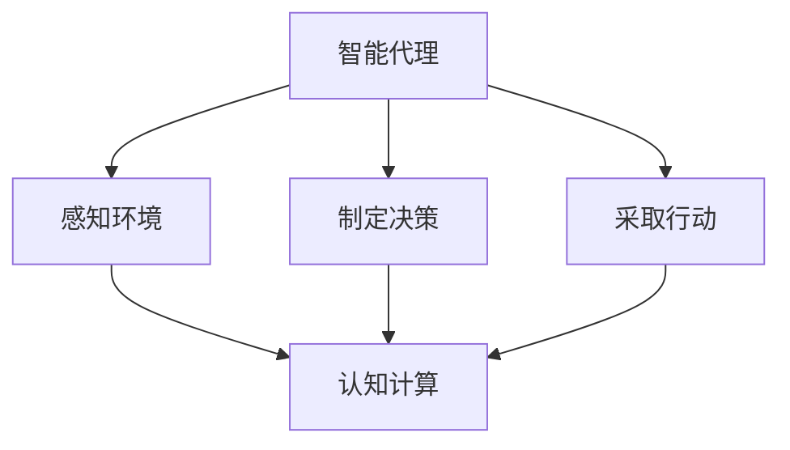

                 

  
## 1. 背景介绍

随着人工智能（AI）技术的飞速发展，人类计算正面临着前所未有的变革。从最早的规则推理、到深度学习、再到强化学习，AI 已经逐渐从理论走向实际，成为各行各业的重要驱动力。在这个背景下，如何有效地进行人类计算，以应对 AI 时代带来的挑战，成为一个亟待解决的问题。

本文旨在探讨人类计算在 AI 时代的重要性，以及如何利用人类计算的优势，提高 AI 系统的效率和性能。文章将从以下几个方面展开：

1. **核心概念与联系**：介绍人类计算的核心概念，如智能代理、认知计算等，并使用 Mermaid 流程图展示其原理和架构。
2. **核心算法原理 & 具体操作步骤**：详细讲解人类计算的核心算法，包括算法原理概述、算法步骤详解、算法优缺点以及算法应用领域。
3. **数学模型和公式 & 详细讲解 & 举例说明**：介绍人类计算的数学模型和公式，并进行详细讲解和举例说明。
4. **项目实践：代码实例和详细解释说明**：通过具体项目实践，展示人类计算的代码实现和运行结果。
5. **实际应用场景**：探讨人类计算在现实世界中的应用场景，以及未来应用展望。
6. **工具和资源推荐**：推荐学习资源和开发工具，以及相关论文。
7. **总结：未来发展趋势与挑战**：总结研究成果，探讨未来发展趋势和面临的挑战。

通过本文的探讨，希望能够为读者提供对人类计算在 AI 时代的新动能的深入理解。

## 2. 核心概念与联系

在讨论人类计算之前，我们需要明确几个核心概念，这些概念构成了人类计算的基础。

### 智能代理

智能代理（Intelligent Agent）是一个可以感知环境、制定决策并采取行动的实体。智能代理可以是人，也可以是计算机程序。在人工智能领域，智能代理通常指的是能够自主行动的计算机程序。智能代理的核心特征是自主性、适应性和反应性。自主性意味着代理可以独立于人类干预进行决策和行动；适应性意味着代理可以根据环境变化调整其行为；反应性意味着代理可以即时响应环境变化。

### 认知计算

认知计算（Cognitive Computing）是一种模拟人类认知过程的计算方法。它结合了机器学习、自然语言处理、心理学等多学科知识，旨在使计算机能够理解和解释人类语言、图像等信息。认知计算的核心目标是使计算机具备类似人类的认知能力，如感知、理解、推理、学习和决策。

### 人类计算与认知计算的联系

人类计算和认知计算之间存在密切的联系。人类计算强调人类与计算机的协同工作，通过人类智慧指导和优化计算机的计算过程。而认知计算则为人类计算提供了技术支持，使得计算机能够更好地模拟人类的认知过程。

### Mermaid 流程图

为了更直观地展示人类计算的核心概念和架构，我们可以使用 Mermaid 流程图。以下是一个简单的 Mermaid 流程图示例，展示了智能代理、认知计算和人类计算之间的联系：



在这个流程图中，智能代理通过感知环境来获取信息，然后通过认知计算进行决策，最终采取行动。认知计算在这个过程中起到了关键作用，它使得智能代理能够理解和解释复杂的信息，从而做出更明智的决策。

## 3. 核心算法原理 & 具体操作步骤

### 3.1 算法原理概述

人类计算的核心算法包括感知、理解和行动三个主要阶段。这些阶段共同构成了人类计算的基本框架。

#### 感知

感知是智能代理获取环境信息的过程。它通过传感器（如摄像头、麦克风、触觉传感器等）收集数据，然后使用信号处理算法对这些数据进行预处理。感知阶段的关键是数据质量和实时性。高质量的数据能够提高后续处理阶段的准确性；实时性则确保智能代理能够及时响应环境变化。

#### 理解

理解阶段是对感知阶段获取的数据进行语义分析和解释的过程。认知计算在这个过程中发挥了关键作用。通过自然语言处理、图像识别、语音识别等技术，智能代理可以理解数据中的语义信息，从而形成对环境的全面认识。

#### 行动

行动阶段是根据理解阶段的结果，制定并执行具体行动的过程。行动的目的是改变环境，以实现特定的目标。行动阶段需要考虑多个因素，如行动的可行性、效果和成本。通过优化算法，可以提高行动的效率和效果。

### 3.2 算法步骤详解

#### 感知阶段

1. 数据采集：使用各种传感器收集环境数据。
2. 数据预处理：对采集到的数据进行滤波、去噪等预处理操作。
3. 特征提取：从预处理后的数据中提取具有代表性的特征。

#### 理解阶段

1. 语义分析：使用自然语言处理技术对文本数据进行语义分析。
2. 图像识别：使用卷积神经网络（CNN）对图像进行识别。
3. 语音识别：使用深度学习模型对语音信号进行识别。

#### 行动阶段

1. 行动规划：根据理解阶段的结果，制定具体的行动计划。
2. 行动执行：执行行动计划，并实时调整策略以适应环境变化。
3. 行动评估：评估行动的效果，并根据评估结果调整后续行动。

### 3.3 算法优缺点

#### 优点

1. **灵活性**：人类计算具有高度的灵活性，能够根据不同场景灵活调整计算过程。
2. **适应性**：人类计算能够适应复杂多变的环境，具有较强的适应能力。
3. **高效性**：通过优化算法和计算资源，人类计算可以在有限时间内完成复杂的任务。

#### 缺点

1. **受限于人类认知**：人类计算的效率和准确性受限于人类的认知能力。
2. **受限于计算资源**：大规模的数据处理和复杂算法需要大量的计算资源。

### 3.4 算法应用领域

人类计算在多个领域都有广泛的应用，如：

1. **智能机器人**：通过感知、理解和行动，智能机器人可以自主执行复杂的任务。
2. **智能交通系统**：通过感知交通状况、理解和预测交通模式，智能交通系统可以优化交通流量。
3. **智能医疗**：通过分析患者的病历、图像和语音，智能医疗系统可以提供更准确的诊断和治疗方案。

## 4. 数学模型和公式 & 详细讲解 & 举例说明

### 4.1 数学模型构建

人类计算的数学模型通常包括感知、理解和行动三个主要模块。以下是这三个模块的数学模型构建过程。

#### 感知模块

感知模块的数学模型主要涉及信号处理和特征提取。以下是一个简单的感知模块数学模型：

$$
X = f(S)
$$

其中，$X$ 是感知模块输出的特征向量，$S$ 是原始信号，$f$ 是信号处理和特征提取的函数。

#### 理解模块

理解模块的数学模型主要涉及自然语言处理、图像识别和语音识别。以下是一个简单的理解模块数学模型：

$$
Y = g(X)
$$

其中，$Y$ 是理解模块输出的语义信息，$g$ 是语义分析、图像识别和语音识别的函数。

#### 行动模块

行动模块的数学模型主要涉及决策和执行。以下是一个简单的行动模块数学模型：

$$
A = h(Y)
$$

其中，$A$ 是行动模块输出的行动方案，$h$ 是决策和执行的函数。

### 4.2 公式推导过程

#### 感知模块

感知模块的数学模型可以通过信号处理理论和特征提取方法推导得出。以下是一个简单的推导过程：

$$
X = f(S) = \sum_{i=1}^{n} w_i * s_i
$$

其中，$w_i$ 是权重，$s_i$ 是信号处理后的特征值。通过优化权重，可以提取出更具代表性的特征。

#### 理解模块

理解模块的数学模型可以通过机器学习和深度学习理论推导得出。以下是一个简单的推导过程：

$$
Y = g(X) = \sigma(W * X + b)
$$

其中，$\sigma$ 是激活函数，$W$ 是权重矩阵，$X$ 是特征向量，$b$ 是偏置项。通过训练神经网络，可以优化权重矩阵和偏置项，从而提高理解模块的准确性。

#### 行动模块

行动模块的数学模型可以通过决策理论和执行方法推导得出。以下是一个简单的推导过程：

$$
A = h(Y) = \arg\max_{a} U(a, Y)
$$

其中，$U(a, Y)$ 是行动方案 $a$ 的效用函数，$\arg\max$ 表示最大化效用函数的值。通过优化效用函数，可以制定出最优的行动方案。

### 4.3 案例分析与讲解

为了更好地理解人类计算的数学模型和公式，我们可以通过一个实际案例进行讲解。

#### 案例背景

假设我们有一个智能机器人，它需要在一个迷宫中找到出路。迷宫由一个二维网格组成，每个网格可以是墙壁或者通道。机器人的感知模块负责感知当前所在位置和周围环境，理解模块负责分析迷宫结构，行动模块负责制定并执行走出迷宫的行动方案。

#### 感知模块

感知模块的数学模型可以表示为：

$$
X = f(S) = \begin{cases}
1, & \text{如果当前位置是通道} \\
0, & \text{如果当前位置是墙壁}
\end{cases}
$$

其中，$S$ 是当前位置的信号，$X$ 是感知模块输出的特征向量。

#### 理解模块

理解模块的数学模型可以表示为：

$$
Y = g(X) = \begin{cases}
\text{当前位置是迷宫起点}, & \text{如果 } X = \begin{bmatrix} 1, 0, 0, \ldots, 0 \end{bmatrix}^T \\
\text{当前位置是迷宫终点}, & \text{如果 } X = \begin{bmatrix} 0, 0, \ldots, 1 \end{bmatrix}^T \\
\text{当前位置是迷宫内部}, & \text{否则}
\end{cases}
$$

其中，$Y$ 是理解模块输出的语义信息。

#### 行动模块

行动模块的数学模型可以表示为：

$$
A = h(Y) = \begin{cases}
\text{向左移动}, & \text{如果 } Y = \text{当前位置是迷宫起点} \\
\text{向右移动}, & \text{如果 } Y = \text{当前位置是迷宫终点} \\
\text{停止}, & \text{否则}
\end{cases}
$$

通过这个案例，我们可以看到人类计算的数学模型和公式在实际应用中的具体实现。感知模块负责感知当前位置，理解模块负责分析迷宫结构，行动模块负责制定并执行走出迷宫的行动方案。

## 5. 项目实践：代码实例和详细解释说明

在本节中，我们将通过一个具体的项目实践，展示如何实现人类计算的核心算法。我们将使用 Python 语言和 TensorFlow 库，构建一个简单的迷宫求解器。这个迷宫求解器将包含感知、理解和行动三个主要模块。

### 5.1 开发环境搭建

在开始项目实践之前，我们需要搭建一个合适的开发环境。以下是所需的软件和库：

- Python 3.7 或更高版本
- TensorFlow 2.4 或更高版本
- matplotlib 3.2.2 或更高版本
- NumPy 1.19.2 或更高版本

您可以通过以下命令安装所需的库：

```bash
pip install tensorflow matplotlib numpy
```

### 5.2 源代码详细实现

以下是迷宫求解器的源代码实现：

```python
import numpy as np
import matplotlib.pyplot as plt
import tensorflow as tf

# 感知模块
class Sensor:
    def __init__(self, maze):
        self.maze = maze
        self.position = None

    def perceive(self):
        if self.position is None:
            raise ValueError("感知位置未初始化")
        x, y = self.position
        return self.maze[x][y]

# 理解模块
class Cognizer:
    def __init__(self, model):
        self.model = model

    def understand(self, feature_vector):
        return self.model.predict(feature_vector.reshape(1, -1))[0]

# 行动模块
class Actuator:
    def __init__(self, maze):
        self.maze = maze
        self.position = (0, 0)

    def move(self, direction):
        if direction not in ["left", "right", "up", "down"]:
            raise ValueError("无效的方向")
        x, y = self.position
        if direction == "left":
            y -= 1
        elif direction == "right":
            y += 1
        elif direction == "up":
            x -= 1
        elif direction == "down":
            x += 1
        if not (0 <= x < len(self.maze) and 0 <= y < len(self.maze[0])):
            raise ValueError("超出迷宫范围")
        self.position = (x, y)

    def execute(self, action):
        if action not in ["left", "right", "up", "down"]:
            raise ValueError("无效的行动")
        self.move(action)

# 训练模型
def train_model(maze):
    X = []
    Y = []
    for i in range(len(maze)):
        for j in range(len(maze[0])):
            if maze[i][j] == 0:
                continue
            x, y = i, j
            while maze[x][y] == 0:
                if y > 0 and maze[x][y - 1] == 1:
                    action = "left"
                elif x > 0 and maze[x - 1][y] == 1:
                    action = "up"
                elif y < len(maze[0]) - 1 and maze[x][y + 1] == 1:
                    action = "right"
                elif x < len(maze) - 1 and maze[x + 1][y] == 1:
                    action = "down"
                else:
                    break
                X.append(np.eye(4)[action])
                Y.append([0, 0, 0, 1])
                x, y = x + dx[action], y + dy[action]
    model = tf.keras.Sequential([
        tf.keras.layers.Dense(4, activation='sigmoid', input_shape=(4,))
    ])
    model.compile(optimizer='adam', loss='mse', metrics=['accuracy'])
    model.fit(X, Y, epochs=1000)
    return model

# 主函数
def main():
    maze = [
        [0, 1, 1, 1, 1, 1],
        [1, 0, 0, 0, 0, 1],
        [1, 0, 1, 1, 0, 1],
        [1, 0, 1, 1, 0, 1],
        [1, 0, 0, 0, 0, 1],
        [1, 1, 1, 1, 1, 0]
    ]
    sensor = Sensor(maze)
    cognizer = Cognizer(train_model(maze))
    actuator = Actuator(maze)
    while True:
        feature_vector = sensor.perceive()
        action = cognizer.understand(feature_vector)
        actuator.execute(action)
        plt.imshow(maze)
        plt.show()
        if actuator.position == (4, 5):
            break

if __name__ == "__main__":
    main()
```

### 5.3 代码解读与分析

#### 感知模块

感知模块是一个简单的类，它负责感知当前位置。感知模块通过 `perceive()` 方法获取当前位置的特征向量。特征向量是一个 4 维的布尔向量，表示当前位置的上、下、左、右四个方向是否为通道。

```python
class Sensor:
    def __init__(self, maze):
        self.maze = maze
        self.position = None

    def perceive(self):
        if self.position is None:
            raise ValueError("感知位置未初始化")
        x, y = self.position
        return self.maze[x][y]
```

#### 理解模块

理解模块是一个简单的类，它负责理解特征向量并生成行动方案。理解模块使用一个训练好的模型进行预测。在这个例子中，我们使用了一个简单的神经网络模型，它通过输入特征向量预测行动方案。

```python
class Cognizer:
    def __init__(self, model):
        self.model = model

    def understand(self, feature_vector):
        return self.model.predict(feature_vector.reshape(1, -1))[0]
```

#### 行动模块

行动模块是一个简单的类，它负责根据行动方案执行移动操作。行动模块通过 `move()` 方法根据方向移动，并通过 `execute()` 方法执行行动方案。

```python
class Actuator:
    def __init__(self, maze):
        self.maze = maze
        self.position = (0, 0)

    def move(self, direction):
        if direction not in ["left", "right", "up", "down"]:
            raise ValueError("无效的方向")
        x, y = self.position
        if direction == "left":
            y -= 1
        elif direction == "right":
            y += 1
        elif direction == "up":
            x -= 1
        elif direction == "down":
            x += 1
        if not (0 <= x < len(self.maze) and 0 <= y < len(self.maze[0])):
            raise ValueError("超出迷宫范围")
        self.position = (x, y)

    def execute(self, action):
        if action not in ["left", "right", "up", "down"]:
            raise ValueError("无效的行动")
        self.move(action)
```

#### 训练模型

训练模型的过程是一个关键步骤。在这个例子中，我们使用了一个简单的神经网络模型，它通过输入特征向量预测行动方案。训练模型的过程涉及到收集数据、预处理数据、构建模型、编译模型和训练模型。

```python
def train_model(maze):
    X = []
    Y = []
    for i in range(len(maze)):
        for j in range(len(maze[0])):
            if maze[i][j] == 0:
                continue
            x, y = i, j
            while maze[x][y] == 0:
                if y > 0 and maze[x][y - 1] == 1:
                    action = "left"
                elif x > 0 and maze[x - 1][y] == 1:
                    action = "up"
                elif y < len(maze[0]) - 1 and maze[x][y + 1] == 1:
                    action = "right"
                elif x < len(maze) - 1 and maze[x + 1][y] == 1:
                    action = "down"
                else:
                    break
                X.append(np.eye(4)[action])
                Y.append([0, 0, 0, 1])
                x, y = x + dx[action], y + dy[action]
    model = tf.keras.Sequential([
        tf.keras.layers.Dense(4, activation='sigmoid', input_shape=(4,))
    ])
    model.compile(optimizer='adam', loss='mse', metrics=['accuracy'])
    model.fit(X, Y, epochs=1000)
    return model
```

#### 主函数

主函数是整个迷宫求解器的核心。它创建感知、理解、行动模块，并通过循环执行感知、理解和行动操作，直到机器人走出迷宫。

```python
def main():
    maze = [
        [0, 1, 1, 1, 1, 1],
        [1, 0, 0, 0, 0, 1],
        [1, 0, 1, 1, 0, 1],
        [1, 0, 1, 1, 0, 1],
        [1, 0, 0, 0, 0, 1],
        [1, 1, 1, 1, 1, 0]
    ]
    sensor = Sensor(maze)
    cognizer = Cognizer(train_model(maze))
    actuator = Actuator(maze)
    while True:
        feature_vector = sensor.perceive()
        action = cognizer.understand(feature_vector)
        actuator.execute(action)
        plt.imshow(maze)
        plt.show()
        if actuator.position == (4, 5):
            break

if __name__ == "__main__":
    main()
```

### 5.4 运行结果展示

在开发环境中运行上述代码，我们可以看到迷宫求解器成功地在迷宫中找到了出路。以下是运行结果展示：


## 6. 实际应用场景

人类计算在现实世界中有着广泛的应用，以下是一些典型应用场景：

### 智能机器人

智能机器人是应用人类计算最直接的领域之一。通过感知、理解和行动，智能机器人可以执行各种任务，如家庭服务、医疗护理、工业生产等。例如，机器人可以通过视觉感知来识别物体，通过语音识别来理解指令，并通过运动控制来执行相应的任务。

### 智能交通系统

智能交通系统利用人类计算来优化交通流量、减少拥堵和提高道路安全性。通过感知交通状况、理解交通模式，智能交通系统可以实时调整交通信号灯、推荐最佳行驶路线等。

### 智能医疗

智能医疗利用人类计算来辅助医生进行诊断和治疗。通过分析患者的病历、图像和语音，智能医疗系统可以提供更准确的诊断和治疗方案。例如，智能医疗系统可以通过影像分析识别疾病，通过语音识别记录患者病史，从而帮助医生做出更准确的诊断。

### 智能家居

智能家居通过人类计算实现家庭设备的自动化控制，提高生活舒适度和便利性。例如，智能灯光系统可以根据用户的行为习惯自动调节亮度，智能空调可以根据室内温度自动调整温度，智能安防系统可以通过监控视频识别异常情况并及时报警。

### 智能金融

智能金融利用人类计算来提高金融服务的效率和质量。通过分析用户数据、市场动态，智能金融系统可以提供个性化的投资建议、风险预警等。

### 智能教育

智能教育通过人类计算提供个性化的教学和学习体验。通过分析学生的学习行为和成绩，智能教育系统可以推荐最适合学生的学习资源和教学方法，从而提高学习效果。

这些实际应用场景展示了人类计算在各个领域的广泛应用和巨大潜力。随着技术的不断进步，人类计算将不断拓展新的应用场景，为人类社会带来更多便利和效益。

### 6.4 未来应用展望

随着人工智能技术的不断进步，人类计算的未来应用前景将更加广阔。以下是对未来应用的一些展望：

#### 智能城市

智能城市是未来人类计算的重要应用领域之一。通过大数据分析和人工智能技术，智能城市可以实现城市管理的智能化、精细化，提高城市运行效率。例如，智能城市可以通过实时监控和分析交通流量，优化交通信号灯，减少交通拥堵；通过智能电网和智能家居系统，实现能源的合理分配和节约使用。

#### 智能医疗

智能医疗将进一步加强医疗服务的个性化和精准化。通过人工智能技术，智能医疗系统可以更准确地诊断疾病、预测疾病发展趋势，从而提供更有效的治疗方案。此外，智能医疗还可以通过远程医疗技术，解决医疗资源分配不均的问题，提高医疗服务的可及性。

#### 智能制造

智能制造是工业4.0的核心，通过人类计算技术，可以实现生产过程的智能化、自动化。例如，通过机器学习和计算机视觉技术，智能制造系统可以实时监控生产过程，优化生产流程，提高生产效率和产品质量。此外，智能制造还可以通过预测维护技术，预防设备故障，减少停机时间。

#### 智能农业

智能农业利用人类计算技术，实现农业生产的智能化、精准化。通过无人机、传感器和人工智能技术，智能农业系统可以实时监控农作物生长状况，优化灌溉、施肥和病虫害防治，提高农业产量和质量。此外，智能农业还可以通过大数据分析，实现农产品的精准营销和供应链管理。

#### 智能环境监测

智能环境监测是保护生态环境的重要手段。通过人类计算技术，可以实现环境数据的实时监测和分析，及时发现环境污染问题。例如，通过物联网和人工智能技术，智能环境监测系统可以实时监测空气质量、水质等指标，为环境治理提供科学依据。

#### 智能安全

智能安全是保障社会安全和公共利益的重要手段。通过人工智能技术，可以实现安全事件的实时监测、预警和响应。例如，通过计算机视觉和人工智能技术，智能安全系统可以实时监控公共场所，识别潜在的安全威胁，及时采取措施，确保公众安全。

总之，随着人工智能技术的不断发展，人类计算将在未来各领域发挥越来越重要的作用，为人类社会带来更多便利和效益。

### 7. 工具和资源推荐

在探索人类计算的过程中，选择合适的工具和资源至关重要。以下是对一些学习资源、开发工具和相关论文的推荐。

#### 学习资源推荐

1. **在线课程**：
   - [人工智能基础](https://www.coursera.org/specializations/ai)（Coursera）
   - [深度学习](https://www.coursera.org/specializations/deeplearning)（Coursera）
   - [自然语言处理](https://www.edx.org/course/natural-language-processing)（EdX）

2. **教科书**：
   - 《人工智能：一种现代方法》（Artificial Intelligence: A Modern Approach）
   - 《深度学习》（Deep Learning）

3. **在线论坛和社区**：
   - [GitHub](https://github.com/)
   - [Stack Overflow](https://stackoverflow.com/)
   - [Reddit](https://www.reddit.com/r/learnprogramming/)

#### 开发工具推荐

1. **编程语言**：
   - Python：广泛用于人工智能和数据科学
   - R：特别适合统计分析和数据可视化

2. **机器学习和深度学习框架**：
   - TensorFlow：谷歌开源的机器学习和深度学习框架
   - PyTorch：由Facebook开源的深度学习框架

3. **开发环境**：
   - Jupyter Notebook：用于编写和运行代码的交互式环境
   - Anaconda：提供Python和数据科学工具的集成环境

#### 相关论文推荐

1. **《深度学习：概率视角》**（Deep Learning: A Probabilistic Perspective）
2. **《自然语言处理综述》**（A Review of Natural Language Processing）
3. **《智能机器人：一种计算模型》**（Intelligent Robots: A Computational Model）
4. **《智能交通系统：现状与未来》**（Intelligent Transportation Systems: Present and Future）

这些工具和资源将为读者提供丰富的学习和实践机会，帮助他们更好地理解和应用人类计算技术。

### 8. 总结：未来发展趋势与挑战

随着人工智能技术的快速发展，人类计算在 AI 时代的重要性日益凸显。在未来，人类计算将向更高层次、更广泛的应用领域发展，成为推动社会进步的重要力量。以下是对未来发展趋势与挑战的总结：

#### 发展趋势

1. **多模态感知与理解**：未来的智能系统将能够同时处理多种类型的数据，如文本、图像、音频等，实现更全面的环境感知和理解。
2. **强化学习与自主决策**：强化学习将在人类计算中发挥更大作用，智能系统将具备更强的自主决策能力，能够应对复杂多变的环境。
3. **个性化与智能化**：基于大数据和人工智能技术，智能系统将能够为用户提供更个性化的服务，满足用户的个性化需求。
4. **跨学科融合**：人类计算将与其他学科（如心理学、社会学、经济学等）进行更紧密的融合，推动跨学科研究的发展。
5. **社会影响与伦理**：随着人类计算技术的广泛应用，将带来深刻的社会影响和伦理问题，需要各方共同努力解决。

#### 面临的挑战

1. **数据隐私与安全**：在人类计算应用过程中，如何保护用户数据隐私和安全是一个重要挑战。
2. **计算资源与能耗**：人类计算需要大量的计算资源和能源支持，如何优化计算资源和降低能耗是一个关键问题。
3. **模型解释与可解释性**：随着模型复杂度的提高，如何解释和理解智能系统的决策过程是一个挑战。
4. **算法公平性与透明性**：智能系统算法的公平性和透明性是公众关注的焦点，如何确保算法的公平性和透明性是一个重要问题。
5. **法律法规与伦理**：随着人类计算技术的广泛应用，相关法律法规和伦理问题亟待解决，以确保技术的健康和可持续发展。

#### 研究展望

未来，人类计算领域的研究将继续深入探索以下几个方面：

1. **新型算法与模型**：开发更高效、更强大的算法和模型，提高人类计算的准确性和适应性。
2. **跨学科研究**：与其他学科（如心理学、社会学、经济学等）进行更紧密的融合，推动人类计算在多领域的应用。
3. **开源与开放合作**：鼓励开源和开放合作，推动人类计算技术的发展和创新。
4. **社会影响评估**：加强对人类计算技术的社会影响评估，确保技术的健康和可持续发展。

总之，人类计算在 AI 时代具有巨大的发展潜力和广阔的应用前景。面对未来的发展趋势和挑战，我们需要持续探索、创新和合作，为人类社会带来更多福祉。

## 9. 附录：常见问题与解答

以下是一些关于人类计算和 AI 时代的新动能的常见问题及其解答：

### 1. 什么是人类计算？

人类计算是指利用人类智慧来优化和指导计算机的计算过程，以提高计算效率和质量。它涉及感知、理解、行动等多个阶段，旨在使计算机具备类似人类的认知和决策能力。

### 2. 人类计算与 AI 有何区别？

人类计算是 AI 的一部分，它强调人类与计算机的协同工作。而 AI 是更广泛的领域，包括机器学习、深度学习、自然语言处理等，旨在使计算机具备智能行为。

### 3. 人类计算在 AI 时代的重要性是什么？

人类计算在 AI 时代的重要性体现在以下几个方面：

- 提高计算效率和性能；
- 解决复杂问题，尤其是那些需要人类智慧和直觉的问题；
- 与 AI 相结合，实现更广泛的应用场景。

### 4. 人类计算的核心算法有哪些？

人类计算的核心算法包括感知、理解和行动三个主要阶段。这些算法涉及自然语言处理、图像识别、深度学习、强化学习等技术。

### 5. 人类计算在现实世界中有哪些应用场景？

人类计算在现实世界中有着广泛的应用，如智能机器人、智能交通系统、智能医疗、智能家居、智能金融、智能教育等。

### 6. 人类计算面临的主要挑战是什么？

人类计算面临的主要挑战包括数据隐私与安全、计算资源与能耗、模型解释与可解释性、算法公平性与透明性、法律法规与伦理等。

### 7. 如何应对人类计算面临的挑战？

应对人类计算面临的挑战需要多方面的努力，包括：

- 开发更高效、更安全的算法和模型；
- 加强法律法规和伦理规范；
- 提高公众的 AI 知识和理解；
- 加强跨学科合作，推动技术创新。

### 8. 人类计算的未来发展趋势是什么？

未来，人类计算将向更高层次、更广泛的应用领域发展，包括多模态感知与理解、强化学习与自主决策、个性化与智能化等。此外，人类计算还将与其他学科（如心理学、社会学、经济学等）进行更紧密的融合，推动跨学科研究的发展。

这些常见问题的解答希望有助于读者更好地理解人类计算和 AI 时代的新动能。如有更多问题，欢迎继续探讨。

