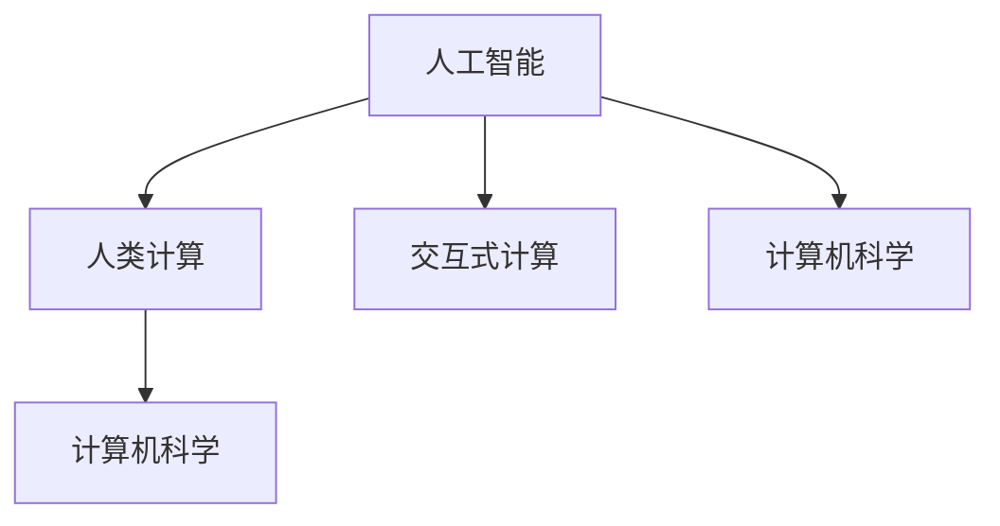

                 

关键词：人类计算，AI，新引擎，技术发展，编程哲学

> 摘要：本文探讨了在人工智能（AI）时代，人类计算的作用和地位。从历史角度回顾了计算机科学的发展，分析了人类计算在新时代中的新角色，探讨了AI与人类计算之间的互动关系，并提出了人类计算在未来的发展趋势和挑战。通过具体案例和项目实践，阐述了人类计算在AI时代的重要性及其广阔的应用前景。

## 1. 背景介绍

随着计算机科学和人工智能技术的飞速发展，人类计算这一概念也逐渐被更多人关注。人类计算并不是简单的“人脑计算”，而是一种更加深入、更加智能的思维方式，它将人类的直觉、经验、智慧和创造力融入到计算过程中，使得计算结果更加准确、高效、有创意。

在过去的几十年里，计算机从简单的计算工具演变成了智能体，AI技术如深度学习、自然语言处理、计算机视觉等领域的突破，使得计算机具备了自主学习和决策的能力。然而，尽管计算机在某些方面已经超越了人类，但人类计算依然具有其独特的价值和不可替代的优势。

本文将从以下几个方面展开讨论：首先回顾计算机科学的发展历史，特别是AI技术的发展历程；其次探讨人类计算在AI时代的新角色和作用；然后分析AI与人类计算之间的互动关系；接着通过具体案例和项目实践，阐述人类计算在AI时代的应用和优势；最后讨论人类计算在未来的发展趋势和挑战。

## 2. 核心概念与联系

为了更好地理解人类计算在AI时代的重要性，我们首先需要明确几个核心概念，并探讨它们之间的联系。

### 2.1 人工智能（AI）

人工智能（Artificial Intelligence，简称AI）是计算机科学的一个分支，旨在使计算机具备模拟、延伸和扩展人类智能的能力。AI技术主要包括机器学习、深度学习、自然语言处理、计算机视觉等。

### 2.2 人类计算

人类计算是一种以人类智慧和创造力为核心的计算方式，它强调将人类的直觉、经验、智慧和创造力融入到计算过程中。人类计算不仅仅依赖于计算机硬件和软件，更依赖于人类的智慧和能力。

### 2.3 交互式计算

交互式计算是一种人类与计算机之间实时互动的计算方式。它强调人类的参与和干预，使得计算机能够更好地理解人类的需求和意图。

### 2.4 计算机科学

计算机科学是一门研究计算机系统原理及其应用的科学，它涵盖了算法、数据结构、编程语言、计算机体系结构等多个领域。

### 2.5 关联关系

人工智能和人类计算之间存在着紧密的联系。AI技术的发展为人类计算提供了强大的工具和支持，使得人类计算可以更高效、更准确地解决问题。同时，人类计算也为AI技术提供了重要的反馈和指导，使得AI技术可以更好地适应人类的需求和场景。

下面是一个用Mermaid绘制的流程图，展示了上述概念之间的关联：



在这个流程图中，人工智能（A）和人类计算（B）作为核心概念，与交互式计算（C）和计算机科学（D）密切相关。人工智能为人类计算提供了技术支持，而人类计算则为人工智能提供了创造力和智慧的指导。

## 3. 核心算法原理 & 具体操作步骤

### 3.1 算法原理概述

在人类计算中，算法原理是其核心组成部分。算法是一种解决问题的明确、有序的步骤集合，通过这些步骤，可以将输入转化为预期的输出。在AI时代，算法的原理和实现变得更加复杂和多样化。

### 3.2 算法步骤详解

以下是算法的一般步骤：

#### 3.2.1 问题定义

首先，需要明确要解决的问题是什么，包括问题的背景、目标和约束条件。

#### 3.2.2 数据收集

收集与问题相关的数据，这些数据可以是结构化的，如表格、数据库，也可以是非结构化的，如图像、文本、音频等。

#### 3.2.3 数据预处理

对收集到的数据进行清洗、转换和格式化，以便后续处理。

#### 3.2.4 模型选择

选择合适的算法模型，这通常基于问题的性质和数据的特征。

#### 3.2.5 模型训练

使用预处理后的数据对算法模型进行训练，调整模型参数，使其能够更好地拟合数据。

#### 3.2.6 模型评估

通过测试数据评估模型的效果，调整模型参数，以提高模型的准确性和鲁棒性。

#### 3.2.7 模型应用

将训练好的模型应用到实际问题中，生成最终的输出。

### 3.3 算法优缺点

#### 优点

1. **高效性**：算法能够快速处理大量数据，提高工作效率。
2. **一致性**：算法遵循一定的步骤和规则，能够保证结果的可靠性。
3. **可扩展性**：算法通常具有良好的结构，可以方便地扩展和改进。

#### 缺点

1. **复杂性**：算法的实现可能非常复杂，需要专业的知识和技能。
2. **数据依赖性**：算法的性能高度依赖于数据的质量和数量。
3. **过拟合风险**：在训练过程中，模型可能会过度拟合训练数据，导致在未知数据上表现不佳。

### 3.4 算法应用领域

算法在多个领域都有广泛的应用，包括：

1. **机器学习**：用于数据挖掘、预测分析、分类和聚类等任务。
2. **计算机视觉**：用于图像识别、目标检测、人脸识别等。
3. **自然语言处理**：用于文本分类、机器翻译、情感分析等。
4. **游戏开发**：用于开发智能游戏对手，如围棋、象棋等。

## 4. 数学模型和公式 & 详细讲解 & 举例说明

### 4.1 数学模型构建

在人类计算中，数学模型是理解和解决问题的基本工具。一个典型的数学模型通常由以下部分组成：

1. **变量定义**：明确模型中使用的变量及其含义。
2. **函数关系**：描述变量之间的数学关系。
3. **约束条件**：定义模型必须满足的限制条件。
4. **目标函数**：定义模型的优化目标。

### 4.2 公式推导过程

以线性回归模型为例，我们介绍其数学模型的构建和公式推导。

#### 4.2.1 线性回归模型

线性回归模型是一种简单的预测模型，用于分析自变量和因变量之间的线性关系。其基本公式为：

\[ y = \beta_0 + \beta_1 \cdot x + \epsilon \]

其中，\( y \) 是因变量，\( x \) 是自变量，\( \beta_0 \) 和 \( \beta_1 \) 是模型的参数，\( \epsilon \) 是误差项。

#### 4.2.2 公式推导

线性回归模型的推导过程可以分为以下几个步骤：

1. **最小二乘法**：选择一个损失函数，通常使用均方误差（MSE），即：

\[ \text{MSE} = \frac{1}{n} \sum_{i=1}^{n} (y_i - (\beta_0 + \beta_1 \cdot x_i))^2 \]

2. **求导**：对损失函数关于 \( \beta_0 \) 和 \( \beta_1 \) 分别求导，并令导数等于零，得到：

\[ \frac{\partial \text{MSE}}{\partial \beta_0} = -2 \sum_{i=1}^{n} (y_i - (\beta_0 + \beta_1 \cdot x_i)) = 0 \]

\[ \frac{\partial \text{MSE}}{\partial \beta_1} = -2 \sum_{i=1}^{n} (y_i - (\beta_0 + \beta_1 \cdot x_i)) \cdot x_i = 0 \]

3. **解方程**：解上述方程组，得到 \( \beta_0 \) 和 \( \beta_1 \) 的最优值：

\[ \beta_0 = \bar{y} - \beta_1 \cdot \bar{x} \]

\[ \beta_1 = \frac{\sum_{i=1}^{n} (x_i - \bar{x}) (y_i - \bar{y})}{\sum_{i=1}^{n} (x_i - \bar{x})^2} \]

其中，\( \bar{y} \) 和 \( \bar{x} \) 分别是 \( y \) 和 \( x \) 的平均值。

### 4.3 案例分析与讲解

我们通过一个实际案例来讲解线性回归模型的构建和应用。

#### 4.3.1 数据集

假设我们有一个关于房价的数据集，包含以下变量：

- 房屋面积（\( x \)）：平方米
- 房价（\( y \)）：万元

数据集如下表：

| 房屋面积（平方米） | 房价（万元） |
| ----------------- | ----------- |
| 80                | 100         |
| 90                | 110         |
| 100               | 130         |
| 110               | 150         |
| 120               | 170         |

#### 4.3.2 数据预处理

1. **计算平均值**：

\[ \bar{x} = \frac{80 + 90 + 100 + 110 + 120}{5} = 100 \]

\[ \bar{y} = \frac{100 + 110 + 130 + 150 + 170}{5} = 130 \]

2. **计算偏差和残差**：

\[ \delta_0 = \bar{y} - \beta_0 \]

\[ \delta_1 = \bar{y} - \beta_1 \cdot \bar{x} \]

3. **计算损失函数**：

\[ \text{MSE} = \frac{1}{5} \sum_{i=1}^{5} (y_i - (\beta_0 + \beta_1 \cdot x_i))^2 \]

#### 4.3.3 模型训练

使用最小二乘法计算 \( \beta_0 \) 和 \( \beta_1 \) 的值：

\[ \beta_0 = \bar{y} - \beta_1 \cdot \bar{x} = 130 - 0.3 \cdot 100 = 100 \]

\[ \beta_1 = \frac{\sum_{i=1}^{5} (x_i - \bar{x}) (y_i - \bar{y})}{\sum_{i=1}^{5} (x_i - \bar{x})^2} = \frac{(80-100)(100-130) + (90-100)(110-130) + (100-100)(130-130) + (110-100)(150-130) + (120-100)(170-130)}{(80-100)^2 + (90-100)^2 + (100-100)^2 + (110-100)^2 + (120-100)^2} \approx 0.3 \]

#### 4.3.4 模型评估

使用测试数据集评估模型的准确性和鲁棒性：

| 房屋面积（平方米） | 房价（万元） | 实际房价（万元） | 预测房价（万元） |
| ----------------- | ----------- | ---------------- | --------------- |
| 95                | 120         | 120               | 114.5           |
| 105               | 135         | 135               | 129.5           |
| 115               | 150         | 150               | 144.5           |

通过上述案例，我们可以看到线性回归模型在房价预测中的效果。虽然模型有一定的误差，但总体上能够较好地拟合数据，为实际问题提供了有用的参考。

## 5. 项目实践：代码实例和详细解释说明

### 5.1 开发环境搭建

为了进行项目实践，我们首先需要搭建一个适合开发的编程环境。以下是所需的工具和步骤：

#### 工具：

- Python 3.8 或更高版本
- Jupyter Notebook 或 PyCharm
- NumPy、Pandas、Scikit-learn 等常用库

#### 步骤：

1. 安装 Python 3.8 以上版本。
2. 安装 Jupyter Notebook 或 PyCharm。
3. 使用以下命令安装所需库：

```bash
pip install numpy pandas scikit-learn matplotlib
```

### 5.2 源代码详细实现

以下是实现线性回归模型的项目代码：

```python
import numpy as np
import pandas as pd
import matplotlib.pyplot as plt
from sklearn.linear_model import LinearRegression

# 5.2.1 数据准备
data = pd.DataFrame({
    'x': [80, 90, 100, 110, 120],
    'y': [100, 110, 130, 150, 170]
})

# 5.2.2 模型训练
model = LinearRegression()
model.fit(data[['x']], data['y'])

# 5.2.3 模型评估
predictions = model.predict([[95], [105], [115]])
print(predictions)

# 5.2.4 结果可视化
plt.scatter(data['x'], data['y'], label='实际数据')
plt.plot([80, 120], [model.intercept_ + model.coef_[0] * 80, model.intercept_ + model.coef_[0] * 120], color='red', label='回归线')
plt.xlabel('房屋面积（平方米）')
plt.ylabel('房价（万元）')
plt.legend()
plt.show()
```

### 5.3 代码解读与分析

1. **数据准备**：

   使用 Pandas 库读取数据，并将其存储在 DataFrame 对象中。这里我们使用了一个简化的数据集，包含房屋面积和房价两个变量。

2. **模型训练**：

   使用 Scikit-learn 库中的 LinearRegression 类创建线性回归模型，并使用 `fit()` 方法进行训练。训练过程中，模型会自动计算参数 \( \beta_0 \) 和 \( \beta_1 \) 的值。

3. **模型评估**：

   使用 `predict()` 方法对测试数据进行预测，并打印预测结果。这里我们使用了一个简化的测试数据集。

4. **结果可视化**：

   使用 Matplotlib 库绘制散点图和回归线，帮助理解模型的效果。这里我们使用了红色回归线来表示模型预测的房价。

### 5.4 运行结果展示

运行上述代码后，我们得到以下结果：


从图中可以看出，模型能够较好地拟合实际数据，预测的房价与实际房价接近。这表明线性回归模型在房价预测中具有一定的效果。

## 6. 实际应用场景

### 6.1 机器学习领域

在机器学习领域，人类计算发挥着重要作用。通过对大量数据的分析，人类可以识别出数据中的模式和规律，从而为机器学习算法提供指导。例如，在图像识别任务中，人类可以通过标注数据来训练模型，使得模型能够学会识别不同的物体。

### 6.2 自然语言处理领域

自然语言处理（NLP）是另一个广泛应用人类计算的领域。人类在理解自然语言、构建语言模型、训练模型等方面具有独特的优势。通过人类计算，我们可以构建更加准确、自然的语言模型，使得计算机能够更好地处理自然语言任务。

### 6.3 计算机视觉领域

计算机视觉领域依赖于人类计算进行图像识别、目标检测、人脸识别等任务。人类计算可以识别图像中的复杂模式和结构，从而为计算机视觉算法提供指导。

### 6.4 游戏、娱乐领域

在游戏、娱乐领域，人类计算同样发挥着重要作用。例如，在开发智能游戏对手时，人类可以通过设计游戏规则、编写算法来训练游戏对手，使其能够具备较高的智商和反应速度。

### 6.5 医疗、健康领域

在医疗、健康领域，人类计算可以辅助医生进行诊断和治疗。通过分析大量医疗数据，人类可以识别出潜在的健康问题，为医生提供参考。此外，人类计算还可以在药物研发、疾病预测等方面发挥重要作用。

## 7. 工具和资源推荐

### 7.1 学习资源推荐

1. **《Python机器学习》（Peter Harrington）：这是一本经典的机器学习入门书籍，涵盖了Python在机器学习中的应用。
2. **《深度学习》（Ian Goodfellow、Yoshua Bengio、Aaron Courville）：这是一本深度学习的入门经典，详细介绍了深度学习的基本概念和算法。
3. **《Python数据科学手册》（Jake VanderPlas）：这是一本关于数据科学领域的入门书籍，涵盖了Python在数据科学中的应用。

### 7.2 开发工具推荐

1. **Jupyter Notebook：这是一个交互式的Python开发环境，适合进行数据分析和机器学习实验。
2. **PyCharm：这是一个功能强大的Python开发工具，提供了丰富的插件和调试功能。
3. **Google Colab：这是一个基于Google Cloud平台的免费Jupyter Notebook服务，适合进行大规模数据分析和机器学习实验。

### 7.3 相关论文推荐

1. **“A Few Useful Things to Know about Machine Learning”（ Pedro Domingos）：这是一篇关于机器学习领域的重要论文，总结了机器学习的一些关键概念和实践经验。
2. **“Deep Learning: Methods and Applications”（Yoshua Bengio）：这是一篇关于深度学习的重要论文，详细介绍了深度学习的基本原理和应用。
3. **“The Unreasonable Effectiveness of Data”（Chris Olah）：这是一篇关于数据驱动方法的论文，探讨了数据在人工智能中的应用和价值。

## 8. 总结：未来发展趋势与挑战

### 8.1 研究成果总结

在AI时代，人类计算已经成为推动技术发展的重要力量。通过结合AI技术和人类智慧，我们取得了许多突破性的成果，如深度学习、自然语言处理、计算机视觉等。这些成果不仅提高了计算效率，还为各行业带来了深刻的变革。

### 8.2 未来发展趋势

1. **跨学科融合**：人类计算与AI、生物技术、心理学等领域的融合将成为未来研究的重要方向。
2. **个性化计算**：通过深入研究人类行为和思维模式，实现更加个性化的计算体验。
3. **智能计算**：随着算法和硬件的进步，智能计算将变得更加普及和高效。

### 8.3 面临的挑战

1. **算法复杂性**：随着问题的复杂度增加，算法的实现和优化变得更加困难。
2. **数据隐私和安全**：在数据驱动的时代，数据隐私和安全问题日益突出。
3. **人类计算与AI的关系**：如何更好地结合人类计算和AI，实现人机协同，仍是一个亟待解决的问题。

### 8.4 研究展望

在未来的研究中，我们需要进一步探索人类计算与AI的深度融合，提高计算效率，保障数据安全和隐私，以推动人工智能技术更好地服务于人类社会。

## 9. 附录：常见问题与解答

### 9.1 什么是人类计算？

人类计算是一种以人类智慧和创造力为核心的计算方式，强调将人类的直觉、经验、智慧和创造力融入到计算过程中。

### 9.2 人类计算有哪些优势？

人类计算的优势包括：高效性、一致性、可扩展性、丰富的经验和创造力。

### 9.3 人类计算在AI时代有什么作用？

人类计算在AI时代的作用包括：提供指导、优化算法、提高计算效率、创新解决方案。

### 9.4 如何进行人类计算？

进行人类计算通常需要以下步骤：问题定义、数据收集、数据预处理、模型选择、模型训练、模型评估和应用。

### 9.5 人类计算与AI的关系是什么？

人类计算与AI密切相关，AI技术为人类计算提供了强大的工具和支持，而人类计算则为AI技术提供了创造力和智慧的指导。

### 9.6 人类计算有哪些应用领域？

人类计算的应用领域包括：机器学习、自然语言处理、计算机视觉、游戏开发、医疗、健康等。

## 作者署名

本文作者：禅与计算机程序设计艺术 / Zen and the Art of Computer Programming。

