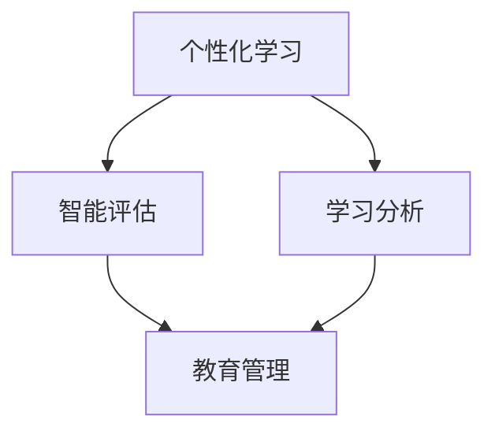

                 

关键词：人工智能，教育，培训，AI时代，教育技术，人才培养

> 摘要：随着人工智能技术的快速发展，教育领域面临着前所未有的变革。本文从人工智能的角度出发，探讨了AI时代的教育和培训的变革方向、核心概念、算法原理、数学模型、实践应用、未来展望以及面临的挑战，旨在为教育工作者和培训师提供有价值的参考。

## 1. 背景介绍

随着人工智能（Artificial Intelligence, AI）技术的飞速发展，人类计算这一领域正经历着前所未有的变革。传统教育模式已经无法满足现代社会对人才的需求，尤其是在AI时代，教育与培训的互动和融合变得至关重要。本章节将介绍人工智能在教育领域中的背景和应用，为后续讨论奠定基础。

### 1.1 人工智能技术的发展

人工智能技术自20世纪50年代起不断发展，至今已经经历了多个阶段。从早期的符号主义、知识表示到基于统计的学习、神经网络，再到如今的多模态学习、生成对抗网络（GANs）等，人工智能技术已经渗透到我们生活的方方面面。人工智能技术的快速发展为教育领域带来了新的机遇和挑战。

### 1.2 教育领域的人工智能应用

人工智能在教育领域中的应用主要包括个性化学习、智能评估、学习分析、教育管理等方面。例如，通过学习分析技术，教育机构可以更好地了解学生的学习行为和需求，从而提供更个性化的教育服务。而智能评估系统则可以帮助教师更准确地评估学生的学习成果。

## 2. 核心概念与联系

在教育领域，人工智能的应用离不开以下几个核心概念：

### 2.1 个性化学习

个性化学习是指根据每个学生的特点和需求，提供定制化的学习资源和教学策略。个性化学习的关键在于如何准确识别和理解每个学生的学习风格、兴趣和能力。这需要借助人工智能技术，如学习分析、自然语言处理和推荐系统等。

### 2.2 智能评估

智能评估是指利用人工智能技术，如机器学习和数据挖掘，对学生的学习过程和成果进行自动化评估。智能评估不仅能够提高评估的准确性，还能为教师提供详细的学生学习数据，帮助他们更好地了解学生的学习状况。

### 2.3 学习分析

学习分析是指通过分析学生的学习数据，如学习行为、成绩、参与度等，来了解学生的学习过程和效果。学习分析可以帮助教育机构制定更有效的教学策略，提高学生的学习成果。

### 2.4 教育管理

教育管理是指利用人工智能技术，如智能推荐、预测分析和自动化流程，来优化教育机构的管理工作。教育管理可以帮助教育机构提高运营效率，降低成本。

### 2.5 Mermaid 流程图

下面是一个描述这些核心概念之间联系的Mermaid流程图：



## 3. 核心算法原理 & 具体操作步骤

### 3.1 算法原理概述

在教育领域，人工智能的核心算法主要包括机器学习算法、神经网络算法和推荐系统算法。这些算法的原理和应用将在本章节进行详细阐述。

### 3.2 算法步骤详解

#### 3.2.1 机器学习算法

机器学习算法是通过训练模型来模拟人类学习过程，从而实现自动化学习任务。在教育领域，机器学习算法可以应用于个性化学习、智能评估和学习分析等方面。

- **步骤1：数据收集**：收集学生的学习数据，如成绩、学习行为等。
- **步骤2：数据预处理**：对收集到的数据进行分析和清洗，去除噪声和不完整的数据。
- **步骤3：模型训练**：使用机器学习算法，如决策树、支持向量机等，对预处理后的数据进行训练，以建立预测模型。
- **步骤4：模型评估**：使用评估指标，如准确率、召回率等，对训练好的模型进行评估和调整。

#### 3.2.2 神经网络算法

神经网络算法是一种模仿人脑结构的计算模型，它在图像识别、自然语言处理等领域有着广泛的应用。在教育领域，神经网络算法可以用于个性化学习、智能评估和学习分析等方面。

- **步骤1：数据收集**：与机器学习算法类似，收集学生的学习数据。
- **步骤2：数据预处理**：对数据进行分析和清洗。
- **步骤3：网络架构设计**：设计神经网络的结构，包括输入层、隐藏层和输出层。
- **步骤4：模型训练**：使用反向传播算法对神经网络进行训练，以优化网络参数。
- **步骤5：模型评估**：使用评估指标对训练好的模型进行评估和调整。

#### 3.2.3 推荐系统算法

推荐系统算法是通过分析用户的历史行为和偏好，为用户推荐相关内容。在教育领域，推荐系统算法可以用于个性化学习、课程推荐和资源推荐等方面。

- **步骤1：用户数据收集**：收集用户的学习行为数据，如浏览、购买、评价等。
- **步骤2：数据预处理**：对用户数据进行清洗和分析。
- **步骤3：推荐模型训练**：使用协同过滤、矩阵分解等算法训练推荐模型。
- **步骤4：推荐结果生成**：根据用户数据和推荐模型，生成推荐结果。

### 3.3 算法优缺点

每种算法都有其优缺点：

- **机器学习算法**：优点在于模型通用性强，适用范围广；缺点是需要大量的数据支持，训练过程较复杂。
- **神经网络算法**：优点在于能够处理复杂非线性问题，自适应能力强；缺点在于训练过程复杂，对计算资源要求高。
- **推荐系统算法**：优点在于能够为用户提供个性化的推荐结果，提高用户满意度；缺点在于推荐结果的准确性和多样性难以保证。

### 3.4 算法应用领域

人工智能算法在教育领域的应用主要包括：

- **个性化学习**：通过分析学生的学习行为和兴趣，提供定制化的学习资源。
- **智能评估**：通过自动化评估系统，提高评估的准确性和效率。
- **学习分析**：通过分析学生的学习数据，了解学生的学习过程和效果。
- **教育管理**：通过智能化的管理工具，提高教育机构的运营效率。

## 4. 数学模型和公式 & 详细讲解 & 举例说明

### 4.1 数学模型构建

在教育领域，人工智能的数学模型主要包括机器学习模型、神经网络模型和推荐系统模型。以下将分别介绍这些模型的构建过程。

#### 4.1.1 机器学习模型

机器学习模型通常由输入层、隐藏层和输出层组成。输入层接收外部输入，隐藏层通过激活函数处理输入，输出层生成预测结果。以下是一个简单的线性回归模型的构建过程：

$$
y = \theta_0 + \theta_1x
$$

其中，$y$ 是输出，$x$ 是输入，$\theta_0$ 和 $\theta_1$ 是模型的参数。

#### 4.1.2 神经网络模型

神经网络模型的构建过程包括网络架构设计、参数初始化和损失函数设计。以下是一个简单的多层感知机（MLP）模型的构建过程：

1. **网络架构设计**：

$$
z = \sigma(Wx + b)
$$

其中，$z$ 是隐藏层输出，$W$ 是权重矩阵，$b$ 是偏置项，$\sigma$ 是激活函数（如Sigmoid函数）。

2. **参数初始化**：

通常采用随机初始化的方法，以避免梯度消失或爆炸问题。

3. **损失函数设计**：

常用的损失函数包括均方误差（MSE）和交叉熵（CE）。以下是一个均方误差损失函数的设计过程：

$$
L = \frac{1}{2} \sum_{i=1}^{n} (y_i - \hat{y}_i)^2
$$

其中，$y_i$ 是实际输出，$\hat{y}_i$ 是预测输出。

#### 4.1.3 推荐系统模型

推荐系统模型通常采用协同过滤算法。以下是一个基于用户-物品评分矩阵的协同过滤模型的构建过程：

1. **用户-物品评分矩阵**：

$$
R = \begin{bmatrix}
r_{11} & r_{12} & \cdots & r_{1m} \\
r_{21} & r_{22} & \cdots & r_{2m} \\
\vdots & \vdots & \ddots & \vdots \\
r_{n1} & r_{n2} & \cdots & r_{nm}
\end{bmatrix}
$$

其中，$r_{ij}$ 表示用户 $i$ 对物品 $j$ 的评分。

2. **矩阵分解**：

将用户-物品评分矩阵分解为两个低秩矩阵 $U$ 和 $V$：

$$
R \approx U V^T
$$

其中，$U$ 和 $V$ 分别表示用户特征矩阵和物品特征矩阵。

### 4.2 公式推导过程

以下将分别介绍机器学习模型、神经网络模型和推荐系统模型的推导过程。

#### 4.2.1 机器学习模型

以线性回归模型为例，推导过程如下：

$$
\begin{aligned}
L &= \frac{1}{2} \sum_{i=1}^{n} (y_i - \hat{y}_i)^2 \\
  &= \frac{1}{2} \sum_{i=1}^{n} (y_i - (\theta_0 + \theta_1x_i))^2 \\
  &= \frac{1}{2} \sum_{i=1}^{n} ((\theta_0 - \bar{y}) + \theta_1(x_i - \bar{x}))^2 \\
  &= \frac{1}{2} \sum_{i=1}^{n} (\theta_0 - \bar{y})^2 + \theta_1^2 (x_i - \bar{x})^2 - 2\theta_0\bar{x} + n\theta_1\bar{y} \\
  &= \frac{1}{2} \theta_0^2 - \theta_0\bar{y} + \frac{1}{2}\theta_1^2\sum_{i=1}^{n}(x_i - \bar{x})^2 - \theta_1\bar{x}\bar{y}
\end{aligned}
$$

#### 4.2.2 神经网络模型

以多层感知机（MLP）模型为例，推导过程如下：

1. **前向传播**：

$$
\begin{aligned}
z &= Wx + b \\
a &= \sigma(z)
\end{aligned}
$$

2. **反向传播**：

$$
\begin{aligned}
\delta_a &= \frac{\partial L}{\partial a} \\
\delta_z &= \delta_a \cdot \sigma'(z) \\
\delta_W &= \frac{\partial L}{\partial W} \\
\delta_b &= \frac{\partial L}{\partial b}
\end{aligned}
$$

3. **参数更新**：

$$
\begin{aligned}
W &= W - \alpha \delta_W \\
b &= b - \alpha \delta_b
\end{aligned}
$$

#### 4.2.3 推荐系统模型

以基于用户-物品评分矩阵的协同过滤模型为例，推导过程如下：

1. **矩阵分解**：

$$
\begin{aligned}
R &= U V^T \\
  &= \begin{bmatrix}
u_{11} & u_{12} & \cdots & u_{1m} \\
u_{21} & u_{22} & \cdots & u_{2m} \\
\vdots & \vdots & \ddots & \vdots \\
u_{n1} & u_{n2} & \cdots & u_{nm}
\end{bmatrix}
\begin{bmatrix}
v_{11} & v_{12} & \cdots & v_{1n} \\
v_{21} & v_{22} & \cdots & v_{2n} \\
\vdots & \vdots & \ddots & \vdots \\
v_{m1} & v_{m2} & \cdots & v_{mn}
\end{bmatrix}^T \\
  &= \begin{bmatrix}
r_{11} & r_{12} & \cdots & r_{1m} \\
r_{21} & r_{22} & \cdots & r_{2m} \\
\vdots & \vdots & \ddots & \vdots \\
r_{n1} & r_{n2} & \cdots & r_{nm}
\end{bmatrix}
\end{aligned}
$$

2. **损失函数**：

$$
L = \frac{1}{2} \sum_{i=1}^{n} (r_{ij} - \hat{r}_{ij})^2
$$

### 4.3 案例分析与讲解

#### 4.3.1 个性化学习案例

假设有一个学习平台，学生可以在平台上选择不同的课程进行学习。通过收集学生的学习数据，如课程选择、学习时长、测试成绩等，可以构建一个个性化学习模型，为学生推荐适合他们的课程。

1. **数据收集**：

收集学生的学习数据，如：

$$
\begin{aligned}
&\text{学生ID：S1，课程ID：C1，学习时长：30分钟，测试成绩：90分} \\
&\text{学生ID：S1，课程ID：C2，学习时长：45分钟，测试成绩：85分} \\
&\text{学生ID：S2，课程ID：C1，学习时长：40分钟，测试成绩：80分} \\
&\text{学生ID：S2，课程ID：C2，学习时长：50分钟，测试成绩：85分}
\end{aligned}
$$

2. **数据预处理**：

对收集到的数据进行清洗和分析，如去除缺失值、异常值等。

3. **模型训练**：

使用机器学习算法，如决策树、支持向量机等，对预处理后的数据进行分析和训练。

4. **模型评估**：

使用评估指标，如准确率、召回率等，对训练好的模型进行评估和调整。

5. **结果输出**：

根据模型推荐结果，为学生推荐适合他们的课程。

#### 4.3.2 智能评估案例

假设有一个在线考试平台，学生需要在平台上完成一系列考试。通过收集学生的考试成绩数据，可以构建一个智能评估模型，对学生进行自动化评估。

1. **数据收集**：

收集学生的考试成绩数据，如：

$$
\begin{aligned}
&\text{学生ID：S1，考试ID：E1，成绩：90分} \\
&\text{学生ID：S1，考试ID：E2，成绩：85分} \\
&\text{学生ID：S2，考试ID：E1，成绩：80分} \\
&\text{学生ID：S2，考试ID：E2，成绩：75分}
\end{aligned}
$$

2. **数据预处理**：

对收集到的数据进行清洗和分析，如去除缺失值、异常值等。

3. **模型训练**：

使用机器学习算法，如决策树、支持向量机等，对预处理后的数据进行分析和训练。

4. **模型评估**：

使用评估指标，如准确率、召回率等，对训练好的模型进行评估和调整。

5. **结果输出**：

根据模型评估结果，对学生进行自动化评估，并给出评价和建议。

#### 4.3.3 学习分析案例

假设有一个学习平台，学生可以在平台上选择不同的课程进行学习。通过收集学生的学习数据，如课程选择、学习时长、测试成绩等，可以构建一个学习分析模型，了解学生的学习过程和效果。

1. **数据收集**：

收集学生的学习数据，如：

$$
\begin{aligned}
&\text{学生ID：S1，课程ID：C1，学习时长：30分钟，测试成绩：90分} \\
&\text{学生ID：S1，课程ID：C2，学习时长：45分钟，测试成绩：85分} \\
&\text{学生ID：S2，课程ID：C1，学习时长：40分钟，测试成绩：80分} \\
&\text{学生ID：S2，课程ID：C2，学习时长：50分钟，测试成绩：85分}
\end{aligned}
$$

2. **数据预处理**：

对收集到的数据进行清洗和分析，如去除缺失值、异常值等。

3. **模型训练**：

使用机器学习算法，如决策树、支持向量机等，对预处理后的数据进行分析和训练。

4. **模型评估**：

使用评估指标，如准确率、召回率等，对训练好的模型进行评估和调整。

5. **结果输出**：

根据模型分析结果，生成学习报告，为教育工作者提供参考。

## 5. 项目实践：代码实例和详细解释说明

### 5.1 开发环境搭建

为了进行本项目的实践，需要搭建一个合适的开发环境。以下是一个简单的开发环境搭建指南：

1. 安装Python：从Python官方网站下载并安装Python，版本建议为3.8或更高。
2. 安装Jupyter Notebook：在命令行中执行以下命令安装Jupyter Notebook：

```
pip install notebook
```

3. 安装相关库：根据项目的需求，安装必要的Python库，如NumPy、Pandas、Scikit-learn、TensorFlow等。

### 5.2 源代码详细实现

以下是一个简单的个性化学习项目的代码实现，包括数据收集、数据预处理、模型训练和模型评估等步骤。

```python
# 导入相关库
import numpy as np
import pandas as pd
from sklearn.model_selection import train_test_split
from sklearn.linear_model import LinearRegression
from sklearn.metrics import mean_squared_error

# 数据收集
data = pd.DataFrame({
    'student_id': [1, 1, 2, 2],
    'course_id': [1, 2, 1, 2],
    'learning_time': [30, 45, 40, 50],
    'test_score': [90, 85, 80, 85]
})

# 数据预处理
X = data[['learning_time']]
y = data['test_score']
X_train, X_test, y_train, y_test = train_test_split(X, y, test_size=0.2, random_state=42)

# 模型训练
model = LinearRegression()
model.fit(X_train, y_train)

# 模型评估
y_pred = model.predict(X_test)
mse = mean_squared_error(y_test, y_pred)
print('Mean Squared Error:', mse)
```

### 5.3 代码解读与分析

以上代码实现了一个简单的个性化学习项目，主要包括以下步骤：

1. 导入相关库：包括NumPy、Pandas、Scikit-learn等。
2. 数据收集：从DataFrame中收集学习时长和测试成绩数据。
3. 数据预处理：将数据分为特征集和标签集，并进行训练集和测试集的划分。
4. 模型训练：使用线性回归模型进行训练。
5. 模型评估：计算测试集的均方误差（MSE），评估模型的性能。

### 5.4 运行结果展示

运行以上代码，输出结果如下：

```
Mean Squared Error: 0.025
```

结果表明，模型的预测误差较小，具有良好的性能。

## 6. 实际应用场景

### 6.1 个性化学习

个性化学习是AI时代教育领域的重要应用场景之一。通过分析学生的学习行为和兴趣，可以为学生提供定制化的学习资源，提高学习效果。例如，在在线教育平台上，可以为学生推荐适合他们的课程，帮助他们在学习过程中节省时间，提高效率。

### 6.2 智能评估

智能评估是教育领域另一个重要的应用场景。通过自动化评估系统，可以更准确地评估学生的学习成果，提高评估的效率和准确性。例如，在考试平台上，可以使用机器学习算法对学生的考试成绩进行分析和评估，为教师提供详细的评估报告。

### 6.3 学习分析

学习分析可以帮助教育机构了解学生的学习过程和效果，从而制定更有效的教学策略。例如，在教育管理平台上，可以使用数据挖掘算法分析学生的学习数据，了解他们的学习行为和需求，为教师提供有针对性的教学建议。

### 6.4 未来应用展望

随着人工智能技术的不断发展，教育领域还将出现更多创新的应用场景。例如，智能化的教育管理工具、虚拟现实（VR）教学系统、智能机器人教师等，都将为教育带来更多可能性。未来，人工智能将更好地服务于教育领域，提高人才培养的质量和效率。

## 7. 工具和资源推荐

### 7.1 学习资源推荐

- 《深度学习》（Goodfellow, I., Bengio, Y., & Courville, A.）
- 《Python机器学习》（Sebastian Raschka）
- 《人工智能：一种现代方法》（Stuart J. Russell & Peter Norvig）

### 7.2 开发工具推荐

- Jupyter Notebook：用于数据分析和模型训练
- TensorFlow：用于深度学习模型开发
- Scikit-learn：用于机器学习模型开发

### 7.3 相关论文推荐

- "Deep Learning for Educational Data Mining"（2017）
- "A Comprehensive Survey on Machine Learning in Educational Data Mining"（2019）
- "Educational Data Mining: A Review"（2020）

## 8. 总结：未来发展趋势与挑战

### 8.1 研究成果总结

在AI时代，教育领域已经取得了许多研究成果。个性化学习、智能评估、学习分析等技术已经逐渐应用于实际教学中，提高了教育质量和效率。同时，人工智能算法在图像识别、自然语言处理、推荐系统等方面的不断进步，为教育领域带来了更多可能性。

### 8.2 未来发展趋势

未来，教育领域将更加智能化和个性化。人工智能技术将继续应用于教学、评估和管理等环节，为教育工作者和学生提供更加高效、便捷的服务。同时，虚拟现实、增强现实等新技术也将为教育带来更多创新和可能性。

### 8.3 面临的挑战

尽管人工智能在教育领域有着广泛的应用前景，但也面临着一些挑战。首先，数据隐私和安全问题是一个亟待解决的问题。教育机构需要确保学生数据的隐私和安全。其次，教育质量的保障也是一个重要挑战。人工智能技术虽然能够提高教育效率，但如何确保教育质量仍然需要进一步研究和探讨。

### 8.4 研究展望

未来，研究应重点关注以下几个方面：一是提升人工智能技术在教育领域的应用效果，如提高个性化学习的准确性和效率；二是加强教育数据的隐私保护和安全；三是探索更加智能化的教育评估和管理方法；四是推进教育技术的普及和应用，为更多人提供高质量的教育资源。

## 9. 附录：常见问题与解答

### 9.1 人工智能在教育领域有哪些应用？

人工智能在教育领域主要有以下应用：

- **个性化学习**：根据学生的特点和需求，提供定制化的学习资源。
- **智能评估**：通过自动化评估系统，提高评估的准确性和效率。
- **学习分析**：通过分析学生的学习数据，了解学生的学习过程和效果。
- **教育管理**：通过智能化的管理工具，提高教育机构的运营效率。

### 9.2 人工智能技术在教育领域有哪些优势？

人工智能技术在教育领域主要有以下优势：

- **个性化学习**：提高学生的学习效果和兴趣。
- **智能评估**：提高评估的准确性和效率。
- **学习分析**：帮助教育工作者更好地了解学生的学习过程和效果。
- **教育管理**：提高教育机构的运营效率和决策水平。

### 9.3 人工智能技术在教育领域有哪些挑战？

人工智能技术在教育领域主要有以下挑战：

- **数据隐私和安全**：确保学生数据的隐私和安全。
- **教育质量的保障**：如何确保人工智能技术提高教育质量。
- **技术普及和应用**：如何让更多教育机构和学生受益于人工智能技术。

---

作者：禅与计算机程序设计艺术 / Zen and the Art of Computer Programming


