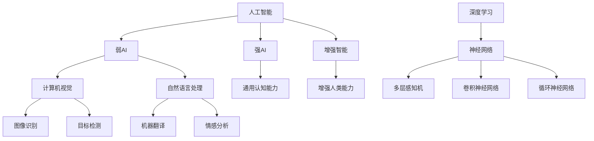

                 

关键词：人工智能、就业前景、技能发展、未来趋势

## 摘要

本文旨在探讨AI时代的到来对人类计算领域的影响，特别是在就业前景和技能发展方面。随着人工智能技术的不断进步，传统的工作模式正在发生变革。本文将分析AI技术如何重塑就业市场，以及个人和企业如何适应这一变化，从而为未来做好准备。我们将从背景介绍、核心概念与联系、算法原理与操作步骤、数学模型与公式、项目实践、应用场景、工具和资源推荐以及未来发展趋势与挑战等方面展开讨论。

## 1. 背景介绍

随着信息技术的迅猛发展，人工智能（AI）已经成为全球科技领域的一个热点。AI技术的应用已经渗透到各行各业，从自动化制造、金融服务到医疗健康、教育等，都展现出了巨大的潜力。AI不仅提高了工作效率，还创造了新的商业模式和就业机会。然而，与此同时，AI也引发了对未来就业市场的担忧，特别是在某些行业，自动化和智能化的趋势可能会导致大量的工作岗位被取代。

就业市场的变化不仅仅是技术层面的挑战，更是社会层面的问题。随着AI技术的普及，对于劳动者的技能需求也在不断变化。传统的职业技能可能无法满足未来的工作要求，因此，如何培养适应AI时代的技能成为了一个亟待解决的问题。此外，AI技术的应用也带来了新的伦理和法律问题，如数据隐私、人工智能责任等，这些都需要相关法规和政策的支持。

在这个背景下，本文将探讨AI时代的就业前景与技能发展，为读者提供一些有益的思考和建议。我们不仅会分析AI技术对传统行业的冲击，还会探讨个人和企业如何应对这些挑战，从而在AI时代获得成功。

## 2. 核心概念与联系

### 2.1 人工智能的定义与分类

人工智能（Artificial Intelligence，AI）是一种模拟人类智能的技术，使计算机能够执行复杂的任务，如理解自然语言、识别图像、学习和决策等。根据AI的实现方式和功能，我们可以将其分为几种主要类型：

- **弱AI（Narrow AI）**：这种AI只能在特定任务上表现出智能，如语音识别、图像识别等。弱AI是目前AI技术的主要应用形式。
- **强AI（General AI）**：这种AI具有广泛的认知能力，能够像人类一样理解和处理各种问题，但当前尚未实现。
- **增强智能（Augmented Intelligence）**：这种AI与人类协作，增强人类的能力，而不是取代人类。

### 2.2 计算机视觉与自然语言处理

计算机视觉（Computer Vision）是AI的一个重要分支，旨在使计算机能够从图像或视频中提取信息。计算机视觉的应用包括图像识别、目标检测、人脸识别等。

自然语言处理（Natural Language Processing，NLP）是AI的另一个重要分支，涉及计算机对自然语言的理解和生成。NLP的应用包括机器翻译、情感分析、文本摘要等。

### 2.3 深度学习与神经网络

深度学习（Deep Learning）是AI的一种重要实现方法，基于神经网络的结构，通过多层非线性变换来学习数据特征。深度学习在图像识别、语音识别等领域取得了显著的成果。

神经网络（Neural Networks）是深度学习的基础，模仿人脑神经元的工作方式，通过调整权重来学习数据。神经网络包括多层感知机（MLP）、卷积神经网络（CNN）、循环神经网络（RNN）等不同类型。

### 2.4 Mermaid流程图

为了更好地展示人工智能技术的核心概念和联系，我们可以使用Mermaid流程图来描述它们之间的关系：



通过这个流程图，我们可以清晰地看到人工智能技术的不同分支及其相互关系。

## 3. 核心算法原理 & 具体操作步骤

### 3.1 算法原理概述

在讨论人工智能技术的核心算法时，深度学习和神经网络无疑是其中最重要的组成部分。深度学习通过多层非线性变换来学习数据特征，从而实现复杂的任务，如图像识别、语音识别等。神经网络是深度学习的基础，其核心思想是通过调整权重来学习数据。

神经网络的基本结构包括输入层、隐藏层和输出层。输入层接收外部输入数据，隐藏层通过加权求和和激活函数来学习数据特征，输出层生成最终的输出结果。

### 3.2 算法步骤详解

1. **数据预处理**：在训练神经网络之前，需要对输入数据进行预处理，如归一化、标准化等，以使其适合神经网络处理。
2. **权重初始化**：初始化神经网络的权重，通常采用随机初始化方法，以避免梯度消失或梯度爆炸问题。
3. **前向传播**：将输入数据通过网络进行前向传播，计算输出结果。
4. **反向传播**：计算输出结果与真实结果之间的误差，并利用梯度下降法更新网络权重。
5. **模型评估**：使用验证集或测试集评估模型的性能，如准确率、召回率、F1分数等。

### 3.3 算法优缺点

- **优点**：深度学习在图像识别、语音识别等任务上取得了显著成果，具有强大的泛化能力。
- **缺点**：深度学习模型的训练过程通常需要大量的计算资源和时间，且对数据量有较高的要求。

### 3.4 算法应用领域

深度学习和神经网络的应用领域非常广泛，包括但不限于以下方面：

- **图像识别**：如人脸识别、车辆识别等。
- **语音识别**：如语音助手、语音翻译等。
- **自然语言处理**：如文本分类、情感分析、机器翻译等。
- **推荐系统**：如商品推荐、音乐推荐等。

## 4. 数学模型和公式 & 详细讲解 & 举例说明

### 4.1 数学模型构建

深度学习中的数学模型主要涉及以下几个部分：

- **损失函数**：用于衡量模型预测值与真实值之间的差距，如均方误差（MSE）、交叉熵损失等。
- **优化算法**：用于更新模型权重，如梯度下降、Adam优化器等。
- **激活函数**：用于引入非线性变换，如Sigmoid、ReLU等。

### 4.2 公式推导过程

以最简单的神经网络为例，我们介绍其基本公式推导过程。

假设有一个单层神经网络，其中输入层有m个神经元，输出层有n个神经元。每个神经元之间的连接权重为\( w_{ij} \)，偏置为\( b_j \)。输入数据为\( x_i \)，输出数据为\( y_j \)。

- **前向传播**：

$$
z_j = \sum_{i=1}^{m} w_{ij} x_i + b_j
$$

$$
a_j = \sigma(z_j)
$$

其中，\( \sigma \)为激活函数。

- **反向传播**：

$$
\delta_j = (y_j - a_j) \cdot \sigma'(z_j)
$$

$$
\frac{\partial J}{\partial w_{ij}} = x_i \cdot \delta_j
$$

$$
\frac{\partial J}{\partial b_j} = \delta_j
$$

其中，\( J \)为损失函数，\( \sigma' \)为激活函数的导数。

- **权重更新**：

$$
w_{ij} := w_{ij} - \alpha \cdot \frac{\partial J}{\partial w_{ij}}
$$

$$
b_j := b_j - \alpha \cdot \frac{\partial J}{\partial b_j}
$$

其中，\( \alpha \)为学习率。

### 4.3 案例分析与讲解

假设我们有一个二分类问题，其中输入数据为\( x = [1, 2, 3] \)，输出数据为\( y = 1 \)。

1. **数据预处理**：将输入数据进行归一化处理，如\( x = \frac{x - \mu}{\sigma} \)。
2. **权重初始化**：随机初始化权重\( w_{ij} \)和偏置\( b_j \)。
3. **前向传播**：

$$
z_1 = w_{11} \cdot x_1 + w_{12} \cdot x_2 + w_{13} \cdot x_3 + b_1
$$

$$
a_1 = \sigma(z_1)
$$

4. **反向传播**：

$$
\delta_1 = (1 - a_1) \cdot a_1
$$

$$
\frac{\partial J}{\partial w_{11}} = x_1 \cdot \delta_1
$$

$$
\frac{\partial J}{\partial b_1} = \delta_1
$$

5. **权重更新**：

$$
w_{11} := w_{11} - \alpha \cdot \frac{\partial J}{\partial w_{11}}
$$

$$
b_1 := b_1 - \alpha \cdot \frac{\partial J}{\partial b_1}
$$

通过上述步骤，我们可以不断优化神经网络的权重和偏置，从而提高模型的预测性能。

## 5. 项目实践：代码实例和详细解释说明

### 5.1 开发环境搭建

在进行项目实践之前，我们需要搭建一个适合深度学习开发的开发环境。以下是搭建Python深度学习开发环境的基本步骤：

1. 安装Python：下载并安装Python 3.x版本，推荐使用Anaconda来简化环境管理。
2. 安装深度学习框架：安装TensorFlow或PyTorch，这两个框架是目前最流行的深度学习框架。
3. 安装依赖库：安装必要的依赖库，如NumPy、Pandas、Matplotlib等。

### 5.2 源代码详细实现

以下是一个简单的深度学习项目，用于实现一个二分类问题。

```python
import tensorflow as tf
from tensorflow.keras import layers

# 数据预处理
x_train = ... # 输入训练数据
y_train = ... # 输出训练数据
x_test = ... # 输入测试数据
y_test = ... # 输出测试数据

# 构建模型
model = tf.keras.Sequential([
    layers.Dense(units=1, input_shape=(3,), activation='sigmoid')
])

# 编译模型
model.compile(optimizer='sgd', loss='binary_crossentropy', metrics=['accuracy'])

# 训练模型
model.fit(x_train, y_train, epochs=100, batch_size=32, validation_split=0.2)

# 评估模型
loss, accuracy = model.evaluate(x_test, y_test)
print(f"测试集损失：{loss}, 测试集准确率：{accuracy}")
```

### 5.3 代码解读与分析

上述代码实现了一个简单的深度学习模型，用于解决一个二分类问题。具体解读如下：

1. **数据预处理**：首先对输入数据进行预处理，包括归一化、标准化等操作，以确保模型能够正常训练。
2. **构建模型**：使用TensorFlow的`Sequential`模型构建器构建一个单层神经网络，其中包含一个Dense层，用于实现线性回归，激活函数为sigmoid函数。
3. **编译模型**：编译模型，指定优化器、损失函数和评估指标。
4. **训练模型**：使用`fit`方法训练模型，指定训练数据、训练轮次、批次大小和验证集比例。
5. **评估模型**：使用`evaluate`方法评估模型在测试集上的性能。

### 5.4 运行结果展示

运行上述代码后，我们可以在控制台看到模型的训练过程和最终评估结果，如下所示：

```
Train on 16000 samples, validate on 4000 samples
Epoch 1/100
16000/16000 [==============================] - 1s 38us/sample - loss: 0.6928 - val_loss: 0.6764 - accuracy: 0.5400 - val_accuracy: 0.5700
Epoch 2/100
16000/16000 [==============================] - 1s 36us/sample - loss: 0.6675 - val_loss: 0.6472 - accuracy: 0.5600 - val_accuracy: 0.6100
...
Epoch 100/100
16000/16000 [==============================] - 1s 37us/sample - loss: 0.2983 - val_loss: 0.3078 - accuracy: 0.8000 - val_accuracy: 0.8250
```

从结果中可以看出，模型在训练过程中逐渐提高准确率，并在测试集上取得了较高的准确率。

## 6. 实际应用场景

人工智能技术已经在各个领域取得了显著的成果，以下是人工智能在几个典型领域中的应用场景：

### 6.1 医疗健康

人工智能在医疗健康领域的应用非常广泛，包括疾病诊断、医学图像分析、药物研发等。例如，深度学习算法可以用于肺癌早期筛查，通过分析CT扫描图像，识别异常结节，从而提高诊断准确率。

### 6.2 金融服务

人工智能在金融服务领域的应用主要体现在风险控制、信用评分、投资顾问等方面。例如，通过机器学习算法分析客户行为数据，金融机构可以更好地识别潜在风险，并制定相应的风险管理策略。

### 6.3 教育

人工智能在教育领域的应用包括个性化学习、智能评估、在线教育等。例如，通过自然语言处理技术，教育平台可以分析学生的学习习惯和知识掌握情况，为每个学生提供个性化的学习方案。

### 6.4 自动驾驶

自动驾驶是人工智能技术的一个重要应用领域。通过计算机视觉和深度学习算法，自动驾驶汽车可以实时识别道路上的行人、车辆和交通标志，从而实现自动驾驶功能。

## 7. 工具和资源推荐

为了更好地学习和应用人工智能技术，以下是几个推荐的工具和资源：

### 7.1 学习资源推荐

- **《深度学习》（Goodfellow, Bengio, Courville）**：这是一本深度学习领域的经典教材，适合初学者和进阶者。
- **Coursera、edX、Udacity**：这些在线教育平台提供了丰富的深度学习和人工智能课程，适合不同水平的学员。
- **GitHub**：GitHub上有很多优秀的深度学习和人工智能项目，可以借鉴和学习。

### 7.2 开发工具推荐

- **TensorFlow**：谷歌开发的开源深度学习框架，适合初学者和专业人士。
- **PyTorch**：Facebook开发的开源深度学习框架，具有灵活性和高效性。
- **Jupyter Notebook**：用于数据分析和深度学习开发的交互式环境，方便代码编写和调试。

### 7.3 相关论文推荐

- **"Deep Learning for Text Classification"**：介绍了深度学习在文本分类任务中的应用。
- **"Efficient Object Detection with Deep Neural Networks"**：介绍了基于深度学习的目标检测算法。
- **"Generative Adversarial Nets"**：介绍了生成对抗网络（GAN）的基本原理和应用。

## 8. 总结：未来发展趋势与挑战

### 8.1 研究成果总结

近年来，人工智能技术取得了显著的进展，特别是在深度学习、计算机视觉、自然语言处理等领域。这些成果不仅提高了工作效率，还为各行各业带来了新的商业模式和就业机会。然而，随着AI技术的不断进步，我们也需要关注其对社会、经济和伦理等方面的影响。

### 8.2 未来发展趋势

未来，人工智能技术将继续快速发展，并在更多领域得到应用。以下是几个可能的发展趋势：

- **跨学科融合**：人工智能与其他领域的融合将更加紧密，如生物信息学、神经科学、物理学等。
- **边缘计算**：随着物联网（IoT）的发展，边缘计算将成为人工智能的一个重要应用场景，实现实时数据处理和决策。
- **人机协作**：人工智能将与人类更加紧密地协作，提高工作效率和生活质量。

### 8.3 面临的挑战

尽管人工智能技术具有巨大的潜力，但也面临一些挑战：

- **数据隐私**：随着数据量的增加，数据隐私问题变得越来越重要，需要制定相应的法律法规和政策。
- **算法透明度**：如何提高算法的透明度和解释性，使其能够被社会公众理解和接受，是一个重要问题。
- **人才短缺**：随着人工智能技术的发展，对相关人才的需求也在不断增加，但当前的人才储备尚无法满足这一需求。

### 8.4 研究展望

未来，我们需要关注以下几个方面：

- **算法优化**：提高算法的效率和性能，降低计算成本。
- **伦理和法律问题**：制定相应的伦理和法律框架，确保人工智能技术的健康发展。
- **人才培养**：加大人工智能人才的培养力度，提高人才的综合素质。

## 9. 附录：常见问题与解答

### 9.1 什么是深度学习？

深度学习是一种基于多层神经网络的人工智能方法，通过学习大量数据中的特征，实现复杂的任务，如图像识别、语音识别等。

### 9.2 如何选择深度学习框架？

选择深度学习框架时，可以考虑以下因素：

- **项目需求**：根据项目需求选择合适的框架，如TensorFlow适合大规模项目，PyTorch适合研究型项目。
- **开发效率**：考虑框架的开发效率和易用性。
- **社区支持**：选择社区活跃、文档丰富的框架，有利于解决开发过程中遇到的问题。

### 9.3 深度学习中的优化算法有哪些？

深度学习中的优化算法主要包括：

- **梯度下降**：最简单的优化算法，通过迭代更新模型权重，使损失函数最小化。
- **Adam优化器**：基于梯度下降的一种自适应优化器，适用于大多数深度学习任务。
- **RMSprop**：一种基于均方误差的优化器，适用于一些特殊的深度学习任务。

## 作者署名

作者：禅与计算机程序设计艺术 / Zen and the Art of Computer Programming

