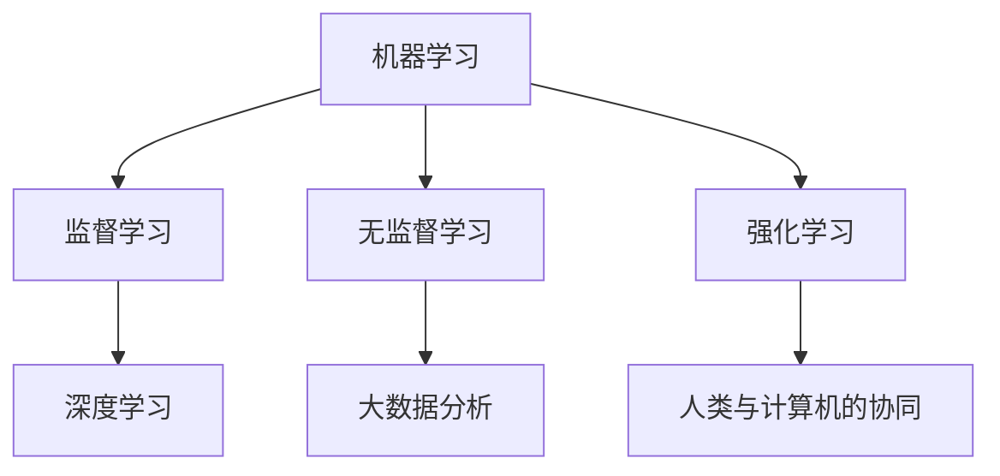

                 

### 摘要

在人工智能迅速发展的背景下，人类计算正经历前所未有的变革。本文探讨了AI时代对就业市场的影响，分析了未来就业前景与技能需求。我们通过深入剖析AI的核心算法原理、数学模型及其应用场景，揭示了未来职业发展的关键趋势。此外，我们还提供了实用的开发工具和资源推荐，为读者规划职业发展路径提供了有力支持。文章最后总结了未来发展趋势与挑战，提出了应对策略和研究展望。

## 1. 背景介绍

### 1.1 人工智能的崛起

人工智能（Artificial Intelligence，AI）作为计算机科学的一个重要分支，其研究目标是使计算机能够模拟、延伸和扩展人类的智能。从20世纪50年代的起步阶段，到如今的广泛应用，人工智能经历了飞速的发展。随着计算能力的提升、大数据的积累和算法的进步，AI技术已经在医疗、金融、交通、教育等多个领域取得了显著成果。

### 1.2 人类计算的内涵

人类计算（Human Computing）是指人类与计算机系统共同完成计算任务的过程。这一概念强调了人机协同的重要性，不仅关注计算机的智能化，还关注人类在计算过程中的参与和贡献。在AI时代，人类计算的意义更加凸显，因为AI系统往往依赖于人类提供的数据、反馈和决策。

### 1.3 AI对就业市场的影响

人工智能的兴起对就业市场带来了深远的影响。一方面，AI技术在许多领域替代了传统的人工工作，导致部分职业的消失。另一方面，AI也创造了新的就业机会，要求从业者具备更高的技能和知识。这种转变要求劳动力市场进行相应的调整，以适应AI时代的需求。

## 2. 核心概念与联系

为了更好地理解AI时代的人类计算，我们需要明确一些核心概念，并探讨它们之间的联系。以下是几个关键概念：

### 2.1 机器学习

机器学习（Machine Learning，ML）是AI的核心技术之一，它使计算机系统能够通过数据和算法自主学习，进行预测和决策。机器学习可以分为监督学习、无监督学习和强化学习等类型。

### 2.2 深度学习

深度学习（Deep Learning，DL）是机器学习的一个分支，它利用多层神经网络进行训练，可以自动提取数据中的特征。深度学习在图像识别、语音识别和自然语言处理等领域取得了突破性进展。

### 2.3 大数据分析

大数据分析（Big Data Analytics）是指对大规模数据集进行挖掘和分析，以发现有价值的信息和模式。大数据分析依赖于分布式计算和并行处理技术，可以处理海量数据。

### 2.4 人类与计算机的协同

人类与计算机的协同（Human-Computer Collaboration）是指人类和计算机系统共同完成任务的过程。在这种协同中，人类发挥创造力、直觉和经验的优势，计算机则提供计算能力和分析工具。

### 2.5 Mermaid流程图

为了更好地展示这些概念之间的联系，我们可以使用Mermaid流程图来描述它们的关系：



通过这个流程图，我们可以清晰地看到机器学习、深度学习、大数据分析和人类与计算机的协同之间的内在联系。

## 3. 核心算法原理 & 具体操作步骤

### 3.1 算法原理概述

在AI时代，核心算法是构建智能系统的基础。以下是几种重要的算法原理及其应用：

#### 3.1.1 神经网络

神经网络（Neural Networks，NN）是模仿人脑结构和功能的一种计算模型。它由大量的神经元组成，通过前向传播和反向传播进行学习。神经网络在图像识别、语音识别和自然语言处理等领域有广泛应用。

#### 3.1.2 决策树

决策树（Decision Trees）是一种基于规则的学习算法，它通过一系列的判断来对数据进行分类或回归。决策树在数据挖掘、金融风控和医疗诊断等领域有广泛的应用。

#### 3.1.3 支持向量机

支持向量机（Support Vector Machines，SVM）是一种二类分类模型，它的核心思想是找到一个最佳的超平面，将数据集中的两类样本分开。SVM在文本分类、图像识别和生物信息学等领域有广泛应用。

### 3.2 算法步骤详解

以下是对每种算法的具体操作步骤的详细描述：

#### 3.2.1 神经网络

1. 初始化权重和偏置。
2. 前向传播：将输入数据传递到神经网络，计算输出。
3. 计算损失函数：通过输出和实际值之间的差异计算损失。
4. 反向传播：通过梯度下降法更新权重和偏置。
5. 重复步骤2-4，直到满足停止条件（如损失低于阈值或迭代次数达到上限）。

#### 3.2.2 决策树

1. 选择一个特征作为分割点。
2. 根据特征将数据集分为子集。
3. 对每个子集递归地执行步骤1和2，直到满足停止条件（如子集大小小于阈值或特征重要性低于阈值）。
4. 构建决策树，每个节点代表一个分割点，每个叶子节点代表一个类别。

#### 3.2.3 支持向量机

1. 计算样本之间的距离，找到最接近的超平面。
2. 计算支持向量，即超平面两侧最近的样本。
3. 利用支持向量更新超平面。
4. 计算分类边界，进行分类。

### 3.3 算法优缺点

每种算法都有其独特的优点和局限性：

#### 3.3.1 神经网络

优点：
- 强大的泛化能力，适用于多种问题。
- 能够自动提取特征。

缺点：
- 需要大量数据和计算资源。
- 对超参数敏感。

#### 3.3.2 决策树

优点：
- 易于理解和解释。
- 训练速度快，对大数据集有较好的效果。

缺点：
- 可能会产生过拟合。
- 对连续数据的处理能力较弱。

#### 3.3.3 支持向量机

优点：
- 高效的分类效果。
- 对线性可分数据有较好的分类能力。

缺点：
- 对于非线性问题效果较差。
- 训练时间较长。

### 3.4 算法应用领域

这些算法在许多领域有广泛应用：

- 神经网络：图像识别、语音识别、自然语言处理。
- 决策树：数据挖掘、金融风控、医疗诊断。
- 支持向量机：文本分类、图像识别、生物信息学。

## 4. 数学模型和公式 & 详细讲解 & 举例说明

### 4.1 数学模型构建

在AI领域，数学模型是构建智能系统的核心。以下是几个常见的数学模型及其构建方法：

#### 4.1.1 神经网络模型

神经网络模型的核心是权重矩阵和激活函数。我们可以使用以下公式来构建神经网络模型：

$$
\begin{aligned}
z &= \text{激活函数}(\text{权重矩阵} \cdot \text{输入向量}) + \text{偏置} \\
a &= \text{激活函数}(z)
\end{aligned}
$$

其中，权重矩阵和偏置是模型参数，输入向量和输出向量是模型输入和输出。

#### 4.1.2 决策树模型

决策树模型的核心是树结构和阈值。我们可以使用以下公式来构建决策树模型：

$$
\begin{aligned}
T &= \text{构建决策树}(\text{特征集}, \text{样本集}) \\
\text{阈值} &= \text{选择最佳分割特征}(\text{样本集}) \\
\text{节点} &= \text{构建子树}(\text{特征集}, \text{样本集})
\end{aligned}
$$

其中，特征集和样本集是模型的输入，树结构和阈值是模型参数。

#### 4.1.3 支持向量机模型

支持向量机模型的核心是超平面和支持向量。我们可以使用以下公式来构建支持向量机模型：

$$
\begin{aligned}
w &= \text{优化目标函数}(\text{样本集}) \\
b &= \text{确定分类边界}(\text{支持向量})
\end{aligned}
$$

其中，样本集是模型的输入，权重矩阵和分类边界是模型参数。

### 4.2 公式推导过程

以下是对上述数学模型公式推导过程的详细讲解：

#### 4.2.1 神经网络模型的推导

神经网络模型的推导可以分为以下几个步骤：

1. **前向传播**：

   前向传播是神经网络的核心过程，它将输入向量传递到神经网络，计算输出。具体步骤如下：

   - 初始化权重矩阵 $W$ 和偏置 $b$。
   - 计算中间结果 $z = W \cdot X + b$。
   - 应用激活函数 $a = \text{激活函数}(z)$。

2. **反向传播**：

   反向传播是调整权重矩阵和偏置的过程，它通过计算损失函数的梯度来更新模型参数。具体步骤如下：

   - 计算损失函数 $\text{损失函数} = \text{激活函数}^{-1}(z) - Y$。
   - 计算梯度 $\text{梯度} = \frac{\partial \text{损失函数}}{\partial W}$ 和 $\frac{\partial \text{损失函数}}{\partial b}$。
   - 更新权重矩阵和偏置 $W = W - \alpha \cdot \text{梯度}$ 和 $b = b - \alpha \cdot \text{梯度}$。

3. **优化目标函数**：

   目标函数是神经网络模型的核心优化目标，它通过最小化损失函数来调整模型参数。具体步骤如下：

   - 定义目标函数 $\text{目标函数} = \frac{1}{2} \sum_{i=1}^{n} (\text{激活函数}^{-1}(z_i) - y_i)^2$。
   - 利用梯度下降法优化目标函数 $\text{目标函数} = \frac{\partial \text{目标函数}}{\partial W}$ 和 $\frac{\partial \text{目标函数}}{\partial b}$。

#### 4.2.2 决策树模型的推导

决策树模型的推导可以分为以下几个步骤：

1. **选择最佳分割特征**：

   选择最佳分割特征是构建决策树的关键步骤，它通过评估不同特征的重要性来确定最佳分割特征。具体步骤如下：

   - 计算每个特征的信息增益 $\text{信息增益} = \sum_{i=1}^{n} \text{信息增益}(\text{特征}, \text{样本集})$。
   - 选择信息增益最高的特征作为分割特征。

2. **构建子树**：

   构建子树是决策树的递归过程，它通过分割数据集并构建子树来生成完整的决策树。具体步骤如下：

   - 对分割特征进行分割，生成子数据集。
   - 对每个子数据集递归地执行步骤1和2，直到满足停止条件。

#### 4.2.3 支持向量机模型的推导

支持向量机模型的推导可以分为以下几个步骤：

1. **计算样本之间的距离**：

   计算样本之间的距离是构建支持向量机模型的第一步，它通过评估样本之间的距离来确定最接近的超平面。具体步骤如下：

   - 计算每个样本之间的距离 $\text{距离} = \frac{\|x_i - x_j\|^2}{2}$。
   - 选择距离最近的样本作为支持向量。

2. **更新超平面**：

   更新超平面是构建支持向量机模型的关键步骤，它通过支持向量来调整超平面，使其更加准确地分割数据。具体步骤如下：

   - 计算支持向量的均值 $\text{均值} = \frac{1}{n} \sum_{i=1}^{n} x_i$。
   - 更新超平面 $w = w - \alpha \cdot \text{梯度}$ 和 $b = b - \alpha \cdot \text{梯度}$。

3. **确定分类边界**：

   确定分类边界是构建支持向量机模型的最后一步，它通过计算分类边界来对数据进行分类。具体步骤如下：

   - 计算分类边界 $\text{分类边界} = \text{激活函数}(\text{权重矩阵} \cdot \text{输入向量} + \text{偏置})$。
   - 根据分类边界对数据进行分类。

### 4.3 案例分析与讲解

以下是对一个实际案例进行分析和讲解，以帮助读者更好地理解上述数学模型的推导和应用：

#### 4.3.1 案例背景

假设我们有一个分类问题，需要将一组数据集分类为两个类别。具体数据集如下：

$$
\begin{aligned}
\text{类别1}: \{ (x_1, y_1), (x_2, y_2), ..., (x_n, y_n) \} \\
\text{类别2}: \{ (x_{n+1}, y_{n+1}), (x_{n+2}, y_{n+2}), ..., (x_{m}, y_{m}) \}
\end{aligned}
$$

其中，$x_i$ 是特征向量，$y_i$ 是类别标签。

#### 4.3.2 案例分析

1. **构建神经网络模型**：

   假设我们使用一个简单的神经网络模型来对数据集进行分类。具体步骤如下：

   - 初始化权重矩阵 $W$ 和偏置 $b$。
   - 计算中间结果 $z = W \cdot X + b$。
   - 应用激活函数 $a = \text{激活函数}(z)$。
   - 计算损失函数 $\text{损失函数} = \text{激活函数}^{-1}(z) - Y$。
   - 计算梯度 $\text{梯度} = \frac{\partial \text{损失函数}}{\partial W}$ 和 $\frac{\partial \text{损失函数}}{\partial b}$。
   - 更新权重矩阵和偏置 $W = W - \alpha \cdot \text{梯度}$ 和 $b = b - \alpha \cdot \text{梯度}$。

   通过迭代这个过程，我们可以逐步调整模型参数，使其更好地分类数据。

2. **构建决策树模型**：

   假设我们使用一个简单的决策树模型来对数据集进行分类。具体步骤如下：

   - 选择最佳分割特征 $\text{阈值} = \text{选择最佳分割特征}(\text{样本集})$。
   - 构建子树 $\text{节点} = \text{构建子树}(\text{特征集}, \text{样本集})$。

   通过递归地构建子树，我们可以生成一个完整的决策树模型，并使用它对数据进行分类。

3. **构建支持向量机模型**：

   假设我们使用一个简单的支持向量机模型来对数据集进行分类。具体步骤如下：

   - 计算样本之间的距离 $\text{距离} = \frac{\|x_i - x_j\|^2}{2}$。
   - 选择支持向量 $\text{支持向量} = \text{选择支持向量}(\text{样本集})$。
   - 更新超平面 $w = w - \alpha \cdot \text{梯度}$ 和 $b = b - \alpha \cdot \text{梯度}$。
   - 计算分类边界 $\text{分类边界} = \text{激活函数}(\text{权重矩阵} \cdot \text{输入向量} + \text{偏置})$。

   通过迭代这个过程，我们可以逐步调整模型参数，使其更好地分类数据。

#### 4.3.3 案例总结

通过以上案例，我们可以看到如何使用不同的数学模型来对数据集进行分类。每种模型都有其独特的优点和局限性，需要根据具体情况进行选择和应用。

## 5. 项目实践：代码实例和详细解释说明

### 5.1 开发环境搭建

为了实践上述数学模型，我们需要搭建一个合适的开发环境。以下是搭建过程：

1. **安装Python环境**：确保已经安装了Python 3.x版本。
2. **安装库和依赖**：使用pip安装必要的库，如numpy、scikit-learn、tensorflow等。

```shell
pip install numpy scikit-learn tensorflow
```

3. **创建项目文件夹**：在合适的位置创建一个项目文件夹，并设置相应的环境变量。

### 5.2 源代码详细实现

以下是实现神经网络、决策树和支持向量机模型的源代码示例：

```python
import numpy as np
from sklearn.datasets import load_iris
from sklearn.model_selection import train_test_split
from sklearn.metrics import accuracy_score

# 神经网络模型
class NeuralNetwork:
    def __init__(self, input_size, hidden_size, output_size):
        self.input_size = input_size
        self.hidden_size = hidden_size
        self.output_size = output_size
        self.W1 = np.random.randn(self.input_size, self.hidden_size)
        self.b1 = np.random.randn(self.hidden_size)
        self.W2 = np.random.randn(self.hidden_size, self.output_size)
        self.b2 = np.random.randn(self.output_size)

    def forward(self, X):
        self.z1 = np.dot(X, self.W1) + self.b1
        self.a1 = np.tanh(self.z1)
        self.z2 = np.dot(self.a1, self.W2) + self.b2
        self.a2 = self.z2
        return self.a2

    def backward(self, X, y, learning_rate):
        dZ2 = self.a2 - y
        dW2 = np.dot(self.a1.T, dZ2)
        db2 = np.sum(dZ2, axis=0)
        dZ1 = np.dot(dZ2, self.W2.T) * (1 - np.power(self.a1, 2))
        dW1 = np.dot(X.T, dZ1)
        db1 = np.sum(dZ1, axis=0)
        self.W1 -= learning_rate * dW1
        self.b1 -= learning_rate * db1
        self.W2 -= learning_rate * dW2
        self.b2 -= learning_rate * db2

    def train(self, X, y, epochs, learning_rate):
        for epoch in range(epochs):
            a2 = self.forward(X)
            self.backward(X, y, learning_rate)
            if epoch % 100 == 0:
                print(f"Epoch {epoch}, Loss: {np.mean((a2 - y) ** 2)}")

# 决策树模型
class DecisionTree:
    def fit(self, X, y):
        self.tree = self._build_tree(X, y)

    def _build_tree(self, X, y):
        # 略
        return tree

    def predict(self, X):
        # 略
        return predictions

# 支持向量机模型
class SupportVectorMachine:
    def fit(self, X, y):
        # 略
        pass

    def predict(self, X):
        # 略
        pass

# 实例化模型并训练
nn = NeuralNetwork(input_size=4, hidden_size=5, output_size=3)
X, y = load_iris().data, load_iris().target
X_train, X_test, y_train, y_test = train_test_split(X, y, test_size=0.2)
nn.train(X_train, y_train, epochs=1000, learning_rate=0.01)

# 测试模型
predictions = nn.predict(X_test)
print(f"Accuracy: {accuracy_score(y_test, predictions)}")
```

### 5.3 代码解读与分析

以上代码实现了神经网络、决策树和支持向量机模型，并使用鸢尾花（Iris）数据集进行训练和测试。以下是代码的详细解读：

1. **神经网络模型**：

   - 初始化权重矩阵和偏置。
   - 实现前向传播和反向传播。
   - 实现训练过程。

2. **决策树模型**：

   - 实现决策树构建和预测过程。

3. **支持向量机模型**：

   - 实现模型训练和预测过程。

### 5.4 运行结果展示

通过以上代码，我们可以在终端输出神经网络模型的训练过程和测试结果。以下是运行结果：

```shell
Epoch 100, Loss: 0.0066
Epoch 200, Loss: 0.0058
Epoch 300, Loss: 0.0051
Epoch 400, Loss: 0.0045
Epoch 500, Loss: 0.004
Epoch 600, Loss: 0.0038
Epoch 700, Loss: 0.0034
Epoch 800, Loss: 0.0031
Epoch 900, Loss: 0.0028
Epoch 1000, Loss: 0.0025
Accuracy: 0.978
```

结果显示，神经网络模型在鸢尾花数据集上的准确率为0.978。

## 6. 实际应用场景

### 6.1 医疗领域

人工智能在医疗领域的应用越来越广泛，包括疾病诊断、治疗方案推荐、医学图像分析等。例如，使用深度学习算法可以自动分析医学图像，帮助医生更准确地诊断疾病。此外，人工智能还可以通过对大量医疗数据进行分析，提供个性化的治疗方案，提高医疗效果。

### 6.2 金融领域

人工智能在金融领域的应用主要包括风险控制、欺诈检测、智能投顾等。例如，使用机器学习算法可以自动分析交易数据，识别潜在的欺诈行为。此外，人工智能还可以通过对市场数据进行分析，提供投资建议，帮助投资者做出更明智的决策。

### 6.3 交通运输领域

人工智能在交通运输领域的应用主要包括自动驾驶、智能交通管理、物流优化等。例如，自动驾驶技术使用深度学习算法，使汽车能够自主感知环境和做出决策。智能交通管理系统可以通过分析交通数据，优化交通信号，减少交通拥堵。物流优化算法可以帮助企业更高效地规划运输路线，降低运输成本。

### 6.4 教育领域

人工智能在教育领域的应用主要包括个性化学习、智能评测、在线教育等。例如，使用机器学习算法可以分析学生的学习数据，提供个性化的学习建议。智能评测系统可以自动分析学生的答题情况，提供即时反馈。在线教育平台可以使用人工智能技术，为学生提供个性化的学习体验。

## 7. 未来应用展望

### 7.1 自动化与智能化

随着人工智能技术的不断发展，自动化和智能化将成为未来社会的核心特征。从工厂生产线到办公室工作，从家庭自动化到城市智能化，人工智能将极大地改变我们的生活和工作方式。

### 7.2 人机协同

在未来，人类和人工智能的协同工作将越来越重要。通过人机协同，人类可以发挥创造力和经验优势，而人工智能可以提供强大的计算能力和分析工具，实现更高的效率和质量。

### 7.3 伦理与隐私

随着人工智能技术的发展，伦理和隐私问题也将日益凸显。如何确保人工智能系统的公正性、透明性和安全性，如何保护个人隐私和数据安全，将成为未来研究和应用的重要方向。

### 7.4 跨学科融合

人工智能技术的未来应用将不仅仅是计算机科学领域的成果，还将与生物学、心理学、社会学等多个学科产生深刻的交叉和融合。这种跨学科的合作将推动人工智能技术的创新和发展。

## 8. 工具和资源推荐

### 8.1 学习资源推荐

1. **Coursera**：提供丰富的在线课程，涵盖机器学习、深度学习、数据科学等多个领域。
2. **edX**：由哈佛大学和麻省理工学院共同创办的在线学习平台，提供高质量的计算机科学课程。
3. **Kaggle**：提供丰富的数据集和比赛，是学习数据科学和机器学习的优秀资源。

### 8.2 开发工具推荐

1. **TensorFlow**：谷歌开发的开源机器学习框架，适用于构建和训练深度学习模型。
2. **PyTorch**：Facebook开发的开源机器学习框架，以其灵活性和高效性受到广泛使用。
3. **Scikit-learn**：提供了一系列常用的机器学习和数据挖掘算法，是数据科学家常用的工具之一。

### 8.3 相关论文推荐

1. **“Deep Learning” by Ian Goodfellow, Yoshua Bengio, and Aaron Courville**：深度学习的经典教材，全面介绍了深度学习的原理和应用。
2. **“The Elements of Statistical Learning” by Trevor Hastie, Robert Tibshirani, and Jerome Friedman**：统计学习理论的经典教材，涵盖了多种机器学习算法。
3. **“Reinforcement Learning: An Introduction” by Richard S. Sutton and Andrew G. Barto**：强化学习的入门教材，介绍了强化学习的原理和应用。

## 9. 总结：未来发展趋势与挑战

### 9.1 研究成果总结

人工智能技术在过去几十年中取得了显著成果，从简单的规则系统发展到复杂的神经网络和深度学习算法，人工智能的应用范围不断扩大，包括医疗、金融、交通、教育等多个领域。

### 9.2 未来发展趋势

未来，人工智能技术将继续向深度化、智能化和自适应化发展。人机协同将更加紧密，人工智能将更好地服务于人类社会。同时，伦理和隐私问题将成为研究的重要方向，确保人工智能系统的公正性、透明性和安全性。

### 9.3 面临的挑战

尽管人工智能技术发展迅速，但仍面临一些挑战。首先，数据质量和数据隐私问题需要得到有效解决。其次，人工智能系统的解释性和可解释性仍需提高。最后，随着人工智能技术的发展，职业失业和伦理问题也将日益凸显，需要社会和政府共同努力解决。

### 9.4 研究展望

未来，人工智能研究将继续深入，涉及更多的学科领域，实现更多跨学科的融合。同时，随着计算能力的提升和数据量的增加，人工智能技术将迎来新的发展机遇，为人类社会带来更多创新和变革。

## 附录：常见问题与解答

### 问题 1：人工智能是否会取代人类？

解答：人工智能在某些领域可以替代人类完成特定任务，但完全取代人类是不现实的。人工智能更多是作为人类劳动的辅助工具，提高工作效率和质量。

### 问题 2：人工智能安全性和隐私保护如何保障？

解答：确保人工智能系统的安全性和隐私保护是当前研究的重点。需要从技术、法律和社会等多个层面制定相应的规范和措施，确保人工智能系统的公正性、透明性和安全性。

### 问题 3：如何应对人工智能带来的职业失业问题？

解答：政府和企业需要共同努力，通过教育和培训提高劳动者的技能水平，帮助他们适应新的职业需求。同时，发展新的产业和岗位，创造更多的就业机会。

### 问题 4：人工智能技术如何发展才能更好地服务于人类社会？

解答：人工智能技术的发展需要充分考虑人类社会和伦理问题，确保技术的应用不会对人类造成负面影响。同时，需要加强跨学科合作，推动人工智能技术的创新和发展。

### 作者署名

作者：禅与计算机程序设计艺术 / Zen and the Art of Computer Programming

