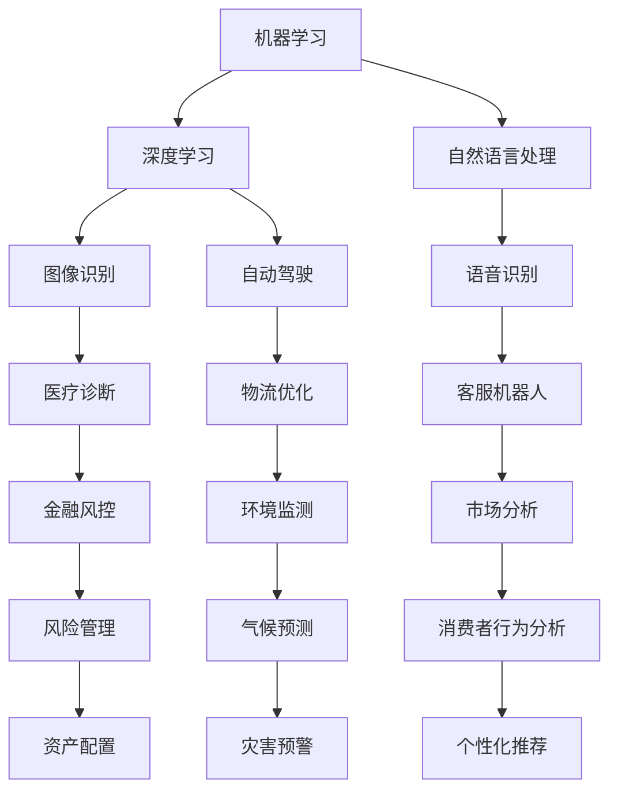

                 

 **关键词**：人工智能，就业，技能培训，未来趋势，技术发展

**摘要**：本文深入探讨了人工智能时代对就业市场的影响，以及如何进行有效的技能培训以应对未来挑战。文章首先介绍了人工智能的核心概念和发展历程，然后分析了人工智能对各个行业的影响，接着讨论了技能培训的必要性和方法，最后对未来的发展趋势和面临的挑战进行了展望。

## 1. 背景介绍

人工智能（AI）作为计算机科学的一个分支，旨在使计算机具备模拟人类智能的能力。从最初的专家系统到现代的深度学习，人工智能技术经历了巨大的发展。随着计算能力的提升和数据量的增加，人工智能在图像识别、自然语言处理、自动驾驶等领域取得了显著成果。

### 1.1 人工智能的核心概念

人工智能的核心概念包括机器学习、深度学习、自然语言处理等。机器学习是让计算机通过数据学习模式，从而进行预测和决策。深度学习则是一种特殊的机器学习方法，通过多层神经网络进行训练，能够处理复杂的任务。自然语言处理则专注于使计算机能够理解、生成和处理人类语言。

### 1.2 人工智能的发展历程

人工智能的发展历程可以分为几个阶段：第一阶段是20世纪50年代到60年代，这一时期主要以符号推理为基础；第二阶段是20世纪80年代到90年代，专家系统得到了广泛应用；第三阶段是21世纪初至今，深度学习和大数据的兴起使得人工智能取得了突破性进展。

## 2. 核心概念与联系

为了更好地理解人工智能的原理和应用，我们首先需要构建一个核心概念和联系的框架。以下是一个简化的Mermaid流程图，展示了人工智能的主要组成部分和它们之间的关系：



通过这个流程图，我们可以看到人工智能在各个领域中的应用，以及这些领域之间的联系。

## 3. 核心算法原理 & 具体操作步骤

### 3.1 算法原理概述

人工智能的核心算法包括机器学习算法、深度学习算法和强化学习算法。机器学习算法主要关注数据的特征提取和模式识别，常用的算法有线性回归、支持向量机、决策树等。深度学习算法则通过多层神经网络对数据进行处理，具有很好的表现力，常用的算法有卷积神经网络（CNN）和循环神经网络（RNN）。强化学习算法则通过奖励机制来训练智能体，使其能够在复杂环境中进行决策。

### 3.2 算法步骤详解

以卷积神经网络（CNN）为例，其基本步骤如下：

1. **数据预处理**：对输入数据进行标准化处理，如归一化、缩放等。
2. **卷积操作**：通过卷积层对输入数据进行特征提取，卷积核在数据上滑动，提取局部特征。
3. **激活函数**：对卷积层的输出进行非线性变换，常用的激活函数有ReLU、Sigmoid、Tanh等。
4. **池化操作**：通过池化层对特征图进行降维处理，常用的池化操作有最大池化和平均池化。
5. **全连接层**：将池化层的输出通过全连接层进行分类或回归。
6. **损失函数**：计算模型预测值与真实值之间的差异，常用的损失函数有均方误差（MSE）、交叉熵（Cross Entropy）等。
7. **优化算法**：通过优化算法（如梯度下降、Adam等）更新模型参数，减小损失函数值。

### 3.3 算法优缺点

卷积神经网络（CNN）的优点包括：

- **强大的特征提取能力**：通过多层卷积和池化操作，能够提取出丰富的特征信息。
- **参数共享**：卷积核在图像上滑动，使得每个位置的特征提取都是共享的，减少了参数数量。
- **适应性强**：能够处理各种类型的数据，如图像、文本、音频等。

缺点包括：

- **计算量大**：卷积操作需要进行大量的矩阵运算，计算复杂度较高。
- **训练时间长**：由于参数数量大，训练过程需要大量的时间和计算资源。

### 3.4 算法应用领域

卷积神经网络（CNN）在图像识别、目标检测、图像生成等领域有广泛应用。例如，在图像识别任务中，CNN能够准确地识别出图片中的物体；在目标检测任务中，CNN可以同时识别出图片中的多个物体及其位置；在图像生成任务中，CNN可以通过生成对抗网络（GAN）生成高质量的图像。

## 4. 数学模型和公式 & 详细讲解 & 举例说明

### 4.1 数学模型构建

在人工智能中，数学模型起到了核心作用。以下是一个简单的线性回归模型的构建过程：

1. **假设**：假设目标变量 \(y\) 与自变量 \(x\) 之间存在线性关系，即 \(y = w_0 + w_1x + \epsilon\)，其中 \(w_0\) 和 \(w_1\) 是模型的参数，\(\epsilon\) 是误差项。
2. **损失函数**：选择均方误差（MSE）作为损失函数，即 \(L(w_0, w_1) = \frac{1}{2}\sum_{i=1}^{n}(y_i - (w_0 + w_1x_i))^2\)，其中 \(n\) 是样本数量。
3. **优化算法**：选择梯度下降算法来更新模型参数，即 \(w_0 := w_0 - \alpha \frac{\partial L}{\partial w_0}\)，\(w_1 := w_1 - \alpha \frac{\partial L}{\partial w_1}\)，其中 \(\alpha\) 是学习率。

### 4.2 公式推导过程

以下是线性回归模型的损失函数和梯度下降算法的推导过程：

1. **损失函数**：\(L(w_0, w_1) = \frac{1}{2}\sum_{i=1}^{n}(y_i - (w_0 + w_1x_i))^2\)
2. **对 \(w_0\) 求导**：\(\frac{\partial L}{\partial w_0} = -\sum_{i=1}^{n}(y_i - (w_0 + w_1x_i))\)
3. **对 \(w_1\) 求导**：\(\frac{\partial L}{\partial w_1} = -\sum_{i=1}^{n}(x_i(y_i - (w_0 + w_1x_i)))\)

### 4.3 案例分析与讲解

以下是一个简单的线性回归案例：

**数据集**：包含50个样本，每个样本有一个特征 \(x\) 和一个目标变量 \(y\)。

**目标**：通过线性回归模型预测 \(y\) 的值。

**步骤**：

1. **数据预处理**：对数据进行标准化处理，使得特征 \(x\) 的取值范围在0到1之间。
2. **模型构建**：定义线性回归模型，选择均方误差作为损失函数。
3. **训练模型**：使用梯度下降算法训练模型，设置学习率为0.01。
4. **模型评估**：计算模型在测试集上的预测误差，评估模型的性能。

通过这个案例，我们可以看到线性回归模型的基本构建和训练过程。

## 5. 项目实践：代码实例和详细解释说明

### 5.1 开发环境搭建

为了实践线性回归模型，我们需要搭建一个Python开发环境。以下是搭建步骤：

1. **安装Python**：下载并安装Python 3.8及以上版本。
2. **安装依赖库**：打开终端，执行以下命令安装所需的依赖库：
   ```bash
   pip install numpy matplotlib
   ```

### 5.2 源代码详细实现

以下是一个简单的线性回归模型实现：

```python
import numpy as np
import matplotlib.pyplot as plt

# 数据集
X = np.array([0, 1, 2, 3, 4, 5])
y = np.array([0, 1, 3, 6, 10, 15])

# 模型参数
w0 = 0
w1 = 0
alpha = 0.01
epochs = 1000

# 梯度下降算法
for _ in range(epochs):
    y_pred = w0 + w1 * X
    error = y - y_pred
    w0 -= alpha * np.mean(error)
    w1 -= alpha * np.mean(X * error)

# 模型评估
y_pred = w0 + w1 * X
plt.scatter(X, y)
plt.plot(X, y_pred, color='red')
plt.show()
```

### 5.3 代码解读与分析

1. **数据集**：我们使用一个简单的数据集，其中 \(X\) 是自变量，\(y\) 是目标变量。
2. **模型参数**：我们初始化模型参数 \(w0\) 和 \(w1\) 为0，并设置学习率 \(\alpha\) 和训练轮数 \(epochs\)。
3. **梯度下降算法**：我们使用梯度下降算法更新模型参数，使得损失函数值减小。
4. **模型评估**：我们使用绘图函数 \(plt.scatter\) 和 \(plt.plot\) 来展示模型在数据集上的表现。

通过这个案例，我们可以看到如何使用Python实现线性回归模型，并进行模型评估。

## 6. 实际应用场景

### 6.1 医疗诊断

人工智能在医疗诊断中的应用非常广泛。通过深度学习算法，人工智能可以分析医学图像，如X光片、CT扫描和MRI图像，以帮助医生诊断疾病。例如，深度学习模型可以在几秒钟内分析一张X光片，并准确识别骨折、肺炎等疾病。

### 6.2 金融风控

人工智能在金融风控中的应用也非常显著。通过机器学习算法，金融机构可以分析客户的交易行为，识别异常交易，从而预防欺诈行为。此外，人工智能还可以预测股票市场的走势，帮助投资者做出更明智的投资决策。

### 6.3 智能家居

人工智能在家居中的应用也越来越广泛。智能家居系统通过人工智能算法，可以实现自动控制家中的灯光、温度、安全设备等。例如，智能音箱可以通过语音识别和自然语言处理技术，与用户进行交互，提供音乐播放、天气查询、日程安排等服务。

### 6.4 未来应用展望

随着人工智能技术的不断发展，其在各个领域的应用前景将更加广阔。未来，人工智能可能会在更多领域实现突破，如智能制造、智能交通、智慧城市等。此外，人工智能还可能会改变人类的生活方式，使生活更加便捷、高效。

## 7. 工具和资源推荐

### 7.1 学习资源推荐

- **在线课程**：Coursera、edX、Udacity等平台提供了丰富的机器学习和人工智能课程。
- **书籍**：《Python机器学习》、《深度学习》（Goodfellow et al.）、《统计学习方法》等。

### 7.2 开发工具推荐

- **编程环境**：Jupyter Notebook、Google Colab等。
- **机器学习库**：Scikit-learn、TensorFlow、PyTorch等。

### 7.3 相关论文推荐

- **经典论文**：《A Mathematical Theory of Communication》（Shannon）、《Learning to Represent Language with Neural Networks》（Mikolov et al.）等。
- **最新论文**：在NeurIPS、ICML、ACL等顶级会议和期刊上发表的最新论文。

## 8. 总结：未来发展趋势与挑战

### 8.1 研究成果总结

人工智能在过去几十年取得了巨大的进展，从简单的规则系统发展到复杂的神经网络，其应用领域也越来越广泛。无论是在医疗、金融、家居还是工业领域，人工智能都展现出了巨大的潜力。

### 8.2 未来发展趋势

未来，人工智能将继续向深度学习和强化学习等方向发展，同时，其应用领域也将进一步拓展，如自动驾驶、智能客服、智慧城市等。此外，随着量子计算等新兴技术的突破，人工智能有望实现更大的性能提升。

### 8.3 面临的挑战

尽管人工智能取得了巨大的进展，但仍然面临一些挑战。首先是数据隐私和安全性问题，如何保护用户数据的安全成为了一个重要议题。其次是算法的可解释性问题，如何让机器学习模型的可解释性更高，使其能够更好地被人类理解和信任。最后是伦理问题，如何确保人工智能的发展不会对人类社会造成负面影响。

### 8.4 研究展望

未来，人工智能的研究将更加注重与实际应用的结合，探索如何将人工智能技术更好地应用于各个领域。同时，随着技术的进步，人工智能将能够解决更多复杂的问题，为人类社会带来更多的福祉。

## 9. 附录：常见问题与解答

### 9.1 什么是机器学习？

机器学习是人工智能的一个分支，旨在使计算机通过数据学习模式，从而进行预测和决策。它包括监督学习、无监督学习和强化学习等不同的学习方式。

### 9.2 深度学习和神经网络有什么区别？

深度学习是一种特殊的神经网络模型，其结构包含多个隐层。神经网络是一种计算模型，通过层与层之间的连接来进行信息传递和变换。深度学习是神经网络的一种扩展，能够处理更复杂的任务。

### 9.3 人工智能是否会取代人类？

人工智能是一种工具，其目的是辅助人类，而不是取代人类。在某些领域，人工智能确实能够替代人类进行重复性工作，但在创造、情感交流等方面，人工智能还无法完全取代人类。

### 9.4 如何入门人工智能？

建议从基础的计算机科学知识开始，学习Python编程语言，然后学习机器学习和深度学习的基本概念，通过在线课程、书籍和实践项目来提升自己的技能。

