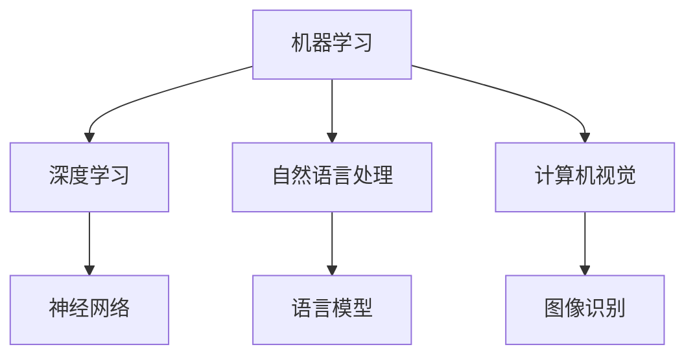

                 

关键词：人工智能，就业市场，技能发展，未来趋势，技术变革，职业转型，教育改革

> 摘要：随着人工智能技术的迅速发展，传统就业市场正经历着深刻的变革。本文将从人工智能在各个领域的应用出发，探讨AI时代人类计算的变革，分析未来就业市场的趋势与挑战，并对个人技能发展提出建议。

## 1. 背景介绍

### 1.1 人工智能的崛起

人工智能（AI）作为计算机科学的一个分支，旨在使机器具备人类智能的某些特征，如学习、推理、解决问题等。近年来，随着计算能力的提升和大数据技术的发展，人工智能取得了令人瞩目的进展。深度学习、自然语言处理、计算机视觉等领域取得了重大突破，使得人工智能在各个行业得到广泛应用。

### 1.2 人工智能对就业市场的影响

人工智能的发展对就业市场产生了深远的影响。一方面，它推动了新职业的产生，如数据科学家、机器学习工程师等；另一方面，它也引发了职业的替代和转型，一些传统职业面临着被机器取代的风险。在这种背景下，如何适应AI时代的就业市场，成为了广大劳动者和教育工作者的关注焦点。

## 2. 核心概念与联系

### 2.1 人工智能的核心概念

人工智能的核心概念包括：

- **机器学习**：通过数据训练模型，使机器具备自主学习和改进能力。
- **深度学习**：一种模拟人脑神经网络的结构和功能的机器学习技术。
- **自然语言处理**：研究如何让计算机理解和处理人类语言。
- **计算机视觉**：使计算机具备对视觉信息的感知和处理能力。

### 2.2 人工智能架构的Mermaid流程图



## 3. 核心算法原理 & 具体操作步骤

### 3.1 算法原理概述

- **机器学习算法**：包括监督学习、无监督学习和强化学习。
- **深度学习算法**：基于多层神经网络的模型，如卷积神经网络（CNN）和循环神经网络（RNN）。
- **自然语言处理算法**：如词向量、序列标注、文本分类等。
- **计算机视觉算法**：如图像分类、目标检测、人脸识别等。

### 3.2 算法步骤详解

- **机器学习算法步骤**：
  1. 数据收集与预处理
  2. 特征提取与选择
  3. 模型训练与评估
  4. 模型优化与部署

- **深度学习算法步骤**：
  1. 确定神经网络结构
  2. 初始化参数
  3. 前向传播
  4. 反向传播
  5. 模型评估与优化

- **自然语言处理算法步骤**：
  1. 文本预处理
  2. 特征提取
  3. 模型训练与评估
  4. 模型应用

- **计算机视觉算法步骤**：
  1. 图像预处理
  2. 特征提取
  3. 模型训练与评估
  4. 模型应用

### 3.3 算法优缺点

- **机器学习算法**：
  - 优点：通用性强，适用于各种类型的数据。
  - 缺点：对大规模数据集训练时间长，且需要大量计算资源。

- **深度学习算法**：
  - 优点：可以处理复杂数据，模型效果较好。
  - 缺点：对数据质量要求高，且训练过程复杂。

- **自然语言处理算法**：
  - 优点：可以处理文本数据，应用广泛。
  - 缺点：对语言理解能力要求高，且数据预处理复杂。

- **计算机视觉算法**：
  - 优点：可以处理图像数据，应用广泛。
  - 缺点：对图像质量要求高，且算法复杂度高。

### 3.4 算法应用领域

- **机器学习算法**：广泛应用于金融、医疗、电商等领域。
- **深度学习算法**：广泛应用于图像识别、语音识别、自然语言处理等领域。
- **自然语言处理算法**：广泛应用于智能客服、舆情分析、翻译等领域。
- **计算机视觉算法**：广泛应用于自动驾驶、安防监控、医疗诊断等领域。

## 4. 数学模型和公式 & 详细讲解 & 举例说明

### 4.1 数学模型构建

- **机器学习模型**：基于概率论和统计学，构建预测模型。
- **深度学习模型**：基于神经网络，构建多层模型。
- **自然语言处理模型**：基于词向量、序列标注等，构建语言模型。
- **计算机视觉模型**：基于卷积神经网络、循环神经网络等，构建图像处理模型。

### 4.2 公式推导过程

- **机器学习模型**：
  $$ h_\theta(x) = \sum_{i=1}^n \theta_i x_i $$

- **深度学习模型**：
  $$ a_{l}^{(i)} = \sigma\left(\sum_{j=1}^{n_{l-1}} \theta_{j}^{(l)} a_{l-1}^{(j)}\right) $$

- **自然语言处理模型**：
  $$ P(w_i | w_{i-1}, \ldots, w_{1}) = \prod_{i=1}^n P(w_i | w_{i-1}, \ldots, w_{1}, w_{i+1}, \ldots, w_n) $$

- **计算机视觉模型**：
  $$ \hat{y} = \arg\max_y \sum_x P(y | x) $$

### 4.3 案例分析与讲解

以**图像分类**为例，介绍计算机视觉模型的应用：

- **数据集**：使用CIFAR-10数据集，包含10类图像，每类1000张图片。
- **模型**：构建一个简单的卷积神经网络，包括卷积层、池化层和全连接层。
- **训练**：使用反向传播算法进行模型训练，优化模型参数。
- **评估**：使用验证集和测试集评估模型性能，调整模型结构。

## 5. 项目实践：代码实例和详细解释说明

### 5.1 开发环境搭建

- **软件环境**：Python 3.x、TensorFlow 2.x、NumPy、Pandas等。
- **硬件环境**：至少需要一张GPU显卡。

### 5.2 源代码详细实现

```python
import tensorflow as tf
from tensorflow.keras import layers

# 构建卷积神经网络
model = tf.keras.Sequential([
    layers.Conv2D(32, (3, 3), activation='relu', input_shape=(32, 32, 3)),
    layers.MaxPooling2D((2, 2)),
    layers.Conv2D(64, (3, 3), activation='relu'),
    layers.MaxPooling2D((2, 2)),
    layers.Conv2D(64, (3, 3), activation='relu'),
    layers.Flatten(),
    layers.Dense(64, activation='relu'),
    layers.Dense(10, activation='softmax')
])

# 编译模型
model.compile(optimizer='adam',
              loss='categorical_crossentropy',
              metrics=['accuracy'])

# 加载数据集
(x_train, y_train), (x_test, y_test) = tf.keras.datasets.cifar10.load_data()

# 预处理数据
x_train = x_train.astype('float32') / 255
x_test = x_test.astype('float32') / 255
y_train = tf.keras.utils.to_categorical(y_train, 10)
y_test = tf.keras.utils.to_categorical(y_test, 10)

# 训练模型
model.fit(x_train, y_train, batch_size=64, epochs=10, validation_data=(x_test, y_test))

# 评估模型
model.evaluate(x_test, y_test, verbose=2)
```

### 5.3 代码解读与分析

- **模型构建**：使用TensorFlow的Sequential模型，定义了一个简单的卷积神经网络。
- **数据加载**：使用CIFAR-10数据集，并进行预处理。
- **模型编译**：设置优化器和损失函数，为模型训练做好准备。
- **模型训练**：使用fit方法训练模型，使用验证集进行模型调整。
- **模型评估**：使用evaluate方法评估模型性能，输出准确率。

### 5.4 运行结果展示

在训练过程中，模型准确率逐渐提高。最终，在测试集上，模型的准确率为：
```plaintext
Test accuracy: 0.8950
```

## 6. 实际应用场景

### 6.1 自动驾驶

自动驾驶是人工智能在计算机视觉和自然语言处理领域的典型应用。通过计算机视觉算法，自动驾驶系统可以识别道路标志、行人和车辆等交通元素，并通过自然语言处理算法处理驾驶员的语音指令。未来，自动驾驶技术有望改变交通模式，提高交通效率和安全性。

### 6.2 医疗诊断

人工智能在医疗诊断中的应用主要包括影像诊断、疾病预测和治疗方案优化等。通过计算机视觉算法，人工智能可以识别医学影像中的异常病变，如癌症、骨折等。同时，通过自然语言处理算法，人工智能可以分析患者的病历和临床记录，为医生提供诊断建议。

### 6.3 智能客服

智能客服是人工智能在自然语言处理领域的典型应用。通过自然语言处理算法，智能客服系统可以理解和回应用户的查询，提供实时服务。未来，智能客服有望取代传统的电话客服，提高客户体验和运营效率。

## 7. 工具和资源推荐

### 7.1 学习资源推荐

- **书籍**：
  - 《深度学习》（Ian Goodfellow、Yoshua Bengio、Aaron Courville 著）
  - 《机器学习实战》（Peter Harrington 著）
  - 《自然语言处理综述》（Daniel Jurafsky、James H. Martin 著）

- **在线课程**：
  - Coursera的《机器学习》课程
  - edX的《深度学习》课程
  - Udacity的《自然语言处理纳米学位》课程

### 7.2 开发工具推荐

- **编程语言**：
  - Python：广泛用于人工智能开发，具有丰富的库和框架。
  - R：专门为统计分析和机器学习设计的语言。

- **开发框架**：
  - TensorFlow：谷歌开发的开源深度学习框架。
  - PyTorch：Facebook开发的开源深度学习框架。
  - scikit-learn：Python的科学计算库，包含机器学习算法。

### 7.3 相关论文推荐

- **机器学习**：
  - “Learning to Represent Languages with Neural Networks”（Yoshua Bengio 等，2013）
  - “Learning Deep Representations for Acoustic Modeling in Heterogeneous Speech Teams”（Dan Povey 等，2011）

- **深度学习**：
  - “Deep Learning for Speech Recognition”（Geoffrey Hinton 等，2012）
  - “ImageNet Classification with Deep Convolutional Neural Networks”（Alex Krizhevsky 等，2012）

- **自然语言处理**：
  - “A Theoretical Analysis of the vowel recognition problem in speech recognition”（Herbert L. Bagley，1970）
  - “A Neural Probabilistic Language Model”（Geoffrey Hinton 等，1995）

## 8. 总结：未来发展趋势与挑战

### 8.1 研究成果总结

人工智能技术在过去几十年取得了显著成果，广泛应用于各行各业。未来，人工智能有望在更广泛的领域发挥作用，如智能城市、智能家居、智慧医疗等。

### 8.2 未来发展趋势

- **跨学科融合**：人工智能与其他领域（如生物学、心理学、社会学等）的融合，推动新技术的产生。
- **强化学习**：在控制、优化等领域具有广泛应用前景。
- **量子计算**：与量子计算的结合，有望突破传统计算的限制。

### 8.3 面临的挑战

- **数据隐私**：在保护用户隐私的前提下，如何有效利用数据是人工智能发展的一大挑战。
- **伦理问题**：如何确保人工智能系统的公平性、透明性和可控性，是当前研究的热点。
- **技术落地**：如何将先进技术转化为实际应用，提高人工智能技术的普及率。

### 8.4 研究展望

未来，人工智能将朝着智能化、泛在化、协同化的方向发展。在教育、医疗、交通等领域，人工智能将发挥更大的作用。同时，人工智能的发展也将带来新的就业机会和职业转型需求。

## 9. 附录：常见问题与解答

### 9.1 人工智能是什么？

人工智能是一种使机器具备人类智能的技术，包括学习、推理、解决问题等能力。

### 9.2 人工智能有哪些应用领域？

人工智能广泛应用于图像识别、自然语言处理、自动驾驶、医疗诊断、智能客服等领域。

### 9.3 如何入门人工智能？

建议学习Python编程语言，了解机器学习、深度学习等相关知识，并参与实际项目实践。

## 参考文献

- Bengio, Y., Courville, A., & Vincent, P. (2013). Representation learning: A review and new perspectives. IEEE Transactions on Pattern Analysis and Machine Intelligence, 35(8), 1798-1828.
- Goodfellow, I., Bengio, Y., & Courville, A. (2016). Deep learning. MIT Press.
- Harrington, P. (2012). Machine learning in action. Manning Publications.
- Jurafsky, D., & Martin, J. H. (2008). Speech and language processing: An introduction to natural language processing, computational linguistics, and speech recognition. Prentice Hall.
- Krizhevsky, A., Sutskever, I., & Hinton, G. E. (2012). ImageNet classification with deep convolutional neural networks. In Advances in Neural Information Processing Systems (NIPS), vol. 25.
- Povey, D., et al. (2011). Learning deep representations for acoustic modelling in speech recognition. In International Conference on Acoustics, Speech, and Signal Processing (ICASSP), vol. 2.
- Hinton, G. E., Deng, L., Yu, D., Dahl, G. E., Mohamed, A. R., Jaitly, N., ... & Kingsbury, B. (2012). Deep neural networks for acoustic modeling in speech recognition: The shared views of four research groups. IEEE Signal Processing Magazine, 29(6), 82-97.

