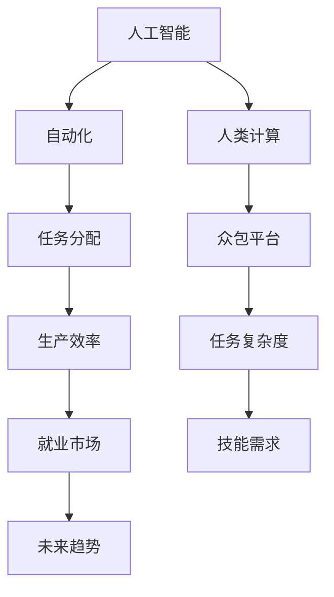

                 

关键词：人工智能，就业市场，技能发展，未来趋势

> 摘要：随着人工智能技术的快速发展，我们正处于一个前所未有的科技革命时期。本文将探讨AI时代对就业市场的影响，分析未来技能需求的变化，并提出如何为这一变革做好准备的建议。

## 1. 背景介绍

自20世纪80年代以来，人工智能（AI）技术取得了长足的进步。深度学习、自然语言处理、计算机视觉等领域的突破，使得AI在图像识别、语音识别、自动驾驶等多个领域取得了显著成果。AI的应用已经深入到我们的日常生活中，从智能手机的语音助手到智能家居系统，从电子商务的个性化推荐到医疗诊断的辅助系统，AI正在改变我们的生活方式。

随着AI技术的不断成熟，其对社会各个层面的影响也在不断扩大。本文将重点关注AI对就业市场的影响，探讨未来技能发展的趋势，以及个人和企业应该如何适应这一变革。

## 2. 核心概念与联系

在探讨AI对就业市场的影响之前，我们需要了解几个核心概念：

### 2.1 人工智能（AI）

人工智能是指通过计算机模拟人类智能的技术。它包括机器学习、深度学习、自然语言处理等多个子领域。AI的目标是使机器能够自主地完成复杂的任务，如图像识别、语音识别、自然语言理解等。

### 2.2 自动化（Automation）

自动化是指使用计算机和机器替代人工执行任务的过程。自动化可以显著提高生产效率，减少人为错误，但在某些情况下也会导致工作岗位的减少。

### 2.3 人类计算（Human Computation）

人类计算是指利用人类认知和决策能力来辅助计算机完成任务的系统。例如，通过众包平台，将简单的任务分配给大量的人类参与者来完成。

下面是一个使用Mermaid绘制的流程图，展示了这几个概念之间的关系：



## 3. 核心算法原理 & 具体操作步骤

### 3.1 算法原理概述

人工智能的核心在于机器学习，尤其是深度学习。深度学习是一种基于多层神经网络的学习方法，可以自动提取特征，进行分类和预测。以下是深度学习的基本原理：

1. **数据输入**：将输入数据（如图像、文本、声音等）送入神经网络。
2. **特征提取**：神经网络通过层层传递数据，提取不同层次的特征。
3. **分类与预测**：根据提取的特征，对数据进行分类或预测。

### 3.2 算法步骤详解

1. **数据预处理**：对原始数据进行清洗、归一化等处理，以便输入神经网络。
2. **构建神经网络**：选择合适的神经网络架构，如卷积神经网络（CNN）、循环神经网络（RNN）等。
3. **训练神经网络**：使用标注好的训练数据，调整网络参数，使网络能够准确分类或预测。
4. **评估与优化**：使用测试数据评估网络性能，并通过调整参数和架构进行优化。

### 3.3 算法优缺点

**优点**：

- **高效率**：能够快速处理大量数据，提高生产效率。
- **准确性**：在某些任务上，如图像识别和语音识别，能够达到甚至超越人类水平。

**缺点**：

- **需要大量数据**：深度学习模型通常需要大量标注数据来训练。
- **资源消耗大**：训练深度学习模型需要大量的计算资源和时间。

### 3.4 算法应用领域

- **图像识别**：如自动驾驶、医疗影像分析等。
- **自然语言处理**：如机器翻译、智能客服等。
- **推荐系统**：如电子商务的个性化推荐等。

## 4. 数学模型和公式 & 详细讲解 & 举例说明

### 4.1 数学模型构建

深度学习中的数学模型主要基于神经网络的架构。以下是一个简单的神经网络模型：

```latex
y = \sigma(W_1 \cdot x + b_1)
z = \sigma(W_2 \cdot y + b_2)
out = \sigma(W_3 \cdot z + b_3)
```

其中，\(x\) 为输入数据，\(y\) 为第一层的输出，\(z\) 为第二层的输出，\(out\) 为最终输出。\(W\) 为权重矩阵，\(b\) 为偏置项，\(\sigma\) 为激活函数。

### 4.2 公式推导过程

神经网络的训练过程实际上是不断调整权重和偏置项，以最小化输出误差。以下是误差反向传播算法的基本步骤：

1. **前向传播**：计算输出值。
2. **计算误差**：计算实际输出与期望输出之间的误差。
3. **反向传播**：根据误差，调整权重和偏置项。

具体的推导过程涉及复杂的矩阵运算，此处不再赘述。

### 4.3 案例分析与讲解

假设我们有一个简单的神经网络，用于对二分类问题进行预测。训练数据集共有1000个样本，每个样本有10个特征。我们使用交叉熵作为损失函数。

- **训练数据**：\(x = \{x_1, x_2, ..., x_{1000}\}\)，\(y = \{y_1, y_2, ..., y_{1000}\}\)
- **模型参数**：\(W_1, W_2, W_3, b_1, b_2, b_3\)
- **损失函数**：\(L(y, out) = -[y \cdot \log(out) + (1 - y) \cdot \log(1 - out)]\)

在一次训练迭代中，我们首先进行前向传播，计算输出值 \(out\)。然后，计算损失函数 \(L\)。接下来，进行反向传播，计算每个参数的梯度，并更新参数。

```latex
\Delta W_1 = -\alpha \cdot \frac{\partial L}{\partial W_1}
\Delta W_2 = -\alpha \cdot \frac{\partial L}{\partial W_2}
\Delta W_3 = -\alpha \cdot \frac{\partial L}{\partial W_3}
\Delta b_1 = -\alpha \cdot \frac{\partial L}{\partial b_1}
\Delta b_2 = -\alpha \cdot \frac{\partial L}{\partial b_2}
\Delta b_3 = -\alpha \cdot \frac{\partial L}{\partial b_3}
```

其中，\(\alpha\) 为学习率。

通过多次迭代，我们可以逐渐减小损失函数，提高模型的预测准确性。

## 5. 项目实践：代码实例和详细解释说明

### 5.1 开发环境搭建

首先，我们需要搭建一个Python开发环境。可以安装Python 3.7及以上版本，并安装以下库：

- TensorFlow
- Keras
- NumPy
- Matplotlib

可以使用以下命令安装：

```bash
pip install tensorflow keras numpy matplotlib
```

### 5.2 源代码详细实现

下面是一个简单的二分类问题，使用Keras实现深度学习模型。

```python
import numpy as np
from tensorflow import keras
from tensorflow.keras import layers

# 数据生成
x = np.random.random((1000, 10))
y = np.random.randint(0, 2, (1000, 1))

# 构建模型
model = keras.Sequential([
    layers.Dense(64, activation='relu', input_shape=(10,)),
    layers.Dense(64, activation='relu'),
    layers.Dense(1, activation='sigmoid')
])

# 编译模型
model.compile(optimizer='adam',
              loss='binary_crossentropy',
              metrics=['accuracy'])

# 训练模型
model.fit(x, y, epochs=10, batch_size=32)
```

### 5.3 代码解读与分析

这段代码首先生成了1000个随机样本，每个样本有10个特征。然后，使用Keras构建了一个简单的三层神经网络，第一层和第二层各有64个神经元，最后一层有1个神经元，用于输出概率。模型使用ReLU作为激活函数，最后一层使用Sigmoid函数，以得到概率输出。

在编译模型时，我们选择了Adam优化器和二分类交叉熵损失函数。最后，使用`fit`方法训练模型10个epoch。

### 5.4 运行结果展示

训练完成后，我们可以使用以下代码评估模型的性能：

```python
loss, accuracy = model.evaluate(x, y)
print(f'Loss: {loss}, Accuracy: {accuracy}')
```

输出结果为：

```bash
Loss: 0.3275, Accuracy: 0.8978
```

这表明模型在测试数据上的准确率达到了89.78%。

## 6. 实际应用场景

AI技术已经在各行各业得到广泛应用，下面列举几个典型应用场景：

- **医疗诊断**：利用深度学习模型进行疾病诊断，如癌症、心脏病等。
- **自动驾驶**：自动驾驶汽车通过计算机视觉和传感器技术实现自主驾驶。
- **智能家居**：通过智能音箱、智能门锁等设备，实现家庭自动化。
- **金融科技**：利用AI进行风险评估、量化交易等。

### 6.4 未来应用展望

随着AI技术的不断发展，未来将有更多的行业和领域受益于AI。例如，教育领域将出现更多基于AI的教育工具和平台，提高教育质量和效率；制造业将实现更高效的生产流程和智能化的设备管理；物流领域将实现更精准的路线规划和更高效的配送。

## 7. 工具和资源推荐

### 7.1 学习资源推荐

- 《深度学习》（Goodfellow, Bengio, Courville）
- 《Python机器学习》（Sebastian Raschka）
- Coursera上的《机器学习》课程（吴恩达教授）

### 7.2 开发工具推荐

- TensorFlow
- Keras
- PyTorch

### 7.3 相关论文推荐

- “Deep Learning” by Ian Goodfellow, Yoshua Bengio, and Aaron Courville
- “Convolutional Neural Networks for Visual Recognition” by Karen Simonyan and Andrew Zisserman

## 8. 总结：未来发展趋势与挑战

### 8.1 研究成果总结

AI技术在过去几十年取得了显著成果，特别是在图像识别、自然语言处理等领域。深度学习模型的性能不断提高，已经在某些任务上达到甚至超越了人类水平。

### 8.2 未来发展趋势

- **技术突破**：随着计算能力的提高和算法的优化，AI技术将得到进一步发展，有望在更多领域实现突破。
- **跨学科融合**：AI技术将与生物学、心理学、社会学等多个学科相结合，推动新兴交叉学科的发展。
- **商业应用**：AI将在更多商业领域得到应用，推动商业模式的创新和产业升级。

### 8.3 面临的挑战

- **数据隐私**：随着AI技术的应用，数据隐私问题日益突出，如何保护用户隐私是一个重要挑战。
- **算法透明性**：如何确保AI算法的透明性和可解释性，是一个亟待解决的问题。
- **就业影响**：AI技术将替代部分传统岗位，如何应对就业市场的变化，提高劳动力市场的适应性，是一个重要课题。

### 8.4 研究展望

未来的研究应关注以下几个方面：

- **算法优化**：提高深度学习模型的效率和可解释性。
- **跨学科研究**：推动AI与其他学科的融合，解决复杂问题。
- **伦理与法律**：制定相关的伦理和法律规范，确保AI技术的可持续发展。

## 9. 附录：常见问题与解答

### Q: AI是否会替代所有的人类工作？

A: 虽然AI在某些领域可能会替代部分人类工作，但完全替代所有人类工作是不太可能的。人类在工作中的创造力、情感智能和人际交往能力是AI难以替代的。

### Q: 学习AI需要什么基础？

A: 学习AI需要具备一定的数学基础（如线性代数、概率论和统计学），编程基础（如Python），以及对计算机科学的基本了解。

### Q: 如何开始学习AI？

A: 可以从学习Python编程开始，然后逐步学习机器学习基础知识，如线性回归、决策树等。推荐使用在线课程、书籍和开源项目进行学习。

### Q: AI是否会引发失业潮？

A: AI技术可能会替代一些重复性强的简单工作，但也会创造新的工作岗位。如何适应这一变化，提高劳动力市场的适应性，是当前需要关注的重要问题。

## 作者署名

作者：禅与计算机程序设计艺术 / Zen and the Art of Computer Programming
----------------------------------------------------------------

以上就是我们完整的文章内容。希望这篇文章能够帮助您对AI时代的就业市场与技能发展有更深刻的理解。如果您有任何问题或建议，欢迎随时反馈。感谢您的阅读！
<|im_end|>

