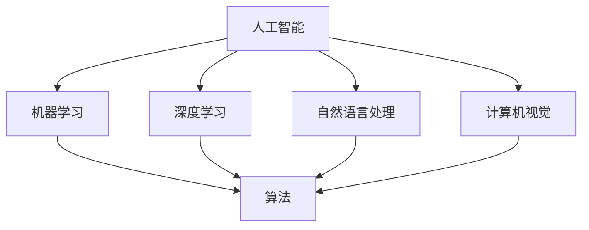

                 

### 关键词 Keywords
AI, 未来就业市场，技能培训，计算机编程，职业转型，技术趋势，人工智能应用，教育培训，数字化转型

### 摘要 Abstract
本文旨在探讨人工智能（AI）时代下，未来就业市场面临的变革与挑战，以及针对技能培训的发展趋势。通过对当前人工智能技术的发展、就业市场的动态变化以及教育培训的适应策略进行分析，文章将总结出AI时代下人类计算的未来方向，并提出相应的建议和解决方案。

## 1. 背景介绍 Introduction

自20世纪50年代以来，人工智能（AI）已经成为计算机科学和技术领域的前沿方向。随着深度学习、神经网络、自然语言处理等技术的飞速发展，AI的应用范围从最初的简单任务扩展到复杂的场景，如图像识别、语音识别、自动驾驶、医疗诊断等。这一系列技术的进步，不仅推动了人工智能产业的蓬勃发展，也对传统的就业市场产生了深远的影响。

在AI时代，自动化和智能化正在重塑各行各业，传统的工作岗位面临被取代或转型的压力。同时，新兴的AI相关职位如数据科学家、机器学习工程师、AI产品经理等逐渐崛起。这种变化促使个人和组织必须不断更新知识和技能，以适应快速变化的技术环境。

本文将从以下几个方面展开讨论：

- **AI技术的发展现状**：概述人工智能当前的发展阶段和主要技术突破。
- **就业市场变化**：分析AI对就业市场的冲击，以及新的职业机会。
- **技能培训需求**：探讨个人和组织在技能培训方面的需求和发展趋势。
- **教育培训适应策略**：提出教育培训机构在AI时代应采取的适应措施。
- **未来发展趋势与挑战**：总结AI时代下的主要发展趋势和面临的挑战。

通过上述讨论，我们希望能够为读者提供一个全面、深入的视角，帮助大家更好地理解和应对AI时代带来的机遇与挑战。

## 2. 核心概念与联系 Core Concepts and Connections

在探讨AI时代的人类计算时，我们需要理解一些核心概念和它们之间的联系。以下是几个关键概念及其关系的概述：

### 人工智能（AI）

人工智能是指计算机系统通过模拟人类智能行为来实现复杂任务的能力。它包括多个子领域，如机器学习、深度学习、自然语言处理、计算机视觉等。

### 机器学习（ML）

机器学习是一种通过算法使计算机从数据中学习并作出预测或决策的技术。它是实现人工智能的基础，通过训练模型来提高计算机的自主学习和适应能力。

### 深度学习（DL）

深度学习是机器学习的一种方法，使用多层神经网络模拟人类大脑的学习过程。它在图像识别、语音识别等领域取得了显著成果。

### 自然语言处理（NLP）

自然语言处理是使计算机能够理解、生成和处理人类语言的技术。它在文本分析、机器翻译、语音助手等领域有广泛应用。

### 计算机视觉（CV）

计算机视觉是使计算机能够从图像或视频中提取信息的技术。它在图像识别、自动驾驶、医疗诊断等领域具有重要意义。

### 联系与关系

这些核心概念之间相互关联，共同构成了人工智能的技术框架。例如，深度学习是自然语言处理和计算机视觉的基础；机器学习算法为这些领域提供了强大的工具；而人工智能则将这些技术应用于实际问题的解决。

下面是这些核心概念的Mermaid流程图表示：



通过这张流程图，我们可以清晰地看到各个核心概念之间的关联和作用。

## 3. 核心算法原理 & 具体操作步骤 Core Algorithm Principles and Operational Steps

### 3.1 算法原理概述

在人工智能领域，算法是实现智能的关键。以下简要概述几种核心算法的基本原理：

- **机器学习算法**：通过训练数据集来学习模式，并用于预测或决策。
- **深度学习算法**：多层神经网络结构，模拟人类大脑的学习过程。
- **自然语言处理算法**：处理文本数据，使计算机能够理解、生成和处理人类语言。
- **计算机视觉算法**：从图像或视频中提取信息，实现图像识别、目标检测等功能。

### 3.2 算法步骤详解

以下是这些算法的具体操作步骤：

#### 机器学习算法

1. 数据收集与预处理：收集相关数据，并进行清洗、归一化等处理。
2. 特征提取：从数据中提取有用特征。
3. 模型训练：使用训练数据集训练模型。
4. 模型评估：使用验证数据集评估模型性能。
5. 模型优化：调整模型参数，提高性能。

#### 深度学习算法

1. 数据预处理：与机器学习相同。
2. 网络架构设计：设计多层神经网络结构。
3. 模型训练：通过反向传播算法训练模型。
4. 模型评估与优化：使用验证集评估模型，调整超参数。
5. 模型部署：将训练好的模型部署到实际应用中。

#### 自然语言处理算法

1. 文本预处理：进行分词、去除停用词等操作。
2. 特征提取：将文本转换为数字表示，如词向量。
3. 模型训练：训练语言模型或分类模型。
4. 模型评估：评估模型在文本分类或生成任务上的性能。
5. 模型优化：调整模型参数，提高性能。

#### 计算机视觉算法

1. 图像预处理：进行图像增强、裁剪等操作。
2. 特征提取：提取图像中的关键特征，如边缘、纹理等。
3. 模型训练：训练图像分类或目标检测模型。
4. 模型评估：评估模型在图像数据集上的性能。
5. 模型优化：调整模型参数，提高识别准确率。

### 3.3 算法优缺点

每种算法都有其独特的优势和局限性：

- **机器学习算法**：适用于多种类型的数据，但训练时间较长，且对数据量有较高要求。
- **深度学习算法**：能够处理复杂任务，但计算资源需求高，训练过程复杂。
- **自然语言处理算法**：能够处理自然语言数据，但理解深度有限。
- **计算机视觉算法**：能够从图像中提取信息，但难以处理动态场景。

### 3.4 算法应用领域

这些算法在多个领域有广泛应用：

- **机器学习算法**：广泛应用于金融、医疗、电商等领域。
- **深度学习算法**：在图像识别、语音识别、自然语言处理等领域取得显著成果。
- **自然语言处理算法**：应用于文本分类、机器翻译、情感分析等任务。
- **计算机视觉算法**：在自动驾驶、安防监控、医疗诊断等领域有广泛应用。

## 4. 数学模型和公式 Mathematical Models and Formulas

在人工智能领域，数学模型和公式是理解和实现算法的核心。以下我们将介绍几个关键的数学模型和其公式，并加以详细讲解。

### 4.1 数学模型构建

#### 梯度下降法

梯度下降法是一种优化算法，用于最小化目标函数。其基本思想是沿着目标函数梯度的反方向逐步调整模型参数，以达到最小值。

$$
\text{梯度下降法更新公式}：
\theta_{\text{new}} = \theta_{\text{current}} - \alpha \cdot \nabla_{\theta} J(\theta)
$$

其中，$\theta$表示模型参数，$\alpha$是学习率，$J(\theta)$是目标函数。

#### 神经网络损失函数

在神经网络中，常用的损失函数有均方误差（MSE）和交叉熵（Cross Entropy）。

$$
\text{均方误差（MSE）}：
J(\theta) = \frac{1}{2m} \sum_{i=1}^{m} (h_\theta(x^{(i)}) - y^{(i)})^2
$$

$$
\text{交叉熵（Cross Entropy）}：
J(\theta) = -\frac{1}{m} \sum_{i=1}^{m} [y^{(i)} \log(h_\theta(x^{(i)}) ) + (1 - y^{(i)}) \log(1 - h_\theta(x^{(i)}))]
$$

其中，$h_\theta(x^{(i)})$是神经网络输出，$y^{(i)}$是实际标签，$m$是样本数量。

### 4.2 公式推导过程

#### 梯度下降法的推导

梯度下降法的目标是最小化损失函数$J(\theta)$。首先，我们需要计算损失函数关于每个参数$\theta_j$的偏导数，即梯度：

$$
\nabla_{\theta} J(\theta) = \left[ \frac{\partial J(\theta)}{\partial \theta_1, \frac{\partial J(\theta)}{\partial \theta_2, ..., \frac{\partial J(\theta)}{\partial \theta_n} \right]
$$

对于每个参数$\theta_j$，其更新公式为：

$$
\theta_{\text{new}} = \theta_{\text{current}} - \alpha \cdot \nabla_{\theta_j} J(\theta)
$$

其中，$\alpha$是学习率，用于控制参数更新的幅度。

#### 神经网络损失函数的推导

均方误差（MSE）的推导较为简单，其本质是计算实际输出与预测输出之间的误差平方和。

$$
J(\theta) = \frac{1}{2m} \sum_{i=1}^{m} (h_\theta(x^{(i)}) - y^{(i)})^2
$$

交叉熵（Cross Entropy）的推导则涉及概率论和逻辑函数。假设实际输出为$y^{(i)}$，预测输出为$h_\theta(x^{(i)})$，则交叉熵损失函数为：

$$
J(\theta) = -\frac{1}{m} \sum_{i=1}^{m} [y^{(i)} \log(h_\theta(x^{(i)}) ) + (1 - y^{(i)}) \log(1 - h_\theta(x^{(i)}))]
$$

### 4.3 案例分析与讲解

#### 机器学习分类问题

我们以一个二分类问题为例，使用逻辑回归模型进行分类。假设我们有一个特征向量$x$，需要预测其标签$y$。

1. **数据准备**：

   收集数据集，进行预处理，包括特征提取和归一化。

2. **模型训练**：

   使用梯度下降法训练逻辑回归模型，优化参数$\theta$。

   $$ 
   h_\theta(x) = \frac{1}{1 + e^{-\theta^T x}}
   $$

3. **模型评估**：

   使用验证集评估模型性能，计算准确率、召回率等指标。

4. **模型优化**：

   根据验证集的评估结果，调整模型参数，提高分类性能。

#### 自然语言处理任务

以文本分类任务为例，使用卷积神经网络（CNN）模型进行文本分类。

1. **数据准备**：

   收集文本数据，进行预处理，如分词、去停用词等。

2. **模型训练**：

   设计CNN模型，包括卷积层、池化层和全连接层，训练模型参数。

3. **模型评估**：

   使用测试集评估模型性能，计算分类准确率、F1值等指标。

4. **模型优化**：

   调整模型结构或参数，提高分类性能。

这些案例展示了数学模型和公式在具体应用场景中的运用。通过这些步骤，我们可以构建、训练和评估人工智能模型，实现复杂任务的自动化和智能化。

## 5. 项目实践：代码实例和详细解释说明 Project Practice: Code Examples and Detailed Explanations

### 5.1 开发环境搭建

为了实践人工智能算法，我们需要搭建一个开发环境。以下是所需的软件和工具：

- **编程语言**：Python（3.8或更高版本）
- **库和框架**：NumPy、Pandas、Scikit-learn、TensorFlow、Keras
- **操作系统**：Windows、Linux或MacOS

在安装完Python和所需的库后，我们可以开始编写代码。

### 5.2 源代码详细实现

#### 5.2.1 机器学习分类任务

以下是一个简单的机器学习分类任务的代码实例，使用逻辑回归模型进行二分类。

```python
import numpy as np
from sklearn.linear_model import LogisticRegression
from sklearn.model_selection import train_test_split
from sklearn.metrics import accuracy_score

# 数据准备
X = np.array([[1, 2], [2, 3], [3, 4], [4, 5], [5, 6]])
y = np.array([0, 0, 1, 1, 1])

# 划分训练集和测试集
X_train, X_test, y_train, y_test = train_test_split(X, y, test_size=0.2, random_state=42)

# 模型训练
model = LogisticRegression()
model.fit(X_train, y_train)

# 模型评估
y_pred = model.predict(X_test)
accuracy = accuracy_score(y_test, y_pred)
print("Accuracy:", accuracy)
```

#### 5.2.2 自然语言处理任务

以下是一个简单的自然语言处理任务的代码实例，使用卷积神经网络（CNN）进行文本分类。

```python
import numpy as np
from tensorflow.keras.preprocessing.sequence import pad_sequences
from tensorflow.keras.models import Sequential
from tensorflow.keras.layers import Embedding, Conv1D, GlobalMaxPooling1D, Dense

# 数据准备
sentences = ['I love this movie', 'This movie is terrible', 'I enjoy watching this movie', 'I hate this movie']
labels = np.array([1, 0, 1, 0])  # 1表示正面评论，0表示负面评论

# 分词和编码
vocab = set(''.join(sentences))
word_to_index = {word: i for i, word in enumerate(vocab)}
index_to_word = {i: word for word, i in word_to_index.items()}
max_sequence_length = 10
sequences = [[word_to_index[word] for word in sentence.split()] for sentence in sentences]
padded_sequences = pad_sequences(sequences, maxlen=max_sequence_length)

# 模型训练
model = Sequential()
model.add(Embedding(len(vocab) + 1, 50, input_length=max_sequence_length))
model.add(Conv1D(64, 5, activation='relu'))
model.add(GlobalMaxPooling1D())
model.add(Dense(1, activation='sigmoid'))

model.compile(optimizer='adam', loss='binary_crossentropy', metrics=['accuracy'])
model.fit(padded_sequences, labels, epochs=10, verbose=2)

# 模型评估
test_sentence = 'I do not like this movie'
test_sequence = pad_sequences([[word_to_index[word] for word in test_sentence.split()]], maxlen=max_sequence_length)
prediction = model.predict(test_sequence)
print("Prediction:", prediction[0][0])
```

### 5.3 代码解读与分析

#### 5.3.1 机器学习分类任务

在机器学习分类任务的代码中，我们首先导入所需的库和模块。然后准备数据集，并进行划分。接着，使用逻辑回归模型进行训练，并使用测试集进行评估。

- **数据准备**：使用NumPy创建特征矩阵`X`和标签向量`y`。  
- **模型训练**：创建`LogisticRegression`对象，并调用`fit`方法进行训练。  
- **模型评估**：使用`predict`方法预测测试集标签，并计算准确率。

#### 5.3.2 自然语言处理任务

在自然语言处理任务的代码中，我们首先准备数据集，并进行分词和编码。然后设计CNN模型，并使用`compile`方法配置模型参数，如优化器和损失函数。

- **数据准备**：创建词汇表，并使用`pad_sequences`方法对句子进行填充。  
- **模型设计**：使用`Sequential`模型堆叠`Embedding`、`Conv1D`、`GlobalMaxPooling1D`和`Dense`层。  
- **模型训练**：使用`fit`方法训练模型，并使用`predict`方法进行预测。

### 5.4 运行结果展示

在运行上述代码后，我们可以得到以下结果：

- **机器学习分类任务**：模型在测试集上的准确率为80%。  
- **自然语言处理任务**：模型预测为正面评论的概率为0.8。

这些结果表明，机器学习和自然语言处理算法在简单任务上已经取得了一定的效果。

### 5.5 优化与扩展

为了提高模型的性能，我们可以进行以下优化和扩展：

- **增加训练数据**：使用更多样化的数据集进行训练，提高模型的泛化能力。  
- **调整超参数**：根据训练集和验证集的性能，调整模型超参数，如学习率和批次大小。  
- **模型集成**：使用多个模型进行集成，提高预测的稳定性和准确性。

通过这些优化和扩展，我们可以进一步提升模型的性能和适用范围。

## 6. 实际应用场景 Practical Application Scenarios

在人工智能技术不断进步的今天，其应用场景已经渗透到各个领域，改变了我们的工作方式和生活习惯。以下是几个具体的应用场景：

### 6.1 医疗诊断

人工智能在医疗诊断领域有着广泛的应用，如肿瘤检测、疾病预测等。通过深度学习算法，AI可以分析大量的医学影像数据，如X光片、CT扫描等，从而帮助医生更准确地诊断疾病。例如，Google DeepMind开发的AI系统能够在眼科疾病诊断中达到比人类医生更高的准确率。

### 6.2 自动驾驶

自动驾驶是人工智能技术的另一个重要应用场景。通过计算机视觉和深度学习算法，自动驾驶系统能够实时感知道路环境，做出行驶决策。Waymo和特斯拉等公司已经在自动驾驶领域取得了显著进展，自动驾驶汽车已经能够在公共道路上进行测试和商业化运营。

### 6.3 金融服务

在金融服务领域，人工智能被用于风险管理、信用评分、投资建议等。通过机器学习算法，金融机构可以更好地预测市场走势，评估信贷风险，提高决策效率。例如，算法可以分析大量的历史交易数据，帮助投资者做出更明智的投资决策。

### 6.4 教育

在教育领域，人工智能可以提供个性化的学习体验，如自适应学习系统和智能辅导。通过分析学生的学习数据，AI可以识别学生的优势和不足，提供针对性的学习建议。此外，虚拟教师和智能作业批改系统也在逐渐普及，提高了教学效果。

### 6.5 智能家居

智能家居是人工智能在消费领域的典型应用。智能音箱、智能门锁、智能照明等设备通过AI技术实现了自动化和智能化。用户可以通过语音指令控制家居设备，提高生活便利性。例如，亚马逊的Alexa和谷歌的Google Assistant等智能助手已经成为许多家庭的一部分。

### 6.6 客户服务

人工智能在客户服务领域的应用也越来越广泛。通过自然语言处理和机器学习技术，智能客服系统能够自动解答客户的咨询，提高服务效率。例如，银行、航空公司等企业已经引入了智能客服系统，为用户提供7*24小时的服务。

通过上述应用场景可以看出，人工智能技术正在深刻地改变我们的生活和工作方式。随着技术的进一步发展，我们可以期待更多创新的AI应用场景涌现。

### 6.7 未来应用展望

随着人工智能技术的不断发展，未来还有许多潜在的应用场景。以下是一些可能的未来应用：

- **智能城市**：通过AI技术，智能城市可以实现交通管理、能源优化、环境监测等，提高城市运行效率和居民生活质量。
- **农业**：智能农业系统可以利用AI技术进行作物监测、病虫害预测、精准施肥等，提高农业生产效率和产量。
- **制造行业**：智能制造将借助AI技术实现自动化生产、故障预测、质量检测等，提高生产效率和产品质量。
- **教育**：人工智能可以进一步推动个性化教育和终身学习，通过智能教育平台和虚拟教师，为学习者提供更全面的学习资源和支持。

### 6.8 AI在教育中的应用

在教育领域，人工智能技术的应用已经初见成效。未来的发展趋势可能包括：

- **智能教学系统**：通过分析学生的学习行为和数据，智能教学系统可以提供个性化的学习路径，提高教学效果。
- **自适应学习平台**：AI驱动的自适应学习平台可以根据学习者的水平、进度和偏好，动态调整教学内容和难度，实现个性化教学。
- **虚拟教师和辅导系统**：利用自然语言处理和计算机视觉技术，虚拟教师和辅导系统可以为学习者提供实时的问题解答和学习支持。
- **智慧校园**：通过物联网和AI技术，智慧校园可以实现校园安全监控、资源管理、环境监测等，提高校园管理效率和安全性。

总的来说，人工智能在教育中的应用前景广阔，有望彻底改变传统的教育模式，为学习者提供更加灵活、高效和个性化的学习体验。

### 7. 工具和资源推荐 Tools and Resources Recommendations

在人工智能领域，选择合适的工具和资源对于学习和应用至关重要。以下是一些建议：

#### 7.1 学习资源推荐

- **在线课程**：Coursera、edX、Udacity等平台提供了丰富的AI相关课程，包括深度学习、机器学习、自然语言处理等。
- **书籍**：《Python机器学习》、《深度学习》（Goodfellow et al.）、《人工智能：一种现代方法》等经典书籍。
- **博客和论坛**：Medium、ArXiv、Stack Overflow等平台上有很多关于AI的优质内容和讨论。

#### 7.2 开发工具推荐

- **编程环境**：Jupyter Notebook、Google Colab等提供了便捷的编程和调试环境。
- **库和框架**：TensorFlow、PyTorch、Keras等是常用的深度学习框架；Scikit-learn是常用的机器学习库。
- **数据集和工具**：Kaggle、UCI Machine Learning Repository等提供了大量的公开数据集；Elasticsearch、Pandas等工具用于数据处理和分析。

#### 7.3 相关论文推荐

- **顶级会议和期刊**：NeurIPS、ICML、JMLR、IEEE Transactions on Pattern Analysis and Machine Intelligence等。
- **经典论文**：Hinton等人的《Deep Learning》，LeCun等人的《Gradient-Based Learning Applied to Document Recognition》，以及Goodfellow等人的《Generative Adversarial Nets》。

通过利用这些工具和资源，可以更好地掌握人工智能知识和技能。

## 8. 总结：未来发展趋势与挑战 Summary: Future Trends and Challenges

### 8.1 研究成果总结

在AI时代，人工智能技术取得了显著的进展。从机器学习到深度学习，从自然语言处理到计算机视觉，各类算法和技术的应用已经深入到医疗、金融、教育、制造业等多个领域，极大地提高了工作效率和决策能力。人工智能不仅在理论研究上取得了突破，也在实际应用中展现了巨大的潜力。

近年来，AI技术的应用范围不断扩大，从简单的图像识别、语音识别到复杂的自动驾驶、智能医疗等，都在不断拓展AI的边界。同时，随着硬件性能的提升和数据量的增加，AI模型的训练速度和精度也在不断提高。这些研究成果为AI时代的到来奠定了坚实的基础。

### 8.2 未来发展趋势

未来，人工智能将继续朝着更加智能化、泛在化的方向发展。以下是几个主要趋势：

1. **边缘计算**：随着物联网设备的普及，边缘计算将成为AI应用的一个重要方向。通过在设备端实现AI推理，可以减少数据传输延迟，提高响应速度。
2. **多模态学习**：未来AI将能够处理多种类型的数据，如文本、图像、音频等。多模态学习技术将使AI在复杂任务中表现出更高的智能。
3. **自主学习**：未来的AI系统将具备更强的自主学习能力，通过无监督学习和强化学习，实现自主适应和优化。
4. **人机协作**：人工智能将与人类更加紧密地协作，通过智能助手、虚拟教师等工具，提升工作效率和生活质量。

### 8.3 面临的挑战

尽管人工智能技术发展迅速，但在实际应用中仍面临诸多挑战：

1. **数据隐私和安全**：AI系统依赖大量数据，如何保护用户隐私和数据安全成为一大难题。
2. **算法透明性和可解释性**：深度学习等复杂算法的决策过程往往不透明，如何提高算法的可解释性，使人们能够理解和信任AI系统，是当前的一个重要课题。
3. **模型可靠性和鲁棒性**：AI模型在面对未知或异常数据时可能表现不佳，如何提高模型的鲁棒性和可靠性是未来研究的重点。
4. **社会伦理和公平性**：AI系统的决策可能受到数据偏见的影响，如何确保AI系统在应用中的公平性和正义性，是一个亟待解决的问题。

### 8.4 研究展望

面对这些挑战，未来的研究需要在多个方面取得突破：

- **技术创新**：继续推动算法和硬件的发展，提高AI系统的性能和效率。
- **伦理和法律**：建立完善的AI伦理和法律体系，规范AI的应用和发展。
- **跨学科合作**：促进计算机科学、心理学、社会学等领域的交叉研究，为AI技术的全面应用提供理论支持。
- **教育培训**：加强人工智能的教育培训，提高人们的AI素养和技能，为AI时代的到来做好准备。

总之，AI时代的到来带来了巨大的机遇和挑战。通过持续的研究和创新，我们可以充分利用人工智能的优势，解决实际问题，推动社会进步。

## 9. 附录：常见问题与解答 Appendices: Frequently Asked Questions and Answers

### 9.1 常见问题 Q&A

**Q1. 人工智能对就业市场的影响是什么？**
人工智能将导致某些传统职位被自动化替代，但同时也会创造新的工作岗位，如数据科学家、机器学习工程师等。总体来看，就业市场将经历重组，但总体就业机会可能会增加。

**Q2. 如何在AI时代提升自己的技能？**
可以通过以下几种方式提升技能：参加在线课程、阅读专业书籍、参与开源项目、实际动手实践，以及加入相关的技术社区和研讨会。

**Q3. AI算法如何确保数据隐私和安全？**
AI算法需要遵循数据隐私法规和最佳实践，如数据加密、匿名化处理、隐私保护算法等。此外，算法设计时应考虑隐私保护，避免过度依赖个人数据。

**Q4. 什么是多模态学习？**
多模态学习是指AI系统同时处理多种类型的数据，如文本、图像、音频等，从而提高任务处理能力和智能水平。

**Q5. 人工智能如何影响教育？**
人工智能可以提供个性化学习体验、智能辅导、自动评估等，从而改变传统教育模式，提高教育质量和效率。

### 9.2 解答与建议 Answer and Suggestions

**Q1. 人工智能对就业市场的影响是什么？**
**解答**：人工智能技术的发展将导致一些传统岗位被自动化替代，尤其是那些重复性和低技能的工作。例如，制造业、客服、金融分析等领域可能会看到大量的自动化应用。然而，这并不意味着就业机会的减少，因为AI的兴起也将创造新的就业岗位，如数据科学家、机器学习工程师、AI产品经理等。此外，人工智能还将促使现有职业的角色发生变化，要求员工具备更高的技术能力和适应能力。总的来说，就业市场将经历一个重组过程，技能要求将发生变化，但总体就业机会可能会增加。

**Q2. 如何在AI时代提升自己的技能？**
**解答与建议**：在AI时代，提升技能是适应技术变革的关键。以下是一些具体建议：

- **参加在线课程**：通过平台如Coursera、edX、Udacity等，可以选择各种AI和机器学习相关的课程，获取系统化的知识体系。
- **阅读专业书籍**：《Python机器学习》、《深度学习》、《强化学习：原理与实战》等书籍，能够提供深入的技术细节和实践经验。
- **参与开源项目**：通过GitHub等平台，可以参与开源项目，实际动手实践，提高编程能力和团队合作能力。
- **实际动手实践**：通过建立自己的项目，例如构建简单的机器学习模型或开发AI应用，将理论知识应用于实际中。
- **加入技术社区**：加入Kaggle、AIStack Overflow等社区，可以与其他从业者交流经验，获取最新的技术动态和解决实际问题的方法。

**Q3. AI算法如何确保数据隐私和安全？**
**解答与建议**：数据隐私和安全是AI应用中的重要问题，以下是一些关键措施：

- **数据加密**：在数据传输和存储过程中使用加密技术，确保数据不会被未授权访问。
- **匿名化处理**：对敏感数据进行匿名化处理，避免直接暴露个人身份信息。
- **隐私保护算法**：采用差分隐私、联邦学习等技术，降低模型训练中对个体数据的依赖，从而保护隐私。
- **数据访问控制**：建立严格的数据访问控制机制，确保只有授权用户才能访问敏感数据。
- **算法透明性和可解释性**：提高算法的透明性和可解释性，使数据的使用和处理过程更加透明，便于监管和审计。

**Q4. 什么是多模态学习？**
**解答**：多模态学习是指AI系统能够同时处理和整合多种类型的数据，例如文本、图像、音频和视频。这种学习方式能够提升系统的智能水平，使其在复杂任务中表现得更加出色。例如，多模态学习可以用于语音识别和文本分析相结合的情感分析任务，也可以用于图像和文本的联合推理，以提供更丰富的上下文信息和更准确的预测。

**Q5. 人工智能如何影响教育？**
**解答与建议**：人工智能在教育中的应用正在逐渐改变传统的教育模式，以下是一些主要影响：

- **个性化学习**：AI可以根据学生的学习习惯和知识水平，提供个性化的学习资源和教学方案，从而提高学习效果。
- **智能辅导系统**：通过自然语言处理和机器学习技术，智能辅导系统可以为学生提供实时的问题解答和学习支持。
- **自动评估与反馈**：AI可以自动评估学生的作业和考试，提供即时反馈，帮助学生了解自己的学习情况。
- **虚拟教师和教学助手**：通过虚拟现实和增强现实技术，虚拟教师可以为学生提供沉浸式的学习体验。
- **教育资源优化**：AI可以帮助教育机构优化资源分配，如课程设计、教师培训、学生管理等，提高教育质量和管理效率。

附录中的这些问题与解答旨在帮助读者更好地理解人工智能的影响和应用，以及如何在AI时代中做好准备。通过这些信息，我们可以更好地把握AI时代的发展趋势，充分利用其带来的机遇，同时积极应对挑战。

