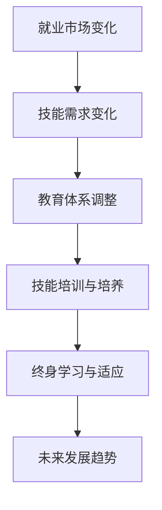

                 

关键词：人工智能、就业市场、技能培训、未来趋势、挑战

摘要：本文旨在探讨AI时代下人类计算的未来就业市场变化、技能需求以及技能培训的发展趋势。通过深入分析，本文总结了当前面临的挑战，并提出了未来研究和实践的方向，旨在为个人、教育机构和企业提供有价值的指导。

## 1. 背景介绍

人工智能（AI）作为计算机科学的一个重要分支，已经在过去的几十年里取得了惊人的进展。从早期的规则系统到深度学习，AI技术逐渐融入到我们生活的方方面面，从智能助手、自动驾驶到医疗诊断，AI的应用场景越来越广泛。

随着AI技术的发展，AI算法的复杂性和计算能力不断提高，这给就业市场带来了深远的影响。一方面，AI技术在提高生产效率、降低成本的同时，也导致了部分传统职位的消失。另一方面，新兴的AI相关职位不断涌现，如数据科学家、机器学习工程师等。这种职位的转变要求劳动力具备更高的技能和知识储备。

与此同时，教育机构和企业在技能培训方面也面临着挑战。如何培养出既具有AI理论基础，又能够实际应用这些技术的专业人才，成为当务之急。因此，本文将围绕AI时代的就业市场变化、技能需求以及技能培训发展趋势进行探讨，以期为相关领域的研究和实践提供参考。

## 2. 核心概念与联系

### 2.1 人工智能与人类计算

人工智能（AI）是指使计算机模拟人类智能行为的技术，包括学习、推理、规划、感知、自然语言理解和问题解决等。而人类计算则是指人类在计算过程中的认知活动和决策过程。

AI与人类计算之间的联系在于，AI技术旨在模拟和增强人类智能，使其能够处理复杂问题，提高工作效率。同时，人类计算的经验和洞察力对于AI算法的优化和改进也至关重要。例如，在机器学习中，数据标注和特征工程往往需要人类的专业知识和判断。

### 2.2 人工智能时代的就业市场

随着AI技术的快速发展，就业市场发生了显著变化。传统的制造业、客服等行业因自动化和智能化技术的应用而面临裁员风险，但同时，新的AI相关职位不断涌现，如数据科学家、机器学习工程师、AI产品经理等。这些职位不仅要求具备深厚的AI理论基础，还需要具备实际项目经验。

此外，AI时代的就业市场也呈现出以下特点：

1. **技能多样性**：AI相关职位不仅涉及技术领域，还涵盖了商业、设计、法律等多个方面。这意味着个人需要具备跨学科的知识和技能。

2. **快速变化**：AI技术更新迭代迅速，导致市场需求和岗位要求不断变化。从业人员需要不断学习和更新知识，以适应新的技术趋势。

3. **高度专业化**：AI领域的专业分工越来越细，从业人员需要具备特定的专业技能，如深度学习、自然语言处理、计算机视觉等。

### 2.3 技能培训与教育体系

为了应对AI时代就业市场的变化，教育机构和企业在技能培训方面做出了相应的调整。传统的教育体系以学科为中心，而AI时代的技能培训更注重跨学科的知识和实际应用能力的培养。

具体来说，教育体系在技能培训方面面临以下挑战：

1. **课程内容更新**：教育机构需要不断更新课程内容，以反映最新的技术发展趋势。

2. **实践机会**：提供更多的实践机会，如实验室、项目实训等，帮助学生将理论知识应用到实际项目中。

3. **终身学习**：鼓励学生和员工树立终身学习的观念，以适应快速变化的市场需求。

### 2.4 Mermaid 流程图

以下是一个简化的 Mermaid 流程图，展示了 AI 时代就业市场的关键环节和流程：



## 3. 核心算法原理 & 具体操作步骤

### 3.1 算法原理概述

在AI时代，核心算法的原理和具体操作步骤至关重要。以下是几个典型的算法原理概述：

1. **深度学习**：深度学习是一种基于多层神经网络的机器学习技术，通过模拟人类大脑的神经网络结构来学习特征和模式。深度学习算法包括卷积神经网络（CNN）、循环神经网络（RNN）等。

2. **强化学习**：强化学习是一种通过试错和奖励机制来训练模型的方法。在强化学习中，智能体通过与环境交互，学习最优策略以实现目标。

3. **自然语言处理**：自然语言处理（NLP）是一种使计算机能够理解和处理人类语言的技术。NLP算法包括词向量、序列模型、注意力机制等。

### 3.2 算法步骤详解

以深度学习为例，以下是深度学习算法的基本步骤：

1. **数据预处理**：对原始数据进行分析和处理，包括数据清洗、数据增强等。

2. **模型构建**：设计并构建神经网络模型，包括输入层、隐藏层和输出层。

3. **模型训练**：使用训练数据对模型进行训练，通过反向传播算法调整模型参数。

4. **模型评估**：使用验证集和测试集对模型进行评估，调整模型参数以优化性能。

5. **模型部署**：将训练好的模型部署到实际应用中，如图像识别、语音识别等。

### 3.3 算法优缺点

1. **优点**：

- **高效性**：深度学习算法在处理大规模数据时具有很高的效率。
- **通用性**：深度学习算法可以应用于多个领域，如计算机视觉、自然语言处理等。
- **灵活性**：深度学习算法可以根据具体任务进行定制化调整。

2. **缺点**：

- **计算资源需求**：深度学习算法需要大量的计算资源，特别是对于复杂的模型和大规模的数据集。
- **数据依赖性**：深度学习算法的性能高度依赖于数据的质量和规模。
- **可解释性**：深度学习算法的黑箱特性使得其结果难以解释，这在某些领域（如医疗诊断）可能会带来挑战。

### 3.4 算法应用领域

深度学习算法在多个领域具有广泛的应用：

1. **计算机视觉**：如图像识别、目标检测、图像生成等。
2. **自然语言处理**：如机器翻译、文本分类、情感分析等。
3. **强化学习**：如游戏AI、自动驾驶、机器人控制等。
4. **语音识别**：如语音助手、语音翻译、语音生成等。

## 4. 数学模型和公式 & 详细讲解 & 举例说明

### 4.1 数学模型构建

在AI领域，数学模型是核心基础。以下是一个简单的数学模型示例，用于描述线性回归：

$$
y = \beta_0 + \beta_1 x
$$

其中，$y$ 是目标变量，$x$ 是输入变量，$\beta_0$ 和 $\beta_1$ 是模型参数。

### 4.2 公式推导过程

线性回归模型的推导过程如下：

1. **假设**：假设目标变量 $y$ 和输入变量 $x$ 之间存在线性关系。
2. **损失函数**：选择平方损失函数作为模型损失，即
   $$
   J(\theta) = \frac{1}{2m} \sum_{i=1}^{m} (h_\theta(x^{(i)}) - y^{(i)})^2
   $$
   其中，$m$ 是样本数量，$h_\theta(x)$ 是模型的预测值。
3. **梯度下降**：通过梯度下降算法来优化模型参数 $\theta$，即
   $$
   \theta_j := \theta_j - \alpha \frac{\partial}{\partial \theta_j} J(\theta)
   $$
   其中，$\alpha$ 是学习率。

### 4.3 案例分析与讲解

假设我们要预测房价，输入变量是房屋面积 $x$。以下是线性回归模型的实际应用：

1. **数据收集**：收集100个房屋样本，包括房屋面积和房价。
2. **数据预处理**：对房屋面积进行归一化处理，以消除不同量纲的影响。
3. **模型训练**：使用线性回归模型对数据集进行训练，得到模型参数 $\beta_0$ 和 $\beta_1$。
4. **模型评估**：使用测试集对模型进行评估，计算模型的预测误差。
5. **模型应用**：使用训练好的模型对新样本进行预测，如预测某房屋面积为150平方米时的房价。

## 5. 项目实践：代码实例和详细解释说明

### 5.1 开发环境搭建

为了实践AI算法，我们需要搭建一个开发环境。以下是具体的操作步骤：

1. **安装Python**：从Python官方网站下载并安装Python 3.x版本。
2. **安装Jupyter Notebook**：使用pip命令安装Jupyter Notebook，即
   ```
   pip install notebook
   ```
3. **安装深度学习库**：安装TensorFlow或PyTorch等深度学习库，例如
   ```
   pip install tensorflow
   ```

### 5.2 源代码详细实现

以下是一个简单的线性回归模型的代码实例：

```python
import numpy as np
import tensorflow as tf

# 数据集
X = np.array([[1], [2], [3], [4], [5]])
y = np.array([2, 4, 5, 4, 5])

# 模型参数
W = tf.Variable(0.0, name='weights')
b = tf.Variable(0.0, name='biases')

# 模型定义
y_pred = W * X + b

# 损失函数
loss = tf.reduce_mean(tf.square(y_pred - y))

# 优化器
optimizer = tf.train.GradientDescentOptimizer(learning_rate=0.5)
train_op = optimizer.minimize(loss)

# 训练模型
with tf.Session() as sess:
  sess.run(tf.global_variables_initializer())
  for step in range(1000):
    _, loss_val = sess.run([train_op, loss])
    if step % 100 == 0:
      print(f"Step {step}: Loss = {loss_val}")

# 预测
X_new = np.array([[6]])
y_new_pred = sess.run(y_pred, feed_dict={X: X_new})
print(f"Predicted value: {y_new_pred}")
```

### 5.3 代码解读与分析

- **数据集**：使用numpy生成一个简单的线性数据集，包括输入变量X和目标变量y。
- **模型参数**：定义权重W和偏置b的Tensor变量。
- **模型定义**：使用TensorFlow定义线性回归模型，即y_pred = W * X + b。
- **损失函数**：使用平方损失函数计算预测值和实际值之间的差异。
- **优化器**：使用梯度下降优化器来优化模型参数。
- **训练模型**：通过运行优化器来训练模型，并在每100个步骤打印损失值。
- **预测**：使用训练好的模型对新输入值进行预测。

## 6. 实际应用场景

在AI时代，人工智能技术的实际应用场景非常广泛。以下是几个典型的应用场景：

1. **医疗诊断**：AI技术在医疗诊断中发挥着重要作用，如利用深度学习进行肺癌筛查、利用强化学习优化治疗方案等。例如，Google的DeepMind团队开发了一种名为DeepMind Health的人工智能系统，用于辅助医生进行癌症诊断。

2. **智能制造**：AI技术被广泛应用于智能制造领域，如通过机器学习优化生产流程、利用计算机视觉进行质量检测、通过机器人自动化生产等。例如，亚马逊的Kiva机器人系统用于仓库自动化管理，大大提高了物流效率。

3. **金融科技**：AI技术在金融科技领域具有广泛的应用，如利用机器学习进行风险评估、利用计算机视觉进行欺诈检测、利用自然语言处理进行智能客服等。例如，PayPal利用AI技术进行交易风险管理和反欺诈。

4. **自动驾驶**：自动驾驶是AI技术的另一重要应用领域。通过深度学习和计算机视觉技术，自动驾驶系统可以实时感知环境、做出驾驶决策。例如，特斯拉的Autopilot系统实现了部分自动驾驶功能，如自动车道保持、自动泊车等。

5. **智能家居**：智能家居系统通过AI技术实现了更智能化的家居管理，如通过语音识别控制家电、通过计算机视觉进行家庭安全监控等。例如，谷歌的Google Home智能音箱可以通过语音指令控制智能家居设备。

6. **教育领域**：AI技术在教育领域也得到了广泛应用，如通过自适应学习系统为每个学生提供个性化教学、通过自然语言处理技术进行教育内容生成等。例如，Coursera等在线教育平台利用AI技术优化学习体验。

## 7. 未来应用展望

随着AI技术的不断进步，未来的应用前景将更加广阔。以下是几个未来应用展望：

1. **智能化城市管理**：通过AI技术，可以实现智能化的城市管理，如交通流量预测、公共资源优化、环境监测等。这将有助于提高城市运营效率，改善居民生活质量。

2. **个性化医疗**：AI技术将推动个性化医疗的发展，如通过基因组学数据分析进行精准诊断、通过医疗图像分析进行早期疾病检测等。这将有助于提高医疗水平，降低医疗成本。

3. **无人经济**：随着自动驾驶、无人机、机器人等技术的成熟，无人经济将得到快速发展。无人经济包括无人驾驶出租车、无人配送、无人机物流等，将大大提高物流效率，降低运输成本。

4. **智能农业**：AI技术在农业领域的应用将有助于提高农业生产效率，如通过无人机进行农田监测、利用机器学习进行病虫害预测等。这将有助于解决全球粮食安全问题。

5. **智慧教育**：AI技术将推动智慧教育的发展，如通过虚拟现实技术进行沉浸式学习、利用自然语言处理技术进行智能问答等。这将有助于提高教育质量和学习效率。

## 8. 工具和资源推荐

为了更好地学习和应用AI技术，以下是一些推荐的工具和资源：

1. **学习资源推荐**：

- Coursera、edX、Udacity等在线课程平台，提供丰富的AI课程。
- ArXiv、ACL、ICML等学术会议和期刊，了解最新的研究成果。
- Kaggle、Keras、PyTorch等开源框架和工具，便于实践和项目开发。

2. **开发工具推荐**：

- TensorFlow、PyTorch等深度学习框架，用于构建和训练模型。
- Jupyter Notebook、Google Colab等在线编程环境，方便开发和调试。
- Docker、Kubernetes等容器化工具，用于管理和部署模型。

3. **相关论文推荐**：

- "Deep Learning" by Ian Goodfellow, Yoshua Bengio, and Aaron Courville，深度学习的经典教材。
- "Reinforcement Learning: An Introduction" by Richard S. Sutton and Andrew G. Barto，强化学习的入门教材。
- "Speech and Language Processing" by Daniel Jurafsky and James H. Martin，自然语言处理的经典教材。

## 9. 总结：未来发展趋势与挑战

在AI时代，人类计算面临前所未有的机遇和挑战。以下是未来发展趋势与挑战的总结：

### 9.1 研究成果总结

- **算法创新**：深度学习、强化学习等算法不断创新，推动了AI技术的快速发展。
- **应用拓展**：AI技术在医疗、金融、教育等领域的应用越来越广泛，推动了各行业的技术创新。
- **开源生态**：随着Keras、PyTorch等开源框架的兴起，AI开发变得更加便捷和高效。

### 9.2 未来发展趋势

- **智能化社会**：AI技术将在更多领域得到应用，推动社会向智能化方向发展。
- **个性化服务**：AI技术将使服务更加个性化，满足用户的个性化需求。
- **产业升级**：AI技术将推动产业升级，提高生产效率和产品质量。

### 9.3 面临的挑战

- **数据隐私**：AI技术的发展带来了数据隐私问题，如何保护用户隐私成为重要挑战。
- **伦理问题**：AI技术的应用引发了伦理问题，如算法歧视、隐私泄露等，需要制定相应的法律法规。
- **技能差距**：随着AI技术的发展，技能需求不断变化，如何缩小技能差距成为教育机构和企业的重要任务。

### 9.4 研究展望

未来，人类计算在AI时代的发展将继续深入。以下是几个研究展望：

- **跨学科融合**：AI技术与其他学科的融合将带来更多创新，如生物学、心理学等。
- **脑机接口**：脑机接口技术的发展有望实现人机交互的进一步提升。
- **量子计算**：量子计算的结合有望推动AI技术实现新的突破。

总之，AI时代的到来将深刻改变人类计算的方式，为人类带来更多机遇和挑战。只有不断学习和适应，才能在这个新时代中立于不败之地。

## 10. 附录：常见问题与解答

### 问题1：如何入门AI技术？

解答：入门AI技术可以从以下几个步骤开始：

1. **基础知识**：首先，掌握Python编程语言，这是AI开发的基本工具。
2. **数学基础**：学习线性代数、概率论、统计学等数学知识，这些是理解和应用AI算法的基础。
3. **在线课程**：参加Coursera、edX等平台上的AI课程，系统地学习AI的基础理论和实践技能。
4. **实践项目**：通过GitHub等平台寻找开源项目，进行实际操作，锻炼编程能力和解决问题的能力。

### 问题2：深度学习和机器学习有什么区别？

解答：深度学习和机器学习是两个相关的领域，但它们有一些区别：

- **深度学习**：深度学习是机器学习的一个子领域，主要关注通过多层神经网络进行特征学习和模式识别。深度学习算法通常需要大量的数据和计算资源。
- **机器学习**：机器学习是一个更广泛的领域，包括深度学习以外的其他算法和技术，如决策树、支持向量机、聚类算法等。机器学习关注的是如何从数据中学习规律，并应用于实际问题。

### 问题3：AI技术如何影响医疗行业？

解答：AI技术在医疗行业的应用非常广泛，具体影响包括：

- **疾病诊断**：通过深度学习和计算机视觉技术，AI可以帮助医生更快速、准确地诊断疾病，如肺癌、心脏病等。
- **个性化治疗**：AI可以根据患者的基因信息、病史等数据，为其提供个性化的治疗方案。
- **医疗资源优化**：通过分析大数据，AI可以帮助医院优化资源配置，提高医疗服务效率。
- **医学研究**：AI技术可以加速医学研究，如通过分析大量医学文献，发现新的治疗方法和药物。

### 问题4：AI技术会取代人类吗？

解答：目前来看，AI技术还不能完全取代人类，但它在很多领域可以辅助人类工作。以下是一些观点：

- **辅助工作**：AI可以在某些任务上辅助人类，如数据分析、预测等，从而提高工作效率。
- **创造新工作**：AI的发展也会创造出新的工作机会，如AI算法工程师、AI产品经理等。
- **伦理和社会问题**：虽然AI不能完全取代人类，但它的广泛应用引发了伦理和社会问题，如就业、隐私等。

### 问题5：如何成为一名数据科学家？

解答：要成为一名数据科学家，可以从以下几个方面入手：

1. **掌握编程技能**：熟练掌握Python、R等编程语言，这是数据科学的基础。
2. **数学和统计学知识**：学习线性代数、概率论、统计学等数学知识，这是数据分析的重要工具。
3. **学习数据分析工具**：掌握如Pandas、NumPy、Matplotlib等数据分析工具，用于处理和分析数据。
4. **实践项目**：参与实际项目，锻炼数据处理和分析能力。
5. **持续学习**：数据科学是一个快速发展的领域，要不断学习新的技术和方法。

### 问题6：AI技术如何影响教育行业？

解答：AI技术在教育行业的应用正日益增多，具体影响包括：

- **个性化教学**：AI可以通过数据分析为学生提供个性化的学习建议和资源。
- **智能评估**：AI可以帮助教师自动评估学生的作业和考试成绩，提高评估效率。
- **在线学习**：AI技术推动了在线教育的普及，为学生提供了更多的学习机会。
- **教育研究**：AI技术可以用于教育研究，如分析学生的学习行为，优化教育方法。

### 问题7：AI技术在自动化方面有哪些应用？

解答：AI技术在自动化方面有广泛的应用，具体包括：

- **自动化生产**：AI可以帮助企业实现生产过程的自动化，如通过机器人自动化生产线。
- **自动化客服**：AI可以通过聊天机器人、语音识别等技术实现自动化客户服务。
- **自动化物流**：AI技术可以用于物流优化，如通过自动驾驶卡车、无人机配送等。
- **自动化金融**：AI可以用于自动化金融交易、风险评估等。

### 问题8：如何确保AI系统的公平性和透明性？

解答：确保AI系统的公平性和透明性是当前AI研究的一个重要方向，以下是一些措施：

- **算法公平性**：在算法设计过程中，确保算法不会对特定群体产生偏见。
- **透明性**：通过可视化和解释技术，使AI系统的决策过程更加透明，方便用户理解和监督。
- **数据多样性**：确保训练数据集的多样性，避免算法在特定人群上的表现不佳。
- **法律法规**：制定相应的法律法规，规范AI系统的开发和应用。

### 问题9：AI技术如何影响能源行业？

解答：AI技术在能源行业有广泛的应用，具体影响包括：

- **能源优化**：AI可以帮助能源企业优化能源使用，提高能源利用效率。
- **智能电网**：AI技术可以用于智能电网的管理，提高电网的稳定性和可靠性。
- **可再生能源管理**：AI技术可以用于可再生能源的预测和管理，提高其利用效率。
- **能源交易**：AI技术可以用于能源市场的分析和预测，优化能源交易策略。

### 问题10：如何确保AI系统的安全性和可靠性？

解答：确保AI系统的安全性和可靠性是AI技术应用的重要保障，以下是一些措施：

- **安全测试**：在AI系统开发过程中，进行严格的安全测试，确保系统不会受到恶意攻击。
- **数据安全**：保护AI系统的训练数据和输入数据，防止数据泄露和滥用。
- **故障恢复**：设计AI系统的故障恢复机制，确保系统在出现故障时能够迅速恢复。
- **合规性**：遵守相关法律法规，确保AI系统的开发和应用符合法律法规要求。

通过这些常见问题的解答，我们可以更好地理解AI技术在各个领域的影响和应用。随着AI技术的不断进步，我们期待它在未来的发展中能够带来更多的创新和变革。

