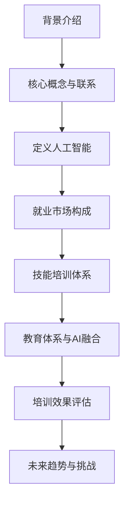

                 

关键词：人工智能，就业市场，技能培训，发展趋势，机遇

摘要：本文旨在探讨人工智能（AI）时代下，未来就业市场的发展趋势以及与之相关的技能培训需求。通过对当前AI技术的广泛应用和其对各行各业的影响进行分析，我们总结了未来就业市场对人才的需求变化，探讨了现有技能培训体系与未来需求的契合度，并提出了应对未来挑战的策略。

## 1. 背景介绍

### AI时代的发展现状

随着深度学习、自然语言处理、计算机视觉等AI技术的迅猛发展，人工智能已经逐渐渗透到各行各业，改变了传统的生产方式和服务模式。从自动驾驶汽车到智能客服系统，从精准医疗诊断到个性化教育，AI技术的应用正在不断扩展，为社会带来了前所未有的机遇和挑战。

### 就业市场变化

AI技术的发展不仅推动了新兴产业的崛起，也对传统就业市场产生了深远影响。一方面，许多传统职业面临被AI技术取代的风险；另一方面，新兴职业的出现也为求职者提供了新的机会。因此，如何适应这一变化，掌握与AI相关的技能，成为当今就业市场的关键问题。

### 技能培训需求

为了应对AI时代带来的就业市场变革，技能培训成为了社会和个人关注的焦点。然而，现有的技能培训体系是否能够满足未来的需求，还有待进一步探讨。

## 2. 核心概念与联系

### 人工智能的定义

人工智能是指使计算机系统能够模拟、延伸和扩展人类的智能行为，包括学习、推理、感知、理解、问题解决和决策等方面。

### 就业市场的构成

就业市场由各种职业岗位组成，包括传统的制造业、服务业、IT行业，以及新兴的AI相关行业。不同职业岗位对技能的需求差异较大，需要针对性地进行培训。

### 技能培训的体系

技能培训体系包括基础教育、职业教育和继续教育等多个层次，旨在培养和提升求职者的职业技能。

### Mermaid 流程图



## 3. 核心算法原理 & 具体操作步骤

### 3.1 算法原理概述

在AI领域中，核心算法主要包括机器学习算法、深度学习算法和强化学习算法等。这些算法通过模拟人类学习过程，使计算机能够从数据中学习规律，进行预测和决策。

### 3.2 算法步骤详解

1. 数据收集与预处理：收集相关领域的数据，并进行清洗、归一化等预处理操作，以提高数据质量。
2. 特征提取与选择：从预处理后的数据中提取有助于模型学习的特征，并选择最具代表性的特征。
3. 模型训练与优化：使用选定的算法对数据进行训练，并不断调整模型参数，以获得最佳性能。
4. 模型评估与部署：评估训练好的模型在未知数据上的表现，并在实际应用中进行部署。

### 3.3 算法优缺点

- 机器学习算法：具有自学习能力，可以处理大量数据，但可能难以解释模型的决策过程。
- 深度学习算法：具有较强的表现力，可以处理复杂的任务，但需要大量数据和高性能计算资源。
- 强化学习算法：适用于需要决策的任务，但训练过程可能较慢，且对环境有较高要求。

### 3.4 算法应用领域

- 机器学习算法：广泛应用于金融风控、自然语言处理、计算机视觉等领域。
- 深度学习算法：广泛应用于图像识别、语音识别、自动驾驶等领域。
- 强化学习算法：广泛应用于游戏、推荐系统、智能决策等领域。

## 4. 数学模型和公式 & 详细讲解 & 举例说明

### 4.1 数学模型构建

在机器学习算法中，常见的数学模型包括线性回归、逻辑回归、支持向量机等。这些模型通过构建数学公式，将输入数据映射到输出结果。

### 4.2 公式推导过程

以线性回归为例，其公式为：y = wx + b，其中y为输出结果，x为输入特征，w为权重，b为偏置。

### 4.3 案例分析与讲解

假设我们有一个简单的线性回归模型，目标是预测房价。我们可以通过收集一些房屋的数据，如面积、地段、楼层等，来训练这个模型。经过训练后，模型可以计算出每个房屋的预测价格。

## 5. 项目实践：代码实例和详细解释说明

### 5.1 开发环境搭建

为了实践线性回归模型，我们需要安装Python和相关的机器学习库，如scikit-learn。

### 5.2 源代码详细实现

以下是一个简单的线性回归模型实现的代码：

```python
from sklearn.linear_model import LinearRegression
from sklearn.model_selection import train_test_split
from sklearn.metrics import mean_squared_error

# 加载数据
X, y = load_data()

# 数据划分
X_train, X_test, y_train, y_test = train_test_split(X, y, test_size=0.2, random_state=42)

# 创建模型
model = LinearRegression()

# 训练模型
model.fit(X_train, y_train)

# 预测结果
y_pred = model.predict(X_test)

# 评估模型
mse = mean_squared_error(y_test, y_pred)
print("均方误差：", mse)
```

### 5.3 代码解读与分析

这段代码首先加载了训练数据，然后将其划分为训练集和测试集。接着，创建了一个线性回归模型，并使用训练集进行训练。最后，使用测试集评估模型的性能。

### 5.4 运行结果展示

运行代码后，我们可以得到模型在测试集上的均方误差。通过调整模型参数和特征选择，可以进一步提高模型的性能。

## 6. 实际应用场景

### 6.1 金融领域

在金融领域，人工智能技术被广泛应用于风险管理、量化交易、智能投顾等方面。例如，通过机器学习算法对大量金融数据进行分析，可以预测市场走势，为投资者提供参考。

### 6.2 医疗领域

在医疗领域，人工智能技术被广泛应用于疾病诊断、药物研发、健康管理等环节。通过深度学习算法，可以对医疗影像进行自动分析，提高诊断的准确性。

### 6.3 教育领域

在教育领域，人工智能技术被广泛应用于个性化学习、智能评价、教育资源共享等方面。通过智能推荐系统，可以为学习者提供个性化的学习资源，提高学习效果。

### 6.4 未来应用展望

随着人工智能技术的不断进步，未来它将在更多领域发挥重要作用。例如，在智能制造领域，人工智能技术可以帮助企业实现自动化生产，提高生产效率；在能源领域，人工智能技术可以帮助实现智能电网，提高能源利用效率。

## 7. 工具和资源推荐

### 7.1 学习资源推荐

- 《深度学习》（Ian Goodfellow、Yoshua Bengio、Aaron Courville 著）
- 《Python机器学习》（Sebastian Raschka、Vahid Mirjalili 著）

### 7.2 开发工具推荐

- Jupyter Notebook：一款强大的交互式开发环境，适用于数据分析和机器学习项目。
- PyTorch：一款流行的深度学习框架，适用于快速原型开发和模型训练。

### 7.3 相关论文推荐

- “Deep Learning” by Ian Goodfellow, Yoshua Bengio, Aaron Courville
- “A Theoretical Analysis of the Voted Perceptron” by Yirong Chen, Shai Shalev-Shwartz, and Adamcohen

## 8. 总结：未来发展趋势与挑战

### 8.1 研究成果总结

人工智能技术的发展已经取得了显著成果，不仅在理论研究方面取得了突破，也在实际应用中发挥了重要作用。未来，人工智能技术将在更多领域得到应用，为社会带来更多价值。

### 8.2 未来发展趋势

未来，人工智能技术将继续向深度化、泛在化、智能化方向发展。同时，随着5G、物联网等技术的普及，人工智能的应用场景将更加广泛，产业链将更加完善。

### 8.3 面临的挑战

人工智能技术的发展也面临诸多挑战，包括数据隐私、伦理问题、法律法规等方面。如何解决这些问题，是未来人工智能发展的重要课题。

### 8.4 研究展望

未来，人工智能研究将更加注重跨学科的融合，如计算机科学、数学、心理学等。同时，随着技术的进步，人工智能将更好地服务于人类社会，推动社会进步。

## 9. 附录：常见问题与解答

### 问题1：人工智能是否会取代人类？

解答：人工智能技术的发展确实在一定程度上改变了人类的工作方式，但并不意味着会完全取代人类。人工智能更擅长于处理结构化数据和高重复性任务，而人类则更擅长于创造性、决策性任务。人工智能和人类将相互补充，共同推动社会发展。

### 问题2：如何掌握与人工智能相关的技能？

解答：要掌握与人工智能相关的技能，可以从以下几个方面入手：

1. 学习编程语言：Python、Java等是常用的编程语言，适合初学者入门。
2. 学习机器学习算法：掌握常见的机器学习算法，如线性回归、决策树、支持向量机等。
3. 实践项目：通过实际项目来提高自己的能力，积累经验。
4. 学习相关论文和书籍：深入了解人工智能领域的最新研究成果。

### 问题3：人工智能技术的发展对就业市场有哪些影响？

解答：人工智能技术的发展对就业市场产生了深远影响。一方面，它创造了新的就业机会，如AI研究员、数据科学家等；另一方面，它也可能取代某些传统职业，如制造业工人、客服人员等。因此，个人需要不断学习和适应新技术，以应对就业市场的变化。

### 问题4：如何应对人工智能带来的挑战？

解答：应对人工智能带来的挑战，可以从以下几个方面入手：

1. 加强法律法规建设：明确人工智能的发展方向和应用范围，规范行业发展。
2. 提高教育水平：加强人工智能相关学科的教育，培养更多专业人才。
3. 转型升级：对于受人工智能影响的行业和企业，应积极转型升级，降低对人工的依赖。
4. 推动社会共识：加强社会对人工智能的认识和了解，形成共同应对挑战的合力。

### 问题5：人工智能是否会带来失业潮？

解答：虽然人工智能技术确实在一定程度上替代了某些传统职业，但它同时也创造了新的就业机会。因此，人工智能发展是否会导致失业潮，取决于个人的适应能力和整个社会的应对策略。通过加强教育和培训，提高劳动力市场的灵活性，可以有效降低失业风险。

作者：禅与计算机程序设计艺术 / Zen and the Art of Computer Programming
----------------------------------------------------------------

