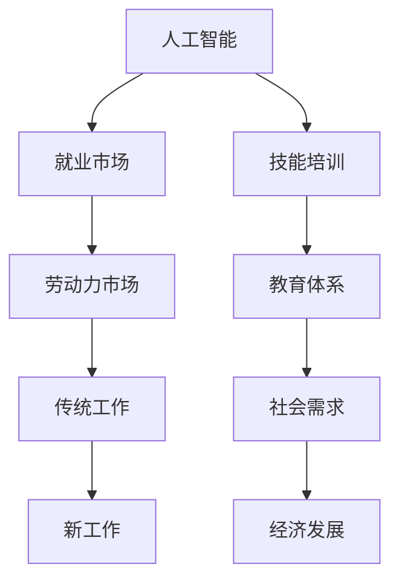

                 

关键词：人工智能，就业市场，技能培训，未来发展，挑战

> 摘要：本文旨在探讨人工智能时代下，人类计算领域面临的未来就业市场变化、技能培训发展趋势以及相应的挑战。通过分析人工智能技术的迅速发展，我们将深入探讨其对就业市场的影响，分析现有技能培训的不足，并提出解决这些挑战的路径。

## 1. 背景介绍

随着人工智能技术的不断进步，计算机已经能够在许多任务上超越人类的能力。然而，这种技术进步也带来了许多挑战，特别是在就业市场方面。传统的劳动力市场正在经历一场革命，许多工作可能会被自动化技术取代，而新的工作机会也会随之产生。因此，理解人工智能对就业市场的影响，以及如何调整我们的技能培训体系，成为当前亟待解决的问题。

### 1.1 人工智能的崛起

人工智能（AI）是一种模拟人类智能的计算机技术。它通过机器学习、深度学习、自然语言处理等技术，使计算机能够执行复杂的任务，如语音识别、图像识别、决策制定等。近年来，随着大数据、云计算等技术的快速发展，人工智能取得了显著的进展。

### 1.2 就业市场变化

人工智能的崛起对就业市场产生了深远的影响。一方面，它可能取代一些传统的工作岗位，如制造业、客服等。另一方面，它也会创造新的工作机会，如数据科学家、AI工程师等。然而，这些新工作的技能要求与传统工作大相径庭，使得许多人在面对技术变革时感到无所适从。

## 2. 核心概念与联系

为了更好地理解人工智能对就业市场的影响，我们需要了解一些核心概念和它们之间的关系。以下是使用Mermaid绘制的流程图：



### 2.1 人工智能与就业市场

人工智能的崛起对就业市场的影响主要体现在两个方面：取代传统工作和新工作机会的创造。随着人工智能技术的不断发展，许多传统工作，如制造业、客服等，可能会被自动化技术取代。然而，这并不意味着人类将完全失业。相反，人工智能将创造新的工作机会，如数据科学家、AI工程师等，这些工作需要更高层次的技能和知识。

### 2.2 技能培训与教育体系

技能培训是应对人工智能时代就业市场变化的关键。然而，当前的教育体系往往难以满足这一需求。传统教育体系注重理论知识的传授，而忽视了实践技能的培养。因此，我们需要重新设计教育体系，使之更加注重实践和创新能力的培养。

### 2.3 社会需求与经济发展

人工智能的崛起不仅影响就业市场，也对社会需求和经济产生了深远的影响。随着人工智能技术的普及，人们对于更高层次技能的需求将不断增加。同时，人工智能也将推动经济的发展，创造新的产业和就业机会。

## 3. 核心算法原理 & 具体操作步骤

为了应对人工智能时代的挑战，我们需要掌握一些核心算法原理和具体操作步骤。以下是关于机器学习算法的简要介绍：

### 3.1 算法原理概述

机器学习是一种通过数据学习规律和模式的技术。它分为监督学习、无监督学习和强化学习三种类型。监督学习通过已知数据的标签来训练模型，无监督学习则通过未标记的数据来发现规律，而强化学习则是通过不断尝试和反馈来优化决策。

### 3.2 算法步骤详解

以下是机器学习算法的基本步骤：

1. 数据预处理：包括数据清洗、归一化、特征提取等。
2. 模型选择：根据问题的性质选择合适的模型，如线性回归、决策树、神经网络等。
3. 模型训练：使用训练数据来训练模型，调整模型参数。
4. 模型评估：使用测试数据来评估模型性能，调整模型参数。
5. 模型应用：使用训练好的模型来预测新数据。

### 3.3 算法优缺点

机器学习算法的优点在于其强大的建模能力和适应性。它可以在大量数据中发现复杂的模式和关系，从而实现高性能的预测和决策。然而，机器学习算法也存在一些缺点，如对数据质量和数量的高度依赖，以及模型的复杂性和计算成本。

### 3.4 算法应用领域

机器学习算法广泛应用于各个领域，如金融、医疗、制造业、零售等。在金融领域，它可以用于风险管理和信用评分；在医疗领域，它可以用于疾病诊断和个性化治疗；在制造业，它可以用于质量控制和生产优化；在零售领域，它可以用于商品推荐和客户关系管理。

## 4. 数学模型和公式 & 详细讲解 & 举例说明

在机器学习算法中，数学模型和公式起着至关重要的作用。以下是一些常用的数学模型和公式：

### 4.1 数学模型构建

在机器学习算法中，常用的数学模型包括线性回归、逻辑回归、决策树、神经网络等。以下是一个简单的线性回归模型：

$$
y = \beta_0 + \beta_1 \cdot x
$$

其中，$y$ 是因变量，$x$ 是自变量，$\beta_0$ 和 $\beta_1$ 是模型的参数。

### 4.2 公式推导过程

线性回归模型的推导过程如下：

1. 假设数据集为 $D = \{(x_1, y_1), (x_2, y_2), \ldots, (x_n, y_n)\}$。
2. 定义损失函数为：
$$
L(\beta_0, \beta_1) = \frac{1}{2} \sum_{i=1}^n (y_i - (\beta_0 + \beta_1 \cdot x_i))^2
$$
3. 对损失函数求导，得到：
$$
\frac{\partial L}{\partial \beta_0} = -\sum_{i=1}^n (y_i - (\beta_0 + \beta_1 \cdot x_i))
$$
$$
\frac{\partial L}{\partial \beta_1} = -\sum_{i=1}^n (x_i \cdot (y_i - (\beta_0 + \beta_1 \cdot x_i)))
$$
4. 令导数为零，解得模型参数 $\beta_0$ 和 $\beta_1$。

### 4.3 案例分析与讲解

以下是一个简单的线性回归案例：

假设我们有一个数据集，包含 $n=100$ 个样本，每个样本包括自变量 $x$ 和因变量 $y$。我们希望通过线性回归模型预测 $y$。

首先，我们需要计算样本的平均值：

$$
\bar{x} = \frac{1}{n} \sum_{i=1}^n x_i
$$
$$
\bar{y} = \frac{1}{n} \sum_{i=1}^n y_i
$$

然后，我们可以计算模型参数：

$$
\beta_0 = \bar{y} - \beta_1 \cdot \bar{x}
$$

假设我们通过计算得到的参数为 $\beta_0 = 1$ 和 $\beta_1 = 2$。则线性回归模型为：

$$
y = 1 + 2 \cdot x
$$

接下来，我们可以使用这个模型来预测新样本的 $y$ 值。例如，当 $x=5$ 时，预测的 $y$ 值为：

$$
y = 1 + 2 \cdot 5 = 11
$$

## 5. 项目实践：代码实例和详细解释说明

为了更好地理解机器学习算法的应用，我们将通过一个简单的线性回归项目来实践。以下是项目的详细步骤：

### 5.1 开发环境搭建

1. 安装 Python 解释器。
2. 安装机器学习库，如 Scikit-learn。

### 5.2 源代码详细实现

```python
# 导入所需的库
import numpy as np
from sklearn.linear_model import LinearRegression

# 生成数据集
n = 100
x = np.random.rand(n, 1) * 10
y = 1 + 2 * x + np.random.randn(n, 1) * 1

# 划分训练集和测试集
x_train, x_test = x[:80], x[80:]
y_train, y_test = y[:80], y[80:]

# 创建线性回归模型并训练
model = LinearRegression()
model.fit(x_train, y_train)

# 使用训练好的模型进行预测
y_pred = model.predict(x_test)

# 评估模型性能
print("Mean squared error:", np.mean((y_pred - y_test) ** 2))
```

### 5.3 代码解读与分析

1. 导入所需的库：包括 NumPy 用于数据操作，Scikit-learn 用于线性回归模型。
2. 生成数据集：生成包含 $n=100$ 个样本的数据集，每个样本包括自变量 $x$ 和因变量 $y$。
3. 划分训练集和测试集：将数据集划分为训练集和测试集，以评估模型性能。
4. 创建线性回归模型并训练：使用 Scikit-learn 的 LinearRegression 类创建线性回归模型，并使用训练集数据进行训练。
5. 使用训练好的模型进行预测：使用训练好的模型对测试集数据进行预测。
6. 评估模型性能：计算预测误差的均方误差（Mean Squared Error），以评估模型性能。

## 6. 实际应用场景

机器学习算法在实际应用中具有广泛的应用场景，以下是一些常见的应用：

1. **金融领域**：机器学习算法可以用于风险管理和信用评分，如预测客户的信用风险，从而为金融机构提供决策支持。
2. **医疗领域**：机器学习算法可以用于疾病诊断和个性化治疗，如通过分析患者的医疗记录和基因数据，预测疾病风险。
3. **制造业**：机器学习算法可以用于质量控制和生产优化，如通过分析生产数据，预测产品故障并优化生产过程。
4. **零售领域**：机器学习算法可以用于商品推荐和客户关系管理，如通过分析客户购买历史和偏好，推荐合适的商品。

## 7. 未来应用展望

随着人工智能技术的不断发展，机器学习算法的应用前景将更加广阔。以下是一些未来应用展望：

1. **智能交通**：通过机器学习算法优化交通流量管理，提高道路通行效率，减少交通事故。
2. **智能城市**：通过机器学习算法监测和管理城市资源，如水、电、气等，实现城市资源的优化配置。
3. **环境保护**：通过机器学习算法监测环境变化，预测自然灾害，如洪水、地震等，从而提前采取措施。
4. **个性化教育**：通过机器学习算法分析学生的学习数据，为每个学生提供个性化的学习计划。

## 8. 工具和资源推荐

为了更好地学习和应用机器学习算法，以下是一些推荐的工具和资源：

1. **学习资源**：
   - 《机器学习》（周志华著）：一本经典的机器学习教材，适合初学者。
   - 《深度学习》（Ian Goodfellow 等著）：一本关于深度学习的权威教材。

2. **开发工具**：
   - Jupyter Notebook：一种交互式计算环境，适合编写和运行机器学习代码。
   - TensorFlow：一款开源的机器学习框架，支持深度学习和传统机器学习算法。

3. **相关论文**：
   - “Deep Learning”（Yoshua Bengio 等著）：一篇关于深度学习的综述论文。
   - “The Unreasonable Effectiveness of Data”（Jack Clark 等著）：一篇探讨数据在机器学习中的作用的论文。

## 9. 总结：未来发展趋势与挑战

随着人工智能技术的不断发展，机器学习算法在各个领域的应用将越来越广泛。然而，这也带来了许多挑战，如数据隐私、算法公平性、安全性等。因此，我们需要不断探索和解决这些挑战，以实现人工智能技术的可持续发展。

### 9.1 研究成果总结

近年来，机器学习领域取得了许多重要研究成果，如深度学习、迁移学习、生成对抗网络等。这些成果不仅推动了人工智能技术的发展，也为实际应用提供了强大的支持。

### 9.2 未来发展趋势

未来，机器学习算法将继续朝着更高层次、更广泛应用的方向发展。同时，我们将看到更多的跨学科研究和合作，如机器学习与生物学、物理学、经济学等领域的交叉应用。

### 9.3 面临的挑战

尽管机器学习算法取得了显著进展，但仍然面临许多挑战，如算法透明性、可解释性、数据隐私等。因此，我们需要继续努力，解决这些挑战，推动人工智能技术的可持续发展。

### 9.4 研究展望

未来，机器学习算法的研究将继续深入，涉及更多的领域和问题。同时，我们也将看到更多的创新和突破，如新型算法、优化方法、应用场景等。

## 10. 附录：常见问题与解答

### 10.1 机器学习算法有哪些类型？

机器学习算法主要分为监督学习、无监督学习和强化学习三种类型。

### 10.2 机器学习算法有哪些优点？

机器学习算法的优点包括：
- 强大的建模能力：可以处理复杂的数据和任务。
- 高效的预测能力：可以快速地处理大量数据并给出预测结果。
- 自适应能力：可以根据新的数据不断优化模型。

### 10.3 机器学习算法有哪些缺点？

机器学习算法的缺点包括：
- 对数据质量和数量的高度依赖：数据的质量和数量直接影响算法的性能。
- 复杂性和计算成本：一些复杂的算法需要大量的计算资源和时间。
- 算法透明性：一些算法的决策过程可能不够透明，难以解释。

### 10.4 如何解决机器学习算法的挑战？

为了解决机器学习算法的挑战，我们可以采取以下措施：
- 提高数据质量和数量：确保数据的质量和数量，以提高算法的性能。
- 研究新型算法：开发更高效、更透明的算法，降低计算成本。
- 加强跨学科研究：结合其他领域的知识，探索新的应用场景和解决方案。

### 10.5 机器学习算法在哪些领域有广泛的应用？

机器学习算法在金融、医疗、制造业、零售、交通等众多领域有广泛的应用，如风险管理和信用评分、疾病诊断和个性化治疗、质量控制和生产优化、商品推荐和客户关系管理。

### 10.6 如何入门机器学习？

入门机器学习可以从以下几个方面入手：
- 学习基础知识：了解概率论、线性代数、微积分等数学基础。
- 学习机器学习理论：了解监督学习、无监督学习和强化学习等基本概念和算法。
- 实践项目：通过实践项目来应用所学知识，提高实际操作能力。
- 学习资源：阅读相关书籍、观看在线课程、参加学术会议等。

---

作者：禅与计算机程序设计艺术 / Zen and the Art of Computer Programming

