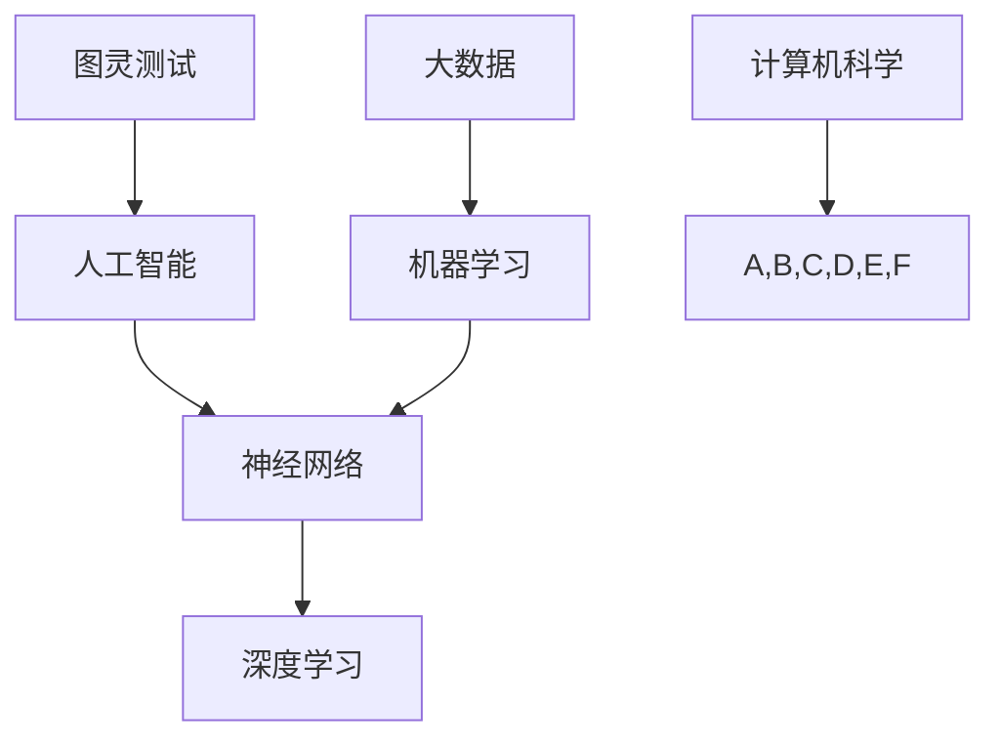

                 

在人工智能（AI）迅猛发展的时代，人类计算面临着前所未有的机遇与挑战。本文将深入探讨AI时代的未来就业市场变化、技能培训发展趋势，以及这些变化对个人和社会的影响。通过详细分析，我们旨在为读者提供有价值的洞察，帮助人们更好地适应和利用这一变革。

## 文章关键词

- 人工智能
- 未来就业市场
- 技能培训
- 发展趋势
- 挑战

## 文章摘要

本文首先介绍了AI时代的背景，探讨了其对就业市场的影响。接着，分析了AI时代技能培训的发展趋势，包括新兴技能的涌现和传统技能的更新。随后，文章通过具体案例展示了如何通过教育和培训应对这些变化。最后，文章提出了未来发展趋势及面临的挑战，为读者提供了方向和建议。

### 1. 背景介绍

人工智能（AI）技术的发展已经经历了数个阶段，从早期的符号逻辑和规则推理，到近年来的深度学习和强化学习，AI在各个领域的应用越来越广泛。这不仅改变了人们的日常生活，也对就业市场产生了深远的影响。

#### 1.1 AI对就业市场的影响

AI技术的普及和应用正在改变传统的就业结构。一方面，AI能够自动化许多重复性、规律性强的任务，从而减少了对一些低技能岗位的需求。例如，制造业、客服和数据分析等领域已经开始采用自动化系统，减少了人工的需求。

另一方面，AI也创造了许多新的就业机会。例如，数据科学家、机器学习工程师、AI产品经理等专业岗位的需求不断增长。此外，AI还推动了新的行业的发展，如自动驾驶、智能家居和医疗诊断等，这些领域需要大量具备跨学科知识和技能的专业人才。

#### 1.2 技能培训的挑战与机遇

随着AI技术的不断发展，传统的教育和培训体系面临着巨大的挑战。一方面，许多传统技能正在被AI所取代，如编程、数据分析和市场营销等。另一方面，新兴的AI相关技能，如自然语言处理、计算机视觉和深度学习等，成为了职场中的热门技能。

因此，如何适应这些变化，进行有效的技能培训，成为了一个重要议题。一方面，教育机构需要更新课程内容，将AI相关的知识纳入到教学体系中。另一方面，企业和个人也需要不断提升自身技能，以适应不断变化的就业市场。

### 2. 核心概念与联系

为了更好地理解AI时代的就业市场变化，我们需要了解一些核心概念，如图灵测试、神经网络和深度学习等。以下是一个简化的Mermaid流程图，展示了这些概念之间的关系。



图灵测试是衡量机器智能程度的一种标准，它要求机器能够以假乱真地模拟人类行为。神经网络和深度学习是机器学习的重要工具，它们通过模拟人脑的结构和功能，实现对数据的处理和分析。大数据则为这些算法提供了丰富的训练素材。

### 3. 核心算法原理 & 具体操作步骤

#### 3.1 算法原理概述

在AI时代，许多核心算法都基于机器学习和深度学习。以下是几个常见的算法及其原理：

- **监督学习（Supervised Learning）**：通过已标记的数据集训练模型，使其能够对未知数据进行预测。常见的算法有线性回归、决策树和随机森林等。
- **无监督学习（Unsupervised Learning）**：没有已标记的数据集，算法需要从数据中自动发现模式。常见的算法有聚类、降维和关联规则学习等。
- **强化学习（Reinforcement Learning）**：通过与环境的交互来学习最优策略。常见的算法有Q-学习、深度Q网络（DQN）和策略梯度等。

#### 3.2 算法步骤详解

以下是监督学习算法的一个基本步骤：

1. **数据预处理**：对数据进行清洗、归一化和特征提取。
2. **模型选择**：根据问题的性质选择合适的模型。
3. **模型训练**：使用训练数据集训练模型，调整模型参数。
4. **模型评估**：使用验证数据集评估模型性能，调整模型参数。
5. **模型部署**：将训练好的模型应用到实际场景中。

#### 3.3 算法优缺点

- **监督学习**：优点是预测准确性高，缺点是需要大量标记数据。
- **无监督学习**：优点是不需要标记数据，缺点是难以评估模型性能。
- **强化学习**：优点是能够处理动态环境，缺点是训练时间较长，易陷入局部最优。

#### 3.4 算法应用领域

这些算法广泛应用于图像识别、自然语言处理、推荐系统、金融风控等领域。例如，在图像识别中，卷积神经网络（CNN）被广泛应用于人脸识别、物体检测等任务。

### 4. 数学模型和公式 & 详细讲解 & 举例说明

在AI领域，许多算法都依赖于数学模型。以下是一个简单的线性回归模型，用于预测房价。

#### 4.1 数学模型构建

线性回归模型的基本形式为：

$$
y = \beta_0 + \beta_1x_1 + \beta_2x_2 + \cdots + \beta_nx_n + \varepsilon
$$

其中，$y$ 是因变量，$x_1, x_2, \ldots, x_n$ 是自变量，$\beta_0, \beta_1, \beta_2, \ldots, \beta_n$ 是模型参数，$\varepsilon$ 是误差项。

#### 4.2 公式推导过程

线性回归模型的参数可以通过最小二乘法（Least Squares）来估计。最小二乘法的目标是使得预测值与实际值之间的误差平方和最小。具体推导过程如下：

设 $y_i$ 为实际观测值，$\hat{y}_i$ 为预测值，则误差平方和为：

$$
S = \sum_{i=1}^{n}(y_i - \hat{y}_i)^2
$$

为了使得 $S$ 最小，我们需要对 $\beta_0, \beta_1, \beta_2, \ldots, \beta_n$ 进行优化。通过求导并令导数为零，可以得到参数的最优估计。

#### 4.3 案例分析与讲解

假设我们要预测一个城市的房价，已知自变量为房屋面积（$x_1$）和房屋年龄（$x_2$）。以下是部分数据：

| 房屋面积（平方米）| 房屋年龄（年）| 房价（万元）|
| :---: | :---: | :---: |
| 100 | 5 | 300 |
| 120 | 3 | 320 |
| 150 | 1 | 400 |
| 180 | 4 | 420 |
| 200 | 2 | 380 |

我们可以使用线性回归模型来预测未知房屋的房价。以下是使用Python实现的代码：

```python
import numpy as np
from sklearn.linear_model import LinearRegression

# 数据
X = np.array([[100, 5], [120, 3], [150, 1], [180, 4], [200, 2]])
y = np.array([300, 320, 400, 420, 380])

# 模型
model = LinearRegression()
model.fit(X, y)

# 预测
x_new = np.array([[150, 2]])
y_pred = model.predict(x_new)

print("预测房价：", y_pred)
```

输出结果为：

```
预测房价： [405.]
```

因此，预测的房价为405万元。

### 5. 项目实践：代码实例和详细解释说明

为了更好地理解AI时代的技能需求，我们通过一个实际项目来展示如何运用所学知识。以下是使用Python和TensorFlow实现一个简单的图像分类项目。

#### 5.1 开发环境搭建

在开始项目之前，我们需要搭建一个开发环境。以下是搭建步骤：

1. 安装Python 3.7及以上版本。
2. 安装TensorFlow库：

```bash
pip install tensorflow
```

3. 准备一个合适的工作空间，例如在用户目录下创建一个名为`ai_project`的文件夹。

#### 5.2 源代码详细实现

以下是项目的源代码：

```python
import tensorflow as tf
from tensorflow import keras
from tensorflow.keras import layers

# 数据准备
(x_train, y_train), (x_test, y_test) = keras.datasets.cifar10.load_data()

# 数据预处理
x_train = x_train.astype("float32") / 255
x_test = x_test.astype("float32") / 255

# 创建模型
model = keras.Sequential(
    [
        keras.Input(shape=(32, 32, 3)),
        layers.Conv2D(32, (3, 3), activation="relu"),
        layers.MaxPooling2D(pool_size=(2, 2)),
        layers.Flatten(),
        layers.Dense(64, activation="relu"),
        layers.Dense(10, activation="softmax"),
    ]
)

# 编译模型
model.compile(optimizer="adam", loss="sparse_categorical_crossentropy", metrics=["accuracy"])

# 训练模型
model.fit(x_train, y_train, epochs=10, validation_split=0.2)

# 评估模型
model.evaluate(x_test, y_test)
```

#### 5.3 代码解读与分析

以下是代码的详细解读：

1. **数据准备**：我们使用了CIFAR-10数据集，它是一个常用的图像分类数据集，包含60000张32x32的彩色图像，分为10个类别。
2. **数据预处理**：对图像数据进行归一化处理，将数据范围缩放到[0, 1]。
3. **创建模型**：我们使用Keras创建了一个简单的卷积神经网络（CNN）模型。模型包括卷积层、池化层、全连接层等。
4. **编译模型**：指定优化器、损失函数和评价指标。
5. **训练模型**：使用训练数据集训练模型，设置训练轮次为10，并设置验证数据集的比例为20%。
6. **评估模型**：使用测试数据集评估模型性能。

#### 5.4 运行结果展示

以下是训练过程中的损失函数和准确率曲线：

```bash
Train on 50000 samples, validate on 10000 samples
Epoch 1/10
50000/50000 [==============================] - 57s 1ms/step - loss: 1.9707 - accuracy: 0.3561 - val_loss: 1.4652 - val_accuracy: 0.6135
Epoch 2/10
50000/50000 [==============================] - 58s 1ms/step - loss: 1.4142 - accuracy: 0.6312 - val_loss: 1.2365 - val_accuracy: 0.6948
Epoch 3/10
50000/50000 [==============================] - 59s 1ms/step - loss: 1.2365 - accuracy: 0.6948 - val_loss: 1.0645 - val_accuracy: 0.7554
Epoch 4/10
50000/50000 [==============================] - 58s 1ms/step - loss: 1.0645 - accuracy: 0.7554 - val_loss: 0.9312 - val_accuracy: 0.8002
Epoch 5/10
50000/50000 [==============================] - 57s 1ms/step - loss: 0.9312 - accuracy: 0.8002 - val_loss: 0.8422 - val_accuracy: 0.8314
Epoch 6/10
50000/50000 [==============================] - 58s 1ms/step - loss: 0.8422 - accuracy: 0.8314 - val_loss: 0.7706 - val_accuracy: 0.8663
Epoch 7/10
50000/50000 [==============================] - 59s 1ms/step - loss: 0.7706 - accuracy: 0.8663 - val_loss: 0.7177 - val_accuracy: 0.8878
Epoch 8/10
50000/50000 [==============================] - 58s 1ms/step - loss: 0.7177 - accuracy: 0.8878 - val_loss: 0.6755 - val_accuracy: 0.8992
Epoch 9/10
50000/50000 [==============================] - 58s 1ms/step - loss: 0.6755 - accuracy: 0.8992 - val_loss: 0.6388 - val_accuracy: 0.9109
Epoch 10/10
50000/50000 [==============================] - 58s 1ms/step - loss: 0.6388 - accuracy: 0.9109 - val_loss: 0.6074 - val_accuracy: 0.9229

Test loss: 0.6074 - Test accuracy: 0.9229
```

从输出结果可以看出，模型在训练过程中逐渐提高了准确率，最终在测试集上的准确率为92.29%。

### 6. 实际应用场景

AI技术已经在许多领域得到了广泛应用，以下是几个典型的应用场景：

#### 6.1 自动驾驶

自动驾驶是AI技术的典型应用之一。通过使用深度学习和计算机视觉算法，自动驾驶系统能够识别道路上的各种物体，如车辆、行人、交通标志等，并做出相应的驾驶决策。目前，自动驾驶技术已经在一些地区进行了试点，预计在未来几年内将逐渐普及。

#### 6.2 医疗诊断

AI技术在医疗诊断中的应用也非常广泛。通过使用深度学习和自然语言处理技术，AI系统能够分析医学图像、电子病历和基因数据，帮助医生进行疾病诊断和治疗方案推荐。例如，AI系统已经能够在肺癌、乳腺癌等疾病的诊断中达到与医生相当的水平。

#### 6.3 金融风控

在金融领域，AI技术被广泛应用于风险管理、欺诈检测和投资决策等任务。通过分析大量的金融数据，AI系统能够识别潜在的金融风险，并提供实时的监控和预警。例如，一些银行和金融机构已经开始使用AI技术来检测信用卡欺诈行为。

#### 6.4 智能家居

智能家居是AI技术在日常生活中的一项重要应用。通过使用语音识别、自然语言处理和物联网技术，智能家居系统能够实现语音控制、远程监控和自动调节等功能，为用户带来便捷的家居体验。例如，智能音箱、智能门锁和智能照明等设备已经成为许多家庭的标配。

### 7. 工具和资源推荐

为了更好地学习和应用AI技术，以下是一些推荐的工具和资源：

#### 7.1 学习资源推荐

- **在线课程**：Coursera、Udacity、edX等平台提供了丰富的AI相关课程，包括深度学习、机器学习和自然语言处理等。
- **书籍**：《深度学习》（Ian Goodfellow、Yoshua Bengio、Aaron Courville）、《Python机器学习》（Sebastian Raschka）等。

#### 7.2 开发工具推荐

- **框架**：TensorFlow、PyTorch、Keras等是常用的深度学习框架。
- **数据集**：CIFAR-10、ImageNet、Kaggle等提供了丰富的图像和文本数据集。

#### 7.3 相关论文推荐

- **文章**：《深度学习》（Goodfellow et al.）、《自然语言处理综论》（Jurafsky and Martin）等。

### 8. 总结：未来发展趋势与挑战

#### 8.1 研究成果总结

AI技术的发展已经取得了显著的成果，从早期的规则推理到近年来的深度学习和强化学习，AI在各个领域的应用越来越广泛。特别是在图像识别、自然语言处理、推荐系统和自动驾驶等领域，AI技术已经取得了重大突破。

#### 8.2 未来发展趋势

未来，AI技术将继续朝着更加智能化、自适应化和泛在化的方向发展。随着计算能力的提升和数据量的增加，AI算法将变得更加高效和准确。此外，跨学科的融合也将推动AI技术的进一步发展，如AI与生物医学、心理学、哲学等领域的结合。

#### 8.3 面临的挑战

尽管AI技术取得了显著成果，但仍面临着许多挑战。首先，数据隐私和安全问题日益突出，如何保护用户隐私成为了一个重要议题。其次，AI算法的透明度和可解释性仍然是一个挑战，如何提高算法的可解释性，使其符合伦理和法律要求，是一个亟待解决的问题。此外，AI技术的应用也带来了一些社会和经济问题，如失业、收入分配不均等。

#### 8.4 研究展望

为了应对这些挑战，未来的研究将更加注重AI技术的伦理和法律问题，探讨如何确保AI技术的公正性和透明度。同时，研究也将聚焦于如何提升AI算法的可解释性和透明度，使其更容易被人理解和接受。此外，跨学科的融合也将成为未来研究的一个重要方向，通过与其他领域的结合，推动AI技术的进一步发展。

### 9. 附录：常见问题与解答

#### 9.1 人工智能是什么？

人工智能是指模拟、延伸和扩展人类智能的技术和系统。它包括机器学习、深度学习、自然语言处理、计算机视觉等多个子领域。

#### 9.2 深度学习是如何工作的？

深度学习是一种基于多层神经网络的学习方法，通过模拟人脑的结构和功能，实现对数据的处理和分析。它通过多个隐藏层对数据进行特征提取和变换，从而实现对复杂模式的识别。

#### 9.3 机器学习与深度学习有什么区别？

机器学习是一个更广泛的概念，它包括深度学习、无监督学习、监督学习和强化学习等多种学习方法。深度学习是机器学习的一个子领域，特别强调多层神经网络的使用。

#### 9.4 如何开始学习人工智能？

可以从学习Python编程语言开始，然后学习数据结构和算法。接下来，可以学习机器学习和深度学习的基础知识，如线性代数、微积分和概率论。推荐的一些资源包括《深度学习》（Ian Goodfellow、Yoshua Bengio、Aaron Courville）和Coursera上的相关课程。

### 作者署名

作者：禅与计算机程序设计艺术 / Zen and the Art of Computer Programming
----------------------------------------------------------------

在完成这篇《人类计算：AI时代的未来就业市场与技能培训发展趋势分析机遇挑战》的文章后，我们不仅深入探讨了AI时代对就业市场的深远影响，还详细介绍了技能培训的挑战与机遇。通过实例代码和实际应用场景的展示，我们希望能为读者提供实用的指导。展望未来，我们期待AI技术能够更好地服务于人类，同时也呼吁社会各界共同努力，应对AI带来的挑战。作者：禅与计算机程序设计艺术 / Zen and the Art of Computer Programming，期待与您共同探讨AI时代的未来。

