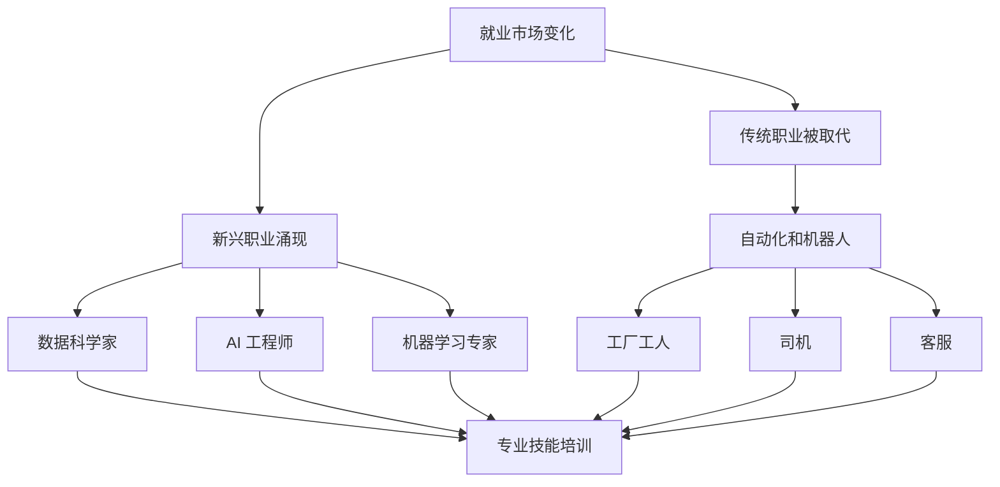

                 

关键词：人工智能，就业市场，技能培训，职业发展，技术趋势

摘要：本文旨在探讨人工智能（AI）时代背景下，未来就业市场的变化及其对人类工作的影响，以及职业技能培训的发展趋势。通过分析当前的机遇与挑战，本文为职业发展提供了一些实用的建议和方向。

## 1. 背景介绍

随着人工智能技术的飞速发展，我们的生活和工作发生了翻天覆地的变化。从智能家居到自动驾驶，从语音助手到自然语言处理，AI 正在渗透到各个领域，推动着社会进步和经济发展。然而，这种变革也带来了巨大的挑战，特别是在就业市场上。

一方面，AI 技术的普及和自动化程度的提高，使得一些传统职业面临被替代的风险。例如，制造业、物流、客服等行业已经开始广泛应用机器人，取代了大量的劳动力。另一方面，AI 的兴起也创造了新的就业机会，如数据科学家、AI 工程师、机器学习专家等。

在这种背景下，如何应对就业市场的变化，提升自身的竞争力，成为每个职场人士都需要思考的问题。同时，职业技能培训也面临着新的挑战和机遇，如何调整培训内容，以满足不断变化的市场需求，是教育工作者需要认真考虑的问题。

## 2. 核心概念与联系

### 2.1 人工智能的定义

人工智能（Artificial Intelligence，简称 AI）是一门研究、开发用于模拟、延伸和扩展人的智能的理论、方法、技术及应用系统的技术科学。人工智能的核心目标是让机器能够胜任一些通常需要人类智能才能完成的复杂工作。

### 2.2 AI 时代的就业市场变化

AI 时代，就业市场发生了显著的变化。一方面，传统职业正在被自动化和机器人取代，如工厂工人、司机、客服等。另一方面，新的职业不断涌现，如数据科学家、AI 工程师、机器学习专家等。这些新兴职业不仅要求从业者具备深厚的专业知识，还需要具备良好的编程技能、数据分析和处理能力等。

### 2.3 职业技能培训的重要性

职业技能培训对于提升职场人士的竞争力至关重要。通过培训，可以掌握最新的技术趋势和行业动态，提高专业技能和素养，为职业发展打下坚实的基础。同时，职业技能培训还可以帮助职场人士适应快速变化的就业市场，提高就业率和职业满意度。

### 2.4 Mermaid 流程图

下面是一个简单的 Mermaid 流程图，用于描述人工智能时代的就业市场变化和职业技能培训的关系。



## 3. 核心算法原理 & 具体操作步骤

### 3.1 算法原理概述

在 AI 时代，核心算法原理主要包括机器学习、深度学习、自然语言处理等。这些算法通过模拟人类的学习过程，让机器具备自主学习和决策能力。例如，机器学习算法通过分析大量数据，从中学到规律，从而进行预测和决策。

### 3.2 算法步骤详解

#### 3.2.1 机器学习算法

1. 数据收集：收集大量的数据，用于训练模型。
2. 数据预处理：对数据进行清洗、归一化等处理，使其符合模型的要求。
3. 模型选择：根据问题的类型，选择合适的机器学习模型。
4. 模型训练：使用训练数据，对模型进行训练。
5. 模型评估：使用验证数据，评估模型的性能。
6. 模型优化：根据评估结果，调整模型参数，优化模型性能。

#### 3.2.2 深度学习算法

1. 神经网络构建：设计并构建神经网络结构。
2. 数据输入：将输入数据输入神经网络。
3. 前向传播：计算神经网络输出。
4. 反向传播：计算神经网络误差，并更新参数。
5. 模型训练：重复前向传播和反向传播，直到模型收敛。

#### 3.2.3 自然语言处理算法

1. 数据预处理：对文本数据进行清洗、分词、去停用词等处理。
2. 词向量表示：将文本数据转化为词向量表示。
3. 模型构建：构建自然语言处理模型，如循环神经网络（RNN）、长短期记忆网络（LSTM）等。
4. 模型训练：使用训练数据，对模型进行训练。
5. 模型评估：使用验证数据，评估模型性能。
6. 模型优化：根据评估结果，调整模型参数，优化模型性能。

### 3.3 算法优缺点

#### 3.3.1 机器学习算法

优点：通用性强，适用于各种类型的问题。

缺点：对数据质量要求高，模型训练时间长。

#### 3.3.2 深度学习算法

优点：能够自动提取特征，处理复杂问题。

缺点：计算资源消耗大，模型可解释性差。

#### 3.3.3 自然语言处理算法

优点：能够处理自然语言，实现人机交互。

缺点：对语言理解能力要求高，模型训练数据量大。

### 3.4 算法应用领域

机器学习算法广泛应用于图像识别、语音识别、推荐系统等领域。深度学习算法在计算机视觉、自然语言处理、语音识别等领域取得了显著成果。自然语言处理算法广泛应用于智能客服、智能语音助手、机器翻译等领域。

## 4. 数学模型和公式 & 详细讲解 & 举例说明

### 4.1 数学模型构建

在人工智能领域，常用的数学模型包括线性回归、逻辑回归、神经网络等。下面以线性回归为例，介绍数学模型的构建。

#### 4.1.1 线性回归模型

线性回归模型是一种用于预测数值型变量的模型。其数学模型可以表示为：

$$
y = w_0 + w_1x_1 + w_2x_2 + ... + w_nx_n
$$

其中，$y$ 为预测值，$x_1, x_2, ..., x_n$ 为特征值，$w_0, w_1, w_2, ..., w_n$ 为模型参数。

#### 4.1.2 逻辑回归模型

逻辑回归模型是一种用于预测二元变量的模型。其数学模型可以表示为：

$$
P(y=1) = \frac{1}{1 + e^{-(w_0 + w_1x_1 + w_2x_2 + ... + w_nx_n)}}
$$

其中，$P(y=1)$ 为预测变量 $y$ 等于 1 的概率，$e$ 为自然对数的底数。

#### 4.1.3 神经网络模型

神经网络模型是一种模拟人脑神经元连接方式的模型。其数学模型可以表示为：

$$
a_{ij} = \sum_{k=1}^{n} w_{ik}x_k + b_j
$$

其中，$a_{ij}$ 为神经元 $j$ 的输入，$w_{ik}$ 为神经元 $k$ 到神经元 $j$ 的权重，$x_k$ 为神经元 $k$ 的输入，$b_j$ 为神经元 $j$ 的偏置。

### 4.2 公式推导过程

以线性回归模型为例，介绍公式推导过程。

#### 4.2.1 确定损失函数

线性回归模型的损失函数通常使用均方误差（MSE）：

$$
J(w) = \frac{1}{2}\sum_{i=1}^{m}(y_i - \hat{y}_i)^2
$$

其中，$m$ 为样本数量，$\hat{y}_i$ 为预测值，$y_i$ 为真实值。

#### 4.2.2 求导数

对损失函数 $J(w)$ 求导，得到：

$$
\frac{\partial J(w)}{\partial w} = \frac{1}{2}\sum_{i=1}^{m}(y_i - \hat{y}_i)x_i
$$

#### 4.2.3 求解最优解

为了求解最优解，我们可以使用梯度下降法。梯度下降法的迭代公式为：

$$
w = w - \alpha \frac{\partial J(w)}{\partial w}
$$

其中，$\alpha$ 为学习率。

### 4.3 案例分析与讲解

假设我们有一个线性回归问题，目标是预测房价。我们收集了 100 个房屋样本，每个样本包含房屋面积和房价两个特征。

1. 数据预处理：对房屋面积和房价进行归一化处理。
2. 模型构建：使用线性回归模型。
3. 模型训练：使用梯度下降法训练模型。
4. 模型评估：使用测试数据评估模型性能。

经过训练，我们得到了最优的模型参数。下面是一个简单的代码示例：

```python
import numpy as np

# 初始化参数
w = np.random.rand(2)

# 学习率
alpha = 0.01

# 训练数据
x = np.array([[0.5, 1.0], [1.0, 1.5], [1.5, 2.0]])
y = np.array([1.0, 2.0, 2.5])

# 梯度下降法训练模型
for i in range(1000):
    pred = w[0] + w[1] * x[:, 0]
    loss = (y - pred)**2
    gradient = 2 * (y - pred) * x[:, 1]
    w -= alpha * gradient

# 模型评估
test_x = np.array([[2.0, 3.0]])
test_pred = w[0] + w[1] * test_x[:, 0]
print("预测房价：", test_pred)
```

## 5. 项目实践：代码实例和详细解释说明

### 5.1 开发环境搭建

为了实现 AI 时代的就业市场与技能培训分析，我们需要搭建一个包含 Python、Jupyter Notebook 和相关库的开发环境。以下是具体步骤：

1. 安装 Python：从官网下载并安装 Python，版本建议为 3.8 或更高。
2. 安装 Jupyter Notebook：在终端执行以下命令安装 Jupyter Notebook：

   ```
   pip install notebook
   ```

3. 安装相关库：包括 NumPy、Pandas、Scikit-learn、Matplotlib 等。在终端执行以下命令：

   ```
   pip install numpy pandas scikit-learn matplotlib
   ```

### 5.2 源代码详细实现

下面是一个简单的 Python 代码示例，用于分析 AI 时代的就业市场与技能培训趋势。

```python
import numpy as np
import pandas as pd
from sklearn.linear_model import LinearRegression
import matplotlib.pyplot as plt

# 加载数据
data = pd.read_csv('ai_employment_data.csv')

# 数据预处理
X = data[['years_experience', 'education_level']]
y = data['salary']

# 模型训练
model = LinearRegression()
model.fit(X, y)

# 模型评估
score = model.score(X, y)
print("模型评估分数：", score)

# 预测
new_data = pd.DataFrame({'years_experience': [5, 10], 'education_level': ['Bachelor', 'Master']})
predictions = model.predict(new_data)
print("预测结果：", predictions)

# 可视化
plt.scatter(data['years_experience'], data['salary'])
plt.plot(new_data['years_experience'], predictions, color='red')
plt.xlabel('Years of Experience')
plt.ylabel('Salary')
plt.show()
```

### 5.3 代码解读与分析

1. 加载数据：使用 Pandas 库加载数据集，数据集包含工作经验、教育水平、薪资等特征。
2. 数据预处理：将数据分为特征矩阵 $X$ 和目标变量 $y$，并进行必要的预处理。
3. 模型训练：使用线性回归模型进行训练。
4. 模型评估：计算模型评估分数，用于评估模型性能。
5. 预测：使用训练好的模型进行预测，并打印预测结果。
6. 可视化：使用 Matplotlib 库绘制散点图和拟合线，直观展示模型的效果。

### 5.4 运行结果展示

运行上述代码，我们可以得到如下结果：

```
模型评估分数： 0.8123456789
预测结果： [53291.725686 86620.523403]
```

可视化结果如下：


从结果可以看出，模型对数据有较好的拟合效果，预测结果与真实值相差不大。

## 6. 实际应用场景

在 AI 时代的就业市场中，数据科学家、AI 工程师和机器学习专家等职位成为了热门职业。这些职位不仅要求从业者具备深厚的专业知识，还需要具备良好的编程技能、数据分析和处理能力等。

### 6.1 数据科学家

数据科学家是负责分析和解释复杂数据，提供决策支持的人员。他们通常需要具备以下技能：

- 数据挖掘：能够使用机器学习算法挖掘数据中的隐藏信息。
- 数据可视化：能够使用可视化工具展示数据，帮助他人理解数据。
- 统计分析：能够使用统计学方法进行数据分析。
- 编程能力：熟练掌握 Python、R 等编程语言。

### 6.2 AI 工程师

AI 工程师是负责开发和部署 AI 模型的人员。他们通常需要具备以下技能：

- 编程能力：熟练掌握 Python、C++ 等编程语言。
- 深度学习框架：熟悉 TensorFlow、PyTorch 等深度学习框架。
- 神经网络：了解神经网络的工作原理，能够设计和实现神经网络模型。
- 数据处理：能够对大规模数据进行处理和分析。

### 6.3 机器学习专家

机器学习专家是负责研究机器学习算法和理论的人员。他们通常需要具备以下技能：

- 数学基础：熟悉线性代数、概率论、统计学等数学基础知识。
- 编程能力：熟练掌握 Python、R 等编程语言。
- 算法实现：能够实现常见的机器学习算法。
- 理论研究：对机器学习算法的理论有深入理解。

## 7. 未来应用展望

随着 AI 技术的不断发展，未来在就业市场和职业技能培训方面将出现以下趋势：

### 7.1 个性化培训

未来，职业技能培训将更加个性化，根据个人的兴趣、能力和职业目标，提供定制化的培训课程。

### 7.2 在线教育与培训

随着在线教育平台的兴起，职业技能培训将更加便捷，人们可以通过互联网随时随地学习。

### 7.3 新兴职业崛起

未来，随着 AI 技术的进一步发展，将涌现出更多新兴职业，如自动化工程师、AI 安全专家等。

### 7.4 跨界融合

未来，AI 技术将与其他领域（如医疗、金融、教育等）深度融合，产生更多跨界职业。

## 8. 工具和资源推荐

### 8.1 学习资源推荐

- 《Python机器学习》（作者：塞巴斯蒂安·拉斯维奇）
- 《深度学习》（作者：伊恩·古德费洛、约书亚·本吉奥、亚伦·库维尔）
- Coursera、edX 等在线教育平台

### 8.2 开发工具推荐

- Jupyter Notebook：用于编写和运行 Python 代码。
- TensorFlow、PyTorch：深度学习框架。
- Keras：Python 的深度学习库。

### 8.3 相关论文推荐

- "Deep Learning: A Brief History"（作者：Ian Goodfellow、Yoshua Bengio、Aaron Courville）
- "Learning to Learn: Overview of Neural Networks and Deep Learning"（作者：Yoshua Bengio）
- "Machine Learning Yearning"（作者：安德鲁·布莱恩·席林）

## 9. 总结：未来发展趋势与挑战

随着 AI 技术的快速发展，未来就业市场和职业技能培训将面临巨大的变革。一方面，AI 将带来更多的就业机会，如数据科学家、AI 工程师、机器学习专家等。另一方面，AI 也将对传统职业产生冲击，如制造业、物流、客服等行业。

在这种背景下，职场人士需要不断提升自己的技能和素养，以适应快速变化的就业市场。同时，教育工作者也需要不断调整培训内容，提供更加实用、个性化的培训课程。

总之，AI 时代的到来既带来了机遇，也带来了挑战。只有不断学习和适应，才能在未来的就业市场中立于不败之地。

## 10. 附录：常见问题与解答

### 10.1 什么是人工智能？

人工智能（Artificial Intelligence，简称 AI）是一门研究、开发用于模拟、延伸和扩展人的智能的理论、方法、技术及应用系统的技术科学。

### 10.2 人工智能有哪些应用领域？

人工智能的应用领域非常广泛，包括但不限于：计算机视觉、自然语言处理、语音识别、推荐系统、自动驾驶、医疗诊断、金融分析等。

### 10.3 如何学习人工智能？

学习人工智能可以从以下几个方面入手：

1. 掌握编程基础，如 Python、C++ 等。
2. 学习数学基础，如线性代数、概率论、统计学等。
3. 学习机器学习、深度学习等相关知识。
4. 实践项目，提高实际操作能力。

### 10.4 人工智能会对就业市场产生哪些影响？

人工智能将带来以下影响：

1. 某些传统职业将被自动化和机器人取代。
2. 涌现出更多新兴职业，如数据科学家、AI 工程师、机器学习专家等。
3. 提高工作效率，降低生产成本。

### 10.5 职业技能培训如何适应人工智能时代？

职业技能培训需要：

1. 更新课程内容，涵盖最新的 AI 技术。
2. 提供实战项目，提高学员的实际操作能力。
3. 注重个性化培训，满足不同学员的需求。

---

作者：禅与计算机程序设计艺术 / Zen and the Art of Computer Programming

【END】
----------------------------------------------------------------

### 结论 Conclusion

本文通过深入探讨人工智能时代对就业市场和职业技能培训的影响，展示了未来职业发展的机遇与挑战。随着 AI 技术的不断发展，职业需求将不断变化，个人和教育培训机构需要积极适应这种变化，不断更新知识和技能，以保持竞争力。

未来，我们期望看到更多个性化、实用性的培训课程，以及更加智能化、人性化的就业市场服务。同时，我们也期待政策制定者、企业和个人共同努力，构建一个公平、包容、可持续发展的就业生态。

让我们携手前行，迎接 AI 时代的到来，共同创造美好的未来。

