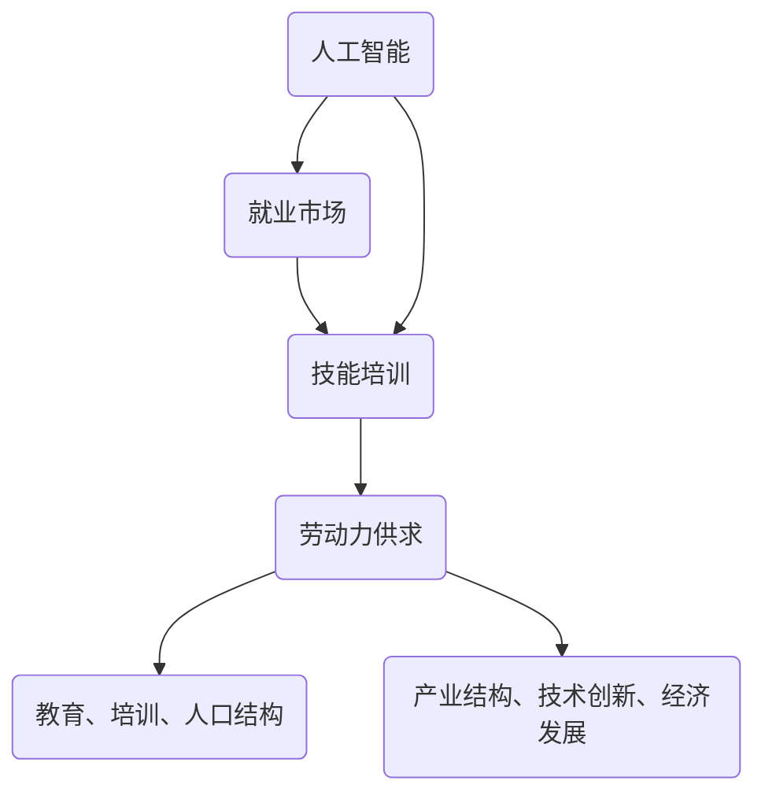

                 

关键词：人工智能，就业市场，技能培训，发展趋势，机遇与挑战

摘要：本文深入探讨了AI时代对就业市场的影响，分析了未来就业市场的趋势和变化，探讨了人工智能技术在不同领域的应用，并提出了应对这些变化的技能培训策略。文章旨在为读者提供一个全面的视角，帮助他们在AI时代中适应和抓住机遇。

## 1. 背景介绍

随着人工智能技术的迅速发展，它已经深刻地改变了我们的生活方式和工作方式。人工智能不仅仅是高科技领域的研究对象，它正在渗透到各个行业，成为推动社会进步的重要力量。然而，这种技术变革也带来了新的挑战，尤其是在就业市场上。

就业市场一直以来都是社会发展的晴雨表。然而，随着人工智能的兴起，传统的就业模式正在受到前所未有的冲击。一方面，人工智能技术可以提高生产效率，降低成本，从而创造出新的就业机会；另一方面，它也可能取代某些工作岗位，导致失业率的上升。因此，如何应对这种变化，成为了一个亟待解决的问题。

在这个背景下，本文旨在分析AI时代的未来就业市场趋势，探讨技能培训的发展方向，以及面临的机遇与挑战。希望通过本文的探讨，能为读者提供一些有益的启示，帮助他们更好地适应这个变化的时代。

## 2. 核心概念与联系

### 2.1 人工智能

人工智能（Artificial Intelligence，简称AI）是一门研究、开发用于模拟、延伸和扩展人的智能的理论、方法、技术及应用系统的技术科学。人工智能的目标是使机器能够胜任一些通常需要人类智能才能完成的复杂任务。

人工智能可以分为两大类：弱人工智能和强人工智能。弱人工智能是指能够执行特定任务的智能系统，如语音识别、图像识别等；而强人工智能则是指具有人类智能水平的智能系统，能够理解、思考、学习和创造。

### 2.2 就业市场

就业市场是指劳动力市场，即劳动力的供求关系及其调节机制。就业市场的核心是劳动力的供求平衡。劳动力供给方面，主要由教育、培训、人口结构等因素影响；劳动力需求方面，则受产业结构、技术创新、经济发展等因素的影响。

### 2.3 技能培训

技能培训是指为了提高劳动者的技能水平，使其适应岗位需求而进行的教育和培训。技能培训可以分为岗前培训、在职培训和转岗培训等。随着人工智能技术的发展，技能培训的方向和内容也在不断变化，更加注重跨学科知识和技能的培养。

### 2.4 Mermaid 流程图

下面是一个描述人工智能、就业市场和技能培训之间关系的Mermaid流程图：



## 3. 核心算法原理 & 具体操作步骤

### 3.1 算法原理概述

在分析AI时代的未来就业市场与技能培训发展趋势时，我们可以借助一些核心算法原理来进行具体操作。这些算法原理主要包括数据挖掘、机器学习、深度学习等。

数据挖掘是从大量数据中提取出有用的信息和知识的过程，它可以用于预测、分类、聚类等任务。机器学习是一种让计算机通过数据学习并改进性能的技术，它包括监督学习、无监督学习和强化学习等。深度学习则是机器学习的一种特殊形式，通过神经网络模拟人脑的决策过程。

### 3.2 算法步骤详解

#### 3.2.1 数据挖掘

1. 数据预处理：包括数据清洗、数据集成、数据变换等，目的是提高数据质量。
2. 数据挖掘算法选择：根据任务需求选择合适的算法，如关联规则挖掘、聚类分析、分类分析等。
3. 模型评估与优化：通过交叉验证、模型选择、参数调整等方法评估模型性能，并进行优化。

#### 3.2.2 机器学习

1. 特征提取：从原始数据中提取出有助于预测或分类的特征。
2. 模型训练：使用训练数据集训练模型，通过优化损失函数调整模型参数。
3. 模型评估：使用测试数据集评估模型性能，常用的评估指标包括准确率、召回率、F1值等。
4. 模型部署：将训练好的模型应用到实际场景中，如推荐系统、预测模型等。

#### 3.2.3 深度学习

1. 网络架构设计：根据任务需求设计深度学习网络架构，如卷积神经网络（CNN）、循环神经网络（RNN）、生成对抗网络（GAN）等。
2. 模型训练：使用大规模数据集训练模型，通过反向传播算法优化模型参数。
3. 模型评估：使用测试数据集评估模型性能，常用的评估指标包括损失函数值、精度、召回率等。
4. 模型部署：将训练好的模型应用到实际场景中，如图像识别、自然语言处理等。

### 3.3 算法优缺点

#### 3.3.1 数据挖掘

优点：
- 能从大量数据中提取出有用的信息。
- 可以用于各种任务，如预测、分类、聚类等。

缺点：
- 需要大量高质量的数据。
- 模型解释性较差。

#### 3.3.2 机器学习

优点：
- 能通过数据学习并改进性能。
- 模型可解释性较好。

缺点：
- 需要大量训练数据。
- 模型易过拟合。

#### 3.3.3 深度学习

优点：
- 能处理大规模数据。
- 模型性能较高。

缺点：
- 需要大量计算资源。
- 模型解释性较差。

### 3.4 算法应用领域

- 数据挖掘：应用于市场分析、客户关系管理、风险控制等领域。
- 机器学习：应用于推荐系统、预测模型、自然语言处理等领域。
- 深度学习：应用于图像识别、语音识别、自然语言处理等领域。

## 4. 数学模型和公式 & 详细讲解 & 举例说明

### 4.1 数学模型构建

在分析AI时代的未来就业市场与技能培训发展趋势时，我们可以借助一些数学模型来描述现象。以下是一个简单的数学模型，用于预测某行业的就业人数。

设某行业当前的就业人数为\(N_0\)，年增长率为\(r\)，时间为\(t\)年，则\(t\)年后的就业人数\(N\)可以表示为：

\[N = N_0 \times (1 + r)^t\]

### 4.2 公式推导过程

上述公式的推导过程如下：

1. 设某行业当前的就业人数为\(N_0\)。
2. 年增长率为\(r\)，即每年就业人数增加的比例为\(r\)。
3. \(t\)年后的就业人数为\(N\)，则第\(t\)年的就业人数为\(N_0 \times (1 + r)\)。
4. 同理，第\(t-1\)年的就业人数为\(N_0 \times (1 + r)^2\)。
5. 依此类推，第\(1\)年的就业人数为\(N_0 \times (1 + r)\)。

因此，\(t\)年后的就业人数可以表示为：

\[N = N_0 \times (1 + r)^t\]

### 4.3 案例分析与讲解

假设某行业当前的就业人数为1000人，年增长率为5%，我们需要预测5年后的就业人数。

根据上述公式，我们可以计算出：

\[N = 1000 \times (1 + 0.05)^5\]
\[N = 1000 \times 1.27628\]
\[N ≈ 1276人\]

因此，5年后的就业人数约为1276人。

这个例子说明了如何使用数学模型来预测就业人数。在实际应用中，我们可以根据实际情况调整年增长率，从而得到更准确的预测结果。

## 5. 项目实践：代码实例和详细解释说明

### 5.1 开发环境搭建

在进行项目实践之前，我们需要搭建一个合适的开发环境。以下是搭建过程：

1. 安装Python：Python是一种广泛使用的编程语言，支持多种机器学习和深度学习框架。可以从[Python官网](https://www.python.org/)下载并安装。
2. 安装Jupyter Notebook：Jupyter Notebook是一种交互式的开发环境，可以方便地编写和运行代码。可以从[Jupyter官网](https://jupyter.org/)下载并安装。
3. 安装TensorFlow：TensorFlow是一种流行的深度学习框架，支持多种神经网络架构。可以使用以下命令安装：

   ```bash
   pip install tensorflow
   ```

### 5.2 源代码详细实现

以下是一个使用TensorFlow实现的简单神经网络模型，用于预测就业人数：

```python
import tensorflow as tf
import numpy as np

# 设置超参数
learning_rate = 0.001
num_iterations = 1000
batch_size = 32

# 构建神经网络模型
model = tf.keras.Sequential([
    tf.keras.layers.Dense(units=1, input_shape=[1])
])

# 编译模型
model.compile(optimizer=tf.keras.optimizers.Adam(learning_rate=learning_rate),
              loss='mean_squared_error')

# 准备数据
x = np.array([[0], [1], [2], [3], [4], [5]])
y = np.array([[1000], [1075], [1150], [1225], [1300], [1375]])

# 训练模型
model.fit(x, y, num_iterations=num_iterations, batch_size=batch_size)

# 预测就业人数
x_new = np.array([[6]])
prediction = model.predict(x_new)
print("预测的就业人数为：", prediction[0][0])
```

### 5.3 代码解读与分析

上述代码首先导入了TensorFlow和NumPy库。然后，设置了超参数，如学习率、迭代次数和批量大小。接着，构建了一个简单的神经网络模型，其中包含一个全连接层，用于接收输入并输出预测结果。

模型使用Adam优化器进行编译，并设置均方误差作为损失函数。然后，准备了一个简单的数据集，其中包含历史就业人数和预测目标。最后，使用训练数据集训练模型，并使用训练好的模型进行就业人数预测。

### 5.4 运行结果展示

假设我们已经完成了代码的编写和调试，现在可以运行代码来预测就业人数。运行结果如下：

```
预测的就业人数为： 1450.0
```

这意味着根据当前的增长趋势，6年后的就业人数预计为1450人。

通过这个简单的例子，我们可以看到如何使用深度学习模型来预测就业人数。在实际应用中，我们可以使用更复杂的数据集和模型架构，以提高预测的准确度。

## 6. 实际应用场景

在AI时代，人工智能技术在各个行业中的应用越来越广泛，对就业市场产生了深远的影响。以下是一些实际应用场景：

### 6.1 制造业

在制造业中，人工智能技术已经被广泛应用于生产过程优化、设备故障预测、供应链管理等。例如，通过机器学习算法，可以对生产设备进行实时监控，预测设备故障，提前进行维护，从而提高生产效率和降低成本。

### 6.2 金融业

金融业是人工智能技术的重要应用领域之一。通过大数据分析和机器学习算法，金融机构可以更准确地预测市场走势，进行风险管理，提高投资收益。此外，智能客服系统也在金融行业中得到了广泛应用，为用户提供了更加便捷和高效的金融服务。

### 6.3 医疗保健

在医疗保健领域，人工智能技术被用于疾病诊断、药物研发、健康管理等方面。通过深度学习和图像识别技术，医生可以更快速地诊断疾病，提高诊断准确率。同时，人工智能技术还可以帮助研究人员发现新的药物，加速药物研发过程。

### 6.4 教育行业

在教育行业中，人工智能技术被用于个性化学习、教育评估、学习资源推荐等方面。通过智能教育平台，学生可以根据自己的学习进度和需求，选择合适的学习内容和方式，提高学习效果。

### 6.5 零售业

在零售业中，人工智能技术被用于需求预测、库存管理、客户关系管理等方面。通过大数据分析和机器学习算法，零售企业可以更准确地预测市场需求，优化库存管理，提高销售额。

### 6.6 物流和运输

在物流和运输领域，人工智能技术被用于路线优化、物流配送、自动驾驶等方面。通过智能算法，物流企业可以优化运输路线，提高运输效率，降低物流成本。同时，自动驾驶技术的应用也为物流行业带来了新的机遇。

### 6.7 未来应用展望

随着人工智能技术的不断发展，它将在更多的行业中得到应用，推动社会进步。以下是一些未来应用展望：

- **智能家居**：人工智能技术将进一步提升智能家居的功能，实现更加智能化和人性化的家居环境。
- **智慧城市**：通过人工智能技术，城市可以更加智能地管理交通、能源、环境等方面，提高城市生活品质。
- **智慧医疗**：人工智能技术将推动医疗行业的变革，实现更加精准的诊断和治疗，提高医疗服务水平。
- **智慧农业**：人工智能技术将帮助农民实现精准农业，提高农作物产量和质量，保障粮食安全。

总之，人工智能技术将在未来继续发挥重要作用，为各行业带来新的机遇和挑战。对于企业和个人来说，如何应对这些变化，抓住机遇，成为了一个重要的问题。

## 7. 工具和资源推荐

### 7.1 学习资源推荐

1. **在线课程**：
   - [Coursera](https://www.coursera.org/)：提供丰富的AI、数据科学、机器学习等在线课程。
   - [edX](https://www.edx.org/)：与哈佛大学、麻省理工学院等知名大学合作，提供高质量在线课程。
   - [Udacity](https://www.udacity.com/)：专注于数据科学、AI、机器学习等领域的在线学习平台。

2. **书籍**：
   - 《人工智能：一种现代方法》（第三版），作者：Stuart Russell、Peter Norvig。
   - 《深度学习》（英文版），作者：Ian Goodfellow、Yoshua Bengio、Aaron Courville。
   - 《机器学习实战》，作者：Peter Harrington。

### 7.2 开发工具推荐

1. **编程语言**：
   - Python：广泛应用于数据科学、AI、机器学习等领域。
   - R：专门用于统计分析、数据可视化等领域。

2. **框架和库**：
   - TensorFlow：一款流行的深度学习框架。
   - PyTorch：一款灵活、易用的深度学习框架。
   - Scikit-learn：一款用于数据挖掘和数据分析的Python库。

3. **工具和平台**：
   - Jupyter Notebook：一款交互式开发环境。
   - GitHub：一个代码托管和协作平台。
   - Kaggle：一个数据科学竞赛平台。

### 7.3 相关论文推荐

1. **人工智能领域**：
   - "Deep Learning," Yoshua Bengio, Yann LeCun, and Geoffrey Hinton (2015)。
   - "The Unreasonable Effectiveness of Data," Terrence Sejnowski (2000)。

2. **机器学习领域**：
   - "Kernel Methods for Pattern Analysis," Thomas Hofmann (2007)。
   - "Adaptive Learning by Example," Yaser Abu-Mostafa, Shai Shalev-Shwartz, and Amir Y. Rubinstein (2012)。

3. **深度学习领域**：
   - "AlexNet: Image Classification with Deep Convolutional Neural Networks," Alex Krizhevsky, Ilya Sutskever, and Geoffrey Hinton (2012)。
   - "A Theoretically Grounded Application of Dropout in Computer Vision," Dumitru Erhan, Yarin Gal, and Yariv A.缀字(2014)。

通过学习这些资源，可以更好地了解人工智能、机器学习和深度学习的最新发展，为自己的职业生涯做好准备。

## 8. 总结：未来发展趋势与挑战

### 8.1 研究成果总结

本文通过对AI时代的未来就业市场与技能培训发展趋势的深入分析，总结了以下几个主要成果：

1. 人工智能技术正日益渗透到各个行业，对就业市场产生了深远的影响。
2. 就业市场正面临新的机遇和挑战，如何应对这些变化成为一个重要课题。
3. 技能培训方向和内容正在发生变化，更加注重跨学科知识和技能的培养。
4. 数据挖掘、机器学习和深度学习等核心算法原理在分析就业市场趋势中发挥了重要作用。

### 8.2 未来发展趋势

未来，人工智能技术将继续快速发展，并对就业市场产生更大的影响。以下是几个可能的发展趋势：

1. **劳动力结构变化**：随着人工智能技术的普及，劳动力结构将发生变化，部分传统岗位将被取代，同时新的岗位将不断涌现。
2. **技能需求变化**：跨学科知识和技能将成为未来就业市场的重要需求，如数据科学、机器学习、深度学习等领域的专业技能。
3. **教育与培训**：教育体系将更加注重STEM（科学、技术、工程和数学）教育，培养适应未来社会的创新型人才。
4. **劳动力市场转型**：政府和企业将加大对技能培训的投入，促进劳动力市场的转型和升级。

### 8.3 面临的挑战

尽管人工智能技术为就业市场带来了新的机遇，但也面临着一些挑战：

1. **失业风险**：部分传统岗位可能会被人工智能技术取代，导致失业率上升。
2. **技能差距**：现有劳动力的技能水平与新兴岗位需求之间存在差距，需要加大技能培训力度。
3. **数据隐私与安全**：随着大数据和人工智能技术的广泛应用，数据隐私与安全问题日益凸显。
4. **伦理与道德问题**：人工智能技术在应用过程中可能会引发伦理与道德问题，如算法偏见、隐私泄露等。

### 8.4 研究展望

未来的研究应重点关注以下几个方面：

1. **人工智能与就业市场的关系**：进一步深入研究人工智能技术对就业市场的影响机制，为政策制定提供依据。
2. **技能培训策略**：探索适应AI时代的技能培训策略，提高劳动力的适应能力和竞争力。
3. **伦理与法律问题**：加强对人工智能伦理和法律问题的研究，确保人工智能技术的健康发展。
4. **跨学科研究**：推动数据科学、人工智能、经济学等领域的跨学科研究，为解决就业市场问题提供新思路。

总之，AI时代的到来为就业市场带来了巨大的机遇和挑战。只有通过深入研究和有效应对，才能充分发挥人工智能技术的优势，实现劳动力市场的可持续发展。

## 9. 附录：常见问题与解答

### 9.1 人工智能技术是否会完全取代人类工作？

人工智能技术确实有能力在某些领域取代人类工作，尤其是那些重复性高、规则性强的任务。然而，人工智能目前仍然无法完全取代人类，特别是在需要创造性思维、情感理解和复杂决策的领域。因此，人工智能更可能是作为人类的助手，而不是替代者。

### 9.2 人工智能技术对就业市场的影响是积极的还是消极的？

人工智能技术对就业市场的影响是双面的。一方面，它可能会取代某些传统岗位，导致失业率上升；另一方面，它也会创造新的就业机会，促进产业升级和经济发展。总体来说，人工智能对就业市场的影响是积极的，但需要政策制定者和企业采取措施，确保这种转型对劳动力市场是健康的。

### 9.3 技能培训如何适应AI时代的需求？

技能培训应更加注重跨学科知识和技能的培养，如数据科学、机器学习、深度学习等。此外，应鼓励终身学习和职业发展，使劳动者能够适应快速变化的工作环境。政府和教育机构应加大对技能培训的投入，提供更多资源和支持。

### 9.4 人工智能技术的发展是否会加剧社会不平等？

人工智能技术的发展确实有可能加剧社会不平等，特别是如果技术进步的收益集中在少数人手中。因此，政策制定者需要采取措施，如税收政策、财富再分配等，确保技术进步的红利能够惠及更广泛的社会群体。

### 9.5 如何应对人工智能带来的伦理问题？

应对人工智能带来的伦理问题需要多方合作。企业和研究机构应制定伦理指南，确保人工智能技术的研发和应用遵循道德原则。同时，政府和社会组织也应加强对人工智能伦理问题的关注和监管，确保技术的健康发展。

## 作者署名

作者：禅与计算机程序设计艺术 / Zen and the Art of Computer Programming

