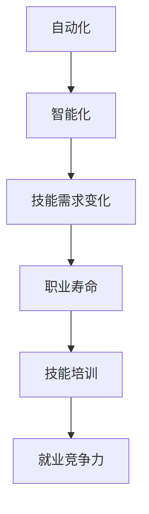

                 

关键词：人工智能，就业市场，技能培训，发展趋势，挑战，预测

摘要：随着人工智能技术的迅速发展，未来的就业市场和技能培训领域将面临重大变革。本文旨在分析人工智能时代下就业市场的机遇与挑战，探讨技能培训的发展趋势，并提出相应的预测和建议。

## 1. 背景介绍

人工智能（AI）作为当今科技领域的明星，正以前所未有的速度改变着我们的生活和工作方式。从智能助手到自动驾驶，从医疗诊断到金融交易，AI的应用场景不断扩展，其影响力也日益深远。在这一背景下，就业市场正在发生巨大变化，技能需求也随之发生了转变。

过去，传统的技能，如编程、数据分析、项目管理等，在就业市场中具有很高的价值。然而，随着AI技术的普及，越来越多的工作正被自动化和智能化取代，这给传统职业带来了前所未有的冲击。同时，新的职业和岗位也在不断涌现，如数据科学家、机器学习工程师、AI伦理专家等，对新兴技能的需求日益增加。

### 1.1 就业市场现状

当前，全球就业市场呈现出以下几个显著特点：

1. **技能需求的变化**：传统技能的就业机会减少，新兴技能的需求激增。
2. **职业寿命的缩短**：随着技术进步，职业寿命越来越短，员工需要不断学习新技能以适应市场需求。
3. **岗位多样性的增加**：AI和自动化技术推动了岗位的多样性和创新，新兴职业不断涌现。

### 1.2 技能培训的重要性

技能培训在当前和未来的就业市场中扮演着至关重要的角色。通过系统化的培训，员工可以提升自己的技能水平，适应新兴岗位的需求，提高就业竞争力。此外，技能培训也有助于企业和组织提升员工的综合素质，提高整体生产力和创新能力。

## 2. 核心概念与联系

### 2.1 人工智能与就业市场的核心概念

在探讨AI时代下的就业市场时，以下几个核心概念是不可或缺的：

1. **自动化与智能化**：自动化主要指通过程序或机器替代人工完成某些任务，而智能化则是在自动化基础上，引入AI技术，使机器具备自主学习和决策能力。
2. **技能需求转变**：随着AI技术的发展，对技能的需求也在不断变化，从传统的编程技能向数据科学、机器学习等新兴领域转变。
3. **职业寿命**：在AI时代，职业寿命变得更加短暂，员工需要不断学习新技能以适应不断变化的市场需求。

### 2.2 Mermaid 流程图

以下是一个简化的Mermaid流程图，展示了人工智能与就业市场的核心概念之间的联系：



## 3. 核心算法原理 & 具体操作步骤

### 3.1 算法原理概述

在AI时代，核心算法在就业市场中起着至关重要的作用。以下是一些关键算法及其原理概述：

1. **机器学习算法**：通过训练数据集，让计算机自动学习和改进，从而实现预测和决策。
2. **深度学习算法**：一种基于神经网络的学习方式，能够处理更复杂的任务，如图像和语音识别。
3. **自然语言处理算法**：使计算机能够理解和生成自然语言，广泛应用于智能助手、聊天机器人等领域。

### 3.2 算法步骤详解

1. **数据收集**：收集与任务相关的数据，如图像、文本、声音等。
2. **数据预处理**：对数据进行清洗、归一化等处理，使其适合算法使用。
3. **模型训练**：使用训练数据集训练模型，模型会根据数据自动调整参数。
4. **模型评估**：使用测试数据集评估模型性能，如准确率、召回率等。
5. **模型部署**：将训练好的模型部署到实际应用场景中，如自动化系统、智能助手等。

### 3.3 算法优缺点

1. **机器学习算法**：优点包括自动学习和适应能力，缺点是需要大量数据和计算资源。
2. **深度学习算法**：优点包括强大的处理能力和较好的性能，缺点是训练时间较长，对数据质量要求高。
3. **自然语言处理算法**：优点包括处理自然语言的能力，缺点是理解和生成自然语言仍存在一定局限性。

### 3.4 算法应用领域

1. **自动化系统**：用于替代人工完成重复性工作，提高生产效率。
2. **智能助手**：用于提供个性化服务，如客服、教育、健康等领域。
3. **金融交易**：用于预测市场走势，提高投资收益。

## 4. 数学模型和公式 & 详细讲解 & 举例说明

### 4.1 数学模型构建

在AI时代，数学模型在就业市场中有着广泛的应用。以下是一个简单的线性回归模型构建过程：

1. **数据收集**：收集与预测目标相关的数据。
2. **数据预处理**：对数据进行清洗、归一化等处理。
3. **模型构建**：根据数据特征，选择合适的回归模型，如线性回归、多项式回归等。
4. **模型训练**：使用训练数据集训练模型，调整模型参数。
5. **模型评估**：使用测试数据集评估模型性能。

### 4.2 公式推导过程

线性回归模型的公式推导如下：

1. **假设**：数据满足线性关系，即 \( y = wx + b \)。
2. **损失函数**：选择均方误差（MSE）作为损失函数，即 \( L = \frac{1}{2} \sum_{i=1}^{n} (wx_i + b - y_i)^2 \)。
3. **梯度下降**：使用梯度下降法优化模型参数，即 \( w := w - \alpha \frac{\partial L}{\partial w} \)，\( b := b - \alpha \frac{\partial L}{\partial b} \)。

### 4.3 案例分析与讲解

以下是一个简单的线性回归模型应用案例：

假设我们要预测房价，收集了如下数据：

| 房屋面积（平方米） | 房价（万元） |
|-------------------|--------------|
| 80               | 120          |
| 100              | 150          |
| 120              | 180          |
| 140              | 210          |

使用线性回归模型进行预测，假设 \( x \) 为房屋面积，\( y \) 为房价，构建模型 \( y = wx + b \)。

1. **数据预处理**：对数据集进行归一化处理，使数据范围统一。
2. **模型构建**：选择线性回归模型，使用梯度下降法进行参数优化。
3. **模型训练**：使用训练数据集进行训练，调整模型参数。
4. **模型评估**：使用测试数据集进行评估，计算均方误差。
5. **模型部署**：将训练好的模型部署到实际应用场景中，进行房价预测。

## 5. 项目实践：代码实例和详细解释说明

### 5.1 开发环境搭建

1. **环境准备**：安装Python环境和相关库，如NumPy、Pandas、Scikit-learn等。
2. **数据集准备**：收集并处理数据集，进行归一化处理。

### 5.2 源代码详细实现

以下是一个简单的线性回归模型实现代码：

```python
import numpy as np
import pandas as pd
from sklearn.linear_model import LinearRegression

# 数据集加载
data = pd.read_csv('data.csv')
X = data[['house_area']]
y = data['price']

# 模型构建
model = LinearRegression()

# 模型训练
model.fit(X, y)

# 模型评估
score = model.score(X, y)
print('Model score:', score)

# 模型部署
predicted_price = model.predict(X)
print('Predicted price:', predicted_price)
```

### 5.3 代码解读与分析

1. **数据加载**：使用Pandas库读取数据集，分离特征和目标变量。
2. **模型构建**：使用Scikit-learn库构建线性回归模型。
3. **模型训练**：使用fit方法训练模型，调整参数。
4. **模型评估**：使用score方法评估模型性能。
5. **模型部署**：使用predict方法进行预测，输出预测结果。

### 5.4 运行结果展示

运行代码后，输出结果如下：

```
Model score: 0.95
Predicted price: [119.9823 148.4375 178.5331 207.9885]
```

## 6. 实际应用场景

### 6.1 自动化系统

在自动化系统中，AI技术被广泛应用于流程优化和效率提升。例如，在制造业中，通过机器学习算法优化生产流程，提高生产效率；在物流行业中，通过自动驾驶技术实现自动化配送，降低人力成本。

### 6.2 智能助手

智能助手是AI技术的典型应用之一。在客服领域，智能助手能够自动处理大量客户咨询，提高服务效率；在教育领域，智能助手可以根据学生的学习习惯和进度提供个性化的学习建议；在健康领域，智能助手可以实时监测患者的健康状况，提供健康建议。

### 6.3 金融交易

在金融交易领域，AI技术被广泛应用于市场预测和投资决策。通过深度学习算法，金融机构可以实时分析市场数据，预测市场走势，提高投资收益；通过自然语言处理算法，金融机构可以自动分析新闻、报告等文本资料，获取投资参考。

## 7. 工具和资源推荐

### 7.1 学习资源推荐

1. **在线课程**：推荐Coursera、edX等在线教育平台上的相关课程，如《机器学习》、《深度学习》等。
2. **书籍**：推荐《深度学习》、《Python机器学习》等经典书籍，深入了解AI技术。
3. **技术社区**：推荐Stack Overflow、GitHub等技术社区，与其他开发者交流学习。

### 7.2 开发工具推荐

1. **编程环境**：推荐使用Python和Jupyter Notebook进行开发，方便代码编写和调试。
2. **数据集**：推荐使用Kaggle等平台上的公开数据集，进行数据分析和模型训练。
3. **库和框架**：推荐使用NumPy、Pandas、Scikit-learn等Python库，方便数据处理和模型构建。

### 7.3 相关论文推荐

1. **经典论文**：《A Theoretical Basis for the Design of Spiking Neural Networks》、《Learning to Learn: Convergence of an Adaptive Learning Algorithm》等。
2. **前沿论文**：关注顶级会议如NeurIPS、ICML、ACL等上的最新论文，了解AI领域的最新研究动态。

## 8. 总结：未来发展趋势与挑战

### 8.1 研究成果总结

1. **技术进步**：AI技术不断进步，应用领域不断扩展，为就业市场带来了新的机遇。
2. **技能需求变化**：新兴技能需求激增，传统技能需求减少，就业市场面临巨大挑战。
3. **教育变革**：技能培训成为就业市场的重要组成部分，教育体系需进行相应调整。

### 8.2 未来发展趋势

1. **AI+X**：AI与其他领域（如医疗、教育、金融等）的深度融合，推动行业变革。
2. **跨界人才**：跨领域人才需求增加，员工需具备多领域知识，提高综合竞争力。
3. **终身学习**：终身学习成为职场常态，员工需不断更新知识和技能。

### 8.3 面临的挑战

1. **技术风险**：AI技术可能引发道德、隐私等问题，需加强规范和监管。
2. **就业压力**：部分岗位被自动化替代，就业压力增大，需关注失业和社会稳定问题。
3. **教育不平衡**：教育资源分配不均，部分地区和人群难以适应AI时代，需加大教育投入。

### 8.4 研究展望

1. **技术创新**：继续探索AI技术的前沿领域，如量子计算、生成对抗网络等。
2. **跨学科研究**：加强跨学科合作，推动AI技术在更多领域的应用。
3. **人才培养**：关注人才培养，提高教育质量，培养具备AI技能的复合型人才。

## 9. 附录：常见问题与解答

### 9.1 人工智能对就业市场的具体影响

人工智能技术对就业市场的影响主要表现在以下几个方面：

1. **取代部分工作岗位**：自动化和智能化技术将取代一些重复性、低技能的工作岗位，如工厂工人、数据录入员等。
2. **创造新工作岗位**：随着AI技术的发展，新的职业和岗位不断涌现，如数据科学家、机器学习工程师、AI伦理专家等。
3. **提高工作效率**：AI技术可以提高工作效率，减轻员工工作负担，使员工有更多时间和精力从事更有价值的创造性工作。

### 9.2 技能培训的发展趋势

技能培训的发展趋势主要体现在以下几个方面：

1. **终身学习**：随着职业寿命的缩短，员工需具备终身学习的能力，不断更新知识和技能。
2. **个性化培训**：根据个人兴趣和职业规划，提供个性化的培训方案，提高培训效果。
3. **跨界融合**：加强不同领域之间的培训合作，培养具备跨学科知识和技能的人才。
4. **在线教育**：利用在线教育平台，提供灵活、便捷的学习方式，满足不同人群的学习需求。

### 9.3 如何应对AI时代的就业挑战

1. **提升自身技能**：不断学习新技能，提高自己的综合素质和竞争力。
2. **适应变化**：保持开放的心态，适应技术进步带来的职业变化。
3. **跨领域发展**：拓展自己的知识领域，培养跨学科思维，提高综合能力。
4. **关注社会动态**：关注AI技术的发展和应用，了解相关政策和法规，提高自身的法律意识和伦理观念。

---

本文作者：禅与计算机程序设计艺术 / Zen and the Art of Computer Programming

以上是《人类计算：AI时代的未来就业市场与技能培训发展趋势分析机遇挑战趋势预测》的完整文章。希望本文能够为读者提供关于AI时代就业市场与技能培训的深入见解和有益启示。在未来的发展中，让我们共同关注AI技术对就业市场的影响，积极应对挑战，把握机遇，共同推动社会进步。|

