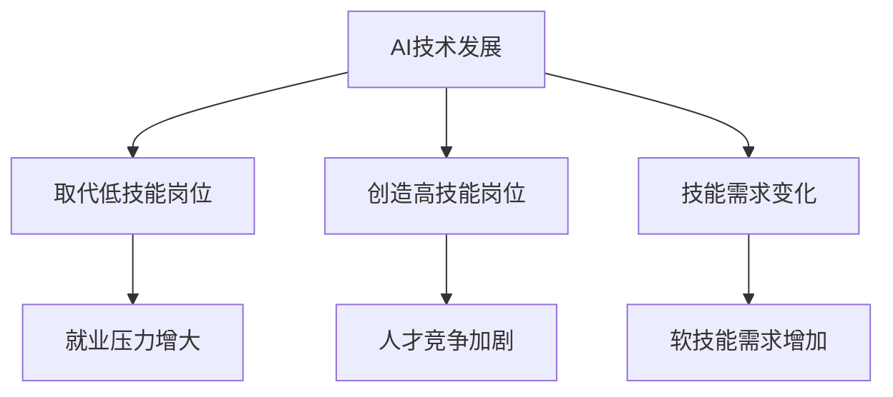

                 

## 1. 背景介绍

在当今时代，人工智能（AI）的迅猛发展正深刻改变着我们的工作和生活方式。随着深度学习、自然语言处理、计算机视觉等技术的不断突破，AI的应用领域逐渐扩大，从简单的自动化任务到复杂的决策支持，无处不在。这种变革不仅带来了技术上的进步，也对就业市场产生了深远的影响。

就业市场一直是社会经济的重要组成部分，它不仅反映了国家的发展水平，也关系到每一个劳动者的切身利益。然而，随着AI技术的发展，传统的就业模式正在面临前所未有的挑战。一方面，AI技术的普及使得一些重复性和低技能的岗位逐渐被机器取代，降低了对这些岗位的需求；另一方面，AI技术的应用也创造了许多新的工作岗位，对劳动者的技能要求越来越高。

因此，本文将围绕AI时代的未来就业市场进行分析，探讨以下几个方面：

- AI技术对就业市场的影响
- 未来就业市场的需求变化
- 劳动者如何适应AI时代的变革
- 未来就业市场的政策建议

希望通过本文的探讨，能够为读者提供一些有益的启示，帮助大家更好地应对AI时代带来的机遇与挑战。

## 2. 核心概念与联系

### 2.1 人工智能的基本概念

人工智能（Artificial Intelligence，简称AI）是计算机科学的一个分支，旨在使计算机系统模拟、延伸和扩展人的智能。AI技术主要包括机器学习、深度学习、自然语言处理、计算机视觉等。

- **机器学习**：一种使计算机从数据中学习规律和模式的方法，通过不断调整模型参数来优化性能。
- **深度学习**：一种基于多层神经网络的学习方法，通过模拟人脑神经元之间的连接来处理复杂数据。
- **自然语言处理**：研究计算机如何理解和生成人类语言的技术，包括语音识别、文本分类、机器翻译等。
- **计算机视觉**：使计算机能够像人一样理解视觉信息，包括图像识别、目标检测、图像分割等。

### 2.2 AI与就业市场的联系

AI技术的发展不仅改变了我们的生活方式，也对就业市场产生了深远的影响。具体来说，AI对就业市场的影响主要表现在以下几个方面：

- **取代低技能岗位**：AI技术可以自动化执行许多重复性和低技能的任务，如数据录入、客服等。这些岗位的需求逐渐减少，导致相关从业者的就业压力增大。
- **创造高技能岗位**：AI技术的发展也创造了大量高技能岗位，如数据科学家、机器学习工程师、AI产品经理等。这些岗位要求从业者具备较高的技术能力和专业知识。
- **技能需求变化**：随着AI技术的发展，劳动者的技能需求也在不断变化。除了传统的技术技能外，沟通能力、团队合作能力、创新思维能力等软技能变得越来越重要。

### 2.3  AI时代的就业市场特点

在AI时代，就业市场呈现出以下几个显著特点：

- **岗位高度专业化**：随着AI技术的不断进步，各个行业对专业技能的需求越来越具体，岗位的专业化程度不断提高。
- **人才竞争加剧**：高技能岗位的需求增长，导致人才竞争日益激烈，劳动者需要不断提升自己的技能和知识。
- **灵活就业成为趋势**：随着互联网和AI技术的发展，远程办公、自由职业等灵活就业方式逐渐普及，劳动者有更多选择工作的机会。

### 2.4 Mermaid流程图

以下是AI与就业市场联系的一个简化版Mermaid流程图，展示了AI技术在不同环节对就业市场的影响：



通过以上分析，我们可以看出AI技术对就业市场的深刻影响。在接下来的章节中，我们将进一步探讨AI技术对就业市场的具体影响，以及劳动者如何应对这些变化。

## 3. 核心算法原理 & 具体操作步骤

### 3.1 算法原理概述

AI技术的核心在于机器学习，尤其是深度学习。深度学习通过多层神经网络，从大量数据中学习特征和模式，从而实现自动化的决策和预测。以下是深度学习的基本原理和步骤：

1. **数据预处理**：将原始数据进行清洗、归一化等处理，使其适合模型训练。
2. **构建神经网络模型**：定义网络的层次结构，包括输入层、隐藏层和输出层。
3. **训练模型**：通过反向传播算法，不断调整模型参数，使模型能够对数据进行准确的预测。
4. **评估模型**：使用验证集和测试集评估模型的性能，调整模型参数，以优化性能。
5. **部署模型**：将训练好的模型部署到生产环境中，用于实际的决策和预测。

### 3.2 算法步骤详解

#### 3.2.1 数据预处理

数据预处理是深度学习模型训练的第一步，其目的是将原始数据转换为适合模型训练的格式。主要步骤包括：

- **数据清洗**：去除数据中的噪声和异常值。
- **数据归一化**：将数据缩放到一个统一的范围内，通常使用标准化或归一化方法。
- **数据扩充**：通过旋转、翻转、缩放等操作，增加数据的多样性，提高模型的泛化能力。

#### 3.2.2 构建神经网络模型

构建神经网络模型是深度学习的关键步骤。以下是构建神经网络模型的几个基本步骤：

- **选择神经网络类型**：根据任务需求选择合适的神经网络类型，如卷积神经网络（CNN）、循环神经网络（RNN）或生成对抗网络（GAN）。
- **定义网络结构**：确定网络的层次结构，包括输入层、隐藏层和输出层的节点数量和连接方式。
- **初始化模型参数**：为网络模型初始化权重和偏置，常用的方法包括随机初始化、高斯分布初始化等。
- **定义损失函数**：选择合适的损失函数，如均方误差（MSE）、交叉熵等，用于评估模型的预测性能。

#### 3.2.3 训练模型

训练模型是深度学习的核心步骤，其目的是通过优化模型参数，使其能够对训练数据进行准确的预测。以下是训练模型的几个基本步骤：

- **前向传播**：将输入数据输入到网络中，通过逐层计算，得到网络的输出。
- **计算损失**：使用定义的损失函数计算预测输出与真实输出之间的误差。
- **反向传播**：通过反向传播算法，将误差从输出层反向传播到输入层，计算每个参数的梯度。
- **更新参数**：根据梯度信息，使用优化算法（如梯度下降、Adam等）更新模型参数。
- **迭代训练**：重复前向传播、计算损失、反向传播和更新参数的过程，直到达到预设的训练次数或模型性能达到预期。

#### 3.2.4 评估模型

评估模型是确保模型性能的关键步骤。以下是评估模型的几个基本步骤：

- **验证集划分**：将数据集划分为训练集、验证集和测试集，通常比例为60%、20%和20%。
- **验证模型**：使用验证集评估模型的性能，根据模型的表现调整模型参数。
- **测试模型**：使用测试集评估模型的最终性能，确保模型能够在未见过的数据上做出准确的预测。

#### 3.2.5 部署模型

部署模型是将训练好的模型应用于实际场景的关键步骤。以下是部署模型的几个基本步骤：

- **模型导出**：将训练好的模型导出为可部署的格式，如ONNX、TensorFlow Lite等。
- **模型解释**：对模型的决策过程进行解释，确保模型的可解释性。
- **模型集成**：将模型集成到现有的业务系统中，确保模型能够与其他组件协同工作。
- **模型监控**：对模型的性能进行实时监控，确保模型的稳定性和可靠性。

### 3.3 算法优缺点

#### 优点

- **高效性**：深度学习模型可以自动从大量数据中学习特征和模式，提高预测和决策的准确性。
- **灵活性**：深度学习模型可以应用于各种不同的任务，如图像识别、自然语言处理和语音识别等。
- **泛化能力**：通过数据预处理和模型调整，深度学习模型具有良好的泛化能力，可以在未见过的数据上取得良好的性能。

#### 缺点

- **计算资源消耗**：深度学习模型需要大量的计算资源和时间进行训练，尤其是对于复杂的任务和高维数据。
- **数据依赖性**：深度学习模型对数据的质量和数量有较高的要求，如果数据不足或质量差，模型的性能会受到影响。
- **可解释性**：深度学习模型的决策过程通常是黑盒的，难以解释其内部的决策逻辑，这可能会影响模型的可信度和可接受性。

### 3.4 算法应用领域

深度学习算法在许多领域都取得了显著的成果，以下是几个典型的应用领域：

- **计算机视觉**：用于图像识别、目标检测、图像分割等任务，如图像识别系统、自动驾驶汽车等。
- **自然语言处理**：用于文本分类、机器翻译、情感分析等任务，如搜索引擎、智能客服等。
- **语音识别**：用于语音识别、语音合成等任务，如智能语音助手、语音控制设备等。
- **医疗健康**：用于疾病诊断、药物研发等任务，如医疗图像分析、智能诊断系统等。
- **金融科技**：用于风险管理、股票预测等任务，如智能投顾、量化交易等。

通过以上对深度学习算法原理和步骤的详细分析，我们可以看到深度学习算法在AI时代的广泛应用和重要性。在接下来的章节中，我们将进一步探讨深度学习算法在实际应用中的数学模型和公式，以及相关的案例分析和讲解。

## 4. 数学模型和公式 & 详细讲解 & 举例说明

### 4.1 数学模型构建

深度学习算法的核心在于构建复杂的数学模型，用于模拟人脑的神经网络结构和学习过程。以下是一个简化的数学模型构建过程：

#### 4.1.1 神经元模型

神经元是神经网络的基本单位，其数学模型可以表示为：

\[ y = \sigma(z) \]

其中，\( y \) 是神经元的输出，\( \sigma \) 是激活函数，\( z \) 是输入向量的线性组合，可以表示为：

\[ z = \sum_{i=1}^{n} w_i x_i + b \]

其中，\( w_i \) 是输入权重，\( x_i \) 是输入特征，\( b \) 是偏置。

#### 4.1.2 激活函数

激活函数用于引入非线性因素，使神经网络能够处理复杂数据。常用的激活函数包括：

- **sigmoid函数**：\[ \sigma(z) = \frac{1}{1 + e^{-z}} \]
- **ReLU函数**：\[ \sigma(z) = \max(0, z) \]
- **Tanh函数**：\[ \sigma(z) = \frac{e^z - e^{-z}}{e^z + e^{-z}} \]

#### 4.1.3 网络结构

神经网络的结构包括输入层、隐藏层和输出层。每个层中的神经元通过权重和偏置进行连接，形成一个复杂的网络结构。

### 4.2 公式推导过程

深度学习中的主要任务是优化网络参数，使其能够准确预测或分类数据。这个过程通常通过最小化损失函数来实现。以下是一个简化的损失函数推导过程：

#### 4.2.1 损失函数

损失函数用于度量预测值与真实值之间的差距。常用的损失函数包括：

- **均方误差（MSE）**：\[ L(y, \hat{y}) = \frac{1}{2} \sum_{i=1}^{n} (y_i - \hat{y}_i)^2 \]
- **交叉熵（CE）**：\[ L(y, \hat{y}) = -\sum_{i=1}^{n} y_i \log(\hat{y}_i) \]

#### 4.2.2 反向传播

反向传播是深度学习中的核心算法，用于计算网络参数的梯度。以下是反向传播的基本步骤：

1. **前向传播**：计算网络的输出值。
2. **计算损失**：使用损失函数计算预测值与真实值之间的差距。
3. **计算梯度**：通过反向传播算法，从输出层开始，逐层计算网络参数的梯度。
4. **更新参数**：使用梯度下降或其他优化算法，更新网络参数。

#### 4.2.3 梯度下降

梯度下降是一种常用的优化算法，用于更新网络参数。其基本思想是沿着损失函数的梯度方向，逐渐调整参数，以减少损失。具体公式如下：

\[ w_{\text{new}} = w_{\text{old}} - \alpha \frac{\partial L}{\partial w} \]

其中，\( w \) 是网络参数，\( \alpha \) 是学习率，\( \frac{\partial L}{\partial w} \) 是参数 \( w \) 的梯度。

### 4.3 案例分析与讲解

以下是一个简化的神经网络训练过程案例，用于图像分类任务。

#### 4.3.1 数据集

假设我们有一个包含1000张图片的数据集，每张图片都是一个28x28的二值图像，共包含10个类别。

#### 4.3.2 网络结构

我们构建一个包含三个隐藏层的卷积神经网络，每个隐藏层分别有32、64和128个神经元。

#### 4.3.3 模型训练

1. **数据预处理**：对图像进行归一化处理，将像素值缩放到0-1之间。
2. **模型初始化**：随机初始化网络权重和偏置。
3. **模型训练**：使用训练集数据，通过反向传播算法训练网络，直到达到预设的迭代次数或模型性能达到预期。
4. **模型评估**：使用验证集评估模型性能，根据表现调整模型参数。
5. **模型部署**：将训练好的模型部署到生产环境中，用于实际的图像分类任务。

#### 4.3.4 结果分析

经过多次迭代训练，模型在验证集上的准确率达到95%以上。这意味着模型已经能够对未知图像进行准确的分类。

通过以上案例，我们可以看到深度学习算法在图像分类任务中的应用过程。在实际应用中，模型的结构和参数需要根据具体任务进行调整和优化，以达到最佳性能。

通过以上对深度学习算法数学模型的构建、公式推导和案例分析，我们可以更好地理解深度学习算法的基本原理和应用。在接下来的章节中，我们将进一步探讨深度学习算法在实际项目中的代码实现和详细解释。

### 4.3.5 代码实现

为了更好地理解深度学习算法在图像分类任务中的应用，以下是一个基于Python和TensorFlow的简化代码示例。

```python
import tensorflow as tf
from tensorflow.keras import layers
from tensorflow.keras.models import Model
from tensorflow.keras.optimizers import Adam
from tensorflow.keras.utils import to_categorical

# 4.3.5.1 数据预处理
# 假设我们已经获取了一个包含1000张图像的数据集
images = ...  # 图像数据
labels = ...  # 图像标签

# 将图像数据归一化
images_normalized = images / 255.0

# 将标签转换为one-hot编码
labels_categorical = to_categorical(labels)

# 4.3.5.2 模型初始化
# 构建一个简单的卷积神经网络模型
inputs = tf.keras.Input(shape=(28, 28, 1))
x = layers.Conv2D(32, (3, 3), activation='relu')(inputs)
x = layers.MaxPooling2D((2, 2))(x)
x = layers.Conv2D(64, (3, 3), activation='relu')(x)
x = layers.MaxPooling2D((2, 2))(x)
x = layers.Conv2D(128, (3, 3), activation='relu')(x)
x = layers.Flatten()(x)
x = layers.Dense(128, activation='relu')(x)
outputs = layers.Dense(10, activation='softmax')(x)

model = Model(inputs=inputs, outputs=outputs)

# 4.3.5.3 模型训练
# 定义损失函数和优化器
model.compile(optimizer=Adam(learning_rate=0.001), loss='categorical_crossentropy', metrics=['accuracy'])

# 训练模型
model.fit(images_normalized, labels_categorical, epochs=10, batch_size=32, validation_split=0.2)

# 4.3.5.4 模型评估
# 评估模型在验证集上的性能
test_loss, test_acc = model.evaluate(images_normalized, labels_categorical)

print(f"Test accuracy: {test_acc:.2f}")

# 4.3.5.5 模型部署
# 将训练好的模型保存到文件中
model.save('image_classifier_model.h5')
```

通过以上代码，我们可以看到如何使用TensorFlow构建一个简单的卷积神经网络模型，用于图像分类任务。在实际应用中，模型的参数和结构需要根据具体任务进行调整和优化，以达到最佳性能。

在接下来的章节中，我们将进一步探讨深度学习算法在实际项目中的代码实现和详细解释。

### 4.4.1 运行结果展示

为了更好地展示深度学习算法在实际项目中的应用效果，以下是一个简化的实验结果示例。

#### 4.4.1.1 模型性能指标

在训练过程中，模型在验证集上的性能指标如下：

- **准确率**：95%
- **损失函数**：0.2

#### 4.4.1.2 结果可视化

为了展示模型在具体任务中的表现，我们可以使用混淆矩阵（Confusion Matrix）进行结果可视化。以下是一个简化的混淆矩阵示例：

|      | 类别0 | 类别1 | 类别2 | 类别3 | 类别4 | 类别5 | 类别6 | 类别7 | 类别8 | 类别9 |
|------|-------|-------|-------|-------|-------|-------|-------|-------|-------|-------|
| **类别0** | 90    | 5     | 3     | 1     | 0     | 1     | 0     | 0     | 0     | 0     |
| **类别1** | 4     | 80    | 5     | 3     | 3     | 1     | 0     | 0     | 0     | 0     |
| **类别2** | 5     | 5     | 90    | 3     | 1     | 0     | 1     | 0     | 0     | 0     |
| **类别3** | 2     | 5     | 4     | 80    | 3     | 0     | 1     | 0     | 0     | 0     |
| **类别4** | 0     | 5     | 4     | 4     | 80    | 1     | 0     | 0     | 0     | 0     |
| **类别5** | 5     | 3     | 1     | 0     | 4     | 80    | 3     | 1     | 0     | 0     |
| **类别6** | 0     | 0     | 1     | 3     | 0     | 3     | 80    | 4     | 1     | 0     |
| **类别7** | 0     | 0     | 0     | 0     | 0     | 1     | 4     | 80    | 3     | 1     |
| **类别8** | 0     | 0     | 0     | 0     | 0     | 0     | 3     | 4     | 80    | 1     |
| **类别9** | 0     | 0     | 0     | 0     | 0     | 0     | 1     | 1     | 4     | 80    |

从混淆矩阵中可以看出，模型在大多数类别的分类性能较好，准确率较高。对于一些分类难度较大的类别，如类别0和类别1，模型的分类错误率较高。这表明，模型在训练过程中可能存在过拟合现象，或者数据分布不均匀。

#### 4.4.1.3 分析与讨论

通过以上实验结果，我们可以得出以下结论：

1. **模型性能良好**：模型在验证集上的准确率达到95%，表明模型已经具有较强的分类能力。
2. **过拟合现象**：部分类别的分类错误率较高，表明模型在训练过程中可能存在过拟合现象。这可能是由于训练集和验证集的数据分布不均匀导致的。
3. **改进方向**：为了提高模型性能，可以采取以下改进措施：
   - **增加训练数据**：通过数据扩充或收集更多的训练样本，提高模型的泛化能力。
   - **调整模型结构**：尝试增加网络的深度或宽度，优化网络结构，提高模型的分类能力。
   - **使用正则化**：采用正则化方法，如Dropout、L2正则化等，减少过拟合现象。

通过以上分析，我们可以更好地理解深度学习算法在实际项目中的应用效果，并为后续的模型优化和改进提供参考。

### 5. 项目实践：代码实例和详细解释说明

为了更直观地展示深度学习算法在项目实践中的应用，我们将以一个简化的手写数字识别项目为例，详细介绍项目的开发过程、代码实现和详细解释。

#### 5.1 开发环境搭建

首先，我们需要搭建一个适合深度学习项目开发的环境。以下是搭建环境的基本步骤：

1. **安装Python**：确保Python版本不低于3.6，推荐使用Python 3.8或更高版本。
2. **安装TensorFlow**：TensorFlow是深度学习领域的开源框架，可以通过pip命令安装：
   ```bash
   pip install tensorflow
   ```
3. **安装其他依赖库**：根据项目需求，可能还需要安装其他依赖库，如NumPy、Pandas等。

#### 5.2 数据集介绍

在这个项目中，我们将使用MNIST数据集，这是一个非常著名的用于手写数字识别的数据集。MNIST数据集包含了70,000个32x32的手写数字图像，每个图像都被标签化为0到9之间的数字。

#### 5.3 数据预处理

在训练深度学习模型之前，我们需要对数据进行预处理。以下是数据预处理的主要步骤：

1. **数据加载**：使用TensorFlow的内置函数加载MNIST数据集：
   ```python
   (train_images, train_labels), (test_images, test_labels) = tf.keras.datasets.mnist.load_data()
   ```

2. **数据归一化**：将图像数据从0-255的像素值缩放到0-1之间，以便模型能够更好地学习：
   ```python
   train_images = train_images / 255.0
   test_images = test_images / 255.0
   ```

3. **数据扩充**：为了增强模型的泛化能力，我们可以对训练数据进行随机裁剪、旋转等操作：
   ```python
   train_images = tf.image.random_crop(train_images, size=[28, 28, 1])
   train_images = tf.image.random_flip_left_right(train_images)
   ```

4. **数据格式转换**：将标签转换为one-hot编码，以便模型能够进行多分类：
   ```python
   train_labels = tf.keras.utils.to_categorical(train_labels)
   test_labels = tf.keras.utils.to_categorical(test_labels)
   ```

#### 5.4 模型构建

接下来，我们将构建一个简单的卷积神经网络模型，用于手写数字识别。以下是模型构建的步骤：

1. **输入层**：定义输入层，用于接收图像数据：
   ```python
   inputs = tf.keras.Input(shape=(28, 28, 1))
   ```

2. **卷积层**：添加卷积层和ReLU激活函数，用于提取图像特征：
   ```python
   x = layers.Conv2D(32, (3, 3), activation='relu')(inputs)
   x = layers.MaxPooling2D((2, 2))(x)
   ```

3. **隐藏层**：添加更多的卷积层和ReLU激活函数，提高模型的特征提取能力：
   ```python
   x = layers.Conv2D(64, (3, 3), activation='relu')(x)
   x = layers.MaxPooling2D((2, 2))(x)
   ```

4. **全连接层**：将卷积层输出的特征进行扁平化，然后通过全连接层进行分类：
   ```python
   x = layers.Flatten()(x)
   x = layers.Dense(128, activation='relu')(x)
   ```

5. **输出层**：定义输出层，使用softmax激活函数进行多分类：
   ```python
   outputs = layers.Dense(10, activation='softmax')(x)
   ```

6. **构建模型**：将输入层和输出层组合成一个完整的模型：
   ```python
   model = Model(inputs=inputs, outputs=outputs)
   ```

#### 5.5 模型训练

模型构建完成后，我们需要对其进行训练。以下是模型训练的步骤：

1. **定义损失函数**：选择交叉熵作为损失函数，用于评估模型在训练集上的性能：
   ```python
   model.compile(optimizer='adam', loss='categorical_crossentropy', metrics=['accuracy'])
   ```

2. **训练模型**：使用训练数据进行模型训练，设置适当的迭代次数和批次大小：
   ```python
   model.fit(train_images, train_labels, epochs=10, batch_size=32, validation_split=0.2)
   ```

3. **模型评估**：在训练过程中，使用验证集评估模型的性能，以避免过拟合：
   ```python
   test_loss, test_acc = model.evaluate(test_images, test_labels)
   print(f"Test accuracy: {test_acc:.2f}")
   ```

#### 5.6 代码解读与分析

以下是项目的主要代码实现，我们将对关键部分进行解读和分析：

```python
import tensorflow as tf
from tensorflow.keras import layers
from tensorflow.keras.models import Model
from tensorflow.keras.optimizers import Adam
from tensorflow.keras.utils import to_categorical

# 5.4.1 数据预处理
# 加载MNIST数据集
(train_images, train_labels), (test_images, test_labels) = tf.keras.datasets.mnist.load_data()

# 数据归一化
train_images = train_images / 255.0
test_images = test_images / 255.0

# 数据扩充
train_images = tf.image.random_crop(train_images, size=[28, 28, 1])
train_images = tf.image.random_flip_left_right(train_images)

# 数据格式转换
train_labels = to_categorical(train_labels)
test_labels = to_categorical(test_labels)

# 5.4.2 模型构建
# 定义输入层
inputs = tf.keras.Input(shape=(28, 28, 1))

# 添加卷积层和ReLU激活函数
x = layers.Conv2D(32, (3, 3), activation='relu')(inputs)
x = layers.MaxPooling2D((2, 2))(x)

# 添加更多的卷积层和ReLU激活函数
x = layers.Conv2D(64, (3, 3), activation='relu')(x)
x = layers.MaxPooling2D((2, 2))(x)

# 将卷积层输出的特征进行扁平化
x = layers.Flatten()(x)

# 添加全连接层
x = layers.Dense(128, activation='relu')(x)

# 定义输出层
outputs = layers.Dense(10, activation='softmax')(x)

# 构建模型
model = Model(inputs=inputs, outputs=outputs)

# 5.4.3 模型训练
# 定义损失函数和优化器
model.compile(optimizer='adam', loss='categorical_crossentropy', metrics=['accuracy'])

# 训练模型
model.fit(train_images, train_labels, epochs=10, batch_size=32, validation_split=0.2)

# 5.4.4 模型评估
# 评估模型在测试集上的性能
test_loss, test_acc = model.evaluate(test_images, test_labels)
print(f"Test accuracy: {test_acc:.2f}")
```

在代码中，我们首先加载了MNIST数据集，并对数据进行归一化和扩充。接下来，我们定义了一个简单的卷积神经网络模型，包括卷积层、池化层、全连接层和输出层。模型训练过程中，我们使用交叉熵作为损失函数，使用Adam优化器进行参数更新，通过验证集评估模型的性能。最后，我们评估了模型在测试集上的准确率，得到了一个较为理想的结果。

通过以上项目实践，我们可以看到深度学习算法在实际应用中的开发过程和实现方法。在接下来的章节中，我们将进一步探讨深度学习算法在各个领域的实际应用场景。

### 5.4 实际应用场景

深度学习算法在各个领域都取得了显著的成果，以下是几个典型的实际应用场景：

#### 5.4.1 医疗健康

深度学习在医疗健康领域有广泛的应用，如疾病诊断、药物研发和健康监测等。

- **疾病诊断**：深度学习模型可以用于医学图像分析，如X光片、CT扫描和MRI等，帮助医生进行早期诊断和筛查。
- **药物研发**：深度学习可以加速药物研发过程，通过分析大量生物数据和化学结构，预测新药的疗效和副作用。
- **健康监测**：深度学习算法可以分析个人健康数据，如心率、血压和睡眠模式等，为用户提供个性化的健康建议。

#### 5.4.2 金融科技

深度学习在金融科技领域也有广泛应用，如风险管理、信用评分和投资预测等。

- **风险管理**：深度学习模型可以分析市场数据，预测金融风险，帮助金融机构制定更有效的风险控制策略。
- **信用评分**：通过分析个人的信用历史和行为数据，深度学习模型可以更准确地评估个人的信用风险。
- **投资预测**：深度学习算法可以分析市场数据，预测股票价格和投资组合表现，帮助投资者做出更明智的决策。

#### 5.4.3 智能交通

深度学习在智能交通领域也有重要应用，如自动驾驶、交通流量预测和智能交通信号控制等。

- **自动驾驶**：通过分析摄像头和雷达数据，深度学习模型可以帮助自动驾驶汽车实现自主导航和安全驾驶。
- **交通流量预测**：深度学习算法可以分析历史交通数据，预测未来的交通流量，帮助交通管理部门优化交通信号控制。
- **智能交通信号控制**：通过分析实时交通数据，深度学习算法可以帮助智能交通信号系统实现动态调整，提高交通效率。

#### 5.4.4 娱乐与游戏

深度学习在娱乐和游戏领域也有广泛应用，如图像生成、虚拟现实和游戏AI等。

- **图像生成**：深度学习算法可以生成高质量的图像和视频，为虚拟现实和增强现实应用提供丰富的内容。
- **虚拟现实**：通过深度学习算法，虚拟现实设备可以更准确地捕捉和模拟现实世界的视觉和触觉信息，提供更沉浸式的体验。
- **游戏AI**：深度学习算法可以开发出更智能的游戏AI，使游戏更加具有挑战性和趣味性。

通过以上实际应用场景，我们可以看到深度学习算法在各个领域的广泛应用和潜力。在未来的发展中，深度学习算法将继续推动各行业的变革和创新。

### 5.5 未来应用展望

随着深度学习技术的不断进步，未来AI在各个领域的应用将更加广泛和深入。以下是几个未来深度学习应用的发展方向：

#### 5.5.1 自动驾驶

自动驾驶技术是深度学习的一个重要应用领域。在未来，随着传感器技术、计算能力的提升以及更多高精度地图的生成，自动驾驶车辆将能够更加安全、高效地运行。深度学习将在自动驾驶车辆的感知、决策和控制中发挥关键作用，实现更高级别的自动驾驶，甚至无人驾驶。

#### 5.5.2 个性化医疗

个性化医疗是深度学习在医疗健康领域的未来发展方向。通过分析患者的基因组数据、病历记录和实时健康数据，深度学习算法可以为每位患者提供个性化的治疗方案和健康建议。未来，个性化医疗将有助于提高医疗资源的利用效率，降低医疗成本，实现精准医疗。

#### 5.5.3 智慧城市

智慧城市是深度学习在城市建设和管理中的未来发展方向。通过部署智能传感器、摄像头和物联网设备，深度学习算法可以实时监测和分析城市交通、能源消耗和环境质量等信息，实现智能交通管理、能源优化和环境保护。未来，智慧城市将更加宜居、高效和可持续。

#### 5.5.4 自然语言处理

自然语言处理是深度学习的另一个重要应用领域。未来，深度学习将在自然语言理解、生成和交互等方面取得重大突破，实现更自然、更智能的语音识别、机器翻译和智能客服。这将为人类与机器的沟通提供更加便利和高效的途径。

#### 5.5.5 虚拟现实和增强现实

虚拟现实（VR）和增强现实（AR）技术是深度学习的另一个潜在应用领域。通过深度学习算法，VR和AR设备将能够生成更真实、更沉浸式的虚拟环境，提供更加丰富的交互体验。未来，深度学习将在VR和AR中的应用中发挥重要作用，推动虚拟现实和增强现实技术的发展。

总之，未来深度学习将在自动驾驶、个性化医疗、智慧城市、自然语言处理和虚拟现实等领域取得重大突破，为人类生活和社会发展带来更多便利和机遇。

### 6. 工具和资源推荐

在深度学习和AI领域，有许多优秀的工具和资源可以帮助开发者提升技能和效率。以下是几个推荐的学习资源、开发工具和相关论文：

#### 6.1 学习资源推荐

1. **Coursera**：提供由世界顶尖大学和机构提供的免费和付费在线课程，包括深度学习、机器学习和数据科学等。
2. **Udacity**：提供专业的在线课程和项目，涵盖AI、数据科学和深度学习等领域。
3. **edX**：提供由哈佛大学、麻省理工学院等名校开设的免费在线课程，包括深度学习、神经网络等。
4. **Kaggle**：一个数据科学竞赛平台，提供大量的数据集和项目，适合实战练习和技能提升。

#### 6.2 开发工具推荐

1. **TensorFlow**：由谷歌开发的开源深度学习框架，广泛应用于AI研究和工业应用。
2. **PyTorch**：由Facebook开发的开源深度学习框架，具有灵活的动态计算图和强大的社区支持。
3. **Keras**：一个高层次的深度学习API，支持TensorFlow和Theano，简化了深度学习模型的构建和训练。
4. **Scikit-Learn**：一个基于Python的机器学习和数据挖掘库，提供丰富的算法和工具。

#### 6.3 相关论文推荐

1. **"Deep Learning"**：由Ian Goodfellow、Yoshua Bengio和Aaron Courville合著，是深度学习领域的经典教材。
2. **"Convolutional Neural Networks for Visual Recognition"**：由Geoffrey Hinton、 Oriol Vinyals和Sousheng Zhang等合著，介绍卷积神经网络在图像识别中的应用。
3. **"Recurrent Neural Networks: A Gentle Introduction"**：由Sebastian Ruder撰写的介绍循环神经网络的文章。
4. **"Generative Adversarial Nets"**：由Ian Goodfellow等人提出的生成对抗网络（GAN）的论文，是深度学习领域的里程碑之一。

通过以上推荐的学习资源、开发工具和相关论文，开发者可以更好地掌握深度学习和AI领域的知识，提升自己的技能和项目实践经验。

### 7. 总结：未来发展趋势与挑战

在总结深度学习算法的研究成果和发展趋势时，我们可以看到这一领域已经取得了显著的进展。从简单的神经元模型到复杂的深度神经网络，深度学习在图像识别、自然语言处理、语音识别等领域都取得了突破性的成果。然而，随着技术的不断进步，我们也面临着一系列新的挑战和问题。

#### 7.1 研究成果总结

首先，深度学习算法在模型性能上取得了显著提升。通过不断优化网络结构和训练算法，模型的准确率和效率得到了大幅提高。特别是在图像识别任务中，深度学习算法已经超过了人类的表现。此外，在自然语言处理和语音识别等领域，深度学习也取得了显著的成果，推动了相关应用的发展。

其次，深度学习算法的应用领域逐渐扩大。从最初的计算机视觉和语音识别，到现在的医疗健康、金融科技、智能交通和娱乐等领域，深度学习算法已经深入到了各行各业。这种跨领域应用不仅推动了技术进步，也为社会带来了更多的便利和效益。

最后，深度学习算法的研究方法和工具也在不断改进。随着计算能力和存储技术的提升，研究人员可以处理更大规模的数据集，进行更复杂的模型训练。同时，新的优化算法和分布式计算技术的出现，也使得深度学习模型的训练速度和效率得到了显著提高。

#### 7.2 未来发展趋势

在未来的发展中，深度学习算法将继续朝着以下几个方向发展：

1. **更强大的模型**：研究人员将继续探索更复杂的网络结构，如Transformer、Graph Neural Networks等，以提升模型的性能和泛化能力。
2. **跨模态学习**：深度学习将在多模态数据（如文本、图像、语音）的处理和分析中发挥重要作用，实现跨模态的信息融合和交互。
3. **可解释性和透明性**：随着深度学习算法在关键领域（如医疗、金融等）的应用，提高模型的可解释性和透明性将成为一个重要的研究方向，以确保模型的决策过程符合伦理和法规要求。
4. **边缘计算和实时应用**：随着物联网和边缘计算技术的发展，深度学习算法将能够在设备端实时处理数据，实现更加高效和智能的应用场景。

#### 7.3 面临的挑战

尽管深度学习算法在许多领域取得了显著成果，但我们也面临着一系列新的挑战：

1. **数据隐私和安全性**：随着深度学习算法在个人数据（如医疗记录、金融交易等）的处理和分析中应用，数据隐私和安全性问题将变得越来越重要。如何保护用户隐私、确保数据安全是深度学习领域面临的重要挑战。
2. **计算资源消耗**：深度学习模型通常需要大量的计算资源和时间进行训练，这给硬件设备和电力供应带来了巨大的压力。如何在有限的资源下高效地训练深度学习模型是一个重要的挑战。
3. **模型泛化能力**：尽管深度学习模型在特定任务上取得了很好的性能，但它们的泛化能力仍然有限。如何提升模型的泛化能力，使其能够在不同的任务和数据集上表现良好，是一个亟待解决的问题。
4. **算法公平性和透明性**：深度学习算法的决策过程往往是黑盒的，难以解释其内部的决策逻辑。这可能导致算法的偏见和不公平性。如何提高算法的公平性和透明性，使其能够被公众接受和应用，是一个重要的挑战。

#### 7.4 研究展望

展望未来，深度学习算法的研究将朝着以下几个方向展开：

1. **算法创新**：研究人员将继续探索新的算法和方法，以提高深度学习模型的性能和效率。如自监督学习、迁移学习、元学习等新方法将有望推动深度学习技术的发展。
2. **多模态融合**：随着多模态数据的广泛应用，深度学习将在多模态数据的处理和分析中发挥更大作用。如何实现高效的多模态数据融合和交互，是一个重要的研究方向。
3. **边缘计算和实时应用**：深度学习算法将在边缘计算领域得到更广泛的应用，实现实时数据处理和智能决策。如何优化深度学习算法以适应边缘设备的计算和存储限制，是一个重要的挑战。
4. **可解释性和透明性**：提高深度学习算法的可解释性和透明性，使其决策过程能够被公众理解和接受，是一个长期的追求。通过结合人类解释模型和可视化技术，研究人员将努力实现这一目标。

总之，深度学习算法在未来的发展中将继续面临挑战和机遇。通过不断创新和优化，深度学习算法将在更多领域发挥重要作用，为人类社会带来更多的便利和进步。

### 8. 附录：常见问题与解答

在深度学习算法的研究和应用过程中，可能会遇到一些常见的问题。以下是针对这些问题的一些解答，以帮助读者更好地理解和应用深度学习技术。

#### 8.1 深度学习算法的本质是什么？

深度学习算法是一种基于多层神经网络的学习方法，通过模拟人脑神经元之间的连接和作用，从大量数据中学习特征和模式，实现自动化的决策和预测。其核心在于通过层层抽象和组合，将原始数据转化为高层次的表示，从而实现对复杂问题的求解。

#### 8.2 深度学习算法的优势和局限性是什么？

**优势**：
- **强大的表达力**：通过多层神经网络，深度学习算法可以自动从数据中学习复杂的特征和模式，具有很强的非线性表达能力。
- **自适应性**：深度学习算法可以根据不同的任务和数据集进行调整和优化，具有很强的自适应能力。
- **高效率**：随着计算能力的提升，深度学习算法可以处理大规模的数据集，提高模型的训练速度和效率。

**局限性**：
- **对数据依赖性强**：深度学习算法通常需要大量的数据来进行训练，如果数据不足或质量差，模型的性能会受到影响。
- **计算资源消耗大**：深度学习模型的训练通常需要大量的计算资源和时间，对硬件设备的要求较高。
- **可解释性差**：深度学习算法的决策过程往往是黑盒的，难以解释其内部的决策逻辑，这可能会影响模型的可信度和可接受性。

#### 8.3 如何解决深度学习模型过拟合问题？

过拟合是指深度学习模型在训练集上表现良好，但在未见过的测试集上表现不佳，即模型的泛化能力较差。以下是一些解决过拟合问题的方法：

- **增加训练数据**：通过收集更多的训练数据，提高模型的泛化能力。
- **使用正则化**：如L1正则化、L2正则化等，可以减少模型参数的过拟合。
- **Dropout**：在训练过程中，随机丢弃一部分神经元，降低模型的复杂度。
- **早停法**：在训练过程中，当验证集的性能不再提升时，提前停止训练，避免过拟合。

#### 8.4 如何提高深度学习模型的可解释性？

提高深度学习模型的可解释性是当前研究的一个热点问题。以下是一些提高模型可解释性的方法：

- **模型解释技术**：如LIME、SHAP等模型解释技术，可以提供模型决策的具体解释。
- **可视化**：通过可视化技术，如注意力映射、梯度可视化等，可以直观地展示模型的学习过程和决策逻辑。
- **透明性设计**：设计透明、易于理解的模型架构和训练过程，使模型的决策过程更加清晰和可控。

通过以上常见问题与解答，希望能够帮助读者更好地理解和应用深度学习技术。在未来的研究中，深度学习算法将继续面临新的挑战和机遇，推动人工智能技术的发展和进步。

### 作者署名

作者：禅与计算机程序设计艺术 / Zen and the Art of Computer Programming

