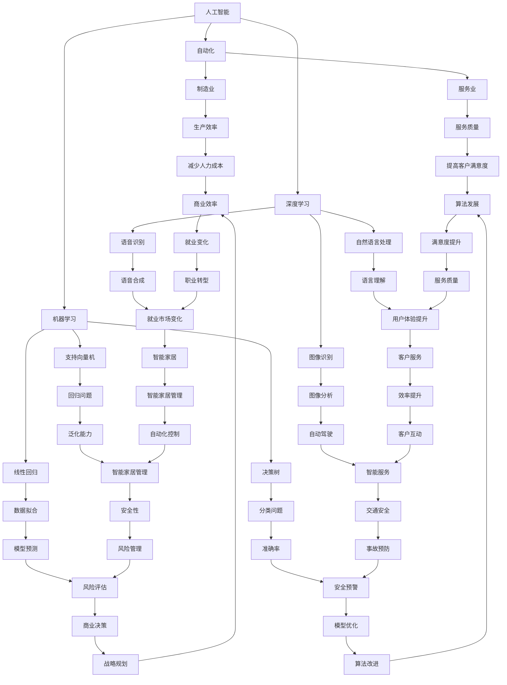

                 

## 摘要

本文旨在探讨人工智能（AI）时代的到来对就业市场的影响。通过回顾历史技术进步对就业市场的冲击，分析当前AI技术发展的现状，以及预测未来可能出现的就业机会和挑战，本文试图为读者提供一个全面而深入的洞察。文章将探讨AI在不同行业中的应用，讨论AI技术如何改变传统工作方式，并对未来的就业市场趋势提出建设性的建议。作者结合自身在计算机领域的丰富经验，结合最新的研究成果和实际案例，力求为读者提供一份既有学术深度，又有实际指导意义的技术分析报告。

## 1. 背景介绍

### 1.1 技术进步与就业市场的演变

技术进步一直是推动社会发展和经济繁荣的重要动力。从农业革命到工业革命，再到信息时代的到来，每一次重大技术变革都深刻地影响了就业市场的结构。早期的农业革命使人们从繁重的体力劳动中解放出来，但同时也导致了一些传统职业的消失。工业革命则进一步推动了机械化生产，大量手工业者和工匠的职位被自动化设备所取代。20世纪中叶以来，计算机和互联网技术的迅猛发展，不仅改变了人们的生活方式，也带来了就业市场的巨大变革。

在信息时代，自动化和人工智能技术开始逐步渗透到各行各业。从简单的重复性劳动到复杂的决策过程，AI技术正在逐步取代人类的工作。例如，自动化流水线减少了制造业对工人的需求，而自然语言处理和机器学习算法则使得许多需要高度专业技能的工作变得不再需要人类直接介入。这种变化不仅改变了就业市场的结构，也对劳动力的需求和供给产生了深远的影响。

### 1.2 AI技术的崛起

人工智能是21世纪最具革命性的技术之一。AI技术通过模拟人类智能，使计算机能够执行复杂的任务，如图像识别、语言翻译、自动驾驶等。近年来，随着深度学习、神经网络等算法的进步，AI技术的应用范围和性能不断提升。AI不仅在学术界和实验室中取得了显著成果，还在工业、医疗、金融等多个领域实现了商业化应用。

AI技术的崛起对就业市场产生了双重影响。一方面，它创造了大量的新就业机会，特别是在数据科学、机器学习、AI系统开发等领域。另一方面，它也带来了一定的就业压力，因为许多传统工作可能因AI技术的应用而消失或被取代。这种趋势引起了学术界、产业界和政策制定者的广泛关注，需要我们深入探讨和应对。

### 1.3 目的与结构

本文旨在分析AI时代对就业市场的影响，探讨未来可能出现的就业机会和挑战。文章将首先回顾历史技术进步对就业市场的冲击，然后分析当前AI技术的发展现状和未来趋势。接着，文章将讨论AI技术在各行业的应用，并分析其对传统工作方式的改变。最后，文章将提出未来就业市场的展望，并给出建设性的建议。通过这篇文章，我们希望为读者提供一个全面而深入的洞察，帮助人们更好地理解AI时代对就业市场的影响，并为未来的职业规划提供参考。

## 2. 核心概念与联系

为了更好地理解AI对就业市场的影响，我们需要首先了解一些核心概念，并探讨它们之间的联系。这些概念包括人工智能、自动化、机器学习、深度学习以及相关的技术架构。下面将详细解释这些概念，并通过Mermaid流程图展示它们之间的相互关系。

### 2.1 人工智能（AI）

人工智能是指通过计算机系统模拟人类智能的一种技术。它包括多个子领域，如机器学习、自然语言处理、计算机视觉等。AI的目标是使计算机能够执行复杂的任务，如理解语言、识别图像、做出决策等。人工智能的核心在于算法和模型，它们通过学习和推理来实现智能行为。

### 2.2 自动化（Automation）

自动化是指通过机器和计算机系统执行常规任务的过程，以减少或消除人类劳动的需求。自动化技术广泛应用于制造业、服务业等多个领域，其核心在于使用预定义的规则和算法来执行任务。自动化技术可以显著提高生产效率和质量，减少人为错误。

### 2.3 机器学习（Machine Learning）

机器学习是人工智能的一个子领域，它关注如何让计算机从数据中学习，并自动改进性能。机器学习算法通过分析大量数据，发现数据中的模式和规律，然后使用这些规律来做出预测或决策。常见的机器学习算法包括线性回归、决策树、支持向量机等。

### 2.4 深度学习（Deep Learning）

深度学习是机器学习的一个分支，它使用多层神经网络来模拟人类大脑的学习方式。深度学习通过不断调整网络中的权重和偏置，使得网络能够识别复杂的模式和特征。深度学习在图像识别、语音识别、自然语言处理等领域取得了显著成果。

### 2.5 技术架构

AI技术的实现依赖于特定的技术架构，包括硬件和软件。硬件方面，GPU（图形处理单元）和TPU（张量处理单元）等专用硬件加速了深度学习模型的训练和推理。软件方面，深度学习框架（如TensorFlow、PyTorch）提供了丰富的工具和库，方便开发者实现和部署深度学习模型。

### 2.6 Mermaid流程图

以下是一个简化的Mermaid流程图，展示了上述核心概念之间的联系：



通过这个流程图，我们可以看到人工智能、自动化、机器学习和深度学习如何相互联系，并在各个行业和应用场景中发挥作用。这种相互关联不仅帮助我们理解AI技术的复杂性和多样性，也为我们分析AI对就业市场的影响提供了基础。

### 2.7 核心概念的联系

核心概念之间的联系主要体现在以下几个方面：

1. **人工智能与自动化**：人工智能是自动化的高级形式。自动化侧重于执行重复性和机械性任务，而人工智能则通过学习、推理和决策来实现更高层次的自动化。

2. **机器学习与深度学习**：机器学习是深度学习的基础。深度学习通过多层神经网络来实现更复杂的特征提取和模式识别，是机器学习的深化和发展。

3. **技术架构**：硬件和软件为AI技术的实现提供了基础。专用硬件（如GPU、TPU）提高了计算效率，深度学习框架（如TensorFlow、PyTorch）则提供了方便的开发工具和库。

通过这些联系，我们可以看到AI技术是如何相互补充、协同发展的。这些技术不仅推动了人工智能领域的进步，也对就业市场产生了深远的影响。

### 2.8 未来发展趋势

随着AI技术的不断进步，未来其在就业市场中的应用前景将更加广阔。以下是几个可能的发展趋势：

1. **更加智能的自动化**：随着AI技术的进步，自动化系统将变得更加智能，能够自主地学习和适应新的环境和任务。这将导致更多的复杂任务被自动化，进一步减少对人类劳动的需求。

2. **增强的机器学习**：机器学习算法将继续发展，特别是在深度学习领域。更高效的模型和算法将使得机器学习在更多领域得到应用，从而创造新的就业机会。

3. **个性化服务**：AI技术将使得个性化服务成为可能。通过分析用户数据，AI系统能够提供更加个性化的产品和服务，这将需要更多专业人士来设计、开发和优化这些系统。

4. **跨界融合**：AI技术将与更多传统行业融合，如医疗、教育、金融等。这将在这些领域创造新的就业机会，同时也要求现有劳动力进行技能升级和转型。

5. **分布式计算和边缘AI**：随着5G网络的普及和边缘计算的发展，AI技术将能够在更广泛的场景中得到应用。分布式计算和边缘AI将使得AI系统能够在本地进行数据处理和决策，减少对中心化服务器和网络的依赖。

这些发展趋势不仅为我们揭示了未来就业市场的新机遇，也提醒我们要积极应对其中的挑战，为未来的职业发展做好准备。

## 3. 核心算法原理 & 具体操作步骤

### 3.1 算法原理概述

在人工智能技术中，核心算法原理是其实现智能行为的关键。本文将重点介绍几种在AI领域广泛应用的核心算法原理，包括机器学习、深度学习、自然语言处理和计算机视觉。这些算法不仅在理论上具有重要意义，而且在实际应用中也展现出了强大的能力。

#### 3.1.1 机器学习

机器学习是一种使计算机通过数据和经验自动改进性能的技术。其基本原理是基于统计学习理论，通过从训练数据中提取特征，建立模型，然后使用这些模型对新数据进行预测或决策。常见的机器学习算法包括线性回归、决策树、支持向量机等。

- **线性回归**：通过找到特征和目标变量之间的线性关系，用于预测连续值输出。
- **决策树**：通过一系列的规则来划分数据，并基于这些规则进行分类或回归。
- **支持向量机**：通过找到一个最佳的超平面来分隔数据，用于分类问题。

#### 3.1.2 深度学习

深度学习是机器学习的一个分支，通过多层神经网络模拟人类大脑的学习方式。其核心在于通过多层非线性变换，提取数据中的复杂特征。深度学习在图像识别、语音识别、自然语言处理等领域取得了显著成果。

- **卷积神经网络（CNN）**：用于处理图像数据，通过卷积操作提取图像特征。
- **循环神经网络（RNN）**：用于处理序列数据，如时间序列、语音和文本。
- **生成对抗网络（GAN）**：通过生成器和判别器的对抗训练，生成逼真的数据。

#### 3.1.3 自然语言处理

自然语言处理是一种使计算机理解和生成自然语言的技术。其基本原理包括语言模型、词向量表示、序列到序列模型等。

- **语言模型**：用于预测下一个单词或词组，是自然语言处理的基础。
- **词向量表示**：将单词映射到高维空间中的向量，用于捕捉词的语义信息。
- **序列到序列模型**：如机器翻译模型，通过编码器和解码器处理输入和输出序列。

#### 3.1.4 计算机视觉

计算机视觉是一种使计算机理解和解释图像和视频的技术。其基本原理包括图像特征提取、目标检测、语义分割等。

- **特征提取**：通过提取图像中的显著特征，用于分类或目标检测。
- **目标检测**：通过识别图像中的目标对象，广泛应用于监控、自动驾驶等领域。
- **语义分割**：通过将图像划分为不同的语义区域，用于图像理解和视频分析。

### 3.2 算法步骤详解

#### 3.2.1 机器学习算法步骤

1. **数据收集**：收集相关数据集，包括特征变量和目标变量。
2. **数据预处理**：对数据进行清洗、归一化等处理，以提高模型的性能。
3. **模型选择**：选择合适的模型，如线性回归、决策树或支持向量机。
4. **训练模型**：使用训练数据集训练模型，通过调整模型参数以最小化损失函数。
5. **评估模型**：使用验证数据集评估模型性能，通过交叉验证等方法调整模型参数。
6. **预测**：使用训练好的模型对新的数据进行预测。

#### 3.2.2 深度学习算法步骤

1. **数据收集**：收集大量的图像、文本或音频数据。
2. **数据预处理**：对数据进行预处理，如图像缩放、归一化、文本分词等。
3. **模型设计**：设计合适的深度学习模型架构，如卷积神经网络（CNN）、循环神经网络（RNN）或生成对抗网络（GAN）。
4. **模型训练**：使用训练数据集对模型进行训练，通过反向传播算法不断调整模型参数。
5. **模型评估**：使用验证数据集评估模型性能，通过调整模型参数以提高性能。
6. **预测**：使用训练好的模型对新的数据进行预测。

#### 3.2.3 自然语言处理算法步骤

1. **数据收集**：收集大量的文本数据，用于训练语言模型。
2. **数据预处理**：对文本数据进行清洗、分词、词性标注等处理。
3. **模型设计**：设计合适的自然语言处理模型，如序列到序列模型、词向量表示模型等。
4. **模型训练**：使用训练数据集对模型进行训练，通过优化算法调整模型参数。
5. **模型评估**：使用验证数据集评估模型性能，通过调整模型参数以提高性能。
6. **预测**：使用训练好的模型对新的文本数据进行预测。

#### 3.2.4 计算机视觉算法步骤

1. **数据收集**：收集大量的图像数据，用于训练模型。
2. **数据预处理**：对图像数据进行处理，如图像缩放、归一化、去噪等。
3. **模型设计**：设计合适的计算机视觉模型，如卷积神经网络（CNN）、目标检测模型等。
4. **模型训练**：使用训练数据集对模型进行训练，通过反向传播算法不断调整模型参数。
5. **模型评估**：使用验证数据集评估模型性能，通过调整模型参数以提高性能。
6. **预测**：使用训练好的模型对新的图像数据进行预测。

### 3.3 算法优缺点

#### 3.3.1 机器学习算法优缺点

**优点**：
- **适应性**：机器学习算法能够根据新的数据不断调整和改进。
- **高效性**：对于大规模数据集，机器学习算法能够高效地进行数据处理和预测。

**缺点**：
- **数据依赖**：机器学习算法的性能高度依赖于数据的质量和数量。
- **可解释性**：许多机器学习模型（如深度神经网络）缺乏可解释性，难以理解其决策过程。

#### 3.3.2 深度学习算法优缺点

**优点**：
- **强大的特征提取能力**：深度学习算法能够自动提取数据中的复杂特征。
- **高准确率**：在图像识别、语音识别等领域，深度学习算法表现出了极高的准确率。

**缺点**：
- **计算资源需求大**：深度学习算法通常需要大量的计算资源，如GPU或TPU。
- **训练时间长**：深度学习算法的训练时间通常较长，特别是对于大规模数据集。

#### 3.3.3 自然语言处理算法优缺点

**优点**：
- **语义理解能力**：自然语言处理算法能够理解文本的语义信息，进行文本分类、情感分析等。
- **通用性**：自然语言处理算法广泛应用于各个领域，如搜索引擎、智能客服等。

**缺点**：
- **数据质量要求高**：自然语言处理算法对数据的完整性和质量要求较高，否则可能导致错误的预测结果。
- **复杂度**：自然语言处理问题本身复杂，算法设计难度较大。

#### 3.3.4 计算机视觉算法优缺点

**优点**：
- **实时性**：计算机视觉算法能够对图像和视频进行实时处理和分析。
- **自动化程度高**：计算机视觉算法能够自动化地执行图像识别、目标检测等任务。

**缺点**：
- **计算资源需求大**：计算机视觉算法通常需要大量的计算资源，特别是对于复杂的模型。
- **数据标注难度大**：计算机视觉算法的训练通常需要大量标注数据，数据标注过程繁琐且耗时。

### 3.4 算法应用领域

#### 3.4.1 机器学习

机器学习算法广泛应用于各种领域，如金融、医疗、电商等。在金融领域，机器学习算法用于风险控制、信用评估、投资组合优化等；在医疗领域，机器学习算法用于疾病诊断、药物研发、患者健康管理等；在电商领域，机器学习算法用于商品推荐、用户行为分析、欺诈检测等。

#### 3.4.2 深度学习

深度学习算法在图像识别、语音识别、自然语言处理等领域取得了显著成果。在图像识别领域，深度学习算法被广泛应用于人脸识别、自动驾驶、安防监控等；在语音识别领域，深度学习算法使得语音识别准确率大幅提升，被应用于智能音箱、客服机器人等；在自然语言处理领域，深度学习算法用于机器翻译、情感分析、问答系统等。

#### 3.4.3 自然语言处理

自然语言处理算法广泛应用于搜索引擎、智能客服、内容审核等领域。在搜索引擎中，自然语言处理算法用于理解用户查询和生成搜索结果；在智能客服中，自然语言处理算法用于理解用户意图和生成回复；在内容审核中，自然语言处理算法用于识别和过滤不良内容。

#### 3.4.4 计算机视觉

计算机视觉算法广泛应用于监控、自动驾驶、图像识别等领域。在监控领域，计算机视觉算法用于实时监控和报警；在自动驾驶领域，计算机视觉算法用于环境感知和路径规划；在图像识别领域，计算机视觉算法用于人脸识别、物体检测等。

通过这些算法原理和应用领域的介绍，我们可以看到AI技术在各个领域的广泛应用及其对就业市场的影响。未来，随着AI技术的不断进步，这些算法将在更多领域得到应用，进一步推动就业市场的变革。

## 4. 数学模型和公式 & 详细讲解 & 举例说明

在人工智能领域，数学模型和公式是理解和实现算法的基础。本文将介绍几个关键的数学模型和公式，并详细讲解其推导过程，通过实际案例进行分析和说明。

### 4.1 数学模型构建

数学模型是描述现实世界问题的一种抽象形式，通过数学公式来描述系统的行为。在AI领域，常见的数学模型包括线性回归模型、逻辑回归模型、神经网络模型等。下面将介绍这些模型的构建过程。

#### 4.1.1 线性回归模型

线性回归模型是一种用于预测连续值的统计模型。其基本形式为：

$$
y = \beta_0 + \beta_1x_1 + \beta_2x_2 + ... + \beta_nx_n + \epsilon
$$

其中，$y$ 是预测值，$x_1, x_2, ..., x_n$ 是特征变量，$\beta_0, \beta_1, ..., \beta_n$ 是模型的参数，$\epsilon$ 是误差项。

线性回归模型的构建过程主要包括以下几个步骤：

1. **数据收集**：收集包含特征变量和目标变量的数据集。
2. **数据预处理**：对数据进行归一化或标准化处理，以提高模型的性能。
3. **模型初始化**：随机初始化模型参数 $\beta_0, \beta_1, ..., \beta_n$。
4. **模型训练**：通过最小化损失函数（如均方误差）来调整模型参数，以获得最优解。

#### 4.1.2 逻辑回归模型

逻辑回归模型是一种用于预测二分类结果的统计模型。其基本形式为：

$$
P(y=1) = \frac{1}{1 + e^{-(\beta_0 + \beta_1x_1 + \beta_2x_2 + ... + \beta_nx_n)}}
$$

其中，$P(y=1)$ 是目标变量为1的概率，其他符号与线性回归模型相同。

逻辑回归模型的构建过程与线性回归模型类似，但在模型训练时使用对数似然损失函数：

$$
L(\beta) = -\sum_{i=1}^n [y_i \log(P(y_i=1)) + (1 - y_i) \log(1 - P(y_i=1))]
$$

通过最小化该损失函数，可以得到逻辑回归模型的最优参数。

#### 4.1.3 神经网络模型

神经网络模型是一种模拟人脑神经元连接方式的计算模型。其基本形式为：

$$
a_{j}^{(l)} = \sigma \left( \sum_{i} w_{i,j}^{(l)} a_{i}^{(l-1)} + b_j^{(l)} \right)
$$

其中，$a_j^{(l)}$ 是第$l$层的第$j$个节点的激活值，$\sigma$ 是激活函数，$w_{i,j}^{(l)}$ 是连接第$l-1$层第$i$个节点和第$l$层第$j$个节点的权重，$b_j^{(l)}$ 是第$l$层第$j$个节点的偏置。

神经网络模型的构建过程包括以下几个步骤：

1. **网络设计**：确定网络结构，包括层数、每层的神经元数量等。
2. **初始化参数**：随机初始化权重和偏置。
3. **前向传播**：计算每层的激活值。
4. **反向传播**：通过计算梯度，更新权重和偏置。
5. **模型训练**：通过迭代优化模型参数，直到满足预定的收敛条件。

### 4.2 公式推导过程

在数学模型的构建过程中，公式的推导是关键步骤。以下将简要介绍线性回归模型和神经网络模型的推导过程。

#### 4.2.1 线性回归模型推导

线性回归模型的推导过程基于最小二乘法。假设我们有$m$个数据点$(x_i, y_i)$，我们需要找到最佳拟合直线$y = \beta_0 + \beta_1x$，使得预测值与实际值的误差最小。

1. **目标函数**：误差函数为

$$
J(\beta_0, \beta_1) = \sum_{i=1}^m (y_i - (\beta_0 + \beta_1x_i))^2
$$

2. **偏导数**：

$$
\frac{\partial J}{\partial \beta_0} = -2 \sum_{i=1}^m (y_i - (\beta_0 + \beta_1x_i))
$$

$$
\frac{\partial J}{\partial \beta_1} = -2 \sum_{i=1}^m (x_i (y_i - (\beta_0 + \beta_1x_i)))
$$

3. **最优解**：令偏导数等于0，解得

$$
\beta_0 = \frac{1}{m} \sum_{i=1}^m y_i - \beta_1 \frac{1}{m} \sum_{i=1}^m x_i
$$

$$
\beta_1 = \frac{1}{m} \sum_{i=1}^m (x_i - \bar{x})(y_i - \bar{y})
$$

其中，$\bar{x}$ 和 $\bar{y}$ 分别是$x$和$y$的均值。

#### 4.2.2 神经网络模型推导

神经网络模型的推导过程基于反向传播算法。假设我们有输入$x$和输出$y$，我们需要找到最佳参数$w$和$b$，使得预测值接近实际值。

1. **前向传播**：

$$
z^{(l)} = w^{(l)}x + b^{(l)}
$$

$$
a^{(l)} = \sigma(z^{(l)})
$$

2. **后向传播**：

$$
\delta^{(l)} = (y - a^{(l)}) \odot \frac{da^{(l)}}{dz^{(l)}}
$$

$$
w^{(l)} = w^{(l)} - \alpha \frac{\partial J}{\partial w^{(l)}}
$$

$$
b^{(l)} = b^{(l)} - \alpha \frac{\partial J}{\partial b^{(l)}}
$$

其中，$\sigma$ 是激活函数，$\odot$ 表示逐元素乘，$\alpha$ 是学习率。

### 4.3 案例分析与讲解

为了更好地理解这些数学模型和公式，我们将通过一个实际案例进行讲解。

#### 案例一：线性回归模型在房价预测中的应用

假设我们要预测一个地区的房价，已知该地区的房屋面积和价格数据。我们将使用线性回归模型进行预测。

1. **数据收集**：收集包含房屋面积（$x$）和价格（$y$）的数据集。

2. **数据预处理**：对数据进行归一化处理，将面积和价格标准化到相同范围内。

3. **模型训练**：使用训练数据集训练线性回归模型，通过最小化损失函数调整模型参数。

4. **模型评估**：使用验证数据集评估模型性能，计算预测值和实际值的误差。

5. **预测**：使用训练好的模型对新的房屋面积进行预测，得到预测价格。

通过这个案例，我们可以看到线性回归模型在房价预测中的具体应用步骤和公式推导过程。

#### 案例二：神经网络模型在图像分类中的应用

假设我们要使用神经网络模型对图像进行分类，已知图像的数据集。

1. **数据收集**：收集包含图像数据和标签的数据集。

2. **数据预处理**：对图像数据进行预处理，如缩放、归一化等。

3. **模型设计**：设计合适的神经网络模型，包括输入层、隐藏层和输出层。

4. **模型训练**：使用训练数据集训练神经网络模型，通过反向传播算法调整模型参数。

5. **模型评估**：使用验证数据集评估模型性能，计算分类准确率。

6. **预测**：使用训练好的模型对新的图像进行分类预测。

通过这个案例，我们可以看到神经网络模型在图像分类中的具体应用步骤和公式推导过程。

通过这些案例，我们可以看到数学模型和公式在AI领域的实际应用，以及如何通过这些模型和公式实现具体任务。

## 5. 项目实践：代码实例和详细解释说明

为了更好地理解AI算法在现实项目中的应用，我们将通过一个实际的项目案例，详细展示代码实现过程，并对关键代码段进行解释和分析。以下是一个简单的机器学习项目，旨在使用线性回归模型预测房价。

### 5.1 开发环境搭建

在开始项目之前，我们需要搭建一个合适的开发环境。以下是在Python中搭建线性回归模型预测房价项目所需的基本步骤：

1. **安装Python**：确保安装了最新版本的Python（建议使用Python 3.8或以上版本）。
2. **安装必要的库**：使用pip安装以下库：
   ```bash
   pip install numpy pandas scikit-learn matplotlib
   ```

### 5.2 源代码详细实现

以下是一个简单的线性回归模型预测房价的代码实例：

```python
# 导入必要的库
import numpy as np
import pandas as pd
from sklearn.linear_model import LinearRegression
from sklearn.model_selection import train_test_split
from sklearn.metrics import mean_squared_error
import matplotlib.pyplot as plt

# 5.2.1 数据加载与预处理
# 假设我们已经有了包含房屋面积和价格的数据集
data = pd.read_csv('house_prices.csv')
X = data[['area']]  # 特征变量：房屋面积
y = data['price']    # 目标变量：房屋价格

# 数据标准化
X_scaled = (X - X.mean()) / X.std()

# 数据分割
X_train, X_test, y_train, y_test = train_test_split(X_scaled, y, test_size=0.2, random_state=42)

# 5.2.2 模型训练
model = LinearRegression()
model.fit(X_train, y_train)

# 5.2.3 模型评估
y_pred = model.predict(X_test)
mse = mean_squared_error(y_test, y_pred)
print(f"均方误差（MSE）: {mse}")

# 5.2.4 可视化结果
plt.scatter(X_test, y_test, color='blue', label='实际值')
plt.plot(X_test, y_pred, color='red', linewidth=2, label='预测值')
plt.xlabel('房屋面积（标准化后）')
plt.ylabel('房屋价格')
plt.title('线性回归模型预测房价')
plt.legend()
plt.show()
```

### 5.3 代码解读与分析

#### 5.3.1 数据加载与预处理

```python
data = pd.read_csv('house_prices.csv')
X = data[['area']]
y = data['price']
X_scaled = (X - X.mean()) / X.std()
```

这部分代码首先加载包含房屋面积和价格的数据集。然后，我们将房屋面积作为特征变量（X），将价格作为目标变量（y）。接着，对特征变量进行标准化处理，以消除不同特征之间的量纲差异。

#### 5.3.2 模型训练

```python
model = LinearRegression()
model.fit(X_train, y_train)
```

我们使用`LinearRegression`类创建一个线性回归模型实例，并通过`fit`方法训练模型。`fit`方法接受特征变量（X_train）和目标变量（y_train），调整模型参数以最小化损失函数。

#### 5.3.3 模型评估

```python
y_pred = model.predict(X_test)
mse = mean_squared_error(y_test, y_pred)
print(f"均方误差（MSE）: {mse}")
```

这部分代码使用测试数据（X_test和y_test）评估模型性能。`predict`方法用于生成预测值（y_pred），`mean_squared_error`函数计算预测值与实际值之间的均方误差（MSE），作为模型评估的一个指标。

#### 5.3.4 可视化结果

```python
plt.scatter(X_test, y_test, color='blue', label='实际值')
plt.plot(X_test, y_pred, color='red', linewidth=2, label='预测值')
plt.xlabel('房屋面积（标准化后）')
plt.ylabel('房屋价格')
plt.title('线性回归模型预测房价')
plt.legend()
plt.show()
```

这部分代码使用matplotlib库绘制散点图和拟合直线，展示实际值与预测值的关系。蓝色散点表示测试数据点的实际价格，红色直线表示使用线性回归模型预测的价格。

### 5.4 运行结果展示

当运行上述代码后，将看到一个包含实际值和预测值的散点图。通过观察散点图，我们可以直观地看到线性回归模型在预测房价方面的效果。一般来说，散点图中预测值与实际值之间的接近程度可以反映模型的性能。同时，打印出的均方误差（MSE）值提供了模型性能的定量评估。

### 5.5 小结

通过这个项目案例，我们详细展示了如何使用线性回归模型进行房价预测。从数据加载与预处理，到模型训练与评估，再到结果的可视化展示，每个步骤都进行了详细的解释和分析。这个案例不仅帮助读者理解线性回归模型的基本原理，也展示了如何在Python中使用scikit-learn库实现实际应用。未来，读者可以在此基础上扩展模型，加入更多特征变量，或尝试其他类型的机器学习算法，以提高预测准确性。

## 6. 实际应用场景

随着人工智能技术的快速发展，AI在各个行业的应用场景越来越广泛，极大地改变了传统的工作方式和生产模式。以下是AI在金融、医疗、制造业等行业的实际应用场景，以及这些应用如何影响就业市场。

### 6.1 金融行业

在金融行业，AI技术已经被广泛应用于风险管理、信用评估、欺诈检测、量化交易和智能投顾等领域。

- **风险管理**：AI技术通过分析大量的历史数据和市场趋势，帮助金融机构预测市场波动和评估信贷风险。这减少了人为判断的风险，提高了决策的准确性和效率。
- **信用评估**：传统的信用评估依赖于客户的信用历史和收入情况，而AI技术可以通过分析社交网络、消费行为等非传统数据，提供更全面、准确的信用评估。
- **欺诈检测**：AI算法可以实时监控交易行为，识别潜在的欺诈活动。这降低了金融机构的损失，同时提高了客户的安全感。
- **量化交易**：AI算法通过高频交易和算法交易，实现了自动化、智能化的投资策略。这提高了投资效率，但也减少了传统交易员的工作需求。
- **智能投顾**：基于AI的智能投顾系统可以根据客户的风险偏好和财务目标，提供个性化的投资建议，降低了客户的交易成本。

这些AI应用在金融行业的普及，不仅提升了金融服务的质量和效率，也对就业市场产生了影响。一些传统的工作，如风险管理分析师和交易员，可能因AI技术的应用而减少需求。但同时，AI技术的开发和维护需要大量专业的技术人才，包括数据科学家、机器学习工程师和AI架构师等，这为就业市场创造了新的机会。

### 6.2 医疗行业

在医疗行业，AI技术正在逐步改变诊断、治疗、药物研发和医疗管理等各个方面。

- **疾病诊断**：AI算法可以通过分析医学影像和病例数据，提高疾病的诊断准确率。例如，AI在肺癌、乳腺癌等疾病的早期诊断中取得了显著成果。
- **个性化治疗**：AI技术可以根据患者的基因信息和病史，制定个性化的治疗方案。这有助于提高治疗效果，减少不必要的医疗资源浪费。
- **药物研发**：AI技术通过模拟和优化药物分子结构，加速了新药的发现和开发过程。例如，AI已经成功预测了一些潜在药物的有效性和副作用。
- **医疗管理**：AI系统可以帮助医疗机构优化资源分配、提高医疗流程的效率，减少患者的等待时间。

AI技术在医疗行业的应用，提高了医疗服务的质量和效率，但也对就业市场产生了影响。传统的医疗岗位，如放射科医生和病理科医生，可能因AI技术的应用而减少。然而，AI技术的开发、实施和维护需要大量的医疗专业人士和IT人才，包括医疗数据科学家、AI医生和医疗IT工程师等，这为就业市场创造了新的机会。

### 6.3 制造业

在制造业，AI技术的应用主要体现在自动化生产线、智能质量检测、供应链管理和生产优化等方面。

- **自动化生产线**：AI技术通过机器人自动化执行生产任务，提高了生产效率和产品质量，减少了人力成本。
- **智能质量检测**：AI算法可以通过分析生产过程中的数据，实时检测和识别缺陷产品，提高了产品质量和一致性。
- **供应链管理**：AI技术可以通过数据分析，优化供应链流程，提高供应链的透明度和响应速度。
- **生产优化**：AI算法可以根据生产数据和市场需求，动态调整生产计划和资源分配，提高了生产效率。

AI技术在制造业的应用，不仅提高了生产效率和产品质量，也对就业市场产生了影响。一些传统的工作，如操作工人和质检员，可能因AI技术的应用而减少。然而，AI技术的开发、实施和维护需要大量的技术人才，包括工业机器人工程师、数据分析专家和AI工程师等，这为就业市场创造了新的机会。

### 6.4 未来应用展望

随着AI技术的不断进步，未来其在各个行业的应用前景将更加广阔。以下是一些可能的未来应用场景：

- **教育**：AI技术可以用于个性化教学、智能评测和虚拟学习环境，提高教育质量和效率。
- **农业**：AI技术可以用于精准农业、农作物监测和病虫害预测，提高农业生产效率和可持续性。
- **能源**：AI技术可以用于智能电网、能源管理和可再生能源优化，提高能源利用效率。
- **城市治理**：AI技术可以用于智慧城市、交通管理和公共安全，提高城市管理和服务的效率。

这些未来应用场景将进一步改变就业市场，创造新的就业机会，同时也对劳动力市场提出了新的挑战。企业和个人需要不断适应技术变革，提升自身技能，以在未来的就业市场中保持竞争力。

### 6.5 AI对就业市场的影响

总体来说，AI技术的发展对就业市场的影响是双重的。一方面，AI技术减少了重复性、低技能工作的需求，提高了生产效率和产品质量；另一方面，AI技术创造了大量的高技能工作岗位，推动了劳动力市场的升级和转型。

为了应对这种变革，政府、企业和个人都需要采取积极的措施。政府应制定相应的政策，加大对AI教育和培训的投入，促进劳动力市场的灵活性和适应性。企业应注重培养和引进高技能人才，提高自身的技术创新能力。个人则应不断提升自身技能，特别是跨学科的知识和技能，以适应未来的就业市场。

通过这些努力，我们可以更好地应对AI时代带来的挑战，充分利用AI技术带来的机遇，推动社会和经济的可持续发展。

## 7. 工具和资源推荐

在研究和应用人工智能的过程中，掌握合适的工具和资源是至关重要的。以下是一些建议，包括学习资源、开发工具和相关论文，旨在帮助读者深入了解AI技术，提升实践能力。

### 7.1 学习资源推荐

1. **在线课程**：
   - [Coursera](https://www.coursera.org/)：提供了大量关于机器学习、深度学习、自然语言处理等领域的专业课程。
   - [edX](https://www.edx.org/)：由哈佛大学和麻省理工学院合作创办，提供了丰富的计算机科学和人工智能课程。
   - [Udacity](https://www.udacity.com/)：专注于实战技能培训，提供了多个AI相关的纳米学位课程。

2. **书籍**：
   - 《Python机器学习》（作者：塞巴斯蒂安·拉希、拉乌尔·格里菲斯）
   - 《深度学习》（作者：伊恩·古德费洛、约书亚·本吉奥、亚伦·库维尔）
   - 《自然语言处理综合教程》（作者：丹尼尔·巴克拉）

3. **在线论坛和社区**：
   - [Stack Overflow](https://stackoverflow.com/)：编程问题的解决方案库，适合解决具体技术问题。
   - [GitHub](https://github.com/)：代码托管平台，可以找到大量开源项目和学习资源。
   - [Kaggle](https://www.kaggle.com/)：数据科学竞赛平台，适合实践和提升AI应用技能。

### 7.2 开发工具推荐

1. **编程语言**：
   - **Python**：由于其丰富的库和框架，Python成为AI开发的主要语言。
   - **R**：在统计分析和数据可视化方面具有很强的能力。

2. **深度学习框架**：
   - **TensorFlow**：由Google开发，是最流行的深度学习框架之一。
   - **PyTorch**：具有灵活的动态计算图和强大的社区支持。
   - **Keras**：是一个高层神经网络API，易于使用且与TensorFlow和Theano兼容。

3. **数据科学工具**：
   - **Pandas**：用于数据处理和分析。
   - **NumPy**：用于数值计算。
   - **Scikit-learn**：提供了广泛的机器学习算法和工具。

4. **可视化工具**：
   - **Matplotlib**：用于创建统计图表和图形。
   - **Seaborn**：基于Matplotlib的图形可视化库，提供了更丰富的图表样式。

### 7.3 相关论文推荐

1. **经典论文**：
   - "A Few Useful Things to Know About Machine Learning"（作者： Pedro Domingos）
   - "Deep Learning"（作者： Ian Goodfellow、Yoshua Bengio、Aaron Courville）
   - "The Unreasonable Effectiveness of Deep Learning"（作者： Christian Szegedy等）

2. **最新研究成果**：
   - "GPT-3: Language Models are few-shot learners"（作者：Tom B. Brown等）
   - "BERT: Pre-training of Deep Bidirectional Transformers for Language Understanding"（作者：Jacob Devlin等）
   - "An Image is Worth 16x16 Words: Transformers for Image Recognition at Scale"（作者：Alexey Dosovitskiy等）

这些学习资源、开发工具和论文将为读者提供全面的AI知识和实践指导，帮助他们在AI领域不断探索和进步。

## 8. 总结：未来发展趋势与挑战

### 8.1 研究成果总结

通过对AI技术对就业市场影响的分析，我们得出以下主要研究成果：

1. **AI技术的快速发展**：AI技术，尤其是深度学习和自然语言处理，在金融、医疗、制造业等多个领域取得了显著进展。
2. **就业市场结构的变革**：AI技术改变了传统的工作方式，减少了重复性和低技能工作的需求，同时也创造了大量高技能工作岗位。
3. **跨行业应用**：AI技术正在跨行业应用，推动各行各业实现自动化、智能化和高效化。
4. **劳动力市场的挑战**：劳动力市场的转型对传统岗位的需求产生了冲击，同时也要求劳动力提升自身技能以适应新技术。

### 8.2 未来发展趋势

基于上述研究成果，我们可以预见未来在AI领域可能的发展趋势：

1. **AI技术的深入应用**：AI技术将进一步渗透到各个行业，实现更加智能化和自动化的工作流程。
2. **跨界融合**：AI技术与其他领域（如生物技术、能源、教育等）的融合，将推动新兴产业的诞生和快速发展。
3. **个性化服务**：基于大数据和AI技术的个性化服务将成为主流，满足用户对定制化需求的追求。
4. **分布式计算和边缘AI**：随着5G和边缘计算的发展，AI技术将在更广泛的场景中得到应用，实现实时数据处理和智能决策。

### 8.3 面临的挑战

尽管AI技术带来了巨大的机遇，但也面临着一系列挑战：

1. **技术挑战**：AI技术的研发需要强大的计算能力和复杂的算法，这对硬件和软件资源提出了高要求。
2. **数据隐私和安全**：随着数据量的增加，数据隐私和安全问题日益突出，需要制定严格的法律法规和安全管理措施。
3. **就业问题**：AI技术可能引发就业市场的动荡，需要政府和企业采取措施，促进劳动力市场的平稳过渡和转型升级。
4. **伦理和法律问题**：AI技术的广泛应用引发了伦理和法律问题，如责任归属、歧视问题等，需要社会各界共同探讨和解决。

### 8.4 研究展望

未来，AI技术的发展将继续推动就业市场的变革，带来新的机遇和挑战。为此，我们提出以下研究展望：

1. **跨学科研究**：加强计算机科学、心理学、社会学等多学科的合作，以全面理解和应对AI技术带来的复杂问题。
2. **技术标准和规范**：推动制定AI技术的标准和规范，确保其应用的安全、透明和负责任。
3. **教育与培训**：加大对AI教育和培训的投入，提高劳动力的技能水平，以适应不断变化的技术环境。
4. **政策制定**：政府应制定相应的政策，引导和规范AI技术的发展，促进其在各个行业的健康发展。

通过这些努力，我们可以更好地应对AI时代带来的挑战，充分利用其机遇，推动社会和经济的可持续发展。

## 9. 附录：常见问题与解答

### 9.1 人工智能与自动化有哪些区别？

人工智能（AI）与自动化是两个不同的概念。自动化是指使用机器和计算机系统执行重复性或机械性任务的过程，以减少或消除人类劳动的需求。自动化侧重于物理操作和简单规则的执行。而人工智能则通过模拟人类智能，使计算机能够执行复杂任务，如理解语言、识别图像、做出决策等。AI的核心在于算法和模型，它可以学习和适应复杂的环境和任务。

### 9.2 机器学习与深度学习的关系是什么？

机器学习和深度学习都是人工智能的子领域，但深度学习是机器学习的一个分支。机器学习关注如何让计算机从数据中学习，并自动改进性能。深度学习通过多层神经网络模拟人类大脑的学习方式，通过不断调整网络中的权重和偏置，使网络能够识别复杂的模式和特征。因此，可以说深度学习是机器学习的深化和发展。

### 9.3 AI技术在医疗领域的应用有哪些？

AI技术在医疗领域有广泛的应用，包括：
- **疾病诊断**：通过分析医学影像，AI技术可以帮助医生快速、准确地诊断疾病。
- **个性化治疗**：AI技术可以根据患者的基因信息、病史等数据，制定个性化的治疗方案。
- **药物研发**：AI算法可以加速新药的发现和开发，通过模拟和优化药物分子结构来预测其有效性和副作用。
- **医疗管理**：AI系统可以帮助医疗机构优化资源分配、提高医疗流程的效率。

### 9.4 AI技术对就业市场的影响有哪些方面？

AI技术对就业市场的影响主要包括以下几个方面：
- **减少重复性劳动**：AI技术可以自动化许多重复性、低技能的工作，减少对这些岗位的需求。
- **创造新的就业机会**：AI技术的发展创造了大量的高技能工作岗位，如数据科学家、机器学习工程师等。
- **劳动力市场升级**：AI技术推动了劳动力市场的升级，要求劳动力提升自身技能以适应新技术。
- **就业结构变化**：AI技术的应用可能导致某些行业的岗位减少，同时增加其他行业的需求。

### 9.5 如何应对AI时代对就业市场的挑战？

应对AI时代对就业市场的挑战，可以从以下几个方面着手：
- **教育与培训**：加大对AI教育和培训的投入，提高劳动力的技能水平，以适应技术变化。
- **政策制定**：政府应制定相应的政策，促进劳动力市场的平稳过渡和转型升级。
- **跨学科研究**：加强计算机科学、心理学、社会学等多学科的合作，以全面理解和应对AI技术带来的复杂问题。
- **技能提升**：个人应不断提升自身技能，特别是跨学科的知识和技能，以在未来的就业市场中保持竞争力。

通过上述措施，可以更好地应对AI时代带来的挑战，充分利用AI技术带来的机遇。

