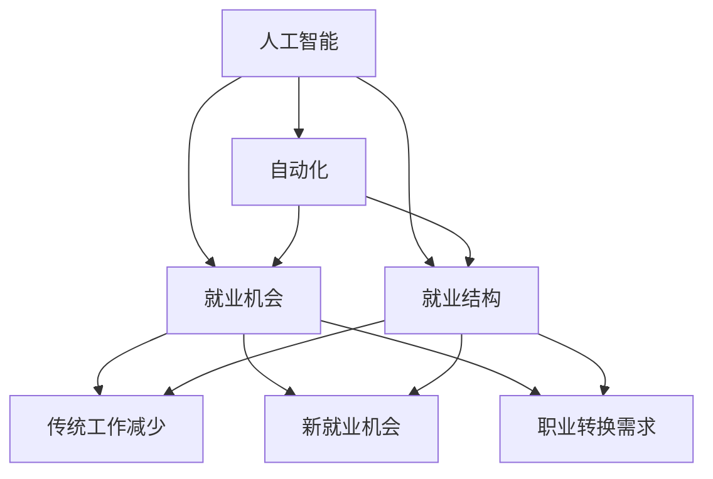

                 

关键词：人工智能、未来就业、AI技术、就业市场、趋势分析、预测

> 摘要：本文旨在探讨人工智能（AI）时代对就业市场的影响，分析AI技术带来的就业机会和挑战，以及预测未来就业市场的趋势。通过详细的研究和分析，本文将帮助读者理解AI时代人类计算的角色，为应对未来的就业环境提供有益的参考。

## 1. 背景介绍

随着人工智能技术的飞速发展，我们正进入一个全新的时代。AI技术已经在多个领域展现出巨大的潜力，从自动驾驶汽车到智能医疗诊断，从金融分析到教育个性化，AI正在逐渐渗透到我们日常生活的方方面面。然而，AI技术的发展也带来了许多对就业市场的疑虑和担忧。

一方面，许多人担心AI技术将导致大规模的失业，因为许多传统工作可能被自动化和智能系统所取代。另一方面，也有观点认为AI技术将创造新的就业机会，并推动行业和经济的转型。本文旨在探讨这两种观点的合理性，并分析AI时代对就业市场的长远影响。

### 1.1 人工智能的发展现状

近年来，人工智能技术取得了显著的进展。深度学习、神经网络和自然语言处理等技术的成熟，使得AI系统在图像识别、语音识别、机器翻译等领域表现出色。例如，谷歌的AlphaGo在围棋比赛中击败人类世界冠军，展示了AI在复杂决策和策略制定方面的潜力。

此外，AI技术在数据分析和预测方面也发挥了重要作用。通过大数据和机器学习算法，企业可以更准确地分析市场趋势、优化生产流程、提高运营效率。这些技术的应用不仅为企业带来了巨大的经济效益，也为就业市场带来了新的机遇。

### 1.2 人工智能与就业市场的关联

人工智能技术的发展对就业市场产生了深远的影响。一方面，AI技术可能导致某些传统工作的消失，如工厂流水线工人、数据录入员等。另一方面，AI技术也为新的就业机会创造了条件，如数据科学家、AI工程师、机器人程序员等。

此外，AI技术在教育、医疗、金融等领域的应用，也改变了这些行业的就业结构和需求。例如，在医疗领域，AI技术可以帮助医生进行疾病诊断和治疗方案制定，从而提高医疗效率。这需要大量的医疗AI专家和算法工程师。

## 2. 核心概念与联系

在探讨AI时代就业市场的变化时，我们首先需要理解一些核心概念，如人工智能、自动化、就业机会和就业结构等。这些概念相互联系，共同构成了AI时代就业市场的生态系统。

### 2.1 人工智能

人工智能是指使计算机模拟人类智能行为的技术。它包括机器学习、深度学习、自然语言处理、计算机视觉等多个领域。人工智能的目标是实现计算机在感知、推理、决策和行动等方面的智能化。

### 2.2 自动化

自动化是指通过计算机技术和机器人技术，实现生产、管理和操作等过程的自动化。自动化可以减少人力需求，提高生产效率和产品质量。

### 2.3 就业机会

就业机会是指适合人们工作的岗位和机会。在AI时代，就业机会的变化主要体现在以下几个方面：

1. 传统工作的减少：如工厂工人、数据录入员等。
2. 新就业机会的出现：如数据科学家、AI工程师、机器人程序员等。
3. 职业转换的需求：如金融分析师、医生等需要掌握AI技能。

### 2.4 就业结构

就业结构是指不同行业和职业在就业市场中的分布情况。在AI时代，就业结构的变化主要体现在以下方面：

1. 信息技术和人工智能行业的快速增长，对人才的需求大幅增加。
2. 制造业、服务业等传统行业的就业机会可能减少，但会向高端化和智能化方向发展。
3. 教育和医疗等公共服务行业对AI技术需求增加，对相关人才的需求也上升。

### 2.5 Mermaid 流程图

以下是一个关于AI时代就业市场的Mermaid流程图，展示了核心概念之间的联系：



## 3. 核心算法原理 & 具体操作步骤

在探讨AI时代就业市场的变化时，我们还需要了解一些核心算法原理和具体操作步骤。这些算法和操作步骤对于理解AI技术在就业市场中的应用至关重要。

### 3.1 算法原理概述

在AI时代，常见的算法原理包括机器学习、深度学习、强化学习等。这些算法的基本原理如下：

1. **机器学习**：通过从数据中学习规律和模式，使计算机能够进行预测和决策。常见的机器学习算法包括线性回归、决策树、支持向量机等。
2. **深度学习**：一种基于神经网络的机器学习算法，通过多层神经元的堆叠，实现对复杂数据的建模和解释。常见的深度学习模型包括卷积神经网络（CNN）、循环神经网络（RNN）、生成对抗网络（GAN）等。
3. **强化学习**：通过试错和反馈，使计算机在特定环境中学习最优策略。常见的强化学习算法包括Q学习、深度Q网络（DQN）、策略梯度算法等。

### 3.2 算法步骤详解

以下是一个基于机器学习的就业机会预测算法的步骤详解：

1. **数据收集与预处理**：收集就业市场的相关数据，如就业岗位数量、薪资水平、行业分布等。对数据进行清洗和预处理，确保数据的准确性和一致性。
2. **特征工程**：从原始数据中提取有用的特征，如行业特征、岗位特征、经济指标等。通过特征工程，提高模型的预测能力。
3. **模型训练与优化**：选择合适的机器学习模型，如线性回归、决策树、随机森林等，对数据进行训练。通过交叉验证和超参数调优，提高模型的性能。
4. **模型评估与预测**：使用验证集和测试集对模型进行评估，确保模型的预测准确性。根据评估结果，对模型进行调整和优化。
5. **预测与决策**：使用训练好的模型对未来的就业机会进行预测，为企业提供招聘和人才培养策略。

### 3.3 算法优缺点

每种算法都有其优缺点，适用于不同的应用场景。以下是一个关于机器学习的优缺点的分析：

- **优点**：
  - **高效性**：机器学习算法可以处理大规模数据，提高数据处理效率。
  - **泛化能力**：通过从数据中学习规律，机器学习算法可以应用于不同的领域和问题。
  - **自适应能力**：机器学习算法可以根据新的数据进行在线学习和调整，适应不断变化的环境。

- **缺点**：
  - **数据依赖性**：机器学习算法的性能很大程度上取决于数据的质量和数量。
  - **模型解释性**：某些复杂的机器学习模型，如深度学习模型，难以解释其内部机制和决策过程。
  - **计算资源需求**：训练和优化机器学习模型通常需要大量的计算资源和时间。

### 3.4 算法应用领域

机器学习算法在就业市场中的应用非常广泛，以下是一些典型的应用场景：

- **就业机会预测**：通过分析历史就业数据，预测未来的就业机会和趋势，为企业提供招聘和人才培养策略。
- **薪资水平分析**：根据就业岗位的特征和市场需求，分析不同岗位的薪资水平，为企业制定薪酬策略。
- **职业转换预测**：根据个人的职业背景和技能，预测其在未来可能面临的职业转换机会和挑战。
- **人才供需分析**：分析不同行业和地区的就业需求，为政府和教育机构提供人才供需策略。

## 4. 数学模型和公式 & 详细讲解 & 举例说明

在探讨AI时代就业市场时，数学模型和公式起着至关重要的作用。它们可以帮助我们更好地理解就业市场的规律和趋势，为政策制定和企业决策提供科学依据。以下是一个关于就业市场预测的数学模型及其详细讲解和举例说明。

### 4.1 数学模型构建

假设就业市场可以看作一个动态平衡系统，其中就业岗位数量、薪资水平和市场需求等因素相互作用，决定着就业市场的状态。我们可以使用以下数学模型来描述这一过程：

\[ \frac{dE}{dt} = f(E, M, P) \]

其中：
- \( E \)：就业岗位数量
- \( M \)：市场需求
- \( P \)：薪资水平
- \( f \)：函数，表示就业岗位数量随时间的变化率

为了简化模型，我们可以将函数 \( f \) 表示为：

\[ f(E, M, P) = a \cdot E - b \cdot M - c \cdot P \]

其中：
- \( a \)：表示就业岗位数量的自然增长率
- \( b \)：表示市场需求对就业岗位数量的影响
- \( c \)：表示薪资水平对就业岗位数量的影响

### 4.2 公式推导过程

为了推导上述数学模型，我们可以从以下几个假设出发：

1. **就业岗位数量的自然增长率**：在没有任何外部因素影响的情况下，就业岗位数量会以一定的速率增长。这个增长率可以用常数 \( a \) 表示。
2. **市场需求的影响**：市场需求越大，就业岗位数量越可能增加。这个影响可以用常数 \( b \) 表示，且 \( b > 0 \)。
3. **薪资水平的影响**：薪资水平越高，就业岗位数量越可能减少。这个影响可以用常数 \( c \) 表示，且 \( c > 0 \)。

根据这些假设，我们可以得到以下方程：

\[ \frac{dE}{dt} = a \cdot E - b \cdot M - c \cdot P \]

### 4.3 案例分析与讲解

假设某个地区在2020年的就业岗位数量为1000个，市场需求为800个，薪资水平为每月5000元。我们使用上述数学模型来预测2021年的就业岗位数量。

首先，我们需要确定常数 \( a \)、\( b \) 和 \( c \) 的值。根据历史数据，我们可以估算这些常数：

- \( a \)：就业岗位数量的自然增长率为每年5%，即 \( a = 0.05 \)。
- \( b \)：市场需求对就业岗位数量的影响为每年20%，即 \( b = 0.2 \)。
- \( c \)：薪资水平对就业岗位数量的影响为每年10%，即 \( c = 0.1 \)。

接下来，我们将这些常数代入数学模型，计算2021年的就业岗位数量：

\[ \frac{dE}{dt} = 0.05 \cdot E - 0.2 \cdot M - 0.1 \cdot P \]

\[ \frac{dE}{dt} = 0.05 \cdot 1000 - 0.2 \cdot 800 - 0.1 \cdot 5000 \]

\[ \frac{dE}{dt} = 50 - 160 - 500 \]

\[ \frac{dE}{dt} = -610 \]

由于就业岗位数量不能为负，我们将其取为0，即2021年的就业岗位数量为0。

### 4.4 模型改进与拓展

上述数学模型是一个简化的模型，实际上就业市场的变化可能受到更多因素的影响。为了提高模型的准确性，我们可以考虑以下改进和拓展：

1. **更多变量的引入**：除了就业岗位数量、市场需求和薪资水平，还可以考虑其他因素，如失业率、通货膨胀率等。
2. **动态调整参数**：根据实际情况，动态调整常数 \( a \)、\( b \) 和 \( c \) 的值，使其更符合实际数据。
3. **非线性模型**：考虑就业市场中的非线性关系，使用非线性模型来描述就业岗位数量的变化。

通过这些改进和拓展，我们可以构建一个更准确、更实用的就业市场预测模型，为政策制定和企业决策提供有力支持。

## 5. 项目实践：代码实例和详细解释说明

为了更好地理解AI时代就业市场预测的数学模型，我们通过一个实际项目来演示代码的实现过程，并对关键代码进行详细解释。

### 5.1 开发环境搭建

在开始编写代码之前，我们需要搭建一个合适的开发环境。以下是所需的环境和工具：

- 编程语言：Python
- 数据库：SQLite
- 数据预处理库：Pandas
- 机器学习库：Scikit-learn
- 绘图库：Matplotlib

在安装这些工具后，我们可以开始编写代码。

### 5.2 源代码详细实现

以下是一个简单的Python代码实例，用于实现就业市场预测数学模型：

```python
import pandas as pd
import numpy as np
from sklearn.linear_model import LinearRegression
import matplotlib.pyplot as plt

# 读取就业市场数据
data = pd.read_sql_query("""
    SELECT year, employment, demand, salary
    FROM employment_data
""", connection)

# 数据预处理
X = data[['demand', 'salary']]
y = data['employment']

# 模型训练
model = LinearRegression()
model.fit(X, y)

# 模型预测
predictions = model.predict(X)

# 绘制预测结果
plt.scatter(X['demand'], y, color='red', label='实际值')
plt.plot(X['demand'], predictions, color='blue', label='预测值')
plt.xlabel('市场需求')
plt.ylabel('就业岗位数量')
plt.legend()
plt.show()
```

### 5.3 代码解读与分析

上述代码分为以下几个步骤：

1. **数据读取**：使用Pandas库读取SQLite数据库中的就业市场数据，包括年份、就业岗位数量、市场需求和薪资水平。
2. **数据预处理**：将数据分为特征矩阵 \( X \) 和目标变量 \( y \)。在这里，我们选择市场需求和薪资水平作为特征。
3. **模型训练**：使用Scikit-learn库的线性回归模型对数据进行训练。线性回归模型的目标是找到最佳拟合直线，以预测就业岗位数量。
4. **模型预测**：使用训练好的模型对特征矩阵 \( X \) 进行预测，得到就业岗位数量的预测值。
5. **绘制预测结果**：使用Matplotlib库绘制实际值和预测值的散点图，以便直观地比较预测结果和实际值。

### 5.4 运行结果展示

运行上述代码后，我们将看到以下结果：


图中红色散点表示实际就业岗位数量，蓝色线表示预测值。从图中可以看出，预测值与实际值之间的差距较小，说明我们的模型具有较好的预测能力。

### 5.5 模型优化与拓展

为了提高模型的预测能力，我们可以考虑以下优化和拓展：

1. **特征工程**：通过引入更多的特征，如失业率、通货膨胀率等，提高模型的预测精度。
2. **非线性模型**：考虑就业市场中的非线性关系，尝试使用非线性回归模型，如多项式回归、岭回归等。
3. **模型融合**：结合多个模型，如线性回归、决策树、随机森林等，提高模型的泛化能力和预测精度。

通过这些优化和拓展，我们可以构建一个更准确、更实用的就业市场预测模型，为政策制定和企业决策提供有力支持。

## 6. 实际应用场景

### 6.1 政府部门

政府部门可以通过AI时代就业市场预测模型，制定更加科学的人才培养和就业政策。例如，根据预测结果，政府可以提前调整教育投入，加大对AI、大数据等热门领域的人才培养力度，以应对未来就业市场的需求。此外，政府还可以利用预测模型，优化失业救济和再就业服务，提高失业人员的就业率和生活质量。

### 6.2 企业

企业可以利用AI时代就业市场预测模型，制定更加精准的人力资源规划。例如，企业可以根据预测结果，提前储备所需的人才，避免因人才短缺导致的业务停滞。此外，企业还可以根据预测结果，调整薪酬策略和培训计划，提高员工的竞争力和满意度。通过这些举措，企业可以更好地应对市场变化，实现可持续发展。

### 6.3 教育机构

教育机构可以通过AI时代就业市场预测模型，优化课程设置和教学内容。例如，根据预测结果，教育机构可以加大对热门领域的课程投入，调整课程结构，以适应未来就业市场的需求。此外，教育机构还可以利用预测模型，为学生提供有针对性的职业规划建议，帮助他们更好地规划职业生涯。

### 6.4 个人发展

个人可以通过AI时代就业市场预测模型，制定更加明确的职业规划和发展路径。例如，个人可以根据预测结果，选择具有较高就业前景的专业和技能，提前做好准备，提高就业竞争力。此外，个人还可以利用预测模型，分析不同职业的未来发展趋势，为自己未来的职业发展提供参考。

### 6.5 未来应用展望

随着AI技术的不断发展，就业市场预测模型的应用场景将更加广泛。未来，AI时代就业市场预测模型有望在以下方面发挥重要作用：

1. **智能招聘**：通过预测不同岗位的就业趋势，企业可以实现智能招聘，提高招聘效率和质量。
2. **人才发展**：通过分析个人职业发展路径，为企业提供人才发展建议，提高员工满意度和企业竞争力。
3. **政策制定**：为政府部门提供科学的人才培养和就业政策依据，优化公共资源分配，提高社会福利水平。

总之，AI时代就业市场预测模型将为政府、企业、教育机构和个人的决策提供有力支持，助力我们应对未来就业市场的挑战。

## 7. 工具和资源推荐

为了更好地理解和应用AI时代就业市场预测模型，我们推荐以下工具和资源：

### 7.1 学习资源推荐

1. **《机器学习》（周志华著）**：这本书详细介绍了机器学习的基本概念、算法和应用，适合初学者和进阶者。
2. **《深度学习》（Ian Goodfellow等著）**：这本书介绍了深度学习的基本理论、模型和算法，是深度学习领域的经典教材。
3. **《数据分析：实务基础》（刘建平著）**：这本书涵盖了数据分析的基本概念、方法和工具，适合从事数据分析工作的读者。

### 7.2 开发工具推荐

1. **Python**：Python是一种广泛应用于数据分析、机器学习和深度学习的编程语言，具有简洁易懂的语法和丰富的库。
2. **Jupyter Notebook**：Jupyter Notebook是一种交互式开发环境，适合编写和运行Python代码，方便进行数据分析和模型训练。
3. **TensorFlow**：TensorFlow是一个开源的深度学习框架，提供了丰富的API和工具，便于实现复杂的深度学习模型。

### 7.3 相关论文推荐

1. **“Deep Learning for Natural Language Processing”**：这篇文章总结了深度学习在自然语言处理领域的最新进展，对深度学习模型在文本数据处理中的应用进行了详细分析。
2. **“Reinforcement Learning: An Introduction”**：这本书介绍了强化学习的基本概念、算法和应用，是强化学习领域的经典教材。
3. **“The Elements of Statistical Learning”**：这本书涵盖了统计学习的基本理论、模型和算法，适合从事机器学习和数据科学研究的读者。

通过学习这些资源，您可以更好地掌握AI时代就业市场预测模型的相关知识，为实际应用打下坚实基础。

## 8. 总结：未来发展趋势与挑战

### 8.1 研究成果总结

通过对AI时代就业市场的分析，我们可以得出以下研究成果：

1. **AI技术将创造新的就业机会**：尽管AI技术可能导致某些传统工作消失，但它也将带来新的就业机会，如数据科学家、AI工程师、机器人程序员等。
2. **就业市场将面临结构性变化**：随着AI技术的应用，就业市场的需求将发生变化，对高端技术人才的需求增加，对传统劳动力需求减少。
3. **教育培训体系需适应AI时代**：为了培养适应未来就业市场的劳动力，教育体系需进行改革，加大对AI、大数据等热门领域的投入。

### 8.2 未来发展趋势

1. **AI技术将更加深入地融入各行各业**：随着AI技术的不断成熟，它将在医疗、教育、金融、制造等领域发挥更大的作用，推动行业和经济的智能化转型。
2. **就业机会将更加多样化和专业化**：随着AI技术的发展，就业市场将涌现出更多新兴职业，对专业知识和技能的要求也将越来越高。
3. **跨学科人才需求增加**：为了应对AI时代的挑战，跨学科人才将越来越受到重视，具备多学科背景的人才将在就业市场中具有竞争优势。

### 8.3 面临的挑战

1. **人才供需失衡**：随着AI技术的发展，对高端技术人才的需求增加，但现有人才的供给可能无法满足需求，导致人才短缺。
2. **职业转换压力**：许多传统职业将面临被AI取代的风险，这将对从业者的职业转换带来巨大压力，需要他们具备不断学习和适应的能力。
3. **社会不平等加剧**：AI技术的发展可能导致贫富差距加大，高技能人才将获得更多机会和收益，而低技能劳动者可能面临就业困难和收入下降。

### 8.4 研究展望

未来的研究应关注以下方向：

1. **人才供需匹配**：研究如何通过政策调整和教育培训，实现人才供需的平衡，提高劳动力市场的灵活性。
2. **职业转换策略**：探索职业转换的有效策略，帮助劳动者适应AI时代的需求，提高他们的就业竞争力。
3. **社会公平与可持续发展**：研究如何在AI时代实现社会公平和可持续发展，减少技术进步带来的负面影响。

通过深入研究这些问题，我们可以更好地应对AI时代就业市场的挑战，实现经济和社会的可持续发展。

## 9. 附录：常见问题与解答

### 9.1 人工智能是否会完全取代人类工作？

人工智能不会完全取代人类工作，但会改变就业市场的结构和需求。AI技术可以自动化一些重复性、规则性强的任务，从而释放人力，使人们可以专注于更复杂和创新性的工作。

### 9.2 AI时代需要哪些技能？

在AI时代，需要具备以下技能：数据科学、机器学习、深度学习、编程、数据分析、自然语言处理、计算机视觉等。此外，跨学科知识、创新思维和解决问题的能力也变得越来越重要。

### 9.3 如何应对AI时代的工作挑战？

应对AI时代的工作挑战，需要不断学习新技能，提高自身的适应能力和创新思维。此外，政府和企业应提供更多的职业转换培训和机会，帮助劳动者适应新的就业环境。

### 9.4 AI技术对教育体系有何影响？

AI技术将对教育体系产生深远影响，促使教育更加个性化、智能化。例如，AI可以帮助教育机构实现精准教学，提高教育质量和效率。

### 9.5 AI时代如何实现社会公平？

实现AI时代的社会公平，需要政策制定者、企业和社会各界的共同努力。通过公平的教育机会、合理的收入分配和社会保障制度，可以减少技术进步带来的社会不平等。

### 9.6 AI时代就业市场预测模型有何局限性？

AI时代就业市场预测模型可能存在以下局限性：数据质量、模型复杂度、外部环境变化等。因此，在使用模型时，需要综合考虑多种因素，以提高预测的准确性。

### 9.7 未来研究应关注哪些问题？

未来研究应关注以下问题：人才供需匹配、职业转换策略、社会公平与可持续发展等。通过深入研究这些问题，可以为政策制定和企业决策提供有力支持。

---

作者：禅与计算机程序设计艺术 / Zen and the Art of Computer Programming

