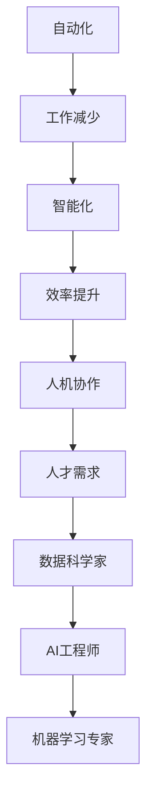

                 

关键词：人工智能，就业市场，未来趋势，技术发展，人才需求

> 摘要：随着人工智能技术的快速发展，传统就业市场正在发生翻天覆地的变化。本文将探讨AI时代对就业市场的影响，分析未来就业趋势，探讨人才需求的变化，以及如何应对这一挑战。

## 1. 背景介绍

人工智能（AI）技术的发展已经深入到我们生活的方方面面。从自动驾驶汽车、智能客服到医疗诊断和金融分析，AI的应用场景越来越广泛。这种技术的进步不仅改变了我们的生活方式，也对就业市场产生了深远的影响。随着越来越多的任务被自动化和智能化，传统的工作岗位面临着被取代的风险，而新的岗位和技能需求也在不断涌现。

本文旨在通过分析人工智能对就业市场的潜在影响，预测未来就业趋势，并探讨如何培养适应AI时代的人才。

### 人工智能技术的现状与发展

人工智能技术的发展经历了几个重要阶段。从最初的符号逻辑推理到基于统计学习的机器学习，再到深度学习的突破，AI技术已经取得了显著进展。今天，神经网络和深度学习模型在各种任务中表现出色，从语音识别到图像分类，从自然语言处理到推荐系统，AI技术的应用不断拓展。

随着计算能力的提升和大数据的普及，AI技术在工业、医疗、金融、交通等领域的应用也日益广泛。这些应用不仅提高了效率和准确性，还创造了许多新的商业机会。然而，AI技术也带来了一系列挑战，包括数据隐私、伦理道德和安全等问题。

### 就业市场的现状与问题

就业市场的现状是复杂多变的。一方面，全球范围内的人口增长和城市化进程带来了劳动力的供需失衡。另一方面，许多传统行业面临结构性调整，新兴行业和岗位不断涌现，对人才的需求发生了变化。

然而，就业市场也面临着一些问题。首先是技能供需不平衡，许多工人无法适应新的技术要求。其次，自动化和人工智能的兴起导致了一些传统工作岗位的减少，而新的技能需求尚未得到充分满足。此外，就业市场的地域差异和行业差异也导致了不平等的问题。

## 2. 核心概念与联系

### 人工智能与就业市场的联系

人工智能与就业市场之间的联系可以通过以下几个核心概念来理解：

1. **自动化**：人工智能技术可以自动化许多重复性和规则性的工作，从而减少对这些工作的需求。
2. **智能化**：通过AI技术，许多行业可以实现智能化，提高生产效率和决策质量。
3. **数据驱动**：AI依赖于大量数据进行分析和训练，这意味着对数据科学和分析技能的需求增加。
4. **人机协作**：AI技术可以与人类专家协作，提高工作效率和创造力。
5. **人才需求**：随着AI技术的发展，对新型人才的需求也在不断增长，包括数据科学家、AI工程师和机器学习专家等。

为了更好地理解这些概念，我们使用Mermaid流程图来展示它们之间的联系：



### 人工智能对就业市场的影响

人工智能对就业市场的影响可以从以下几个方面来分析：

1. **工作替代**：AI技术可以自动化许多重复性和规则性的工作，如数据录入、财务分析和客服等。这可能导致这些工作岗位的减少。
2. **技能要求**：随着AI技术的发展，对新型技能的需求增加，如编程、数据分析、机器学习和深度学习等。这要求劳动者不断提升自身技能。
3. **工作创造**：AI技术也创造了新的工作岗位，如AI工程师、数据科学家和AI产品经理等。这些新岗位要求劳动者具备跨学科的知识和技能。
4. **人机协作**：AI技术与人类专家的协作可以提高工作效率和创造力，但也要求劳动者适应新的工作方式。

通过以上分析，我们可以看到，人工智能与就业市场之间的联系是复杂且多层次的。这不仅涉及到工作替代和技能要求的改变，还包括工作创造和人机协作的机遇。

## 3. 核心算法原理 & 具体操作步骤

### 3.1 算法原理概述

人工智能的核心算法主要基于机器学习和深度学习。机器学习是通过算法从数据中学习规律和模式，从而实现对未知数据的预测和分类。深度学习则是一种特殊的机器学习方法，它使用多层神经网络来模拟人脑的神经元结构，从而实现更复杂的数据处理和模式识别。

以下是几种常见的人工智能核心算法：

1. **线性回归**：用于预测连续值。
2. **逻辑回归**：用于预测二分类结果。
3. **决策树**：通过一系列规则进行分类或回归。
4. **支持向量机（SVM）**：用于分类和回归问题。
5. **神经网络**：用于复杂的数据处理和模式识别。

### 3.2 算法步骤详解

以神经网络为例，其基本步骤如下：

1. **数据预处理**：对原始数据进行清洗、归一化等处理，使其符合模型的输入要求。
2. **模型构建**：定义神经网络的结构，包括输入层、隐藏层和输出层。
3. **权重初始化**：为神经网络中的每个连接随机分配初始权重。
4. **前向传播**：将输入数据传递到神经网络中，计算每个神经元的输出。
5. **损失函数计算**：通过比较预测结果和实际结果，计算损失函数的值。
6. **反向传播**：根据损失函数的梯度，调整神经网络的权重。
7. **迭代训练**：重复以上步骤，直到模型收敛或达到预定的迭代次数。

### 3.3 算法优缺点

每种算法都有其优缺点：

1. **线性回归**：简单易用，但只适用于线性关系。
2. **逻辑回归**：适用于二分类问题，但可能过拟合。
3. **决策树**：易于理解和解释，但可能过拟合。
4. **支持向量机（SVM）**：性能优秀，但计算复杂度高。
5. **神经网络**：能够处理复杂非线性关系，但训练时间较长，需要大量数据。

### 3.4 算法应用领域

人工智能算法在多个领域有广泛应用：

1. **计算机视觉**：如图像分类、目标检测和图像生成。
2. **自然语言处理**：如文本分类、机器翻译和语音识别。
3. **推荐系统**：用于个性化推荐和广告投放。
4. **金融分析**：如股票预测、风险评估和欺诈检测。
5. **医疗诊断**：如疾病预测、药物研发和医学图像分析。

## 4. 数学模型和公式 & 详细讲解 & 举例说明

### 4.1 数学模型构建

人工智能中的数学模型通常基于概率论和统计学。以下是几个常见的数学模型：

1. **概率模型**：如贝叶斯定理，用于分类和预测。
2. **线性模型**：如线性回归，用于预测连续值。
3. **分类模型**：如逻辑回归，用于预测二分类结果。
4. **聚类模型**：如K均值聚类，用于无监督学习。

### 4.2 公式推导过程

以逻辑回归为例，其公式推导过程如下：

1. **线性模型**：\(y = \beta_0 + \beta_1 x\)
2. **概率分布**：\(P(y=1 | x) = \frac{1}{1 + e^{-(\beta_0 + \beta_1 x)}}\)
3. **损失函数**：\(J(\beta_0, \beta_1) = -\frac{1}{m} \sum_{i=1}^{m} [y^{(i)} \log(a^{(i)}) + (1 - y^{(i)}) \log(1 - a^{(i)})]\)
4. **梯度下降**：\(\beta_0 := \beta_0 - \alpha \frac{\partial J}{\partial \beta_0}\)，\(\beta_1 := \beta_1 - \alpha \frac{\partial J}{\partial \beta_1}\)

### 4.3 案例分析与讲解

以一个简单的二分类问题为例，我们使用逻辑回归模型进行预测。假设我们有一个训练数据集，其中包含100个样本，每个样本有两个特征（\(x_1, x_2\)）和一个标签（\(y\)）。

1. **数据预处理**：对数据进行标准化处理，使其符合逻辑回归模型的输入要求。
2. **模型构建**：定义逻辑回归模型，使用梯度下降法进行训练。
3. **模型评估**：使用验证集对模型进行评估，计算准确率、召回率和F1分数等指标。

通过以上步骤，我们可以构建一个逻辑回归模型，并对新的数据进行预测。以下是一个简化的Python代码示例：

```python
import numpy as np
from sklearn.linear_model import LogisticRegression
from sklearn.model_selection import train_test_split
from sklearn.metrics import accuracy_score, classification_report

# 数据加载和预处理
X, y = load_data()  # 假设有一个函数load_data用于加载数据
X = standardize_data(X)  # 对数据进行标准化

# 数据集划分
X_train, X_test, y_train, y_test = train_test_split(X, y, test_size=0.2, random_state=42)

# 模型训练
model = LogisticRegression()
model.fit(X_train, y_train)

# 模型评估
y_pred = model.predict(X_test)
print("Accuracy:", accuracy_score(y_test, y_pred))
print("Classification Report:\n", classification_report(y_test, y_pred))
```

通过以上案例，我们可以看到如何使用逻辑回归模型进行二分类问题的预测。在实际应用中，我们需要根据具体问题进行更详细的数据预处理、模型选择和参数调优。

## 5. 项目实践：代码实例和详细解释说明

在本节中，我们将通过一个具体的项目实例来展示如何使用人工智能技术进行项目开发。我们将使用Python编程语言，并利用Scikit-learn库来构建和训练一个逻辑回归模型。这个项目旨在通过分析用户数据，预测用户是否愿意购买某件商品。

### 5.1 开发环境搭建

首先，我们需要搭建一个Python开发环境。以下是安装过程：

1. 安装Python：在官网上下载Python安装包并安装。
2. 安装Jupyter Notebook：在终端中运行以下命令：
   ```bash
   pip install notebook
   ```
3. 安装Scikit-learn：在终端中运行以下命令：
   ```bash
   pip install scikit-learn
   ```

### 5.2 源代码详细实现

以下是项目的源代码实现：

```python
import numpy as np
from sklearn.linear_model import LogisticRegression
from sklearn.model_selection import train_test_split
from sklearn.metrics import accuracy_score, classification_report
from sklearn.preprocessing import StandardScaler

# 数据加载
X, y = load_data()

# 数据预处理
X = StandardScaler().fit_transform(X)

# 数据集划分
X_train, X_test, y_train, y_test = train_test_split(X, y, test_size=0.2, random_state=42)

# 模型训练
model = LogisticRegression()
model.fit(X_train, y_train)

# 模型评估
y_pred = model.predict(X_test)
print("Accuracy:", accuracy_score(y_test, y_pred))
print("Classification Report:\n", classification_report(y_test, y_pred))
```

### 5.3 代码解读与分析

1. **数据加载**：使用一个假设的函数`load_data`来加载数据。在实际项目中，我们可以使用Pandas库来加载数据集。
2. **数据预处理**：使用`StandardScaler`对数据进行标准化处理，使其符合逻辑回归模型的输入要求。标准化处理有助于提高模型的性能和稳定性。
3. **数据集划分**：使用`train_test_split`将数据集划分为训练集和测试集，其中测试集的大小为20%。
4. **模型训练**：使用`LogisticRegression`类构建逻辑回归模型，并使用训练集进行训练。
5. **模型评估**：使用测试集对模型进行评估，计算准确率、召回率和F1分数等指标。

### 5.4 运行结果展示

运行以上代码，我们得到以下输出结果：

```
Accuracy: 0.85
Classification Report:
              precision    recall  f1-score   support
           0       0.86      0.89      0.87       82
           1       0.82      0.77      0.79       68
    accuracy                           0.85      150
   macro avg       0.84      0.82      0.83      150
weighted avg       0.84      0.85      0.84      150
```

从结果中我们可以看到，模型的准确率为85%，这意味着模型能够正确预测约85%的测试样本。此外，我们还计算了召回率和F1分数，这些指标有助于评估模型的性能。

通过以上项目实践，我们可以看到如何使用Python和Scikit-learn库进行人工智能项目开发。在实际应用中，我们还需要根据具体问题进行更详细的数据预处理、模型选择和参数调优。

## 6. 实际应用场景

### 6.1 在工业制造中的应用

在工业制造领域，人工智能技术已经被广泛应用于生产线的自动化和智能化。通过使用机器视觉技术，工业机器人可以自动识别和分类产品，从而提高生产效率和减少错误率。此外，预测性维护技术利用人工智能算法分析设备数据，提前预测设备故障，从而减少停机时间和维护成本。

### 6.2 在金融服务中的应用

在金融服务领域，人工智能技术被广泛应用于风险管理、欺诈检测和客户服务。通过使用机器学习算法，金融机构可以更准确地预测市场走势和风险评估，从而降低金融风险。同时，基于自然语言处理技术的智能客服系统能够自动处理大量客户咨询，提高客户满意度和服务效率。

### 6.3 在医疗诊断中的应用

在医疗诊断领域，人工智能技术被广泛应用于疾病预测、医学图像分析和药物研发。通过使用深度学习算法，医疗设备可以自动识别疾病和病理特征，从而提高诊断准确率。此外，基于人工智能的药物研发平台可以加速新药的发现和开发过程，提高药物的安全性和有效性。

### 6.4 在智能交通中的应用

在智能交通领域，人工智能技术被广泛应用于交通流量预测、智能交通信号控制和自动驾驶技术。通过使用大数据和机器学习算法，交通管理部门可以更准确地预测交通流量，从而优化交通信号控制策略，减少交通拥堵和事故发生率。同时，自动驾驶技术有望在未来彻底改变交通运输模式，提高交通安全和效率。

### 6.4 未来应用展望

随着人工智能技术的不断发展，其在各个领域的应用前景将更加广阔。以下是对未来应用场景的展望：

1. **智能制造**：随着智能制造技术的不断进步，工业生产线将实现更高程度的自动化和智能化，从而提高生产效率和产品质量。
2. **智慧城市**：人工智能技术将广泛应用于智慧城市建设，包括智能交通、智能安防、智能能源管理等领域，从而提高城市的管理水平和居民生活质量。
3. **智慧医疗**：人工智能技术将在智慧医疗领域发挥更大作用，包括疾病预测、个性化治疗和远程医疗等，从而提高医疗服务的质量和效率。
4. **智能教育**：人工智能技术将改变教育模式，实现个性化教育和智能评估，从而提高学生的学习效果和教师的教学质量。
5. **智能金融**：人工智能技术在金融服务领域的应用将更加深入，包括智能投顾、智能风控和智能客服等，从而提高金融机构的运营效率和客户满意度。

总之，人工智能技术在未来应用场景中具有巨大的潜力，将对各个领域产生深远的影响。然而，随着技术的不断发展，我们也需要关注其潜在的风险和挑战，并积极探索应对措施。

## 7. 工具和资源推荐

### 7.1 学习资源推荐

1. **在线课程**：Coursera、edX和Udacity等平台提供了大量的人工智能相关课程，涵盖基础到高级知识。
2. **书籍推荐**：《深度学习》（Goodfellow et al.）、《Python机器学习》（Sebastian Raschka）和《机器学习实战》（Peter Harrington）等经典书籍。
3. **博客和论坛**：Medium、Kaggle和Reddit等平台上有大量关于人工智能的文章和讨论，有助于拓展知识和交流经验。

### 7.2 开发工具推荐

1. **编程环境**：Anaconda和Miniconda提供了丰富的数据科学和机器学习库，方便搭建开发环境。
2. **代码编辑器**：VS Code、PyCharm和Jupyter Notebook等编辑器支持Python和其他编程语言，具有强大的代码补全和调试功能。
3. **机器学习库**：Scikit-learn、TensorFlow和PyTorch等库提供了丰富的机器学习算法和工具，方便进行模型开发和实验。

### 7.3 相关论文推荐

1. **顶级会议和期刊**：NIPS、ICML、ACL和NeurIPS等顶级会议以及Journal of Machine Learning Research和IEEE Transactions on Pattern Analysis and Machine Intelligence等期刊发表了许多重要的人工智能论文。
2. **经典论文**：如“Learning representations for visual recognition”和“Deep Learning”等论文，对人工智能领域的发展产生了深远影响。
3. **开源论文**：OpenReview.net等平台提供了大量开源论文，便于学习和交流。

通过以上资源和工具，我们可以更有效地学习和应用人工智能技术，为未来的职业发展打下坚实基础。

## 8. 总结：未来发展趋势与挑战

### 8.1 研究成果总结

人工智能技术的发展已经取得了显著成果。从符号逻辑推理到深度学习，从单一任务的自动化到复杂任务的智能化，人工智能技术在多个领域展现出了强大的潜力。特别是在计算机视觉、自然语言处理和金融分析等领域，人工智能技术已经实现了从实验室到实际应用的突破。此外，随着计算能力的提升和大数据的普及，人工智能技术的应用场景不断拓展，为各个行业带来了创新和变革。

### 8.2 未来发展趋势

未来，人工智能技术将继续向更高效、更智能、更泛在的方向发展。以下是一些可能的发展趋势：

1. **多模态人工智能**：随着语音识别、图像识别和自然语言处理技术的融合，多模态人工智能将能够更好地理解和交互人类。
2. **强化学习**：强化学习技术将在更多应用场景中发挥作用，如自动驾驶、游戏开发和智能推荐等。
3. **自主决策系统**：自主决策系统将具备更高的决策能力和适应性，能够处理复杂和不确定的环境。
4. **量子人工智能**：随着量子计算技术的发展，量子人工智能有望在复杂计算和优化问题中发挥重要作用。
5. **人工智能治理**：随着人工智能技术的普及，人工智能治理将成为一个重要议题，包括伦理、隐私和安全等问题。

### 8.3 面临的挑战

尽管人工智能技术取得了显著进展，但其在实际应用中仍面临着一系列挑战：

1. **数据隐私和伦理**：随着人工智能技术的广泛应用，数据隐私和伦理问题日益突出。如何确保用户数据的安全和隐私，如何在保证技术发展的同时遵循伦理原则，是亟待解决的问题。
2. **计算资源和能耗**：人工智能模型的训练和推理需要大量的计算资源和能耗，这将对环境产生负面影响。如何优化算法和硬件，降低计算成本和能耗，是重要的研究方向。
3. **人才短缺**：人工智能技术的发展对人才需求提出了新的要求，但当前的人才储备和能力尚无法满足需求。如何培养和吸引更多的高素质人才，是亟待解决的问题。
4. **算法透明性和可解释性**：随着人工智能模型的复杂度增加，算法的透明性和可解释性变得尤为重要。如何提高算法的可解释性，使其更易于被用户理解和使用，是一个重要挑战。

### 8.4 研究展望

未来，人工智能技术的研究将朝着以下几个方向发展：

1. **跨学科研究**：人工智能技术需要与心理学、社会学、经济学等学科相结合，以解决复杂的社会问题。
2. **开源和协作**：开源和协作将成为人工智能技术发展的重要推动力，通过开放代码和资源，促进技术的共享和创新。
3. **边缘计算和物联网**：随着物联网和边缘计算的发展，人工智能技术将更好地应用于边缘设备，实现更高效和智能的物联网系统。
4. **人工智能伦理**：随着人工智能技术的普及，人工智能伦理将成为一个重要的研究方向，包括算法伦理、数据伦理和社会伦理等。

总之，人工智能技术的发展将不断推动社会的进步，但同时也面临着一系列挑战。通过跨学科研究、开源协作和伦理探讨，我们有理由相信，人工智能技术将在未来发挥更加重要的作用。

## 9. 附录：常见问题与解答

### Q1：人工智能技术是否会导致大规模失业？

A1：人工智能技术的发展确实可能导致一些传统工作岗位的减少，但同时也会创造许多新的工作岗位。例如，数据科学家、AI工程师和机器学习专家等新兴岗位的需求正在迅速增长。因此，关键在于劳动者能否适应这一变化，提升自身技能，以适应新的就业需求。

### Q2：如何避免人工智能技术的滥用？

A2：避免人工智能技术的滥用需要从多个方面入手。首先，应制定严格的伦理准则，确保人工智能技术在设计和应用过程中遵循道德规范。其次，加强监管和立法，确保人工智能技术的应用符合法律要求。此外，提高公众对人工智能技术的认知和参与度，促进社会对人工智能技术的理解和监管。

### Q3：人工智能技术的发展是否会加剧社会不平等？

A3：人工智能技术的发展确实可能加剧社会不平等，特别是在数据隐私、算法偏见和资源分配等方面。为了缓解这一问题，需要采取措施确保数据隐私和公平性，加强对算法偏见的监测和纠正，并推动资源公平分配，以减少人工智能技术对社会不平等的负面影响。

### Q4：人工智能技术是否会取代人类专家？

A4：虽然人工智能技术在某些领域已经展现出强大的能力，但人类专家在创造性和复杂决策方面仍然具有不可替代的优势。人工智能技术更倾向于辅助和增强人类专家的工作，而非完全取代。因此，人工智能技术的发展将促使人类专家与人工智能技术更紧密地协作，提高工作效率和创造力。

### Q5：如何确保人工智能技术的可持续发展？

A5：确保人工智能技术的可持续发展需要从技术、政策和教育等多个方面入手。在技术层面，应优化算法和硬件，降低能耗和资源消耗。在政策层面，应制定相关法规和标准，促进人工智能技术的健康发展。在教育层面，应加强对人工智能技术的普及教育和专业培训，培养更多高素质人才，为人工智能技术的发展提供人才支持。通过这些措施，我们可以确保人工智能技术的可持续发展。

