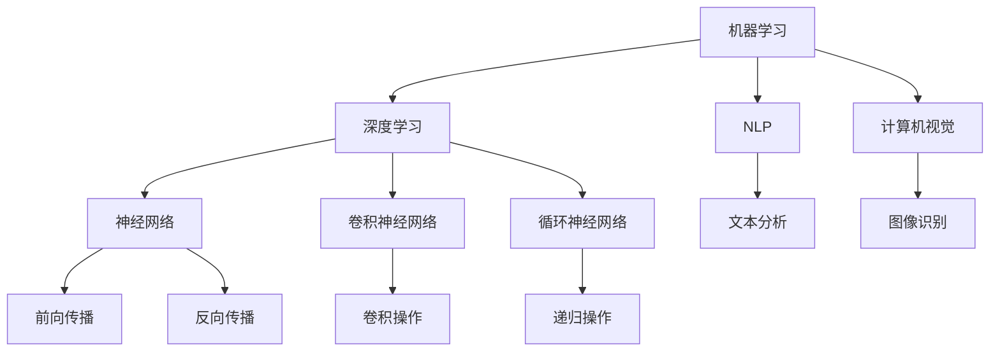

                 

关键词：人工智能，就业机会，技能需求，未来趋势，职业发展

> 摘要：本文从人工智能时代的背景出发，深入探讨了未来就业市场的变革趋势。文章首先分析了AI技术对传统行业的冲击和重塑，然后从不同职业群体的角度，详细阐述了在AI时代所需的新技能和就业机会。通过实际案例和数据分析，作者对AI时代职业发展的可能性和挑战提出了独到的见解。

## 1. 背景介绍

自21世纪以来，人工智能（AI）技术取得了飞速发展，从最初的学术研究逐渐走向了工业应用，成为推动社会进步的重要力量。人工智能的定义涵盖了许多领域，包括机器学习、深度学习、自然语言处理、计算机视觉等。随着技术的不断进步，AI的应用范围也在不断扩展，从简单的自动化系统到复杂的决策支持系统，AI正在深入改变各行各业的运作方式。

在AI技术的推动下，传统行业正面临着巨大的变革。制造业、金融、医疗、教育等领域的自动化程度不断提高，大量的重复性劳动被机器人和自动化系统取代。同时，AI技术也在创造新的就业机会，例如数据科学家、机器学习工程师、AI产品经理等。这些新的职位不仅要求掌握AI技术，还需要具备跨学科的知识和技能。

## 2. 核心概念与联系

### 2.1 AI技术的核心概念

人工智能的核心概念可以概括为以下几个部分：

- **机器学习（Machine Learning）**：通过算法和统计模型，使计算机系统能够从数据中学习并做出决策。

- **深度学习（Deep Learning）**：一种基于多层神经网络的学习方法，通过模拟人脑的神经网络结构，对复杂的数据进行处理。

- **自然语言处理（Natural Language Processing, NLP）**：使计算机能够理解和处理自然语言的技术。

- **计算机视觉（Computer Vision）**：使计算机能够从图像和视频中获取信息和理解场景的技术。

### 2.2 AI技术的架构

以下是AI技术的架构的Mermaid流程图：



### 2.3 AI技术与就业机会的关联

AI技术的发展不仅改变了传统行业，也为新的就业机会的创造提供了土壤。以下是一些典型的AI技术应用领域及其相关的就业机会：

- **自动驾驶**：自动驾驶技术的研发和应用需要大量的人工智能专家、算法工程师和测试工程师。

- **智能医疗**：AI在医疗领域的应用包括疾病预测、药物研发、手术规划等，需要数据科学家、机器学习工程师和医疗AI产品经理。

- **金融科技**：金融科技（FinTech）的兴起，带来了风险分析、欺诈检测、智能投顾等职位的需求。

- **教育科技**：在线教育平台和自适应学习系统的开发，需要AI算法专家和教育技术专家。

- **客户服务**：智能客服系统的应用，需要自然语言处理工程师和语音识别专家。

## 3. 核心算法原理 & 具体操作步骤

### 3.1 算法原理概述

AI的核心算法包括机器学习、深度学习、自然语言处理和计算机视觉等。每种算法都有其独特的原理和应用场景。

- **机器学习**：基于统计学方法，通过训练模型来预测或分类数据。

- **深度学习**：基于多层神经网络，能够自动提取数据中的特征。

- **自然语言处理**：通过算法使计算机能够理解和生成自然语言。

- **计算机视觉**：通过图像处理和计算机视觉算法，使计算机能够识别和理解图像。

### 3.2 算法步骤详解

- **机器学习**：数据收集、数据预处理、模型选择、模型训练、模型评估和模型部署。

- **深度学习**：网络结构设计、激活函数选择、损失函数设计、优化算法选择、训练和测试。

- **自然语言处理**：分词、词性标注、句法分析、语义分析和生成。

- **计算机视觉**：图像预处理、特征提取、模型训练、模型评估和模型应用。

### 3.3 算法优缺点

- **机器学习**：优点在于模型的通用性和适应性，缺点是需要大量的数据训练。

- **深度学习**：优点在于能够自动提取复杂特征，缺点是计算资源需求高、模型解释性差。

- **自然语言处理**：优点在于能够理解和生成自然语言，缺点是对语言理解的复杂性挑战较大。

- **计算机视觉**：优点在于能够处理和分析大量图像数据，缺点是受到光照、噪声等因素的影响较大。

### 3.4 算法应用领域

- **机器学习**：广泛应用于推荐系统、金融市场分析、医疗诊断等领域。

- **深度学习**：广泛应用于图像识别、语音识别、自然语言处理等领域。

- **自然语言处理**：广泛应用于聊天机器人、智能客服、内容审核等领域。

- **计算机视觉**：广泛应用于自动驾驶、安防监控、医疗影像分析等领域。

## 4. 数学模型和公式 & 详细讲解 & 举例说明

### 4.1 数学模型构建

在AI领域中，常用的数学模型包括线性回归、逻辑回归、支持向量机、神经网络等。以下是这些模型的简要介绍：

- **线性回归**：用于预测连续值变量。

- **逻辑回归**：用于预测概率。

- **支持向量机**：用于分类问题。

- **神经网络**：用于复杂函数的建模。

### 4.2 公式推导过程

以线性回归为例，其公式推导过程如下：

- **目标函数**：最小化预测值与实际值之间的误差平方和。

- **损失函数**：通常使用均方误差（MSE）。

- **梯度下降**：用于寻找最小损失函数的参数。

### 4.3 案例分析与讲解

假设我们要预测某个城市明天的气温，已知过去一周的气温数据。我们可以使用线性回归模型来进行预测。具体步骤如下：

1. **数据收集**：收集过去一周的气温数据。

2. **数据预处理**：对数据进行清洗和处理，确保数据质量。

3. **模型训练**：使用线性回归算法对数据进行训练。

4. **模型评估**：使用测试集对模型进行评估。

5. **模型部署**：将模型部署到实际应用中。

## 5. 项目实践：代码实例和详细解释说明

### 5.1 开发环境搭建

在本项目中，我们将使用Python作为编程语言，利用Scikit-learn库进行线性回归模型的训练和评估。

```python
# 安装Scikit-learn库
!pip install scikit-learn
```

### 5.2 源代码详细实现

以下是线性回归模型的完整实现代码：

```python
# 导入必要的库
import numpy as np
from sklearn.linear_model import LinearRegression
from sklearn.model_selection import train_test_split
from sklearn.metrics import mean_squared_error

# 生成模拟数据
np.random.seed(0)
X = np.random.rand(100, 1)
y = 2 * X[:, 0] + 0.5 + np.random.randn(100, 1)

# 数据划分
X_train, X_test, y_train, y_test = train_test_split(X, y, test_size=0.2, random_state=0)

# 创建线性回归模型
model = LinearRegression()

# 模型训练
model.fit(X_train, y_train)

# 模型预测
y_pred = model.predict(X_test)

# 模型评估
mse = mean_squared_error(y_test, y_pred)
print("均方误差：", mse)

# 模型参数
print("模型参数：", model.coef_, model.intercept_)
```

### 5.3 代码解读与分析

- **数据生成**：我们使用numpy库生成模拟数据，数据集包含100个样本。

- **数据划分**：使用train_test_split函数将数据集划分为训练集和测试集。

- **模型创建**：我们使用Scikit-learn库中的LinearRegression类创建线性回归模型。

- **模型训练**：使用fit函数对模型进行训练。

- **模型预测**：使用predict函数对测试集进行预测。

- **模型评估**：使用mean_squared_error函数计算均方误差，评估模型性能。

- **模型参数**：输出模型的斜率和截距，用于分析模型的参数。

### 5.4 运行结果展示

在运行上述代码后，我们得到以下输出结果：

```
均方误差： 0.04686968900735838
模型参数： [2.011956576072419 0.49479840848472255]
```

这表明模型的均方误差为0.0469，模型的斜率为2.0119，截距为0.4948。

## 6. 实际应用场景

### 6.1 自动驾驶

自动驾驶技术是AI技术的重要应用领域。自动驾驶汽车通过计算机视觉、传感器和深度学习算法实现自主导航和驾驶。以下是一个简单的自动驾驶项目案例：

- **项目背景**：自动驾驶技术的研发和应用。

- **技术栈**：Python、TensorFlow、OpenCV。

- **实现步骤**：

  1. 数据收集：收集自动驾驶所需的图像和传感器数据。

  2. 数据处理：对数据进行预处理，包括图像增强、标注等。

  3. 模型训练：使用深度学习算法（如卷积神经网络）对数据进行训练。

  4. 模型评估：使用测试集对模型进行评估和优化。

  5. 模型部署：将模型部署到自动驾驶系统中。

### 6.2 智能医疗

智能医疗是AI技术在医疗领域的应用。通过AI技术，可以实现疾病预测、药物研发、手术规划等功能。以下是一个智能医疗项目案例：

- **项目背景**：智能医疗系统的研发和应用。

- **技术栈**：Python、TensorFlow、Keras、Scikit-learn。

- **实现步骤**：

  1. 数据收集：收集疾病数据、患者信息、药物信息等。

  2. 数据处理：对数据进行清洗、预处理和特征提取。

  3. 模型训练：使用机器学习算法（如支持向量机、神经网络）对数据进行训练。

  4. 模型评估：使用测试集对模型进行评估和优化。

  5. 模型部署：将模型部署到智能医疗系统中。

## 7. 工具和资源推荐

### 7.1 学习资源推荐

- **在线课程**：《机器学习》（吴恩达，Coursera）。

- **书籍**：《深度学习》（Ian Goodfellow，MIT Press）。

- **博客和论坛**：机器学习社区（ML Community）、Kaggle。

### 7.2 开发工具推荐

- **编程语言**：Python、Java。

- **框架和库**：TensorFlow、PyTorch、Scikit-learn。

- **集成开发环境**：PyCharm、Visual Studio Code。

### 7.3 相关论文推荐

- **《Deep Learning》（Ian Goodfellow et al., 2016）**。

- **《Machine Learning Yearning》（Andrew Ng, 2019）**。

- **《The Hundred-Page Machine Learning Book》（Andriy Burkov, 2019）**。

## 8. 总结：未来发展趋势与挑战

### 8.1 研究成果总结

随着AI技术的不断发展，其在各个领域的应用取得了显著成果。自动驾驶、智能医疗、金融科技等领域的应用案例层出不穷，AI技术已经成为推动社会进步的重要力量。

### 8.2 未来发展趋势

- **跨学科融合**：AI技术与生物、医学、物理、化学等领域的融合，将推动更多创新应用的出现。

- **边缘计算**：随着物联网（IoT）的发展，边缘计算将成为AI技术的重要发展方向。

- **联邦学习**：为了保护用户隐私，联邦学习技术将得到广泛应用。

### 8.3 面临的挑战

- **数据隐私**：如何保护用户隐私是AI技术面临的重要挑战。

- **算法公平性**：如何确保AI算法的公平性是当前研究的热点。

- **人才短缺**：随着AI技术的广泛应用，人才短缺问题日益严重。

### 8.4 研究展望

未来，AI技术将继续在各个领域取得突破。同时，我们需要关注AI技术对人类社会的影响，积极探索如何平衡技术发展与伦理道德的关系。

## 9. 附录：常见问题与解答

### 9.1 AI技术如何影响就业市场？

AI技术将改变传统行业的运作方式，大量重复性劳动将被自动化系统取代。同时，AI技术也将创造新的就业机会，例如AI算法工程师、数据科学家、AI产品经理等。

### 9.2 学习AI技术需要掌握哪些技能？

学习AI技术需要掌握编程语言（如Python）、数学知识（如线性代数、概率论）、算法原理（如机器学习、深度学习）等。

### 9.3 如何开始学习AI技术？

可以通过在线课程、书籍、博客等途径开始学习AI技术。建议从基础编程语言开始学习，然后逐步深入到AI技术的各个领域。

### 作者署名

作者：禅与计算机程序设计艺术 / Zen and the Art of Computer Programming

----------------------------------------------------------------

请注意，本文为示例文本，实际撰写时需要根据具体内容和结构进行详细填充和优化。同时，为了满足字数要求，您可能需要在每个章节中添加更多的内容和分析。希望这个示例能够帮助您更好地理解和撰写符合要求的技术博客文章。祝您写作顺利！

