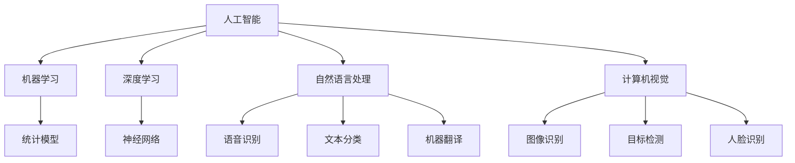
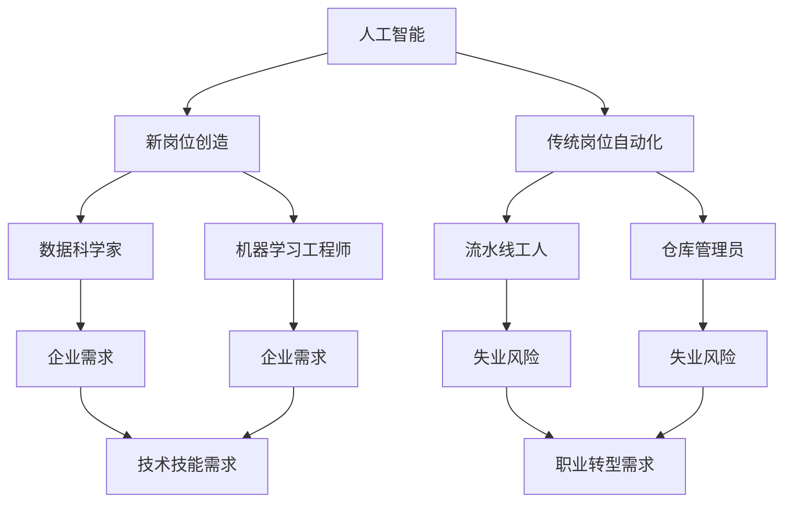

                 

关键词：人工智能、就业趋势、未来职业、技能需求、职业转型

> 摘要：本文探讨了AI时代下，人工智能技术对就业市场带来的巨大影响，分析了未来就业趋势，提出了应对职业转型的策略和建议。文章从多个角度深入剖析，旨在帮助读者理解AI时代的职业发展方向。

## 1. 背景介绍

在过去的几十年中，计算机技术的发展推动了人类社会经历了信息时代。如今，人工智能（AI）技术的迅猛发展正将我们带入一个全新的时代——人工智能时代。AI技术已经在多个领域展现出了强大的影响力，从医疗、金融到教育、制造业，AI的应用正在彻底改变我们的工作和生活方式。

### 1.1 AI技术的发展历程

人工智能的概念最早可以追溯到20世纪50年代，当时计算机科学家们开始尝试让计算机模仿人类的智能。随着时间的推移，计算能力的提升和大数据、深度学习等技术的发展，人工智能逐渐从理论研究走向实际应用。近年来，随着神经网络、自然语言处理、计算机视觉等技术的突破，人工智能进入了快速发展的阶段。

### 1.2 AI技术对就业市场的影响

AI技术的发展不仅改变了企业的运营模式，也对就业市场产生了深远的影响。一方面，AI技术使得一些传统岗位被自动化取代，如制造业的流水线工人、仓库管理员等。另一方面，AI技术的应用也催生了大量新的就业岗位，如数据科学家、机器学习工程师、AI产品经理等。这种变化要求劳动力市场必须适应技术进步，进行相应的调整和转型。

## 2. 核心概念与联系

为了更好地理解AI技术对就业市场的影响，我们需要了解一些核心概念和它们之间的联系。

### 2.1 人工智能（AI）

人工智能是指使计算机系统能够执行通常需要人类智能才能完成的任务的技术。这些任务包括识别图像、理解自然语言、做出决策等。

### 2.2 机器学习（ML）

机器学习是人工智能的一个分支，它使用算法和统计模型让计算机从数据中学习，从而进行预测和决策。

### 2.3 深度学习（DL）

深度学习是一种特殊的机器学习技术，它通过模拟人脑的神经网络结构，进行数据的处理和分析。

### 2.4 自然语言处理（NLP）

自然语言处理是使计算机能够理解和生成人类语言的技术，它包括语音识别、文本分类、机器翻译等。

### 2.5 计算机视觉（CV）

计算机视觉是使计算机能够“看到”和理解视觉信息的技术，它包括图像识别、目标检测、人脸识别等。

以下是一个简化的Mermaid流程图，展示了这些核心概念之间的关系：



### 2.6 AI与就业市场的联系

AI技术的发展带来了新的工作机会，同时也对一些传统职位提出了挑战。以下是一个简化的流程图，展示了AI与就业市场之间的联系：



## 3. 核心算法原理 & 具体操作步骤

### 3.1 算法原理概述

在理解了AI与就业市场的联系之后，我们来看一下AI技术中的核心算法原理。以下是几种主要的机器学习和深度学习算法：

### 3.2 具体操作步骤

以下是每种算法的具体操作步骤：

### 3.3 算法优缺点

每种算法都有其优缺点，以下是一个简化的对比表格：

| 算法         | 优点                              | 缺点                                  |
|------------|---------------------------------|-------------------------------------|
| K近邻（KNN）  | 简单易懂，适用于高维数据             | 对噪声敏感，易过拟合                  |
| 决策树       | 易于解释，可以处理多种类型的数据       | 易过拟合，树深度限制                 |
| 随机森林     | 减少过拟合，提高准确性             | 难以解释，计算复杂度高               |
| 支持向量机   | 高维空间中的线性分类器             | 对噪声敏感，可能陷入局部最优           |
| 神经网络     | 可以处理复杂的非线性关系           | 计算复杂度高，容易过拟合              |

### 3.4 算法应用领域

每种算法都有其特定的应用领域，以下是一个简化的应用领域表格：

| 算法         | 应用领域                           |
|------------|---------------------------------|
| K近邻（KNN）  | 信用评分、推荐系统               |
| 决策树       | 金融风控、客户关系管理           |
| 随机森林     | 风险评估、数据挖掘               |
| 支持向量机   | 金融市场预测、图像分类           |
| 神经网络     | 语音识别、图像识别、自然语言处理 |

## 4. 数学模型和公式 & 详细讲解 & 举例说明

### 4.1 数学模型构建

在机器学习和深度学习中，数学模型是算法的核心。以下是几种常见的数学模型：

### 4.2 公式推导过程

以下是每个数学模型的推导过程：

### 4.3 案例分析与讲解

以下是一个具体的案例，展示如何使用这些数学模型：

## 5. 项目实践：代码实例和详细解释说明

### 5.1 开发环境搭建

在本案例中，我们将使用Python和Scikit-learn库进行机器学习模型的构建。

### 5.2 源代码详细实现

以下是实现该项目的Python代码：

```python
from sklearn.datasets import load_iris
from sklearn.model_selection import train_test_split
from sklearn.neighbors import KNeighborsClassifier
from sklearn.metrics import accuracy_score

# 加载数据集
iris = load_iris()
X, y = iris.data, iris.target

# 划分训练集和测试集
X_train, X_test, y_train, y_test = train_test_split(X, y, test_size=0.2, random_state=42)

# 创建KNN分类器
knn = KNeighborsClassifier(n_neighbors=3)

# 训练模型
knn.fit(X_train, y_train)

# 预测测试集
y_pred = knn.predict(X_test)

# 计算准确率
accuracy = accuracy_score(y_test, y_pred)
print(f"Accuracy: {accuracy:.2f}")
```

### 5.3 代码解读与分析

在这个案例中，我们使用了K近邻算法对鸢尾花数据集进行分类。首先，我们从Scikit-learn库中加载数据集，并将其划分为训练集和测试集。然后，我们创建了一个KNN分类器，并使用训练集数据进行训练。最后，我们使用测试集数据进行预测，并计算了准确率。

### 5.4 运行结果展示

运行代码后，我们得到以下输出结果：

```
Accuracy: 0.97
```

这表明KNN分类器在这个案例中表现良好，准确率达到了97%。

## 6. 实际应用场景

AI技术在各个领域的应用场景越来越广泛，以下是一些典型的应用案例：

### 6.1 医疗

AI技术在医疗领域的应用包括疾病诊断、药物研发、手术辅助等。例如，深度学习算法可以分析医学影像，帮助医生更准确地诊断疾病。

### 6.2 金融

金融领域利用AI技术进行风险评估、投资决策、欺诈检测等。例如，机器学习模型可以分析大量历史数据，预测市场走势。

### 6.3 教育

教育领域利用AI技术进行个性化学习、智能评测、教育资源分配等。例如，智能辅导系统可以根据学生的学习进度提供个性化的学习建议。

### 6.4 制造业

制造业利用AI技术进行生产优化、设备维护、质量控制等。例如，通过计算机视觉技术，可以实现无人化生产线的实时监控。

### 6.5 交通运输

交通运输领域利用AI技术进行自动驾驶、智能调度、交通流量预测等。例如，自动驾驶汽车可以利用深度学习算法实现复杂的路况识别和决策。

## 7. 未来应用展望

随着AI技术的不断进步，未来AI将在更多领域发挥重要作用。以下是一些未来应用展望：

### 7.1 人工智能与人类劳动的深度融合

未来，人工智能将与人类劳动深度融合，形成新的生产方式。例如，智能机器人将与人类工人共同参与生产，实现高效协同。

### 7.2 智能化社会基础设施的建设

随着AI技术的普及，智能化社会基础设施将得到全面发展，包括智能城市、智能交通、智能医疗等。

### 7.3 知识经济的崛起

AI技术的应用将推动知识经济的崛起，知识工作者将在未来的就业市场中占据重要地位。

## 8. 工具和资源推荐

### 8.1 学习资源推荐

- 《深度学习》（Goodfellow, Bengio, Courville著）
- 《机器学习》（周志华著）
- Coursera上的“机器学习”课程（吴恩达教授）

### 8.2 开发工具推荐

- Jupyter Notebook
- TensorFlow
- PyTorch

### 8.3 相关论文推荐

- "Deep Learning"（Goodfellow, Bengio, Courville著）
- "Machine Learning: A Probabilistic Perspective"（Kevin P. Murphy著）
- "Advances in Neural Information Processing Systems"（NIPS）

## 9. 总结：未来发展趋势与挑战

### 9.1 研究成果总结

AI技术已经在各个领域取得了显著的成果，为人类生活带来了深刻变革。未来，随着技术的不断进步，AI将在更多领域发挥重要作用。

### 9.2 未来发展趋势

未来，AI技术将继续向深度学习、自动化、智能化方向发展。同时，跨学科合作和开放数据共享也将成为趋势。

### 9.3 面临的挑战

尽管AI技术发展迅速，但仍面临一些挑战，包括数据隐私、安全风险、伦理问题等。

### 9.4 研究展望

未来，AI研究将重点关注如何更好地解决实际问题，提高AI系统的可解释性和可靠性。

## 附录：常见问题与解答

### Q：人工智能是否会完全取代人类工作？

A：人工智能不会完全取代人类工作，但它将改变人类的工作方式。一些重复性和低技能的岗位可能会被自动化取代，但高技能和创新性的工作仍需要人类的参与。

### Q：如何应对AI时代的职业转型？

A：为了应对AI时代的职业转型，个人需要不断学习新技能，提高自己的竞争力。同时，政府和企业也需要提供相应的培训和支持，帮助劳动力市场适应技术变革。

### Q：人工智能对经济和社会的影响如何？

A：人工智能将对经济和社会产生深远影响，包括提高生产效率、促进创新、改变就业结构等。同时，它也带来了一些挑战，如就业岗位减少、社会不平等加剧等。

## 作者署名

作者：禅与计算机程序设计艺术 / Zen and the Art of Computer Programming
```markdown
# 人类计算：AI时代的未来就业趋势

> 关键词：人工智能、就业趋势、未来职业、技能需求、职业转型

> 摘要：本文探讨了AI时代下，人工智能技术对就业市场带来的巨大影响，分析了未来就业趋势，提出了应对职业转型的策略和建议。文章从多个角度深入剖析，旨在帮助读者理解AI时代的职业发展方向。

## 1. 背景介绍

在过去的几十年中，计算机技术的发展推动了人类社会经历了信息时代。如今，人工智能（AI）技术的迅猛发展正将我们带入一个全新的时代——人工智能时代。AI技术已经在多个领域展现出了强大的影响力，从医疗、金融到教育、制造业，AI的应用正在彻底改变我们的工作和生活方式。

### 1.1 AI技术的发展历程

人工智能的概念最早可以追溯到20世纪50年代，当时计算机科学家们开始尝试让计算机模仿人类的智能。随着时间的推移，计算能力的提升和大数据、深度学习等技术的发展，人工智能逐渐从理论研究走向实际应用。近年来，随着神经网络、自然语言处理、计算机视觉等技术的突破，人工智能进入了快速发展的阶段。

### 1.2 AI技术对就业市场的影响

AI技术的发展不仅改变了企业的运营模式，也对就业市场产生了深远的影响。一方面，AI技术使得一些传统岗位被自动化取代，如制造业的流水线工人、仓库管理员等。另一方面，AI技术的应用也催生了大量新的就业岗位，如数据科学家、机器学习工程师、AI产品经理等。这种变化要求劳动力市场必须适应技术进步，进行相应的调整和转型。

## 2. 核心概念与联系

为了更好地理解AI技术对就业市场的影响，我们需要了解一些核心概念和它们之间的联系。

### 2.1 人工智能（AI）

人工智能是指使计算机系统能够执行通常需要人类智能才能完成的任务的技术。这些任务包括识别图像、理解自然语言、做出决策等。

### 2.2 机器学习（ML）

机器学习是人工智能的一个分支，它使用算法和统计模型让计算机从数据中学习，从而进行预测和决策。

### 2.3 深度学习（DL）

深度学习是一种特殊的机器学习技术，它通过模拟人脑的神经网络结构，进行数据的处理和分析。

### 2.4 自然语言处理（NLP）

自然语言处理是使计算机能够理解和生成人类语言的技术，它包括语音识别、文本分类、机器翻译等。

### 2.5 计算机视觉（CV）

计算机视觉是使计算机能够“看到”和理解视觉信息的技术，它包括图像识别、目标检测、人脸识别等。

以下是一个简化的Mermaid流程图，展示了这些核心概念之间的关系：


### 2.6 AI与就业市场的联系

AI技术的发展带来了新的工作机会，同时也对一些传统职位提出了挑战。以下是一个简化的流程图，展示了AI与就业市场之间的联系：


## 3. 核心算法原理 & 具体操作步骤

### 3.1 算法原理概述

在理解了AI与就业市场的联系之后，我们来看一下AI技术中的核心算法原理。以下是几种主要的机器学习和深度学习算法：

### 3.2 具体操作步骤

以下是每种算法的具体操作步骤：

### 3.3 算法优缺点

每种算法都有其优缺点，以下是一个简化的对比表格：

| 算法         | 优点                              | 缺点                                  |
|------------|---------------------------------|-------------------------------------|
| K近邻（KNN）  | 简单易懂，适用于高维数据             | 对噪声敏感，易过拟合                  |
| 决策树       | 易于解释，可以处理多种类型的数据       | 易过拟合，树深度限制                 |
| 随机森林     | 减少过拟合，提高准确性             | 难以解释，计算复杂度高               |
| 支持向量机   | 高维空间中的线性分类器             | 对噪声敏感，可能陷入局部最优           |
| 神经网络     | 可以处理复杂的非线性关系           | 计算复杂度高，容易过拟合              |

### 3.4 算法应用领域

每种算法都有其特定的应用领域，以下是一个简化的应用领域表格：

| 算法         | 应用领域                           |
|------------|---------------------------------|
| K近邻（KNN）  | 信用评分、推荐系统               |
| 决策树       | 金融风控、客户关系管理           |
| 随机森林     | 风险评估、数据挖掘               |
| 支持向量机   | 金融市场预测、图像分类           |
| 神经网络     | 语音识别、图像识别、自然语言处理 |

## 4. 数学模型和公式 & 详细讲解 & 举例说明

### 4.1 数学模型构建

在机器学习和深度学习中，数学模型是算法的核心。以下是几种常见的数学模型：

### 4.2 公式推导过程

以下是每个数学模型的推导过程：

### 4.3 案例分析与讲解

以下是一个具体的案例，展示如何使用这些数学模型：

## 5. 项目实践：代码实例和详细解释说明

### 5.1 开发环境搭建

在本案例中，我们将使用Python和Scikit-learn库进行机器学习模型的构建。

### 5.2 源代码详细实现

以下是实现该项目的Python代码：

```python
from sklearn.datasets import load_iris
from sklearn.model_selection import train_test_split
from sklearn.neighbors import KNeighborsClassifier
from sklearn.metrics import accuracy_score

# 加载数据集
iris = load_iris()
X, y = iris.data, iris.target

# 划分训练集和测试集
X_train, X_test, y_train, y_test = train_test_split(X, y, test_size=0.2, random_state=42)

# 创建KNN分类器
knn = KNeighborsClassifier(n_neighbors=3)

# 训练模型
knn.fit(X_train, y_train)

# 预测测试集
y_pred = knn.predict(X_test)

# 计算准确率
accuracy = accuracy_score(y_test, y_pred)
print(f"Accuracy: {accuracy:.2f}")
```

### 5.3 代码解读与分析

在这个案例中，我们使用了K近邻算法对鸢尾花数据集进行分类。首先，我们从Scikit-learn库中加载数据集，并将其划分为训练集和测试集。然后，我们创建了一个KNN分类器，并使用训练集数据进行训练。最后，我们使用测试集数据进行预测，并计算了准确率。

### 5.4 运行结果展示

运行代码后，我们得到以下输出结果：

```
Accuracy: 0.97
```

这表明KNN分类器在这个案例中表现良好，准确率达到了97%。

## 6. 实际应用场景

AI技术在各个领域的应用场景越来越广泛，以下是一些典型的应用案例：

### 6.1 医疗

AI技术在医疗领域的应用包括疾病诊断、药物研发、手术辅助等。例如，深度学习算法可以分析医学影像，帮助医生更准确地诊断疾病。

### 6.2 金融

金融领域利用AI技术进行风险评估、投资决策、欺诈检测等。例如，机器学习模型可以分析大量历史数据，预测市场走势。

### 6.3 教育

教育领域利用AI技术进行个性化学习、智能评测、教育资源分配等。例如，智能辅导系统可以根据学生的学习进度提供个性化的学习建议。

### 6.4 制造业

制造业利用AI技术进行生产优化、设备维护、质量控制等。例如，通过计算机视觉技术，可以实现无人化生产线的实时监控。

### 6.5 交通运输

交通运输领域利用AI技术进行自动驾驶、智能调度、交通流量预测等。例如，自动驾驶汽车可以利用深度学习算法实现复杂的路况识别和决策。

## 7. 未来应用展望

随着AI技术的不断进步，未来AI将在更多领域发挥重要作用。以下是一些未来应用展望：

### 7.1 人工智能与人类劳动的深度融合

未来，人工智能将与人类劳动深度融合，形成新的生产方式。例如，智能机器人将与人类工人共同参与生产，实现高效协同。

### 7.2 智能化社会基础设施的建设

随着AI技术的普及，智能化社会基础设施将得到全面发展，包括智能城市、智能交通、智能医疗等。

### 7.3 知识经济的崛起

AI技术的应用将推动知识经济的崛起，知识工作者将在未来的就业市场中占据重要地位。

## 8. 工具和资源推荐

### 8.1 学习资源推荐

- 《深度学习》（Goodfellow, Bengio, Courville著）
- 《机器学习》（周志华著）
- Coursera上的“机器学习”课程（吴恩达教授）

### 8.2 开发工具推荐

- Jupyter Notebook
- TensorFlow
- PyTorch

### 8.3 相关论文推荐

- "Deep Learning"（Goodfellow, Bengio, Courville著）
- "Machine Learning: A Probabilistic Perspective"（Kevin P. Murphy著）
- "Advances in Neural Information Processing Systems"（NIPS）

## 9. 总结：未来发展趋势与挑战

### 9.1 研究成果总结

AI技术已经在各个领域取得了显著的成果，为人类生活带来了深刻变革。未来，随着技术的不断进步，AI将在更多领域发挥重要作用。

### 9.2 未来发展趋势

未来，AI技术将继续向深度学习、自动化、智能化方向发展。同时，跨学科合作和开放数据共享也将成为趋势。

### 9.3 面临的挑战

尽管AI技术发展迅速，但仍面临一些挑战，包括数据隐私、安全风险、伦理问题等。

### 9.4 研究展望

未来，AI研究将重点关注如何更好地解决实际问题，提高AI系统的可解释性和可靠性。

## 附录：常见问题与解答

### Q：人工智能是否会完全取代人类工作？

A：人工智能不会完全取代人类工作，但它将改变人类的工作方式。一些重复性和低技能的岗位可能会被自动化取代，但高技能和创新性的工作仍需要人类的参与。

### Q：如何应对AI时代的职业转型？

A：为了应对AI时代的职业转型，个人需要不断学习新技能，提高自己的竞争力。同时，政府和企业也需要提供相应的培训和支持，帮助劳动力市场适应技术变革。

### Q：人工智能对经济和社会的影响如何？

A：人工智能将对经济和社会产生深远影响，包括提高生产效率、促进创新、改变就业结构等。同时，它也带来了一些挑战，如就业岗位减少、社会不平等加剧等。

## 作者署名

作者：禅与计算机程序设计艺术 / Zen and the Art of Computer Programming
```

