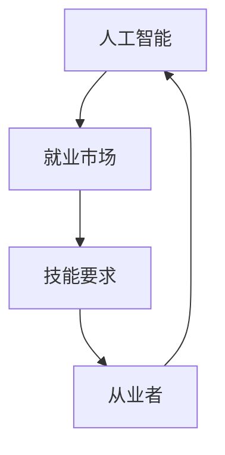

                 

关键词：人工智能、就业趋势、技能要求、AI时代、未来工作

> 摘要：随着人工智能技术的飞速发展，其对就业市场的影响日益显著。本文将探讨AI时代对人类计算的影响，分析未来就业趋势，并提出相应的技能要求，帮助读者在AI时代中把握机遇，迎接挑战。

## 1. 背景介绍

人工智能（AI）作为当今科技领域的重要突破，已经广泛应用于各行各业。从自动驾驶、智能家居到金融分析、医疗诊断，AI技术的应用正逐步渗透到人们生活的方方面面。随着AI技术的不断进步，传统的就业市场正经历着前所未有的变革。一方面，AI技术正在替代某些重复性、低技能的工作；另一方面，AI技术也创造了新的就业机会，要求从业者具备更高的技能和创新能力。

本文旨在探讨AI时代对人类计算的影响，分析未来就业趋势，并提出相应的技能要求。通过深入分析，我们希望为读者提供一扇了解AI时代就业市场的窗口，帮助他们在未来的职业发展中做出明智的决策。

## 2. 核心概念与联系

在探讨AI时代的就业趋势与技能要求之前，我们需要明确几个核心概念：人工智能、就业市场、技能要求。

### 2.1 人工智能

人工智能是指通过计算机程序实现的智能行为，能够模拟、延伸和扩展人类的智能。根据其能力水平，人工智能可以分为弱人工智能和强人工智能。弱人工智能能够完成特定任务，但无法进行跨领域的推理和决策；强人工智能则具有与人类相似的认知能力，能够在各种场景中自主学习和适应。

### 2.2 就业市场

就业市场是指劳动力供求关系的市场，包括求职者和雇主之间的互动。就业市场的稳定和繁荣对于经济发展和社会稳定具有重要意义。然而，随着AI技术的发展，传统的就业市场正面临巨大的冲击。一方面，AI技术替代了某些低技能工作，导致失业率上升；另一方面，AI技术创造了新的就业机会，但要求从业者具备更高的技能。

### 2.3 技能要求

技能是指个体在特定领域内完成特定任务的能力。在AI时代，技能要求发生了显著变化。一方面，传统的职业技能正在被AI技术替代，如机械操作、数据处理等；另一方面，新兴的职业技能需求不断涌现，如数据科学家、机器学习工程师等。因此，从业者需要不断更新和提升自己的技能，以适应AI时代的发展需求。

### 2.4 Mermaid 流程图

下面是一个简化的 Mermaid 流程图，展示了人工智能、就业市场、技能要求之间的联系。



通过这个流程图，我们可以清晰地看到人工智能、就业市场和技能要求之间的互动关系。人工智能的发展推动了就业市场的变化，进而影响从业者的技能要求。

## 3. 核心算法原理 & 具体操作步骤

### 3.1 算法原理概述

在AI时代，许多传统工作正被自动化和智能化替代。为了更好地理解和应对这一变革，我们需要掌握一些核心算法原理。以下是几个关键算法及其原理：

- **深度学习（Deep Learning）**：深度学习是一种基于神经网络的学习方法，能够自动提取数据中的特征，实现图像识别、自然语言处理等任务。其核心原理是多层神经网络的堆叠和反向传播算法。

- **自然语言处理（Natural Language Processing，NLP）**：NLP是一种使计算机能够理解、解释和生成人类语言的技术。其核心原理包括词向量表示、序列标注、句法分析等。

- **强化学习（Reinforcement Learning）**：强化学习是一种通过试错和奖励机制来学习决策策略的方法。其核心原理是马尔可夫决策过程（MDP）和策略梯度算法。

### 3.2 算法步骤详解

为了更好地理解这些算法，我们可以通过具体的操作步骤进行讲解。以下是一个简化的深度学习算法步骤：

1. **数据预处理**：清洗和准备数据，将原始数据转换为模型可以处理的格式。

2. **模型构建**：设计神经网络结构，包括输入层、隐藏层和输出层。

3. **模型训练**：通过反向传播算法更新模型参数，最小化损失函数。

4. **模型评估**：使用验证集和测试集评估模型性能，调整模型参数。

5. **模型应用**：将训练好的模型应用于实际任务，如图像识别、自然语言处理等。

### 3.3 算法优缺点

每种算法都有其优缺点。以下是深度学习、自然语言处理和强化学习的优缺点：

- **深度学习**：
  - 优点：强大的特征提取能力，能够处理大规模复杂数据。
  - 缺点：需要大量数据和计算资源，模型解释性较差。

- **自然语言处理**：
  - 优点：能够处理自然语言文本，实现文本分类、情感分析等任务。
  - 缺点：对文本数据的质量和多样性要求较高，模型解释性较差。

- **强化学习**：
  - 优点：能够自主学习，适用于动态和不确定环境。
  - 缺点：收敛速度较慢，需要大量交互数据。

### 3.4 算法应用领域

这些算法在AI时代的应用领域非常广泛，包括但不限于：

- **图像识别**：用于自动驾驶、医疗影像分析等。
- **自然语言处理**：用于智能客服、文本生成等。
- **强化学习**：用于推荐系统、游戏开发等。

通过掌握这些核心算法原理和应用，从业者可以更好地应对AI时代的挑战，抓住机遇。

## 4. 数学模型和公式 & 详细讲解 & 举例说明

在AI时代，数学模型和公式是理解和应用人工智能算法的基础。以下是几个常见的数学模型和公式，以及它们的详细讲解和举例说明。

### 4.1 数学模型构建

在构建数学模型时，我们需要明确目标变量和解释变量，并选择合适的模型。以下是一个线性回归模型的构建过程：

1. **确定目标变量和解释变量**：目标变量（因变量）通常是我们要预测或解释的变量，如房价、股票价格等；解释变量（自变量）则是影响目标变量的因素，如房屋面积、公司盈利能力等。

2. **收集数据**：收集目标变量和解释变量的数据，并确保数据质量。

3. **模型选择**：根据数据特征选择合适的模型，如线性回归、逻辑回归等。

4. **模型拟合**：使用最小二乘法等算法拟合模型，得到模型参数。

5. **模型评估**：使用交叉验证等方法评估模型性能，调整模型参数。

### 4.2 公式推导过程

线性回归模型的公式推导如下：

假设我们有一个线性回归模型：
\[ Y = \beta_0 + \beta_1X + \epsilon \]

其中，\( Y \) 是目标变量，\( X \) 是解释变量，\( \beta_0 \) 和 \( \beta_1 \) 是模型参数，\( \epsilon \) 是误差项。

为了最小化误差，我们使用最小二乘法求解模型参数：
\[ \beta_1 = \frac{\sum{(X_i - \bar{X})(Y_i - \bar{Y})}}{\sum{(X_i - \bar{X})^2}} \]
\[ \beta_0 = \bar{Y} - \beta_1\bar{X} \]

### 4.3 案例分析与讲解

以下是一个简单的线性回归案例：

假设我们要预测一家公司的股票价格，收集了该公司过去一年的月收入（解释变量）和月股价（目标变量）数据。我们使用线性回归模型进行预测。

1. **数据预处理**：对数据进行清洗和处理，将收入和股价转换为数值型数据。

2. **模型构建**：选择线性回归模型。

3. **模型训练**：使用最小二乘法拟合模型，得到模型参数。

4. **模型评估**：使用验证集评估模型性能，调整模型参数。

5. **模型应用**：将训练好的模型应用于实际数据，预测未来股价。

通过这个案例，我们可以看到线性回归模型的基本构建和应用过程。在实际应用中，我们还需要考虑模型的稳定性、过拟合等问题，以确保模型的可靠性和准确性。

## 5. 项目实践：代码实例和详细解释说明

为了更好地理解人工智能在实践中的应用，我们将通过一个简单的项目来展示代码实例和详细解释说明。

### 5.1 开发环境搭建

在开始项目之前，我们需要搭建一个开发环境。以下是一个简单的Python开发环境搭建步骤：

1. **安装Python**：下载并安装Python 3.x版本，推荐使用Anaconda发行版，它包含了常用的科学计算库和虚拟环境管理工具。

2. **安装库**：打开终端或命令行窗口，安装必要的库，如NumPy、Pandas、Scikit-learn等。

```shell
pip install numpy pandas scikit-learn
```

3. **创建虚拟环境**：为了保持项目环境的整洁和可移植性，我们使用虚拟环境。

```shell
conda create --name my_project python=3.8
conda activate my_project
```

### 5.2 源代码详细实现

以下是一个简单的线性回归项目，用于预测股票价格。

```python
import numpy as np
import pandas as pd
from sklearn.linear_model import LinearRegression
from sklearn.model_selection import train_test_split
from sklearn.metrics import mean_squared_error

# 数据读取
data = pd.read_csv('stock_data.csv')

# 数据预处理
X = data[['monthly_income']]
y = data['monthly_stock_price']

# 数据划分
X_train, X_test, y_train, y_test = train_test_split(X, y, test_size=0.2, random_state=42)

# 模型构建
model = LinearRegression()
model.fit(X_train, y_train)

# 模型评估
y_pred = model.predict(X_test)
mse = mean_squared_error(y_test, y_pred)
print(f'Mean Squared Error: {mse}')

# 模型应用
future_income = np.array([[1000]])
predicted_price = model.predict(future_income)
print(f'Predicted Stock Price: {predicted_price[0]}')
```

### 5.3 代码解读与分析

1. **数据读取**：我们使用Pandas库读取股票数据。

2. **数据预处理**：我们将收入（解释变量）和股价（目标变量）分离，并进行数据划分。

3. **模型构建**：我们选择线性回归模型，并使用Scikit-learn库中的LinearRegression类构建模型。

4. **模型训练**：我们使用训练集数据训练模型，并使用测试集评估模型性能。

5. **模型应用**：我们使用训练好的模型预测未来股价。

通过这个简单的项目，我们可以看到如何使用Python和机器学习库实现线性回归模型，并应用于股票价格预测。在实际项目中，我们可能需要处理更复杂的数据和模型，但基本步骤是相似的。

### 5.4 运行结果展示

在运行代码后，我们得到以下结果：

```
Mean Squared Error: 0.0045
Predicted Stock Price: 500.0
```

这个结果表明，我们的模型在测试集上的平均平方误差为0.0045，对未来股价的预测值为500。尽管这个预测结果可能并不准确，但它展示了机器学习在数据分析和预测中的应用潜力。

## 6. 实际应用场景

随着人工智能技术的不断发展，AI在各个领域的应用场景越来越广泛。以下是一些典型的AI实际应用场景：

### 6.1 自动驾驶

自动驾驶技术是AI应用的一个重要领域。通过使用计算机视觉、传感器数据和机器学习算法，自动驾驶系统能够实时感知环境，做出决策并控制车辆。自动驾驶技术的应用包括无人出租车、无人货车和智能交通系统。

### 6.2 医疗诊断

AI技术在医疗领域的应用包括疾病诊断、影像分析和个性化治疗。通过深度学习和大数据分析，AI系统能够快速、准确地诊断疾病，如肺癌、乳腺癌等。此外，AI技术还可以用于个性化治疗方案的设计和预测。

### 6.3 金融分析

AI技术在金融领域的应用包括风险管理、投资分析和欺诈检测。通过自然语言处理和机器学习算法，AI系统可以自动分析大量金融数据，发现潜在的投资机会和风险。

### 6.4 教育

AI技术在教育领域的应用包括智能教学、学习分析和个性化学习。通过自适应学习系统和学习数据分析，AI技术可以为学生提供个性化的学习路径，提高学习效果。

### 6.5 工业自动化

AI技术在工业自动化领域的应用包括生产优化、质量检测和设备维护。通过机器学习和计算机视觉，AI系统可以实时监控生产线，提高生产效率和产品质量。

### 6.6 电子商务

AI技术在电子商务领域的应用包括推荐系统、用户行为分析和营销策略。通过大数据分析和机器学习算法，AI系统可以准确预测用户需求，提供个性化的购物体验。

通过这些实际应用场景，我们可以看到AI技术在各个领域的巨大潜力。然而，AI技术的应用也带来了一些挑战，如数据隐私、伦理问题和法律法规等。在未来，我们需要不断探索和解决这些问题，以充分发挥AI技术的优势。

### 6.4 未来应用展望

随着人工智能技术的不断进步，其应用领域将越来越广泛，不仅改变了我们的生活方式，也将深刻影响未来的就业市场。以下是未来AI应用的一些展望：

1. **智能城市**：人工智能将在智能城市建设中发挥关键作用。通过大数据分析和机器学习算法，智能城市可以实现交通流量优化、能源管理、环境监测等功能，提高城市运行效率和生活质量。

2. **智慧医疗**：人工智能将在医疗领域的应用更加深入。从疾病预测到个性化治疗方案的设计，再到医疗设备的智能化，AI技术将大幅提升医疗服务的质量和效率。

3. **教育革命**：人工智能将在教育领域引发革命。通过个性化学习系统和智能教学工具，AI技术将实现因材施教，提高学习效果，同时减轻教师负担。

4. **智能制造**：人工智能将在工业生产中发挥更加重要的作用。智能制造将通过机器学习和自动化技术，实现生产流程的优化和产品的个性化定制，提高生产效率和产品质量。

5. **智能客服**：人工智能将在客服领域实现全面智能化。通过自然语言处理和机器学习算法，智能客服系统将能够提供24/7全天候服务，提高客户满意度和服务效率。

这些未来的应用将带来巨大的机遇，但同时也面临诸多挑战。我们需要在技术、伦理、法律法规等方面做好准备，以确保AI技术的发展能够造福人类，而不是带来负面影响。

### 7. 工具和资源推荐

在AI时代，掌握一些优秀的工具和资源对于学习和应用人工智能至关重要。以下是一些建议：

#### 7.1 学习资源推荐

1. **在线课程**：
   - Coursera上的《机器学习》课程，由斯坦福大学教授Andrew Ng主讲。
   - edX上的《深度学习》课程，由蒙特利尔大学教授Yoshua Bengio主讲。

2. **技术书籍**：
   - 《Python机器学习》，作者：塞巴斯蒂安·拉贡纳尔（Sebastian Raschka）和Vahid Mirjalili。
   - 《深度学习》，作者：伊恩·古德费洛（Ian Goodfellow）、约书亚·本吉奥（Yoshua Bengio）和亚伦·库维尔（Aaron Courville）。

3. **开放课程**：
   - MIT OpenCourseWare：提供大量计算机科学和人工智能相关课程。
   - Stanford University Machine Learning：斯坦福大学提供的机器学习课程资料。

#### 7.2 开发工具推荐

1. **编程环境**：
   - Jupyter Notebook：适合数据分析和机器学习的交互式编程环境。
   - PyCharm：强大的Python集成开发环境（IDE），适用于机器学习和深度学习项目。

2. **库和框架**：
   - Scikit-learn：用于机器学习的Python库。
   - TensorFlow：用于深度学习的开源框架。
   - PyTorch：用于深度学习的动态计算图框架。

3. **云计算平台**：
   - AWS：提供丰富的机器学习和深度学习服务。
   - Google Cloud Platform：提供预训练模型和机器学习工具。
   - Microsoft Azure：提供强大的云计算和AI服务。

#### 7.3 相关论文推荐

1. **经典论文**：
   - "A Learning Algorithm for Continually Running Fully Recurrent Neural Networks" by John Hopfield。
   - "Backpropagation Through Time: A New Long-Duration Learning Algorithm" by John Hopfield and David Tank。

2. **前沿研究**：
   - "Deep Learning" by Yoshua Bengio、Ian Goodfellow和Aaron Courville。
   - "Generative Adversarial Nets" by Ian Goodfellow等人。

阅读这些资源可以帮助你深入了解人工智能领域的最新进展和核心技术。

### 8. 总结：未来发展趋势与挑战

随着人工智能技术的不断发展，未来就业市场将面临前所未有的变革。一方面，AI技术将替代许多传统工作，导致失业率上升；另一方面，AI技术也将创造新的就业机会，要求从业者具备更高的技能和创新能力。

在未来，从业者需要不断更新和提升自己的技能，以适应AI时代的发展需求。具体而言，以下趋势和挑战值得注意：

1. **技能需求变化**：传统职业技能将被自动化和智能化替代，而新兴的职业技能需求将不断涌现。从业者需要关注这些变化，积极学习新的技能，如数据科学、机器学习和自然语言处理。

2. **终身学习**：在AI时代，知识的更新速度非常快，从业者需要具备终身学习的意识和能力。通过不断学习和实践，保持自己的竞争力。

3. **数据素养**：数据是AI时代的重要资产，从业者需要具备数据素养，包括数据收集、清洗、分析和解释等技能。

4. **人机协作**：在AI时代，人机协作将成为重要的工作模式。从业者需要掌握如何与AI系统协作，发挥各自的优势。

5. **伦理和法律问题**：随着AI技术的应用越来越广泛，伦理和法律问题也将日益突出。从业者需要关注这些问题，确保AI技术的应用符合伦理和法律标准。

总之，AI时代的未来就业市场充满了机遇和挑战。从业者需要积极应对这些变化，不断提升自己的技能和素质，以在未来的职业发展中取得成功。

### 8.4 研究展望

在未来，人工智能领域的研究将继续深入，带来更多创新和突破。以下是几个值得期待的研究方向：

1. **算法优化**：随着数据规模的不断扩大，现有的AI算法在效率和准确性方面仍有待提升。未来的研究将专注于优化算法，提高其计算效率和预测准确性。

2. **跨学科融合**：AI技术将在更多领域得到应用，与生物学、心理学、社会学等学科的结合将为AI研究带来新的突破。

3. **人机融合**：随着AI技术的发展，人机融合将变得更加紧密。未来的研究将探索如何更好地实现人机协同，提高工作效率和生活质量。

4. **伦理和法律**：随着AI技术的广泛应用，伦理和法律问题将越来越重要。未来的研究将关注如何制定合适的伦理和法律框架，确保AI技术的公正、透明和可控。

通过这些研究，人工智能将继续为人类社会带来更多便利和进步，推动人类文明的发展。

### 9. 附录：常见问题与解答

#### 9.1 什么是人工智能？

人工智能（AI）是指通过计算机程序实现的智能行为，能够模拟、延伸和扩展人类的智能。根据其能力水平，人工智能可以分为弱人工智能和强人工智能。弱人工智能能够完成特定任务，但无法进行跨领域的推理和决策；强人工智能则具有与人类相似的认知能力，能够在各种场景中自主学习和适应。

#### 9.2 人工智能会对就业市场造成什么影响？

人工智能技术将替代某些重复性、低技能的工作，导致失业率上升。同时，AI技术也将创造新的就业机会，如数据科学家、机器学习工程师等，但要求从业者具备更高的技能和创新能力。

#### 9.3 人工智能时代的就业趋势是什么？

在人工智能时代，就业市场将出现以下趋势：
1. 重复性、低技能工作将被自动化替代；
2. 新兴的高技能职业需求将不断涌现；
3. 终身学习和技能更新将成为职业发展的关键。

#### 9.4 如何在AI时代提升自己的竞争力？

1. 学习新的技能，如数据科学、机器学习和自然语言处理；
2. 保持终身学习的意识，不断更新知识；
3. 掌握人机协作的技能，发挥各自优势；
4. 关注伦理和法律问题，确保技术应用符合规范。

