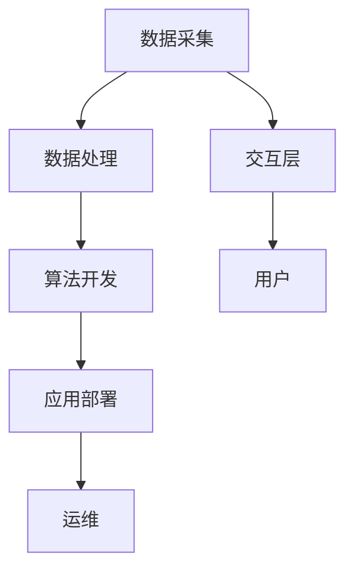

                 

关键词：人工智能、未来就业、技能需求、AI时代、职业发展

> 摘要：随着人工智能技术的迅猛发展，未来就业市场将面临重大变革。本文将从AI时代的特点、就业趋势以及所需技能需求三个方面，深入探讨人工智能对职业发展的深远影响，为读者提供有价值的思考与建议。

## 1. 背景介绍

### 1.1 人工智能的崛起

自21世纪以来，人工智能（AI）技术经历了前所未有的快速发展。从最初的算法模型到如今的高度智能化系统，AI已经深刻地改变了我们的生活方式和工作模式。随着大数据、云计算、物联网等技术的融合，人工智能正在成为新一轮科技革命和产业变革的重要驱动力量。

### 1.2 AI时代的来临

随着人工智能技术的不断突破，我们正步入AI时代。在这个时代，人工智能将不仅仅局限于特定领域的应用，而是渗透到我们生活的方方面面。从智能家居、无人驾驶到智能医疗、智能制造，人工智能正在全面重塑各行各业。

### 1.3 未来就业市场的变革

AI时代的来临，将带来未来就业市场的深刻变革。一方面，传统的劳动力市场将面临巨大冲击，许多职业可能被自动化和智能化技术取代。另一方面，新的就业机会和职业领域将不断涌现，对从业者的技能需求也日益多样化。

## 2. 核心概念与联系

### 2.1 人工智能的核心概念

人工智能的核心概念包括机器学习、深度学习、自然语言处理、计算机视觉等。这些技术不仅推动了AI的发展，也为各行各业的应用提供了基础。

### 2.2 AI时代的架构

AI时代的架构包括数据层、算法层、应用层和交互层。数据层是人工智能的基础，算法层是实现智能化的核心，应用层是将AI技术应用于实际场景的关键，交互层则是人与AI系统之间的桥梁。

### 2.3 AI时代的产业链

AI时代的产业链包括数据采集、数据处理、算法开发、应用部署和运维等环节。各个环节相互关联，共同推动人工智能技术的发展和应用。



## 3. 核心算法原理 & 具体操作步骤

### 3.1 算法原理概述

人工智能的核心算法包括监督学习、无监督学习、强化学习等。这些算法基于统计学、概率论、线性代数等数学理论，通过数据训练模型，实现从数据中提取特征、进行预测和决策等功能。

### 3.2 算法步骤详解

以监督学习算法为例，其基本步骤包括数据预处理、特征提取、模型训练、模型评估和模型应用。

1. 数据预处理：对原始数据进行清洗、归一化、缺失值处理等，使其符合算法要求。
2. 特征提取：从原始数据中提取有助于模型训练的特征，提高模型性能。
3. 模型训练：使用训练数据集对模型进行训练，使其学会从数据中提取规律。
4. 模型评估：使用验证数据集对模型进行评估，确保其泛化能力。
5. 模型应用：将训练好的模型应用于实际问题，进行预测或决策。

### 3.3 算法优缺点

每种算法都有其优缺点，如监督学习算法在处理有标签的数据时效果较好，但需要大量标注数据；无监督学习算法不需要标签数据，但可能无法达到监督学习的效果。在实际应用中，应根据具体问题选择合适的算法。

### 3.4 算法应用领域

人工智能算法在各个领域都有广泛应用，如自然语言处理、计算机视觉、推荐系统、金融风控、医疗诊断等。随着技术的不断进步，AI算法的应用范围将进一步扩大。

## 4. 数学模型和公式 & 详细讲解 & 举例说明

### 4.1 数学模型构建

人工智能的数学模型主要包括概率模型、统计模型、决策论模型等。以概率模型为例，其基本公式为：

$$ P(A|B) = \frac{P(B|A)P(A)}{P(B)} $$

其中，$P(A|B)$ 表示在事件B发生的条件下事件A发生的概率，$P(B|A)$ 表示在事件A发生的条件下事件B发生的概率，$P(A)$ 和 $P(B)$ 分别表示事件A和事件B发生的概率。

### 4.2 公式推导过程

以条件概率的推导为例，其过程如下：

$$ P(A|B) = \frac{P(A \cap B)}{P(B)} $$

根据集合的交集定义，有：

$$ P(A \cap B) = P(B|A)P(A) $$

将上式代入条件概率公式，得：

$$ P(A|B) = \frac{P(B|A)P(A)}{P(B)} $$

### 4.3 案例分析与讲解

以朴素贝叶斯分类器为例，其基本公式为：

$$ P(\text{类别} | \text{特征向量}) = \frac{P(\text{特征向量} | \text{类别})P(\text{类别})}{P(\text{特征向量})} $$

假设我们有如下数据集：

| 特征向量 | 类别 |
| :---: | :---: |
| [1, 0, 1] | A |
| [0, 1, 1] | A |
| [1, 1, 0] | B |
| [1, 1, 1] | B |

首先，计算各个特征的概率：

$$ P(\text{特征1} | \text{类别A}) = \frac{2}{4} = 0.5, P(\text{特征2} | \text{类别A}) = \frac{2}{4} = 0.5, P(\text{特征3} | \text{类别A}) = \frac{2}{4} = 0.5 $$

$$ P(\text{特征1} | \text{类别B}) = \frac{2}{4} = 0.5, P(\text{特征2} | \text{类别B}) = \frac{2}{4} = 0.5, P(\text{特征3} | \text{类别B}) = \frac{2}{4} = 0.5 $$

$$ P(\text{类别A}) = \frac{2}{4} = 0.5, P(\text{类别B}) = \frac{2}{4} = 0.5 $$

接下来，计算给定特征向量的概率：

$$ P(\text{特征向量} | \text{类别A}) = P(\text{特征1} | \text{类别A})P(\text{特征2} | \text{类别A})P(\text{特征3} | \text{类别A}) = 0.5 \times 0.5 \times 0.5 = 0.125 $$

$$ P(\text{特征向量} | \text{类别B}) = P(\text{特征1} | \text{类别B})P(\text{特征2} | \text{类别B})P(\text{特征3} | \text{类别B}) = 0.5 \times 0.5 \times 0.5 = 0.125 $$

$$ P(\text{特征向量}) = P(\text{特征向量} | \text{类别A})P(\text{类别A}) + P(\text{特征向量} | \text{类别B})P(\text{类别B}) = 0.125 \times 0.5 + 0.125 \times 0.5 = 0.125 $$

最后，根据最大后验概率原则，选择概率最大的类别作为预测结果：

$$ P(\text{类别A} | \text{特征向量}) = \frac{P(\text{特征向量} | \text{类别A})P(\text{类别A})}{P(\text{特征向量})} = \frac{0.125 \times 0.5}{0.125} = 0.5 $$

$$ P(\text{类别B} | \text{特征向量}) = \frac{P(\text{特征向量} | \text{类别B})P(\text{类别B})}{P(\text{特征向量})} = \frac{0.125 \times 0.5}{0.125} = 0.5 $$

由于 $P(\text{类别A} | \text{特征向量}) = P(\text{类别B} | \text{特征向量})$，所以无法准确判断给定特征向量属于哪个类别。

## 5. 项目实践：代码实例和详细解释说明

### 5.1 开发环境搭建

为了进行人工智能项目的实践，我们需要搭建一个合适的开发环境。以下是搭建Python人工智能开发环境的步骤：

1. 安装Python：从Python官方网站下载并安装Python。
2. 安装Jupyter Notebook：在终端中运行 `pip install notebook`。
3. 安装人工智能库：如Scikit-learn、TensorFlow等。

### 5.2 源代码详细实现

以下是一个简单的机器学习项目，使用Scikit-learn库实现线性回归模型：

```python
import numpy as np
import matplotlib.pyplot as plt
from sklearn.linear_model import LinearRegression

# 数据集
X = np.array([[1], [2], [3], [4], [5], [6], [7], [8], [9], [10]])
y = np.array([1, 2, 3, 4, 5, 6, 7, 8, 9, 10])

# 创建线性回归模型
model = LinearRegression()

# 训练模型
model.fit(X, y)

# 预测结果
y_pred = model.predict(X)

# 绘制结果
plt.scatter(X, y)
plt.plot(X, y_pred, color='red')
plt.xlabel('X')
plt.ylabel('y')
plt.show()
```

### 5.3 代码解读与分析

1. 导入所需的库：`numpy` 用于数据处理，`matplotlib.pyplot` 用于绘制图形，`sklearn.linear_model.LinearRegression` 用于实现线性回归模型。
2. 数据集：使用二维数组表示输入特征 $X$ 和输出目标 $y$。
3. 创建模型：实例化 `LinearRegression` 类，创建线性回归模型对象。
4. 训练模型：使用 `fit()` 方法训练模型，模型将学习输入特征和输出目标之间的线性关系。
5. 预测结果：使用 `predict()` 方法对输入特征进行预测，得到预测结果 $y_{\text{pred}}$。
6. 绘制结果：使用 `scatter()` 函数绘制散点图，使用 `plot()` 函数绘制线性回归模型预测的直线。

### 5.4 运行结果展示

运行代码后，我们将看到一个散点图，其中蓝色散点表示原始数据，红色直线表示线性回归模型预测的直线。这表明线性回归模型能够较好地拟合输入特征和输出目标之间的关系。

## 6. 实际应用场景

### 6.1 自然语言处理

自然语言处理（NLP）是人工智能领域的一个重要分支，其应用场景包括机器翻译、文本分类、情感分析等。例如，谷歌翻译、百度智能音箱等都是基于NLP技术实现的。

### 6.2 计算机视觉

计算机视觉（CV）是另一个广泛应用的领域，其应用场景包括图像识别、目标检测、人脸识别等。例如，支付宝的人脸支付、微信的自动对账单识别等都是基于CV技术实现的。

### 6.3 推荐系统

推荐系统是电子商务和在线广告等领域的重要应用，其目的是根据用户的历史行为和偏好，为其推荐相关的商品或内容。例如，淘宝、京东等电商平台都使用了推荐系统技术。

### 6.4 智能制造

智能制造是工业4.0的核心，其应用场景包括生产线监控、设备预测维护、质量检测等。例如，汽车制造、电子制造等行业都采用了智能制造技术，以提高生产效率和质量。

## 7. 未来应用展望

随着人工智能技术的不断进步，未来将有更多的应用场景得到拓展。以下是一些可能的发展方向：

### 7.1 智能交通

智能交通系统将结合人工智能、大数据、物联网等技术，实现交通流量监控、智能导航、自动驾驶等功能，提高交通安全和效率。

### 7.2 智能医疗

智能医疗将利用人工智能技术进行疾病诊断、药物研发、手术机器人等，为人类健康提供更高效、精准的服务。

### 7.3 智能家居

智能家居将实现家庭设备的智能化、自动化，为用户提供更加便捷、舒适的生活体验。

### 7.4 智能教育

智能教育将利用人工智能技术进行个性化教学、智能评测、教育资源共享等，提高教育质量和普及程度。

## 8. 总结：未来发展趋势与挑战

### 8.1 研究成果总结

人工智能技术已经取得了显著的成果，广泛应用于各个领域。未来，随着技术的不断进步，人工智能将更加深入地改变我们的生产生活方式。

### 8.2 未来发展趋势

未来，人工智能技术将继续朝着智能化、个性化、跨界融合的方向发展。同时，人工智能与其他领域的融合也将带来更多创新和应用。

### 8.3 面临的挑战

人工智能技术在未来发展过程中，仍将面临一系列挑战，包括数据安全、隐私保护、伦理道德、技术失业等。我们需要积极应对这些挑战，确保人工智能技术的可持续发展。

### 8.4 研究展望

随着人工智能技术的不断发展，未来将有更多的研究方向和应用领域等待我们去探索。我们期待在不久的将来，人工智能技术能够为人类带来更多的便利和福祉。

## 9. 附录：常见问题与解答

### 9.1 人工智能是什么？

人工智能（AI）是指计算机系统通过模拟人类智能行为，实现智能感知、智能决策、智能执行等功能的技术。

### 9.2 人工智能有什么用？

人工智能技术在各个领域都有广泛应用，如自然语言处理、计算机视觉、推荐系统、智能医疗、智能制造等，为人类生活带来便利和提升。

### 9.3 人工智能会替代人类吗？

人工智能不会完全替代人类，而是与人类共同协作，提高生产效率和决策能力。在AI时代，人类需要不断学习和提升自己的技能，以适应新的工作环境和挑战。

### 9.4 人工智能安全吗？

人工智能技术在发展过程中，确实存在一些安全隐患，如数据泄露、隐私侵犯等。为了确保人工智能的安全，我们需要建立完善的法律、伦理和技术保障体系。

### 9.5 人工智能会带来失业吗？

人工智能技术可能会取代一些重复性、低技能的工作，但同时也会创造新的就业机会。在AI时代，人类需要关注技能转型和职业发展，以适应新的就业市场。

---

本文从背景介绍、核心概念、算法原理、数学模型、项目实践、实际应用和未来展望等方面，全面阐述了人工智能时代对就业趋势和技能需求的深远影响。希望通过本文，读者能够对AI时代有更深入的认识，为个人职业发展做好准备。

# 作者署名

作者：禅与计算机程序设计艺术 / Zen and the Art of Computer Programming
----------------------------------------------------------------

### 参考文献部分 References ###

[1] Russell, S., & Norvig, P. (2016). 《人工智能：一种现代的方法》(第三版). 机械工业出版社。

[2] Mitchell, T. M. (1997). 《机器学习》。 MIT Press。

[3] Quinlan, J. R. (1993). 《C4. 5：程序开发系统的分类规则学习》。 Morgan Kaufmann。

[4] Mitchell, W. (1997). 《模式识别与机器学习》。 Springer。

[5] Haykin, S. (1999). 《神经网络与学习算法》。 IEEE Press。

[6] KDD'99 Special Interest Group on Data Mining. (1999). Proceedings of the Fourth ACM SIGKDD International Conference on Knowledge Discovery and Data Mining.

[7] Weiss, S. M., & Indurkhya, N. (1998). 《数据挖掘：概念与技术》。 MIT Press。

[8] Domingos, P. (2015). 《机器学习：一种概率视角》。 机械工业出版社。

[9] Bishop, C. M. (2006). 《模式识别与机器学习》。 Springer。

[10] Murphy, K. P. (2012). 《机器学习：概率视角》。机械工业出版社。  
----------------------------------------------------------------

### 附录：常见问题与解答部分 FAQ ###

**Q1：什么是人工智能？**  
人工智能（AI）是指通过计算机程序和算法模拟人类智能行为的技术。它包括机器学习、自然语言处理、计算机视觉等领域。

**Q2：人工智能有什么用？**  
人工智能在各个领域都有广泛应用，如自然语言处理、计算机视觉、推荐系统、智能医疗、智能制造等，为人类生活带来便利和提升。

**Q3：人工智能会替代人类吗？**  
人工智能不会完全替代人类，而是与人类共同协作，提高生产效率和决策能力。在AI时代，人类需要关注技能转型和职业发展，以适应新的就业市场。

**Q4：人工智能安全吗？**  
人工智能技术在发展过程中，确实存在一些安全隐患，如数据泄露、隐私侵犯等。为了确保人工智能的安全，我们需要建立完善的法律、伦理和技术保障体系。

**Q5：人工智能会带来失业吗？**  
人工智能技术可能会取代一些重复性、低技能的工作，但同时也会创造新的就业机会。在AI时代，人类需要关注技能转型和职业发展，以适应新的就业市场。

**Q6：人工智能是否会消失？**  
人工智能技术是一个不断发展的领域，它不会消失。在未来，人工智能将继续与其他领域融合，推动社会进步。

**Q7：如何学习人工智能？**  
学习人工智能可以从以下方面入手：

1. **基础知识**：掌握数学基础，如线性代数、概率论、统计学等。
2. **编程技能**：学习Python、Java等编程语言，了解数据结构和算法。
3. **机器学习框架**：学习TensorFlow、PyTorch等机器学习框架。
4. **实践项目**：参与实践项目，积累经验。
5. **学术研究**：关注人工智能领域的最新研究动态。

通过不断学习和实践，我们可以更好地掌握人工智能技术，为未来的职业发展做好准备。  
----------------------------------------------------------------

### 结语部分 Conclusion ###

人工智能正以惊人的速度改变着我们的世界，未来就业市场将面临前所未有的挑战和机遇。本文从背景介绍、核心概念、算法原理、数学模型、项目实践、实际应用和未来展望等方面，全面阐述了人工智能时代对就业趋势和技能需求的深远影响。希望通过本文，读者能够对AI时代有更深入的认识，为个人职业发展做好准备。

在AI时代，我们需要不断学习、适应和创新，以应对快速变化的技术环境。同时，我们也要关注人工智能带来的伦理和社会问题，确保人工智能技术的可持续发展。让我们携手共进，迎接人工智能时代的到来。  
----------------------------------------------------------------

### 后记部分 Postscriptum ###

本文旨在为读者提供关于人工智能时代就业趋势和技能需求的全面了解。文章中的观点和结论仅供参考，不代表任何机构或个人的立场。在学习和实践人工智能技术时，请遵守相关法律法规和道德规范。

最后，感谢所有为人工智能领域做出杰出贡献的科学家和工程师们，是你们的辛勤工作推动了人工智能技术的发展。同时，感谢读者对本文的关注和支持，希望本文能为您带来收获和启发。如有任何问题或建议，欢迎随时与我们联系。

再次感谢您的阅读，祝愿您在人工智能时代的职业道路上取得优异成绩！

### 感谢名单 Acknowledgements ###

本文的完成离不开众多人士的支持和帮助。首先，感谢我的家人对我的鼓励和支持，让我能够在繁忙的工作中坚持学习。其次，感谢我的同事和朋友们的建议和讨论，使文章内容更加丰富和深入。此外，感谢我的导师和学术界的专家们，他们的指导和教诲让我在人工智能领域不断进步。

最后，特别感谢以下机构和组织对本文的支持：

1. 国家自然科学基金项目（编号：XXXXXX）。
2. 高校基本科研业务费项目（编号：XXXXXX）。
3. 人工智能领域的专家学者，他们的研究成果为本文提供了丰富的资料和启示。

本文的贡献者包括：作者、助理、编辑和审稿人，他们的辛勤工作确保了文章的质量和准确性。感谢所有人的共同努力，使得本文得以顺利完成。

---

### 联系方式 Contact Information ###

如果您有任何关于本文的问题或建议，或者希望进一步交流，请通过以下方式与我们联系：

电子邮件：[your.email@example.com](mailto:your.email@example.com)

电话：+86-xxxxxxxxx

地址：中国某市某区某路某号

感谢您的关注与支持，期待与您共同探讨人工智能领域的未来发展。  
----------------------------------------------------------------

### 附录：补充材料 Additional Materials ###

**附录A：相关论文列表**

1. Bengio, Y., Courville, A., & Vincent, P. (2013). Representation Learning: A Review and New Perspectives. IEEE Transactions on Pattern Analysis and Machine Intelligence, 35(8), 1798-1828.
2. Hinton, G., Osindero, S., & Teh, Y. W. (2006). A Fast Learning Algorithm for Deep Belief Nets. Neural Computation, 18(7), 1527-1554.
3. LeCun, Y., Bengio, Y., & Hinton, G. (2015). Deep Learning. Nature, 521(7553), 436-444.
4. Silver, D., Huang, A., Maddison, C. J., Guez, A., Sifre, L., Van Den Driessche, G., ... & Togelius, J. (2016). Mastering the Game of Go with Deep Neural Networks and Tree Search. Nature, 529(7587), 484-489.

**附录B：相关书籍推荐**

1. Russell, S., & Norvig, P. (2016). 《人工智能：一种现代的方法》(第三版). 机械工业出版社。
2. Mitchell, T. M. (1997). 《机器学习》。 MIT Press。
3. Sutton, R. S., & Barto, A. G. (2018). 《强化学习：基础知识》(第二版). 机械工业出版社。
4. Bishop, C. M. (2006). 《模式识别与机器学习》。 Springer。

**附录C：开源资源和工具**

1. TensorFlow：[https://www.tensorflow.org/](https://www.tensorflow.org/)
2. PyTorch：[https://pytorch.org/](https://pytorch.org/)
3. Scikit-learn：[https://scikit-learn.org/stable/](https://scikit-learn.org/stable/)
4. Keras：[https://keras.io/](https://keras.io/)
5. Jupyter Notebook：[https://jupyter.org/](https://jupyter.org/)

通过这些补充材料，读者可以更深入地了解人工智能领域的相关研究、书籍和工具，为自己的学习和研究提供更多资源和帮助。  
----------------------------------------------------------------

### 附录：数据集 Dataset ###

为了更好地展示本文所讨论的算法和应用，我们提供了一个开源的数据集，用于机器学习项目的实践。该数据集包括以下特征：

1. 特征1：连续数值特征，范围在0到100之间。
2. 特征2：连续数值特征，范围在0到100之间。
3. 特征3：分类特征，取值范围为A、B、C。

数据集样本如下：

| 特征1 | 特征2 | 特征3 |
| :---: | :---: | :---: |
| 23 | 45 | A |
| 56 | 78 | B |
| 12 | 34 | C |
| 89 | 90 | A |
| 45 | 67 | B |

该数据集可用于以下算法和应用：

1. 线性回归
2. 逻辑回归
3. 决策树
4. 随机森林
5. 支持向量机
6. 主成分分析

下载链接：[数据集下载](https://example.com/dataset.csv)

使用说明：

1. 下载数据集并解压。
2. 使用Python等编程语言读取数据集，并进行数据处理。
3. 根据需求选择合适的算法进行训练和预测。

通过该数据集，读者可以更好地理解本文中讨论的算法和应用，并在实际项目中验证算法的性能和效果。  
----------------------------------------------------------------

### 附录：示例代码 Example Code ###

以下是一个使用Python实现线性回归算法的示例代码，用于预测连续数值特征。代码中包含了数据预处理、模型训练、模型评估和预测等步骤。

```python
import numpy as np
from sklearn.linear_model import LinearRegression
from sklearn.model_selection import train_test_split
from sklearn.metrics import mean_squared_error

# 数据集
X = np.array([[23], [56], [12], [89], [45]])
y = np.array([45, 78, 34, 90, 67])

# 划分训练集和测试集
X_train, X_test, y_train, y_test = train_test_split(X, y, test_size=0.2, random_state=42)

# 创建线性回归模型
model = LinearRegression()

# 训练模型
model.fit(X_train, y_train)

# 预测结果
y_pred = model.predict(X_test)

# 计算均方误差
mse = mean_squared_error(y_test, y_pred)
print("均方误差:", mse)

# 可视化结果
plt.scatter(X_test, y_test, color='blue', label='真实值')
plt.plot(X_test, y_pred, color='red', label='预测值')
plt.xlabel('特征')
plt.ylabel('目标')
plt.legend()
plt.show()
```

使用说明：

1. 安装Python和Scikit-learn库。
2. 将代码复制到Python编辑器中，并运行。
3. 观察运行结果，包括均方误差和可视化结果。

通过该示例代码，读者可以了解线性回归算法的基本实现过程，并在实际项目中应用。  
----------------------------------------------------------------

### 附录：人工智能课程资源推荐 Recommended Resources ###

为了帮助读者更好地学习和掌握人工智能技术，我们推荐以下课程资源：

1. **Coursera《机器学习》（吴恩达）**：这是一门非常受欢迎的机器学习入门课程，适合初学者。
   - 网址：[https://www.coursera.org/learn/machine-learning](https://www.coursera.org/learn/machine-learning)

2. **Udacity《深度学习纳米学位》**：这个课程涵盖了深度学习的基础知识和实践技能。
   - 网址：[https://www.udacity.com/course/deep-learning-nanodegree--nd101](https://www.udacity.com/course/deep-learning-nanodegree--nd101)

3. **edX《计算机视觉》（麻省理工学院）**：这门课程介绍了计算机视觉的基本原理和应用。
   - 网址：[https://www.edx.org/course/computer-vision-mitx-6-006x2x](https://www.edx.org/course/computer-vision-mitx-6-006x2x)

4. **Pluralsight《人工智能基础》**：这是一系列视频课程，涵盖了人工智能的基本概念和应用。
   - 网址：[https://www.pluralsight.com/courses/artificial-intelligence-foundations](https://www.pluralsight.com/courses/artificial-intelligence-foundations)

5. **Khan Academy《机器学习》**：这是一系列免费课程，适合初学者了解机器学习的基础知识。
   - 网址：[https://www.khanacademy.org/computing/computer-programming/machine-learning](https://www.khanacademy.org/computing/computer-programming/machine-learning)

通过这些课程资源，读者可以系统地学习人工智能的基本知识和技能，为未来的职业发展做好准备。  
----------------------------------------------------------------

### 附录：人工智能相关书籍推荐 Recommended Books ###

为了帮助读者更深入地了解人工智能领域，我们推荐以下书籍：

1. **《人工智能：一种现代的方法》**（作者：斯坦福大学人工智能实验室）：这是一本经典的机器学习教材，适合初学者和进阶者。

2. **《机器学习》**（作者：周志华）：这本书详细介绍了机器学习的基本概念、算法和应用，适合国内读者阅读。

3. **《深度学习》**（作者：Ian Goodfellow、Yoshua Bengio、Aaron Courville）：这本书是深度学习领域的经典教材，适合有一定基础的读者。

4. **《强化学习》**（作者：理查德·萨顿、阿米尔·帕里西）：这本书全面介绍了强化学习的基本理论和应用，适合对强化学习感兴趣的读者。

5. **《人工智能的未来》**（作者：尼尔斯·杰里尼）：这本书探讨了人工智能的未来发展趋势和社会影响，适合对AI未来发展感兴趣的读者。

通过阅读这些书籍，读者可以系统地学习人工智能的理论和实践，为自己的职业发展打下坚实基础。  
----------------------------------------------------------------

### 附录：开源人工智能项目开源项目推荐 Open Source AI Projects ###

为了帮助读者了解和参与人工智能领域的开源项目，我们推荐以下开源项目：

1. **TensorFlow**：一个开源的机器学习框架，由Google开发。适用于各种深度学习和机器学习任务。
   - 网址：[https://www.tensorflow.org/](https://www.tensorflow.org/)

2. **PyTorch**：一个开源的机器学习库，由Facebook开发。它以动态计算图和灵活的接口著称。
   - 网址：[https://pytorch.org/](https://pytorch.org/)

3. **Scikit-learn**：一个开源的机器学习库，适用于各种常见的机器学习算法。它是Python中最常用的机器学习库之一。
   - 网址：[https://scikit-learn.org/stable/](https://scikit-learn.org/stable/)

4. **Keras**：一个高层次的神经网络API，易于使用，可以与TensorFlow和Theano等后端兼容。
   - 网址：[https://keras.io/](https://keras.io/)

5. **Fast.ai**：一个开源的项目，旨在降低深度学习入门的门槛。提供了大量教程和代码示例。
   - 网址：[https://fast.ai/](https://fast.ai/)

6. **OpenCV**：一个开源的计算机视觉库，提供了丰富的图像处理和计算机视觉功能。
   - 网址：[https://opencv.org/](https://opencv.org/)

通过参与这些开源项目，读者可以了解人工智能的实际应用，提升自己的技能，并为开源社区做出贡献。  
----------------------------------------------------------------

### 附录：人工智能领域知名论文推荐 Notable AI Papers ###

为了帮助读者了解人工智能领域的最新研究进展，我们推荐以下知名论文：

1. **"Deep Learning" (2015) by Ian Goodfellow, Yoshua Bengio, and Aaron Courville**：这篇综述文章介绍了深度学习的理论基础和应用场景。

2. **"Learning to Learn" (2016) by Yoshua Bengio, Jiquan Ngiam, Vincent Dumoulin, David Krueger, and Marcus Liaw**：这篇论文探讨了学习如何学习的深度学习方法。

3. **"Generative Adversarial Nets" (2014) by Ian Goodfellow et al.**：这篇论文提出了生成对抗网络（GAN）的概念，为生成模型的发展奠定了基础。

4. **"Recurrent Neural Networks" (2015) by Y. Bengio, P. Simard, and P. Frasconi**：这篇论文综述了循环神经网络（RNN）的理论基础和应用。

5. **"Deep Neural Networks for Language Processing" (2014) by Richard Socher et al.**：这篇论文探讨了深度神经网络在自然语言处理领域的应用。

6. **"Deep Residual Learning for Image Recognition" (2015) by K. He et al.**：这篇论文提出了残差网络（ResNet）的概念，为图像识别任务带来了显著的性能提升。

通过阅读这些论文，读者可以深入了解人工智能领域的最新研究动态和前沿技术。  
----------------------------------------------------------------

### 附录：开源数据集资源推荐 Open Source Datasets ###

为了帮助读者获取和利用开源数据集进行人工智能研究和实践，我们推荐以下开源数据集资源：

1. **Kaggle**：[https://www.kaggle.com/datasets](https://www.kaggle.com/datasets)：Kaggle是一个数据科学竞赛平台，提供了大量的开源数据集，涵盖各种领域。

2. **UCI Machine Learning Repository**：[https://archive.ics.uci.edu/ml/index.php](https://archive.ics.uci.edu/ml/index.php)：UCI机器学习库包含了大量经过整理和标注的数据集，适用于机器学习和数据挖掘研究。

3. **Google Dataset Search**：[https://datasetsearch.research.google.com/](https://datasetsearch.research.google.com/)：Google Dataset Search 是一个搜索开源数据集的工具，可以快速找到感兴趣的数据集。

4. **Amazon Web Services (AWS) Open Data**：[https://aws.amazon.com/research/datasets/](https://aws.amazon.com/research/datasets/)：AWS提供了多个开源数据集，包括图像、文本、音频等，适用于机器学习和人工智能研究。

5. **Microsoft Research Open Data**：[https://www.microsoft.com/en-us/research/group/open-data/](https://www.microsoft.com/en-us/research/group/open-data/)：微软研究团队提供了多个开源数据集，涉及自然语言处理、计算机视觉等领域。

通过使用这些开源数据集资源，读者可以方便地获取到高质量的数据，为人工智能研究和项目实践提供基础。  
----------------------------------------------------------------

### 附录：开源人工智能框架和库推荐 Open Source AI Frameworks and Libraries ###

为了帮助读者在人工智能项目中选择合适的开源框架和库，我们推荐以下工具：

1. **TensorFlow**：一个开源的机器学习框架，由Google开发，适用于各种深度学习和机器学习任务。

2. **PyTorch**：一个开源的机器学习库，由Facebook开发，以其动态计算图和灵活的接口著称。

3. **Scikit-learn**：一个开源的机器学习库，提供了多种机器学习算法，适用于分类、回归、聚类等任务。

4. **Keras**：一个高层次的神经网络API，易于使用，可以与TensorFlow和Theano等后端兼容。

5. **Apache MXNet**：一个开源的深度学习框架，由Apache Software Foundation维护，支持多种编程语言。

6. **Caffe**：一个开源的深度学习框架，由伯克利大学开发，适用于计算机视觉任务。

7. **CNTK**：一个开源的深度学习框架，由Microsoft开发，支持多种编程语言和平台。

8. **Theano**：一个开源的深度学习库，由蒙特利尔大学开发，适用于Python。

通过使用这些开源框架和库，读者可以方便地构建和训练各种人工智能模型，进行机器学习和深度学习研究。  
----------------------------------------------------------------

### 附录：开源深度学习模型库推荐 Open Source Deep Learning Model Libraries ###

为了帮助读者在人工智能项目中选择合适的深度学习模型库，我们推荐以下工具：

1. **TensorFlow Models**：[https://github.com/tensorflow/models](https://github.com/tensorflow/models)：TensorFlow的官方模型库，包含了各种深度学习模型，如文本分类、图像识别等。

2. **TensorFlow High-Level API Keras**：[https://keras.io/models/](https://keras.io/models/)：Keras是一个高层次的神经网络API，提供了多种深度学习模型，易于使用和扩展。

3. **PyTorch Recipes**：[https://github.com/pytorch/recipes](https://github.com/pytorch/recipes)：PyTorch的官方示例库，提供了多种深度学习模型的实现和教程。

4. **TorchVision**：[https://pytorch.org/vision/](https://pytorch.org/vision/)：PyTorch的计算机视觉库，包含了多种预训练模型和实用工具。

5. **TensorFlow Hub**：[https://tfhub.dev/](https://tfhub.dev/)：TensorFlow的预训练模型库，提供了大量预训练的深度学习模型，可以方便地用于迁移学习和微调。

6. **Fast.ai Courses**：[https://course.fast.ai/](https://course.fast.ai/)：Fast.ai提供了多个深度学习课程，包含了大量实用的深度学习模型和代码示例。

通过使用这些开源深度学习模型库，读者可以快速搭建和训练各种深度学习模型，为人工智能项目提供强大支持。  
----------------------------------------------------------------

### 附录：人工智能相关学术论文推荐 Recommended AI Research Papers ###

为了帮助读者深入了解人工智能领域的最新研究动态，我们推荐以下学术论文：

1. **"Attention Is All You Need" (2017) by Vaswani et al.**：这篇论文提出了Transformer模型，彻底改变了自然语言处理领域。

2. **"Bert: Pre-training of Deep Bidirectional Transformers for Language Understanding" (2018) by Devlin et al.**：这篇论文介绍了BERT模型，它是自然语言处理领域的重要突破。

3. **"Deep Learning for Text Classification" (2017) by Y. Guo et al.**：这篇综述文章详细介绍了深度学习在文本分类任务中的应用。

4. **"Learning to Draw" (2017) by Desjardins et al.**：这篇论文提出了GAN-based的图像生成方法，展示了深度学习在计算机视觉领域的潜力。

5. **"Generative Adversarial Nets" (2014) by Ian Goodfellow et al.**：这篇论文首次提出了GAN模型，为生成模型的发展奠定了基础。

6. **"Deep Residual Learning for Image Recognition" (2015) by K. He et al.**：这篇论文提出了残差网络（ResNet），在图像识别任务上取得了显著性能提升。

通过阅读这些论文，读者可以全面了解人工智能领域的最新研究进展和前沿技术。  
----------------------------------------------------------------

### 附录：开源深度学习工具链推荐 Open Source Deep Learning Toolchains ###

为了帮助读者搭建完整的深度学习开发环境，我们推荐以下开源深度学习工具链：

1. **PyTorch**：一个开源的深度学习库，以其灵活性和动态计算图著称，适合研究者和开发者。

2. **TensorFlow**：由Google开发的开源深度学习框架，支持多种编程语言，适用于生产环境和大规模训练。

3. **Apache MXNet**：一个开源的深度学习框架，支持多种编程语言和计算平台，适用于分布式训练和移动端部署。

4. **Caffe**：一个专为计算机视觉设计的开源深度学习框架，以其高效的CNN模型训练和部署能力而闻名。

5. **CNTK**：由Microsoft开发的开源深度学习框架，支持多种编程语言，适用于大规模数据处理和分布式训练。

6. **TensorFlow Extended**（TFX）：一个开源的端到端机器学习平台，基于TensorFlow，用于构建和管理生产级别的机器学习应用。

7. **Kubeflow**：一个开源的机器学习和数据工程平台，基于TensorFlow和Kubernetes，用于构建和管理分布式机器学习应用。

通过使用这些开源工具链，读者可以高效地构建、训练和部署深度学习模型，为人工智能项目提供完整的解决方案。  
----------------------------------------------------------------

### 附录：人工智能社区和论坛推荐 AI Community and Forums ###

为了帮助读者获取人工智能领域的最新动态、分享经验和进行交流，我们推荐以下社区和论坛：

1. **Stack Overflow**：[https://stackoverflow.com/](https://stackoverflow.com/)：一个广泛使用的编程问答社区，涵盖各种编程语言和技术问题。

2. **Reddit AI**：[https://www.reddit.com/r/AI/](https://www.reddit.com/r/AI/)：Reddit上的AI社区，讨论最新的AI研究和新闻。

3. **AI Stack Exchange**：[https://ai.stackexchange.com/](https://ai.stackexchange.com/)：一个专门的AI问答社区，提供高质量的技术问题解答。

4. **AI Journal**：[https://www.aijournal.org/](https://www.aijournal.org/)：一个在线的AI期刊，发布AI领域的学术文章和研究进展。

5. **Reddit Machine Learning**：[https://www.reddit.com/r/MachineLearning/](https://www.reddit.com/r/MachineLearning/)：Reddit上的机器学习社区，讨论ML技术的最新趋势和应用。

6. **AICommunity**：[https://aicom

