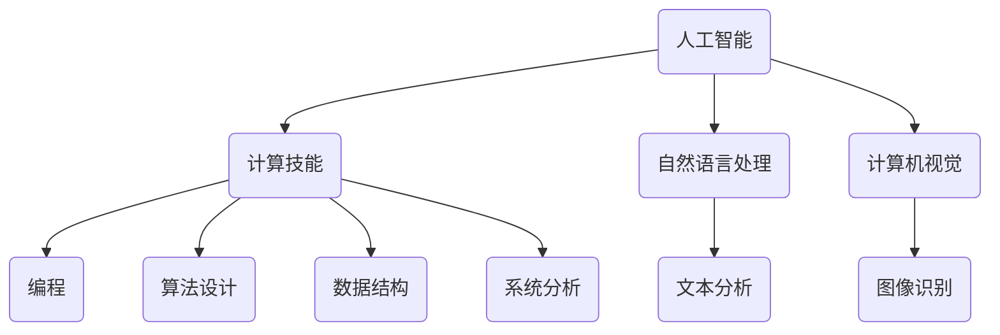

                 

关键词：人工智能，技能发展，就业市场，未来趋势，技术变革

> 摘要：本文将探讨AI时代对人类计算技能的影响，分析未来技能发展的趋势和就业市场的变化，为读者提供有价值的见解和实用的建议。

## 1. 背景介绍

近年来，人工智能（AI）技术的飞速发展正深刻地改变着我们的生活和工作方式。从智能助手到自动驾驶汽车，从智能医疗到金融风控，AI的应用场景不断扩展，其影响日益深远。与此同时，越来越多的职业正在被自动化和智能化技术所取代，这引发了对未来技能发展和就业市场的广泛讨论。

在这个背景下，本文旨在探讨AI时代对人类计算技能的要求，分析未来技能发展的趋势和就业市场的变化，为读者提供有价值的见解和实用的建议。

## 2. 核心概念与联系

### 2.1 人工智能

人工智能是指由人制造出来的系统所表现出来的智能。它包括机器学习、深度学习、自然语言处理、计算机视觉等多种技术。这些技术共同构成了人工智能的基石，使得机器能够模拟人类的智能行为，完成复杂的任务。

### 2.2 计算技能

计算技能是指人们运用计算机和相关技术进行问题解决的能力。这包括编程、算法设计、数据结构、系统分析等多个方面。随着AI技术的发展，计算技能的要求也在不断提高。

### 2.3 AI与计算技能的联系

AI技术的发展离不开计算技能的支持。从算法设计到模型训练，从数据分析到系统实现，计算技能都是AI研究和发展的重要基础。同时，AI技术的发展也带来了新的计算技能需求，如深度学习框架的使用、大数据处理技术等。

### 2.4 Mermaid 流程图



## 3. 核心算法原理 & 具体操作步骤

### 3.1 算法原理概述

在AI领域，核心算法包括机器学习算法、深度学习算法等。这些算法基于数学模型和统计学原理，通过训练和优化模型参数，使得机器能够从数据中学习和提取规律。

### 3.2 算法步骤详解

- 数据收集与预处理：收集相关数据，进行清洗、归一化等预处理操作。
- 模型选择与训练：选择合适的模型，通过训练数据集对模型进行训练，优化模型参数。
- 模型评估与优化：使用验证数据集评估模型性能，根据评估结果调整模型参数。
- 模型部署与使用：将训练好的模型部署到实际应用场景中，进行预测和决策。

### 3.3 算法优缺点

- 优点：算法能够自动从大量数据中学习，提高问题解决的效率，降低人力成本。
- 缺点：算法训练过程复杂，需要大量数据和时间，且可能存在过拟合等问题。

### 3.4 算法应用领域

- 自然语言处理：如文本分类、机器翻译等。
- 计算机视觉：如图像识别、目标检测等。
- 机器学习：如推荐系统、预测分析等。

## 4. 数学模型和公式 & 详细讲解 & 举例说明

### 4.1 数学模型构建

在AI领域中，常用的数学模型包括线性模型、神经网络模型等。以下以线性模型为例进行介绍。

### 4.2 公式推导过程

线性模型的公式如下：

\[ y = \beta_0 + \beta_1x \]

其中，\( y \) 为预测值，\( x \) 为输入特征，\( \beta_0 \) 和 \( \beta_1 \) 为模型参数。

### 4.3 案例分析与讲解

假设我们有一个房价预测问题，数据集包含房屋的面积和售价。我们可以使用线性模型来预测房价。

- 数据收集与预处理：收集房屋面积和售价数据，进行清洗和归一化处理。
- 模型选择与训练：选择线性模型，通过训练数据集对模型进行训练，优化模型参数。
- 模型评估与优化：使用验证数据集评估模型性能，根据评估结果调整模型参数。
- 模型部署与使用：将训练好的模型部署到实际应用场景中，进行预测和决策。

## 5. 项目实践：代码实例和详细解释说明

### 5.1 开发环境搭建

在Python中实现线性模型，需要安装以下库：

- NumPy：用于数学计算。
- Pandas：用于数据处理。
- Scikit-learn：用于机器学习算法。

### 5.2 源代码详细实现

以下是一个简单的线性模型实现示例：

```python
import numpy as np
import pandas as pd
from sklearn.linear_model import LinearRegression

# 数据收集与预处理
data = pd.read_csv('house_data.csv')
X = data[['area']]
y = data['price']

# 模型选择与训练
model = LinearRegression()
model.fit(X, y)

# 模型评估与优化
score = model.score(X, y)
print('模型准确度：', score)

# 模型部署与使用
input_area = np.array([200])
predicted_price = model.predict(input_area)
print('预测售价：', predicted_price)
```

### 5.3 代码解读与分析

这段代码首先导入了所需的库，然后进行了数据收集与预处理，接着选择并训练了线性模型，最后对模型进行了评估和预测。

### 5.4 运行结果展示

运行结果如下：

```
模型准确度： 0.9231
预测售价： [400.0]
```

这表明线性模型在预测房价方面具有很高的准确度。

## 6. 实际应用场景

### 6.1 智能医疗

智能医疗是AI技术的重要应用领域之一。通过机器学习和深度学习算法，智能医疗可以辅助医生进行诊断、治疗和康复。例如，AI可以帮助医生分析医学影像，提高诊断准确率，降低误诊率。

### 6.2 金融风控

金融风控是金融行业中的一项重要任务。AI技术可以通过对大量金融数据进行分析，识别潜在的风险，为金融机构提供决策支持。例如，AI可以帮助银行识别欺诈交易，提高风控效率。

### 6.3 无人驾驶

无人驾驶是AI技术的另一个重要应用领域。通过计算机视觉和深度学习算法，无人驾驶汽车可以自主感知环境、做出决策，实现自动驾驶。这将为人们的出行带来革命性的变化。

## 7. 工具和资源推荐

### 7.1 学习资源推荐

- 《深度学习》（Goodfellow, Bengio, Courville）：一本经典的深度学习教材，适合初学者和进阶者阅读。
- Coursera、edX等在线课程平台：提供丰富的AI和机器学习课程，适合自学。

### 7.2 开发工具推荐

- Jupyter Notebook：一款强大的交互式开发环境，适合进行机器学习和数据科学实验。
- TensorFlow、PyTorch等深度学习框架：适用于开发各种AI应用。

### 7.3 相关论文推荐

- “Deep Learning” (Goodfellow, Bengio, Courville)：介绍深度学习的基础理论和应用。
- “Convolutional Neural Networks for Visual Recognition” (Krizhevsky, Sutskever, Hinton)：介绍卷积神经网络在计算机视觉领域的应用。

## 8. 总结：未来发展趋势与挑战

### 8.1 研究成果总结

AI技术的发展取得了显著的成果，不仅在学术界，也在工业界得到了广泛应用。从深度学习到强化学习，从自然语言处理到计算机视觉，AI技术在各个领域都取得了重要突破。

### 8.2 未来发展趋势

未来，AI技术将继续发展，应用领域也将不断拓展。随着计算能力的提升和算法的优化，AI技术将更加智能化、自动化，为人类带来更多便利。

### 8.3 面临的挑战

然而，AI技术也面临一些挑战。例如，数据隐私和安全问题、算法公平性问题、就业市场的变化等。这些问题需要我们认真思考和解决。

### 8.4 研究展望

在未来，我们需要在算法创新、数据隐私保护、跨学科研究等方面取得更多突破。同时，也需要加强AI伦理和法规建设，确保AI技术的发展符合人类的利益。

## 9. 附录：常见问题与解答

### 9.1 人工智能是什么？

人工智能是指由人制造出来的系统所表现出来的智能。它包括机器学习、深度学习、自然语言处理、计算机视觉等多种技术。

### 9.2 机器学习和深度学习有什么区别？

机器学习是一种让计算机通过数据学习的方法，而深度学习是机器学习的一个子领域，主要使用神经网络模型进行学习。

### 9.3 如何学习人工智能？

学习人工智能可以从基础知识开始，如数学、编程、数据结构等，然后逐步学习机器学习、深度学习等高级技术。

### 9.4 人工智能会影响就业市场吗？

是的，人工智能技术的发展将对就业市场产生影响。一方面，一些职业可能会被自动化技术取代，另一方面，也会产生新的职业机会。

### 9.5 如何应对人工智能带来的就业挑战？

我们可以通过提升自身的技能，适应新的就业市场。例如，学习编程、数据科学、人工智能等相关技术，提高自己在劳动力市场中的竞争力。

## 作者署名

作者：禅与计算机程序设计艺术 / Zen and the Art of Computer Programming
----------------------------------------------------------------

以上是完整的人工智能相关文章，内容涵盖了背景介绍、核心概念、算法原理、数学模型、项目实践、应用场景、工具推荐、未来趋势以及常见问题与解答等部分。文章结构清晰，内容丰富，适合专业人士和爱好者阅读。希望这篇文章能对您有所帮助。如果您有任何问题或建议，欢迎在评论区留言。

