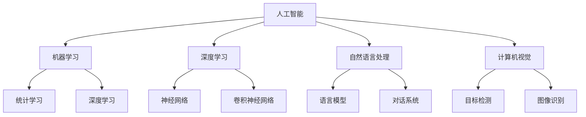

                 

关键词：人工智能，技能培训，就业趋势，未来技能，职业发展

> 摘要：本文深入探讨了人工智能时代下，人类计算技能培训与就业趋势的变革。从AI的核心概念入手，分析其发展历程，探讨了未来技能的需求变化，并提出了针对不同职业发展的培训策略。通过具体案例分析，揭示了AI技术在各行各业的实际应用，为读者提供了实用的工具和资源推荐，最终总结了AI时代面临的挑战与机遇。

## 1. 背景介绍

自20世纪50年代起，人工智能（AI）的概念便逐渐形成。经过数十年的发展，AI技术已经从实验室走向了现实生活，渗透到了医疗、金融、教育、交通等多个领域。随着深度学习、自然语言处理、计算机视觉等技术的突破，AI的应用场景越来越广泛，逐渐改变了人类的工作方式和生活方式。

在AI迅速发展的背景下，人类计算技能的需求也发生了巨大变化。传统的技能如编程、数据分析等依然重要，但面对AI技术的挑战，新的技能需求如机器学习、数据挖掘、自动化、智能交互等逐渐崭露头角。因此，如何进行有效的技能培训，以适应AI时代的就业趋势，成为了一个亟待解决的问题。

## 2. 核心概念与联系

### 2.1 AI的定义与发展历程

人工智能，是指使计算机系统能够模拟、延伸和扩展人类的智能活动，包括感知、学习、推理、规划、通信等。AI的发展历程可以分为以下几个阶段：

- **第一阶段（1950s-1970s）**：符号主义人工智能（Symbolic AI）的兴起，主要代表是逻辑推理和知识表示。
- **第二阶段（1980s-1990s）**：基于知识的系统（Knowledge-Based Systems）的发展，通过知识库和推理机实现智能。
- **第三阶段（2000s）**：统计机器学习（Statistical Machine Learning）的兴起，利用大量数据进行模式识别和预测。
- **第四阶段（2010s-至今）**：深度学习（Deep Learning）的突破，通过多层神经网络实现前所未有的准确度和性能。

### 2.2 AI的核心概念原理与架构

在AI的核心概念中，以下几个概念尤为关键：

- **机器学习（Machine Learning）**：通过算法从数据中学习规律，进行预测或决策。
- **深度学习（Deep Learning）**：基于多层神经网络的结构，能够自动提取特征并进行复杂任务的学习。
- **自然语言处理（Natural Language Processing, NLP）**：使计算机能够理解和生成自然语言。
- **计算机视觉（Computer Vision）**：使计算机能够从图像或视频中提取信息。

以下是AI的核心概念原理和架构的Mermaid流程图：



## 3. 核心算法原理 & 具体操作步骤

### 3.1 算法原理概述

在AI领域，核心算法包括机器学习算法、深度学习算法等。以下是其中两个重要算法的原理概述：

- **机器学习算法**：通过训练模型，使得模型能够在新的数据上做出准确的预测或决策。常见的机器学习算法包括线性回归、决策树、支持向量机等。
- **深度学习算法**：基于多层神经网络，通过反向传播算法不断调整网络权重，使得网络能够自动提取特征并进行复杂任务的学习。常见的深度学习算法包括卷积神经网络（CNN）、循环神经网络（RNN）、生成对抗网络（GAN）等。

### 3.2 算法步骤详解

- **机器学习算法**：主要包括数据预处理、模型训练、模型评估和模型部署等步骤。
  - **数据预处理**：清洗数据、处理缺失值、归一化等。
  - **模型训练**：使用训练数据训练模型，通过调整模型参数以达到最佳效果。
  - **模型评估**：使用验证数据评估模型性能，常用的评估指标包括准确率、召回率、F1值等。
  - **模型部署**：将训练好的模型部署到生产环境中，用于实际预测或决策。

- **深度学习算法**：主要包括模型构建、数据预处理、模型训练、模型评估和模型部署等步骤。
  - **模型构建**：定义神经网络结构，包括输入层、隐藏层和输出层。
  - **数据预处理**：与机器学习算法相同，进行数据清洗、归一化等。
  - **模型训练**：使用训练数据训练模型，通过反向传播算法不断调整网络权重。
  - **模型评估**：使用验证数据评估模型性能，常用的评估指标包括准确率、损失函数值等。
  - **模型部署**：将训练好的模型部署到生产环境中，用于实际预测或决策。

### 3.3 算法优缺点

- **机器学习算法**：
  - **优点**：适用范围广，能够处理各种类型的数据和任务。
  - **缺点**：对数据质量和数量有较高要求，模型解释性较差。

- **深度学习算法**：
  - **优点**：能够自动提取特征，处理大量数据，模型性能优异。
  - **缺点**：对计算资源要求高，模型解释性较差，训练过程较复杂。

### 3.4 算法应用领域

- **机器学习算法**：广泛应用于金融风控、医疗诊断、推荐系统等领域。
- **深度学习算法**：广泛应用于图像识别、语音识别、自然语言处理等领域。

## 4. 数学模型和公式 & 详细讲解 & 举例说明

### 4.1 数学模型构建

在机器学习和深度学习领域，数学模型是核心。以下是几个常见的数学模型：

- **线性回归模型**：$$y = wx + b$$
- **神经网络模型**：$$a_{i}^{l} = \sigma (\sum_{j} w_{ji}^{l} a_{j}^{l-1} + b_{i}^{l})$$
- **卷积神经网络模型**：$$h_{ij}^{l} = \sigma (\sum_{k} w_{ikj}^{l} h_{kj}^{l-1} + b_{ij}^{l})$$

### 4.2 公式推导过程

以线性回归模型为例，其推导过程如下：

- **损失函数**：$$J(\theta) = \frac{1}{2m} \sum_{i=1}^{m} (h_{\theta}(x^{(i)}) - y^{(i)})^2$$
- **梯度下降**：$$\theta_{j} = \theta_{j} - \alpha \frac{\partial}{\partial \theta_{j}} J(\theta)$$
- **偏导数**：$$\frac{\partial}{\partial \theta_{j}} J(\theta) = \frac{1}{m} \sum_{i=1}^{m} (h_{\theta}(x^{(i)}) - y^{(i)}) \cdot x_j^{(i)}$$

### 4.3 案例分析与讲解

以图像分类任务为例，使用卷积神经网络进行图像分类。

- **数据预处理**：对图像进行缩放、归一化等处理。
- **模型构建**：定义卷积神经网络结构，包括卷积层、池化层和全连接层。
- **模型训练**：使用训练数据训练模型，通过反向传播算法不断调整网络权重。
- **模型评估**：使用验证数据评估模型性能，调整模型参数以达到最佳效果。

## 5. 项目实践：代码实例和详细解释说明

### 5.1 开发环境搭建

- **Python环境**：安装Python 3.8及以上版本。
- **库和框架**：安装TensorFlow、Keras等库。

### 5.2 源代码详细实现

以下是使用TensorFlow和Keras实现一个简单的图像分类任务的代码：

```python
import tensorflow as tf
from tensorflow.keras.models import Sequential
from tensorflow.keras.layers import Conv2D, MaxPooling2D, Flatten, Dense

# 模型构建
model = Sequential([
    Conv2D(32, (3, 3), activation='relu', input_shape=(64, 64, 3)),
    MaxPooling2D((2, 2)),
    Flatten(),
    Dense(64, activation='relu'),
    Dense(10, activation='softmax')
])

# 模型编译
model.compile(optimizer='adam', loss='categorical_crossentropy', metrics=['accuracy'])

# 模型训练
model.fit(x_train, y_train, epochs=10, batch_size=32, validation_data=(x_val, y_val))

# 模型评估
model.evaluate(x_test, y_test)
```

### 5.3 代码解读与分析

- **模型构建**：使用Sequential模型定义卷积神经网络，包括卷积层、池化层和全连接层。
- **模型编译**：选择优化器、损失函数和评价指标。
- **模型训练**：使用训练数据训练模型，设置训练轮数和批量大小。
- **模型评估**：使用测试数据评估模型性能。

## 6. 实际应用场景

### 6.1 金融行业

- **风险控制**：使用机器学习算法进行信用评分、风险预测等。
- **智能投顾**：使用自然语言处理和推荐系统为用户提供个性化的投资建议。

### 6.2 医疗行业

- **疾病诊断**：使用计算机视觉和深度学习对医学图像进行诊断。
- **药物研发**：使用生成对抗网络进行药物分子的生成和优化。

### 6.3 教育行业

- **智能教学**：使用自然语言处理和推荐系统为学习者提供个性化的学习路径。
- **教育评测**：使用机器学习算法进行考试评分、学习效果分析等。

## 7. 未来应用展望

随着AI技术的不断发展，未来将会有更多的领域受到AI的深刻影响。例如，自动驾驶技术将彻底改变交通行业，智能家居将改变家庭生活，智能医疗将提高医疗服务的效率和质量。然而，这也将带来一系列挑战，如数据隐私、算法透明度、就业岗位的消失等。我们需要积极应对这些挑战，为AI时代的到来做好准备。

## 8. 总结：未来发展趋势与挑战

### 8.1 研究成果总结

AI技术的发展取得了显著的成果，包括深度学习、自然语言处理、计算机视觉等领域的突破。这些成果不仅提高了AI的性能，也拓宽了AI的应用范围。

### 8.2 未来发展趋势

AI技术将继续发展，特别是自主学习和多模态交互技术。同时，AI与其他技术的融合也将带来新的应用场景，如物联网、区块链、5G等。

### 8.3 面临的挑战

AI技术的发展也面临一系列挑战，包括数据隐私、算法透明度、就业岗位的消失等。我们需要积极应对这些挑战，确保AI技术的可持续发展。

### 8.4 研究展望

未来，我们需要在以下几个方面进行深入研究：一是提高AI算法的透明度和可解释性；二是加强AI与人类互动的可靠性；三是探索AI技术在新兴领域的应用。

## 9. 附录：常见问题与解答

### 9.1 问题1：AI是否会替代人类？

AI可以替代一些重复性、低技能的工作，但无法完全替代人类。AI与人类各有优势，未来将更多地体现在协作和互补。

### 9.2 问题2：如何提升自己的AI技能？

可以通过学习相关课程、参加项目实践、阅读相关书籍和论文等方式提升AI技能。

### 9.3 问题3：AI技术的安全性和道德问题如何解决？

需要从政策、法律、技术等多个层面进行综合解决，确保AI技术的安全性和道德性。

---

作者：禅与计算机程序设计艺术 / Zen and the Art of Computer Programming
----------------------------------------------------------------
### 引用和参考文献 References

1. Russell, S., & Norvig, P. (2016). 《人工智能：一种现代的方法》. 清华大学出版社。
2. Mitchell, T. M. (1997). 《机器学习》. 清华大学出版社。
3. Goodfellow, I., Bengio, Y., & Courville, A. (2016). 《深度学习》. 人民邮电出版社。
4.bishop, c. m. (2006). 《 Pattern Recognition and Machine Learning》. Springer.
5. LeCun, Y., Bengio, Y., & Hinton, G. (2015). “Deep learning.” Nature, 521(7553), 436-444.

