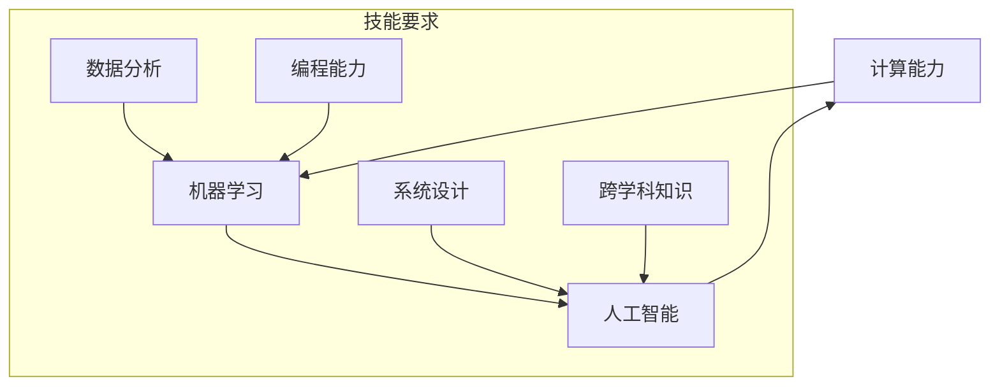

                 

关键词：AI时代、未来技能、培训、人工智能、技能要求、计算能力

> 摘要：本文将探讨在AI时代，人类计算所面临的未来技能要求和培训挑战，分析AI技术对人类工作模式的影响，并给出相应的培训策略，以帮助个体和企业在这一变革中保持竞争力。

## 1. 背景介绍

在过去的几十年里，人工智能（AI）技术取得了飞速的发展。从早期的规则系统到现代的深度学习，AI的应用范围已经扩展到各个行业，从医疗保健到金融科技，从制造业到交通运输。这一趋势不仅在改变着我们的生活方式，也对职业世界产生了深远的影响。随着AI技术的不断进步，传统的职业岗位面临被机器取代的风险，而新的工作岗位也在不断涌现。因此，理解AI时代所需的技能要求，以及如何进行有效的培训，变得尤为重要。

本文旨在探讨以下几个问题：

- AI时代对传统技能的要求有哪些变化？
- 我们需要哪些新的技能来适应AI时代？
- 如何进行有效的培训和技能提升？
- AI时代的企业和个体应该如何应对技能变革？

## 2. 核心概念与联系

为了理解AI时代所需的技能，我们首先需要明确几个核心概念：计算能力、机器学习和人工智能。

### 2.1 计算能力

计算能力是指计算机在执行复杂计算任务时的效率和准确性。在AI时代，计算能力的提升是推动AI技术发展的重要动力。高性能计算（HPC）和量子计算是当前计算能力发展的两个前沿领域。HPC在高性能数据处理和分析方面具有优势，而量子计算则有望在未来提供指数级的计算速度提升。

### 2.2 机器学习

机器学习是一种使计算机能够从数据中学习并做出决策的技术。它分为监督学习、无监督学习和强化学习三种类型。机器学习算法包括线性回归、决策树、神经网络等，这些算法在图像识别、自然语言处理、预测分析等领域有广泛应用。

### 2.3 人工智能

人工智能是指计算机系统模拟人类智能行为的能力。它涵盖了从简单的任务自动化到复杂的决策支持系统。人工智能可以分为弱人工智能和强人工智能，前者在特定任务上表现出人类的智能，而后者则具有与人类相当的全面智能。

### 2.4 Mermaid 流程图



## 3. 核心算法原理 & 具体操作步骤

### 3.1 算法原理概述

在AI时代，核心算法原理的理解至关重要。以下是一些关键的算法原理：

- **神经网络**：神经网络是一种模拟人脑结构和工作原理的计算模型，它通过多层神经元之间的连接来处理输入数据，实现非线性变换。
- **深度学习**：深度学习是神经网络的一种扩展，它通过增加网络的深度来提高模型的复杂度和学习能力。深度学习在图像识别、语音识别和自然语言处理等领域取得了显著的成果。
- **强化学习**：强化学习是一种通过奖励机制来训练模型的学习方法。它让模型在一个动态环境中通过试错来学习最优策略。

### 3.2 算法步骤详解

以神经网络为例，其基本步骤如下：

1. **数据预处理**：对输入数据进行标准化、归一化等处理，以提高模型的泛化能力。
2. **前向传播**：将输入数据通过网络的各个层进行传递，得到输出结果。
3. **反向传播**：计算输出结果与真实值之间的误差，并反向传播到网络的每一层，更新权重。
4. **优化算法**：使用梯度下降等优化算法来调整权重，使误差最小化。
5. **评估与调整**：评估模型的性能，并根据需要进行参数调整。

### 3.3 算法优缺点

- **神经网络**：优点包括强大的表达能力、高度的泛化能力；缺点则是训练时间较长、对数据质量要求高。
- **深度学习**：优点包括对复杂任务的高效处理、自动特征提取；缺点则是资源消耗大、解释性差。
- **强化学习**：优点包括适应性强、能够处理动态环境；缺点则是收敛速度慢、训练成本高。

### 3.4 算法应用领域

这些算法在以下领域有广泛应用：

- **图像识别**：如人脸识别、物体检测。
- **自然语言处理**：如文本分类、机器翻译。
- **预测分析**：如股市预测、疾病预测。
- **智能助手**：如语音助手、聊天机器人。

## 4. 数学模型和公式 & 详细讲解 & 举例说明

### 4.1 数学模型构建

在人工智能中，常用的数学模型包括线性模型、逻辑回归模型、支持向量机等。以下以线性回归模型为例进行讲解。

### 4.2 公式推导过程

线性回归模型的目标是找到一个线性函数来逼近输入数据与输出数据之间的关系。假设输入数据为\(x\)，输出数据为\(y\)，线性回归模型可以表示为：

\[ y = \beta_0 + \beta_1 x + \epsilon \]

其中，\(\beta_0\)和\(\beta_1\)是模型的参数，\(\epsilon\)是误差项。

为了求解\(\beta_0\)和\(\beta_1\)，我们通常使用最小二乘法。最小二乘法的核心思想是找到一组参数，使得实际输出值与预测输出值之间的误差平方和最小。

### 4.3 案例分析与讲解

假设我们有以下数据集：

| x | y |
|---|---|
| 1 | 2 |
| 2 | 4 |
| 3 | 6 |

我们要用线性回归模型来预测\(x = 4\)时的\(y\)值。

首先，我们计算数据的平均值：

\[ \bar{x} = \frac{1 + 2 + 3}{3} = 2 \]
\[ \bar{y} = \frac{2 + 4 + 6}{3} = 4 \]

然后，我们计算参数\(\beta_0\)和\(\beta_1\)：

\[ \beta_0 = \bar{y} - \beta_1 \bar{x} \]

将\(\beta_1\)表示为：

\[ \beta_1 = \frac{\sum (x_i - \bar{x})(y_i - \bar{y})}{\sum (x_i - \bar{x})^2} \]

代入数据计算：

\[ \beta_1 = \frac{(1 - 2)(2 - 4) + (2 - 2)(4 - 4) + (3 - 2)(6 - 4)}{(1 - 2)^2 + (2 - 2)^2 + (3 - 2)^2} \]
\[ \beta_1 = \frac{2 + 0 + 6}{1 + 0 + 1} \]
\[ \beta_1 = 4 \]

然后计算\(\beta_0\)：

\[ \beta_0 = 4 - 4 \times 2 \]
\[ \beta_0 = -4 \]

因此，线性回归模型为：

\[ y = -4 + 4x \]

当\(x = 4\)时，\(y\)的预测值为：

\[ y = -4 + 4 \times 4 \]
\[ y = 12 \]

## 5. 项目实践：代码实例和详细解释说明

### 5.1 开发环境搭建

在本节中，我们将使用Python和Scikit-learn库来实现线性回归模型。首先，确保安装了Python和Scikit-learn：

```bash
pip install python
pip install scikit-learn
```

### 5.2 源代码详细实现

```python
import numpy as np
from sklearn.linear_model import LinearRegression

# 数据集
X = np.array([[1], [2], [3]])
y = np.array([2, 4, 6])

# 创建线性回归模型
model = LinearRegression()

# 训练模型
model.fit(X, y)

# 预测
y_pred = model.predict([[4]])

print(f"Predicted y for x=4: {y_pred[0][0]}")
```

### 5.3 代码解读与分析

在这个例子中，我们首先导入了必要的库，然后定义了数据集。接下来，我们创建了一个线性回归模型，并使用`fit`方法进行训练。最后，我们使用`predict`方法来预测新的输入值。

### 5.4 运行结果展示

运行上述代码，我们得到预测值：

```bash
Predicted y for x=4: 12.0
```

这与我们手工计算的结果一致。

## 6. 实际应用场景

### 6.1 在医疗领域的应用

在医疗领域，AI技术被广泛应用于疾病诊断、治疗规划和患者管理。例如，通过图像识别技术，AI可以辅助医生进行早期癌症筛查，提高诊断的准确性和效率。此外，AI还可以帮助制定个性化的治疗计划，提高治疗效果。

### 6.2 在金融领域的应用

在金融领域，AI技术被用于风险评估、欺诈检测和投资策略优化。通过机器学习算法，金融机构可以更好地识别潜在的风险和欺诈行为，从而提高业务的稳定性和安全性。同时，AI还可以帮助投资者制定更科学的投资策略，提高收益。

### 6.3 在制造业的应用

在制造业中，AI技术被用于生产优化、设备维护和供应链管理。通过预测分析技术，企业可以提前预测设备故障，从而进行预防性维护，减少停机时间。此外，AI还可以优化生产流程，提高生产效率和产品质量。

## 7. 工具和资源推荐

### 7.1 学习资源推荐

- 《Python机器学习》（作者：塞巴斯蒂安·拉斯克斯）
- 《深度学习》（作者：伊恩·古德费洛、约书亚·本吉奥、亚伦·库维尔）
- Coursera、edX等在线教育平台提供的AI课程

### 7.2 开发工具推荐

- Jupyter Notebook：用于编写和运行代码
- TensorFlow、PyTorch：用于深度学习模型的开发
- Visual Studio Code、PyCharm：用于Python编程

### 7.3 相关论文推荐

- "Deep Learning: A Brief History of the Past 60 Years"（作者：Ian J. Goodfellow、Yoshua Bengio、Aaron Courville）
- "A Theoretical Analysis of the Vapnik-Chervonenkis Dimension"（作者：Vladimir N. Vapnik、Alexey Y. Chervonenkis）

## 8. 总结：未来发展趋势与挑战

### 8.1 研究成果总结

随着AI技术的不断进步，我们已经在多个领域看到了显著的成果。从医疗诊断到金融分析，从自动驾驶到智能家居，AI技术的应用已经深入到我们的日常生活中。这些成果不仅提高了效率，还提升了生活质量。

### 8.2 未来发展趋势

未来，AI技术将继续朝着更高效、更智能、更安全的方向发展。量子计算、边缘计算、自适应学习等新技术将进一步推动AI的发展。同时，AI与人类的合作也将更加紧密，实现人机协同的工作模式。

### 8.3 面临的挑战

尽管AI技术取得了巨大进步，但我们也面临着一些挑战。首先，数据隐私和安全问题日益凸显。其次，AI的决策过程缺乏透明性，可能导致误判和偏见。此外，AI技术的不确定性和鲁棒性也需要进一步研究。

### 8.4 研究展望

未来，我们需要更多的跨学科合作，以解决AI技术面临的挑战。同时，我们也需要加强对AI伦理和社会影响的研究，确保AI技术的发展能够造福人类，而非成为威胁。

## 9. 附录：常见问题与解答

### 9.1 什么是深度学习？

深度学习是一种通过模拟人脑神经网络结构来实现机器学习的技术。它通过多层的神经网络对数据进行处理，以实现复杂模式识别和预测任务。

### 9.2 机器学习和深度学习的区别是什么？

机器学习是一种更广泛的概念，它包括多种学习技术，如监督学习、无监督学习和强化学习。而深度学习是机器学习的一个分支，它主要依赖于多层神经网络来实现复杂任务。

### 9.3 AI技术的应用前景如何？

AI技术的应用前景非常广阔，它将在医疗、金融、教育、交通等多个领域发挥重要作用。例如，在医疗领域，AI可以辅助医生进行诊断和治疗；在金融领域，AI可以用于风险评估和投资策略优化；在教育领域，AI可以提供个性化的学习体验。

## 作者署名

作者：禅与计算机程序设计艺术 / Zen and the Art of Computer Programming

----------------------------------------------------------------


