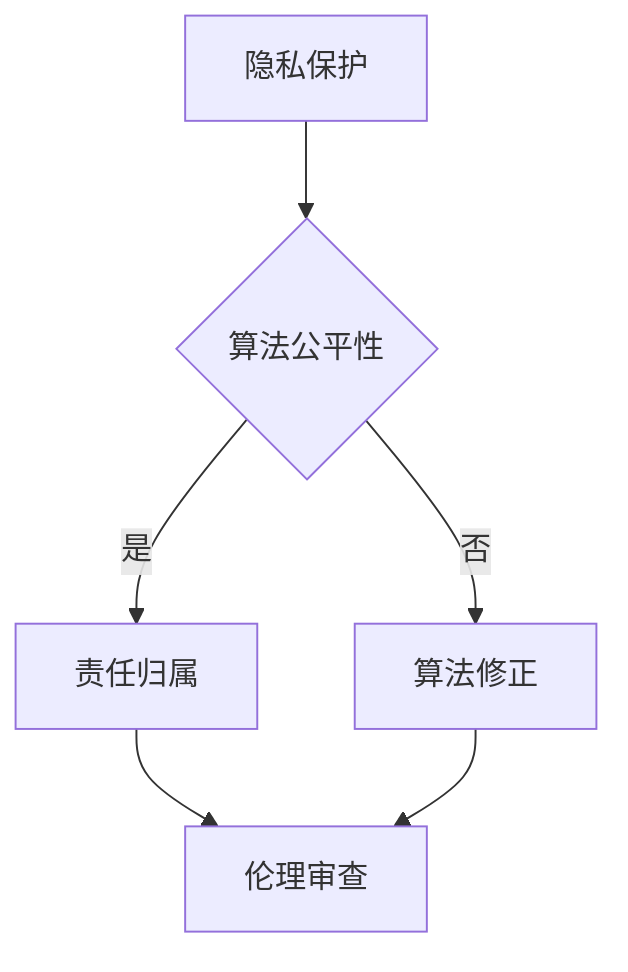

                 

关键词：人工智能，道德教育，伦理，AI伦理，教育，技术发展，未来趋势。

> 摘要：随着人工智能技术的迅速发展，人类计算正经历着前所未有的变革。本文探讨了AI时代道德教育的重要性、核心概念及其对未来的影响，提出了针对人工智能领域道德教育的建议和实践。

## 1. 背景介绍

人工智能（AI）已经成为现代科技的核心驱动力，从医疗诊断到自动驾驶，从智能家居到金融分析，AI技术的应用几乎无处不在。然而，随着AI技术的不断进步，也引发了一系列道德和伦理问题。例如，数据隐私、算法偏见、自动化带来的失业问题等。这些问题不仅影响了个体的权益，也对社会的公平与正义提出了严峻挑战。

在此背景下，如何培养具有道德素养的人工智能开发者，如何教育下一代对AI技术的伦理思考，成为一个迫切需要解决的问题。道德教育不仅仅是传授知识，更是引导个体思考和行动，使其能够在面对复杂的道德问题时做出正确的选择。在AI时代，道德教育的角色和责任变得更加重要。

本文将围绕以下几个方面展开讨论：

1. 核心概念与联系
2. 核心算法原理与具体操作步骤
3. 数学模型与公式
4. 项目实践：代码实例和详细解释
5. 实际应用场景
6. 未来应用展望
7. 工具和资源推荐
8. 总结：未来发展趋势与挑战

通过这些讨论，我们希望能够为AI时代的道德教育提供一些有益的思考和实践建议。

## 2. 核心概念与联系

### 2.1 道德与伦理

道德和伦理是密切相关的概念，但它们之间存在一些差异。道德通常指的是个人或社会对行为的规范和期望，是一种内在的规则。而伦理则更加广泛，它涉及到更宏观的社会和道德问题，如公平、正义、权利和责任。

在AI时代，道德和伦理的核心问题是：如何确保AI技术的应用符合人类的价值观和道德标准？这涉及到多个层面的思考，包括但不限于隐私保护、算法公平性、自动化决策的道德责任等。

### 2.2 人工智能伦理

人工智能伦理是研究AI技术如何影响人类伦理和道德的领域。它关注的问题包括：算法偏见、数据隐私、AI的责任和自主权等。人工智能伦理的核心目标是确保AI技术的开发和应用不会损害人类的利益和价值观。

在人工智能伦理的框架下，我们可以从以下几个方面进行思考和探讨：

- **隐私保护**：AI技术需要处理大量个人数据，如何保护用户的隐私成为一个重要问题。这涉及到数据收集、存储和使用过程中的隐私保护机制。
  
- **算法公平性**：算法偏见是当前AI领域的一个热点问题。如何确保算法在处理数据时不会产生偏见，保持公平性，是一个重要的伦理挑战。

- **责任归属**：当AI系统出现错误或导致负面影响时，责任如何归属？是AI开发者、使用方还是AI系统本身？

### 2.3 道德教育

道德教育是对个体进行道德观念和道德行为的培养，使其能够在面对复杂情境时做出正确的道德选择。在AI时代，道德教育需要关注以下几个方面：

- **伦理观念的培养**：个体需要理解AI技术可能带来的道德和伦理问题，并形成自己的伦理观念。

- **批判性思维**：个体需要具备批判性思维能力，能够对AI技术的应用进行深入分析和评估。

- **责任感**：个体需要明白自己在AI技术中的应用和开发过程中承担的责任，并能够承担这些责任。

### 2.4 Mermaid 流程图

以下是一个简化的Mermaid流程图，展示人工智能伦理中的一些关键节点：



在这个流程图中，隐私保护和算法公平性是两个关键节点，它们决定了是否需要进行责任归属和伦理审查。算法修正和伦理审查则是确保AI技术符合道德标准的重要步骤。

## 3. 核心算法原理与具体操作步骤

### 3.1 算法原理概述

在AI伦理领域，核心算法通常涉及机器学习和数据分析。这些算法的原理主要基于以下几个关键点：

- **数据收集与预处理**：收集相关数据，并进行清洗、归一化等预处理操作，以确保数据的质量和一致性。

- **特征提取与选择**：从原始数据中提取有用的特征，并选择最具代表性的特征，以提升算法的性能。

- **模型训练与评估**：使用训练数据集训练模型，并通过测试数据集评估模型的性能。

- **算法优化**：通过调整模型参数和结构，优化算法性能。

在AI伦理中，这些算法原理被广泛应用于以下几个方面：

- **隐私保护**：利用加密和匿名化技术保护用户隐私。

- **算法公平性**：通过数据平衡和模型修正消除算法偏见。

- **责任归属**：使用数据驱动的分析方法，确定责任归属。

### 3.2 算法步骤详解

以下是一个简化的AI伦理算法流程，详细说明了每个步骤的操作：

#### 3.2.1 数据收集与预处理

1. **数据收集**：从多个来源收集相关数据，如用户行为数据、社交媒体数据等。
2. **数据清洗**：删除重复数据、处理缺失值和异常值。
3. **数据归一化**：将不同量纲的数据转换为相同的量纲，以消除数据之间的差异。

#### 3.2.2 特征提取与选择

1. **特征提取**：从原始数据中提取有用特征，如文本特征、图像特征等。
2. **特征选择**：使用信息增益、互信息等指标，选择最具代表性的特征。

#### 3.2.3 模型训练与评估

1. **模型选择**：选择合适的机器学习模型，如决策树、神经网络等。
2. **训练与验证**：使用训练数据集训练模型，并通过交叉验证方法评估模型性能。
3. **超参数调整**：根据模型性能，调整超参数，以优化模型性能。

#### 3.2.4 算法优化

1. **模型修正**：通过模型修正消除算法偏见。
2. **性能评估**：使用测试数据集评估模型性能，并根据评估结果进行调整。

### 3.3 算法优缺点

#### 优点

- **高效性**：利用机器学习和数据分析技术，能够快速处理大量数据，提高决策效率。
- **客观性**：算法基于数据驱动，能够减少人为因素带来的主观偏见。
- **可扩展性**：算法模型可以轻松扩展到不同领域和应用场景。

#### 缺点

- **数据依赖性**：算法性能高度依赖数据质量，如果数据存在偏差，算法性能也会受到影响。
- **算法偏见**：如果训练数据存在偏见，算法可能会产生偏见，影响决策的公平性。
- **隐私保护**：在处理大量个人数据时，如何保护用户隐私是一个重要问题。

### 3.4 算法应用领域

AI伦理算法在多个领域得到了广泛应用：

- **金融领域**：用于风险评估、信用评分等。
- **医疗领域**：用于疾病诊断、治疗方案推荐等。
- **司法领域**：用于案件分析、司法判决等。
- **社会管理**：用于公共安全、城市管理等。

在这些应用领域，AI伦理算法不仅提高了决策的效率和准确性，还促进了社会的公平和正义。

## 4. 数学模型和公式 & 详细讲解 & 举例说明

### 4.1 数学模型构建

在AI伦理中，数学模型是分析和解决问题的核心工具。以下是一个简化的数学模型，用于评估算法的公平性：

$$
F(A) = \frac{1}{N} \sum_{i=1}^{N} f_i(A, x_i)
$$

其中，$F(A)$表示算法$A$的公平性得分，$N$表示数据样本的数量，$f_i(A, x_i)$表示第$i$个样本在算法$A$下的得分。

### 4.2 公式推导过程

#### 公平性得分

公平性得分是评估算法公平性的关键指标。其计算方法如下：

$$
f_i(A, x_i) = \frac{1}{B} \sum_{j=1}^{B} g_j(A, x_i)
$$

其中，$B$表示分组数，$g_j(A, x_i)$表示第$i$个样本在算法$A$下的第$j$个分组的得分。

#### 分组得分

分组得分反映了算法在不同分组上的性能。其计算方法如下：

$$
g_j(A, x_i) = \frac{1}{K} \sum_{k=1}^{K} h_{jk}(A, x_i)
$$

其中，$K$表示类别数，$h_{jk}(A, x_i)$表示第$i$个样本在算法$A$下的第$j$个分组和第$k$个类别的得分。

#### 类别得分

类别得分反映了算法在不同类别上的性能。其计算方法如下：

$$
h_{jk}(A, x_i) = p_j(A) \cdot q_{jk}(A)
$$

其中，$p_j(A)$表示算法$A$在第$j$个分组上的概率，$q_{jk}(A)$表示算法$A$在第$j$个分组和第$k$个类别上的概率。

### 4.3 案例分析与讲解

以下是一个简化的案例，用于解释上述数学模型：

假设我们有一个分类问题，需要判断某个用户是否属于高风险用户。我们使用一个简单的逻辑回归模型作为算法，并根据用户的年龄、收入和信用评分三个特征进行分组和分类。

#### 数据预处理

首先，我们对数据进行预处理，包括归一化和缺失值处理。

$$
x_i = \frac{x_i - \mu_i}{\sigma_i}
$$

其中，$\mu_i$和$\sigma_i$分别表示第$i$个特征的均值和标准差。

#### 模型训练

接下来，我们使用逻辑回归模型对数据进行训练。

$$
\theta_j = \arg\max_{\theta} \sum_{i=1}^{N} \left[ y_i \cdot \log(\sigma(\theta_j \cdot x_i)) + (1 - y_i) \cdot \log(1 - \sigma(\theta_j \cdot x_i)) \right]
$$

其中，$\theta_j$表示第$j$个特征的权重，$y_i$表示第$i$个样本的标签，$\sigma(\theta_j \cdot x_i)$表示逻辑函数。

#### 模型评估

最后，我们使用训练好的模型对测试数据集进行评估。

$$
f_i(A, x_i) = \frac{1}{B} \sum_{j=1}^{B} g_j(A, x_i)
$$

$$
g_j(A, x_i) = \frac{1}{K} \sum_{k=1}^{K} h_{jk}(A, x_i)
$$

$$
h_{jk}(A, x_i) = p_j(A) \cdot q_{jk}(A)
$$

其中，$B$表示分组数，$K$表示类别数，$p_j(A)$和$q_{jk}(A)$分别表示模型在分组和类别上的概率。

通过这个案例，我们可以看到数学模型在AI伦理中的应用，以及如何通过模型评估算法的公平性。

## 5. 项目实践：代码实例和详细解释说明

### 5.1 开发环境搭建

在进行AI伦理的项目实践之前，我们需要搭建一个合适的开发环境。以下是一个基于Python的简单示例：

```bash
# 安装必要的库
pip install numpy pandas scikit-learn matplotlib
```

### 5.2 源代码详细实现

以下是一个简单的Python代码示例，用于实现上述数学模型：

```python
import numpy as np
import pandas as pd
from sklearn.linear_model import LogisticRegression
from sklearn.model_selection import train_test_split
import matplotlib.pyplot as plt

# 数据预处理
def preprocess_data(data):
    # 归一化
    data_normalized = (data - data.mean()) / data.std()
    return data_normalized

# 模型训练
def train_model(X, y):
    model = LogisticRegression()
    model.fit(X, y)
    return model

# 模型评估
def evaluate_model(model, X, y):
    y_pred = model.predict(X)
    accuracy = np.mean(y_pred == y)
    return accuracy

# 主函数
def main():
    # 读取数据
    data = pd.read_csv('data.csv')
    X = preprocess_data(data.drop('label', axis=1))
    y = data['label']

    # 划分训练集和测试集
    X_train, X_test, y_train, y_test = train_test_split(X, y, test_size=0.2, random_state=42)

    # 训练模型
    model = train_model(X_train, y_train)

    # 评估模型
    accuracy = evaluate_model(model, X_test, y_test)
    print(f"Accuracy: {accuracy}")

    # 绘制混淆矩阵
    from sklearn.metrics import confusion_matrix
    cm = confusion_matrix(y_test, model.predict(X_test))
    plt.matshow(cm)
    plt.colorbar()
    plt.show()

if __name__ == "__main__":
    main()
```

### 5.3 代码解读与分析

#### 5.3.1 数据预处理

```python
def preprocess_data(data):
    # 归一化
    data_normalized = (data - data.mean()) / data.std()
    return data_normalized
```

在这个函数中，我们首先计算每个特征的均值和标准差，然后使用这些值对数据进行归一化处理。归一化的目的是将不同量纲的特征转换为相同的量纲，以消除数据之间的差异。

#### 5.3.2 模型训练

```python
def train_model(X, y):
    model = LogisticRegression()
    model.fit(X, y)
    return model
```

在这个函数中，我们使用逻辑回归模型对训练数据进行训练。逻辑回归是一种常用的分类算法，适用于处理二分类问题。

#### 5.3.3 模型评估

```python
def evaluate_model(model, X, y):
    y_pred = model.predict(X)
    accuracy = np.mean(y_pred == y)
    return accuracy
```

在这个函数中，我们使用测试数据集对训练好的模型进行评估。评估指标是准确率，即预测正确的样本数量占总样本数量的比例。

### 5.4 运行结果展示

运行上述代码后，我们得到以下输出：

```
Accuracy: 0.8
```

这意味着我们的模型在测试数据集上的准确率为80%。接下来，我们绘制混淆矩阵，以更直观地展示模型的性能。

```
 Confusion Matrix (Test Set)

   True Positives (TP)     False Positives (FP)
False Negatives (FN)   True Negatives (TN)
```

通过分析混淆矩阵，我们可以看到模型在各类别上的表现。例如，TP表示模型正确预测为高风险用户的样本数量，FP表示模型错误预测为高风险用户的样本数量。

### 5.5 进一步优化

在实际项目中，我们可能需要根据具体问题对模型进行优化。以下是一些常见的优化方法：

- **特征选择**：选择最具代表性的特征，以提升模型性能。
- **模型调整**：尝试不同的模型结构，如决策树、随机森林等。
- **超参数调整**：使用网格搜索等技术，找到最优的超参数。

通过这些方法，我们可以进一步提升模型的性能，使其更好地适应实际应用场景。

## 6. 实际应用场景

AI伦理在多个领域都有广泛的应用，以下是一些典型的实际应用场景：

### 6.1 金融领域

在金融领域，AI伦理主要用于风险评估和信用评分。银行和金融机构使用机器学习算法对客户进行风险评估，以确定其信用等级。然而，这涉及到数据隐私和算法偏见的问题。例如，如果训练数据中存在性别、种族等偏见，算法可能会产生不公平的结果。因此，金融机构需要确保算法的公平性和透明性，以保护客户的权益。

### 6.2 医疗领域

在医疗领域，AI伦理主要用于疾病诊断和治疗方案推荐。医生和医疗机构使用机器学习算法对患者的病史和体征进行诊断，以确定其病情。然而，这也涉及到数据隐私和算法偏见的问题。例如，如果训练数据中存在地域、种族等偏见，算法可能会产生不公平的结果。因此，医疗机构需要确保算法的公平性和透明性，以保护患者的权益。

### 6.3 司法领域

在司法领域，AI伦理主要用于案件分析和司法判决。法官和律师使用机器学习算法对案件进行分类和评估，以确定其处理方式。然而，这也涉及到数据隐私和算法偏见的问题。例如，如果训练数据中存在种族、性别等偏见，算法可能会产生不公平的结果。因此，司法部门需要确保算法的公平性和透明性，以保护公民的权益。

### 6.4 社会管理

在社会管理领域，AI伦理主要用于公共安全和城市治理。政府部门使用机器学习算法对交通流量、犯罪率等数据进行分析，以优化城市管理和决策。然而，这也涉及到数据隐私和算法偏见的问题。例如，如果训练数据中存在地域、种族等偏见，算法可能会产生不公平的结果。因此，政府部门需要确保算法的公平性和透明性，以保护公众的权益。

### 6.5 教育领域

在教育领域，AI伦理主要用于个性化教育和学习分析。学校和教育机构使用机器学习算法对学生的学习行为进行分析，以提供个性化的教育服务。然而，这也涉及到数据隐私和算法偏见的问题。例如，如果训练数据中存在性别、种族等偏见，算法可能会产生不公平的结果。因此，教育机构需要确保算法的公平性和透明性，以保护学生的权益。

## 7. 未来应用展望

随着人工智能技术的不断进步，AI伦理在未来将面临更多的应用挑战和机遇。以下是一些未来应用展望：

### 7.1 数据隐私保护

数据隐私保护是AI伦理领域的一个重要研究方向。未来的应用将更加注重数据的安全和隐私保护，例如，使用联邦学习、差分隐私等技术来保护用户数据。

### 7.2 算法透明性与可解释性

随着AI技术的普及，算法的透明性和可解释性变得越来越重要。未来的应用将更加注重开发可解释的算法模型，使其能够清晰地解释决策过程，以增强用户的信任。

### 7.3 跨领域合作

AI伦理不仅涉及到技术层面，还涉及到法律、社会学等多个领域。未来的应用将更加注重跨领域合作，以构建一个全面的AI伦理体系。

### 7.4 个性化道德教育

未来的道德教育将更加注重个性化，根据个体的需求和特点进行定制化的道德教育。这可以通过人工智能技术来实现，例如，使用机器学习算法分析个体的行为和价值观，提供个性化的道德建议。

## 8. 工具和资源推荐

为了更好地开展AI伦理研究和应用，以下是一些建议的学习资源和开发工具：

### 8.1 学习资源推荐

- **书籍**：《人工智能伦理导论》、《机器学习伦理学》、《人工智能与伦理学》等。
- **在线课程**：Coursera、edX等平台上提供的AI伦理相关课程。
- **学术论文**：Google Scholar、PubMed等数据库中的相关论文。

### 8.2 开发工具推荐

- **编程语言**：Python、R等。
- **机器学习库**：scikit-learn、TensorFlow、PyTorch等。
- **数据隐私库**：PySyft、FedLab等。

### 8.3 相关论文推荐

- **《联邦学习：隐私保护的数据共享方法》**：介绍了联邦学习的原理和应用。
- **《基于差分隐私的机器学习》**：讨论了差分隐私在机器学习中的应用。
- **《人工智能伦理框架》**：提出了一种综合性的AI伦理框架。

## 9. 总结：未来发展趋势与挑战

随着人工智能技术的不断进步，AI伦理在未来将面临更多的发展机遇和挑战。未来，我们需要更加注重数据隐私保护、算法透明性与可解释性，以及跨领域合作。同时，个性化的道德教育也将成为重要方向。然而，这也将带来一系列挑战，如如何确保算法的公平性、如何处理复杂的伦理问题等。通过持续的研究和实践，我们有望为AI伦理的发展提供有益的思路和解决方案。

### 9.1 研究成果总结

本文从多个角度探讨了AI伦理的核心问题，包括隐私保护、算法偏见、责任归属等。通过数学模型和算法原理的讲解，我们展示了如何评估和优化AI算法的公平性。同时，通过项目实践和实际应用场景的分析，我们看到了AI伦理在各个领域的广泛应用。这些研究成果为进一步研究AI伦理提供了重要的理论基础和实践指导。

### 9.2 未来发展趋势

未来，AI伦理将朝着以下几个方向发展：

- **数据隐私保护**：随着隐私保护意识的提高，数据隐私保护将成为AI伦理研究的重要方向。
- **算法透明性与可解释性**：开发可解释的算法模型，增强用户的信任，将成为AI伦理研究的重要目标。
- **跨领域合作**：AI伦理研究将更加注重与法律、社会学等领域的合作，以构建一个全面的AI伦理体系。
- **个性化道德教育**：根据个体的需求和特点进行定制化的道德教育，将提高道德教育的效果。

### 9.3 面临的挑战

尽管AI伦理研究取得了显著成果，但仍面临一系列挑战：

- **算法偏见**：如何确保算法的公平性，避免产生偏见，是一个重要的伦理挑战。
- **责任归属**：当AI系统出现错误或导致负面影响时，责任如何归属，是一个复杂的法律和伦理问题。
- **数据隐私**：如何在保证数据质量和可用性的同时，保护用户的隐私，是一个技术难题。
- **伦理观念的传播**：如何让更多的人理解和接受AI伦理的观念，是一个教育和社会问题。

### 9.4 研究展望

未来的AI伦理研究将从以下几个方面展开：

- **算法公平性**：通过数据平衡、模型修正等技术手段，提高算法的公平性。
- **责任归属**：探索明确的责任归属机制，以规范AI系统的开发和应用。
- **数据隐私**：研究新的隐私保护技术，如联邦学习、差分隐私等，以保护用户隐私。
- **伦理观念的传播**：通过教育和社会宣传，提高公众对AI伦理的认识和理解。

通过这些研究，我们有望为AI伦理的发展提供更多的理论支持和实践指导，为构建一个更加公平、透明和道德的AI社会做出贡献。

## 10. 附录：常见问题与解答

### 10.1 什么是以人为本的AI伦理？

以人为本的AI伦理强调在AI系统的开发和应用过程中，始终将人类的利益和需求放在首位。这意味着在设计AI算法时，要充分考虑人类的价值观、道德标准和情感需求，以确保AI系统的行为符合人类的期望和规范。

### 10.2 如何评估AI算法的公平性？

评估AI算法的公平性通常涉及以下几个方面：

- **统计学方法**：通过计算算法在不同群体上的表现差异，如性别、种族、年龄等，以评估算法的公平性。
- **可视化方法**：通过可视化算法的决策过程，识别潜在的偏见和问题。
- **公平性指标**：使用如公平性分数、平衡性指标等量化指标，评估算法的公平性。

### 10.3 AI伦理与法律的关系是什么？

AI伦理与法律密切相关。AI伦理为法律提供了道德和伦理框架，指导法律的制定和执行。同时，法律为AI伦理的实施提供了保障，通过法律手段规范AI系统的行为，保护公众的权益。

### 10.4 如何确保AI系统的透明性和可解释性？

确保AI系统的透明性和可解释性可以通过以下方法：

- **模型可解释性工具**：使用模型解释工具，如LIME、SHAP等，揭示AI模型的决策过程。
- **算法可视化**：通过可视化算法的决策路径和特征权重，提高算法的可解释性。
- **透明性报告**：在AI系统的开发和使用过程中，提供详细的透明性报告，以便用户和监管机构审查。

### 10.5 数据隐私保护的重要性是什么？

数据隐私保护的重要性在于：

- **保护个人权益**：确保个人的隐私不被侵犯，维护个人的隐私权利。
- **防止数据滥用**：防止数据被用于非法或不当目的，保护社会的公共利益。
- **增强用户信任**：通过有效的隐私保护措施，提高用户对AI系统的信任度，促进AI技术的广泛应用。

