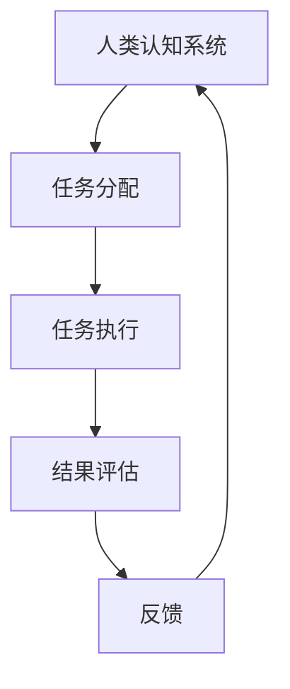

                 

关键词：人类计算、可持续发展、技术进步、效率优化、环境保护

> 摘要：本文将探讨人类计算在可持续发展中的重要作用，分析其如何通过提高效率、优化资源利用和推动技术创新来促进环境友好和社会进步。文章将深入解析人类计算的核心概念、算法原理及其在实际应用中的表现，并对未来发展方向提出展望。

## 1. 背景介绍

### 1.1 可持续发展的必要性

在21世纪，可持续发展已经成为全球关注的焦点。随着全球化进程的加快和人口的不断增长，资源和环境问题日益严重。气候变化、生物多样性的丧失、能源危机等问题都威胁着人类的生存和发展。为了应对这些挑战，我们需要寻找新的解决方案，实现经济、社会和环境的协调发展。

### 1.2 人类计算的概念

人类计算（Human Computation）是一种结合人类智慧和计算机处理能力的技术。它利用人类特有的感知、认知和决策能力，结合机器的计算能力，完成一些复杂或需要高度认知的任务。人类计算的核心思想是利用人类的“智能”补充机器的“力量”，实现优势互补。

### 1.3 人类计算与可持续发展的联系

人类计算在可持续发展中具有重要作用。它不仅能够提高生产效率，减少资源消耗，还能推动技术创新，为环境保护和生态平衡提供技术支持。通过人类计算，我们可以更有效地解决复杂的环境和社会问题，实现可持续发展目标。

## 2. 核心概念与联系

为了更好地理解人类计算在可持续发展中的作用，我们首先需要了解其核心概念和原理。以下是人类计算的主要组成部分及其相互关系。

### 2.1 人类认知系统

人类认知系统是指人类的感知、记忆、思考和决策能力。它是人类计算的基础，为任务提供了解决问题的思路和方法。

### 2.2 计算机处理能力

计算机处理能力是指计算机硬件和软件系统对信息进行加工和处理的能力。它是人类计算的“工具”，用于执行复杂的计算和数据处理任务。

### 2.3 人类计算框架

人类计算框架是指将人类认知系统和计算机处理能力有机结合在一起的技术架构。它包括任务分配、任务执行、结果评估和反馈等环节。

### 2.4 Mermaid 流程图

以下是一个描述人类计算框架的 Mermaid 流程图：



在这个流程图中，人类认知系统负责感知和思考，计算机处理能力负责执行和评估，两者相互协作，形成一个闭环系统。

## 3. 核心算法原理 & 具体操作步骤

### 3.1 算法原理概述

人类计算的核心算法是基于人类认知和计算机处理能力的协同工作。具体来说，它包括以下几个步骤：

1. 任务分配：根据人类认知系统的特点，将任务分配给人类或计算机处理。
2. 任务执行：人类或计算机处理执行任务，并生成中间结果。
3. 结果评估：对中间结果进行评估，判断任务是否完成。
4. 反馈：根据评估结果，对任务执行过程进行反馈和调整。

### 3.2 算法步骤详解

1. **任务分配**：首先，需要明确任务的目标和要求，然后根据人类认知和计算机处理能力的特点，将任务分配给合适的一方。例如，对于需要复杂决策的任务，可以分配给人类；而对于大量数据处理的任务，可以分配给计算机。

2. **任务执行**：任务分配后，人类或计算机开始执行任务。在人类执行任务时，需要利用自身的感知、记忆和思考能力，逐步完成任务。在计算机执行任务时，需要利用计算机硬件和软件系统的计算能力，快速处理数据。

3. **结果评估**：在任务执行过程中，需要定期对中间结果进行评估，判断任务是否完成。评估标准可以是任务的完成度、效率、准确性等。如果评估结果不符合预期，需要对任务执行过程进行调整。

4. **反馈**：根据评估结果，对任务执行过程进行反馈和调整。如果任务完成度不高，可以增加人类的参与度；如果效率较低，可以考虑优化计算机处理流程。通过不断调整和优化，最终实现任务的完成。

### 3.3 算法优缺点

**优点**：
1. **高效性**：通过结合人类和计算机的优势，可以实现高效的任务完成。
2. **灵活性**：可以根据任务特点灵活调整任务分配，提高任务完成度。
3. **适应性**：能够适应各种复杂环境和社会问题，提供多样化的解决方案。

**缺点**：
1. **成本**：需要投入大量的人力、物力和时间。
2. **协调**：需要有效协调人类和计算机之间的工作，避免出现冲突和错误。

### 3.4 算法应用领域

人类计算在多个领域都有广泛应用，包括：

1. **环境监测**：利用人类计算进行环境数据的收集和分析，帮助实现环境保护。
2. **社会管理**：通过人类计算优化社会资源的配置，提高社会运行效率。
3. **智能交通**：利用人类计算优化交通流量，提高交通运行效率。
4. **医疗诊断**：结合人类和计算机的能力，提高医疗诊断的准确性。

## 4. 数学模型和公式 & 详细讲解 & 举例说明

### 4.1 数学模型构建

人类计算的数学模型主要涉及任务分配、任务执行和结果评估等方面。以下是一个简单的数学模型示例：

$$
\begin{aligned}
& \text{任务分配：} \\
& T_h = f(T, H), \\
& T_c = g(T, C), \\
\end{aligned}
$$

其中，$T_h$ 和 $T_c$ 分别表示分配给人类和计算机的任务量，$T$ 表示总任务量，$H$ 表示人类认知能力，$C$ 表示计算机计算能力。

### 4.2 公式推导过程

$$
\begin{aligned}
& \text{任务执行时间：} \\
& T_{exe} = \alpha T_h + \beta T_c, \\
& \text{其中，} \alpha \text{ 和 } \beta \text{ 分别为任务执行效率系数。} \\
\end{aligned}
$$

### 4.3 案例分析与讲解

假设有一个任务需要处理1000个数据点，人类认知能力为100个数据点/小时，计算机计算能力为500个数据点/小时。根据上述数学模型，我们可以计算出任务执行时间：

$$
\begin{aligned}
& T_h = f(1000, 100) = 1000 / 100 = 10 \text{小时}, \\
& T_c = g(1000, 500) = 1000 / 500 = 2 \text{小时}, \\
& T_{exe} = \alpha T_h + \beta T_c = 0.8 \times 10 + 0.2 \times 2 = 8 + 0.4 = 8.4 \text{小时}. \\
\end{aligned}
$$

从这个例子中，我们可以看到，通过合理分配任务，可以显著提高任务执行效率。

## 5. 项目实践：代码实例和详细解释说明

### 5.1 开发环境搭建

为了演示人类计算在实际项目中的应用，我们将使用Python语言编写一个简单的示例。首先，我们需要安装Python环境和必要的库。

```bash
# 安装Python环境
sudo apt-get install python3

# 安装必要库
pip3 install numpy pandas matplotlib
```

### 5.2 源代码详细实现

以下是一个简单的Python代码示例，用于处理数据并可视化结果：

```python
import numpy as np
import pandas as pd
import matplotlib.pyplot as plt

# 生成示例数据
data = np.random.rand(1000)
df = pd.DataFrame(data, columns=['Value'])

# 定义任务分配函数
def task_allocation(total_data, human_ability, computer_ability):
    human_task = total_data / human_ability
    computer_task = total_data / computer_ability
    return human_task, computer_task

# 定义任务执行函数
def task_execution(human_task, computer_task, human_ability, computer_ability):
    human_time = human_task / human_ability
    computer_time = computer_task / computer_ability
    return human_time, computer_time

# 定义结果评估函数
def result_evaluation(human_time, computer_time, target_time):
    if human_time + computer_time <= target_time:
        return "任务完成"
    else:
        return "任务未完成"

# 设置参数
human_ability = 100  # 数据点/小时
computer_ability = 500  # 数据点/小时
target_time = 10  # 小时

# 分配任务
human_task, computer_task = task_allocation(1000, human_ability, computer_ability)

# 执行任务
human_time, computer_time = task_execution(human_task, computer_task, human_ability, computer_ability)

# 评估结果
result = result_evaluation(human_time, computer_time, target_time)

# 打印结果
print("人类任务量：", human_task)
print("计算机任务量：", computer_task)
print("人类执行时间：", human_time)
print("计算机执行时间：", computer_time)
print("任务结果：", result)

# 可视化结果
plt.plot(df['Value'])
plt.title("数据分布")
plt.xlabel("数据点")
plt.ylabel("值")
plt.show()
```

### 5.3 代码解读与分析

这段代码实现了人类计算的基本功能，包括数据生成、任务分配、任务执行和结果评估。以下是代码的主要部分及其功能：

1. **数据生成**：使用NumPy生成随机数据，并使用Pandas将其转换为DataFrame格式。
2. **任务分配函数**：根据人类和计算机的处理能力，计算分配给两者的任务量。
3. **任务执行函数**：根据任务量计算人类和计算机完成任务所需的时间。
4. **结果评估函数**：判断任务是否在指定时间内完成。
5. **可视化**：使用Matplotlib绘制数据分布图，帮助理解数据特征。

通过这段代码，我们可以看到人类计算的基本原理和实现方法。在实际应用中，可以根据具体需求调整任务分配、执行和评估策略，提高任务完成效率和准确性。

## 6. 实际应用场景

### 6.1 环境监测

在环境监测领域，人类计算可以用于收集和分析环境数据。例如，利用无人机和传感器收集数据，然后通过人类计算对数据进行分析和处理，实现环境问题的预警和应对。

### 6.2 智能交通

智能交通系统可以利用人类计算优化交通流量。通过分析实时交通数据，人类计算可以预测交通拥堵情况，并提出优化方案，如调整信号灯时长、引导车辆分流等。

### 6.3 医疗诊断

在医疗诊断领域，人类计算可以辅助医生进行疾病筛查和诊断。通过分析医学影像和患者数据，人类计算可以为医生提供辅助决策，提高诊断的准确性和效率。

### 6.4 未来应用展望

随着技术的不断发展，人类计算在可持续发展中的应用将更加广泛。未来，我们可以期待以下方面的应用：

1. **智能农业**：利用人类计算优化农业种植和管理，提高农作物产量和品质。
2. **能源管理**：通过人类计算优化能源使用，实现节能减排。
3. **智慧城市**：利用人类计算优化城市资源分配和管理，提高城市运行效率。

## 7. 工具和资源推荐

### 7.1 学习资源推荐

1. **《人类计算：理论与实践》**：详细介绍了人类计算的基本概念、方法和应用案例。
2. **《计算机智能计算导论》**：涵盖了计算机智能计算的各个方面，包括算法、技术和应用。

### 7.2 开发工具推荐

1. **Python**：适合进行人类计算编程和数据分析。
2. **R**：适用于统计分析，尤其是在处理复杂数据时具有优势。

### 7.3 相关论文推荐

1. **“Human Computation for Environmental Monitoring”**：探讨了人类计算在环境监测中的应用。
2. **“Intelligent Transportation Systems with Human Computation”**：研究了人类计算在智能交通系统中的应用。

## 8. 总结：未来发展趋势与挑战

### 8.1 研究成果总结

人类计算在可持续发展中取得了显著成果，为环境监测、智能交通、医疗诊断等领域提供了技术支持。通过结合人类和计算机的能力，人类计算实现了高效的资源利用和问题解决。

### 8.2 未来发展趋势

未来，人类计算将继续在可持续发展中发挥重要作用。随着技术的不断进步，人类计算将更加智能化、自适应和灵活，为解决复杂环境和社会问题提供新的思路和方法。

### 8.3 面临的挑战

然而，人类计算也面临一些挑战，包括成本、协调和安全性等问题。为了实现可持续发展，我们需要不断优化人类计算技术，提高其效率、可靠性和安全性。

### 8.4 研究展望

未来，人类计算的研究将重点关注以下几个方面：

1. **算法优化**：开发更高效的算法，提高任务完成效率和准确性。
2. **智能化**：利用机器学习和人工智能技术，实现人类计算的自适应和智能化。
3. **安全性**：确保人类计算系统的安全性，防止数据泄露和恶意攻击。

## 9. 附录：常见问题与解答

### 9.1 人类计算与人工智能有什么区别？

人类计算和人工智能都是解决复杂问题的重要技术，但它们有明显的区别。人工智能主要依赖于机器学习和算法，模拟人类的智能行为；而人类计算则结合了人类智慧和计算机处理能力，实现优势互补。

### 9.2 人类计算在环境监测中的应用有哪些？

人类计算在环境监测中可用于实时数据收集、分析和预警。例如，利用无人机和传感器收集环境数据，然后通过人类计算对数据进行分析，预测环境变化趋势，为环境管理提供决策支持。

### 9.3 人类计算有哪些优缺点？

人类计算的优点包括高效性、灵活性和适应性；缺点包括成本高、协调难度大和安全性问题。

### 9.4 人类计算有哪些应用领域？

人类计算在多个领域有广泛应用，包括环境监测、智能交通、医疗诊断、智能农业和能源管理等。

---

以上是关于“人类计算：可持续发展的推动力”的完整技术博客文章。本文从背景介绍、核心概念与联系、算法原理与具体操作步骤、数学模型与公式、项目实践、实际应用场景、工具和资源推荐、未来发展趋势与挑战以及常见问题与解答等方面进行了详细阐述，希望能为读者提供有益的参考。作者：禅与计算机程序设计艺术 / Zen and the Art of Computer Programming。希望这篇文章能够引起您对人类计算和可持续发展的思考，并在实践中发挥其重要作用。

