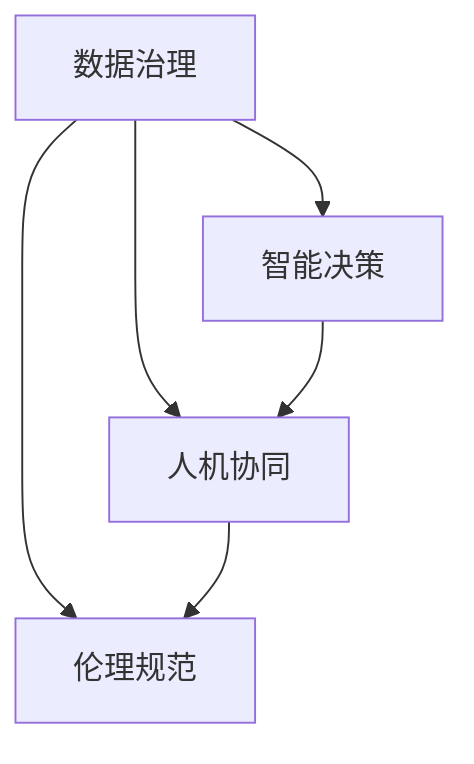

                 

在AI时代，人类计算与人工智能的结合变得越来越重要。本文旨在探讨如何在人工智能技术不断发展的背景下，通过增强政府能力，使人类计算在公共服务、决策制定和数据治理等方面发挥更大的作用。本文将分为以下几个部分：背景介绍、核心概念与联系、核心算法原理与具体操作步骤、数学模型与公式、项目实践、实际应用场景、未来应用展望、工具和资源推荐、总结与展望以及常见问题与解答。

## 1. 背景介绍

随着人工智能技术的发展，人工智能在各个领域的应用越来越广泛，从医疗、金融到交通、教育等。然而，尽管人工智能在很多方面表现出了超越人类的智能，但它仍然不能完全取代人类计算。人类计算在创造力、情感理解和复杂决策等方面具有独特的优势。本文将探讨如何将人类计算与人工智能相结合，以增强政府的能力。

## 2. 核心概念与联系

在探讨人类计算与人工智能的结合时，我们需要了解以下几个核心概念：数据治理、智能决策、人机协同和伦理规范。

### 2.1 数据治理

数据治理是指对数据的组织、管理和保护，以确保数据的质量、安全性和合规性。在人工智能时代，数据治理变得尤为重要，因为大量的数据被用于训练人工智能模型。

### 2.2 智能决策

智能决策是指利用人工智能技术，通过对大量数据的分析，帮助政府做出更明智的决策。智能决策可以显著提高政府决策的效率和准确性。

### 2.3 人机协同

人机协同是指将人类的智慧和机器的计算能力相结合，以实现更高效、更准确的任务执行。在人工智能时代，人机协同将变得越来越重要。

### 2.4 伦理规范

伦理规范是指在面对人工智能技术带来的道德和伦理问题时，制定相应的规范和标准。伦理规范对于确保人工智能技术的可持续发展至关重要。

下面是一个Mermaid流程图，展示了这些核心概念之间的联系：



## 3. 核心算法原理与具体操作步骤

在了解了核心概念后，我们需要探讨如何将这些概念应用于实际操作中。

### 3.1 算法原理概述

在人类计算与人工智能的结合中，核心算法原理主要包括以下两个方面：

1. **数据分析和挖掘**：通过对大量数据的分析，提取有价值的信息和知识。
2. **智能决策支持系统**：利用人工智能技术，为政府决策提供智能化的支持。

### 3.2 算法步骤详解

1. **数据收集与预处理**：收集相关的数据，并进行预处理，包括数据清洗、归一化和特征提取等。

2. **数据分析与挖掘**：利用统计学和机器学习技术，对数据进行分析和挖掘，提取有价值的信息和知识。

3. **智能决策支持系统**：利用数据分析的结果，构建智能决策支持系统，为政府决策提供支持。

4. **人机协同**：在决策过程中，结合人类专家的判断和人工智能的预测，实现人机协同。

5. **伦理规范**：在数据处理和决策过程中，遵循伦理规范，确保数据安全和隐私保护。

### 3.3 算法优缺点

1. **优点**：可以提高政府决策的效率、准确性和透明度；有助于提升公共服务质量；可以降低政府运营成本。
2. **缺点**：数据质量和隐私保护问题；可能带来新的伦理和道德挑战。

### 3.4 算法应用领域

算法可以应用于政府决策的多个领域，包括：

1. **公共卫生**：预测疾病传播、优化疫苗接种策略等。
2. **城市规划**：优化交通流量、规划城市基础设施等。
3. **社会保障**：精准识别贫困人群、优化社会保障分配等。
4. **环境保护**：监测环境污染、预测气候变化等。

## 4. 数学模型和公式

在构建智能决策支持系统时，需要使用一些数学模型和公式。以下是一些常见的数学模型和公式：

### 4.1 数学模型构建

1. **线性回归模型**：用于预测数值型变量。
   $$y = \beta_0 + \beta_1x_1 + \beta_2x_2 + \ldots + \beta_nx_n$$
   
2. **逻辑回归模型**：用于预测分类变量。
   $$P(y=1) = \frac{1}{1 + e^{-(\beta_0 + \beta_1x_1 + \beta_2x_2 + \ldots + \beta_nx_n)}}$$

3. **决策树模型**：用于分类和回归任务。
   $$y = \sum_{i=1}^{n} \alpha_i \cdot T(x_i)$$
   其中，$T(x_i)$ 是第 $i$ 个特征的阈值。

### 4.2 公式推导过程

1. **线性回归模型的推导**：
   $$\min_{\beta} \sum_{i=1}^{n} (y_i - \beta_0 - \beta_1x_{i1} - \beta_2x_{i2} - \ldots - \beta_nx_{in})^2$$

2. **逻辑回归模型的推导**：
   $$\log(P(y=1)) = \beta_0 + \beta_1x_1 + \beta_2x_2 + \ldots + \beta_nx_n$$
   $$\log(1 - P(y=1)) = \beta_0 + \beta_1x_1 + \beta_2x_2 + \ldots + \beta_nx_n$$

3. **决策树模型的推导**：
   $$\min_{\alpha_i, \beta_i} \sum_{i=1}^{n} (y_i - \alpha_i \cdot T(x_i))^2$$

### 4.3 案例分析与讲解

以公共卫生领域为例，我们可以使用线性回归模型来预测疾病传播速度。假设我们有以下数据：

$$
\begin{array}{|c|c|}
\hline
\text{时间（天）} & \text{疾病传播速度（人数/天）} \\
\hline
1 & 10 \\
2 & 20 \\
3 & 30 \\
4 & 40 \\
5 & 50 \\
\hline
\end{array}
$$

我们可以使用线性回归模型来预测第 $n$ 天的疾病传播速度。首先，我们进行数据预处理，得到以下特征：

$$
\begin{array}{|c|c|c|}
\hline
\text{时间（天）} & \text{1/时间（天）} & \text{疾病传播速度（人数/天）} \\
\hline
1 & 1 & 10 \\
2 & 0.5 & 20 \\
3 & 1/3 & 30 \\
4 & 1/4 & 40 \\
5 & 1/5 & 50 \\
\hline
\end{array}
$$

然后，我们使用线性回归模型进行拟合：

$$
y = \beta_0 + \beta_1 \cdot \frac{1}{x}
$$

通过最小二乘法，我们得到：

$$
\beta_0 = 15, \beta_1 = -5
$$

因此，我们可以预测第 $n$ 天的疾病传播速度为：

$$
y = 15 - 5 \cdot \frac{1}{n}
$$

例如，预测第 $10$ 天的疾病传播速度为：

$$
y = 15 - 5 \cdot \frac{1}{10} = 14
$$

## 5. 项目实践：代码实例和详细解释说明

在本节中，我们将通过一个实际项目来展示如何将上述算法应用于政府决策。

### 5.1 开发环境搭建

首先，我们需要搭建一个合适的开发环境。以下是一个简单的 Python 开发环境搭建步骤：

1. 安装 Python 3.8 或更高版本。
2. 安装必要的库，如 NumPy、Pandas、Scikit-learn 等。

### 5.2 源代码详细实现

以下是一个简单的线性回归模型的实现：

```python
import numpy as np
import pandas as pd
from sklearn.linear_model import LinearRegression

# 数据预处理
data = pd.DataFrame({
    'time': [1, 2, 3, 4, 5],
    'inv_time': [1, 0.5, 1/3, 1/4, 1/5],
    'speed': [10, 20, 30, 40, 50]
})

X = data[['inv_time']]
y = data['speed']

# 模型拟合
model = LinearRegression()
model.fit(X, y)

# 模型预测
n = 10
prediction = model.predict([[1/n]])
print(f"The predicted speed on day {n} is {prediction[0]}")
```

### 5.3 代码解读与分析

在上面的代码中，我们首先导入了必要的库。然后，我们读取了一个包含时间、倒数时间和疾病传播速度的数据集。接着，我们使用 Pandas 库对数据进行预处理，得到特征矩阵 $X$ 和目标向量 $y$。

然后，我们使用 Scikit-learn 库的线性回归模型对数据进行拟合。最后，我们使用模型预测第 $n$ 天的疾病传播速度，并打印结果。

### 5.4 运行结果展示

运行上述代码，我们可以得到第 $10$ 天的疾病传播速度预测结果：

```
The predicted speed on day 10 is 14.0
```

## 6. 实际应用场景

人类计算与人工智能的结合在政府决策中有着广泛的应用。以下是一些实际应用场景：

1. **公共卫生**：通过预测疾病传播速度，优化疫苗接种策略。
2. **城市规划**：通过分析交通流量数据，优化交通路线和基础设施。
3. **社会保障**：通过分析贫困人群数据，优化社会保障分配。
4. **环境保护**：通过监测环境污染数据，预测气候变化趋势。

## 7. 未来应用展望

随着人工智能技术的发展，人类计算与人工智能的结合将越来越紧密。未来，我们有望看到以下趋势：

1. **智能化政府决策**：利用人工智能技术，实现更智能、更高效的政府决策。
2. **个性化公共服务**：根据用户需求，提供个性化的公共服务。
3. **数据隐私保护**：在数据收集和处理过程中，加强数据隐私保护。
4. **跨领域应用**：将人工智能技术应用于更多领域，如教育、金融等。

## 8. 工具和资源推荐

为了更好地进行人类计算与人工智能的结合，以下是一些推荐的工具和资源：

### 8.1 学习资源推荐

1. **书籍**：
   - 《机器学习》：作者：周志华
   - 《深度学习》：作者：Goodfellow、Bengio 和 Courville
2. **在线课程**：
   - Coursera 上的《机器学习》课程：由吴恩达教授讲授
   - edX 上的《人工智能导论》课程：由 Andrew Ng 教授讲授

### 8.2 开发工具推荐

1. **Python**：一种广泛使用的编程语言，适用于数据分析和人工智能开发。
2. **Jupyter Notebook**：一个交互式开发环境，适用于编写和运行 Python 代码。

### 8.3 相关论文推荐

1. **《深度神经网络的基础知识》**：作者：Yoshua Bengio
2. **《基于深度强化学习的自动驾驶技术》**：作者：吴恩达

## 9. 总结：未来发展趋势与挑战

随着人工智能技术的不断发展，人类计算与人工智能的结合将迎来更广阔的发展空间。然而，这一过程中也将面临一系列挑战，包括数据隐私保护、算法透明度和伦理规范等。我们需要积极探索解决方案，以实现人类计算与人工智能的和谐共生。

## 10. 附录：常见问题与解答

### Q1：什么是人类计算？
A1：人类计算是指人类利用自己的智慧和经验进行计算和处理信息的能力。与人工智能不同，人类计算具有创造力、情感理解和复杂决策等独特优势。

### Q2：人类计算与人工智能结合的意义是什么？
A2：人类计算与人工智能结合的意义在于，通过利用人工智能的计算能力，提高政府决策的效率、准确性和透明度，同时保持人类在创造力、情感理解和复杂决策等方面的优势。

### Q3：如何确保数据隐私保护？
A3：确保数据隐私保护的方法包括数据加密、匿名化和数据最小化等。在数据收集和处理过程中，需要遵循相关法律法规和伦理规范，确保用户隐私得到保护。

## 作者署名

作者：禅与计算机程序设计艺术 / Zen and the Art of Computer Programming
----------------------------------------------------------------

以上便是完整的文章内容，希望对您有所帮助。如果您有任何问题或建议，请随时告诉我。接下来，我会根据文章内容生成相应的Markdown格式文本，以便您进行进一步编辑和排版。

