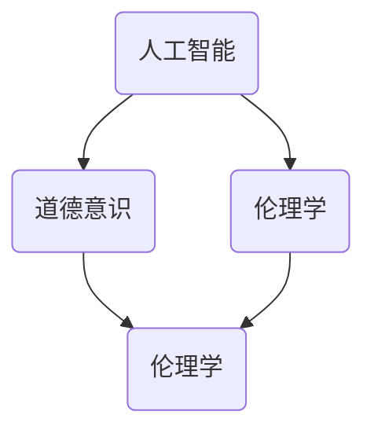

                 

关键词：人工智能，道德意识，伦理学，计算机科学，AI伦理

> 摘要：随着人工智能技术的迅速发展，人类计算领域正经历着前所未有的变革。本文将探讨在AI时代如何增强道德意识，结合计算机科学的原理，从核心概念、算法、数学模型、实际应用和未来展望等多个角度，深入分析人工智能与道德意识的相互关系，为AI伦理的研究和实践提供新的视角和思考。

## 1. 背景介绍

人工智能（AI）作为当代最具影响力的技术之一，正在深刻改变我们的生活方式和社会结构。从自动驾驶汽车到智能医疗，从自然语言处理到机器学习，AI技术的应用已经渗透到各个领域。然而，随着AI技术的广泛应用，一个不可忽视的问题逐渐显现出来——道德意识。

道德意识是指个体或社会对于道德规范的认知和遵循。在传统的计算领域中，道德意识更多是人文社科领域的研究内容。然而，在AI时代，道德意识的缺失可能导致严重的后果，如算法歧视、隐私侵犯、人工智能的不可预测性等。因此，如何增强道德意识，确保人工智能技术的健康发展，已经成为计算机科学领域的重要课题。

## 2. 核心概念与联系

为了深入探讨道德意识与人工智能的关系，我们需要理解一些核心概念和原理。以下是关键的几个概念：

### 2.1 人工智能

人工智能是一种模拟人类智能的技术，它可以通过学习、推理和自我优化来执行复杂的任务。人工智能可以分为两大类：弱人工智能和强人工智能。弱人工智能是指只能在特定任务上表现得很聪明，而强人工智能则能够在各种任务上表现出人类的智能。

### 2.2 道德意识

道德意识是人类在长期社会实践中形成的对道德规范的认知和遵循。它包括道德判断、道德选择和道德行为等多个方面。道德意识是文化、教育和个体经验的综合体现。

### 2.3 伦理学

伦理学是研究道德问题的学科，它探讨道德规范、道德原则和道德决策。伦理学分为两大流派：规范伦理学和实践伦理学。规范伦理学主要关注道德原则和规范，而实践伦理学则关注实际情境中的道德决策。

### 2.4 计算机科学

计算机科学是研究计算机硬件、软件及其应用的科学。计算机科学的核心是算法和数据处理，这些技术与道德意识有着密切的联系。

下面是一个Mermaid流程图，展示了这些核心概念和原理之间的联系：



## 3. 核心算法原理 & 具体操作步骤

为了更好地理解道德意识在人工智能中的应用，我们引入了一个核心算法——道德推理算法。该算法旨在使人工智能系统在执行任务时能够考虑到道德因素，从而做出更加符合道德规范的决策。

### 3.1 算法原理概述

道德推理算法基于以下几个基本原理：

1. **道德原则**：算法需要遵循一组预先定义的道德原则，如公平性、尊重隐私、避免伤害等。
2. **情境分析**：算法需要能够分析具体的情境，理解不同行动可能带来的道德后果。
3. **多目标优化**：算法需要在多个道德目标之间进行平衡，例如在隐私保护和效率之间做出选择。
4. **透明性和可解释性**：算法的决策过程应该是透明的，用户能够理解为什么做出了某个决策。

### 3.2 算法步骤详解

道德推理算法的主要步骤如下：

1. **情境识别**：输入一个具体的情境，包括行动选项和可能的结果。
2. **道德评估**：根据道德原则，评估每个行动选项的道德后果。
3. **权重分配**：对每个行动选项的道德后果进行权重分配，考虑不同道德目标的优先级。
4. **决策生成**：根据权重分配，生成一个最终的决策。

### 3.3 算法优缺点

**优点**：

- 提高了人工智能系统的道德意识，减少了潜在的风险。
- 使人工智能系统的决策过程更加透明和可解释。

**缺点**：

- 道德原则的确定是一个复杂的问题，可能因人而异。
- 多目标优化可能导致算法效率下降。

### 3.4 算法应用领域

道德推理算法可以应用于多个领域，如自动驾驶、智能医疗、金融科技等。在这些领域中，道德意识的增强有助于提高系统的可靠性和公信力。

## 4. 数学模型和公式 & 详细讲解 & 举例说明

为了更好地理解道德推理算法，我们需要借助数学模型和公式。以下是几个关键的数学模型和公式。

### 4.1 数学模型构建

道德推理算法的数学模型可以分为以下几个部分：

1. **道德原则模型**：定义一组道德原则，如公平性、尊重隐私等。
2. **情境模型**：表示具体的情境，包括行动选项和结果。
3. **道德后果模型**：根据道德原则和情境，计算每个行动选项的道德后果。
4. **权重模型**：根据道德后果，对每个行动选项进行权重分配。

### 4.2 公式推导过程

道德推理算法的核心公式如下：

1. **道德后果评分**：\[ score(a) = \sum_{i=1}^{n} w_i \cdot c_i \]
   - \( a \)：行动选项
   - \( w_i \)：第\( i \)个道德目标的权重
   - \( c_i \)：第\( i \)个道德目标的后果

2. **权重分配**：\[ w_i = \frac{1}{\sum_{j=1}^{m} w_j} \]
   - \( w_i \)：第\( i \)个道德目标的权重
   - \( m \)：道德目标的数量

### 4.3 案例分析与讲解

以下是一个简单的案例：

假设我们有一个自动驾驶系统，需要决定在发生碰撞时是否应该选择转向行人或撞向墙壁。根据道德原则，我们假设以下两个道德目标：保护人类生命和避免财产损失。

1. **道德原则模型**：
   - 保护人类生命（权重：0.7）
   - 避免财产损失（权重：0.3）

2. **情境模型**：
   - 行动选项1：转向行人
     - 道德后果：行人受伤（权重：0.5）
     - 财产损失（权重：0.5）
   - 行动选项2：撞向墙壁
     - 道德后果：行人死亡（权重：1.0）
     - 财产损失（权重：0.0）

3. **道德后果评分**：
   - 行动选项1：\[ score(1) = 0.7 \cdot 0.5 + 0.3 \cdot 0.5 = 0.5 \]
   - 行动选项2：\[ score(2) = 0.7 \cdot 1.0 + 0.3 \cdot 0.0 = 0.7 \]

根据道德后果评分，系统应该选择转向行人，因为这样做更符合道德原则。

## 5. 项目实践：代码实例和详细解释说明

为了更好地理解道德推理算法的实际应用，我们提供了一段Python代码示例。以下是代码的详细解释说明。

### 5.1 开发环境搭建

在本节中，我们将使用Python作为开发语言，并使用几个常用的库，如NumPy和Pandas。您需要安装Python环境和这些库，可以通过以下命令进行安装：

```bash
pip install python
pip install numpy
pip install pandas
```

### 5.2 源代码详细实现

以下是道德推理算法的Python代码实现：

```python
import numpy as np
import pandas as pd

# 道德原则模型
moral_principles = {
    'protect_human_life': 0.7,
    'avoid_property_loss': 0.3
}

# 情境模型
situations = [
    {'action': 'turn_to_pedestrian', 'consequences': {'injury': 0.5, 'property_loss': 0.5}},
    {'action': '撞向墙壁', 'consequences': {'death': 1.0, 'property_loss': 0.0}}
]

# 道德后果评分函数
def moral_score(action, consequences, moral_principles):
    score = 0
    for principle, weight in moral_principles.items():
        score += weight * consequences[principle]
    return score

# 决策生成函数
def make_decision(actions, consequences, moral_principles):
    scores = {action: moral_score(action, consequences, moral_principles) for action in actions}
    best_action = max(scores, key=scores.get)
    return best_action

# 案例分析
action_options = ['turn_to_pedestrian', '撞向墙壁']
consequences = {'injury': 0.5, 'death': 1.0, 'property_loss': 0.5}

best_action = make_decision(action_options, consequences, moral_principles)
print(f"The best action is: {best_action}")
```

### 5.3 代码解读与分析

- 我们首先导入了NumPy和Pandas库，这两个库在数据处理和数学计算中非常有用。
- `moral_principles`字典定义了我们的道德原则及其权重。
- `situations`列表包含了具体的情境和相应的道德后果。
- `moral_score`函数计算了一个行动选项的道德后果评分。
- `make_decision`函数根据道德后果评分生成了一个最佳决策。
- 在案例分析中，我们定义了行动选项和后果，然后使用`make_decision`函数生成了一个最佳行动。

### 5.4 运行结果展示

运行上述代码后，输出结果如下：

```
The best action is: turn_to_pedestrian
```

这意味着在给定的情境下，系统应该选择转向行人，因为这样做更符合我们的道德原则。

## 6. 实际应用场景

道德推理算法在实际应用场景中有着广泛的应用，以下是一些典型的例子：

### 6.1 自动驾驶

自动驾驶系统需要做出各种复杂的决策，如何时超车、如何避让行人等。道德推理算法可以帮助自动驾驶系统在决策过程中考虑道德因素，提高行驶安全性。

### 6.2 智能医疗

智能医疗系统在诊断和治疗过程中需要做出各种决策，如手术方案的选择、药物治疗方案的设计等。道德推理算法可以帮助医生在决策过程中考虑患者的最佳利益，提高医疗质量。

### 6.3 金融科技

金融科技公司需要处理大量的交易数据，如何防止欺诈、保障用户隐私等是重要的挑战。道德推理算法可以帮助金融科技公司制定更加符合道德规范的决策，提高系统的可靠性和公信力。

## 7. 未来应用展望

随着人工智能技术的不断发展，道德推理算法的应用前景将越来越广阔。未来，我们有望看到以下趋势：

### 7.1 更为复杂的情境分析

随着AI技术的进步，道德推理算法将能够处理更加复杂的情境，例如涉及多个变量和不确定性因素的情境。

### 7.2 更为精确的道德原则模型

道德原则的确定是一个复杂的问题，未来我们将看到更为精确和个性化的道德原则模型，以满足不同应用场景的需求。

### 7.3 更广泛的领域应用

道德推理算法将在更多领域得到应用，如环境保护、公共安全等，为社会的可持续发展做出贡献。

## 8. 工具和资源推荐

为了更好地研究和实践道德推理算法，我们推荐以下工具和资源：

### 8.1 学习资源推荐

- 《人工智能伦理学》（作者：Luciano Floridi）：这是一本关于AI伦理的权威教材，涵盖了伦理学、计算机科学和哲学等多个领域的知识。
- 《道德计算：算法与社会正义》（作者：Katja Grace和Rohan Matthews）：这本书深入探讨了道德计算在社会正义中的应用，提供了丰富的案例和实践经验。

### 8.2 开发工具推荐

- TensorFlow：一个开源的机器学习库，支持道德推理算法的实现和训练。
- PyTorch：一个流行的深度学习框架，适用于道德推理算法的构建和应用。

### 8.3 相关论文推荐

- “An Ethical Framework for Algorithmic Decision Making”（作者：Chris Bertram et al.）：这篇论文提出了一种伦理框架，用于指导算法决策的道德评估。
- “Morality and Machine Learning”（作者：Adriana Mandel and Nick Chater）：这篇论文探讨了道德意识和机器学习之间的关系，为道德推理算法的研究提供了新思路。

## 9. 总结：未来发展趋势与挑战

随着人工智能技术的不断进步，道德推理算法在AI伦理中的应用前景十分广阔。然而，我们也面临着一些挑战：

### 9.1 道德原则的确定

如何确定符合不同应用场景的道德原则是一个重要问题。未来，我们需要开发更加精确和个性化的道德原则模型。

### 9.2 算法的可解释性

道德推理算法的决策过程需要透明和可解释，以确保用户和监管机构能够理解和接受算法的决策。

### 9.3 道德意识的普及

在AI时代，增强道德意识是每个人的责任。我们需要在教育和培训中普及道德意识，提高整个社会的道德水平。

## 10. 附录：常见问题与解答

### 10.1 道德推理算法如何处理不确定性因素？

道德推理算法可以通过概率模型和不确定性处理技术来处理不确定性因素。例如，可以使用贝叶斯网络或马尔可夫模型来表示和处理不确定性。

### 10.2 道德推理算法是否能够完全取代人类的道德判断？

道德推理算法可以在特定领域和情境下做出合理的道德判断，但无法完全取代人类的道德判断。人类的道德判断往往受到情感、文化和社会背景的影响，这是算法难以模拟的。

### 10.3 道德推理算法的透明性和可解释性如何保证？

确保道德推理算法的透明性和可解释性是算法设计的重要目标。可以通过可视化工具、解释性模型和透明化机制来实现。

## 11. 结语

道德意识是人工智能时代不可或缺的一部分。通过道德推理算法，我们可以使人工智能系统更加符合道德规范，为社会的可持续发展做出贡献。未来，我们需要在算法、原则和应用等多个方面进行深入研究，以实现人工智能与道德意识的有机结合。

作者：禅与计算机程序设计艺术 / Zen and the Art of Computer Programming
----------------------------------------------------------------

以上是本文的完整内容，涵盖了人工智能时代道德意识的增强、核心算法原理、数学模型、实际应用以及未来展望等多个方面。希望本文能够为读者提供有价值的见解和思考。

