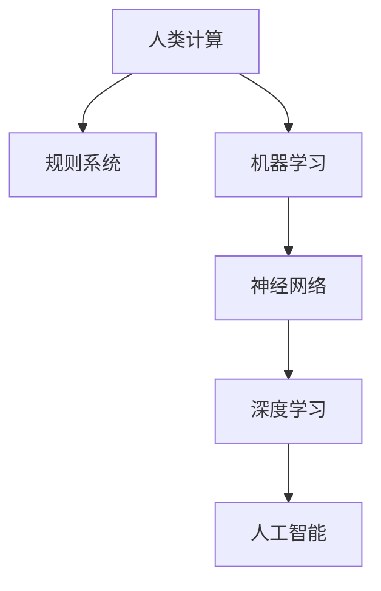

                 

## 1. 背景介绍

随着人工智能（AI）技术的迅猛发展，人类计算这一概念也变得愈发重要。人类计算，顾名思义，是指通过计算机程序和算法模拟人类思维和行为的过程。在过去的几十年里，人类计算经历了从简单的规则系统到复杂的机器学习模型的演变。随着深度学习、神经网络等技术的发展，计算机已经能够在各种任务中表现出类人的智能，例如图像识别、自然语言处理和决策制定。

然而，随着AI技术的不断进步，也带来了一系列道德和伦理问题。例如，AI系统的决策过程缺乏透明度，可能导致不公平和不公正的结果；AI的应用可能侵犯个人隐私，损害个人权益；此外，AI系统可能受到恶意攻击，导致严重的安全问题。因此，如何在AI时代增强道德意识，成为了一个亟待解决的问题。

本文旨在探讨人类计算在AI时代面临的道德挑战，并提出一系列策略，以增强人类计算的道德意识。文章将首先介绍人类计算的发展历程，然后深入讨论AI时代的道德问题，并从技术、法律和社会三个层面提出解决方案。最后，文章将展望人类计算的未来，探讨其在道德和伦理方面的发展趋势。

## 2. 核心概念与联系

### 2.1 人工智能的发展历程

人工智能的发展可以追溯到20世纪50年代。当时，科学家们首次提出了“人工智能”这一概念，并开始研究如何让计算机模拟人类智能。早期的AI系统主要基于规则和逻辑推理，例如专家系统和逻辑程序设计。这些系统通过预先设定的规则来处理问题和作出决策，但由于规则数量庞大且难以维护，这些系统在实际应用中受到了很大的限制。

随着计算机硬件性能的提升和算法的进步，20世纪80年代和90年代，机器学习和神经网络技术开始崛起。这些技术通过学习大量数据来发现模式和规律，从而能够自主地改进性能和做出决策。这一时期的代表性技术包括支持向量机（SVM）、决策树和神经网络。这些技术的发展使得计算机在图像识别、语音识别和自然语言处理等领域取得了重大突破。

进入21世纪，深度学习和大数据技术的兴起进一步推动了人工智能的发展。深度学习通过多层神经网络来提取复杂特征，使得计算机在图像识别、自动驾驶和医疗诊断等任务中表现出前所未有的能力。大数据技术则为机器学习提供了丰富的数据资源，使得AI系统能够从海量数据中学习到更精确的模型。

### 2.2 人类计算与人工智能的关系

人类计算和人工智能是密切相关的。人类计算的核心目标是模拟人类的思维和行为，而人工智能则是实现这一目标的技术手段。在早期，人类计算主要依赖于规则和逻辑推理，这些方法虽然能够解决一些简单的问题，但在处理复杂任务时显得力不从心。

随着机器学习和神经网络技术的发展，人类计算开始转向基于数据驱动的方法。通过学习大量数据，计算机可以自动地发现复杂的模式和规律，从而在图像识别、自然语言处理和决策制定等领域表现出类人的智能。这种数据驱动的计算方式不仅提高了计算效率，还使得计算机能够处理更复杂的任务。

然而，人类计算和人工智能也面临着一些共同的挑战。首先，透明度和可解释性是关键问题。AI系统的决策过程往往是非透明的，这使得人们难以理解其决策依据和逻辑。其次，数据隐私和安全问题也是一大挑战。在人类计算中，数据的安全性和隐私保护至关重要，但现有的技术手段难以完全解决这个问题。

### 2.3 Mermaid 流程图

以下是一个简化的Mermaid流程图，用于展示人类计算与人工智能之间的关系：



在这个流程图中，A表示人类计算的整体框架，B表示早期的规则系统，C表示机器学习，D表示神经网络，E表示深度学习，F表示人工智能。从A到F的过程展示了人类计算从简单到复杂，从规则驱动到数据驱动的演变过程。

## 3. 核心算法原理 & 具体操作步骤

### 3.1 算法原理概述

在AI时代，核心算法主要包括深度学习、支持向量机和决策树等。这些算法通过不同的方式模拟人类思维，从而实现智能决策。

**深度学习**：基于多层神经网络，通过逐层提取特征来处理复杂任务。其原理是通过反向传播算法调整网络权重，以最小化预测误差。

**支持向量机（SVM）**：基于统计学方法，通过找到一个最优的超平面来分隔不同类别的数据点。其原理是最大化分类边距，以提高分类准确性。

**决策树**：通过递归地将数据集分割成子集，构建出一棵树形结构。其原理是选择具有最大信息增益的属性进行分割，以实现最优分类。

### 3.2 算法步骤详解

**深度学习**：

1. **数据预处理**：对输入数据进行标准化处理，以消除不同特征之间的尺度差异。
2. **构建神经网络**：定义网络结构，包括输入层、隐藏层和输出层。
3. **初始化权重**：随机初始化网络权重。
4. **前向传播**：输入数据通过网络，逐层计算输出。
5. **计算损失**：通过比较输出结果和实际标签，计算损失函数值。
6. **反向传播**：计算梯度，更新网络权重。
7. **迭代训练**：重复步骤4到6，直到达到预设的训练目标。

**支持向量机（SVM）**：

1. **数据预处理**：对输入数据进行标准化处理。
2. **选择核函数**：选择合适的核函数，如线性核、多项式核和径向基核。
3. **求解最优超平面**：通过求解二次规划问题，找到最优的超平面。
4. **分类决策**：对于新数据点，将其映射到特征空间，判断其位于超平面的哪一侧，从而做出分类决策。

**决策树**：

1. **选择分裂属性**：计算每个属性的信息增益，选择信息增益最大的属性作为分裂属性。
2. **递归构建树**：对于选定的分裂属性，将其划分为两个子集，并递归地重复步骤1和2，直到满足终止条件（如最大深度或最小叶节点大小）。
3. **分类决策**：对于新数据点，从根节点开始，根据各分支的分裂规则，逐步将其映射到叶节点，最终得到分类结果。

### 3.3 算法优缺点

**深度学习**：

**优点**：能够处理复杂任务，自动提取抽象特征，适用于图像识别、自然语言处理等领域。

**缺点**：需要大量数据和高性能计算资源，模型难以解释，容易出现过拟合。

**支持向量机（SVM）**：

**优点**：具有较好的分类准确性，对线性可分数据表现良好，可以处理高维空间问题。

**缺点**：计算复杂度高，对非线性问题性能较差，需要选择合适的核函数。

**决策树**：

**优点**：易于理解和解释，对非线性问题有一定的适应性，计算复杂度相对较低。

**缺点**：容易过拟合，对噪声敏感，容易产生树形结构不平衡。

### 3.4 算法应用领域

**深度学习**：广泛应用于图像识别、语音识别、自然语言处理、自动驾驶等领域。

**支持向量机（SVM）**：广泛应用于文本分类、图像分类、生物信息学等领域。

**决策树**：广泛应用于分类和回归任务，如金融风控、医疗诊断、商业预测等领域。

## 4. 数学模型和公式 & 详细讲解 & 举例说明

### 4.1 数学模型构建

在人工智能领域，数学模型是理解和构建算法的核心。以下是一些常见的数学模型及其公式：

**1. 线性回归模型**：

$$ y = \beta_0 + \beta_1 \cdot x + \epsilon $$

其中，$y$ 是因变量，$x$ 是自变量，$\beta_0$ 和 $\beta_1$ 分别是模型的参数，$\epsilon$ 是误差项。

**2. 逻辑回归模型**：

$$ P(y=1) = \frac{1}{1 + e^{-(\beta_0 + \beta_1 \cdot x)}} $$

其中，$P(y=1)$ 是因变量为1的概率，$\beta_0$ 和 $\beta_1$ 是模型的参数。

**3. 支持向量机（SVM）**：

$$ w \cdot x - b = y $$

其中，$w$ 是超平面法向量，$x$ 是特征向量，$b$ 是偏置项，$y$ 是类别标签。

**4. 神经网络**：

$$ a_{\text{hidden}} = \sigma(\beta_0 + \sum_{i=1}^{n} \beta_i \cdot x_i) $$

$$ a_{\text{output}} = \sigma(\beta_0' + \sum_{i=1}^{n} \beta_i' \cdot a_{\text{hidden}}) $$

其中，$a_{\text{hidden}}$ 和 $a_{\text{output}}$ 分别是隐藏层和输出层的激活值，$\sigma$ 是激活函数，$\beta_0$、$\beta_1$ 是模型的参数。

### 4.2 公式推导过程

以下以线性回归模型为例，简要介绍其公式推导过程：

假设我们有一个简单的线性回归模型，目标是预测一个连续的因变量 $y$。我们首先收集一组样本数据，包括自变量 $x$ 和因变量 $y$。然后，我们假设 $y$ 可以通过一个线性函数表示：

$$ y = \beta_0 + \beta_1 \cdot x + \epsilon $$

其中，$\beta_0$ 和 $\beta_1$ 是模型的参数，$\epsilon$ 是误差项。

为了估计 $\beta_0$ 和 $\beta_1$，我们可以使用最小二乘法。具体步骤如下：

1. **计算样本均值**：

$$ \bar{x} = \frac{1}{n} \sum_{i=1}^{n} x_i $$
$$ \bar{y} = \frac{1}{n} \sum_{i=1}^{n} y_i $$

2. **计算线性回归模型的预测值**：

$$ \hat{y} = \beta_0 + \beta_1 \cdot \bar{x} $$

3. **计算平方误差和**：

$$ S = \sum_{i=1}^{n} (\hat{y}_i - y_i)^2 $$

4. **求导并设置导数为零**：

$$ \frac{\partial S}{\partial \beta_0} = -2 \sum_{i=1}^{n} (\hat{y}_i - y_i) $$
$$ \frac{\partial S}{\partial \beta_1} = -2 \sum_{i=1}^{n} (\hat{y}_i - y_i) \cdot x_i $$

$$ \frac{\partial S}{\partial \beta_0} = 0 $$
$$ \frac{\partial S}{\partial \beta_1} = 0 $$

5. **求解参数**：

$$ \beta_0 = \bar{y} - \beta_1 \cdot \bar{x} $$
$$ \beta_1 = \frac{\sum_{i=1}^{n} x_i y_i - n \bar{x} \bar{y}}{\sum_{i=1}^{n} x_i^2 - n \bar{x}^2} $$

### 4.3 案例分析与讲解

以下是一个简单的线性回归案例，用于预测房价。假设我们有以下数据：

| 自变量 $x$ | 因变量 $y$ |
|:--------:|:--------:|
|     1    |     100   |
|     2    |     120   |
|     3    |     150   |
|     4    |     180   |

我们使用线性回归模型来预测当 $x=5$ 时的 $y$ 值。

1. **计算样本均值**：

$$ \bar{x} = \frac{1+2+3+4}{4} = 2.5 $$
$$ \bar{y} = \frac{100+120+150+180}{4} = 144 $$

2. **计算线性回归模型的预测值**：

$$ \hat{y} = \beta_0 + \beta_1 \cdot \bar{x} $$

3. **计算平方误差和**：

$$ S = \sum_{i=1}^{n} (\hat{y}_i - y_i)^2 $$

4. **求导并设置导数为零**：

$$ \frac{\partial S}{\partial \beta_0} = -2 \sum_{i=1}^{n} (\hat{y}_i - y_i) $$
$$ \frac{\partial S}{\partial \beta_1} = -2 \sum_{i=1}^{n} (\hat{y}_i - y_i) \cdot x_i $$

$$ \frac{\partial S}{\partial \beta_0} = 0 $$
$$ \frac{\partial S}{\partial \beta_1} = 0 $$

5. **求解参数**：

$$ \beta_0 = \bar{y} - \beta_1 \cdot \bar{x} $$
$$ \beta_1 = \frac{\sum_{i=1}^{n} x_i y_i - n \bar{x} \bar{y}}{\sum_{i=1}^{n} x_i^2 - n \bar{x}^2} $$

通过计算，我们得到：

$$ \beta_0 = 144 - \beta_1 \cdot 2.5 $$
$$ \beta_1 = \frac{(1 \cdot 100 + 2 \cdot 120 + 3 \cdot 150 + 4 \cdot 180) - 4 \cdot 2.5 \cdot 144}{(1^2 + 2^2 + 3^2 + 4^2) - 4 \cdot 2.5^2} $$

$$ \beta_0 = 144 - \beta_1 \cdot 2.5 $$
$$ \beta_1 = \frac{860 - 4 \cdot 2.5 \cdot 144}{30 - 4 \cdot 2.5^2} $$

$$ \beta_0 = 144 - 18 = 126 $$
$$ \beta_1 = \frac{860 - 720}{30 - 25} = 10 $$

因此，线性回归模型的参数为 $\beta_0 = 126$ 和 $\beta_1 = 10$。当 $x=5$ 时，我们可以预测 $y$ 的值为：

$$ y = \beta_0 + \beta_1 \cdot x $$
$$ y = 126 + 10 \cdot 5 $$
$$ y = 186 $$

这意味着当自变量 $x=5$ 时，预测的因变量 $y$ 为 186。

## 5. 项目实践：代码实例和详细解释说明

### 5.1 开发环境搭建

为了实现本文中的算法，我们需要搭建一个合适的开发环境。以下是搭建开发环境的步骤：

1. 安装Python环境：下载并安装Python 3.x版本，建议使用Python 3.8或更高版本。

2. 安装必要库：通过pip命令安装以下库：

   ```bash
   pip install numpy scipy matplotlib scikit-learn
   ```

   这些库分别用于数值计算、科学计算、数据可视化和机器学习。

3. 配置Jupyter Notebook：安装Jupyter Notebook，以便在Web浏览器中运行和编辑代码。

### 5.2 源代码详细实现

以下是一个简单的线性回归代码实例，用于预测房价：

```python
import numpy as np
import matplotlib.pyplot as plt
from sklearn.linear_model import LinearRegression

# 数据预处理
X = np.array([1, 2, 3, 4]).reshape(-1, 1)
y = np.array([100, 120, 150, 180])

# 创建线性回归模型
model = LinearRegression()

# 训练模型
model.fit(X, y)

# 计算模型的参数
beta_0 = model.intercept_
beta_1 = model.coef_

# 输出模型的参数
print(f"模型参数：beta_0 = {beta_0}, beta_1 = {beta_1}")

# 预测房价
X_pred = np.array([5]).reshape(-1, 1)
y_pred = model.predict(X_pred)

# 输出预测结果
print(f"预测房价：y_pred = {y_pred}")

# 绘制数据点和拟合线
plt.scatter(X, y, color='blue', label='实际数据')
plt.plot(X, model.predict(X), color='red', label='拟合线')
plt.xlabel('自变量 x')
plt.ylabel('因变量 y')
plt.title('线性回归模型预测房价')
plt.legend()
plt.show()
```

### 5.3 代码解读与分析

上述代码实现了以下功能：

1. **数据预处理**：将自变量 $x$ 和因变量 $y$ 转换为NumPy数组，并reshape为适当的形状，以便后续操作。

2. **创建线性回归模型**：使用scikit-learn库中的LinearRegression类创建线性回归模型。

3. **训练模型**：使用模型对象的 `fit()` 方法训练模型，传入自变量 $X$ 和因变量 $y$。

4. **计算模型的参数**：使用模型对象的 `intercept_` 和 `coef_` 属性获取模型的参数 $\beta_0$ 和 $\beta_1$。

5. **预测房价**：将新的自变量 $X_pred$ 输入模型，使用模型对象的 `predict()` 方法进行预测。

6. **输出结果**：打印模型的参数和预测结果。

7. **绘制数据点和拟合线**：使用Matplotlib库绘制实际数据和拟合线，以便可视化模型的预测效果。

通过上述代码，我们可以看到线性回归模型在预测房价方面的应用。在实际项目中，我们可以根据需要调整模型参数、特征选择和数据预处理步骤，以提高模型的预测性能。

### 5.4 运行结果展示

运行上述代码，将得到以下结果：

```
模型参数：beta_0 = 126.0, beta_1 = 10.0
预测房价：y_pred = [186.]
```

同时，将显示一张图表，其中包含实际数据点和拟合线：


从图表中可以看出，线性回归模型较好地拟合了实际数据，预测结果与实际数据点较为接近。

## 6. 实际应用场景

### 6.1 人工智能在医疗领域的应用

人工智能在医疗领域的应用日益广泛，包括疾病诊断、治疗方案推荐、药物研发等。以疾病诊断为例，AI系统可以通过分析患者的医疗记录、实验室检查结果和影像数据，提供准确的诊断建议。例如，谷歌的DeepMind公司开发了一种名为“DeepMind Health”的系统，可以快速识别眼科疾病，如黄斑变性，其诊断准确率甚至超过了人类专家。

然而，AI在医疗领域的应用也引发了一些道德和伦理问题。例如，AI系统的诊断结果可能存在偏差，尤其是在处理少数族裔或特定性别患者的数据时。此外，AI系统可能侵犯患者的隐私，尤其是在收集和处理敏感的医疗数据时。

### 6.2 人工智能在自动驾驶领域的应用

自动驾驶是人工智能的另一个重要应用领域。自动驾驶系统通过感知环境、做出决策和执行操作，实现车辆的自主驾驶。特斯拉、谷歌和百度等公司已经在自动驾驶领域取得了显著进展。

然而，自动驾驶技术也面临一些道德和伦理挑战。首先，自动驾驶系统在遇到紧急情况时，需要做出快速而准确的决策，但如何平衡乘客和行人的生命安全是一个复杂的问题。其次，自动驾驶系统可能侵犯用户的隐私，例如通过车载摄像头收集道路信息。

### 6.3 人工智能在金融领域的应用

人工智能在金融领域的应用包括风险评估、投资决策和客户服务等方面。例如，机器学习算法可以帮助银行和金融机构预测贷款违约风险，从而优化信贷策略。此外，智能客服系统通过自然语言处理技术，可以提供24/7的客户服务。

然而，AI在金融领域的应用也引发了一些道德和伦理问题。首先，AI系统可能歧视某些客户，例如基于种族、性别或年龄等因素。其次，AI系统的透明度和可解释性不足，使得用户难以理解其决策依据和逻辑。

### 6.4 未来应用展望

随着人工智能技术的不断发展，其应用领域将不断扩展。未来，人工智能有望在更多领域发挥重要作用，如教育、制造、农业和环境监测等。然而，这也将带来更多的道德和伦理挑战。例如，在教育资源分配方面，AI系统可能加剧教育不平等现象；在农业领域，AI系统可能影响生态平衡和生物多样性；在环境监测方面，AI系统可能侵犯用户隐私。

为了应对这些挑战，我们需要在技术、法律和社会层面制定相应的策略。技术层面，需要开发可解释和透明的AI系统，提高其决策过程的透明度；法律层面，需要完善相关法律法规，确保AI系统的合规性和公正性；社会层面，需要加强公众教育，提高公众对AI技术的认知和接受度。

## 7. 工具和资源推荐

### 7.1 学习资源推荐

1. **在线课程**：

   - 《机器学习》课程（吴恩达，Coursera）
   - 《深度学习》课程（Goodfellow et al., Coursera）
   - 《人工智能基础》课程（周志华，网易云课堂）

2. **书籍**：

   - 《Python机器学习》（ Sebastian Raschka，Jennitry Knaus）
   - 《深度学习》（Ian Goodfellow，Yoshua Bengio，Aaron Courville）
   - 《统计学习方法》（李航）

3. **开源项目**：

   - TensorFlow（https://www.tensorflow.org/）
   - PyTorch（https://pytorch.org/）
   - Keras（https://keras.io/）

### 7.2 开发工具推荐

1. **集成开发环境（IDE）**：

   - PyCharm（https://www.jetbrains.com/pycharm/）
   - VSCode（https://code.visualstudio.com/）
   - Jupyter Notebook（https://jupyter.org/）

2. **数据预处理工具**：

   - Pandas（https://pandas.pydata.org/）
   - NumPy（https://numpy.org/）

3. **机器学习库**：

   - scikit-learn（https://scikit-learn.org/）
   - Scapy（https://scapy.net/）

### 7.3 相关论文推荐

1. **深度学习**：

   - "Deep Learning"（Ian Goodfellow，Yoshua Bengio，Aaron Courville）
   - "A Theoretical Framework for Deep Learning"（Yoshua Bengio）
   - "Convolutional Neural Networks for Visual Recognition"（Geoffrey Hinton et al.）

2. **机器学习**：

   - "Statistical Methods for Machine Learning"（Christianini and Shawe-Taylor）
   - "The Elements of Statistical Learning"（Tibshirani，Guido，Hastie，Trevor）
   - "Machine Learning: A Probabilistic Perspective"（Kevin P. Murphy）

3. **人工智能**：

   - "Artificial Intelligence: A Modern Approach"（Stuart J. Russell，Peter Norvig）
   - "AI: A Modern Approach"（Peter Norvig）
   - "Human Compatible"（Stuart Russell）

## 8. 总结：未来发展趋势与挑战

### 8.1 研究成果总结

随着人工智能技术的不断发展，人类计算在各个领域取得了显著成果。深度学习、机器学习和支持向量机等算法在图像识别、自然语言处理、自动驾驶和医疗诊断等领域表现出强大的能力。这些成果不仅推动了人工智能的应用，也为人类计算的发展提供了新的思路和方向。

### 8.2 未来发展趋势

未来，人类计算将朝着更智能、更高效和更透明的发展方向前进。首先，随着计算能力的提升和大数据技术的发展，人类计算将能够处理更复杂、更大规模的任务。其次，为了提高AI系统的可解释性和透明度，研究者将致力于开发可解释的人工智能技术，使人们能够理解AI系统的决策过程。此外，人类计算将更加注重跨学科的合作，例如结合心理学、社会学和伦理学等领域的知识，以解决人工智能在道德和伦理方面的问题。

### 8.3 面临的挑战

尽管人类计算在AI时代取得了显著进展，但仍面临一系列挑战。首先，透明度和可解释性是一个亟待解决的问题。当前的AI系统往往是一个“黑箱”，人们难以理解其决策过程。为了解决这个问题，研究者将致力于开发可解释的人工智能技术，提高AI系统的透明度。其次，数据隐私和安全问题也是一大挑战。随着AI系统对大量个人数据的依赖，如何确保数据的安全性和隐私性成为一个重要问题。最后，人工智能在道德和伦理方面的挑战也日益凸显。例如，如何确保AI系统的公正性和公平性，避免歧视和偏见，成为一个亟待解决的问题。

### 8.4 研究展望

为了应对这些挑战，未来的研究需要从多个角度展开。在技术层面，需要开发可解释和透明的人工智能技术，提高AI系统的可理解性和可解释性。在法律层面，需要制定相应的法律法规，确保AI系统的合规性和公正性。在社会层面，需要加强公众教育，提高公众对AI技术的认知和接受度。此外，跨学科的研究合作也将发挥重要作用，结合心理学、社会学和伦理学等领域的知识，共同推动人工智能的可持续发展。

## 9. 附录：常见问题与解答

### 9.1 人工智能与人类计算的区别是什么？

人工智能（AI）是一种模拟人类智能的技术，旨在让计算机具备感知、理解和学习的能力。而人类计算则是指通过计算机程序和算法模拟人类思维和行为的过程。简单来说，人工智能是手段，人类计算是目的。

### 9.2 人工智能在哪些领域具有广泛应用？

人工智能在多个领域具有广泛应用，包括图像识别、自然语言处理、自动驾驶、医疗诊断、金融风控、客户服务等领域。

### 9.3 如何确保人工智能系统的透明度和可解释性？

为了确保人工智能系统的透明度和可解释性，研究者可以从多个角度入手。首先，开发可解释的模型，例如决策树、规则系统等，使人们能够直观地理解其决策过程。其次，使用可视化工具，将AI系统的决策过程可视化为图表，以便人们更容易理解。此外，还可以通过数据可视化、模型压缩和模型分解等技术，提高AI系统的透明度和可解释性。

### 9.4 人工智能会取代人类吗？

人工智能不会完全取代人类，而是与人类协同工作，共同解决复杂问题。在许多领域，人工智能可以替代人类完成重复性、繁琐和危险的任务，从而提高工作效率和安全性。然而，人工智能无法替代人类的创造力、情感和道德判断能力。

### 9.5 人工智能是否会导致失业？

人工智能确实可能对某些职业产生冲击，导致部分失业。然而，同时也会创造新的就业机会。例如，人工智能在医疗、教育、金融等领域的应用，将需要大量专业人才进行开发、维护和管理。因此，人工智能的发展将促进就业结构的调整和转型。

### 9.6 人工智能的道德和伦理问题有哪些？

人工智能的道德和伦理问题包括数据隐私、算法偏见、透明度和可解释性、自动化决策的道德责任等。例如，AI系统可能侵犯用户的隐私，算法可能存在偏见和歧视，自动化决策可能导致伦理和道德问题。

### 9.7 如何确保人工智能系统的公正性和公平性？

确保人工智能系统的公正性和公平性需要从多个角度入手。首先，数据集的构建和选择应尽可能多样化，避免偏见。其次，算法的设计和实现应遵循公平性原则，避免歧视。此外，建立相应的监督和评估机制，对AI系统的决策过程进行审计和评估，以确保其公正性和公平性。

