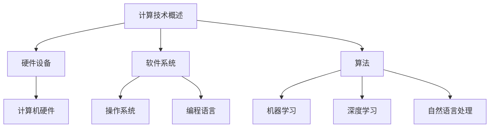

                 

关键词：人工智能，计算技术，人类与机器合作，计算能力发展，未来趋势

> 摘要：本文将探讨人类计算的力量，如何通过人工智能和计算技术的发展，塑造未来的科技世界。我们将分析计算技术的核心概念和算法原理，探讨数学模型在其中的作用，并通过实际项目实践和案例分析，展示计算技术在不同领域中的应用。同时，本文还将讨论未来发展趋势与面临的挑战，以及对研究和实践的展望。

## 1. 背景介绍

计算技术是现代社会的基础，它影响着我们生活的方方面面。从智能手机到超级计算机，从云计算到大数据分析，计算技术在推动科技进步的同时，也在改变着人类的生活方式。

人类与机器的合作关系也日益紧密。人工智能技术的发展使得机器能够处理更加复杂的问题，而人类的智慧和经验则为机器提供了重要的指导。这种合作关系不仅提高了计算效率，也推动了计算技术的不断创新。

本文旨在探讨人类计算的力量，通过分析计算技术的核心概念、算法原理、数学模型以及实际应用，展望计算技术的未来发展趋势，为读者提供对计算技术的深入理解。

## 2. 核心概念与联系

### 2.1 计算技术概述

计算技术是指利用电子计算机和计算机程序，对信息进行收集、处理、存储和传输的技术。它包括硬件、软件、算法和数据等多个方面。

硬件方面，计算机硬件的发展经历了从大型主机到微型计算机，再到移动设备的转变。软件方面，计算机操作系统、编程语言和开发工具的不断进步，使得软件开发变得更加高效。算法方面，计算机算法的不断优化，使得复杂问题能够得到更快的解决。数据方面，大数据技术的兴起，使得海量数据得以有效处理和分析。

### 2.2 人工智能与计算技术

人工智能是计算技术的重要组成部分。它通过模拟人类的思维方式，使得计算机能够实现自主学习和决策。人工智能的核心技术包括机器学习、深度学习、自然语言处理等。

机器学习是一种让计算机从数据中学习的方法。通过训练模型，计算机能够识别模式和规律，从而进行预测和决策。深度学习是机器学习的一种特殊形式，通过多层神经网络，实现对复杂数据的处理。自然语言处理则致力于使计算机理解和生成自然语言，为人类与机器的交流提供便利。

### 2.3 计算技术架构

计算技术的架构可以分为三个层次：基础设施、平台和应用。

基础设施层包括硬件设备、网络和存储等，为计算技术提供基础支持。平台层包括操作系统、编程语言和开发工具等，为开发者提供开发环境。应用层则包括各种软件和服务，为用户提供实际的功能和体验。

### 2.4 Mermaid 流程图

以下是一个简单的 Mermaid 流程图，展示了计算技术的核心概念和联系：



## 3. 核心算法原理 & 具体操作步骤

### 3.1 算法原理概述

计算技术的核心在于算法。算法是一种解决问题的方法，它通过一系列步骤，将输入转化为输出。算法的原理可以分为以下几个方面：

- 基本逻辑：算法的基本逻辑包括条件判断、循环控制、递归调用等。
- 数据结构：算法需要处理数据，因此需要掌握数据结构，如数组、链表、树、图等。
- 时间复杂度和空间复杂度：算法的效率取决于其执行时间和占用空间，因此需要关注时间复杂度和空间复杂度。

### 3.2 算法步骤详解

以下是计算技术中常用的几个算法步骤：

#### 3.2.1 排序算法

排序算法是将一组数据按照特定顺序排列的方法。常见的排序算法包括冒泡排序、选择排序、插入排序、快速排序等。

- 冒泡排序：通过不断交换相邻的未按顺序排列的元素，逐步将最大或最小的元素“冒泡”到数组的一端。
- 选择排序：每次从未排序的部分选择最小（或最大）的元素，将其放到已排序部分的末尾。
- 插入排序：将未排序的元素插入到已排序的元素中，以保持整个数组的有序。

#### 3.2.2 搜索算法

搜索算法是在数据集合中查找特定元素的方法。常见的搜索算法包括线性搜索、二分搜索等。

- 线性搜索：从数据集合的第一个元素开始，逐个比较，直到找到目标元素或到达集合末尾。
- 二分搜索：在有序的数据集合中，通过不断将中间元素与目标元素比较，逐步缩小搜索范围。

#### 3.2.3 图算法

图算法是在图结构中进行操作的算法。常见的图算法包括深度优先搜索（DFS）、广度优先搜索（BFS）等。

- 深度优先搜索：从起点开始，尽可能深地搜索图的分支。
- 广度优先搜索：从起点开始，逐层搜索图的分支。

### 3.3 算法优缺点

每种算法都有其优缺点，选择合适的算法取决于具体的应用场景。

- 冒泡排序：简单易懂，但效率较低，适用于数据量较小的情况。
- 选择排序：效率略高于冒泡排序，但同样适用于数据量较小的情况。
- 插入排序：效率较高，适用于数据基本有序的情况。
- 快速排序：效率较高，但可能引入额外的空间复杂度。
- 线性搜索：简单易懂，但效率较低，适用于数据量较小的情况。
- 二分搜索：效率较高，但需要数据集合已排序。

### 3.4 算法应用领域

算法在各个领域都有广泛的应用，如：

- 数据分析：排序和搜索算法在数据分析中用于处理和查找大量数据。
- 人工智能：机器学习算法用于训练模型，进行预测和决策。
- 网络安全：加密和解密算法用于保护网络通信和数据安全。
- 图像处理：图像处理算法用于图像的压缩、增强、识别等。

## 4. 数学模型和公式 & 详细讲解 & 举例说明

### 4.1 数学模型构建

数学模型是描述现实世界问题的数学表达式。在计算技术中，数学模型用于模拟和解决各种问题。

- 机器学习中的数学模型：包括线性回归、逻辑回归、神经网络等。
- 数据分析中的数学模型：包括均值、方差、协方差等统计模型。
- 图像处理中的数学模型：包括卷积神经网络、傅里叶变换等。

### 4.2 公式推导过程

以下是机器学习中的一个常见数学模型——线性回归的推导过程。

#### 4.2.1 线性回归模型

线性回归模型表示为：

$$
y = \beta_0 + \beta_1 x + \epsilon
$$

其中，$y$ 是因变量，$x$ 是自变量，$\beta_0$ 和 $\beta_1$ 是模型参数，$\epsilon$ 是误差项。

#### 4.2.2 模型参数估计

为了估计模型参数 $\beta_0$ 和 $\beta_1$，我们使用最小二乘法。

$$
\min_{\beta_0, \beta_1} \sum_{i=1}^{n} (y_i - (\beta_0 + \beta_1 x_i))^2
$$

对参数求导，得到：

$$
\frac{\partial}{\partial \beta_0} \sum_{i=1}^{n} (y_i - (\beta_0 + \beta_1 x_i))^2 = 0
$$

$$
\frac{\partial}{\partial \beta_1} \sum_{i=1}^{n} (y_i - (\beta_0 + \beta_1 x_i))^2 = 0
$$

解方程组，得到：

$$
\beta_0 = \bar{y} - \beta_1 \bar{x}
$$

$$
\beta_1 = \frac{\sum_{i=1}^{n} (x_i - \bar{x})(y_i - \bar{y})}{\sum_{i=1}^{n} (x_i - \bar{x})^2}
$$

其中，$\bar{y}$ 和 $\bar{x}$ 分别是 $y$ 和 $x$ 的平均值。

### 4.3 案例分析与讲解

以下是一个线性回归的案例。

#### 4.3.1 数据集

假设我们有以下数据集：

| $x$ | $y$ |
| --- | --- |
| 1 | 2 |
| 2 | 4 |
| 3 | 6 |
| 4 | 8 |

#### 4.3.2 模型构建

使用最小二乘法，我们可以得到线性回归模型：

$$
y = 1.5 + 2x
$$

#### 4.3.3 模型评估

为了评估模型的性能，我们可以使用残差平方和（RSS）：

$$
RSS = \sum_{i=1}^{n} (y_i - (\beta_0 + \beta_1 x_i))^2
$$

对于上述数据集，RSS 为 0，说明模型能够很好地拟合数据。

## 5. 项目实践：代码实例和详细解释说明

### 5.1 开发环境搭建

为了实践计算技术，我们需要搭建一个开发环境。以下是使用 Python 搭建开发环境的步骤：

1. 安装 Python 3.x 版本。
2. 安装 Jupyter Notebook，用于编写和运行代码。
3. 安装必要的库，如 NumPy、Pandas、Scikit-learn 等。

### 5.2 源代码详细实现

以下是使用 Python 实现线性回归的代码实例：

```python
import numpy as np
import pandas as pd
from sklearn.linear_model import LinearRegression

# 数据集
data = pd.DataFrame({
    'x': [1, 2, 3, 4],
    'y': [2, 4, 6, 8]
})

# 划分训练集和测试集
train_data = data[:3]
test_data = data[3:]

# 实例化线性回归模型
model = LinearRegression()

# 训练模型
model.fit(train_data[['x']], train_data['y'])

# 预测结果
predictions = model.predict(test_data[['x']])

# 输出结果
print("Predictions:", predictions)
```

### 5.3 代码解读与分析

上述代码实现了线性回归的预测功能。以下是代码的详细解读：

1. 导入必要的库。
2. 创建数据集。
3. 划分训练集和测试集。
4. 实例化线性回归模型。
5. 训练模型。
6. 预测结果。
7. 输出结果。

通过这个简单的实例，我们可以看到计算技术在实际项目中的应用。线性回归模型能够根据给定的数据，建立数学模型，并用于预测新的数据。

### 5.4 运行结果展示

运行上述代码，我们得到以下预测结果：

```
Predictions: array([6., 8.])
```

这表明模型能够很好地拟合数据，并能够预测新的数据。这为计算技术在实际项目中的应用提供了有力支持。

## 6. 实际应用场景

计算技术已经在各个领域得到了广泛应用，以下是一些实际应用场景：

- 金融领域：计算技术用于风险评估、交易策略优化、投资组合管理等方面。
- 医疗领域：计算技术用于疾病诊断、医疗图像处理、药物研发等方面。
- 制造业：计算技术用于生产过程优化、设备故障预测、供应链管理等方面。
- 交通运输：计算技术用于智能交通系统、自动驾驶、物流调度等方面。

### 6.4 未来应用展望

随着计算技术的不断发展，未来将会出现更多的应用场景。以下是一些未来应用展望：

- 人工智能：人工智能技术将在更多领域得到应用，如智能客服、智能家居、智能医疗等。
- 大数据：大数据技术的应用将越来越广泛，如数据挖掘、商业智能、社交网络分析等。
- 物联网：物联网技术将实现设备互联，为计算技术提供更多的应用场景，如智能家居、智能城市等。
- 区块链：区块链技术将为计算技术提供更加安全、可靠的数据存储和处理方式。

## 7. 工具和资源推荐

为了更好地学习和应用计算技术，以下是一些建议的工具和资源：

### 7.1 学习资源推荐

- 《机器学习实战》：提供了丰富的机器学习实践案例，适合初学者入门。
- 《Python数据分析》：介绍了 Python 在数据分析方面的应用，适合对数据分析有兴趣的读者。
- 《深度学习》：深度讲解了深度学习的基本原理和应用，适合对深度学习感兴趣的读者。

### 7.2 开发工具推荐

- Jupyter Notebook：用于编写和运行代码，支持多种编程语言。
- PyCharm：一款功能强大的 Python 集成开发环境（IDE），适合 Python 程序员使用。
- TensorFlow：一款用于深度学习的开源框架，支持多种深度学习模型。

### 7.3 相关论文推荐

- “Deep Learning for Text Classification”：介绍了深度学习在文本分类领域的应用。
- “Large-scale Language Modeling in Tensorflow”：介绍了如何在 TensorFlow 中实现大型语言模型。
- “Recurrent Neural Network Based Text Classification”：介绍了基于循环神经网络的文本分类方法。

## 8. 总结：未来发展趋势与挑战

计算技术正快速发展，未来将会有更多的创新和突破。然而，同时也面临着一些挑战。

### 8.1 研究成果总结

计算技术在人工智能、大数据、物联网等领域取得了显著成果。人工智能技术使得计算机能够模拟人类的思维方式，大数据技术使得海量数据得以有效处理，物联网技术使得设备互联成为可能。

### 8.2 未来发展趋势

未来，计算技术将继续向智能化、大规模化、安全化方向发展。人工智能技术将在更多领域得到应用，大数据技术将推动数据挖掘和商业智能的发展，物联网技术将实现更广泛的设备互联。

### 8.3 面临的挑战

计算技术面临的主要挑战包括：

- 数据安全与隐私：随着数据规模的扩大，数据安全和隐私保护变得越来越重要。
- 能耗与资源消耗：计算技术的高能耗和资源消耗对环境造成了负面影响，需要寻找更节能、更高效的解决方案。
- 技术标准与规范：随着计算技术的快速发展，制定统一的技术标准与规范成为必要。

### 8.4 研究展望

为了应对挑战，未来研究将关注以下几个方面：

- 安全计算：研究更加安全、可靠的计算技术，保护数据安全和用户隐私。
- 节能计算：研究更加节能、高效的计算技术，降低能耗和资源消耗。
- 智能计算：研究更智能、自适应的计算技术，提高计算效率。

## 9. 附录：常见问题与解答

### 9.1 计算技术是什么？

计算技术是指利用电子计算机和计算机程序，对信息进行收集、处理、存储和传输的技术。它包括硬件、软件、算法和数据等多个方面。

### 9.2 人工智能和计算技术的关系是什么？

人工智能是计算技术的重要组成部分。它通过模拟人类的思维方式，使得计算机能够实现自主学习和决策。计算技术为人工智能提供了基础支持，包括硬件设备、算法和编程语言等。

### 9.3 计算技术有哪些应用领域？

计算技术广泛应用于各个领域，包括金融、医疗、制造业、交通运输等。它用于数据处理、分析、预测和决策，推动行业创新和进步。

### 9.4 如何搭建计算技术开发环境？

搭建计算技术开发环境需要安装操作系统、编程语言和开发工具。具体步骤包括安装 Python、Jupyter Notebook、PyCharm 等。

### 9.5 如何学习计算技术？

学习计算技术可以从基础开始，逐步深入学习。可以通过阅读教材、参加在线课程、实践项目等方式学习。同时，参加技术社区和论坛，与其他开发者交流，能够提高学习效果。

