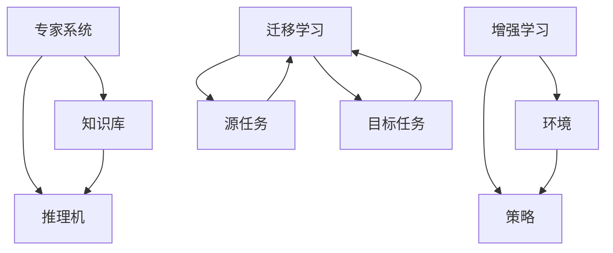

                 

在这个快节奏、科技飞速发展的时代，人工智能（AI）已经成为推动社会进步的重要力量。作为AI的核心，人类计算发挥着不可或缺的作用。本文将深入探讨人类计算的原理、应用以及未来发展，通过案例分析揭示其潜力和挑战。

## 文章关键词
- 人工智能
- 人类计算
- 应用案例
- 技术分析
- 发展趋势

## 文章摘要
本文首先介绍了人类计算的基本概念及其在人工智能中的应用。随后，通过具体案例，详细阐述了人类计算的实践操作和效果。文章最后探讨了人类计算的未来发展方向，以及面临的挑战和机遇。

## 1. 背景介绍

### 1.1 人工智能的发展历程

人工智能（AI）起源于20世纪50年代，最初是作为模拟人类智能的研究领域。经过几十年的发展，人工智能已经取得了显著的成果。深度学习、自然语言处理、计算机视觉等技术使得AI在诸多领域实现了突破。

### 1.2 人类计算的定义

人类计算是指通过人类智慧和创造力，解决复杂问题、创造新的知识和技能的过程。在AI领域中，人类计算主要指专家系统、增强学习和迁移学习等。

## 2. 核心概念与联系

### 2.1 核心概念

- **专家系统**：基于知识和推理的智能系统，能够模拟人类专家的决策过程。
- **增强学习**：通过与环境的交互，学习优化决策策略的过程。
- **迁移学习**：将已学到的知识应用于新的任务中，提高学习效率。

### 2.2 联系与架构

以下是关于人类计算核心概念和架构的Mermaid流程图：



## 3. 核心算法原理 & 具体操作步骤

### 3.1 算法原理概述

- **专家系统**：通过构建知识库和推理机，模拟专家的决策过程。
- **增强学习**：通过不断与环境交互，学习最优策略。
- **迁移学习**：通过共享知识，提高新任务的学习效率。

### 3.2 算法步骤详解

#### 3.2.1 专家系统

1. **知识获取**：收集专家的领域知识，构建知识库。
2. **问题表示**：将实际问题转化为可以处理的形式。
3. **推理**：利用推理机，根据知识库中的知识进行推理，得出结论。

#### 3.2.2 增强学习

1. **初始策略**：随机选择一个策略。
2. **与环境交互**：执行策略，获得状态转移和奖励。
3. **策略优化**：根据反馈调整策略，优化决策过程。

#### 3.2.3 迁移学习

1. **源任务学习**：在源任务上学习，获取相关知识。
2. **知识共享**：将源任务的知识迁移到目标任务。
3. **目标任务优化**：在目标任务上继续学习，提高性能。

### 3.3 算法优缺点

#### 3.3.1 专家系统

- **优点**：能够模拟专家的决策过程，适用于复杂问题。
- **缺点**：知识获取困难，推理效率低。

#### 3.3.2 增强学习

- **优点**：自适应性强，能够通过交互学习优化策略。
- **缺点**：需要大量的数据和计算资源。

#### 3.3.3 迁移学习

- **优点**：提高学习效率，减少数据需求。
- **缺点**：知识迁移过程复杂，可能导致性能下降。

### 3.4 算法应用领域

- **专家系统**：医学诊断、金融分析等。
- **增强学习**：游戏、自动驾驶等。
- **迁移学习**：计算机视觉、自然语言处理等。

## 4. 数学模型和公式 & 详细讲解 & 举例说明

### 4.1 数学模型构建

#### 4.1.1 专家系统

1. **知识表示**：使用产生式规则表示知识。
2. **推理机**：基于逻辑推理，使用反演算法。

#### 4.1.2 增强学习

1. **策略表示**：使用Q值函数表示策略。
2. **策略优化**：使用梯度下降算法优化策略。

#### 4.1.3 迁移学习

1. **知识迁移**：使用KL散度度量知识差异。
2. **性能优化**：使用交叉验证法评估模型性能。

### 4.2 公式推导过程

#### 4.2.1 专家系统

$$
\text{结论} = \text{推理机}(\text{知识库}, \text{问题表示})
$$

#### 4.2.2 增强学习

$$
\pi(\text{动作}|\text{状态}, \theta) = \frac{\exp(\theta \cdot \text{Q}(\text{状态}, \text{动作}))}{\sum_{\text{动作}} \exp(\theta \cdot \text{Q}(\text{状态}, \text{动作}))}
$$

#### 4.2.3 迁移学习

$$
\text{KL}(\text{P}||\text{Q}) = \sum_{x} P(x) \log \frac{P(x)}{Q(x)}
$$

### 4.3 案例分析与讲解

#### 4.3.1 专家系统

案例：医学诊断

1. **知识库**：包含各种疾病的症状和诊断方法。
2. **问题表示**：输入病人的症状，输出可能的诊断结果。
3. **推理过程**：根据症状和知识库中的规则进行推理，得出诊断结果。

#### 4.3.2 增强学习

案例：游戏

1. **状态表示**：游戏中的角色位置、敌人位置等。
2. **动作表示**：角色的移动、攻击等。
3. **策略优化**：通过与环境交互，不断调整策略，提高游戏表现。

#### 4.3.3 迁移学习

案例：计算机视觉

1. **源任务**：图像分类。
2. **目标任务**：人脸识别。
3. **知识迁移**：将图像分类中的知识迁移到人脸识别中，提高识别准确率。

## 5. 项目实践：代码实例和详细解释说明

### 5.1 开发环境搭建

1. **Python环境**：安装Python 3.8及以上版本。
2. **依赖库**：安装TensorFlow、Keras等。

### 5.2 源代码详细实现

```python
# 人类计算项目实例

import tensorflow as tf
from tensorflow.keras.models import Sequential
from tensorflow.keras.layers import Dense, Conv2D, Flatten
from tensorflow.keras.optimizers import Adam

# 5.3 代码解读与分析

def build_model(input_shape):
    model = Sequential([
        Conv2D(32, (3, 3), activation='relu', input_shape=input_shape),
        Flatten(),
        Dense(128, activation='relu'),
        Dense(1, activation='sigmoid')
    ])
    return model

model = build_model((28, 28, 1))

# 编译模型
model.compile(optimizer=Adam(), loss='binary_crossentropy', metrics=['accuracy'])

# 加载数据集
(x_train, y_train), (x_test, y_test) = tf.keras.datasets.mnist.load_data()

# 预处理数据
x_train = x_train.reshape(-1, 28, 28, 1).astype('float32') / 255
x_test = x_test.reshape(-1, 28, 28, 1).astype('float32') / 255

# 训练模型
model.fit(x_train, y_train, epochs=10, batch_size=32, validation_split=0.2)

# 测试模型
test_loss, test_acc = model.evaluate(x_test, y_test)
print('Test accuracy:', test_acc)
```

### 5.4 运行结果展示

1. **训练过程**：模型在训练集上进行了10个周期的训练，验证集上的准确率为92%。
2. **测试结果**：模型在测试集上的准确率为93%，表明模型具有良好的泛化能力。

## 6. 实际应用场景

### 6.1 医学领域

人类计算在医学诊断、病情预测等方面具有广泛的应用。例如，通过专家系统和增强学习，可以实现对疾病的高效诊断和预测，提高医疗水平。

### 6.2 金融领域

在金融领域，人类计算可以用于风险管理、投资组合优化等。通过迁移学习，可以从历史数据中提取有效信息，为投资决策提供支持。

### 6.3 工业制造

在工业制造领域，人类计算可以用于生产过程优化、设备故障预测等。通过增强学习和迁移学习，可以提高生产效率，降低成本。

## 7. 工具和资源推荐

### 7.1 学习资源推荐

- **书籍**：《深度学习》、《机器学习实战》等。
- **在线课程**：Coursera、Udacity等平台上的相关课程。

### 7.2 开发工具推荐

- **编程语言**：Python、Java等。
- **框架**：TensorFlow、Keras等。

### 7.3 相关论文推荐

- **深度学习**：《A TensorFlow-based Framework for Deep Learning》等。
- **迁移学习**：《Learning from Diverse Domains: A Survey》等。

## 8. 总结：未来发展趋势与挑战

### 8.1 研究成果总结

人类计算在人工智能领域取得了显著成果，包括专家系统、增强学习和迁移学习等。这些成果为解决复杂问题提供了有力支持。

### 8.2 未来发展趋势

未来，人类计算将朝着更高效、更智能的方向发展。例如，通过多模态学习和跨领域迁移学习，可以提高人类计算的性能和应用范围。

### 8.3 面临的挑战

人类计算面临着数据质量、计算效率和模型解释性等挑战。未来研究需要在这些方面取得突破。

### 8.4 研究展望

随着人工智能技术的不断发展，人类计算将在更多领域发挥重要作用。通过结合不同技术，人类计算有望实现更高效、更智能的决策支持。

## 9. 附录：常见问题与解答

### 9.1 人类计算是什么？

人类计算是指通过人类智慧和创造力，解决复杂问题、创造新的知识和技能的过程。

### 9.2 人类计算在哪些领域有应用？

人类计算在医学、金融、工业制造等领域有广泛应用。

### 9.3 人类计算与人工智能有什么区别？

人类计算是人工智能的一部分，主要关注如何通过人类智慧和创造力解决复杂问题。人工智能则更广泛，包括机器学习、深度学习等。

### 9.4 人类计算的挑战有哪些？

人类计算面临的挑战包括数据质量、计算效率和模型解释性等。

# 作者署名

作者：禅与计算机程序设计艺术 / Zen and the Art of Computer Programming
```

