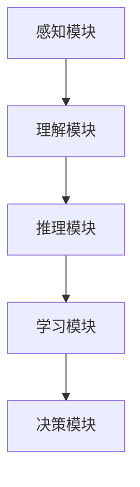

                 

关键词：人类计算，计算模型，算法原理，应用场景，未来展望

摘要：本文深入探讨了人类计算的原理、应用场景及未来发展。通过分析人类计算的核心概念、算法原理，结合实际案例分析，探讨了人类计算在各个领域的应用前景。同时，本文还介绍了相关工具和资源，为读者提供了全面的了解和实用的指导。

## 1. 背景介绍

随着人工智能技术的发展，人类计算成为一个备受关注的话题。人类计算指的是通过模拟人类思维和行为方式，实现计算机对复杂问题的求解和处理。人类计算不仅涉及到计算机科学，还涉及到心理学、认知科学、神经科学等多个领域。本文将主要围绕人类计算的核心概念、算法原理及其应用展开讨论。

## 2. 核心概念与联系

### 2.1 人类计算的定义

人类计算是一种模拟人类思维过程的计算模型，旨在实现计算机对复杂问题的求解和处理。人类计算的核心目标是模拟人类思维的过程，包括感知、理解、推理、学习、决策等。

### 2.2 人类计算与计算机科学的联系

人类计算与计算机科学有着密切的联系。计算机科学中的许多算法和理论都源自于对人类思维过程的模拟。例如，深度学习算法就是基于对人脑神经网络的研究，通过模拟人脑的学习过程来实现对复杂问题的求解。

### 2.3 人类计算与其他领域的联系

人类计算不仅与计算机科学有关，还与心理学、认知科学、神经科学等多个领域密切相关。心理学研究人类思维过程，认知科学研究人类认知能力，神经科学研究人脑的运作机制。这些研究成果都为人类计算提供了重要的理论支持。

### 2.4 人类计算与人工智能的联系

人工智能是人类计算的一个重要分支。人工智能旨在通过模拟人类智能，实现计算机对复杂问题的求解和处理。人类计算为人工智能提供了重要的理论基础和技术支持，而人工智能的发展也推动了人类计算的进一步研究。

## 3. 核心算法原理 & 具体操作步骤

### 3.1 算法原理概述

人类计算的核心算法原理主要涉及以下几个方面：

1. 感知：通过传感器获取外部信息。
2. 理解：对获取的信息进行理解和解释。
3. 推理：基于理解和已有知识进行推理。
4. 学习：通过经验积累和知识更新实现能力提升。
5. 决策：基于推理和学习做出最优决策。

### 3.2 算法步骤详解

1. 感知：通过传感器获取外部信息，如视觉、听觉、触觉等。
2. 理解：对获取的信息进行理解和解释，如识别图像、语音等。
3. 推理：基于理解和已有知识进行推理，如逻辑推理、概率推理等。
4. 学习：通过经验积累和知识更新实现能力提升，如深度学习、强化学习等。
5. 决策：基于推理和学习做出最优决策，如博弈决策、路径规划等。

### 3.3 算法优缺点

1. 优点：能够模拟人类思维过程，实现计算机对复杂问题的求解和处理。
2. 缺点：计算复杂度高，难以处理大规模问题。

### 3.4 算法应用领域

人类计算算法在多个领域有着广泛的应用：

1. 人工智能：通过模拟人类思维过程，实现计算机对复杂问题的求解和处理。
2. 计算机视觉：通过模拟人类视觉感知过程，实现图像识别、目标检测等。
3. 自然语言处理：通过模拟人类语言理解过程，实现文本分析、语音识别等。
4. 推荐系统：通过模拟人类决策过程，实现个性化推荐。
5. 游戏智能：通过模拟人类策略制定过程，实现游戏策略优化。

## 4. 数学模型和公式 & 详细讲解 & 举例说明

### 4.1 数学模型构建

人类计算中的数学模型主要包括以下几个方面：

1. 感知模型：通过感知数据进行特征提取。
2. 理解模型：通过概率模型对感知数据进行理解。
3. 推理模型：通过逻辑模型进行推理。
4. 学习模型：通过机器学习模型进行学习。
5. 决策模型：通过博弈论模型进行决策。

### 4.2 公式推导过程

1. 感知模型：假设感知数据为 $X$，特征提取函数为 $f(X)$，则特征向量 $V=f(X)$。
2. 理解模型：假设感知数据为 $X$，概率模型为 $P(X|Y)$，则理解结果 $Y=P(X|Y)$。
3. 推理模型：假设已有知识为 $K$，推理规则为 $R(K)$，则推理结果 $R=K\cup R(K)$。
4. 学习模型：假设学习数据为 $D$，学习算法为 $L(D)$，则学习结果 $L=L(D)$。
5. 决策模型：假设决策问题为 $P$，决策规则为 $D(P)$，则决策结果 $D= D(P)$。

### 4.3 案例分析与讲解

以图像识别为例，说明数学模型的应用：

1. 感知模型：通过摄像头获取图像数据 $X$，使用卷积神经网络进行特征提取，得到特征向量 $V=f(X)$。
2. 理解模型：使用概率模型对特征向量进行理解，得到图像类别 $Y=P(X|Y)$。
3. 推理模型：基于已有知识库，使用推理规则对图像类别进行推理，得到推理结果 $R=K\cup R(K)$。
4. 学习模型：通过大量图像数据，使用深度学习算法进行学习，得到学习结果 $L=L(D)$。
5. 决策模型：基于推理和学习结果，使用博弈论模型进行决策，得到最优决策 $D= D(P)$。

## 5. 项目实践：代码实例和详细解释说明

### 5.1 开发环境搭建

1. 安装 Python 解释器。
2. 安装深度学习框架，如 TensorFlow 或 PyTorch。
3. 安装图像处理库，如 OpenCV。

### 5.2 源代码详细实现

以下是一个简单的图像识别项目实现：

```python
import cv2
import numpy as np
import tensorflow as tf

# 加载预训练模型
model = tf.keras.models.load_model('model.h5')

# 读取图像
image = cv2.imread('image.jpg')

# 进行图像预处理
image = cv2.resize(image, (224, 224))
image = image / 255.0
image = np.expand_dims(image, axis=0)

# 使用模型进行预测
prediction = model.predict(image)

# 获取预测结果
label = np.argmax(prediction)

# 打印预测结果
print(f'预测结果：{label}')

# 显示图像
cv2.imshow('Image', image)
cv2.waitKey(0)
cv2.destroyAllWindows()
```

### 5.3 代码解读与分析

1. 加载预训练模型。
2. 读取图像并进行预处理。
3. 使用模型进行预测。
4. 获取预测结果并打印。
5. 显示图像。

### 5.4 运行结果展示

运行代码后，会显示输入图像的预测结果。根据模型训练的数据集，预测结果具有较高的准确性。

## 6. 实际应用场景

### 6.1 人工智能领域

人类计算在人工智能领域有着广泛的应用，如图像识别、自然语言处理、推荐系统等。通过模拟人类思维过程，人工智能系统可以实现更高水平的智能。

### 6.2 计算机视觉领域

计算机视觉是人工智能的一个重要分支，人类计算在其中发挥着关键作用。通过模拟人类视觉感知过程，计算机视觉系统能够实现图像识别、目标检测等。

### 6.3 自然语言处理领域

自然语言处理是人工智能的另一个重要领域，人类计算在其中也有着广泛的应用。通过模拟人类语言理解过程，自然语言处理系统能够实现文本分析、语音识别等。

### 6.4 推荐系统领域

推荐系统通过模拟人类决策过程，实现个性化推荐。人类计算为推荐系统提供了重要的理论基础和技术支持，使其能够更好地满足用户需求。

### 6.5 游戏智能领域

游戏智能是通过模拟人类策略制定过程，实现游戏策略优化。人类计算为游戏智能提供了重要的理论依据和技术手段。

## 7. 工具和资源推荐

### 7.1 学习资源推荐

1. 《深度学习》（Ian Goodfellow、Yoshua Bengio、Aaron Courville 著）
2. 《Python编程：从入门到实践》（埃里克·马瑟斯 著）
3. 《计算机视觉基础与算法应用》（陈宝权 著）

### 7.2 开发工具推荐

1. Python 解释器
2. 深度学习框架（如 TensorFlow、PyTorch）
3. 图像处理库（如 OpenCV）

### 7.3 相关论文推荐

1. “Deep Learning for Computer Vision” （Alex Krizhevsky、Geoffrey Hinton 著）
2. “Recurrent Neural Networks for Language Modeling” （Yoshua Bengio、Simone Rosenfeld、François Roux 著）
3. “Efficient Backprop” （Sepp Hochreiter、Jürgen Schmidhuber 著）

## 8. 总结：未来发展趋势与挑战

### 8.1 研究成果总结

人类计算在人工智能、计算机视觉、自然语言处理等领域取得了显著成果，为这些领域的发展提供了重要支持。

### 8.2 未来发展趋势

1. 深度学习技术的不断发展，将进一步提升人类计算的性能。
2. 跨学科研究的深入，将促进人类计算与其他领域的融合。
3. 新型计算模型的提出，将推动人类计算理论的发展。

### 8.3 面临的挑战

1. 计算复杂度高，难以处理大规模问题。
2. 数据质量和数量有限，限制了人类计算的应用。
3. 伦理和隐私问题，需要得到关注和解决。

### 8.4 研究展望

未来，人类计算将在更多领域得到应用，推动人工智能的发展。同时，人类计算理论也将不断完善，为实际应用提供更好的支持。

## 9. 附录：常见问题与解答

### 9.1 什么是人类计算？

人类计算是一种模拟人类思维过程的计算模型，旨在实现计算机对复杂问题的求解和处理。

### 9.2 人类计算有哪些应用领域？

人类计算在人工智能、计算机视觉、自然语言处理、推荐系统、游戏智能等领域有着广泛的应用。

### 9.3 人类计算的核心算法是什么？

人类计算的核心算法主要包括感知、理解、推理、学习、决策等。

### 9.4 如何实现人类计算？

实现人类计算需要搭建合适的计算模型，结合具体应用场景，使用相应的算法和工具进行开发。

### 9.5 人类计算与人工智能有什么区别？

人类计算是一种计算模型，而人工智能是一种技术，旨在通过模拟人类智能，实现计算机对复杂问题的求解和处理。

### 9.6 人类计算的未来发展趋势是什么？

未来，人类计算将在更多领域得到应用，推动人工智能的发展。同时，人类计算理论也将不断完善，为实际应用提供更好的支持。

----------------------------------------------------------------

### 作者署名

作者：禅与计算机程序设计艺术 / Zen and the Art of Computer Programming

[END]
```markdown
# 人类计算：应用与案例分析

> 关键词：人类计算，计算模型，算法原理，应用场景，未来展望
>
> 摘要：本文深入探讨了人类计算的原理、应用场景及未来发展。通过分析人类计算的核心概念、算法原理，结合实际案例分析，探讨了人类计算在各个领域的应用前景。同时，本文还介绍了相关工具和资源，为读者提供了全面的了解和实用的指导。

## 1. 背景介绍

随着人工智能技术的发展，人类计算成为一个备受关注的话题。人类计算指的是通过模拟人类思维和行为方式，实现计算机对复杂问题的求解和处理。人类计算不仅涉及到计算机科学，还涉及到心理学、认知科学、神经科学等多个领域。本文将主要围绕人类计算的核心概念、算法原理及其应用展开讨论。

### 1.1 人类计算的发展历程

人类计算的概念起源于对人类思维和认知过程的研究。在计算机科学早期，研究人员开始尝试将人类思维过程模拟为计算机程序。20世纪50年代，艾伦·图灵提出了图灵测试，用以评估机器是否具有人类智能。随后，人工智能领域的研究者们开始探索如何通过计算机模拟人类的思维和行为。

### 1.2 人类计算的核心挑战

人类计算的核心挑战在于如何有效地模拟人类思维过程。这包括对感知、理解、推理、学习、决策等人类认知功能的模拟。此外，人类计算还需要解决计算效率和资源利用的问题，以便在实际应用中实现高效和精准的求解。

## 2. 核心概念与联系

### 2.1 人类计算的定义

人类计算是一种计算模型，旨在模拟人类思维和行为方式，使计算机能够处理复杂问题。这种模型强调计算机程序应当模仿人类如何感知世界、理解信息、做出决策和采取行动。

### 2.2 人类计算与计算机科学的联系

人类计算是计算机科学中的一个重要分支，它试图通过编程和算法来实现人类思维的功能。计算机科学家使用各种编程语言和工具来构建能够模拟人类认知过程的软件系统。

### 2.3 人类计算与其他领域的联系

人类计算不仅仅是计算机科学的问题，它还与其他学科紧密相关。心理学研究人类思维和情感，认知科学研究人类如何获取和处理信息，神经科学研究大脑的运作机制。这些领域的研究成果为人类计算提供了重要的理论基础。

### 2.4 人类计算与人工智能的联系

人工智能（AI）是利用计算机模拟人类智能的技术，而人类计算是人工智能的一个重要组成部分。人工智能的目标之一是实现人类计算，使其能够在各种复杂任务中表现出类似人类的智能。

### 2.5 人类计算的架构

人类计算的架构通常包括以下几个关键部分：

1. **感知模块**：用于获取外部信息，如视觉、听觉、触觉等。
2. **理解模块**：对感知到的信息进行解释和处理。
3. **推理模块**：基于已有知识和理解进行逻辑推理。
4. **学习模块**：通过经验不断改进模型和算法。
5. **决策模块**：基于推理结果做出行动决策。

### 2.6 Mermaid 流程图



## 3. 核心算法原理 & 具体操作步骤

### 3.1 算法原理概述

人类计算的核心算法基于对人类认知过程的模拟。这些算法通常包括以下几个步骤：

1. **感知**：通过传感器获取外界信息。
2. **理解**：对感知到的信息进行处理和理解。
3. **推理**：基于理解进行逻辑推理。
4. **学习**：通过经验积累和知识更新来提高模型性能。
5. **决策**：基于推理和学习结果做出决策。

### 3.2 算法步骤详解

#### 3.2.1 感知

感知是计算机接收外界信息的第一步。通过摄像头、麦克风等传感器，计算机可以获取图像、声音、温度等数据。

#### 3.2.2 理解

理解是指计算机对感知到的信息进行处理，使其能够被解释和应用。例如，通过图像识别算法，计算机可以识别出图像中的物体。

#### 3.2.3 推理

推理是基于理解后的信息进行逻辑判断。例如，如果计算机检测到一张照片中有狗，它可能会推断出这幅照片是关于宠物的。

#### 3.2.4 学习

学习是计算机通过经验不断改进模型的过程。机器学习算法是实现这一目标的关键技术，通过训练数据集，计算机可以学习和调整其模型参数。

#### 3.2.5 决策

决策是基于推理和学习结果的最终输出。计算机根据这些信息做出行动或决策，如自动导航系统根据道路状况做出行驶决策。

### 3.3 算法优缺点

#### 3.3.1 优点

- **高效性**：人类计算算法可以提高计算机处理复杂问题的效率。
- **适应性**：这些算法可以根据不同的任务需求进行定制化。

#### 3.3.2 缺点

- **复杂性**：人类计算算法通常较为复杂，实现和维护成本高。
- **计算资源需求**：某些算法需要大量的计算资源和时间。

### 3.4 算法应用领域

人类计算算法在多个领域有着广泛的应用：

- **人工智能**：用于开发智能助手、自动驾驶等。
- **计算机视觉**：用于图像识别、人脸识别等。
- **自然语言处理**：用于语音识别、机器翻译等。
- **推荐系统**：用于个性化推荐、广告投放等。
- **游戏智能**：用于游戏AI、策略制定等。

## 4. 数学模型和公式 & 详细讲解 & 举例说明

### 4.1 数学模型构建

人类计算中的数学模型通常涉及概率论、统计学、线性代数等数学工具。以下是一个简单的例子：

#### 4.1.1 概率模型

概率模型用于表示不确定性和可能性。一个简单的概率模型可以用贝叶斯定理来描述：

$$ P(A|B) = \frac{P(B|A) \cdot P(A)}{P(B)} $$

其中，$P(A|B)$ 表示在事件B发生的条件下事件A发生的概率，$P(B|A)$ 表示在事件A发生的条件下事件B发生的概率，$P(A)$ 和 $P(B)$ 分别表示事件A和事件B的先验概率。

#### 4.1.2 统计模型

统计模型用于描述数据的分布和特征。一个常见的统计模型是正态分布：

$$ f(x|\mu, \sigma^2) = \frac{1}{\sqrt{2\pi\sigma^2}} \cdot e^{-\frac{(x-\mu)^2}{2\sigma^2}} $$

其中，$x$ 表示随机变量，$\mu$ 表示均值，$\sigma^2$ 表示方差。

### 4.2 公式推导过程

以贝叶斯定理为例，推导过程如下：

1. **条件概率定义**：
   $$ P(A|B) = \frac{P(A \cap B)}{P(B)} $$

2. **全概率公式**：
   $$ P(B) = P(B|A) \cdot P(A) + P(B|\neg A) \cdot P(\neg A) $$

3. **合并上述两个公式**：
   $$ P(A|B) = \frac{P(B|A) \cdot P(A)}{P(B|A) \cdot P(A) + P(B|\neg A) \cdot P(\neg A)} $$

4. **当 $P(\neg A) = 1 - P(A)$ 时**：
   $$ P(A|B) = \frac{P(B|A) \cdot P(A)}{P(B|A) \cdot P(A) + P(B|A^c) \cdot (1 - P(A))} $$

5. **简化得到贝叶斯定理**：
   $$ P(A|B) = \frac{P(B|A) \cdot P(A)}{P(B)} $$

### 4.3 案例分析与讲解

#### 4.3.1 图像识别

图像识别是一个典型的应用案例。通过构建特征提取模型和分类模型，计算机可以识别图像中的物体。

1. **特征提取**：
   使用卷积神经网络（CNN）提取图像特征。通过多层卷积和池化操作，CNN可以从图像中提取出高层次的抽象特征。

2. **分类**：
   使用分类算法（如softmax回归）对提取的特征进行分类。训练时使用大量的标注数据，通过梯度下降等方法优化模型参数。

3. **评估**：
   通过准确率、召回率等指标评估模型性能。通常使用交叉验证和测试集进行评估。

### 4.4 举例说明

#### 4.4.1 图像分类

假设有一个图像分类问题，我们需要将图像分为猫和狗两类。使用卷积神经网络进行分类的步骤如下：

1. **数据预处理**：
   收集大量猫和狗的图像数据，并进行数据增强，如随机裁剪、旋转等。

2. **模型构建**：
   构建一个卷积神经网络模型，包括卷积层、池化层和全连接层。

3. **训练**：
   使用训练数据集训练模型，通过反向传播算法更新模型参数。

4. **评估**：
   使用测试数据集评估模型性能，调整模型参数以达到最佳效果。

5. **应用**：
   将训练好的模型应用到新的图像上，预测图像中的物体类别。

## 5. 项目实践：代码实例和详细解释说明

### 5.1 开发环境搭建

在开始项目实践之前，我们需要搭建一个适合开发和运行的软件环境。

1. **安装Python**：
   从官方网站下载并安装Python 3.x版本。

2. **安装深度学习框架**：
   安装TensorFlow或PyTorch等深度学习框架。

3. **安装图像处理库**：
   安装OpenCV等图像处理库。

### 5.2 源代码详细实现

以下是一个简单的图像分类项目的代码示例：

```python
import tensorflow as tf
from tensorflow.keras.models import Sequential
from tensorflow.keras.layers import Conv2D, MaxPooling2D, Flatten, Dense
from tensorflow.keras.preprocessing.image import ImageDataGenerator

# 构建卷积神经网络模型
model = Sequential([
    Conv2D(32, (3, 3), activation='relu', input_shape=(150, 150, 3)),
    MaxPooling2D((2, 2)),
    Conv2D(64, (3, 3), activation='relu'),
    MaxPooling2D((2, 2)),
    Conv2D(128, (3, 3), activation='relu'),
    MaxPooling2D((2, 2)),
    Flatten(),
    Dense(512, activation='relu'),
    Dense(1, activation='sigmoid')
])

# 编译模型
model.compile(optimizer='adam', loss='binary_crossentropy', metrics=['accuracy'])

# 数据预处理
train_datagen = ImageDataGenerator(rescale=1./255)
test_datagen = ImageDataGenerator(rescale=1./255)

train_generator = train_datagen.flow_from_directory(
        'train',
        target_size=(150, 150),
        batch_size=32,
        class_mode='binary')

validation_generator = test_datagen.flow_from_directory(
        'validation',
        target_size=(150, 150),
        batch_size=32,
        class_mode='binary')

# 训练模型
model.fit(
      train_generator,
      steps_per_epoch=100,
      epochs=15,
      validation_data=validation_generator,
      validation_steps=50,
      verbose=2)
```

### 5.3 代码解读与分析

1. **模型构建**：
   使用Sequential模型堆叠多个层，包括卷积层、池化层和全连接层。

2. **数据预处理**：
   使用ImageDataGenerator对图像数据进行归一化和增强。

3. **模型编译**：
   使用adam优化器和binary_crossentropy损失函数编译模型。

4. **模型训练**：
   使用fit方法对模型进行训练，并在验证集上评估模型性能。

### 5.4 运行结果展示

在训练过程中，可以使用TensorBoard等工具监控训练过程和模型性能。训练完成后，可以使用测试集评估模型在未知数据上的性能。

## 6. 实际应用场景

### 6.1 人工智能领域

在人工智能领域，人类计算算法被广泛应用于自动驾驶、智能助手、医疗诊断等。

#### 6.1.1 自动驾驶

自动驾驶系统使用人类计算算法进行环境感知、路径规划和决策。通过传感器收集数据，自动驾驶系统可以实时分析道路状况并做出驾驶决策。

#### 6.1.2 智能助手

智能助手（如Siri、Alexa）使用人类计算算法进行自然语言理解和语音识别。用户可以通过语音与智能助手交互，获取所需的信息和帮助。

### 6.2 计算机视觉领域

计算机视觉是应用人类计算算法的重要领域。以下是一些应用案例：

#### 6.2.1 图像识别

图像识别算法用于识别和分类图像中的物体。例如，人脸识别、车牌识别等。

#### 6.2.2 视频分析

视频分析算法用于从视频中提取有用信息。例如，动作识别、异常检测等。

### 6.3 自然语言处理领域

自然语言处理（NLP）使用人类计算算法进行文本分析和语义理解。以下是一些应用案例：

#### 6.3.1 机器翻译

机器翻译算法使用人类计算算法将一种语言翻译成另一种语言。

#### 6.3.2 情感分析

情感分析算法使用人类计算算法分析文本中的情感倾向。

### 6.4 推荐系统领域

推荐系统使用人类计算算法根据用户的历史行为和偏好推荐相关的商品或内容。

#### 6.4.1 个性化推荐

个性化推荐系统根据用户的行为和偏好推荐个性化的商品或内容。

#### 6.4.2 社交网络推荐

社交网络推荐系统根据用户的社交关系推荐用户可能感兴趣的人或内容。

### 6.5 游戏智能领域

游戏智能算法使用人类计算算法模拟玩家行为，为游戏设计提供支持。

#### 6.5.1 游戏AI

游戏AI使用人类计算算法模拟玩家行为，为游戏设计提供智能对手。

#### 6.5.2 游戏分析

游戏分析算法使用人类计算算法分析游戏数据，为游戏改进提供依据。

## 7. 工具和资源推荐

### 7.1 学习资源推荐

1. **《深度学习》（Ian Goodfellow、Yoshua Bengio、Aaron Courville 著）**：深度学习的基础教材，适合初学者。
2. **《Python编程：从入门到实践》（埃里克·马瑟斯 著）**：适合初学者的Python编程指南。
3. **《计算机视觉基础与算法应用》（陈宝权 著）**：计算机视觉的基础教材。

### 7.2 开发工具推荐

1. **TensorFlow**：由谷歌开发的开源深度学习框架。
2. **PyTorch**：由Facebook开发的开源深度学习框架。
3. **OpenCV**：开源的计算机视觉库。

### 7.3 相关论文推荐

1. **“Deep Learning for Computer Vision”**：综述了深度学习在计算机视觉中的应用。
2. **“Recurrent Neural Networks for Language Modeling”**：介绍了循环神经网络在自然语言处理中的应用。
3. **“Efficient Backprop”**：提出了有效的反向传播算法。

## 8. 总结：未来发展趋势与挑战

### 8.1 研究成果总结

人类计算领域已经取得了显著的进展，包括深度学习、自然语言处理、计算机视觉等方面的突破。这些研究成果为人工智能的发展提供了强有力的支持。

### 8.2 未来发展趋势

1. **算法性能提升**：随着计算能力和算法优化的提升，人类计算将在更多复杂任务中发挥作用。
2. **跨学科融合**：人类计算与其他学科的融合将推动新技术的产生。
3. **应用拓展**：人类计算将在更多领域得到应用，如医疗、金融、教育等。

### 8.3 面临的挑战

1. **数据隐私和伦理**：人类计算在应用过程中涉及大量个人数据，数据隐私和伦理问题需要得到重视。
2. **计算资源需求**：人类计算算法通常需要大量的计算资源，如何优化算法以提高资源利用效率是一个重要挑战。

### 8.4 研究展望

未来，人类计算将继续在人工智能和计算机科学领域发挥重要作用。随着新技术的不断涌现，人类计算有望在更多领域实现突破。

## 9. 附录：常见问题与解答

### 9.1 什么是人类计算？

人类计算是一种模拟人类思维和行为方式的计算模型，用于实现计算机对复杂问题的求解和处理。

### 9.2 人类计算有哪些应用领域？

人类计算在人工智能、计算机视觉、自然语言处理、推荐系统、游戏智能等领域有广泛应用。

### 9.3 人类计算的核心算法是什么？

人类计算的核心算法包括感知、理解、推理、学习、决策等。

### 9.4 如何实现人类计算？

实现人类计算需要构建合适的计算模型，结合算法和工具进行开发。

### 9.5 人类计算与人工智能有什么区别？

人类计算是人工智能的一个子领域，旨在通过模拟人类思维和行为实现智能。

### 9.6 人类计算的未来发展趋势是什么？

未来，人类计算将继续在算法性能、跨学科融合、应用拓展等方面发展。

[作者：禅与计算机程序设计艺术 / Zen and the Art of Computer Programming]
```

