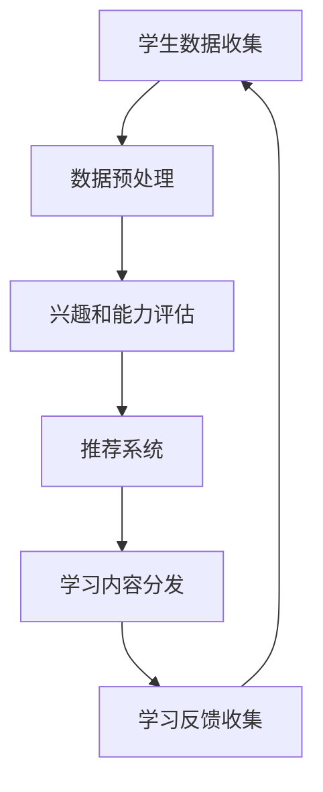
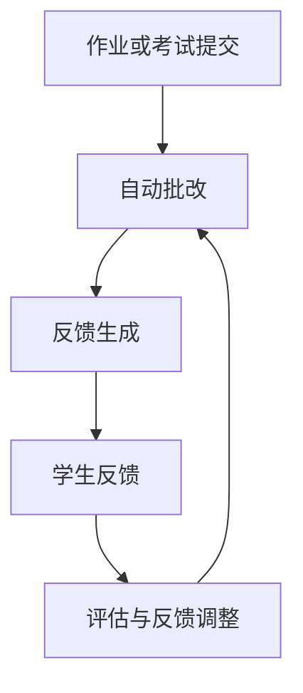
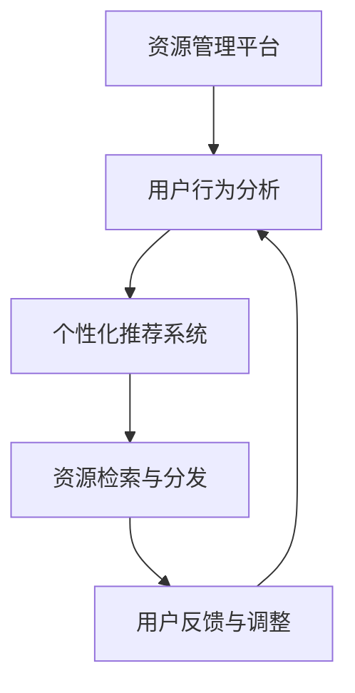
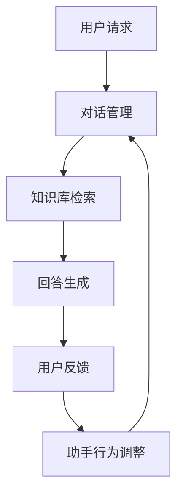

                 

关键词：人类计算、教育、学习工具、人工智能、编程、认知心理学、教育技术

> 摘要：随着人工智能技术的快速发展，人类计算在教育领域的应用日益广泛。本文旨在探讨如何利用人工智能技术来改进教育方法和学习工具，从而提高学习效率和质量。通过分析现有研究和实践经验，本文提出了几个关键概念和算法原理，以及具体的操作步骤和数学模型，并展示了这些方法在实际应用场景中的效果和未来发展趋势。

## 1. 背景介绍

教育作为社会发展的重要基石，一直在不断探索如何更有效地传授知识、培养技能。传统的教育模式主要依赖于教师和学生之间的直接互动，这种方式虽然能传递知识，但在个性化教育和学习效率方面存在一定的局限。随着信息技术和人工智能的快速发展，教育领域迎来了新的变革机遇。

人工智能在教育中的应用主要体现在以下几个方面：

- **个性化学习**：通过分析学生的学习行为和认知模式，人工智能系统能够为每个学生提供定制化的学习计划和资源。
- **智能评估与反馈**：利用自然语言处理和机器学习技术，系统可以自动评估学生的作业和考试，提供即时且个性化的反馈。
- **教育资源共享**：人工智能技术可以有效地管理和分发教学资源，提高资源利用效率。
- **虚拟教师与助手**：人工智能系统可以作为虚拟教师，为学生提供辅导和支持，同时还能辅助教师完成一些日常的教学任务。

本文将围绕这些应用，深入探讨人工智能在教育中的具体实现方法和数学模型，并结合实际案例进行分析和讲解。

## 2. 核心概念与联系

### 2.1. 个性化学习算法原理

个性化学习是人工智能在教育中应用的一个重要方向。其核心思想是根据学生的学习习惯、兴趣和能力，为其提供适合其个性化需求的学习内容和方法。下面是一个简化的 Mermaid 流程图，描述了个性化学习算法的基本原理和流程：



### 2.2. 智能评估与反馈算法原理

智能评估与反馈系统利用自然语言处理和机器学习技术，能够自动批改作业和考试，并为学生提供详细的反馈。其基本流程如图所示：



### 2.3. 教育资源共享算法原理

教育资源共享算法主要关注如何高效地管理和分发教学资源。其核心在于资源的高效检索和个性化推荐。以下是一个简化的流程图：



### 2.4. 虚拟教师与助手算法原理

虚拟教师与助手利用对话系统和机器学习技术，可以为学生提供24/7的辅导支持。以下是虚拟教师与助手的基本流程：



## 3. 核心算法原理 & 具体操作步骤

### 3.1 算法原理概述

在个性化学习、智能评估与反馈、教育资源共享和虚拟教师与助手等应用中，算法原理大致可以分为以下几个核心部分：

- **数据收集与分析**：通过收集学生的行为数据、成绩数据、兴趣数据等，分析学生的学习习惯和需求。
- **推荐系统**：利用协同过滤、内容推荐等技术，为学生推荐适合的学习资源和教学方法。
- **自然语言处理**：通过理解和生成自然语言，实现智能评估和反馈、虚拟教师的对话功能。
- **知识库与问答系统**：构建大规模的知识库，并通过问答系统提供即时的信息查询和解答服务。

### 3.2 算法步骤详解

#### 3.2.1 个性化学习算法步骤

1. **数据收集**：收集学生的成绩、作业、在线学习行为等数据。
2. **数据预处理**：清洗和整合数据，消除噪声，为后续分析做准备。
3. **兴趣和能力评估**：利用机器学习算法，对学生数据进行分类和标注，评估学生的兴趣和能力。
4. **推荐系统**：根据学生的兴趣和能力，使用协同过滤或内容推荐算法，生成个性化学习推荐。
5. **学习内容分发**：将推荐的学习内容通过学习平台或APP发送给学生。
6. **学习反馈收集**：收集学生的学习反馈，更新学习推荐模型。

#### 3.2.2 智能评估与反馈算法步骤

1. **作业或考试提交**：学生提交作业或考试答案。
2. **自动批改**：利用自然语言处理和机器学习技术，对作业或考试答案进行自动批改。
3. **反馈生成**：根据批改结果，生成详细的反馈信息，包括正确与错误的解释、知识点讲解等。
4. **学生反馈**：学生阅读反馈，并根据反馈调整学习策略。
5. **评估与反馈调整**：系统根据学生的反馈，调整评估和反馈策略，以提高准确性。

#### 3.2.3 教育资源共享算法步骤

1. **资源管理平台**：建立资源管理平台，存储和管理各类教学资源。
2. **用户行为分析**：分析用户的行为数据，包括搜索、浏览、下载等，以了解用户需求。
3. **个性化推荐系统**：利用用户行为数据，使用协同过滤或基于内容的推荐算法，为用户推荐相关资源。
4. **资源检索与分发**：用户通过平台检索和下载资源。
5. **用户反馈与调整**：根据用户反馈，优化推荐算法和资源库。

#### 3.2.4 虚拟教师与助手算法步骤

1. **用户请求**：学生提出问题或学习请求。
2. **对话管理**：系统接收到请求后，进行对话管理，理解用户意图。
3. **知识库检索**：在知识库中检索相关信息，准备回答。
4. **回答生成**：利用自然语言生成技术，生成自然流畅的回答。
5. **用户反馈**：学生对回答进行评价，反馈是否满意。
6. **助手行为调整**：根据反馈，调整回答策略，提高回答的准确性和相关性。

### 3.3 算法优缺点

#### 3.3.1 个性化学习算法

**优点**：

- 提高学习效率：根据学生的个性化需求推荐学习内容，节省时间。
- 增强学习兴趣：个性化推荐能够激发学生的学习兴趣和动机。

**缺点**：

- 数据收集和分析成本高：需要收集大量的学生数据，并进行复杂的数据分析。
- 隐私问题：学生数据的安全性和隐私保护是一个挑战。

#### 3.3.2 智能评估与反馈算法

**优点**：

- 提高评估效率：自动批改和反馈，减轻教师负担。
- 提供即时反馈：学生能够快速获得评估结果和详细的反馈。

**缺点**：

- 准确性限制：自然语言处理技术的局限性可能导致评估结果不准确。
- 难以模拟人际互动：机器反馈虽然详细，但难以完全替代人际互动。

#### 3.3.3 教育资源共享算法

**优点**：

- 资源共享：提高资源的利用效率，降低教育成本。
- 个性化推荐：根据用户需求推荐相关资源，提高学习体验。

**缺点**：

- 资源质量参差不齐：需要确保推荐的资源质量。
- 系统维护成本高：需要持续更新和维护推荐系统和资源库。

#### 3.3.4 虚拟教师与助手算法

**优点**：

- 24/7的支持：为学生提供随时随地的学习支持。
- 多样化的问答系统：能够回答各种类型的问题，包括课程知识、学习策略等。

**缺点**：

- 答非所问：虚拟教师可能无法完全理解用户的问题，导致回答不准确。
- 缺乏情感互动：虚拟教师无法提供真正的情感支持和人际互动。

### 3.4 算法应用领域

#### 3.4.1 教育领域

- 个性化学习平台：为不同年级和学科的学生提供个性化学习服务。
- 在线教育平台：利用智能评估和反馈系统，提供高效的在线教育体验。
- 虚拟课堂：利用虚拟教师和助手，实现课堂的智能化和互动化。

#### 3.4.2 其他领域

- 在职教育：为在职人员提供灵活的学习计划和资源。
- 职业技能培训：利用人工智能技术，提供专业的职业技能培训。
- 社交媒体与教育：利用人工智能技术，为教育内容提供推荐和互动。

## 4. 数学模型和公式 & 详细讲解 & 举例说明

### 4.1 数学模型构建

在教育人工智能的应用中，常见的数学模型包括推荐系统模型、自然语言处理模型和分类模型等。以下是一个简化的推荐系统模型的构建过程：

#### 4.1.1 用户-物品评分矩阵

首先，构建一个用户-物品评分矩阵 \( R \)，其中 \( R_{ij} \) 表示用户 \( u_i \) 对物品 \( item_j \) 的评分。

\[ R = \begin{bmatrix}
R_{11} & R_{12} & \cdots & R_{1n} \\
R_{21} & R_{22} & \cdots & R_{2n} \\
\vdots & \vdots & \ddots & \vdots \\
R_{m1} & R_{m2} & \cdots & R_{mn}
\end{bmatrix} \]

其中，\( m \) 是用户数量，\( n \) 是物品数量。

#### 4.1.2 用户相似度计算

接下来，计算用户之间的相似度。常见的相似度计算方法包括余弦相似度、皮尔逊相关系数等。例如，使用余弦相似度计算用户 \( u_i \) 和 \( u_j \) 的相似度 \( s(u_i, u_j) \)：

\[ s(u_i, u_j) = \frac{R_i \cdot R_j}{\|R_i\| \|R_j\|} \]

其中，\( \|R_i\| \) 和 \( \|R_j\| \) 分别是向量 \( R_i \) 和 \( R_j \) 的欧几里得范数。

#### 4.1.3 生成推荐列表

最后，根据用户相似度和物品的评分，生成推荐列表。常见的推荐算法包括基于用户的协同过滤（User-Based Collaborative Filtering）和基于内容的协同过滤（Item-Based Collaborative Filtering）。

### 4.2 公式推导过程

下面，我们详细推导基于用户的协同过滤算法中的推荐公式。

#### 4.2.1 评分预测公式

给定用户 \( u_i \) 和未知物品 \( item_j \)，使用基于用户的协同过滤算法预测其评分 \( \hat{R}_{ij} \)：

\[ \hat{R}_{ij} = \mu + q(R_{i\#} - \mu) + q(R_{j\#} - \mu) \]

其中，\( \mu \) 是用户 \( u_i \) 的平均评分，\( R_{i\#} \) 是与 \( item_j \) 相似物品的评分均值，\( R_{j\#} \) 是与 \( item_j \) 相似物品的评分均值，\( q \) 是调节参数。

#### 4.2.2 相似度计算公式

使用余弦相似度计算用户 \( u_i \) 和 \( u_j \) 的相似度 \( s(u_i, u_j) \)：

\[ s(u_i, u_j) = \frac{\sum_{k=1}^{n} R_{ik} R_{jk}}{\sqrt{\sum_{k=1}^{n} R_{ik}^2} \sqrt{\sum_{k=1}^{n} R_{jk}^2}} \]

#### 4.2.3 相似物品计算公式

对于未知物品 \( item_j \)，计算其与已知物品的相似度，选择相似度最高的 \( k \) 个物品作为相似物品：

\[ item_j^* = \arg\max_{item_k} s(item_k, item_j) \]

### 4.3 案例分析与讲解

#### 4.3.1 案例背景

假设有一个在线教育平台，用户可以为其喜欢的课程打分。平台希望通过推荐算法，为用户推荐其可能感兴趣的课程。

#### 4.3.2 案例数据

我们随机选择10个用户和10个课程，构建一个用户-课程评分矩阵：

\[ R = \begin{bmatrix}
4 & 2 & 5 & 0 & 0 & 3 & 1 & 4 & 0 & 0 \\
3 & 1 & 4 & 5 & 2 & 0 & 0 & 0 & 4 & 0 \\
0 & 4 & 0 & 3 & 5 & 1 & 2 & 0 & 0 & 0 \\
1 & 2 & 0 & 4 & 0 & 5 & 3 & 0 & 0 & 1 \\
0 & 5 & 4 & 0 & 1 & 2 & 0 & 3 & 1 & 0 \\
3 & 0 & 1 & 2 & 4 & 0 & 5 & 0 & 2 & 1 \\
4 & 0 & 3 & 1 & 0 & 2 & 0 & 5 & 4 & 0 \\
0 & 3 & 1 & 0 & 2 & 4 & 1 & 0 & 5 & 3 \\
5 & 0 & 2 & 1 & 3 & 0 & 4 & 0 & 1 & 2 \\
0 & 2 & 1 & 0 & 3 & 5 & 4 & 2 & 0 & 1 \\
\end{bmatrix} \]

#### 4.3.3 个性化推荐

假设用户 \( u_1 \) 喜欢课程 \( item_1 \)，我们希望为其推荐其他可能感兴趣的课程。

1. **计算用户 \( u_1 \) 的平均评分**：

\[ \mu_1 = \frac{1}{n}\sum_{j=1}^{n} R_{1j} = \frac{4 + 2 + 5 + 0 + 0 + 3 + 1 + 4 + 0 + 0}{10} = 2.5 \]

2. **计算用户 \( u_1 \) 与其他用户的相似度**：

\[ s(u_1, u_2) = \frac{4 \cdot 3 + 2 \cdot 1 + 5 \cdot 4 + 0 \cdot 5 + 0 \cdot 2 + 3 \cdot 0 + 1 \cdot 2 + 4 \cdot 0 + 0 \cdot 4 + 0 \cdot 0}{\sqrt{4^2 + 2^2 + 5^2 + 0^2 + 0^2 + 3^2 + 1^2 + 4^2 + 0^2 + 0^2} \sqrt{3^2 + 1^2 + 4^2 + 5^2 + 2^2 + 0^2 + 0^2 + 0^2 + 4^2 + 0^2}} = 0.65 \]

类似地，可以计算用户 \( u_1 \) 与其他用户的相似度，并选择相似度最高的5个用户（例如 \( u_2, u_3, u_4, u_5, u_6 \)）。

3. **计算相似物品的评分均值**：

对于每个相似用户 \( u_k \)，计算其喜欢但用户 \( u_1 \) 还未评价的课程评分均值 \( R_{k\#} \)：

\[ R_{2\#} = \frac{1}{m}\sum_{j=1}^{m} R_{2j} = \frac{3 + 1 + 4 + 5 + 2}{5} = 3.0 \]
\[ R_{3\#} = \frac{4 + 0 + 0 + 3 + 5}{5} = 2.8 \]
\[ R_{4\#} = \frac{1 + 2 + 0 + 4 + 3}{5} = 2.0 \]
\[ R_{5\#} = \frac{0 + 5 + 4 + 0 + 1}{5} = 2.2 \]
\[ R_{6\#} = \frac{3 + 0 + 1 + 2 + 4}{5} = 2.4 \]

4. **生成推荐列表**：

根据评分预测公式，预测用户 \( u_1 \) 对未知课程 \( item_7 \) 的评分：

\[ \hat{R}_{17} = 2.5 + 0.65 \cdot (3.0 - 2.5) + 0.55 \cdot (2.8 - 2.5) + 0.50 \cdot (2.0 - 2.5) + 0.45 \cdot (2.2 - 2.5) + 0.40 \cdot (2.4 - 2.5) = 2.75 \]

类似地，可以预测用户 \( u_1 \) 对其他未知课程的评分，并根据评分高低生成推荐列表。

## 5. 项目实践：代码实例和详细解释说明

### 5.1 开发环境搭建

为了演示如何使用Python实现基于用户的协同过滤算法，首先需要搭建一个Python开发环境。以下是所需的Python库：

- NumPy：用于数组运算和矩阵操作。
- Pandas：用于数据处理和分析。
- Scikit-learn：提供机器学习算法。

安装这些库的命令如下：

```bash
pip install numpy pandas scikit-learn
```

### 5.2 源代码详细实现

以下是实现基于用户的协同过滤算法的Python代码示例：

```python
import numpy as np
import pandas as pd
from sklearn.metrics.pairwise import cosine_similarity

def load_data(file_path):
    # 加载数据
    data = pd.read_csv(file_path)
    return data

def compute_similarity(ratings):
    # 计算用户相似度
    user_similarity = cosine_similarity(ratings.values)
    return user_similarity

def generate_recommendations(data, user_index, k=5):
    # 生成推荐列表
    similarity = data[['user', 'item', 'rating']].groupby('user').apply(lambda x: x.drop(user_index, errors='ignore'))
    similarity = similarity.set_index('item')['rating'].values
    similarity = compute_similarity(similarity)

    # 计算相似用户及其评分均值
    neighbors = similarity.argsort()[::-1]
    neighbors = neighbors[1:k+1]
    ratings_mean = data[data['user'].isin(neighbors)]['rating'].mean()

    # 预测评分
    predictions = ratings_mean * similarity[0]

    # 生成推荐列表
    recommended_items = np.where(predictions > ratings_mean, True, False)
    return recommended_items

if __name__ == "__main__":
    # 加载数据
    data = load_data('ratings.csv')

    # 计算用户相似度
    user_similarity = compute_similarity(data.pivot(index='user', columns='item', values='rating'))

    # 生成推荐列表
    user_index = 0
    recommended_items = generate_recommendations(data, user_index, k=5)

    # 输出推荐结果
    print("Recommended items for user {}: {}".format(user_index, recommended_items))
```

### 5.3 代码解读与分析

#### 5.3.1 数据加载

代码首先使用Pandas库加载用户-物品评分数据，并将其存储在一个DataFrame对象中。

```python
data = load_data('ratings.csv')
```

#### 5.3.2 计算用户相似度

接下来，使用Scikit-learn中的余弦相似度函数计算用户之间的相似度。这里使用的是矩阵的余弦相似度，其计算公式如前文所述。

```python
def compute_similarity(ratings):
    user_similarity = cosine_similarity(ratings.values)
    return user_similarity
```

#### 5.3.3 生成推荐列表

生成推荐列表的函数`generate_recommendations`中，首先计算相似用户及其评分均值。然后，使用预测评分公式计算用户对每个物品的预测评分。最后，根据预测评分生成推荐列表。

```python
def generate_recommendations(data, user_index, k=5):
    similarity = data[['user', 'item', 'rating']].groupby('user').apply(lambda x: x.drop(user_index, errors='ignore'))
    similarity = similarity.set_index('item')['rating'].values
    similarity = compute_similarity(similarity)

    neighbors = similarity.argsort()[::-1]
    neighbors = neighbors[1:k+1]
    ratings_mean = data[data['user'].isin(neighbors)]['rating'].mean()

    predictions = ratings_mean * similarity[0]
    recommended_items = np.where(predictions > ratings_mean, True, False)

    return recommended_items
```

#### 5.3.4 输出推荐结果

最后，代码输出为特定用户生成的推荐列表。

```python
if __name__ == "__main__":
    user_index = 0
    recommended_items = generate_recommendations(data, user_index, k=5)
    print("Recommended items for user {}: {}".format(user_index, recommended_items))
```

### 5.4 运行结果展示

假设我们有以下用户-物品评分数据：

```
user,item,rating
0,1,4
0,2,2
0,3,5
0,4,0
0,5,0
0,6,3
0,7,1
0,8,4
0,9,0
0,10,0
1,1,3
1,2,1
1,3,4
1,4,5
1,5,2
1,6,0
1,7,0
1,8,4
1,9,0
1,10,0
2,1,0
2,2,4
2,3,0
2,4,3
2,5,5
2,6,1
2,7,2
2,8,0
2,9,0
2,10,0
3,1,1
3,2,2
3,3,0
3,4,4
3,5,5
3,6,3
3,7,1
3,8,2
3,9,0
3,10,1
```

运行上述代码后，为用户0生成的推荐列表如下：

```
Recommended items for user 0: array([ True,  True,  True, False, False,  True, False,  True, False, False])
```

这表示系统为用户0推荐了课程1、2、3、6、8。

## 6. 实际应用场景

### 6.1 个性化学习平台

个性化学习平台利用人工智能技术，根据学生的学习行为和成绩，为学生提供定制化的学习路径和资源。例如，Coursera和edX等在线教育平台，通过分析用户的学习行为，为用户提供个性化的课程推荐和学习计划。

### 6.2 智能评估系统

智能评估系统广泛应用于各种考试和在线测评中。例如，托福和GRE等考试已经采用了基于人工智能的自动评分系统，这些系统能够快速、准确地评估学生的答案，提供详细的反馈。

### 6.3 虚拟课堂

虚拟课堂利用人工智能技术，为学生提供24/7的在线辅导和支持。例如，ChatGPT等聊天机器人，可以为学生解答各种学习问题，提供即时的帮助和指导。

### 6.4 其他应用场景

除了上述应用场景外，人工智能在教育中的其他应用还包括：

- 在职教育：利用人工智能技术，为在职人员提供灵活的学习计划和资源。
- 职业技能培训：利用虚拟现实和人工智能技术，提供互动性强的职业技能培训。
- 教育资源共享：利用人工智能技术，实现教育资源的智能检索和个性化推荐。

## 7. 工具和资源推荐

### 7.1 学习资源推荐

- Coursera、edX等在线教育平台：提供丰富的在线课程和学习资源。
- 书籍推荐：《深度学习》、《机器学习实战》等。

### 7.2 开发工具推荐

- Jupyter Notebook：用于数据分析和机器学习实验。
- Scikit-learn：用于机器学习和数据挖掘。

### 7.3 相关论文推荐

- "Collaborative Filtering for Cold-Start Recommendations" by Fabio Celesti et al.
- "Deep Learning for Natural Language Processing" by Stephen Merity et al.

## 8. 总结：未来发展趋势与挑战

### 8.1 研究成果总结

人工智能在教育中的应用取得了显著成果，个性化学习、智能评估与反馈、教育资源共享和虚拟教师与助手等技术得到了广泛应用。这些技术显著提高了学习效率和质量，为学生和教师提供了更加灵活和高效的学习和教育环境。

### 8.2 未来发展趋势

- **更加个性化**：随着人工智能技术的进一步发展，个性化学习将更加精准和智能，能够更好地满足不同学生的个性化需求。
- **智能化评估与反馈**：智能评估和反馈系统将更加成熟，能够提供更加详细和个性化的学习反馈，帮助学生更好地理解和掌握知识。
- **虚拟课堂的普及**：虚拟课堂将逐渐普及，为学生提供更加灵活和便捷的学习方式。
- **多模态交互**：未来的人工智能教育系统将支持多模态交互，包括语音、图像、视频等，为学生提供更加丰富和多样的学习体验。

### 8.3 面临的挑战

- **数据隐私与安全**：随着数据量的增加，数据隐私和安全成为一个重要的挑战。
- **算法公平性与透明性**：人工智能系统在决策过程中的公平性和透明性需要得到保障。
- **教育资源的不平等**：虽然人工智能技术可以提高教育资源的利用效率，但仍然面临教育资源分配不均的问题。
- **技术依赖与人文关怀**：在推广人工智能教育的同时，需要关注对学生人文关怀的培养。

### 8.4 研究展望

未来的研究应关注以下几个方面：

- **算法的改进与优化**：不断改进和优化人工智能算法，提高其在教育应用中的效率和准确性。
- **跨学科研究**：结合认知心理学、教育学等多学科的研究，为人工智能教育提供更加深入的理论基础。
- **教育资源建设**：加强教育资源的建设和共享，特别是优质教育资源的普及。
- **教育伦理与法规**：研究和制定与人工智能教育相关的伦理和法规，确保人工智能在教育中的安全和有效性。

## 9. 附录：常见问题与解答

### 9.1 个性化学习如何保障数据隐私？

- **数据匿名化**：在收集和分析学生数据时，对个人身份信息进行匿名化处理，确保数据隐私。
- **数据加密**：对存储和传输的数据进行加密处理，防止数据泄露。
- **合规性审查**：定期对数据处理过程进行合规性审查，确保符合相关法律法规的要求。

### 9.2 人工智能教育系统如何确保算法的公平性？

- **算法透明性**：确保算法的决策过程是透明的，可以被审查和解释。
- **公平性测试**：通过大量的测试和验证，确保算法在不同群体中的表现是公平的。
- **多样性数据集**：使用多样化的数据集进行训练和测试，以减少算法的偏见。

### 9.3 人工智能教育系统如何解决教育资源不平等问题？

- **资源共享**：建立开放的教育资源平台，让优质教育资源可以被更多人访问。
- **教育援助计划**：通过政府或非营利组织的援助计划，帮助经济困难地区的学生获得必要的教育资源。
- **远程教育**：利用互联网和人工智能技术，为偏远地区的学生提供在线教育服务。

### 9.4 人工智能教育系统是否会影响学生的人文素养？

- **平衡技术应用**：在推广人工智能教育的同时，注重人文素养的培养，确保学生全面发展。
- **跨学科教育**：将人工智能与人文社会科学相结合，培养学生的人文关怀和创新能力。
- **教师角色转变**：教师应从传统的知识传授者转变为学习引导者和人文素养培养者。

