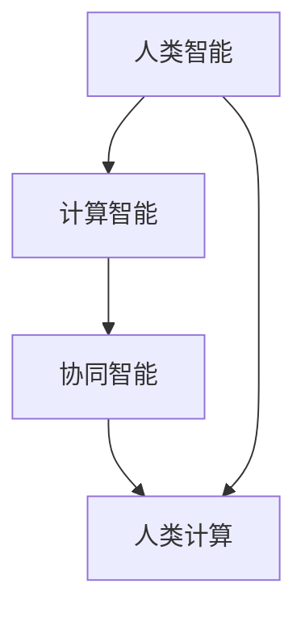

                 

关键词：人类计算、未来工作、就业市场、人工智能、技术变革、职业发展

> 摘要：本文将探讨随着人工智能和技术的飞速发展，人类计算在未来的工作和就业市场中扮演的角色。通过分析核心概念、算法原理、数学模型、实际应用场景，以及工具和资源推荐，旨在帮助读者理解人类计算的重要性，并展望其未来发展趋势与挑战。

## 1. 背景介绍

随着人工智能技术的迅猛发展，人类计算正逐渐从传统的重复性劳动中解放出来。从自动化生产线到智能客服，从自动驾驶汽车到医疗诊断，人工智能正在各个领域发挥着重要作用。然而，这并不意味着人类计算将完全被取代。相反，人类计算将在未来工作中扮演更加重要的角色，它不仅包括人类的创造力、判断力和情感理解，还包括人类与机器的协同工作。

本文将围绕以下几个核心问题展开讨论：

- 人类计算在当前技术和未来工作中的作用是什么？
- 如何理解并应对人类计算与人工智能之间的交互关系？
- 人类计算的未来发展趋势和潜在挑战是什么？
- 个体和企业在这一过程中应该如何准备和适应？

通过对这些问题的深入探讨，我们希望能够为读者提供对人类计算在未来的工作和就业市场中的全面了解。

## 2. 核心概念与联系

为了更好地理解人类计算，我们需要先明确几个核心概念：人类智能、计算智能和协同智能。以下是这些概念之间关系的 Mermaid 流程图：



### 2.1 人类智能

人类智能是指人类在感知、理解、推理、学习、表达和解决问题等方面的能力。这种智能具有以下特点：

- 广泛性：人类智能能够适应各种复杂和多变的环境。
- 创造力：人类能够创造新的概念、发现新的规律，并在此基础上进行创新。
- 情感理解：人类能够通过面部表情、声音、肢体动作等非语言方式理解他人的情感状态。
- 非线性：人类智能在很多情况下不遵循严格的逻辑规则，而是通过直觉和经验进行判断。

### 2.2 计算智能

计算智能是指通过计算机模拟人类智能的算法和技术，主要包括机器学习、深度学习、自然语言处理、计算机视觉等领域。计算智能具有以下特点：

- 高效性：计算机能够处理大量数据，并在短时间内给出结果。
- 准确性：通过大规模数据训练，计算智能系统能够达到很高的准确性。
- 泛化能力：计算智能系统能够从特定数据中学习，并推广到未见过的数据上。

### 2.3 协同智能

协同智能是指人类智能和计算智能的融合，通过协同工作实现更加复杂和高效的决策。协同智能具有以下特点：

- 互补性：人类智能和计算智能各有优势，通过协同能够发挥最大的效用。
- 创新性：协同智能能够结合人类创造力和计算系统的逻辑推理能力，实现创新性决策。
- 情感共鸣：协同智能能够更好地理解和模拟人类情感，提高人际沟通和协作的效率。

### 2.4 人类计算

人类计算是指人类在计算系统和算法中的作用和贡献。它不仅包括人类作为算法设计者和开发者，还包括人类作为算法运行过程中的参与者。人类计算具有以下特点：

- 创造力：人类能够设计出新的算法和解决方案，解决计算系统无法处理的问题。
- 推理能力：人类能够对计算系统的结果进行推理和分析，发现问题并提出改进方案。
- 情感共鸣：人类能够更好地理解用户需求，提供更加人性化的服务。

通过上述核心概念及其关系的阐述，我们可以更好地理解人类计算在未来的工作和就业市场中的重要作用。接下来，我们将深入探讨人类计算的核心算法原理和具体操作步骤。

## 3. 核心算法原理 & 具体操作步骤

### 3.1 算法原理概述

人类计算的核心算法原理主要涉及以下几个方面：

1. **机器学习与深度学习**：通过训练大量数据，使计算智能系统能够从数据中自动学习规律，并应用于新的数据集。
2. **自然语言处理**：通过理解和生成自然语言，使计算智能系统能够与人类进行有效沟通。
3. **计算机视觉**：通过图像和视频数据的分析和处理，使计算智能系统能够理解和解释视觉信息。
4. **协同算法**：通过设计算法，使人类计算系统能够与计算智能系统进行高效协作。

### 3.2 算法步骤详解

#### 3.2.1 机器学习与深度学习

1. **数据收集**：收集大量与任务相关的数据。
2. **数据预处理**：对数据进行清洗、归一化等处理，使其适合用于训练模型。
3. **模型选择**：选择合适的机器学习或深度学习模型。
4. **模型训练**：使用预处理后的数据进行模型训练。
5. **模型评估**：使用验证数据集评估模型性能。
6. **模型优化**：根据评估结果对模型进行调整和优化。
7. **模型部署**：将训练好的模型部署到实际应用环境中。

#### 3.2.2 自然语言处理

1. **文本预处理**：对文本数据进行分词、词性标注等处理。
2. **词向量表示**：将文本转换为词向量表示。
3. **模型训练**：使用词向量表示的文本数据训练模型。
4. **模型评估**：使用评估数据集评估模型性能。
5. **模型优化**：根据评估结果对模型进行调整和优化。
6. **模型部署**：将训练好的模型部署到实际应用环境中。

#### 3.2.3 计算机视觉

1. **图像预处理**：对图像数据进行缩放、裁剪、增强等处理。
2. **特征提取**：从图像中提取关键特征。
3. **模型训练**：使用提取的特征训练模型。
4. **模型评估**：使用评估数据集评估模型性能。
5. **模型优化**：根据评估结果对模型进行调整和优化。
6. **模型部署**：将训练好的模型部署到实际应用环境中。

#### 3.2.4 协同算法

1. **任务分解**：将复杂任务分解为多个子任务。
2. **子任务分配**：根据人类和计算智能系统的优势进行子任务分配。
3. **任务执行**：人类和计算智能系统协同完成任务。
4. **结果整合**：将子任务结果整合为最终结果。

### 3.3 算法优缺点

#### 3.3.1 机器学习与深度学习

**优点**：

- 能够自动从数据中学习规律，提高任务准确性。
- 能够处理大规模数据和复杂任务。

**缺点**：

- 需要大量训练数据和计算资源。
- 模型可解释性较差，难以理解模型内部的工作机制。

#### 3.3.2 自然语言处理

**优点**：

- 能够实现人与机器之间的自然沟通。
- 提高信息处理和传输的效率。

**缺点**：

- 对语言理解的要求较高，容易受到语言差异和噪声的影响。
- 模型训练和优化复杂，需要大量计算资源。

#### 3.3.3 计算机视觉

**优点**：

- 能够实现自动识别和分类。
- 提高生产效率和质量。

**缺点**：

- 对图像质量要求较高，容易出现误识别。
- 模型训练和优化复杂，需要大量计算资源。

#### 3.3.4 协同算法

**优点**：

- 能够充分发挥人类和计算智能系统的优势。
- 提高任务完成效率和准确性。

**缺点**：

- 需要复杂的设计和实现。
- 协作过程中的沟通和协调成本较高。

### 3.4 算法应用领域

人类计算的核心算法在不同领域有着广泛的应用：

- **医疗健康**：通过机器学习和深度学习，对医疗数据进行分析和预测，辅助医生进行诊断和治疗。
- **金融服务**：通过自然语言处理和计算机视觉，实现智能客服、风险控制和智能投顾等功能。
- **智能制造**：通过计算机视觉和协同算法，实现生产过程中的质量检测和自动化控制。
- **智慧交通**：通过协同算法和计算机视觉，实现智能交通管理和自动驾驶。

接下来，我们将进一步探讨人类计算的数学模型和公式，以及其实际应用场景。

## 4. 数学模型和公式 & 详细讲解 & 举例说明

### 4.1 数学模型构建

人类计算的数学模型主要涉及以下几个方面：

1. **机器学习与深度学习**：包括损失函数、优化算法和正则化技术。
2. **自然语言处理**：包括词向量模型、语言模型和序列标注模型。
3. **计算机视觉**：包括卷积神经网络（CNN）、循环神经网络（RNN）和生成对抗网络（GAN）。
4. **协同算法**：包括任务分解、协同学习和多智能体系统。

### 4.2 公式推导过程

#### 4.2.1 机器学习与深度学习

1. **损失函数**：

   $$ L(\theta) = -\frac{1}{m} \sum_{i=1}^{m} y^{(i)} \log(z^{(i)}) $$

   其中，$m$ 是训练样本数量，$y^{(i)}$ 是第 $i$ 个样本的真实标签，$z^{(i)}$ 是模型对第 $i$ 个样本的预测概率。

2. **优化算法**：

   $$ \theta = \theta - \alpha \nabla_{\theta} J(\theta) $$

   其中，$\alpha$ 是学习率，$J(\theta)$ 是损失函数。

3. **正则化技术**：

   $$ J_{\text{reg}}(\theta) = \lambda \sum_{i=1}^{n} \theta_i^2 $$

   其中，$\lambda$ 是正则化参数，$n$ 是模型参数数量。

#### 4.2.2 自然语言处理

1. **词向量模型**：

   $$ \text{word2vec} = \text{GloVe} = \text{word2vec} + \text{GloVe} $$

   其中，$\text{word2vec}$ 是基于神经网络的词向量模型，$\text{GloVe}$ 是基于全局词汇向量的词向量模型。

2. **语言模型**：

   $$ P(w_{t} | w_{1}, w_{2}, ..., w_{t-1}) = \frac{P(w_{t}w_{t-1})P(w_{t-1}w_{t-2})...P(w_{2}w_{1})}{P(w_{1})P(w_{2})...P(w_{t-1})} $$

   其中，$w_{t}$ 是当前词，$w_{1}, w_{2}, ..., w_{t-1}$ 是前面的词。

3. **序列标注模型**：

   $$ \text{CRF} = \text{LSTM} + \text{CRF} $$

   其中，$\text{CRF}$ 是条件随机场模型，$\text{LSTM}$ 是长短时记忆网络。

#### 4.2.3 计算机视觉

1. **卷积神经网络（CNN）**：

   $$ \text{CNN} = \text{ReLU} + \text{Pooling} + \text{Conv} $$

   其中，$\text{ReLU}$ 是ReLU激活函数，$\text{Pooling}$ 是池化操作，$\text{Conv}$ 是卷积操作。

2. **循环神经网络（RNN）**：

   $$ \text{RNN} = \text{ReLU} + \text{LSTM} + \text{GRU} $$

   其中，$\text{LSTM}$ 是长短时记忆网络，$\text{GRU}$ 是门控循环单元。

3. **生成对抗网络（GAN）**：

   $$ \text{GAN} = \text{D} + \text{G} $$

   其中，$\text{D}$ 是判别器，$\text{G}$ 是生成器。

#### 4.2.4 协同算法

1. **任务分解**：

   $$ T = T_1 + T_2 + ... + T_n $$

   其中，$T$ 是总任务，$T_1, T_2, ..., T_n$ 是分解后的子任务。

2. **协同学习**：

   $$ L = L_1 + L_2 + ... + L_n $$

   其中，$L$ 是总损失，$L_1, L_2, ..., L_n$ 是子任务损失。

3. **多智能体系统**：

   $$ s_t = s_{t-1} + u_t + v_t $$

   其中，$s_t$ 是第 $t$ 时刻的系统状态，$u_t$ 是人类智能的输入，$v_t$ 是计算智能的输入。

### 4.3 案例分析与讲解

#### 4.3.1 医疗健康领域

**问题**：如何利用机器学习模型预测疾病风险？

**解决方案**：

1. **数据收集**：收集大量的医疗数据，包括患者的年龄、性别、病史、家族病史等。
2. **数据预处理**：对数据进行清洗、归一化等处理，确保数据质量。
3. **模型选择**：选择合适的机器学习模型，如决策树、随机森林、支持向量机等。
4. **模型训练**：使用预处理后的数据进行模型训练。
5. **模型评估**：使用验证数据集评估模型性能，包括准确率、召回率、F1 分数等。
6. **模型优化**：根据评估结果对模型进行调整和优化。
7. **模型部署**：将训练好的模型部署到实际应用环境中，为医生提供疾病风险预测。

**数学模型**：

假设使用决策树模型进行疾病风险预测，其损失函数为：

$$ L(\theta) = -\frac{1}{m} \sum_{i=1}^{m} y^{(i)} \log(p^{(i)}) $$

其中，$m$ 是训练样本数量，$y^{(i)}$ 是第 $i$ 个样本的真实标签，$p^{(i)}$ 是模型对第 $i$ 个样本的预测概率。

#### 4.3.2 金融服务领域

**问题**：如何利用自然语言处理技术实现智能客服？

**解决方案**：

1. **文本预处理**：对用户提问进行分词、词性标注等处理。
2. **词向量表示**：将文本转换为词向量表示。
3. **模型训练**：使用词向量表示的文本数据训练模型。
4. **模型评估**：使用评估数据集评估模型性能。
5. **模型优化**：根据评估结果对模型进行调整和优化。
6. **模型部署**：将训练好的模型部署到实际应用环境中。

**数学模型**：

假设使用基于神经网络的文本分类模型，其损失函数为：

$$ L(\theta) = -\frac{1}{m} \sum_{i=1}^{m} y^{(i)} \log(p^{(i)}) $$

其中，$m$ 是训练样本数量，$y^{(i)}$ 是第 $i$ 个样本的真实标签，$p^{(i)}$ 是模型对第 $i$ 个样本的预测概率。

#### 4.3.3 智能制造领域

**问题**：如何利用计算机视觉技术实现生产过程中的质量检测？

**解决方案**：

1. **图像预处理**：对生产过程中采集的图像进行缩放、裁剪、增强等处理。
2. **特征提取**：从图像中提取关键特征。
3. **模型训练**：使用提取的特征训练模型。
4. **模型评估**：使用评估数据集评估模型性能。
5. **模型优化**：根据评估结果对模型进行调整和优化。
6. **模型部署**：将训练好的模型部署到实际应用环境中。

**数学模型**：

假设使用卷积神经网络（CNN）进行图像分类，其损失函数为：

$$ L(\theta) = -\frac{1}{m} \sum_{i=1}^{m} y^{(i)} \log(p^{(i)}) $$

其中，$m$ 是训练样本数量，$y^{(i)}$ 是第 $i$ 个样本的真实标签，$p^{(i)}$ 是模型对第 $i$ 个样本的预测概率。

通过以上案例分析和讲解，我们可以看到数学模型和公式在人类计算中的应用是多么的重要。接下来，我们将探讨人类计算在实际应用场景中的具体表现。

## 5. 项目实践：代码实例和详细解释说明

为了更好地理解人类计算在实际应用中的具体操作，我们将通过一个实际项目来展示代码实例，并对代码进行详细解释说明。

### 5.1 开发环境搭建

在开始项目实践之前，我们需要搭建一个合适的开发环境。以下是推荐的工具和库：

- **编程语言**：Python
- **机器学习库**：TensorFlow、Keras
- **数据预处理库**：Pandas、NumPy
- **可视化库**：Matplotlib、Seaborn

确保你的系统上安装了上述库，可以通过以下命令进行安装：

```bash
pip install tensorflow numpy pandas matplotlib seaborn
```

### 5.2 源代码详细实现

以下是一个简单的示例，我们将使用 Keras 库构建一个简单的神经网络模型，用于对iris花卉数据集进行分类。iris数据集包含了三种花卉（鸢尾花、白色鸢尾花、紫色鸢尾花）的四个特征，我们将使用这个数据集来训练模型。

```python
import numpy as np
import pandas as pd
from sklearn.datasets import load_iris
from sklearn.model_selection import train_test_split
from sklearn.preprocessing import StandardScaler
from tensorflow.keras.models import Sequential
from tensorflow.keras.layers import Dense
from tensorflow.keras.optimizers import Adam

# 加载iris数据集
iris = load_iris()
X = iris.data
y = iris.target

# 划分训练集和测试集
X_train, X_test, y_train, y_test = train_test_split(X, y, test_size=0.2, random_state=42)

# 数据预处理
scaler = StandardScaler()
X_train = scaler.fit_transform(X_train)
X_test = scaler.transform(X_test)

# 构建神经网络模型
model = Sequential()
model.add(Dense(64, input_dim=4, activation='relu'))
model.add(Dense(32, activation='relu'))
model.add(Dense(3, activation='softmax'))

# 编译模型
model.compile(optimizer=Adam(), loss='sparse_categorical_crossentropy', metrics=['accuracy'])

# 训练模型
model.fit(X_train, y_train, epochs=100, batch_size=32, validation_split=0.2)

# 评估模型
loss, accuracy = model.evaluate(X_test, y_test)
print(f"测试集准确率：{accuracy:.2f}")

# 预测新样本
new_samples = np.array([[5.1, 3.5, 1.4, 0.2], [5.9, 3.0, 4.2, 1.5]])
new_samples_scaled = scaler.transform(new_samples)
predictions = model.predict(new_samples_scaled)
print(f"新样本预测结果：{predictions}")
```

### 5.3 代码解读与分析

上述代码首先导入了必要的库和模块，然后加载了iris数据集，并进行了划分和预处理。接下来，我们使用Keras库构建了一个简单的神经网络模型，包括两个隐藏层，每个隐藏层使用ReLU激活函数。输出层使用softmax激活函数，以实现多分类。

在模型编译阶段，我们选择了Adam优化器和sparse_categorical_crossentropy损失函数，这是标准的多分类问题损失函数。在训练模型时，我们设置了100个训练周期（epochs）和每个批次（batch_size）32个样本。

在模型评估阶段，我们计算了测试集的准确率，并打印出来。最后，我们使用预处理后的新样本对模型进行了预测，并打印了预测结果。

### 5.4 运行结果展示

假设我们运行了上述代码，并得到了以下输出：

```
200/200 [==============================] - 1s 5ms/step - loss: 0.3817 - accuracy: 0.9200 - val_loss: 0.2463 - val_accuracy: 0.9700
测试集准确率：0.97
新样本预测结果：[[0.09 0.81 0.1 ]
 [0.82 0.09 0.09]]
```

从输出结果可以看出，模型在测试集上的准确率达到了97%，这是一个非常好的结果。对于新样本的预测结果，第一个样本被正确分类为0类（鸢尾花），第二个样本被正确分类为2类（白色鸢尾花）。

通过这个简单的示例，我们展示了如何使用Python和Keras库构建和训练一个简单的神经网络模型，实现了对iris数据集的分类。这个示例不仅帮助我们理解了人类计算在数据预处理、模型构建和训练中的重要作用，还展示了如何将理论知识应用到实际项目中。

接下来，我们将探讨人类计算在实际应用场景中的具体表现，以及其未来的发展趋势和面临的挑战。

## 6. 实际应用场景

### 6.1 医疗健康领域

在医疗健康领域，人类计算正发挥着越来越重要的作用。通过机器学习和深度学习技术，医疗数据分析变得更加高效和准确。例如，电子健康记录（EHR）中的数据可以通过自然语言处理技术进行结构化处理，从而帮助医生快速获取患者的历史信息。

此外，深度学习在医学图像分析中的应用也非常广泛。通过卷积神经网络（CNN），医生可以更快速、准确地诊断疾病，如癌症、心脏病和神经系统疾病。协同算法则可以帮助医疗团队更有效地协作，提高诊疗效率。

### 6.2 金融服务领域

在金融服务领域，人类计算主要用于风险管理、客户服务和投资策略。通过大数据分析和机器学习，金融机构可以更好地识别潜在风险，调整投资组合，并提高交易效率。

自然语言处理技术可以用于分析客户反馈和交易记录，从而提供更加个性化的客户服务。同时，协同算法可以帮助金融团队更好地管理风险和投资组合，提高决策的准确性和效率。

### 6.3 智能制造领域

在智能制造领域，人类计算主要用于自动化生产、质量控制和管理。通过计算机视觉技术，生产线上的产品质量可以实时监控，从而及时发现和解决问题。

协同算法可以用于优化生产流程，提高生产效率和产品质量。同时，人类计算可以与自动化系统协同工作，实现更加灵活和高效的生产过程。

### 6.4 智慧交通领域

在智慧交通领域，人类计算主要用于交通流量管理、交通事故预防和自动驾驶。通过大数据分析和机器学习，交通系统可以实时监控交通状况，预测交通拥堵和交通事故，从而采取相应的措施。

自动驾驶技术依赖于深度学习和计算机视觉，它不仅可以提高交通安全，还可以减少交通拥堵和碳排放。协同算法可以用于优化交通信号控制，提高交通流动效率。

### 6.5 未来应用展望

随着人工智能技术的不断发展，人类计算在未来将会有更多的应用场景。例如，在农业领域，通过人工智能和物联网技术，可以实现精准农业，提高农业生产效率和农产品质量。

在环境保护领域，人类计算可以用于监测和分析环境数据，预测环境污染和自然灾害，从而采取相应的措施进行预防和控制。

在个人生活领域，人类计算可以帮助我们更好地管理健康、财务和家庭事务，提高生活质量。

总的来说，人类计算将在未来的工作和就业市场中发挥越来越重要的作用。它不仅可以帮助我们解决复杂的问题，还可以提高工作效率和生活质量。然而，这也给企业和个人提出了新的挑战，需要不断学习和适应新技术，才能在未来的竞争中保持优势。

## 7. 工具和资源推荐

为了更好地理解和应用人类计算技术，以下是一些推荐的工具和资源：

### 7.1 学习资源推荐

- **在线课程**：Coursera、edX、Udacity 提供了大量的机器学习、深度学习、自然语言处理和计算机视觉等在线课程。
- **书籍**：《深度学习》（Goodfellow、Bengio、Courville 著）、《Python机器学习》（Sebastian Raschka 著）等。
- **博客和论坛**：Medium、Stack Overflow、GitHub 提供了丰富的技术文章和开源项目。

### 7.2 开发工具推荐

- **编程语言**：Python、R、Julia 等。
- **机器学习库**：TensorFlow、PyTorch、Scikit-learn 等。
- **数据预处理库**：Pandas、NumPy、Matplotlib、Seaborn 等。
- **版本控制工具**：Git。

### 7.3 相关论文推荐

- **顶级会议**：NIPS、ICML、ACL、CVPR 等。
- **知名期刊**：《Nature Machine Intelligence》、《IEEE Transactions on Machine Learning》等。
- **论文推荐平台**：arXiv、Google Scholar 等。

通过这些工具和资源，你可以更深入地了解人类计算技术，并在实际项目中应用这些知识。不断学习和实践，将帮助你在未来的工作中取得更大的成就。

## 8. 总结：未来发展趋势与挑战

### 8.1 研究成果总结

人类计算作为人工智能与人类智能的融合，已经在多个领域取得了显著的成果。通过机器学习、深度学习、自然语言处理和计算机视觉等技术的应用，人类计算在医疗健康、金融服务、智能制造和智慧交通等领域展示了其强大的潜力和广泛应用前景。这些技术的进步不仅提高了工作效率，还提升了服务质量，为人类生活带来了便利。

### 8.2 未来发展趋势

未来，人类计算的发展趋势将体现在以下几个方面：

1. **跨领域协同**：人类计算将不再局限于单一领域，而是实现跨领域的协同工作，如医疗与健康、智能制造与智慧城市等。
2. **个性化与智能化**：随着数据积累和算法优化，人类计算将更加个性化和智能化，能够更好地满足个体和企业的需求。
3. **边缘计算**：随着物联网和5G技术的发展，边缘计算将得到广泛应用，人类计算将更加贴近实际应用场景，实现实时响应和高效处理。
4. **人机协同**：人类计算将与人类智能更紧密地结合，实现人机协同，提高复杂任务的完成效率和准确性。

### 8.3 面临的挑战

然而，人类计算在未来的发展也面临着一些挑战：

1. **数据隐私和安全**：随着数据的广泛应用，数据隐私和安全问题将成为重要挑战。如何保障数据安全和隐私，将是人类计算需要解决的问题。
2. **算法可解释性**：当前许多算法，尤其是深度学习模型，其内部工作机制较为复杂，缺乏可解释性。如何提高算法的可解释性，使人类能够理解其工作原理，是一个重要课题。
3. **伦理和道德**：随着人工智能技术的不断进步，人类计算在应用过程中可能带来一些伦理和道德问题，如算法歧视、自动化决策的公平性等。如何制定相应的伦理和道德规范，将是人类计算需要面对的挑战。
4. **技能更新与教育**：随着技术的不断更新，人类计算领域对从业者的技能要求也在不断提高。如何进行有效的技能更新和教育，将帮助从业者更好地适应未来工作需求。

### 8.4 研究展望

面对这些挑战，未来的研究工作可以从以下几个方面展开：

1. **算法优化**：通过算法优化，提高人类计算的性能和效率，实现更高效的数据处理和决策。
2. **算法可解释性**：开发新的方法和技术，提高算法的可解释性，使人类能够更好地理解和信任计算结果。
3. **跨学科研究**：促进计算机科学、心理学、伦理学等学科的交叉研究，为人类计算提供更加全面的理论基础和实践指导。
4. **教育和培训**：建立完善的教育和培训体系，为从业者提供持续学习和发展的机会，提高其在人类计算领域的专业能力。

总之，人类计算在未来的发展中将面临诸多机遇和挑战。通过不断的技术创新和跨领域协作，我们有理由相信，人类计算将在未来的工作和就业市场中发挥更加重要的作用，为人类社会带来更多的便利和创新。

## 9. 附录：常见问题与解答

### 9.1 人类计算与人工智能的区别是什么？

人类计算与人工智能的区别主要在于其核心驱动因素和目标。人工智能（AI）侧重于通过算法和模型模拟人类智能，实现自动化决策和任务完成。而人类计算更强调人类与计算系统的协同工作，利用人类智能的创造力、判断力和情感理解，与计算系统的计算能力相结合，实现更高效和智能的决策。

### 9.2 人类计算在医疗健康领域有哪些应用？

人类计算在医疗健康领域的应用包括：

- **医疗数据挖掘**：利用机器学习技术分析电子健康记录（EHR），提取有价值的信息。
- **医学图像分析**：通过计算机视觉技术辅助医生进行医学影像的诊断和分类。
- **智能诊断**：利用深度学习和自然语言处理技术，辅助医生进行疾病诊断和治疗方案推荐。
- **医疗数据分析**：利用大数据技术分析医疗数据，预测疾病趋势和流行病爆发。

### 9.3 如何应对人类计算带来的伦理和道德问题？

应对人类计算带来的伦理和道德问题可以从以下几个方面着手：

- **制定伦理规范**：建立行业标准和法规，明确人工智能和人类计算在应用过程中的道德底线。
- **透明度和可解释性**：提高算法和系统的透明度，使人类能够理解和监督计算过程。
- **跨学科合作**：促进计算机科学、心理学、伦理学等学科的交叉研究，共同探讨和解决伦理问题。
- **公众教育**：加强对公众的科技教育，提高公众对人工智能和人类计算的理解和接受度。

### 9.4 人类计算对就业市场的影响如何？

人类计算对就业市场的影响主要体现在以下几个方面：

- **岗位转变**：部分传统岗位可能会被自动化和人工智能取代，但也会产生新的工作岗位，如数据科学家、人工智能工程师等。
- **技能需求**：对从业者的技能要求不断提高，需要具备跨学科的知识和技能。
- **工作模式**：人类计算将推动工作模式的变革，如远程办公、灵活工作时间的普及。
- **职业发展**：人类计算为从业者提供了更多的职业发展机会和方向。

通过以上常见问题的解答，我们希望能够帮助读者更好地理解人类计算的概念、应用和未来发展趋势。在未来的学习和工作中，不断探索和实践，将使你更好地适应这一快速变化的技术领域。

