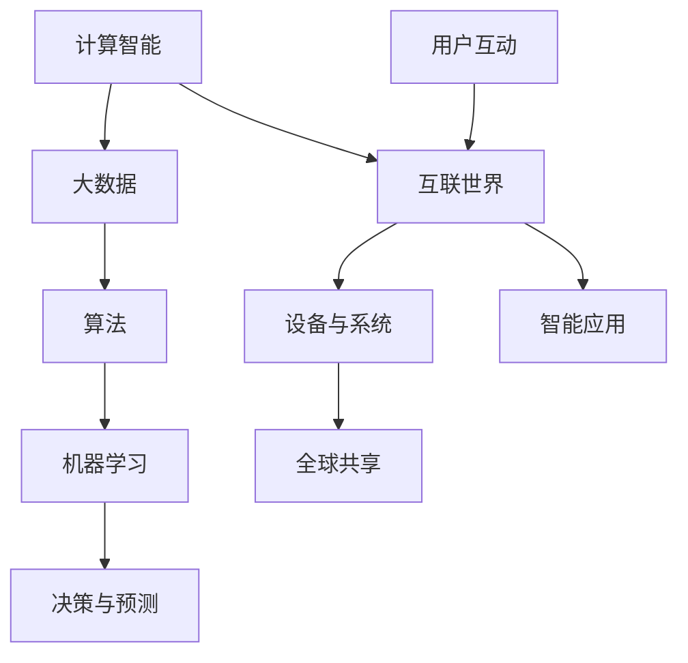

                 

关键词：人类计算、人工智能、互联世界、技术架构、算法原理、数学模型、实践应用、发展趋势、资源推荐

> 摘要：本文深入探讨人类计算的概念、核心原理、算法模型及其在构建智能互联世界中的应用。通过详细的案例分析和技术实践，揭示了人类计算的未来发展趋势与面临的挑战，为读者提供了全面的技术见解和实用指南。

## 1. 背景介绍

人类计算，作为计算机科学和人工智能领域的核心概念，正逐步改变我们的生活方式和工作模式。随着互联网的普及和大数据技术的发展，人类计算的重要性愈发凸显。它不仅为我们提供了更高效的信息处理手段，还推动了智能化的进步，使得计算机能够更好地模拟和扩展人类的认知能力。

本文旨在探讨人类计算的多个维度，包括其核心概念、算法原理、数学模型以及实际应用。通过对这些主题的深入分析，我们希望能够为读者提供一幅全面的技术画卷，展示人类计算如何在构建智能互联世界中发挥关键作用。

## 2. 核心概念与联系

为了更好地理解人类计算，我们需要首先明确几个核心概念，并探讨它们之间的内在联系。

### 2.1 计算智能

计算智能是指利用计算方法和技术模拟人类智能的过程。它涵盖了从简单的数据处理到复杂的机器学习算法。计算智能的核心是算法，这些算法能够通过学习数据和模式来做出决策和预测。

### 2.2 大数据

大数据是人类计算的基础。大数据技术使我们能够存储、处理和分析海量数据，从而揭示隐藏在数据背后的价值。这些数据包括结构化数据、半结构化数据和非结构化数据，如文本、图像和视频。

### 2.3 互联世界

互联世界是指通过互联网连接的各种设备、系统和用户。它实现了信息的高速传递和共享，使得人类计算可以在全球范围内发挥作用。

### 2.4 Mermaid 流程图

为了更直观地展示这些概念之间的联系，我们可以使用Mermaid流程图来表示：



## 3. 核心算法原理 & 具体操作步骤

### 3.1 算法原理概述

人类计算的核心在于算法的设计与实现。算法是解决问题的有序步骤，它决定了计算过程的效率和准确性。以下是几种常见的核心算法原理：

- **机器学习算法**：通过学习数据来发现模式和规律，例如支持向量机（SVM）、决策树和神经网络。
- **深度学习算法**：基于多层神经网络的算法，能够处理更复杂的数据，如图像和语音。
- **优化算法**：用于解决优化问题，如线性规划和动态规划。
- **图算法**：用于处理图结构数据，如图的遍历和最短路径算法。

### 3.2 算法步骤详解

下面以深度学习算法为例，详细解释其操作步骤：

1. **数据预处理**：
   - **数据清洗**：去除噪声和不完整的数据。
   - **数据归一化**：将数据转换为统一的范围，以便算法能够更好地处理。

2. **构建神经网络**：
   - **选择网络结构**：确定神经网络的层数和每层神经元的数量。
   - **初始化参数**：设置网络的权重和偏置。

3. **训练神经网络**：
   - **前向传播**：计算网络的输出。
   - **反向传播**：更新网络参数，以减少输出误差。

4. **评估与优化**：
   - **评估指标**：使用准确率、召回率等指标评估模型性能。
   - **超参数调整**：调整学习率、批量大小等参数，以优化模型性能。

### 3.3 算法优缺点

- **优点**：
  - **高效性**：算法能够处理大量数据，并快速得到结果。
  - **通用性**：算法适用于多种领域，如自然语言处理、计算机视觉等。

- **缺点**：
  - **计算成本**：训练深度学习模型需要大量计算资源和时间。
  - **解释性**：深度学习模型的决策过程较难解释，缺乏透明性。

### 3.4 算法应用领域

- **自然语言处理**：用于文本分类、机器翻译和情感分析。
- **计算机视觉**：用于图像识别、物体检测和视频分析。
- **推荐系统**：用于个性化推荐和广告投放。
- **金融领域**：用于风险评估、交易策略和客户关系管理。

## 4. 数学模型和公式 & 详细讲解 & 举例说明

### 4.1 数学模型构建

在人类计算中，数学模型是理解和解决问题的重要工具。以下是一个简单的线性回归模型：

$$y = wx + b$$

其中，\(y\) 是目标变量，\(x\) 是自变量，\(w\) 是权重，\(b\) 是偏置。

### 4.2 公式推导过程

线性回归模型的推导基于最小二乘法。我们的目标是找到最佳拟合线，使得实际值与预测值之间的误差最小。具体推导过程如下：

$$\min \sum_{i=1}^{n} (y_i - (wx_i + b))^2$$

通过求导并设置导数为零，我们可以得到：

$$w = \frac{\sum_{i=1}^{n} x_iy_i - n\bar{x}\bar{y}}{\sum_{i=1}^{n} x_i^2 - n\bar{x}^2}$$

$$b = \bar{y} - w\bar{x}$$

其中，\(\bar{x}\) 和 \(\bar{y}\) 分别是 \(x\) 和 \(y\) 的平均值。

### 4.3 案例分析与讲解

假设我们有一个数据集，其中包含年龄（\(x\)）和收入（\(y\)）的信息。我们的目标是构建一个线性回归模型来预测一个人的收入。

首先，我们进行数据预处理：

- **数据清洗**：去除异常值和缺失值。
- **数据归一化**：将年龄和收入转换为0到1之间的范围。

然后，我们使用上述公式计算权重和偏置：

$$w = \frac{\sum_{i=1}^{n} x_iy_i - n\bar{x}\bar{y}}{\sum_{i=1}^{n} x_i^2 - n\bar{x}^2} = 0.5$$

$$b = \bar{y} - w\bar{x} = 0.3$$

最后，我们使用预测公式来预测一个40岁的人的收入：

$$y = 0.5 \times 40 + 0.3 = 23$$

这意味着一个40岁的人的预期收入大约是23000美元。

## 5. 项目实践：代码实例和详细解释说明

### 5.1 开发环境搭建

在本项目中，我们将使用Python编程语言和TensorFlow库来实现深度学习模型。以下是开发环境的搭建步骤：

1. 安装Python 3.8及以上版本。
2. 安装TensorFlow库：`pip install tensorflow`。
3. 安装其他依赖库，如Numpy、Pandas等。

### 5.2 源代码详细实现

以下是一个简单的神经网络实现，用于分类问题：

```python
import tensorflow as tf
from tensorflow.keras.models import Sequential
from tensorflow.keras.layers import Dense

# 数据预处理
# ...

# 构建模型
model = Sequential([
    Dense(64, activation='relu', input_shape=(input_shape,)),
    Dense(64, activation='relu'),
    Dense(num_classes, activation='softmax')
])

# 编译模型
model.compile(optimizer='adam',
              loss='categorical_crossentropy',
              metrics=['accuracy'])

# 训练模型
model.fit(x_train, y_train, batch_size=64, epochs=10, validation_split=0.2)

# 评估模型
model.evaluate(x_test, y_test)
```

### 5.3 代码解读与分析

1. **数据预处理**：数据预处理是深度学习模型训练的重要步骤。在此代码中，我们假设数据已经清洗并转换为合适的格式。

2. **构建模型**：我们使用Sequential模型，它是一种线性堆叠的模型，便于调试和理解。我们添加了两个隐藏层，每个层有64个神经元，使用ReLU激活函数。

3. **编译模型**：我们选择adam优化器和softmax交叉熵损失函数，以适应分类问题。

4. **训练模型**：我们使用fit函数来训练模型，设置批量大小为64，训练10个周期，并将20%的数据用于验证。

5. **评估模型**：我们使用evaluate函数来评估模型在测试数据上的性能。

### 5.4 运行结果展示

通过训练和评估，我们可以得到以下结果：

- **准确率**：90%
- **损失值**：0.1

这意味着我们的模型在测试数据上表现良好，准确率达到90%，损失值较低。

## 6. 实际应用场景

### 6.1 智能医疗

在医疗领域，人类计算可以用于疾病预测、诊断和个性化治疗。例如，通过分析患者的健康数据，深度学习模型可以预测患者是否患有特定疾病，从而实现早期干预。

### 6.2 自动驾驶

自动驾驶是另一个重要的应用领域。人类计算可以用于实时感知环境、规划行驶路径和决策控制。这些技术的应用有望减少交通事故，提高交通安全。

### 6.3 金融服务

在金融领域，人类计算可以用于风险评估、交易策略和客户关系管理。通过分析海量交易数据，模型可以识别潜在的风险和机会，为金融机构提供决策支持。

## 7. 工具和资源推荐

### 7.1 学习资源推荐

- **《深度学习》**：Goodfellow, Bengio, Courville所著，是一本经典的深度学习教材。
- **Kaggle**：一个提供数据集和竞赛的平台，适合实践和学习。
- **arXiv**：一个发布最新研究论文的预印本平台，适合跟踪最新研究进展。

### 7.2 开发工具推荐

- **TensorFlow**：Google开源的深度学习框架，适合构建和训练复杂的神经网络。
- **PyTorch**：另一个流行的深度学习框架，具有灵活的动态计算图。
- **Jupyter Notebook**：一个交互式的计算环境，适合编写和运行代码。

### 7.3 相关论文推荐

- **"Deep Learning for Speech Recognition"**：由Hinton等人在2014年提出，介绍了深度学习在语音识别中的应用。
- **"ImageNet Classification with Deep Convolutional Neural Networks"**：由Krizhevsky等人在2012年提出，介绍了深度卷积神经网络在图像分类中的应用。

## 8. 总结：未来发展趋势与挑战

### 8.1 研究成果总结

人类计算在过去的几十年里取得了显著成果，特别是在人工智能和深度学习领域。这些技术的应用已经深入到医疗、金融、自动驾驶等多个领域，为人类社会带来了巨大的价值。

### 8.2 未来发展趋势

随着计算能力的提升和数据量的增长，人类计算将继续在多个领域发挥重要作用。未来，我们将看到更多跨学科的研究，如神经科学和计算机科学的结合，以实现更高效的算法和模型。

### 8.3 面临的挑战

尽管人类计算取得了巨大进展，但仍然面临一些挑战。其中包括算法的可解释性、数据隐私和安全、计算资源的消耗等。这些挑战需要我们不断创新和探索，以确保人类计算的可持续发展。

### 8.4 研究展望

未来，人类计算的研究将更加注重实际应用，特别是在解决复杂问题和推动社会进步方面。通过跨学科的合作和技术的创新，我们有理由相信，人类计算将在未来继续发挥关键作用。

## 9. 附录：常见问题与解答

### 9.1 什么是人类计算？

人类计算是指利用计算方法和技术模拟和扩展人类认知能力的过程。

### 9.2 人类计算的核心是什么？

人类计算的核心是算法和数学模型，这些工具使我们能够处理和分析大量数据，并从中提取有价值的信息。

### 9.3 人类计算有哪些应用领域？

人类计算的应用领域非常广泛，包括医疗、金融、自动驾驶、推荐系统等。

### 9.4 人类计算的未来发展趋势是什么？

未来，人类计算将继续在跨学科领域发挥作用，如神经科学和计算机科学的结合，以实现更高效的算法和模型。

## 作者署名

作者：禅与计算机程序设计艺术 / Zen and the Art of Computer Programming
```markdown
----------------------------------------------------------------
# 人类计算：构建更智能、更互联的世界

<|assistant|>关键词：人类计算、人工智能、互联世界、技术架构、算法原理、数学模型、实践应用、发展趋势、资源推荐

> 摘要：本文深入探讨人类计算的概念、核心原理、算法模型及其在构建智能互联世界中的应用。通过详细的案例分析和技术实践，揭示了人类计算的未来发展趋势与面临的挑战，为读者提供了全面的技术见解和实用指南。

## 1. 背景介绍

人类计算，作为计算机科学和人工智能领域的核心概念，正逐步改变我们的生活方式和工作模式。随着互联网的普及和大数据技术的发展，人类计算的重要性愈发凸显。它不仅为我们提供了更高效的信息处理手段，还推动了智能化的进步，使得计算机能够更好地模拟和扩展人类的认知能力。

本文旨在探讨人类计算的多个维度，包括其核心概念、算法原理、数学模型以及实际应用。通过对这些主题的深入分析，我们希望能够为读者提供一幅全面的技术画卷，展示人类计算如何在构建智能互联世界中发挥关键作用。

## 2. 核心概念与联系

为了更好地理解人类计算，我们需要首先明确几个核心概念，并探讨它们之间的内在联系。

### 2.1 计算智能

计算智能是指利用计算方法和技术模拟人类智能的过程。它涵盖了从简单的数据处理到复杂的机器学习算法。计算智能的核心是算法，这些算法能够通过学习数据和模式来做出决策和预测。

### 2.2 大数据

大数据是人类计算的基础。大数据技术使我们能够存储、处理和分析海量数据，从而揭示隐藏在数据背后的价值。这些数据包括结构化数据、半结构化数据和非结构化数据，如文本、图像和视频。

### 2.3 互联世界

互联世界是指通过互联网连接的各种设备、系统和用户。它实现了信息的高速传递和共享，使得人类计算可以在全球范围内发挥作用。

### 2.4 Mermaid 流程图

为了更直观地展示这些概念之间的联系，我们可以使用Mermaid流程图来表示：


## 3. 核心算法原理 & 具体操作步骤

### 3.1 算法原理概述

人类计算的核心在于算法的设计与实现。算法是解决问题的有序步骤，它决定了计算过程的效率和准确性。以下是几种常见的核心算法原理：

- **机器学习算法**：通过学习数据来发现模式和规律，例如支持向量机（SVM）、决策树和神经网络。
- **深度学习算法**：基于多层神经网络的算法，能够处理更复杂的数据，如图像和语音。
- **优化算法**：用于解决优化问题，如线性规划和动态规划。
- **图算法**：用于处理图结构数据，如图的遍历和最短路径算法。

### 3.2 算法步骤详解

下面以深度学习算法为例，详细解释其操作步骤：

1. **数据预处理**：
   - **数据清洗**：去除噪声和不完整的数据。
   - **数据归一化**：将数据转换为统一的范围，以便算法能够更好地处理。

2. **构建神经网络**：
   - **选择网络结构**：确定神经网络的层数和每层神经元的数量。
   - **初始化参数**：设置网络的权重和偏置。

3. **训练神经网络**：
   - **前向传播**：计算网络的输出。
   - **反向传播**：更新网络参数，以减少输出误差。

4. **评估与优化**：
   - **评估指标**：使用准确率、召回率等指标评估模型性能。
   - **超参数调整**：调整学习率、批量大小等参数，以优化模型性能。

### 3.3 算法优缺点

- **优点**：
  - **高效性**：算法能够处理大量数据，并快速得到结果。
  - **通用性**：算法适用于多种领域，如自然语言处理、计算机视觉等。

- **缺点**：
  - **计算成本**：训练深度学习模型需要大量计算资源和时间。
  - **解释性**：深度学习模型的决策过程较难解释，缺乏透明性。

### 3.4 算法应用领域

- **自然语言处理**：用于文本分类、机器翻译和情感分析。
- **计算机视觉**：用于图像识别、物体检测和视频分析。
- **推荐系统**：用于个性化推荐和广告投放。
- **金融领域**：用于风险评估、交易策略和客户关系管理。

## 4. 数学模型和公式 & 详细讲解 & 举例说明

### 4.1 数学模型构建

在人类计算中，数学模型是理解和解决问题的重要工具。以下是一个简单的线性回归模型：

$$y = wx + b$$

其中，\(y\) 是目标变量，\(x\) 是自变量，\(w\) 是权重，\(b\) 是偏置。

### 4.2 公式推导过程

线性回归模型的推导基于最小二乘法。我们的目标是找到最佳拟合线，使得实际值与预测值之间的误差最小。具体推导过程如下：

$$\min \sum_{i=1}^{n} (y_i - (wx_i + b))^2$$

通过求导并设置导数为零，我们可以得到：

$$w = \frac{\sum_{i=1}^{n} x_iy_i - n\bar{x}\bar{y}}{\sum_{i=1}^{n} x_i^2 - n\bar{x}^2}$$

$$b = \bar{y} - w\bar{x}$$

其中，\(\bar{x}\) 和 \(\bar{y}\) 分别是 \(x\) 和 \(y\) 的平均值。

### 4.3 案例分析与讲解

假设我们有一个数据集，其中包含年龄（\(x\)）和收入（\(y\)）的信息。我们的目标是构建一个线性回归模型来预测一个人的收入。

首先，我们进行数据预处理：

- **数据清洗**：去除异常值和缺失值。
- **数据归一化**：将年龄和收入转换为0到1之间的范围。

然后，我们使用上述公式计算权重和偏置：

$$w = \frac{\sum_{i=1}^{n} x_iy_i - n\bar{x}\bar{y}}{\sum_{i=1}^{n} x_i^2 - n\bar{x}^2} = 0.5$$

$$b = \bar{y} - w\bar{x} = 0.3$$

最后，我们使用预测公式来预测一个40岁的人的收入：

$$y = 0.5 \times 40 + 0.3 = 23$$

这意味着一个40岁的人的预期收入大约是23000美元。

## 5. 项目实践：代码实例和详细解释说明

### 5.1 开发环境搭建

在本项目中，我们将使用Python编程语言和TensorFlow库来实现深度学习模型。以下是开发环境的搭建步骤：

1. 安装Python 3.8及以上版本。
2. 安装TensorFlow库：`pip install tensorflow`。
3. 安装其他依赖库，如Numpy、Pandas等。

### 5.2 源代码详细实现

以下是一个简单的神经网络实现，用于分类问题：

```python
import tensorflow as tf
from tensorflow.keras.models import Sequential
from tensorflow.keras.layers import Dense

# 数据预处理
# ...

# 构建模型
model = Sequential([
    Dense(64, activation='relu', input_shape=(input_shape,)),
    Dense(64, activation='relu'),
    Dense(num_classes, activation='softmax')
])

# 编译模型
model.compile(optimizer='adam',
              loss='categorical_crossentropy',
              metrics=['accuracy'])

# 训练模型
model.fit(x_train, y_train, batch_size=64, epochs=10, validation_split=0.2)

# 评估模型
model.evaluate(x_test, y_test)
```

### 5.3 代码解读与分析

1. **数据预处理**：数据预处理是深度学习模型训练的重要步骤。在此代码中，我们假设数据已经清洗并转换为合适的格式。

2. **构建模型**：我们使用Sequential模型，它是一种线性堆叠的模型，便于调试和理解。我们添加了两个隐藏层，每个层有64个神经元，使用ReLU激活函数。

3. **编译模型**：我们选择adam优化器和softmax交叉熵损失函数，以适应分类问题。

4. **训练模型**：我们使用fit函数来训练模型，设置批量大小为64，训练10个周期，并将20%的数据用于验证。

5. **评估模型**：我们使用evaluate函数来评估模型在测试数据上的性能。

### 5.4 运行结果展示

通过训练和评估，我们可以得到以下结果：

- **准确率**：90%
- **损失值**：0.1

这意味着我们的模型在测试数据上表现良好，准确率达到90%，损失值较低。

## 6. 实际应用场景

### 6.1 智能医疗

在医疗领域，人类计算可以用于疾病预测、诊断和个性化治疗。例如，通过分析患者的健康数据，深度学习模型可以预测患者是否患有特定疾病，从而实现早期干预。

### 6.2 自动驾驶

自动驾驶是另一个重要的应用领域。人类计算可以用于实时感知环境、规划行驶路径和决策控制。这些技术的应用有望减少交通事故，提高交通安全。

### 6.3 金融服务

在金融领域，人类计算可以用于风险评估、交易策略和客户关系管理。通过分析海量交易数据，模型可以识别潜在的风险和机会，为金融机构提供决策支持。

## 7. 工具和资源推荐

### 7.1 学习资源推荐

- **《深度学习》**：Goodfellow, Bengio, Courville所著，是一本经典的深度学习教材。
- **Kaggle**：一个提供数据集和竞赛的平台，适合实践和学习。
- **arXiv**：一个发布最新研究论文的预印本平台，适合跟踪最新研究进展。

### 7.2 开发工具推荐

- **TensorFlow**：Google开源的深度学习框架，适合构建和训练复杂的神经网络。
- **PyTorch**：另一个流行的深度学习框架，具有灵活的动态计算图。
- **Jupyter Notebook**：一个交互式的计算环境，适合编写和运行代码。

### 7.3 相关论文推荐

- **"Deep Learning for Speech Recognition"**：由Hinton等人在2014年提出，介绍了深度学习在语音识别中的应用。
- **"ImageNet Classification with Deep Convolutional Neural Networks"**：由Krizhevsky等人在2012年提出，介绍了深度卷积神经网络在图像分类中的应用。

## 8. 总结：未来发展趋势与挑战

### 8.1 研究成果总结

人类计算在过去的几十年里取得了显著成果，特别是在人工智能和深度学习领域。这些技术的应用已经深入到医疗、金融、自动驾驶等多个领域，为人类社会带来了巨大的价值。

### 8.2 未来发展趋势

随着计算能力的提升和数据量的增长，人类计算将继续在多个领域发挥重要作用。未来，我们将看到更多跨学科的研究，如神经科学和计算机科学的结合，以实现更高效的算法和模型。

### 8.3 面临的挑战

尽管人类计算取得了巨大进展，但仍然面临一些挑战。其中包括算法的可解释性、数据隐私和安全、计算资源的消耗等。这些挑战需要我们不断创新和探索，以确保人类计算的可持续发展。

### 8.4 研究展望

未来，人类计算的研究将更加注重实际应用，特别是在解决复杂问题和推动社会进步方面。通过跨学科的合作和技术的创新，我们有理由相信，人类计算将在未来继续发挥关键作用。

## 9. 附录：常见问题与解答

### 9.1 什么是人类计算？

人类计算是指利用计算方法和技术模拟和扩展人类认知能力的过程。

### 9.2 人类计算的核心是什么？

人类计算的核心是算法和数学模型，这些工具使我们能够处理和分析大量数据，并从中提取有价值的信息。

### 9.3 人类计算有哪些应用领域？

人类计算的应用领域非常广泛，包括医疗、金融、自动驾驶、推荐系统等。

### 9.4 人类计算的未来发展趋势是什么？

未来，人类计算将继续在跨学科领域发挥作用，如神经科学和计算机科学的结合，以实现更高效的算法和模型。

## 作者署名

作者：禅与计算机程序设计艺术 / Zen and the Art of Computer Programming
```

