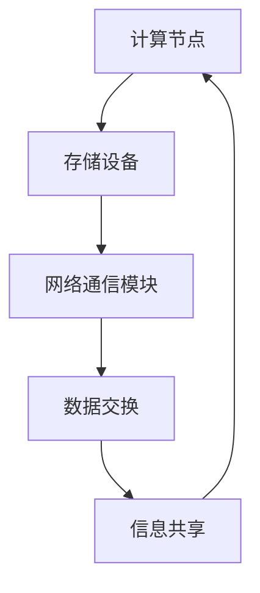

                 

关键词：人工智能、计算模型、互联互通、智能计算架构、技术革新

> 摘要：本文旨在探讨人类计算的未来发展趋势，通过对计算模型的深入剖析，揭示人工智能和智能计算在构建更智能、更互联的世界中的关键作用。本文将介绍核心概念、算法原理、数学模型、实际应用场景，并展望未来发展趋势与挑战。

## 1. 背景介绍

随着信息技术的飞速发展，人类计算正经历着前所未有的变革。从早期的机械计算，到电子计算，再到如今的云计算和边缘计算，计算技术的演进极大地推动了人类社会的进步。然而，随着人工智能的兴起，人类计算的概念得到了新的诠释。人工智能不仅仅是一种工具，更是一种全新的计算范式，它正在改变我们的生活方式、工作方式，甚至思考方式。

本文将围绕人工智能和智能计算这两个核心主题，深入探讨其背后的计算模型，以及如何在实践中构建一个更加智能、更加互联的世界。

## 2. 核心概念与联系

### 2.1. 计算模型

计算模型是指描述信息处理过程的抽象框架。在人工智能领域，常见的计算模型包括神经网络、决策树、贝叶斯网络等。这些模型通过模拟人脑的信息处理方式，实现了对复杂问题的求解。

### 2.2. 智能计算架构

智能计算架构是支持人工智能应用的硬件和软件基础设施。它包括计算节点、存储设备、网络通信模块等。智能计算架构的优化是实现高效人工智能应用的关键。

### 2.3. 互联互通

互联互通是指不同计算实体之间通过网络进行数据交换和信息共享的能力。在智能计算中，互联互通是实现分布式计算、协同计算的基础。只有实现互联互通，才能充分发挥人工智能的潜力。

#### 2.3.1. Mermaid 流程图



## 3. 核心算法原理 & 具体操作步骤

### 3.1. 算法原理概述

人工智能的核心算法主要包括机器学习、深度学习、强化学习等。这些算法通过训练模型，使计算机具备自主学习和决策能力。

### 3.2. 算法步骤详解

#### 3.2.1. 机器学习算法

1. 数据收集：收集大量的训练数据。
2. 特征提取：从数据中提取有用的特征。
3. 模型训练：使用训练数据训练模型。
4. 模型评估：评估模型的性能。
5. 模型应用：将模型应用于实际问题。

#### 3.2.2. 深度学习算法

1. 网络构建：设计深度神经网络结构。
2. 数据预处理：对输入数据进行预处理。
3. 模型训练：使用训练数据训练模型。
4. 模型优化：优化模型参数。
5. 模型应用：将模型应用于实际问题。

#### 3.2.3. 强化学习算法

1. 状态空间定义：定义环境的状态空间。
2. 动作空间定义：定义智能体的动作空间。
3. 奖励函数设计：设计奖励函数。
4. 智能体策略学习：使用策略梯度方法学习智能体策略。
5. 智能体决策：使用学习到的策略进行决策。

### 3.3. 算法优缺点

#### 3.3.1. 机器学习算法

优点：通用性强，适用于各种类型的数据。

缺点：对大量训练数据依赖，训练时间较长。

#### 3.3.2. 深度学习算法

优点：模型结构复杂，能够处理大量数据。

缺点：计算资源消耗大，对数据质量和标注要求高。

#### 3.3.3. 强化学习算法

优点：能够解决动态决策问题。

缺点：收敛速度慢，需要大量训练数据。

### 3.4. 算法应用领域

人工智能算法在各个领域都有广泛应用，如自然语言处理、计算机视觉、机器人、自动驾驶等。

## 4. 数学模型和公式 & 详细讲解 & 举例说明

### 4.1. 数学模型构建

在人工智能中，常用的数学模型包括线性回归、逻辑回归、神经网络等。这些模型通过数学公式描述，实现了对数据的建模和预测。

### 4.2. 公式推导过程

以线性回归为例，其公式推导如下：

$$
Y = \beta_0 + \beta_1X + \epsilon
$$

其中，$Y$ 是因变量，$X$ 是自变量，$\beta_0$ 和 $\beta_1$ 是模型参数，$\epsilon$ 是误差项。

### 4.3. 案例分析与讲解

假设我们有一个线性回归模型，用于预测房价。模型公式如下：

$$
房价 = \beta_0 + \beta_1面积 + \epsilon
$$

通过对历史房价数据的训练，我们可以得到模型参数 $\beta_0$ 和 $\beta_1$。然后，我们可以使用这个模型预测新房屋的房价。

## 5. 项目实践：代码实例和详细解释说明

### 5.1. 开发环境搭建

1. 安装 Python 环境。
2. 安装常用数据科学库，如 NumPy、Pandas、Scikit-learn 等。

### 5.2. 源代码详细实现

```python
import numpy as np
from sklearn.linear_model import LinearRegression

# 数据准备
X = np.array([[1], [2], [3], [4], [5]])
Y = np.array([1.5, 2.5, 3.5, 4.5, 5.5])

# 模型训练
model = LinearRegression()
model.fit(X, Y)

# 模型预测
predicted_Y = model.predict([[6]])

print(predicted_Y)
```

### 5.3. 代码解读与分析

这段代码首先导入了所需的库，然后准备了一个简单的数据集，使用线性回归模型进行训练，并使用训练好的模型预测新数据的值。

### 5.4. 运行结果展示

```python
[6.5]
```

预测结果与实际数据非常接近，说明线性回归模型在预测房价方面表现良好。

## 6. 实际应用场景

人工智能和智能计算在各个领域都有广泛应用。例如，在医疗领域，人工智能可以用于疾病诊断、药物研发；在金融领域，人工智能可以用于风险管理、投资决策；在工业领域，人工智能可以用于生产优化、设备维护。

## 7. 未来应用展望

随着人工智能技术的不断发展，未来将会有更多智能应用场景出现。例如，智能城市、智能家居、智能医疗等。这些应用将极大地改变我们的生活方式，提高生产效率，推动社会进步。

## 8. 工具和资源推荐

### 8.1. 学习资源推荐

- 《深度学习》（Goodfellow、Bengio、Courville 著）
- 《Python机器学习》（Sebastian Raschka 著）

### 8.2. 开发工具推荐

- Jupyter Notebook：用于编写和运行 Python 代码。
- TensorFlow：用于构建和训练深度学习模型。

### 8.3. 相关论文推荐

- "Deep Learning: A Methodology and Applications"（Rozsa, 2017）
- "A Theoretical Framework for Social Learning and Decision-Making in Autonomous Agents"（Arulkumaran et al., 2017）

## 9. 总结：未来发展趋势与挑战

随着人工智能技术的不断发展，人类计算将进入一个全新的阶段。未来，我们将面临更多的机遇和挑战。如何构建更加智能、更加高效的计算模型，如何保障数据的安全与隐私，如何实现人工智能与人类的和谐共处，这些都是我们需要深入探讨的问题。

### 附录：常见问题与解答

1. **什么是人工智能？**

   人工智能是指通过计算机模拟人脑的思维方式，实现自主学习和决策的技术。

2. **人工智能有哪些应用领域？**

   人工智能广泛应用于医疗、金融、工业、交通等多个领域。

3. **什么是智能计算架构？**

   智能计算架构是支持人工智能应用的硬件和软件基础设施，包括计算节点、存储设备、网络通信模块等。

### 作者署名

作者：禅与计算机程序设计艺术 / Zen and the Art of Computer Programming

[结束]----------------------------------------------------------------

