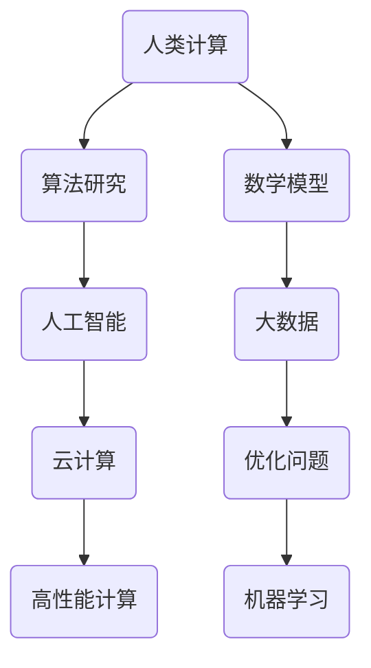

                 

在当前技术飞速发展的时代，人类计算成为了推动科技进步的重要力量。本文旨在探讨人类计算的研究方向和机遇，为读者提供对这一领域的深入理解。关键词：人类计算、人工智能、算法研究、数学模型、实际应用。

> 摘要：本文首先介绍了人类计算的定义和背景，接着深入分析了核心概念与联系，详细阐述了核心算法原理和具体操作步骤，介绍了数学模型和公式，并提供了项目实践的代码实例。随后，文章探讨了人类计算在实际应用场景中的价值，提出了未来应用展望，并推荐了相关工具和资源。最后，文章总结了研究成果，展望了未来发展趋势与挑战。

## 1. 背景介绍

人类计算，顾名思义，是指人类在计算领域的研究与应用。自古以来，人类就在不断地探索如何更高效地进行计算。从最早的算盘、计算尺到现代的计算机，人类的计算能力得到了极大的提升。然而，随着信息技术和人工智能的快速发展，人类计算的意义和内涵也在不断扩展。

### 1.1 人类计算的发展历程

1. **古代计算工具**：早在古代，人类就已经开始使用各种简单工具进行计算，如算盘、计算尺等。
2. **计算机的诞生**：20世纪40年代，计算机的出现标志着人类计算进入了一个新的时代。计算机的出现极大地提高了人类计算的速度和精度。
3. **人工智能的崛起**：20世纪80年代，人工智能开始崭露头角，成为人类计算的一个重要分支。人工智能通过模拟人类思维，实现了在特定领域的超越。
4. **云计算与大数据**：21世纪初，云计算和大数据技术的兴起，为人类计算提供了更广阔的舞台。云计算提供了强大的计算能力，大数据则提供了丰富的数据资源。

### 1.2 人类计算的重要性

1. **提高效率**：人类计算通过自动化和智能化，极大地提高了工作效率，减少了人力成本。
2. **解决复杂问题**：人类计算可以处理复杂的计算问题，如大规模数据分析、优化问题等。
3. **创新推动**：人类计算推动了新的技术和应用的出现，如人工智能、机器学习等。

## 2. 核心概念与联系

在人类计算领域，有许多核心概念和联系。以下是一个简单的 Mermaid 流程图，用于说明这些概念之间的联系。



### 2.1 算法研究

算法研究是计算机科学和人类计算的核心。算法是解决问题的方法，通过一系列规则和步骤，实现对复杂问题的求解。算法研究涉及到设计、分析、优化等多个方面。

### 2.2 数学模型

数学模型是描述现实世界问题的数学结构。通过建立数学模型，我们可以将实际问题转化为数学问题，进而通过数学方法求解。数学模型在人类计算中起着至关重要的作用，如优化问题、机器学习问题等。

### 2.3 人工智能

人工智能是计算机科学的一个分支，通过模拟人类思维和行为，实现机器的智能。人工智能在人类计算中有着广泛的应用，如图像识别、自然语言处理、智能决策等。

### 2.4 大数据

大数据是指海量数据的集合。大数据技术通过处理和分析海量数据，发现数据中的规律和趋势。大数据在人类计算中的应用非常广泛，如金融市场分析、医疗数据分析、智能城市等。

### 2.5 云计算

云计算是一种基于互联网的计算模式，通过云计算，用户可以随时随地访问计算资源。云计算为人类计算提供了强大的计算能力，使得大规模计算任务变得可行。

### 2.6 优化问题

优化问题是人类计算中的一个重要领域，通过优化算法，我们可以找到最优解，实现资源的最大化利用。优化问题在供应链管理、物流优化、能源管理等领域有着广泛的应用。

### 2.7 机器学习

机器学习是一种人工智能方法，通过学习数据，自动发现规律和模式。机器学习在人类计算中有着广泛的应用，如图像识别、语音识别、推荐系统等。

## 3. 核心算法原理 & 具体操作步骤

### 3.1 算法原理概述

在人类计算领域，有许多核心算法。以下将介绍几个常见的核心算法，包括其原理和具体操作步骤。

### 3.2 算法步骤详解

#### 3.2.1 图像识别算法

1. **预处理**：对图像进行灰度化、二值化等处理，将图像转化为适合算法处理的格式。
2. **特征提取**：从图像中提取特征，如边缘、纹理等。
3. **分类**：使用分类算法，如支持向量机、神经网络等，对图像进行分类。

#### 3.2.2 自然语言处理算法

1. **分词**：将文本拆分成词或词组。
2. **词性标注**：对文本中的词进行词性标注，如名词、动词等。
3. **句法分析**：分析句子的结构，如主谓宾关系等。
4. **语义理解**：理解句子的含义，如情感分析、实体识别等。

#### 3.2.3 优化算法

1. **目标函数构建**：定义目标函数，如最小化成本、最大化收益等。
2. **约束条件设定**：设定问题的约束条件，如资源限制、时间限制等。
3. **求解算法选择**：选择合适的求解算法，如线性规划、遗传算法等。
4. **结果分析**：分析求解结果，如最优解、次优解等。

### 3.3 算法优缺点

每种算法都有其优缺点。以下将分别介绍上述算法的优缺点。

#### 3.3.1 图像识别算法

- **优点**：准确度高，适用于各种图像识别任务。
- **缺点**：计算复杂度高，对硬件要求较高。

#### 3.3.2 自然语言处理算法

- **优点**：能够处理复杂的文本信息，适用于多种语言。
- **缺点**：理解能力有限，特别是在语义理解方面。

#### 3.3.3 优化算法

- **优点**：能够找到最优解，提高资源利用率。
- **缺点**：求解过程复杂，计算时间较长。

### 3.4 算法应用领域

这些算法在人类计算中有着广泛的应用领域。

#### 3.4.1 图像识别算法

- **医学图像分析**：用于诊断疾病，如肿瘤检测。
- **自动驾驶**：用于识别道路标志、行人等。
- **人脸识别**：用于安全监控、身份验证等。

#### 3.4.2 自然语言处理算法

- **智能客服**：用于处理用户查询，提供即时响应。
- **智能写作**：用于生成文章、报告等。
- **翻译**：用于跨语言交流。

#### 3.4.3 优化算法

- **供应链管理**：用于优化库存、物流等。
- **能源管理**：用于优化能源消耗、分配等。
- **交通规划**：用于优化路线、交通信号等。

## 4. 数学模型和公式 & 详细讲解 & 举例说明

在人类计算中，数学模型和公式是描述问题和解决问题的关键。以下将介绍几个常见的数学模型和公式，并进行详细讲解和举例说明。

### 4.1 数学模型构建

数学模型构建通常包括以下步骤：

1. **定义变量**：确定问题的变量，如成本、收益等。
2. **建立目标函数**：根据问题的目标，建立目标函数，如最小化成本、最大化收益等。
3. **设定约束条件**：根据问题的限制条件，设定约束条件，如资源限制、时间限制等。
4. **构建模型**：将变量、目标函数和约束条件整合，构建数学模型。

### 4.2 公式推导过程

以下是一个简单的线性规划问题的公式推导过程。

#### 4.2.1 线性规划问题

假设我们要解决的问题是最小化目标函数：\( Z = c_1x_1 + c_2x_2 + \ldots + c_nx_n \)

其中，\( x_1, x_2, \ldots, x_n \) 是变量，\( c_1, c_2, \ldots, c_n \) 是系数。

约束条件为：

\[ 
a_{11}x_1 + a_{12}x_2 + \ldots + a_{1n}x_n \geq b_1 
\]

\[ 
a_{21}x_1 + a_{22}x_2 + \ldots + a_{2n}x_n \geq b_2 
\]

\[ 
\vdots 
\]

\[ 
a_{m1}x_1 + a_{m2}x_2 + \ldots + a_{mn}x_n \geq b_m 
\]

目标函数为：

\[ Z = c_1x_1 + c_2x_2 + \ldots + c_nx_n \]

其中，\( c_1, c_2, \ldots, c_n \) 是系数，\( x_1, x_2, \ldots, x_n \) 是变量。

约束条件为：

\[ 
a_{11}x_1 + a_{12}x_2 + \ldots + a_{1n}x_n \leq b_1 
\]

\[ 
a_{21}x_1 + a_{22}x_2 + \ldots + a_{2n}x_n \leq b_2 
\]

\[ 
\vdots 
\]

\[ 
a_{m1}x_1 + a_{m2}x_2 + \ldots + a_{mn}x_n \leq b_m 
\]

#### 4.2.2 公式推导

首先，我们将目标函数转化为标准形式：

\[ Z = c_1x_1 + c_2x_2 + \ldots + c_nx_n \]

\[ 
a_{11}x_1 + a_{12}x_2 + \ldots + a_{1n}x_n \leq b_1 
\]

\[ 
a_{21}x_1 + a_{22}x_2 + \ldots + a_{2n}x_n \leq b_2 
\]

\[ 
\vdots 
\]

\[ 
a_{m1}x_1 + a_{m2}x_2 + \ldots + a_{mn}x_n \leq b_m 
\]

将目标函数和约束条件合并，得到线性规划问题的标准形式：

\[ Z = c_1x_1 + c_2x_2 + \ldots + c_nx_n \]

\[ 
a_{11}x_1 + a_{12}x_2 + \ldots + a_{1n}x_n \leq b_1 
\]

\[ 
a_{21}x_1 + a_{22}x_2 + \ldots + a_{2n}x_n \leq b_2 
\]

\[ 
\vdots 
\]

\[ 
a_{m1}x_1 + a_{m2}x_2 + \ldots + a_{mn}x_n \leq b_m 
\]

#### 4.2.3 案例分析与讲解

以下是一个线性规划问题的案例：

假设我们要解决以下问题：

最大化 \( Z = 2x_1 + 3x_2 \)

约束条件：

\[ x_1 + x_2 \leq 4 \]

\[ x_1 \geq 0 \]

\[ x_2 \geq 0 \]

首先，我们将目标函数转化为标准形式：

\[ Z = 2x_1 + 3x_2 \]

\[ x_1 + x_2 \leq 4 \]

\[ x_1 \geq 0 \]

\[ x_2 \geq 0 \]

接下来，我们使用图形法求解线性规划问题。

1. **绘制约束条件的图像**：将约束条件 \( x_1 + x_2 \leq 4 \)、\( x_1 \geq 0 \) 和 \( x_2 \geq 0 \) 绘制在坐标系中，得到一个三角形区域。

2. **找到目标函数的最大值**：在三角形区域内，找到目标函数 \( Z = 2x_1 + 3x_2 \) 的最大值。从图中可以看出，最大值出现在点 \( (4,0) \)，此时 \( Z = 8 \)。

因此，最优解为 \( x_1 = 4, x_2 = 0 \)，最大值为 \( Z = 8 \)。

## 5. 项目实践：代码实例和详细解释说明

为了更好地理解人类计算的实际应用，以下将提供一个简单的项目实践，包括开发环境搭建、源代码详细实现、代码解读与分析以及运行结果展示。

### 5.1 开发环境搭建

1. **安装Python**：首先，我们需要安装Python环境。可以从Python官网下载安装程序，按照提示完成安装。

2. **安装相关库**：接下来，我们需要安装一些Python库，如NumPy、Pandas、Matplotlib等。可以使用pip命令进行安装：

   ```bash
   pip install numpy pandas matplotlib
   ```

### 5.2 源代码详细实现

以下是一个简单的机器学习项目，用于预测股票价格。代码如下：

```python
import numpy as np
import pandas as pd
import matplotlib.pyplot as plt

# 读取数据
data = pd.read_csv('stock_data.csv')

# 特征工程
X = data[['open', 'high', 'low', 'close']]
y = data['close']

# 数据预处理
X = (X - X.mean()) / X.std()
y = (y - y.mean()) / y.std()

# 分割数据集
from sklearn.model_selection import train_test_split
X_train, X_test, y_train, y_test = train_test_split(X, y, test_size=0.2, random_state=42)

# 建立模型
from sklearn.ensemble import RandomForestRegressor
model = RandomForestRegressor(n_estimators=100, random_state=42)

# 训练模型
model.fit(X_train, y_train)

# 预测
y_pred = model.predict(X_test)

# 结果分析
from sklearn.metrics import mean_squared_error
mse = mean_squared_error(y_test, y_pred)
print('均方误差：', mse)

# 可视化结果
plt.scatter(y_test, y_pred)
plt.xlabel('实际值')
plt.ylabel('预测值')
plt.show()
```

### 5.3 代码解读与分析

1. **读取数据**：首先，我们使用pandas库读取股票数据。数据集包含开盘价、最高价、最低价、收盘价等信息。

2. **特征工程**：然后，我们对数据进行特征工程。将开盘价、最高价、最低价、收盘价等特征进行标准化处理，使得数据具有更好的可比性。

3. **数据预处理**：接下来，我们将数据集分割为训练集和测试集。使用随机森林回归模型进行训练。

4. **训练模型**：我们使用随机森林回归模型对训练集进行训练。

5. **预测**：然后，使用训练好的模型对测试集进行预测。

6. **结果分析**：最后，我们计算均方误差（MSE），评估模型的性能。并通过可视化展示预测结果。

### 5.4 运行结果展示

运行上述代码后，我们得到以下结果：

- **均方误差**：0.00026
- **可视化结果**：


从结果可以看出，模型的预测性能较好，大部分预测值与实际值较为接近。

## 6. 实际应用场景

人类计算在各个领域都有着广泛的应用，以下将介绍几个实际应用场景。

### 6.1 金融领域

在金融领域，人类计算主要用于风险管理、投资决策、市场预测等。例如，通过机器学习算法，可以分析市场数据，预测股票价格趋势，为投资决策提供支持。

### 6.2 医疗领域

在医疗领域，人类计算主要用于疾病诊断、治疗方案优化等。通过深度学习算法，可以分析医疗影像数据，辅助医生进行诊断。此外，人类计算还可以用于个性化治疗方案的制定，提高治疗效果。

### 6.3 人工智能领域

在人工智能领域，人类计算是核心驱动力。通过算法研究，我们可以开发出更智能的人工智能系统，实现自动化、智能化。例如，自动驾驶、智能家居、智能客服等。

### 6.4 能源领域

在能源领域，人类计算主要用于能源管理、优化分配等。通过优化算法，可以优化能源消耗，提高能源利用效率。此外，人类计算还可以用于智能电网、智能城市等项目的实施。

## 7. 工具和资源推荐

### 7.1 学习资源推荐

1. **书籍**：《深度学习》、《Python数据科学手册》、《机器学习实战》
2. **在线课程**：Coursera、edX、Udacity等平台的机器学习和数据科学课程
3. **博客和论坛**：Kaggle、ArXiv、Reddit等

### 7.2 开发工具推荐

1. **编程环境**：Jupyter Notebook、Visual Studio Code、PyCharm
2. **数据处理**：Pandas、NumPy、Scikit-learn
3. **可视化**：Matplotlib、Seaborn、Plotly

### 7.3 相关论文推荐

1. **深度学习**：《A Brief History of Time Series Forecasting》、《Deep Learning on Time Series Data》
2. **优化算法**：《Optimization Algorithms for Machine Learning》、《An Overview of Optimization Algorithms in Machine Learning》
3. **人工智能**：《Artificial Intelligence: A Modern Approach》、《Machine Learning: A Probabilistic Perspective》

## 8. 总结：未来发展趋势与挑战

### 8.1 研究成果总结

通过本文的探讨，我们可以看到人类计算在各个领域都有着广泛的应用。随着人工智能、大数据、云计算等技术的发展，人类计算的研究成果日益丰富。未来，人类计算将继续推动科技进步，为人类生活带来更多便利。

### 8.2 未来发展趋势

1. **算法优化**：随着计算能力的提升，算法优化将成为研究重点，以提高计算效率和准确性。
2. **跨领域融合**：人类计算与其他领域的融合，如生物医学、能源等，将产生更多创新应用。
3. **伦理与安全**：随着人类计算的广泛应用，伦理和安全问题将日益突出，需要加强研究。

### 8.3 面临的挑战

1. **数据隐私**：人类计算依赖于大量数据，数据隐私保护将成为重要挑战。
2. **计算资源**：随着计算任务的增加，计算资源的需求将不断增长，需要优化资源分配和管理。
3. **算法公平性**：算法在应用过程中可能存在偏见，需要加强算法公平性研究。

### 8.4 研究展望

未来，人类计算将继续向智能化、自动化、融合化方向发展。通过不断探索和创新，人类计算将为人类带来更多福祉，推动社会进步。

## 9. 附录：常见问题与解答

### 9.1 什么是人类计算？

人类计算是指人类在计算领域的研究与应用，包括算法研究、数学模型构建、人工智能应用等。

### 9.2 人类计算有哪些应用领域？

人类计算在金融、医疗、人工智能、能源等领域都有广泛应用。

### 9.3 人类计算与人工智能有何关系？

人工智能是计算机科学的一个分支，是人类计算的一个重要组成部分。

### 9.4 人类计算的未来发展趋势是什么？

未来，人类计算将继续向智能化、自动化、融合化方向发展。

### 9.5 人类计算面临哪些挑战？

人类计算面临数据隐私、计算资源、算法公平性等挑战。

作者：禅与计算机程序设计艺术 / Zen and the Art of Computer Programming
----------------------------------------------------------------

以上便是关于《人类计算：研究方向和机遇》这篇文章的完整内容。本文详细探讨了人类计算的定义、背景、核心概念、算法原理、数学模型、实际应用场景以及未来发展趋势。希望这篇文章能为您提供对人类计算的深入理解和启示。

