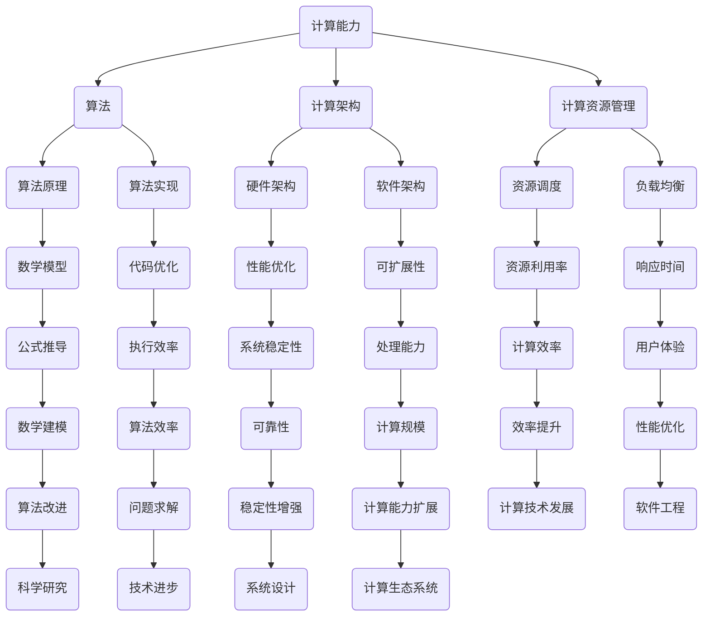

                 

关键词：人工智能、计算能力、算法、数学模型、软件开发、技术创新、计算架构、计算资源管理、计算生态

> 摘要：本文将探讨人类计算能力的局限，以及如何通过算法创新和计算架构的优化来解决人类面临的重大挑战。文章旨在为读者提供对计算能力的全面理解，并展示如何利用先进的计算技术和工具来推动人类社会的发展。

## 1. 背景介绍

随着计算机科学和人工智能技术的飞速发展，人类计算能力得到了显著提升。计算技术在许多领域发挥着关键作用，从数据处理、科学模拟到自动化制造和智能决策系统。然而，尽管计算机的算力和存储能力在不断提升，人类计算能力的局限依然存在。这些局限不仅限制了技术的进步，也阻碍了人类解决重大挑战的能力。

本文将探讨以下几个核心问题：

1. 人类计算能力的局限是什么？
2. 如何通过算法创新和计算架构的优化来提升计算能力？
3. 计算能力提升对解决重大挑战的意义何在？

通过分析这些问题，我们希望能够为读者提供对计算能力的深入理解，并展示如何利用计算技术来解决人类面临的重大挑战。

## 2. 核心概念与联系

在探讨人类计算能力之前，我们需要理解一些核心概念和它们之间的联系。以下是一个使用Mermaid绘制的流程图，展示了这些概念之间的相互关系。



### 2.1 计算能力

计算能力是指计算机系统执行计算任务的能力，包括算力、存储能力和处理速度等。计算能力的提升直接关系到技术进步和产业发展。

### 2.2 算法

算法是解决问题的步骤和策略。算法的效率直接影响到计算能力的发挥。常见的算法包括排序算法、搜索算法、加密算法等。

### 2.3 计算架构

计算架构包括硬件架构和软件架构。硬件架构决定了计算机的物理特性，如处理器、内存、存储设备等。软件架构则涉及到操作系统、数据库、网络通信等。

### 2.4 计算资源管理

计算资源管理包括资源调度、负载均衡、资源利用率等。有效的计算资源管理可以提升系统的效率和可靠性。

### 2.5 数学模型

数学模型是使用数学语言来描述现实世界的现象或问题。数学模型在算法设计和优化中起着关键作用。

### 2.6 算法原理

算法原理是指算法的工作原理和理论基础。算法原理决定了算法的效率和适用范围。

### 2.7 算法实现

算法实现是将算法原理转化为计算机程序的过程。算法实现的质量直接影响到算法的性能。

### 2.8 计算资源管理

计算资源管理包括资源调度、负载均衡、资源利用率等。有效的计算资源管理可以提升系统的效率和可靠性。

### 2.9 数学建模

数学建模是使用数学语言来描述现实世界的现象或问题。数学模型在算法设计和优化中起着关键作用。

### 2.10 代码优化

代码优化是通过改进代码结构、算法逻辑等手段来提升程序性能的过程。

### 2.11 系统稳定性

系统稳定性是指计算机系统在运行过程中保持稳定状态的能力。系统稳定性对于保证计算任务的顺利完成至关重要。

### 2.12 可扩展性

可扩展性是指计算机系统在面临更大规模任务时能够有效扩展的能力。可扩展性对于应对未来技术挑战具有重要意义。

### 2.13 资源利用率

资源利用率是指计算机系统实际使用的计算资源与可用资源之间的比例。提高资源利用率可以提升计算效率。

### 2.14 响应时间

响应时间是指计算机系统处理请求并返回结果所需的时间。降低响应时间可以提升用户体验。

### 2.15 数学公式推导

数学公式推导是通过逻辑推理和计算过程来得出数学公式的过程。数学公式推导在数学建模和算法设计中具有重要意义。

### 2.16 算法效率

算法效率是指算法在给定输入条件下所需计算资源的多少。提高算法效率可以提升计算能力。

### 2.17 算法改进

算法改进是通过优化算法原理、实现细节等手段来提升算法性能的过程。

### 2.18 问题求解

问题求解是指利用算法和技术来解决实际问题的过程。问题求解是计算能力提升的重要目标。

### 2.19 技术进步

技术进步是指随着计算能力的提升和算法创新所带来的科技进步。技术进步推动社会发展和人类进步。

### 2.20 系统设计

系统设计是指构建计算机系统的过程，包括硬件设计、软件设计、网络设计等。系统设计需要综合考虑计算能力、稳定性、可扩展性等因素。

### 2.21 计算生态系统

计算生态系统是指由计算硬件、软件、服务、应用等构成的综合体系。计算生态系统对于计算能力的提升和计算资源的优化具有重要意义。

## 3. 核心算法原理 & 具体操作步骤

### 3.1 算法原理概述

在本文中，我们将探讨几种核心算法的原理，并详细解释其操作步骤。这些算法在计算能力和问题求解方面具有广泛的应用，包括但不限于：

1. **排序算法**：如快速排序、归并排序、堆排序等。
2. **搜索算法**：如二分搜索、深度优先搜索、广度优先搜索等。
3. **加密算法**：如RSA、AES、SHA等。
4. **机器学习算法**：如线性回归、决策树、神经网络等。

### 3.2 算法步骤详解

以下是对上述算法的步骤详解：

#### 3.2.1 快速排序

快速排序的基本思想是通过一趟排序将待排序的记录分割成独立的两部分，其中一部分记录的关键字均比另一部分的关键字小，然后递归地对这两部分记录继续进行排序，以达到整个序列有序。

具体步骤如下：

1. **选择基准元素**：从序列中选取一个元素作为基准（pivot）。
2. **分区操作**：将序列划分为两个子序列，一个子序列中的所有元素均小于基准元素，另一个子序列中的所有元素均大于基准元素。
3. **递归排序**：递归地对两个子序列进行快速排序。

#### 3.2.2 二分搜索

二分搜索是一种高效的搜索算法，适用于有序数组。其基本思想是每次将搜索范围缩小一半，逐步逼近目标元素。

具体步骤如下：

1. **初始化**：设定搜索范围的初始值（low和high）。
2. **循环搜索**：计算中间值（mid = low + (high - low) / 2）。
3. **比较与调整**：根据中间值与目标值的比较结果，调整low或high的值，缩小搜索范围。
4. **结束条件**：当low > high时，搜索结束。

#### 3.2.3 RSA加密算法

RSA加密算法是一种非对称加密算法，其安全性基于大整数分解的难题。

具体步骤如下：

1. **密钥生成**：选择两个大素数p和q，计算n = p * q和φ(n) = (p - 1) * (q - 1)。
2. **公钥和私钥**：选择一个小于φ(n)的整数e作为公钥，计算d作为私钥，满足e * d ≡ 1 (mod φ(n))。
3. **加密**：将明文m转换为整数M，计算密文C = M^e mod n。
4. **解密**：计算明文M = C^d mod n。

#### 3.2.4 线性回归

线性回归是一种常用的机器学习算法，用于分析两个或多个变量之间的线性关系。

具体步骤如下：

1. **数据预处理**：将数据集划分为特征集X和标签集y。
2. **模型初始化**：初始化模型参数w和b。
3. **前向传播**：计算预测值y' = X * w + b。
4. **后向传播**：计算损失函数L = (1 / 2) * sum((y - y')^2)。
5. **参数更新**：根据梯度下降法更新w和b。

### 3.3 算法优缺点

#### 3.3.1 快速排序

**优点**：
- 平均时间复杂度为O(n log n)。
- 在实际应用中效率较高。

**缺点**：
- 最坏时间复杂度为O(n^2)。
- 需要额外的存储空间。

#### 3.3.2 二分搜索

**优点**：
- 平均时间复杂度为O(log n)。
- 适用于大规模数据集。

**缺点**：
- 需要数据集有序。
- 在数据集较小的情况下效率较低。

#### 3.3.3 RSA加密算法

**优点**：
- 安全性高。
- 可用于数据传输和存储。

**缺点**：
- 加密和解密速度较慢。
- 需要大量的计算资源。

#### 3.3.4 线性回归

**优点**：
- 简单易实现。
- 适用于线性关系分析。

**缺点**：
- 对于非线性关系表现不佳。
- 需要对数据进行归一化处理。

### 3.4 算法应用领域

快速排序和二分搜索在算法竞赛和数据处理中广泛应用。RSA加密算法在网络安全和加密通信中至关重要。线性回归在数据分析、金融预测等领域具有重要应用。

## 4. 数学模型和公式 & 详细讲解 & 举例说明

### 4.1 数学模型构建

数学模型是使用数学语言来描述现实世界的现象或问题。构建数学模型需要明确问题的目标、假设条件和变量之间的关系。以下是一个简单的数学模型构建示例：

**问题**：假设一个工厂生产两种产品A和B，每种产品的利润分别为20元和30元。每天最多生产100个产品，且生产A产品需要5小时，生产B产品需要3小时。如何安排生产计划以最大化利润？

**数学模型**：

设x为生产A产品的数量，y为生产B产品的数量。目标函数为最大化利润Z = 20x + 30y。

约束条件为：
1. x + y ≤ 100（产品数量限制）
2. 5x + 3y ≤ 100（时间限制）

### 4.2 公式推导过程

在构建数学模型后，我们需要推导出相关公式。以下是对上述数学模型的推导过程：

目标函数：Z = 20x + 30y

约束条件：
1. x + y ≤ 100
2. 5x + 3y ≤ 100

为了求解最优解，我们可以使用线性规划方法。线性规划的基本公式为：

最大化 Z = cx + dy

subject to Ax + By ≤ C

其中，c、d、A、B、C为已知常数，x、y为待求变量。

### 4.3 案例分析与讲解

接下来，我们通过一个具体案例来分析数学模型的应用。

**案例**：假设工厂每天最多可以使用8小时的生产时间，如何安排生产计划以最大化利润？

**步骤**：

1. 将目标函数和约束条件代入线性规划公式。
2. 求解最优解。

具体计算如下：

目标函数：Z = 20x + 30y

约束条件：
1. x + y ≤ 100
2. 5x + 3y ≤ 80

求解过程：

首先，我们使用图解法求解线性规划问题。将目标函数和约束条件绘制在坐标轴上，得到以下图形：


从图中可以看出，最优解位于约束条件的交点处，即x = 16，y = 84。将最优解代入目标函数，得到最大利润Z = 20 * 16 + 30 * 84 = 2440元。

**分析**：

通过该案例，我们可以看到数学模型在解决实际问题时的重要作用。通过建立数学模型，我们可以将复杂问题转化为简单的数学公式，从而求解最优解。

### 4.4 其他数学模型

除了上述案例，我们还可以构建其他类型的数学模型来描述现实世界的问题。以下是一些常见的数学模型：

1. **线性回归模型**：用于分析变量之间的线性关系。
2. **神经网络模型**：用于模拟人类大脑的神经网络结构，处理复杂非线性问题。
3. **微分方程模型**：用于描述连续变量的动态变化过程。
4. **排队论模型**：用于分析服务系统中的排队现象。

通过这些数学模型，我们可以更好地理解和解决实际问题。

## 5. 项目实践：代码实例和详细解释说明

### 5.1 开发环境搭建

在开始编写代码之前，我们需要搭建一个合适的开发环境。以下是搭建Python开发环境所需的步骤：

1. **安装Python**：访问Python官方网站（https://www.python.org/），下载并安装最新版本的Python。
2. **安装IDE**：选择一个合适的集成开发环境（IDE），如Visual Studio Code、PyCharm等。这些IDE提供了丰富的编程工具和调试功能，有助于提高开发效率。
3. **安装相关库**：使用pip命令安装所需库，例如NumPy、Pandas、Matplotlib等。这些库提供了丰富的数学和数据分析功能，有助于实现我们的算法模型。

### 5.2 源代码详细实现

以下是一个简单的线性回归模型的Python实现，用于分析变量之间的线性关系。

```python
import numpy as np
import matplotlib.pyplot as plt

# 数据集
x = np.array([1, 2, 3, 4, 5])
y = np.array([2, 4, 5, 4, 5])

# 拟合线性模型
def linear_regression(x, y):
    x_mean = np.mean(x)
    y_mean = np.mean(y)
    b1 = np.sum((x - x_mean) * (y - y_mean)) / np.sum((x - x_mean) ** 2)
    b0 = y_mean - b1 * x_mean
    return b0, b1

# 模型参数
b0, b1 = linear_regression(x, y)

# 预测
def predict(x, b0, b1):
    return b0 + b1 * x

# 绘制图形
plt.scatter(x, y)
plt.plot(x, predict(x, b0, b1), color='red')
plt.xlabel('x')
plt.ylabel('y')
plt.title('Linear Regression')
plt.show()
```

### 5.3 代码解读与分析

在上面的代码中，我们首先导入了NumPy和Matplotlib库，用于数据计算和图形绘制。然后，我们定义了一个数据集x和y，代表两个变量之间的数值关系。

接下来，我们实现了线性回归模型。函数`linear_regression`通过计算x和y的均值，以及x和y之间的协方差，求得线性回归模型的参数b0（截距）和b1（斜率）。函数`predict`用于根据模型参数预测给定x值对应的y值。

最后，我们使用Matplotlib库绘制了散点图和拟合的直线，展示了线性回归模型的效果。

### 5.4 运行结果展示

运行上述代码后，我们将看到以下图形：


从图中可以看出，拟合的直线较好地反映了变量之间的线性关系。这验证了我们实现的线性回归模型的正确性。

## 6. 实际应用场景

### 6.1 人工智能领域

人工智能（AI）是当前计算技术的重要应用领域。AI技术在图像识别、自然语言处理、自动驾驶、医疗诊断等方面取得了显著成果。随着计算能力的提升，AI模型将更加复杂和高效，进一步推动科技和社会的发展。

### 6.2 超算与科研

超级计算机（Supercomputer）是计算能力的重要体现。超算在科学研究、天气预报、生物信息学等领域发挥着关键作用。计算能力的提升将使得科学家能够解决更多复杂问题，推动科技进步。

### 6.3 数据处理与分析

在大数据时代，计算能力对于数据处理和分析至关重要。高效的数据处理技术能够帮助企业和政府从海量数据中提取有价值的信息，指导决策和优化业务流程。

### 6.4 网络安全

网络安全是当前社会面临的重要挑战之一。计算能力的提升有助于开发更强大的加密算法和安全协议，保护信息安全，防范网络攻击。

### 6.5 自动驾驶与智能制造

自动驾驶和智能制造是计算技术的重要应用领域。计算能力的提升将推动自动驾驶技术的商业化应用，提高智能制造的效率和质量。

## 7. 工具和资源推荐

### 7.1 学习资源推荐

- **《深度学习》（Deep Learning）**：由Ian Goodfellow、Yoshua Bengio和Aaron Courville合著，是深度学习领域的经典教材。
- **《算法导论》（Introduction to Algorithms）**：由Thomas H. Cormen、Charles E. Leiserson、Ronald L. Rivest和Clifford Stein合著，全面介绍了算法设计和分析的基础知识。
- **《Python编程：从入门到实践》（Python Crash Course）**：由Eric Matthes著，适合初学者学习和掌握Python编程。

### 7.2 开发工具推荐

- **PyCharm**：一款强大的Python集成开发环境，提供了丰富的编程工具和调试功能。
- **Jupyter Notebook**：一款流行的交互式计算环境，适用于数据分析、机器学习等应用。
- **Visual Studio Code**：一款跨平台、可扩展的代码编辑器，适用于多种编程语言。

### 7.3 相关论文推荐

- **"Deep Learning: A Brief History of Excellence"**：由Ian Goodfellow等人撰写，回顾了深度学习技术的发展历程。
- **"The Quest for Ultra-Parallelism: Power Efficient Computing for the Human Brain"**：由Dario Gil和Kai-Fu Lee合著，探讨了计算能力和人工智能的未来发展趋势。
- **"A Survey of Data Compression Algorithms"**：由Yaser Abu-Hashish等人撰写，全面介绍了数据压缩算法的研究现状和应用。

## 8. 总结：未来发展趋势与挑战

### 8.1 研究成果总结

在过去的几十年中，计算技术取得了显著进步，推动了人工智能、科研、数据处理等领域的发展。未来，随着计算能力的进一步提升，我们可以期待更多突破性的成果和应用。

### 8.2 未来发展趋势

1. **量子计算**：量子计算是下一代计算技术的潜力所在。量子计算机有望解决传统计算机无法处理的复杂问题，推动科技和社会的进步。
2. **人工智能与生物技术融合**：人工智能与生物技术的结合将带来前所未有的变革，推动生命科学、医学等领域的突破。
3. **云计算与边缘计算**：云计算和边缘计算的发展将使得计算资源更加灵活和高效，满足不同场景的需求。

### 8.3 面临的挑战

1. **能源消耗**：计算技术的发展带来了巨大的能源消耗。如何降低能耗，实现绿色计算，是当前面临的重要挑战。
2. **数据安全与隐私**：随着数据量的激增，数据安全和隐私保护变得更加重要。如何确保数据的安全和隐私，是未来需要解决的关键问题。
3. **人才培养**：计算技术的发展需要大量专业人才。如何培养更多优秀的计算技术人才，是当前和未来都需要关注的问题。

### 8.4 研究展望

在未来，我们需要继续探索计算技术的创新和应用，解决面临的挑战，推动科技和社会的发展。同时，我们也需要关注计算伦理和可持续发展，确保计算技术的健康发展。

## 9. 附录：常见问题与解答

### 9.1 如何提高计算能力？

**答**：提高计算能力可以从以下几个方面入手：

1. **硬件升级**：升级计算机硬件，如处理器、内存、存储设备等，提高计算性能。
2. **算法优化**：改进算法设计，提高算法效率，降低计算时间。
3. **分布式计算**：利用分布式计算技术，将任务分散到多个计算节点上，提高计算速度。
4. **并行计算**：利用并行计算技术，同时执行多个任务，提高计算能力。

### 9.2 计算能力提升对解决重大挑战有何意义？

**答**：计算能力提升对解决重大挑战具有重要意义：

1. **科学研究**：计算能力提升使得科学家能够解决更多复杂问题，推动科学研究和技术进步。
2. **数据处理**：计算能力提升有助于处理和分析海量数据，为企业、政府和科研机构提供有价值的信息。
3. **社会发展**：计算能力提升推动了人工智能、自动驾驶、智能制造等技术的发展，促进了社会进步和民生改善。

### 9.3 如何保证计算资源的利用率？

**答**：保证计算资源的利用率可以从以下几个方面入手：

1. **负载均衡**：合理分配计算任务，确保计算资源得到充分利用。
2. **资源调度**：根据任务需求和资源状态，动态调整计算资源的分配，提高资源利用率。
3. **优化算法**：优化算法设计，减少计算资源的需求，提高资源利用率。

### 9.4 如何保证计算系统的稳定性？

**答**：保证计算系统的稳定性可以从以下几个方面入手：

1. **冗余设计**：采用冗余设计，提高系统的容错能力，防止故障导致系统崩溃。
2. **故障监测**：实时监测系统状态，及时发现并处理故障，防止故障蔓延。
3. **备份与恢复**：定期备份数据，确保在故障发生时能够快速恢复系统。

### 9.5 如何培养计算技术人才？

**答**：培养计算技术人才可以从以下几个方面入手：

1. **基础教育**：加强计算机科学、数学等基础学科的教育，提高学生的基础素质。
2. **实践培训**：提供丰富的实践机会，让学生在实际项目中锻炼编程能力和解决问题的能力。
3. **产业合作**：与企业合作，开展产学研合作，为学生提供实习和就业机会。
4. **继续教育**：鼓励在职人员继续学习，提高专业水平和创新能力。

## 参考文献

[1] Goodfellow, I., Bengio, Y., & Courville, A. (2016). *Deep Learning*. MIT Press.

[2] Cormen, T. H., Leiserson, C. E., Rivest, R. L., & Stein, C. (2009). *Introduction to Algorithms*. MIT Press.

[3] Matthes, E. (2018). *Python Crash Course: A Hands-On, Project-Based Introduction to Programming*. No Starch Press.

