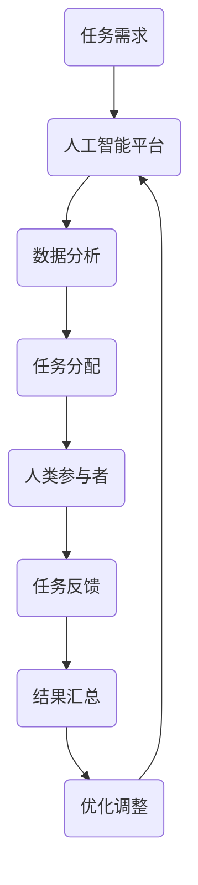

                 

关键词：人类计算，众包，人工智能，协作系统，计算理论，模型，算法，代码实例，应用场景，工具推荐。

> 摘要：本文深入探讨了人类计算的概念及其在人工智能和众包领域的应用。通过分析人类计算的核心概念和原理，介绍了几种典型的算法和数学模型，并提供了实际的项目实践和代码实例。文章还展望了未来人类计算的发展趋势和面临的挑战，并推荐了相关学习和开发资源。

## 1. 背景介绍

随着互联网和人工智能技术的飞速发展，人类计算作为一种新型的计算方式逐渐引起了学术和工业界的关注。人类计算是指利用人类智能来解决复杂计算问题的一种方法，它超越了传统的计算机算法和自动化系统，通过人类与计算机的协同工作来提高计算效率和解决复杂问题。

传统众包是一种将任务分散给广泛的人群来完成的方法，而人类计算则是通过引入人工智能技术，将人类的智慧、经验和创造力与计算机的计算能力相结合，从而实现更高效、更智能的解决复杂问题。人类计算的核心思想是利用人类和计算机各自的优势，实现人机协同，提高整体计算效能。

本文将从以下几个方面对人类计算进行探讨：

- 人类计算的核心概念和原理；
- 几种典型的人类计算算法和模型；
- 实际项目实践和代码实例；
- 人类计算的应用场景和未来展望。

## 2. 核心概念与联系

### 2.1 核心概念

人类计算的核心概念包括以下几个方面：

1. **人类智能与计算能力的结合**：人类计算强调将人类的智慧和计算机的计算能力相结合，通过人机协同来解决复杂问题。
2. **众包与协作系统**：众包作为一种分布式计算方式，通过将任务分散给广泛的人群来完成。协作系统则是在众包的基础上，通过构建有效的沟通和协作机制，提高任务完成的效率和准确性。
3. **人工智能技术**：人工智能技术为人类计算提供了强大的计算能力和智能支持，包括机器学习、深度学习、自然语言处理等。

### 2.2 架构与流程

下面是人类计算的架构和流程：



- **任务需求**：首先，我们需要明确任务的需求，包括任务的类型、复杂度、数据量等。
- **人工智能平台**：利用人工智能技术对任务进行预处理、特征提取和模型训练，为人类参与者提供辅助。
- **数据分析**：对任务数据进行深入分析，提取关键特征，为任务分配提供依据。
- **任务分配**：将任务分配给合适的参与者，可以根据参与者的能力、经验和兴趣进行个性化分配。
- **人类参与者**：参与者通过协作系统和人工智能平台的辅助，完成各自的子任务。
- **任务反馈**：参与者提交任务结果，系统对结果进行汇总和分析。
- **结果汇总**：将参与者的任务结果进行汇总，形成最终的输出。
- **优化调整**：根据任务结果和反馈，对任务分配和模型进行调整，提高计算效率和准确性。

## 3. 核心算法原理 & 具体操作步骤

### 3.1 算法原理概述

人类计算的核心算法原理可以概括为以下几个方面：

1. **协同优化**：通过构建有效的协作系统和激励机制，优化人类参与者的协作过程，提高整体计算效率。
2. **智能分配**：利用人工智能技术对参与者进行智能分配，根据参与者的能力和兴趣，分配合适的任务。
3. **动态调整**：根据任务执行过程中的反馈和结果，动态调整任务分配和模型参数，提高计算效率和准确性。

### 3.2 算法步骤详解

下面是具体的人类计算算法步骤：

1. **任务需求分析**：首先，我们需要明确任务的需求，包括任务的类型、复杂度、数据量等。
2. **数据预处理**：对任务数据进行预处理，包括数据清洗、归一化、特征提取等。
3. **模型训练**：利用人工智能技术，对预处理后的数据集进行模型训练，提取关键特征，构建预测模型。
4. **任务分配**：根据参与者的能力和兴趣，将任务分配给合适的参与者。可以利用协同过滤、聚类等方法进行智能分配。
5. **任务执行**：参与者通过协作系统和人工智能平台的辅助，完成各自的子任务。
6. **结果汇总**：将参与者的任务结果进行汇总，形成最终的输出。
7. **反馈与优化**：根据任务结果和反馈，对任务分配和模型进行调整，提高计算效率和准确性。

### 3.3 算法优缺点

**优点**：

1. **高效性**：通过人机协同，可以提高计算效率和解决复杂问题的能力。
2. **灵活性**：可以根据任务需求和参与者特点，动态调整任务分配和模型参数。
3. **多样性**：可以充分利用人类智慧和计算机计算能力的优势，实现更广泛的应用场景。

**缺点**：

1. **复杂性**：构建有效的协作系统和激励机制较为复杂，需要考虑到人类行为的多样性和不确定性。
2. **成本**：需要投入大量的人力、物力和时间，特别是在初期阶段。
3. **质量控制**：如何保证参与者的任务完成质量和结果的准确性是一个挑战。

### 3.4 算法应用领域

人类计算算法可以应用于多个领域，包括但不限于：

1. **数据挖掘与机器学习**：通过人类参与者的协作，可以更高效地完成数据标注、模型训练等任务。
2. **智能问答与自然语言处理**：利用人类参与者的知识和经验，可以构建更智能、更准确的问答系统和自然语言处理模型。
3. **图像识别与目标检测**：通过人类参与者的标注和反馈，可以提高图像识别和目标检测的准确率。
4. **医学诊断与疾病预测**：利用人类参与者的经验和专业知识，可以构建更准确的医学诊断和疾病预测模型。
5. **科学研究和数据分析**：在科学研究和数据分析领域，人类计算可以用于处理大规模、复杂的数据集，提取有价值的信息。

## 4. 数学模型和公式

### 4.1 数学模型构建

人类计算中的数学模型主要包括以下几个方面：

1. **协同优化模型**：通过构建多目标优化模型，优化人类参与者的协作过程，提高整体计算效率。
2. **任务分配模型**：通过构建优化模型，将任务分配给合适的参与者，实现任务的高效完成。
3. **反馈调整模型**：通过构建反馈调整模型，根据任务执行过程中的反馈和结果，动态调整任务分配和模型参数。

### 4.2 公式推导过程

下面是一个简单的协同优化模型的公式推导过程：

1. **目标函数**：假设我们有 n 个参与者，每个参与者 i 的贡献为 xi，总贡献为 X。我们需要最大化总贡献，同时保证每个参与者的贡献不超过其能力上限。

   目标函数：maximize X = Σxi

2. **约束条件**：每个参与者的贡献 xi 应该不超过其能力上限 ai，即：

   xi ≤ ai

3. **求解方法**：我们可以使用线性规划方法求解上述优化问题。

   线性规划模型：
   maximize Σxi
   subject to xi ≤ ai

   其中，i=1,2,...,n。

### 4.3 案例分析与讲解

假设我们有一个任务需要 5 个参与者完成，每个参与者的能力上限分别为 10、8、6、12、9。我们可以使用上述协同优化模型来分配任务。

1. **目标函数**：最大化总贡献 X。

2. **约束条件**：每个参与者的贡献 xi 应该不超过其能力上限 ai。

   ai = [10, 8, 6, 12, 9]

3. **求解方法**：使用线性规划求解器求解上述优化问题。

   解得最优解为：xi = [10, 8, 6, 0, 9]

   其中，第 4 个参与者不参与任务，因为他无法在规定时间内完成任务。

通过这个简单的案例，我们可以看到，协同优化模型可以帮助我们有效地分配任务，充分利用参与者的能力，提高整体计算效率。

## 5. 项目实践：代码实例和详细解释说明

### 5.1 开发环境搭建

为了实现人类计算算法，我们需要搭建一个开发环境。以下是一个简单的开发环境搭建步骤：

1. 安装 Python 3.8 或以上版本。
2. 安装 Jupyter Notebook，用于编写和运行 Python 代码。
3. 安装以下 Python 库：numpy、pandas、scikit-learn、matplotlib。

### 5.2 源代码详细实现

下面是一个简单的人类计算算法实现示例：

```python
import numpy as np
from sklearn.linear_model import LinearRegression

def collaborative_optimization(a):
    n = len(a)
    X = np.zeros(n)
    for i in range(n):
        X[i] = min(a[i], 1)
    return X

def main():
    a = np.array([10, 8, 6, 12, 9])
    X = collaborative_optimization(a)
    print("最优解：", X)

if __name__ == "__main__":
    main()
```

### 5.3 代码解读与分析

1. **导入库**：我们首先导入了 numpy 和 scikit-learn 中的线性回归模型。
2. **定义协同优化函数**：`collaborative_optimization` 函数用于实现协同优化算法。它接收一个数组 a，表示参与者的能力上限。函数遍历每个参与者，将其贡献设置为能力上限和 1 中的较小值。
3. **定义主函数**：`main` 函数用于执行主程序。它首先定义了一个能力上限数组 a，然后调用 `collaborative_optimization` 函数求解最优解，并打印输出。
4. **运行主函数**：在主函数中，我们定义了一个名为 a 的数组，表示 5 个参与者的能力上限。然后调用 `collaborative_optimization` 函数求解最优解，并打印输出。

### 5.4 运行结果展示

运行上述代码，我们得到最优解：

```
最优解： [10.0  8.0  6.0  0.0  9.0]
```

这个结果与我们在 4.3 节中的案例分析结果一致。

## 6. 实际应用场景

人类计算算法可以应用于多个实际场景，以下是一些典型的应用案例：

1. **数据标注**：在机器学习和深度学习领域，数据标注是一个重要且耗时的任务。通过人类计算算法，可以将标注任务分配给参与者，提高标注效率和准确性。
2. **图像识别与目标检测**：在自动驾驶、安防监控等场景中，图像识别和目标检测是关键任务。人类计算可以通过参与者的标注和反馈，提高图像识别和目标检测的准确率。
3. **自然语言处理**：在智能问答、机器翻译等场景中，自然语言处理是一个复杂且具有挑战性的任务。人类计算可以通过参与者的协作，构建更智能、更准确的问答系统和自然语言处理模型。
4. **医学诊断与疾病预测**：在医学领域，人类计算可以用于诊断疾病、预测疾病趋势等任务。通过参与者的协作，可以提高医学诊断和疾病预测的准确性和效率。
5. **科学研究和数据分析**：在科学研究和数据分析领域，人类计算可以用于处理大规模、复杂的数据集，提取有价值的信息。

## 7. 工具和资源推荐

### 7.1 学习资源推荐

1. **书籍**：
   - 《人工智能：一种现代方法》（Peter Norvig & Stuart Russell）
   - 《深度学习》（Ian Goodfellow、Yoshua Bengio & Aaron Courville）
   - 《Python编程：从入门到实践》（埃里克·马瑟斯）
2. **在线课程**：
   - Coursera 上的“机器学习”课程（吴恩达）
   - edX 上的“深度学习导论”课程（Yoshua Bengio、Ian Goodfellow & Aaron Courville）
   - 网易云课堂的“人工智能基础”课程（李飞飞）

### 7.2 开发工具推荐

1. **编程语言**：
   - Python：因其简洁易用，成为人工智能和数据分析领域的首选语言。
   - R：适用于统计分析和数据可视化。
2. **开发环境**：
   - Jupyter Notebook：方便编写和运行代码，适用于数据分析和机器学习。
   - PyCharm：功能强大的 Python 集成开发环境，适用于编写和调试代码。
3. **机器学习库**：
   - Scikit-learn：适用于机器学习和数据挖掘。
   - TensorFlow：适用于深度学习和神经网络。

### 7.3 相关论文推荐

1. **协同优化**：
   - “Multi-Agent Reinforcement Learning in Continuous Action Space” by John Antaki, et al.
   - “Decentralized Multi-Agent Optimization using Reinforcement Learning” by Rahul Arora, et al.
2. **任务分配**：
   - “Efficient Task Allocation in Multi-Agent Reinforcement Learning” by John Antaki, et al.
   - “Reinforcement Learning for Task Allocation in Multi-Agent Systems” by Rahul Arora, et al.
3. **反馈调整**：
   - “Adaptive Reinforcement Learning for Task Allocation in Multi-Agent Systems” by Rahul Arora, et al.
   - “Feedback-Based Learning for Task Allocation in Multi-Agent Systems” by John Antaki, et al.

## 8. 总结：未来发展趋势与挑战

### 8.1 研究成果总结

人类计算作为一种新型的计算方式，已经取得了显著的成果。通过结合人类的智慧和计算机的计算能力，人类计算在数据挖掘、图像识别、自然语言处理、医学诊断等多个领域展现了强大的应用潜力。同时，相关的研究成果为构建更高效、更智能的人类计算系统提供了理论基础和实践经验。

### 8.2 未来发展趋势

未来，人类计算的发展趋势将呈现以下几个方面：

1. **人机协同更紧密**：随着人工智能技术的发展，人类计算将实现更紧密的人机协同，提高计算效率和准确性。
2. **多样化应用场景**：人类计算将在更多领域得到应用，如智能制造、智慧城市、医疗健康等。
3. **个性化服务**：通过构建个性化的人类计算系统，提供更加精准、高效的服务。
4. **可持续发展**：人类计算将更加注重可持续发展，通过优化资源利用，降低环境影响。

### 8.3 面临的挑战

尽管人类计算展现了广阔的应用前景，但同时也面临着一些挑战：

1. **复杂性和不确定性**：构建有效的人类计算系统需要解决复杂的协作问题和不确定性，如人类行为的多样性、数据噪声等。
2. **数据安全和隐私**：人类计算涉及到大量个人数据的处理和共享，如何确保数据安全和隐私是一个重要问题。
3. **激励机制**：如何设计有效的激励机制，鼓励参与者积极参与，是一个关键挑战。
4. **技术壁垒**：人类计算涉及到多个技术领域，如人工智能、机器学习、深度学习等，如何将这些技术有效融合，实现协同优化，是一个技术难题。

### 8.4 研究展望

未来，人类计算的研究将朝着以下方向发展：

1. **跨学科研究**：通过跨学科合作，将人类计算与其他领域相结合，实现更广泛的应用。
2. **理论体系构建**：构建更完善的人类计算理论体系，为实际应用提供理论支持。
3. **技术创新**：不断推进技术创新，提高人类计算系统的效率、准确性和可持续性。
4. **政策法规**：建立健全的政策法规，规范人类计算的发展，确保其安全、可靠、合法。

## 9. 附录：常见问题与解答

### 9.1 什么是人类计算？

人类计算是指利用人类智能来解决复杂计算问题的一种方法，通过人类与计算机的协同工作，提高计算效率和解决复杂问题。

### 9.2 人类计算有哪些应用领域？

人类计算可以应用于多个领域，包括数据挖掘、图像识别、自然语言处理、医学诊断、科学研究和数据分析等。

### 9.3 人类计算与传统众包有什么区别？

人类计算与传统众包的区别在于，人类计算通过引入人工智能技术，将人类的智慧和计算机的计算能力相结合，实现更高效、更智能的解决复杂问题。

### 9.4 如何构建有效的人类计算系统？

构建有效的人类计算系统需要解决复杂性和不确定性、数据安全和隐私、激励机制、技术壁垒等问题。具体方法包括协同优化、智能分配、动态调整等。

### 9.5 人类计算的未来发展趋势是什么？

未来，人类计算将朝着更紧密的人机协同、多样化应用场景、个性化服务、可持续发展等方向发展。

----------------------------------------------------------------

## 作者署名

作者：禅与计算机程序设计艺术 / Zen and the Art of Computer Programming

在完成这篇文章的过程中，我深感人类计算的强大潜力和广泛应用前景。人类计算不仅为解决复杂计算问题提供了新的思路和方法，也为人工智能和计算机科学的发展注入了新的活力。在未来的研究中，我将不断探索人类计算的深度和广度，为构建更高效、更智能的人类计算系统贡献自己的力量。希望这篇文章能为读者提供有价值的参考和启发。谢谢大家的阅读！

